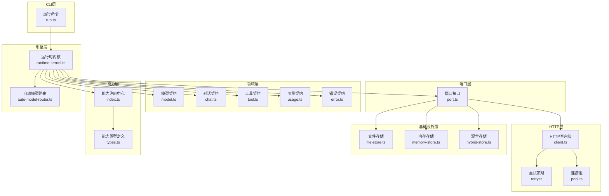
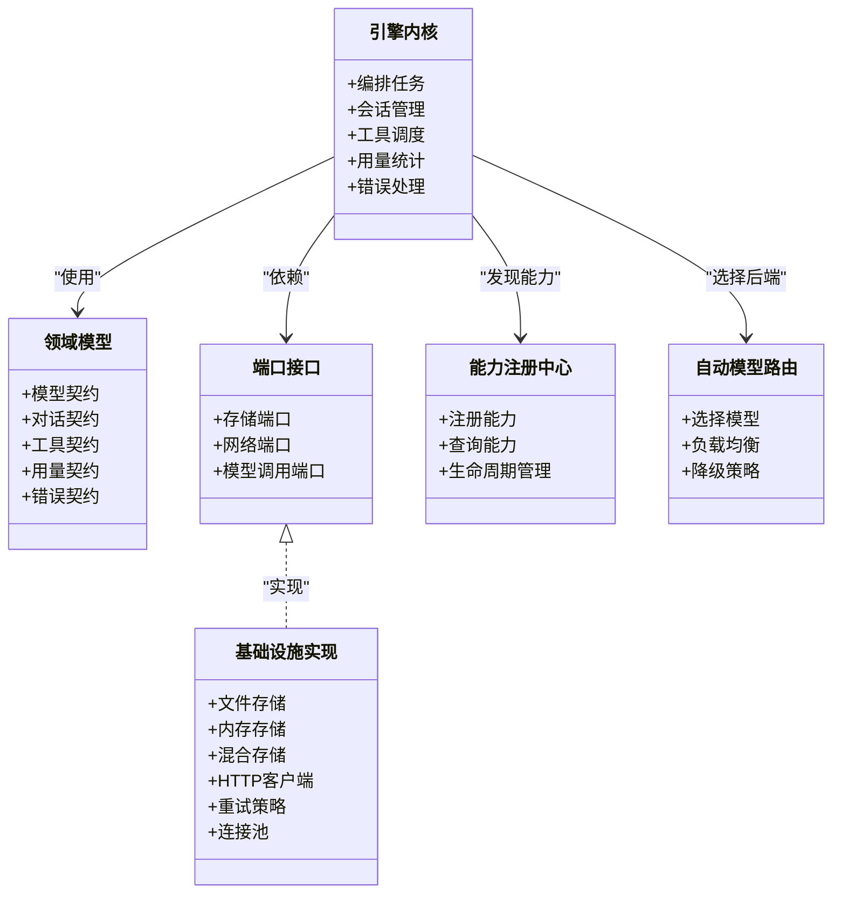
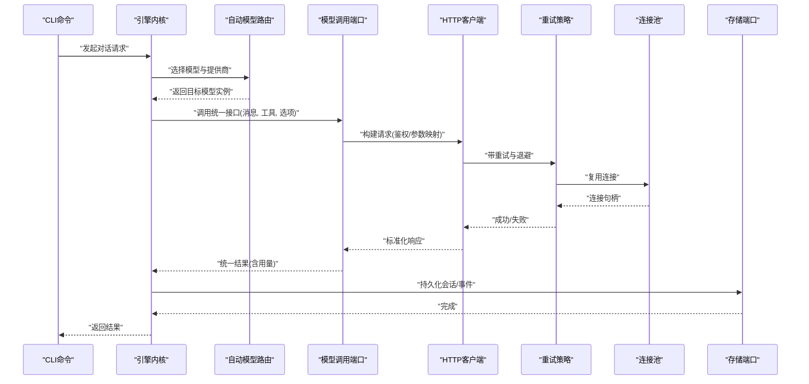
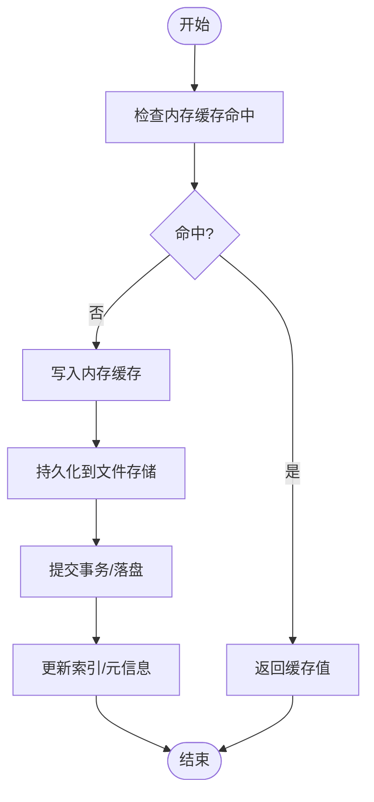
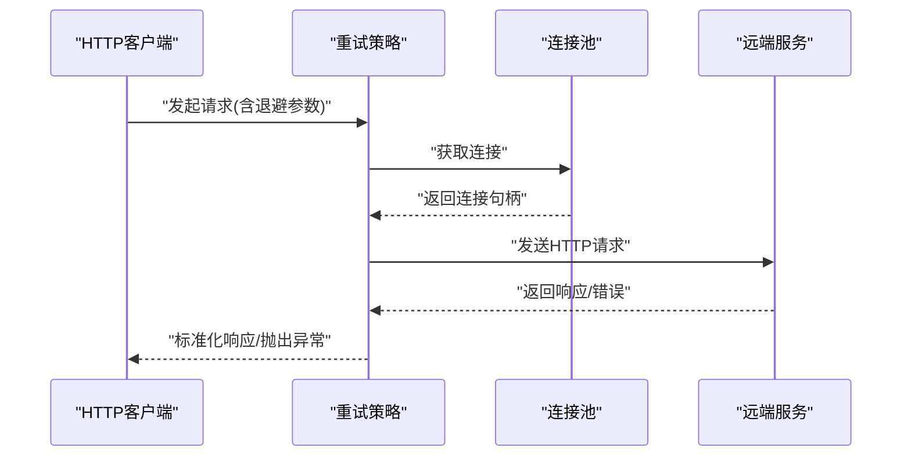
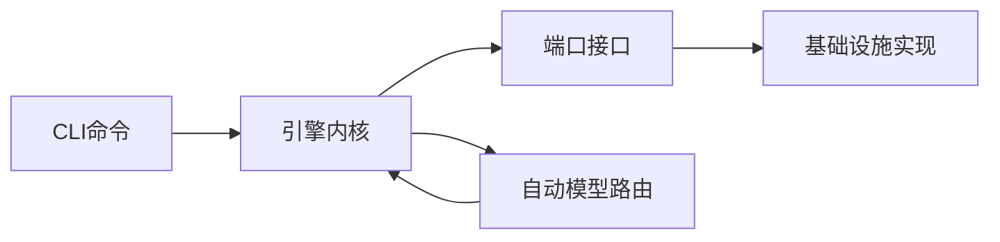

# 适配器模式实现

<cite>
**本文引用的文件**   
- [engine/packages/adapters/README.md](file://engine/packages/adapters/README.md)
- [engine/packages/domain-layer/src/models/model.ts](file://engine/packages/domain-layer/src/models/model.ts)
- [engine/packages/domain-layer/src/models/chat.ts](file://engine/packages/domain-layer/src/models/chat.ts)
- [engine/packages/domain-layer/src/models/tool.ts](file://engine/packages/domain-layer/src/models/tool.ts)
- [engine/packages/domain-layer/src/models/usage.ts](file://engine/packages/domain-layer/src/models/usage.ts)
- [engine/packages/domain-layer/src/models/error.ts](file://engine/packages/domain-layer/src/models/error.ts)
- [engine/packages/capabilities/src/index.ts](file://engine/packages/capabilities/src/index.ts)
- [engine/packages/capabilities/src/types.ts](file://engine/packages/capabilities/src/types.ts)
- [engine/packages/http-layer/src/client.ts](file://engine/packages/http-layer/src/client.ts)
- [engine/packages/http-layer/src/retry.ts](file://engine/packages/http-layer/src/retry.ts)
- [engine/packages/http-layer/src/pool.ts](file://engine/packages/http-layer/src/pool.ts)
- [engine/packages/infrastructure/src/storage/file-store.ts](file://engine/packages/infrastructure/src/storage/file-store.ts)
- [engine/packages/infrastructure/src/storage/memory-store.ts](file://engine/packages/infrastructure/src/storage/memory-store.ts)
- [engine/packages/infrastructure/src/storage/hybrid-store.ts](file://engine/packages/infrastructure/src/storage/hybrid-store.ts)
- [engine/packages/ports-layer/src/port.ts](file://engine/packages/ports-layer/src/port.ts)
- [engine/packages/engine/src/runtime-kernel.ts](file://engine/packages/engine/src/runtime-kernel.ts)
- [engine/packages/engine/src/auto-model-router.ts](file://engine/packages/engine/src/auto-model-router.ts)
- [engine/packages/cli-layer/src/commands/run.ts](file://engine/packages/cli-layer/src/commands/run.ts)
- [engine/tests/model-client.test.ts](file://engine/tests/model-client.test.ts)
- [engine/tests/cache.test.ts](file://engine/tests/cache.test.ts)
- [engine/tests/hybrid-store.test.ts](file://engine/tests/hybrid-store.test.ts)
- [engine/tests/auto-model-router.test.ts](file://engine/tests/auto-model-router.test.ts)
</cite>

## 目录
1. [简介](#简介)
2. [项目结构](#项目结构)
3. [核心组件](#核心组件)
4. [架构总览](#架构总览)
5. [详细组件分析](#详细组件分析)
6. [依赖关系分析](#依赖关系分析)
7. [性能考量](#性能考量)
8. [故障排查指南](#故障排查指南)
9. [结论](#结论)
10. [附录](#附录)

## 简介
本文件围绕KCoder引擎的“适配器模式”实现，系统性阐述其设计理念与架构原则：统一接口抽象、依赖倒置（DIP）、开闭原则（OCP）在LLM提供商适配、存储适配与网络适配中的落地方式。文档同时给出如何开发新适配器插件与集成第三方服务的实践路径，并辅以架构图、时序图与流程图帮助读者快速理解与上手。

## 项目结构
KCoder采用多包工作区组织，适配器相关能力分布在以下包中：
- 领域层（domain-layer）：定义模型、对话、工具、用量、错误等核心领域模型与契约
- 端口层（ports-layer）：定义外部系统访问的端口接口（如存储、网络、模型调用）
- HTTP层（http-layer）：封装HTTP客户端、重试策略、连接池等通用网络能力
- 基础设施层（infrastructure）：提供文件存储、内存存储、混合存储等具体实现
- 能力层（capabilities）：注册与管理能力集，为上层编排提供可插拔能力
- 引擎层（engine）：运行时内核、自动路由、任务执行等核心编排逻辑
- CLI层（cli-layer）：命令行入口，驱动运行流程
- 测试（tests）：覆盖关键路径与边界场景

图表来源
- [engine/packages/domain-layer/src/models/model.ts](file://engine/packages/domain-layer/src/models/model.ts)
- [engine/packages/domain-layer/src/models/chat.ts](file://engine/packages/domain-layer/src/models/chat.ts)
- [engine/packages/domain-layer/src/models/tool.ts](file://engine/packages/domain-layer/src/models/tool.ts)
- [engine/packages/domain-layer/src/models/usage.ts](file://engine/packages/domain-layer/src/models/usage.ts)
- [engine/packages/domain-layer/src/models/error.ts](file://engine/packages/domain-layer/src/models/error.ts)
- [engine/packages/ports-layer/src/port.ts](file://engine/packages/ports-layer/src/port.ts)
- [engine/packages/http-layer/src/client.ts](file://engine/packages/http-layer/src/client.ts)
- [engine/packages/http-layer/src/retry.ts](file://engine/packages/http-layer/src/retry.ts)
- [engine/packages/http-layer/src/pool.ts](file://engine/packages/http-layer/src/pool.ts)
- [engine/packages/infrastructure/src/storage/file-store.ts](file://engine/packages/infrastructure/src/storage/file-store.ts)
- [engine/packages/infrastructure/src/storage/memory-store.ts](file://engine/packages/infrastructure/src/storage/memory-store.ts)
- [engine/packages/infrastructure/src/storage/hybrid-store.ts](file://engine/packages/infrastructure/src/storage/hybrid-store.ts)
- [engine/packages/capabilities/src/index.ts](file://engine/packages/capabilities/src/index.ts)
- [engine/packages/capabilities/src/types.ts](file://engine/packages/capabilities/src/types.ts)
- [engine/packages/engine/src/runtime-kernel.ts](file://engine/packages/engine/src/runtime-kernel.ts)
- [engine/packages/engine/src/auto-model-router.ts](file://engine/packages/engine/src/auto-model-router.ts)
- [engine/packages/cli-layer/src/commands/run.ts](file://engine/packages/cli-layer/src/commands/run.ts)

章节来源
- [engine/packages/adapters/README.md](file://engine/packages/adapters/README.md)

## 核心组件
- 领域契约（Domain Contracts）
  - 模型契约：统一描述模型元数据、能力与参数约束
  - 对话契约：统一消息结构、上下文窗口、流式与非流式响应
  - 工具契约：统一工具签名、参数校验与结果归一化
  - 用量契约：统一Token计数、费用统计与配额控制
  - 错误契约：统一错误码、错误分类与恢复建议
- 端口接口（Ports）
  - 存储端口：定义持久化、缓存、查询与事务语义
  - 网络端口：定义HTTP请求、重试、超时、限流与连接池
  - 模型调用端口：定义LLM调用的统一入口与返回形态
- 基础设施实现（Infrastructure）
  - 文件存储：基于磁盘的持久化与快照
  - 内存存储：进程内缓存与临时状态
  - 混合存储：热路径走内存，冷路径落盘，兼顾性能与可靠性
- 能力注册中心（Capabilities）
  - 动态发现与注册能力，支持按环境或配置启用/禁用
- 引擎内核（Runtime Kernel）
  - 编排任务、会话、工具调用、用量统计与错误处理
  - 通过自动路由选择合适模型与后端
- CLI入口（CLI Layer）
  - 解析参数、加载配置、启动内核与输出结果

章节来源
- [engine/packages/domain-layer/src/models/model.ts](file://engine/packages/domain-layer/src/models/model.ts)
- [engine/packages/domain-layer/src/models/chat.ts](file://engine/packages/domain-layer/src/models/chat.ts)
- [engine/packages/domain-layer/src/models/tool.ts](file://engine/packages/domain-layer/src/models/tool.ts)
- [engine/packages/domain-layer/src/models/usage.ts](file://engine/packages/domain-layer/src/models/usage.ts)
- [engine/packages/domain-layer/src/models/error.ts](file://engine/packages/domain-layer/src/models/error.ts)
- [engine/packages/ports-layer/src/port.ts](file://engine/packages/ports-layer/src/port.ts)
- [engine/packages/infrastructure/src/storage/file-store.ts](file://engine/packages/infrastructure/src/storage/file-store.ts)
- [engine/packages/infrastructure/src/storage/memory-store.ts](file://engine/packages/infrastructure/src/storage/memory-store.ts)
- [engine/packages/infrastructure/src/storage/hybrid-store.ts](file://engine/packages/infrastructure/src/storage/hybrid-store.ts)
- [engine/packages/capabilities/src/index.ts](file://engine/packages/capabilities/src/index.ts)
- [engine/packages/capabilities/src/types.ts](file://engine/packages/capabilities/src/types.ts)
- [engine/packages/engine/src/runtime-kernel.ts](file://engine/packages/engine/src/runtime-kernel.ts)
- [engine/packages/engine/src/auto-model-router.ts](file://engine/packages/engine/src/auto-model-router.ts)
- [engine/packages/cli-layer/src/commands/run.ts](file://engine/packages/cli-layer/src/commands/run.ts)

## 架构总览
适配器模式在本工程中的体现：
- 统一接口抽象：所有LLM提供商、存储与网络访问均通过端口层暴露稳定接口
- 依赖倒置：上层仅依赖端口接口，不依赖具体实现；具体实现由容器或工厂注入
- 开闭原则：新增提供商或存储后端无需修改现有代码，只需实现对应端口并注册

图表来源
- [engine/packages/domain-layer/src/models/model.ts](file://engine/packages/domain-layer/src/models/model.ts)
- [engine/packages/domain-layer/src/models/chat.ts](file://engine/packages/domain-layer/src/models/chat.ts)
- [engine/packages/domain-layer/src/models/tool.ts](file://engine/packages/domain-layer/src/models/tool.ts)
- [engine/packages/domain-layer/src/models/usage.ts](file://engine/packages/domain-layer/src/models/usage.ts)
- [engine/packages/domain-layer/src/models/error.ts](file://engine/packages/domain-layer/src/models/error.ts)
- [engine/packages/ports-layer/src/port.ts](file://engine/packages/ports-layer/src/port.ts)
- [engine/packages/infrastructure/src/storage/file-store.ts](file://engine/packages/infrastructure/src/storage/file-store.ts)
- [engine/packages/infrastructure/src/storage/memory-store.ts](file://engine/packages/infrastructure/src/storage/memory-store.ts)
- [engine/packages/infrastructure/src/storage/hybrid-store.ts](file://engine/packages/infrastructure/src/storage/hybrid-store.ts)
- [engine/packages/http-layer/src/client.ts](file://engine/packages/http-layer/src/client.ts)
- [engine/packages/http-layer/src/retry.ts](file://engine/packages/http-layer/src/retry.ts)
- [engine/packages/http-layer/src/pool.ts](file://engine/packages/http-layer/src/pool.ts)
- [engine/packages/capabilities/src/index.ts](file://engine/packages/capabilities/src/index.ts)
- [engine/packages/capabilities/src/types.ts](file://engine/packages/capabilities/src/types.ts)
- [engine/packages/engine/src/runtime-kernel.ts](file://engine/packages/engine/src/runtime-kernel.ts)
- [engine/packages/engine/src/auto-model-router.ts](file://engine/packages/engine/src/auto-model-router.ts)

## 详细组件分析

### LLM提供商适配器（统一接口封装）
- 设计要点
  - 通过“模型调用端口”抽象不同厂商的API差异（鉴权、参数映射、流式协议、错误码）
  - 自动模型路由根据能力、配额、延迟与成本进行决策
  - 用量契约统一Token统计与计费口径
- 典型流程（以一次对话为例）

图表来源
- [engine/packages/engine/src/runtime-kernel.ts](file://engine/packages/engine/src/runtime-kernel.ts)
- [engine/packages/engine/src/auto-model-router.ts](file://engine/packages/engine/src/auto-model-router.ts)
- [engine/packages/ports-layer/src/port.ts](file://engine/packages/ports-layer/src/port.ts)
- [engine/packages/http-layer/src/client.ts](file://engine/packages/http-layer/src/client.ts)
- [engine/packages/http-layer/src/retry.ts](file://engine/packages/http-layer/src/retry.ts)
- [engine/packages/http-layer/src/pool.ts](file://engine/packages/http-layer/src/pool.ts)
- [engine/packages/infrastructure/src/storage/hybrid-store.ts](file://engine/packages/infrastructure/src/storage/hybrid-store.ts)

章节来源
- [engine/packages/engine/src/auto-model-router.ts](file://engine/packages/engine/src/auto-model-router.ts)
- [engine/packages/engine/src/runtime-kernel.ts](file://engine/packages/engine/src/runtime-kernel.ts)
- [engine/packages/ports-layer/src/port.ts](file://engine/packages/ports-layer/src/port.ts)
- [engine/packages/http-layer/src/client.ts](file://engine/packages/http-layer/src/client.ts)
- [engine/packages/http-layer/src/retry.ts](file://engine/packages/http-layer/src/retry.ts)
- [engine/packages/http-layer/src/pool.ts](file://engine/packages/http-layer/src/pool.ts)
- [engine/packages/infrastructure/src/storage/hybrid-store.ts](file://engine/packages/infrastructure/src/storage/hybrid-store.ts)

### 存储适配器（持久化、缓存与混合策略）
- 设计要点
  - 存储端口定义统一的CRUD、批量操作、事务与查询语义
  - 内存存储用于热点数据与短期状态
  - 文件存储用于持久化与快照恢复
  - 混合存储将热路径置于内存，冷路径落盘，并提供一致性保障
- 算法流程（写入路径）

图表来源
- [engine/packages/infrastructure/src/storage/memory-store.ts](file://engine/packages/infrastructure/src/storage/memory-store.ts)
- [engine/packages/infrastructure/src/storage/file-store.ts](file://engine/packages/infrastructure/src/storage/file-store.ts)
- [engine/packages/infrastructure/src/storage/hybrid-store.ts](file://engine/packages/infrastructure/src/storage/hybrid-store.ts)

章节来源
- [engine/packages/infrastructure/src/storage/memory-store.ts](file://engine/packages/infrastructure/src/storage/memory-store.ts)
- [engine/packages/infrastructure/src/storage/file-store.ts](file://engine/packages/infrastructure/src/storage/file-store.ts)
- [engine/packages/infrastructure/src/storage/hybrid-store.ts](file://engine/packages/infrastructure/src/storage/hybrid-store.ts)

### 网络适配器（HTTP客户端、重试与连接池）
- 设计要点
  - HTTP客户端负责请求构建、序列化、鉴权头注入与响应标准化
  - 重试策略支持指数退避、抖动与幂等判断
  - 连接池管理并发、复用与资源回收，避免频繁握手开销
- 关键交互

图表来源
- [engine/packages/http-layer/src/client.ts](file://engine/packages/http-layer/src/client.ts)
- [engine/packages/http-layer/src/retry.ts](file://engine/packages/http-layer/src/retry.ts)
- [engine/packages/http-layer/src/pool.ts](file://engine/packages/http-layer/src/pool.ts)

章节来源
- [engine/packages/http-layer/src/client.ts](file://engine/packages/http-layer/src/client.ts)
- [engine/packages/http-layer/src/retry.ts](file://engine/packages/http-layer/src/retry.ts)
- [engine/packages/http-layer/src/pool.ts](file://engine/packages/http-layer/src/pool.ts)

### 能力注册中心（可插拔能力）
- 设计要点
  - 通过类型定义明确能力边界
  - 注册中心提供能力发现、生命周期管理与按需启用
- 适用场景
  - 动态启用/禁用特定功能（如搜索、绘图、代码执行）
  - 按环境或租户切换能力集合

章节来源
- [engine/packages/capabilities/src/types.ts](file://engine/packages/capabilities/src/types.ts)
- [engine/packages/capabilities/src/index.ts](file://engine/packages/capabilities/src/index.ts)

### 引擎内核与自动路由
- 引擎内核
  - 编排任务、会话、工具调用、用量统计与错误处理
  - 通过端口层解耦外部依赖
- 自动模型路由
  - 依据模型能力、配额、延迟与成本进行决策
  - 支持降级与回退策略

章节来源
- [engine/packages/engine/src/runtime-kernel.ts](file://engine/packages/engine/src/runtime-kernel.ts)
- [engine/packages/engine/src/auto-model-router.ts](file://engine/packages/engine/src/auto-model-router.ts)

### CLI入口
- 解析参数、加载配置、启动内核与输出结果
- 作为用户与引擎之间的桥梁，屏蔽底层复杂性

章节来源
- [engine/packages/cli-layer/src/commands/run.ts](file://engine/packages/cli-layer/src/commands/run.ts)

## 依赖关系分析
- 耦合与内聚
  - 引擎内核仅依赖端口接口，内聚于业务编排
  - 基础设施实现高度内聚于各自职责（存储、网络）
- 直接/间接依赖
  - CLI -> 引擎内核 -> 端口 -> 基础设施
  - 自动路由 -> 引擎内核 -> 模型调用端口
- 外部依赖与集成点
  - HTTP层对接第三方API
  - 存储层对接文件系统与内存
- 接口契约与实现细节
  - 领域契约保证跨层一致性
  - 端口契约保证可替换性

图表来源
- [engine/packages/cli-layer/src/commands/run.ts](file://engine/packages/cli-layer/src/commands/run.ts)
- [engine/packages/engine/src/runtime-kernel.ts](file://engine/packages/engine/src/runtime-kernel.ts)
- [engine/packages/engine/src/auto-model-router.ts](file://engine/packages/engine/src/auto-model-router.ts)
- [engine/packages/ports-layer/src/port.ts](file://engine/packages/ports-layer/src/port.ts)
- [engine/packages/infrastructure/src/storage/hybrid-store.ts](file://engine/packages/infrastructure/src/storage/hybrid-store.ts)

章节来源
- [engine/packages/cli-layer/src/commands/run.ts](file://engine/packages/cli-layer/src/commands/run.ts)
- [engine/packages/engine/src/runtime-kernel.ts](file://engine/packages/engine/src/runtime-kernel.ts)
- [engine/packages/engine/src/auto-model-router.ts](file://engine/packages/engine/src/auto-model-router.ts)
- [engine/packages/ports-layer/src/port.ts](file://engine/packages/ports-layer/src/port.ts)
- [engine/packages/infrastructure/src/storage/hybrid-store.ts](file://engine/packages/infrastructure/src/storage/hybrid-store.ts)

## 性能考量
- 连接池复用减少握手开销，提升吞吐
- 重试与退避降低瞬时失败影响，提高稳定性
- 混合存储平衡读写延迟与持久化可靠性
- 自动路由结合延迟与成本指标优化整体时延与费用
- 用量统计与配额控制避免超用与雪崩

[本节为通用指导，不涉及具体文件分析]

## 故障排查指南
- 常见问题定位
  - 模型调用失败：检查鉴权、参数映射、错误码归一化
  - 存储不一致：检查事务提交、索引更新与缓存失效
  - 网络超时/限流：检查重试策略、退避参数与连接池大小
- 调试建议
  - 开启详细日志与追踪
  - 使用最小复现用例与断点
  - 对比不同提供商的行为差异

章节来源
- [engine/packages/domain-layer/src/models/error.ts](file://engine/packages/domain-layer/src/models/error.ts)
- [engine/packages/http-layer/src/retry.ts](file://engine/packages/http-layer/src/retry.ts)
- [engine/packages/infrastructure/src/storage/hybrid-store.ts](file://engine/packages/infrastructure/src/storage/hybrid-store.ts)

## 结论
通过适配器模式，KCoder实现了：
- 统一接口抽象，屏蔽各提供商差异
- 依赖倒置，使上层稳定且易扩展
- 开闭原则，新增提供商与存储后端无需改动既有逻辑
- 高性能与高可用：连接池、重试与混合存储协同工作
- 可观测与可维护：清晰的契约与分层结构

[本节为总结，不涉及具体文件分析]

## 附录

### 如何开发新的LLM提供商适配器
- 步骤概览
  - 实现模型调用端口：统一鉴权、参数映射、流式协议与错误码
  - 接入自动模型路由：注册新提供商的能力与权重
  - 补充用量统计：遵循用量契约上报Token与费用
  - 编写测试：覆盖正常、异常与边界场景
- 参考路径
  - 模型调用端口与领域契约
  - 自动模型路由与引擎内核
  - 测试用例参考

章节来源
- [engine/packages/ports-layer/src/port.ts](file://engine/packages/ports-layer/src/port.ts)
- [engine/packages/domain-layer/src/models/model.ts](file://engine/packages/domain-layer/src/models/model.ts)
- [engine/packages/domain-layer/src/models/usage.ts](file://engine/packages/domain-layer/src/models/usage.ts)
- [engine/packages/engine/src/auto-model-router.ts](file://engine/packages/engine/src/auto-model-router.ts)
- [engine/tests/model-client.test.ts](file://engine/tests/model-client.test.ts)

### 如何开发新的存储适配器
- 步骤概览
  - 实现存储端口：CRUD、批量、事务与查询语义
  - 选择实现：内存、文件或混合
  - 确保一致性与幂等：原子写入、索引更新与回滚
  - 编写测试：覆盖并发、崩溃恢复与容量限制
- 参考路径
  - 存储端口与领域契约
  - 现有实现：文件、内存、混合
  - 测试用例参考

章节来源
- [engine/packages/ports-layer/src/port.ts](file://engine/packages/ports-layer/src/port.ts)
- [engine/packages/infrastructure/src/storage/file-store.ts](file://engine/packages/infrastructure/src/storage/file-store.ts)
- [engine/packages/infrastructure/src/storage/memory-store.ts](file://engine/packages/infrastructure/src/storage/memory-store.ts)
- [engine/packages/infrastructure/src/storage/hybrid-store.ts](file://engine/packages/infrastructure/src/storage/hybrid-store.ts)
- [engine/tests/cache.test.ts](file://engine/tests/cache.test.ts)
- [engine/tests/hybrid-store.test.ts](file://engine/tests/hybrid-store.test.ts)

### 如何集成第三方服务（网络适配器）
- 步骤概览
  - 在HTTP层封装第三方SDK或REST API
  - 配置重试、超时与连接池参数
  - 标准化错误码与响应体
  - 编写端到端测试与压测用例
- 参考路径
  - HTTP客户端、重试与连接池
  - 领域错误契约

章节来源
- [engine/packages/http-layer/src/client.ts](file://engine/packages/http-layer/src/client.ts)
- [engine/packages/http-layer/src/retry.ts](file://engine/packages/http-layer/src/retry.ts)
- [engine/packages/http-layer/src/pool.ts](file://engine/packages/http-layer/src/pool.ts)
- [engine/packages/domain-layer/src/models/error.ts](file://engine/packages/domain-layer/src/models/error.ts)