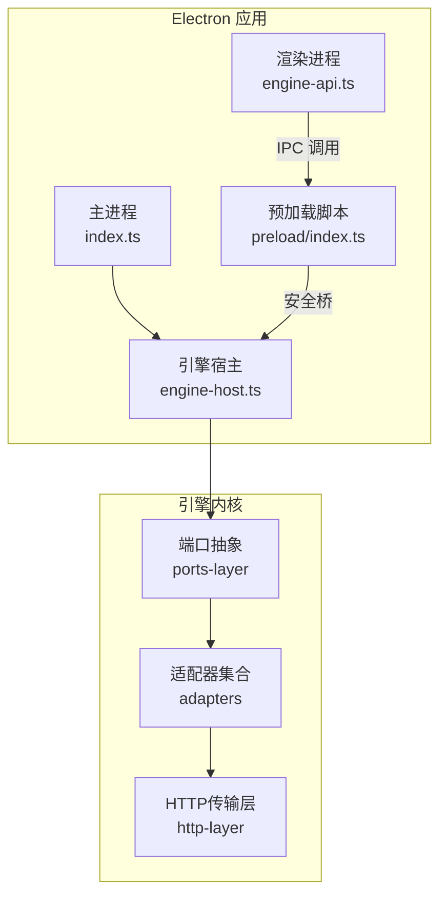
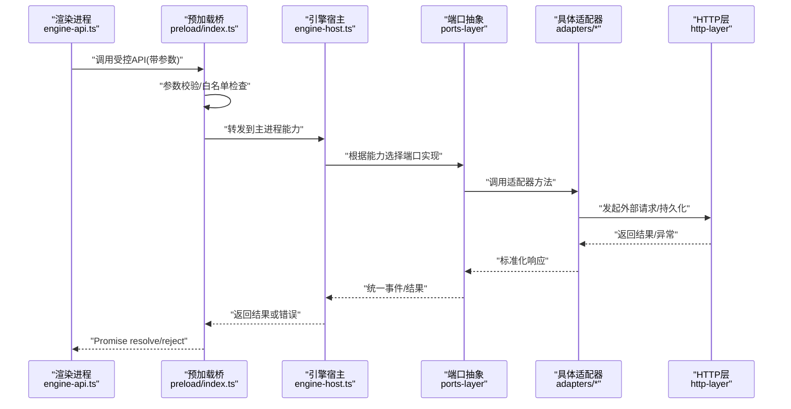
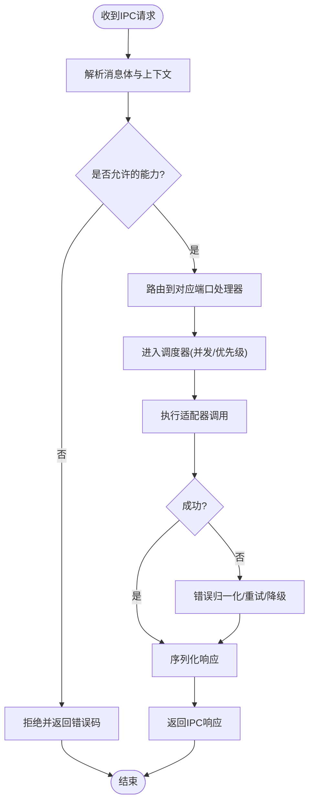
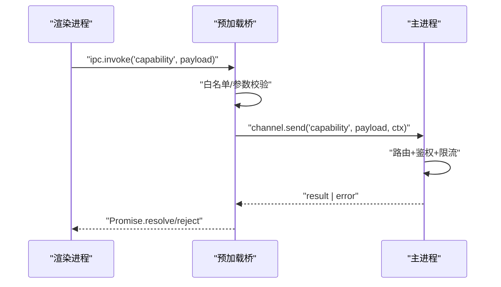
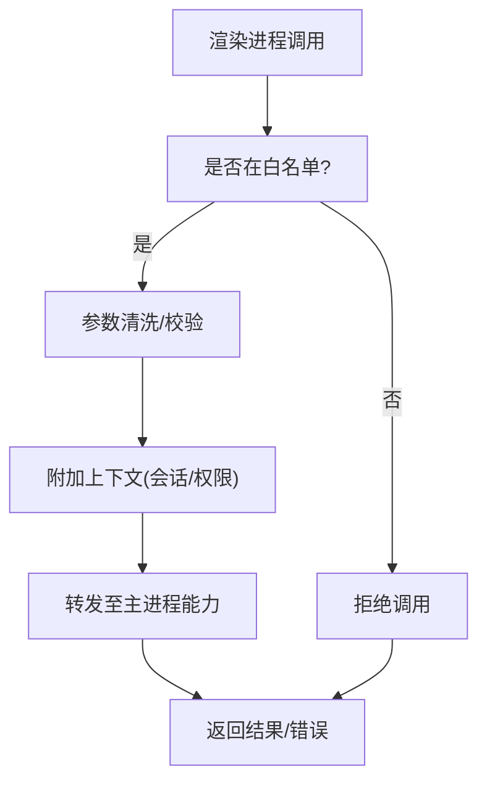
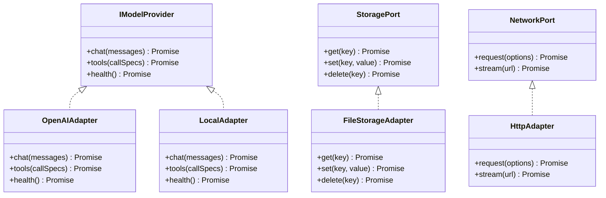
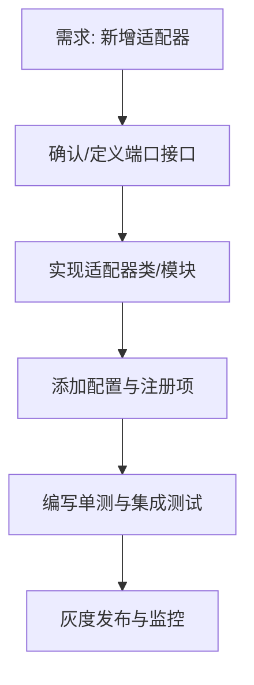
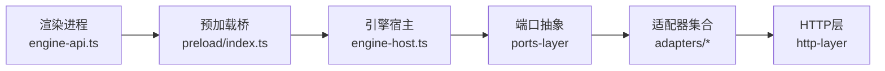

# 适配层（Adapter Layer）

<cite>
**本文引用的文件**   
- [app/main/engine-host.ts](file://app/main/engine-host.ts)
- [app/main/index.ts](file://app/main/index.ts)
- [app/preload/index.ts](file://app/preload/index.ts)
- [app/renderer/src/services/engine-api.ts](file://app/renderer/src/services/engine-api.ts)
- [engine/packages/adapters/README.md](file://engine/packages/adapters/README.md)
- [engine/packages/http-layer/README.md](file://engine/packages/http-layer/README.md)
- [engine/packages/ports-layer/README.md](file://engine/packages/ports-layer/README.md)
</cite>

## 目录
1. [简介](#简介)
2. [项目结构](#项目结构)
3. [核心组件](#核心组件)
4. [架构总览](#架构总览)
5. [详细组件分析](#详细组件分析)
6. [依赖关系分析](#依赖关系分析)
7. [性能考量](#性能考量)
8. [故障排查指南](#故障排查指南)
9. [结论](#结论)
10. [附录](#附录)

## 简介
本文件聚焦于KCoder的“适配层”，围绕以下目标展开：
- 解释Engine Host的核心职责：引擎生命周期管理、进程间通信桥接与资源调度。
- 说明Electron主进程与渲染进程的IPC通信机制，包括消息协议、错误处理与安全策略。
- 阐述预加载脚本的安全隔离与API暴露策略。
- 解析适配器模式在外部服务集成中的应用（LLM提供商、存储、网络），并提供扩展新适配器的实践指引。

## 项目结构
KCoder采用多包工程组织，适配层横跨应用层（Electron）与引擎层（packages）。关键路径如下：
- Electron主进程入口与引擎宿主：app/main/index.ts、app/main/engine-host.ts
- 预加载安全桥：app/preload/index.ts
- 渲染进程对引擎的调用封装：app/renderer/src/services/engine-api.ts
- 引擎侧适配器与端口抽象：engine/packages/adapters、engine/packages/ports-layer、engine/packages/http-layer

图表来源
- [app/main/index.ts](file://app/main/index.ts)
- [app/main/engine-host.ts](file://app/main/engine-host.ts)
- [app/preload/index.ts](file://app/preload/index.ts)
- [app/renderer/src/services/engine-api.ts](file://app/renderer/src/services/engine-api.ts)
- [engine/packages/ports-layer/README.md](file://engine/packages/ports-layer/README.md)
- [engine/packages/adapters/README.md](file://engine/packages/adapters/README.md)
- [engine/packages/http-layer/README.md](file://engine/packages/http-layer/README.md)

章节来源
- [app/main/index.ts](file://app/main/index.ts)
- [app/main/engine-host.ts](file://app/main/engine-host.ts)
- [app/preload/index.ts](file://app/preload/index.ts)
- [app/renderer/src/services/engine-api.ts](file://app/renderer/src/services/engine-api.ts)
- [engine/packages/ports-layer/README.md](file://engine/packages/ports-layer/README.md)
- [engine/packages/adapters/README.md](file://engine/packages/adapters/README.md)
- [engine/packages/http-layer/README.md](file://engine/packages/http-layer/README.md)

## 核心组件
本节从职责边界出发，梳理适配层的关键构件及其交互。

- 引擎宿主（Engine Host）
  - 负责引擎实例的创建、启动、停止与重启；维护运行期状态与上下文。
  - 作为主进程与引擎之间的桥接点，统一转发IPC请求到引擎能力。
  - 协调资源分配（如并发限制、超时控制、重试策略等）。

- IPC 安全桥（预加载脚本）
  - 将受限的Node/Electron API以白名单形式暴露给渲染进程。
  - 对传入参数进行校验与过滤，避免危险操作泄露。
  - 为每次调用附加上下文（如会话ID、权限标记），便于审计与限流。

- 渲染进程服务（engine-api.ts）
  - 提供面向UI的异步方法，内部通过预加载桥调用主进程能力。
  - 封装错误码、重试与降级逻辑，保证UI体验稳定。

- 引擎端口与适配器（ports-layer + adapters）
  - 端口定义对外部能力的抽象契约（如模型调用、存储读写、网络访问）。
  - 适配器实现具体第三方服务或本地实现，遵循同一接口。
  - HTTP层提供统一的请求构建、鉴权、重试与可观测性。

章节来源
- [app/main/engine-host.ts](file://app/main/engine-host.ts)
- [app/preload/index.ts](file://app/preload/index.ts)
- [app/renderer/src/services/engine-api.ts](file://app/renderer/src/services/engine-api.ts)
- [engine/packages/ports-layer/README.md](file://engine/packages/ports-layer/README.md)
- [engine/packages/adapters/README.md](file://engine/packages/adapters/README.md)
- [engine/packages/http-layer/README.md](file://engine/packages/http-layer/README.md)

## 架构总览
下图展示了从渲染进程发起调用，经预加载桥到达引擎宿主，再由端口路由至具体适配器的完整链路。

图表来源
- [app/renderer/src/services/engine-api.ts](file://app/renderer/src/services/engine-api.ts)
- [app/preload/index.ts](file://app/preload/index.ts)
- [app/main/engine-host.ts](file://app/main/engine-host.ts)
- [engine/packages/ports-layer/README.md](file://engine/packages/ports-layer/README.md)
- [engine/packages/adapters/README.md](file://engine/packages/adapters/README.md)
- [engine/packages/http-layer/README.md](file://engine/packages/http-layer/README.md)

## 详细组件分析

### 引擎宿主（Engine Host）
- 生命周期管理
  - 初始化：加载配置、注册端口与适配器、建立日志与监控。
  - 启动：按需拉起引擎子进程或服务，准备运行时环境。
  - 停止：优雅关闭连接、释放资源、持久化必要状态。
  - 重启：支持热重载与故障恢复。
- IPC桥接
  - 接收来自预加载的消息，按能力路由到对应处理器。
  - 统一序列化/反序列化，附加追踪ID与上下文。
- 资源调度
  - 并发控制：限制并行任务数，防止过载。
  - 超时与重试：为外部调用设置超时与退避策略。
  - 优先级队列：区分交互式与非交互式任务。

图表来源
- [app/main/engine-host.ts](file://app/main/engine-host.ts)

章节来源
- [app/main/engine-host.ts](file://app/main/engine-host.ts)

### Electron IPC 通信机制（主进程 ↔ 渲染进程）
- 消息传递协议
  - 基于通道命名空间的能力调用，每个能力有唯一名称与参数契约。
  - 请求包含：能力名、参数、上下文（用户/会话/权限）、追踪ID。
  - 响应包含：数据、错误码、诊断信息。
- 错误处理
  - 统一错误类型映射，区分客户端错误、服务端错误与网络错误。
  - 支持重试与回退策略，必要时返回部分结果。
- 安全性考虑
  - 仅暴露白名单能力，禁止直接访问文件系统或系统API。
  - 参数校验与大小限制，防止注入与DoS。
  - 敏感字段脱敏输出，记录最小必要审计信息。

图表来源
- [app/preload/index.ts](file://app/preload/index.ts)
- [app/main/engine-host.ts](file://app/main/engine-host.ts)
- [app/renderer/src/services/engine-api.ts](file://app/renderer/src/services/engine-api.ts)

章节来源
- [app/preload/index.ts](file://app/preload/index.ts)
- [app/main/engine-host.ts](file://app/main/engine-host.ts)
- [app/renderer/src/services/engine-api.ts](file://app/renderer/src/services/engine-api.ts)

### 预加载脚本的安全隔离与API暴露策略
- 安全隔离
  - 禁用Node集成或严格沙箱，仅开放受控API。
  - 对输入做类型与范围校验，拒绝非法值。
- API暴露策略
  - 白名单清单：明确列出可暴露的方法名与参数签名。
  - 上下文注入：自动附加会话、租户、权限标签。
  - 审计与限流：记录调用轨迹，限制频率与配额。

图表来源
- [app/preload/index.ts](file://app/preload/index.ts)

章节来源
- [app/preload/index.ts](file://app/preload/index.ts)

### 适配器模式在外部服务集成中的应用
- 设计要点
  - 端口（Port）定义稳定的抽象接口，屏蔽外部差异。
  - 适配器（Adapter）实现具体厂商或本地实现，遵循同一契约。
  - 工厂/注册表集中管理适配器实例，支持动态切换与A/B测试。
- 典型场景
  - LLM提供商适配：不同模型的对话/工具调用协议差异由适配器收敛。
  - 存储适配器：SQLite、文件、对象存储的统一读写接口。
  - 网络适配器：HTTP/HTTPS、代理、重试与熔断的统一封装。

图表来源
- [engine/packages/ports-layer/README.md](file://engine/packages/ports-layer/README.md)
- [engine/packages/adapters/README.md](file://engine/packages/adapters/README.md)
- [engine/packages/http-layer/README.md](file://engine/packages/http-layer/README.md)

章节来源
- [engine/packages/ports-layer/README.md](file://engine/packages/ports-layer/README.md)
- [engine/packages/adapters/README.md](file://engine/packages/adapters/README.md)
- [engine/packages/http-layer/README.md](file://engine/packages/http-layer/README.md)

### 如何扩展新的适配器（实践步骤）
以下为通用流程，适用于新增LLM提供商、存储或网络适配器：
- 定义或复用端口接口
  - 在端口层声明方法签名与错误约定。
- 实现适配器
  - 遵循端口契约，处理鉴权、重试、超时与可观测性。
  - 将外部差异转换为统一的数据模型。
- 注册适配器
  - 在工厂或配置中注册新适配器，支持按环境或特性开关切换。
- 端到端验证
  - 编写单元测试覆盖正常路径与异常路径。
  - 使用集成测试验证真实外部依赖行为。

[此图为概念流程图，不直接映射具体源码文件]

## 依赖关系分析
- 耦合与内聚
  - 引擎宿主与端口层低耦合，通过接口解耦具体实现。
  - 预加载桥与渲染进程高内聚，共同维护安全边界。
- 外部依赖
  - HTTP层依赖网络栈与TLS库。
  - 各适配器依赖各自的外部SDK或协议。
- 潜在循环依赖
  - 通过端口抽象避免适配器反向依赖上层。

图表来源
- [app/renderer/src/services/engine-api.ts](file://app/renderer/src/services/engine-api.ts)
- [app/preload/index.ts](file://app/preload/index.ts)
- [app/main/engine-host.ts](file://app/main/engine-host.ts)
- [engine/packages/ports-layer/README.md](file://engine/packages/ports-layer/README.md)
- [engine/packages/adapters/README.md](file://engine/packages/adapters/README.md)
- [engine/packages/http-layer/README.md](file://engine/packages/http-layer/README.md)

章节来源
- [app/renderer/src/services/engine-api.ts](file://app/renderer/src/services/engine-api.ts)
- [app/preload/index.ts](file://app/preload/index.ts)
- [app/main/engine-host.ts](file://app/main/engine-host.ts)
- [engine/packages/ports-layer/README.md](file://engine/packages/ports-layer/README.md)
- [engine/packages/adapters/README.md](file://engine/packages/adapters/README.md)
- [engine/packages/http-layer/README.md](file://engine/packages/http-layer/README.md)

## 性能考量
- 批处理与合并：将多次小请求合并，减少IPC与网络往返。
- 连接复用：HTTP连接池与长连接，降低握手开销。
- 缓存策略：热点数据本地缓存，配合失效与一致性策略。
- 背压与限流：在IPC与外部调用两端实施速率限制。
- 可观测性：埋点耗时、失败率与资源占用，辅助容量规划。

## 故障排查指南
- 常见问题定位
  - IPC调用失败：检查通道名、参数校验与白名单。
  - 适配器超时：查看重试次数、退避策略与上游健康状态。
  - 权限不足：核对上下文中的权限标记与租户隔离。
- 诊断手段
  - 启用调试日志与追踪ID，关联上下游调用链。
  - 使用模拟适配器进行离线回归测试。
  - 针对外部依赖增加熔断与快速失败，避免雪崩。

章节来源
- [app/main/engine-host.ts](file://app/main/engine-host.ts)
- [app/preload/index.ts](file://app/preload/index.ts)
- [app/renderer/src/services/engine-api.ts](file://app/renderer/src/services/engine-api.ts)

## 结论
适配层通过清晰的职责划分与严格的IPC安全边界，将复杂的外部服务差异收敛为稳定的内部接口。借助端口与适配器模式，KCoder能够灵活接入多种LLM提供商、存储与网络后端，同时保持内核稳定与可扩展。建议在生产环境中完善可观测性与容错策略，持续优化性能与用户体验。

## 附录
- 术语
  - 端口（Port）：对外部能力的抽象接口。
  - 适配器（Adapter）：实现端口接口的具体方案。
  - 引擎宿主（Engine Host）：主进程中负责引擎生命周期与IPC桥接的组件。
- 参考路径
  - 引擎端口与适配器说明：[engine/packages/ports-layer/README.md](file://engine/packages/ports-layer/README.md)、[engine/packages/adapters/README.md](file://engine/packages/adapters/README.md)
  - HTTP传输层说明：[engine/packages/http-layer/README.md](file://engine/packages/http-layer/README.md)
  - 应用侧入口与桥接：[app/main/index.ts](file://app/main/index.ts)、[app/main/engine-host.ts](file://app/main/engine-host.ts)、[app/preload/index.ts](file://app/preload/index.ts)、[app/renderer/src/services/engine-api.ts](file://app/renderer/src/services/engine-api.ts)