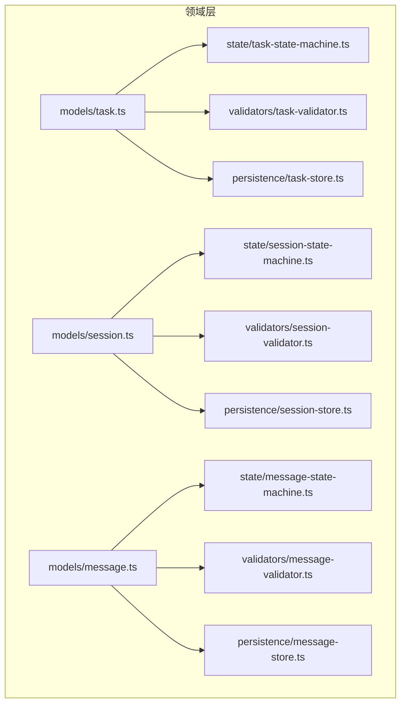
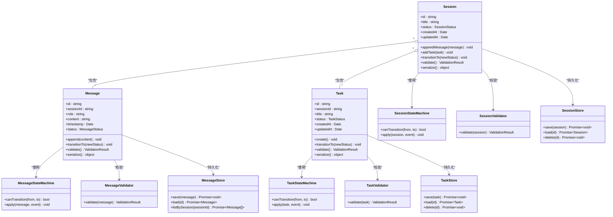
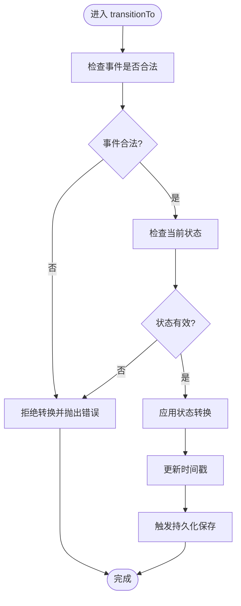
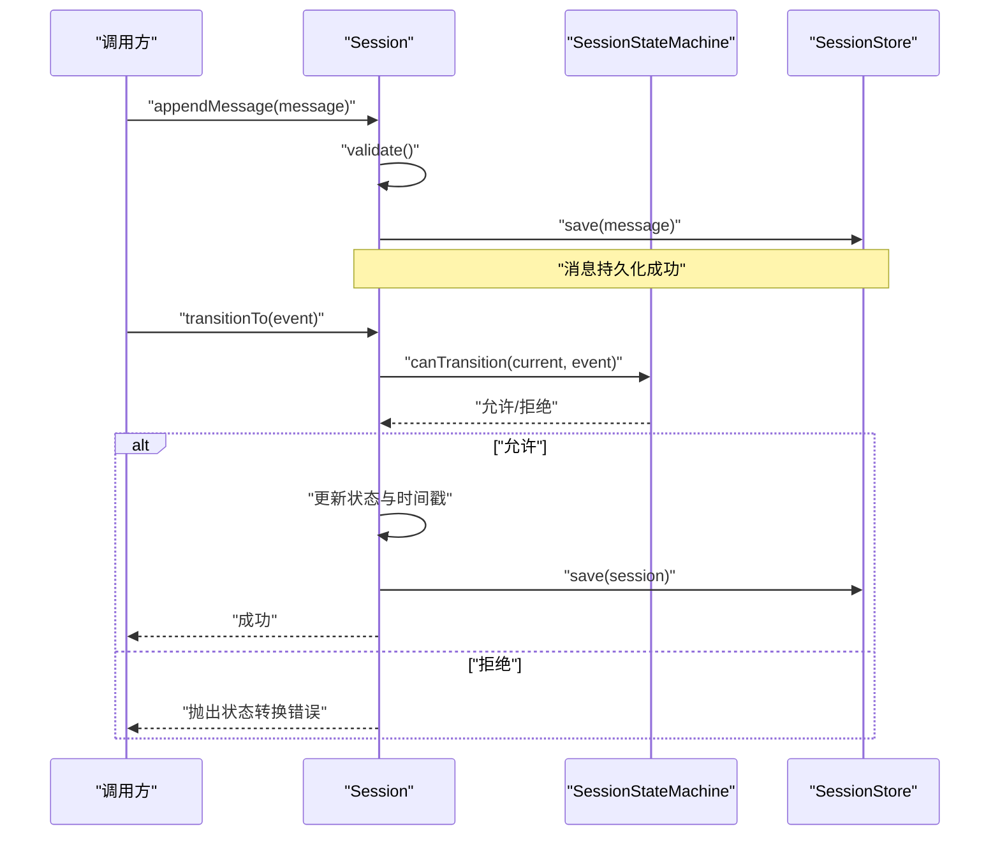
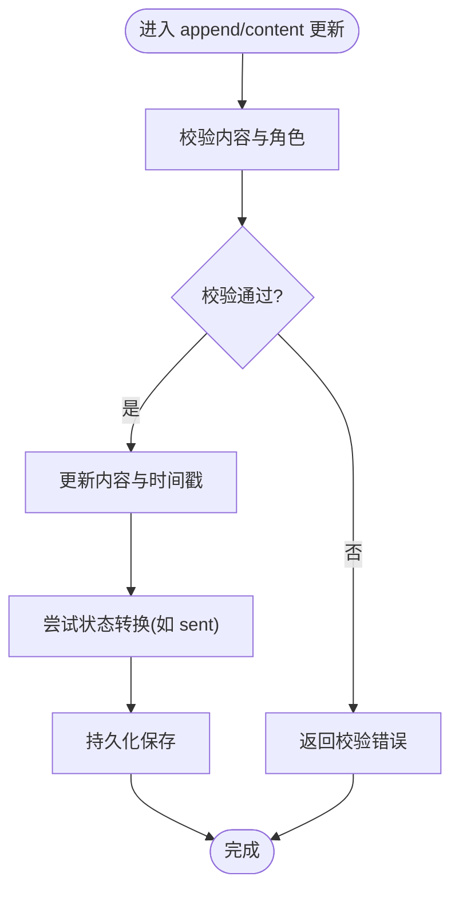
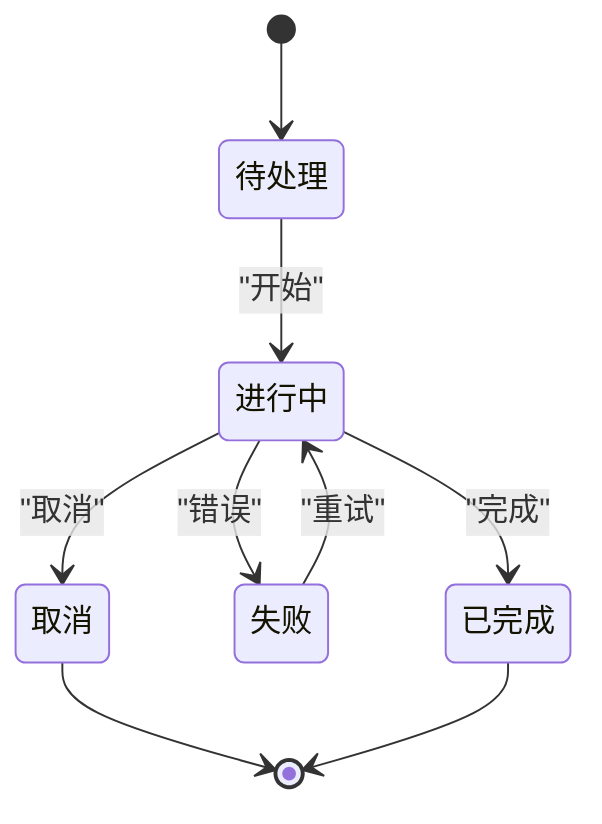
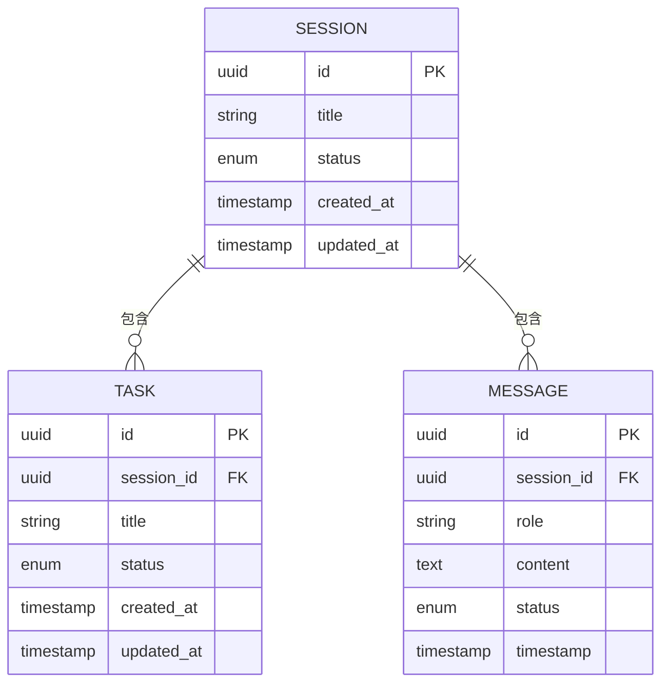
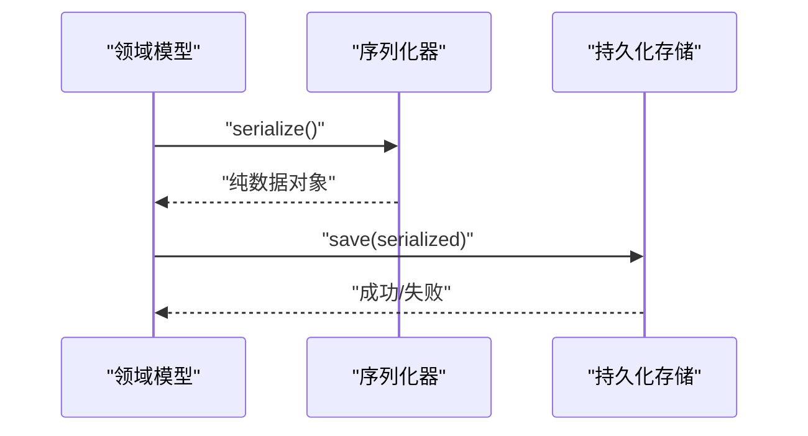
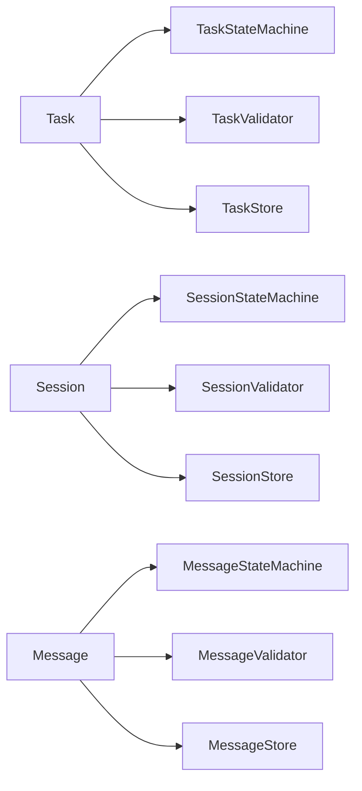

# 核心领域模型

<cite>
**本文引用的文件**   
- [engine/packages/domain-layer/src/models/task.ts](file://engine/packages/domain-layer/src/models/task.ts)
- [engine/packages/domain-layer/src/models/session.ts](file://engine/packages/domain-layer/src/models/session.ts)
- [engine/packages/domain-layer/src/models/message.ts](file://engine/packages/domain-layer/src/models/message.ts)
- [engine/packages/domain-layer/src/state/task-state-machine.ts](file://engine/packages/domain-layer/src/state/task-state-machine.ts)
- [engine/packages/domain-layer/src/state/session-state-machine.ts](file://engine/packages/domain-layer/src/state/session-state-machine.ts)
- [engine/packages/domain-layer/src/state/message-state-machine.ts](file://engine/packages/domain-layer/src/state/message-state-machine.ts)
- [engine/packages/domain-layer/src/validators/task-validator.ts](file://engine/packages/domain-layer/src/validators/task-validator.ts)
- [engine/packages/domain-layer/src/validators/session-validator.ts](file://engine/packages/domain-layer/src/validators/session-validator.ts)
- [engine/packages/domain-layer/src/validators/message-validator.ts](file://engine/packages/domain-layer/src/validators/message-validator.ts)
- [engine/packages/domain-layer/src/persistence/task-store.ts](file://engine/packages/domain-layer/src/persistence/task-store.ts)
- [engine/packages/domain-layer/src/persistence/session-store.ts](file://engine/packages/domain-layer/src/persistence/session-store.ts)
- [engine/packages/domain-layer/src/persistence/message-store.ts](file://engine/packages/domain-layer/src/persistence/message-store.ts)
</cite>

## 目录
1. [简介](#简介)
2. [项目结构](#项目结构)
3. [核心组件](#核心组件)
4. [架构总览](#架构总览)
5. [详细组件分析](#详细组件分析)
6. [依赖关系分析](#依赖关系分析)
7. [性能考虑](#性能考虑)
8. [故障排查指南](#故障排查指南)
9. [结论](#结论)
10. [附录](#附录)

## 简介
本文件聚焦于KCoder引擎的“核心领域模型”，围绕任务（Task）、会话（Session）、消息（Message）三大实体展开，系统阐述其属性、方法、业务规则验证、状态机设计与转换规则、对象间关联与约束、以及序列化与持久化策略。文档旨在帮助开发者快速理解并正确使用这些领域对象，同时为后续扩展与维护提供清晰的参考。

## 项目结构
领域模型位于 engine/packages/domain-layer 下，采用分层组织：
- models：定义核心领域对象（Task、Session、Message）及其基础行为
- state：定义各实体的状态机与转换规则
- validators：定义领域对象的校验器与业务规则
- persistence：定义领域对象的存储接口与实现（如内存、SQLite等）

图表来源
- [engine/packages/domain-layer/src/models/task.ts](file://engine/packages/domain-layer/src/models/task.ts)
- [engine/packages/domain-layer/src/models/session.ts](file://engine/packages/domain-layer/src/models/session.ts)
- [engine/packages/domain-layer/src/models/message.ts](file://engine/packages/domain-layer/src/models/message.ts)
- [engine/packages/domain-layer/src/state/task-state-machine.ts](file://engine/packages/domain-layer/src/state/task-state-machine.ts)
- [engine/packages/domain-layer/src/state/session-state-machine.ts](file://engine/packages/domain-layer/src/state/session-state-machine.ts)
- [engine/packages/domain-layer/src/state/message-state-machine.ts](file://engine/packages/domain-layer/src/state/message-state-machine.ts)
- [engine/packages/domain-layer/src/validators/task-validator.ts](file://engine/packages/domain-layer/src/validators/task-validator.ts)
- [engine/packages/domain-layer/src/validators/session-validator.ts](file://engine/packages/domain-layer/src/validators/session-validator.ts)
- [engine/packages/domain-layer/src/validators/message-validator.ts](file://engine/packages/domain-layer/src/validators/message-validator.ts)
- [engine/packages/domain-layer/src/persistence/task-store.ts](file://engine/packages/domain-layer/src/persistence/task-store.ts)
- [engine/packages/domain-layer/src/persistence/session-store.ts](file://engine/packages/domain-layer/src/persistence/session-store.ts)
- [engine/packages/domain-layer/src/persistence/message-store.ts](file://engine/packages/domain-layer/src/persistence/message-store.ts)

章节来源
- [engine/packages/domain-layer/src/models/task.ts](file://engine/packages/domain-layer/src/models/task.ts)
- [engine/packages/domain-layer/src/models/session.ts](file://engine/packages/domain-layer/src/models/session.ts)
- [engine/packages/domain-layer/src/models/message.ts](file://engine/packages/domain-layer/src/models/message.ts)
- [engine/packages/domain-layer/src/state/task-state-machine.ts](file://engine/packages/domain-layer/src/state/task-state-machine.ts)
- [engine/packages/domain-layer/src/state/session-state-machine.ts](file://engine/packages/domain-layer/src/state/session-state-machine.ts)
- [engine/packages/domain-layer/src/state/message-state-machine.ts](file://engine/packages/domain-layer/src/state/message-state-machine.ts)
- [engine/packages/domain-layer/src/validators/task-validator.ts](file://engine/packages/domain-layer/src/validators/task-validator.ts)
- [engine/packages/domain-layer/src/validators/session-validator.ts](file://engine/packages/domain-layer/src/validators/session-validator.ts)
- [engine/packages/domain-layer/src/validators/message-validator.ts](file://engine/packages/domain-layer/src/validators/message-validator.ts)
- [engine/packages/domain-layer/src/persistence/task-store.ts](file://engine/packages/domain-layer/src/persistence/task-store.ts)
- [engine/packages/domain-layer/src/persistence/session-store.ts](file://engine/packages/domain-layer/src/persistence/session-store.ts)
- [engine/packages/domain-layer/src/persistence/message-store.ts](file://engine/packages/domain-layer/src/persistence/message-store.ts)

## 核心组件
本节概述三大领域对象的核心职责与交互边界：
- 任务（Task）：表示一次目标导向的工作单元，包含上下文、计划、进度、结果摘要等；负责生命周期管理与状态流转。
- 会话（Session）：表示用户与系统的对话上下文，聚合多个任务或步骤，维护会话级元数据与权限范围。
- 消息（Message）：表示会话中的单条通信记录，承载角色、内容、时间戳、附件引用等，支持追加与查询。

关键要点
- 三者通过外键或标识符建立关联：一个会话可包含多条消息和多个任务；一条消息属于某个会话；任务可能产生消息作为过程输出。
- 所有变更需经过对应校验器与状态机，确保一致性。
- 持久化由独立存储模块抽象，便于替换底层实现。

章节来源
- [engine/packages/domain-layer/src/models/task.ts](file://engine/packages/domain-layer/src/models/task.ts)
- [engine/packages/domain-layer/src/models/session.ts](file://engine/packages/domain-layer/src/models/session.ts)
- [engine/packages/domain-layer/src/models/message.ts](file://engine/packages/domain-layer/src/models/message.ts)

## 架构总览
下图展示了领域模型与其状态机、校验器、持久化的协作关系。

图表来源
- [engine/packages/domain-layer/src/models/task.ts](file://engine/packages/domain-layer/src/models/task.ts)
- [engine/packages/domain-layer/src/models/session.ts](file://engine/packages/domain-layer/src/models/session.ts)
- [engine/packages/domain-layer/src/models/message.ts](file://engine/packages/domain-layer/src/models/message.ts)
- [engine/packages/domain-layer/src/state/task-state-machine.ts](file://engine/packages/domain-layer/src/state/task-state-machine.ts)
- [engine/packages/domain-layer/src/state/session-state-machine.ts](file://engine/packages/domain-layer/src/state/session-state-machine.ts)
- [engine/packages/domain-layer/src/state/message-state-machine.ts](file://engine/packages/domain-layer/src/state/message-state-machine.ts)
- [engine/packages/domain-layer/src/validators/task-validator.ts](file://engine/packages/domain-layer/src/validators/task-validator.ts)
- [engine/packages/domain-layer/src/validators/session-validator.ts](file://engine/packages/domain-layer/src/validators/session-validator.ts)
- [engine/packages/domain-layer/src/validators/message-validator.ts](file://engine/packages/domain-layer/src/validators/message-validator.ts)
- [engine/packages/domain-layer/src/persistence/task-store.ts](file://engine/packages/domain-layer/src/persistence/task-store.ts)
- [engine/packages/domain-layer/src/persistence/session-store.ts](file://engine/packages/domain-layer/src/persistence/session-store.ts)
- [engine/packages/domain-layer/src/persistence/message-store.ts](file://engine/packages/domain-layer/src/persistence/message-store.ts)

## 详细组件分析

### 任务（Task）领域模型
- 属性
  - id：唯一标识
  - sessionId：所属会话标识
  - title：标题
  - status：当前状态（受状态机约束）
  - createdAt / updatedAt：时间戳
- 方法
  - create：创建新任务实例并进行初始校验
  - transitionTo：根据事件驱动的状态转换
  - validate：执行业务规则校验
  - serialize：序列化为可持久化格式
- 业务规则与约束
  - 必须属于有效会话
  - 状态转换必须符合状态机允许的路径
  - 必填字段非空且长度合理
- 示例路径
  - 创建与校验：[engine/packages/domain-layer/src/models/task.ts](file://engine/packages/domain-layer/src/models/task.ts)
  - 状态转换入口：[engine/packages/domain-layer/src/state/task-state-machine.ts](file://engine/packages/domain-layer/src/state/task-state-machine.ts)
  - 校验逻辑：[engine/packages/domain-layer/src/validators/task-validator.ts](file://engine/packages/domain-layer/src/validators/task-validator.ts)
  - 持久化接口：[engine/packages/domain-layer/src/persistence/task-store.ts](file://engine/packages/domain-layer/src/persistence/task-store.ts)

图表来源
- [engine/packages/domain-layer/src/state/task-state-machine.ts](file://engine/packages/domain-layer/src/state/task-state-machine.ts)
- [engine/packages/domain-layer/src/models/task.ts](file://engine/packages/domain-layer/src/models/task.ts)
- [engine/packages/domain-layer/src/persistence/task-store.ts](file://engine/packages/domain-layer/src/persistence/task-store.ts)

章节来源
- [engine/packages/domain-layer/src/models/task.ts](file://engine/packages/domain-layer/src/models/task.ts)
- [engine/packages/domain-layer/src/state/task-state-machine.ts](file://engine/packages/domain-layer/src/state/task-state-machine.ts)
- [engine/packages/domain-layer/src/validators/task-validator.ts](file://engine/packages/domain-layer/src/validators/task-validator.ts)
- [engine/packages/domain-layer/src/persistence/task-store.ts](file://engine/packages/domain-layer/src/persistence/task-store.ts)

### 会话（Session）领域模型
- 属性
  - id：唯一标识
  - title：会话标题
  - status：会话状态
  - createdAt / updatedAt：时间戳
- 方法
  - appendMessage：追加消息到会话
  - addTask：添加任务到会话
  - transitionTo：会话状态转换
  - validate：会话级校验
  - serialize：会话序列化
- 业务规则与约束
  - 会话内消息按时间顺序追加
  - 会话状态转换遵循会话状态机
  - 会话删除前需清理相关消息与任务（或标记软删除）
- 示例路径
  - 会话模型：[engine/packages/domain-layer/src/models/session.ts](file://engine/packages/domain-layer/src/models/session.ts)
  - 会话状态机：[engine/packages/domain-layer/src/state/session-state-machine.ts](file://engine/packages/domain-layer/src/state/session-state-machine.ts)
  - 会话校验器：[engine/packages/domain-layer/src/validators/session-validator.ts](file://engine/packages/domain-layer/src/validators/session-validator.ts)
  - 会话存储：[engine/packages/domain-layer/src/persistence/session-store.ts](file://engine/packages/domain-layer/src/persistence/session-store.ts)

图表来源
- [engine/packages/domain-layer/src/models/session.ts](file://engine/packages/domain-layer/src/models/session.ts)
- [engine/packages/domain-layer/src/state/session-state-machine.ts](file://engine/packages/domain-layer/src/state/session-state-machine.ts)
- [engine/packages/domain-layer/src/persistence/session-store.ts](file://engine/packages/domain-layer/src/persistence/session-store.ts)

章节来源
- [engine/packages/domain-layer/src/models/session.ts](file://engine/packages/domain-layer/src/models/session.ts)
- [engine/packages/domain-layer/src/state/session-state-machine.ts](file://engine/packages/domain-layer/src/state/session-state-machine.ts)
- [engine/packages/domain-layer/src/validators/session-validator.ts](file://engine/packages/domain-layer/src/validators/session-validator.ts)
- [engine/packages/domain-layer/src/persistence/session-store.ts](file://engine/packages/domain-layer/src/persistence/session-store.ts)

### 消息（Message）领域模型
- 属性
  - id：唯一标识
  - sessionId：所属会话
  - role：发送者角色（如 user、assistant、system）
  - content：消息内容
  - timestamp：时间戳
  - status：消息状态（如 pending、sent、failed）
- 方法
  - append：追加内容或更新内容
  - transitionTo：消息状态转换
  - validate：消息级校验
  - serialize：消息序列化
- 业务规则与约束
  - 内容长度限制与敏感信息过滤
  - 角色白名单校验
  - 状态转换需符合消息状态机
- 示例路径
  - 消息模型：[engine/packages/domain-layer/src/models/message.ts](file://engine/packages/domain-layer/src/models/message.ts)
  - 消息状态机：[engine/packages/domain-layer/src/state/message-state-machine.ts](file://engine/packages/domain-layer/src/state/message-state-machine.ts)
  - 消息校验器：[engine/packages/domain-layer/src/validators/message-validator.ts](file://engine/packages/domain-layer/src/validators/message-validator.ts)
  - 消息存储：[engine/packages/domain-layer/src/persistence/message-store.ts](file://engine/packages/domain-layer/src/persistence/message-store.ts)

图表来源
- [engine/packages/domain-layer/src/models/message.ts](file://engine/packages/domain-layer/src/models/message.ts)
- [engine/packages/domain-layer/src/state/message-state-machine.ts](file://engine/packages/domain-layer/src/state/message-state-machine.ts)
- [engine/packages/domain-layer/src/validators/message-validator.ts](file://engine/packages/domain-layer/src/validators/message-validator.ts)
- [engine/packages/domain-layer/src/persistence/message-store.ts](file://engine/packages/domain-layer/src/persistence/message-store.ts)

章节来源
- [engine/packages/domain-layer/src/models/message.ts](file://engine/packages/domain-layer/src/models/message.ts)
- [engine/packages/domain-layer/src/state/message-state-machine.ts](file://engine/packages/domain-layer/src/state/message-state-machine.ts)
- [engine/packages/domain-layer/src/validators/message-validator.ts](file://engine/packages/domain-layer/src/validators/message-validator.ts)
- [engine/packages/domain-layer/src/persistence/message-store.ts](file://engine/packages/domain-layer/src/persistence/message-store.ts)

### 状态机设计与转换规则
- 任务状态机
  - 典型状态：待处理、进行中、已完成、失败、取消
  - 转换规则：仅允许从合法前驱状态经事件到达后继状态；非法转换应抛出明确错误
  - 参考实现：[engine/packages/domain-layer/src/state/task-state-machine.ts](file://engine/packages/domain-layer/src/state/task-state-machine.ts)
- 会话状态机
  - 典型状态：活跃、暂停、结束、归档
  - 转换规则：会话结束后可归档；活跃会话可暂停；暂停后可恢复
  - 参考实现：[engine/packages/domain-layer/src/state/session-state-machine.ts](file://engine/packages/domain-layer/src/state/session-state-machine.ts)
- 消息状态机
  - 典型状态：待发送、已发送、失败、重试中
  - 转换规则：失败可进入重试中；重试成功则转为已发送；最终失败保留失败态
  - 参考实现：[engine/packages/domain-layer/src/state/message-state-machine.ts](file://engine/packages/domain-layer/src/state/message-state-machine.ts)

图表来源
- [engine/packages/domain-layer/src/state/task-state-machine.ts](file://engine/packages/domain-layer/src/state/task-state-machine.ts)

章节来源
- [engine/packages/domain-layer/src/state/task-state-machine.ts](file://engine/packages/domain-layer/src/state/task-state-machine.ts)
- [engine/packages/domain-layer/src/state/session-state-machine.ts](file://engine/packages/domain-layer/src/state/session-state-machine.ts)
- [engine/packages/domain-layer/src/state/message-state-machine.ts](file://engine/packages/domain-layer/src/state/message-state-machine.ts)

### 关联关系与约束条件
- 会话与消息
  - 一对多：一个会话包含多条消息
  - 约束：消息的 sessionId 必须指向存在的会话；消息按时间顺序追加
- 会话与任务
  - 一对多：一个会话包含多个任务
  - 约束：任务的 sessionId 必须指向存在的会话；任务的生命周期与会话一致或更短
- 消息与任务
  - 可选关联：任务可能产生消息作为过程输出（例如日志或中间结果）
  - 约束：若存在关联，需保证任务与消息的会话一致

图表来源
- [engine/packages/domain-layer/src/models/session.ts](file://engine/packages/domain-layer/src/models/session.ts)
- [engine/packages/domain-layer/src/models/task.ts](file://engine/packages/domain-layer/src/models/task.ts)
- [engine/packages/domain-layer/src/models/message.ts](file://engine/packages/domain-layer/src/models/message.ts)

章节来源
- [engine/packages/domain-layer/src/models/session.ts](file://engine/packages/domain-layer/src/models/session.ts)
- [engine/packages/domain-layer/src/models/task.ts](file://engine/packages/domain-layer/src/models/task.ts)
- [engine/packages/domain-layer/src/models/message.ts](file://engine/packages/domain-layer/src/models/message.ts)

### 序列化与持久化策略
- 序列化
  - 领域对象提供 serialize 方法，将内部状态转换为纯数据结构，避免循环引用与函数不可序列化问题
  - 建议对时间戳进行统一格式化处理（如ISO字符串），对枚举值进行规范化
- 持久化
  - 存储接口抽象：每个实体有对应的 Store 接口（save/load/delete/listByXxx）
  - 实现可插拔：内存存储用于测试与开发，SQLite/文件系统用于生产
  - 事务与一致性：复杂操作（如会话关闭时批量更新任务与消息）建议使用事务包裹
- 示例路径
  - 任务序列化与存储：[engine/packages/domain-layer/src/models/task.ts](file://engine/packages/domain-layer/src/models/task.ts)、[engine/packages/domain-layer/src/persistence/task-store.ts](file://engine/packages/domain-layer/src/persistence/task-store.ts)
  - 会话序列化与存储：[engine/packages/domain-layer/src/models/session.ts](file://engine/packages/domain-layer/src/models/session.ts)、[engine/packages/domain-layer/src/persistence/session-store.ts](file://engine/packages/domain-layer/src/persistence/session-store.ts)
  - 消息序列化与存储：[engine/packages/domain-layer/src/models/message.ts](file://engine/packages/domain-layer/src/models/message.ts)、[engine/packages/domain-layer/src/persistence/message-store.ts](file://engine/packages/domain-layer/src/persistence/message-store.ts)

图表来源
- [engine/packages/domain-layer/src/models/task.ts](file://engine/packages/domain-layer/src/models/task.ts)
- [engine/packages/domain-layer/src/models/session.ts](file://engine/packages/domain-layer/src/models/session.ts)
- [engine/packages/domain-layer/src/models/message.ts](file://engine/packages/domain-layer/src/models/message.ts)
- [engine/packages/domain-layer/src/persistence/task-store.ts](file://engine/packages/domain-layer/src/persistence/task-store.ts)
- [engine/packages/domain-layer/src/persistence/session-store.ts](file://engine/packages/domain-layer/src/persistence/session-store.ts)
- [engine/packages/domain-layer/src/persistence/message-store.ts](file://engine/packages/domain-layer/src/persistence/message-store.ts)

章节来源
- [engine/packages/domain-layer/src/models/task.ts](file://engine/packages/domain-layer/src/models/task.ts)
- [engine/packages/domain-layer/src/models/session.ts](file://engine/packages/domain-layer/src/models/session.ts)
- [engine/packages/domain-layer/src/models/message.ts](file://engine/packages/domain-layer/src/models/message.ts)
- [engine/packages/domain-layer/src/persistence/task-store.ts](file://engine/packages/domain-layer/src/persistence/task-store.ts)
- [engine/packages/domain-layer/src/persistence/session-store.ts](file://engine/packages/domain-layer/src/persistence/session-store.ts)
- [engine/packages/domain-layer/src/persistence/message-store.ts](file://engine/packages/domain-layer/src/persistence/message-store.ts)

## 依赖关系分析
- 低耦合高内聚
  - 模型只关注自身状态与行为，状态机与校验器独立，存储接口抽象清晰
- 直接依赖
  - 模型依赖各自的状态机与校验器
  - 模型通过存储接口与持久化层交互
- 潜在风险
  - 避免在模型中直接引入具体存储实现，防止跨层耦合
  - 状态转换与校验逻辑需保持幂等，便于重试与回放

图表来源
- [engine/packages/domain-layer/src/models/task.ts](file://engine/packages/domain-layer/src/models/task.ts)
- [engine/packages/domain-layer/src/models/session.ts](file://engine/packages/domain-layer/src/models/session.ts)
- [engine/packages/domain-layer/src/models/message.ts](file://engine/packages/domain-layer/src/models/message.ts)
- [engine/packages/domain-layer/src/state/task-state-machine.ts](file://engine/packages/domain-layer/src/state/task-state-machine.ts)
- [engine/packages/domain-layer/src/state/session-state-machine.ts](file://engine/packages/domain-layer/src/state/session-state-machine.ts)
- [engine/packages/domain-layer/src/state/message-state-machine.ts](file://engine/packages/domain-layer/src/state/message-state-machine.ts)
- [engine/packages/domain-layer/src/validators/task-validator.ts](file://engine/packages/domain-layer/src/validators/task-validator.ts)
- [engine/packages/domain-layer/src/validators/session-validator.ts](file://engine/packages/domain-layer/src/validators/session-validator.ts)
- [engine/packages/domain-layer/src/validators/message-validator.ts](file://engine/packages/domain-layer/src/validators/message-validator.ts)
- [engine/packages/domain-layer/src/persistence/task-store.ts](file://engine/packages/domain-layer/src/persistence/task-store.ts)
- [engine/packages/domain-layer/src/persistence/session-store.ts](file://engine/packages/domain-layer/src/persistence/session-store.ts)
- [engine/packages/domain-layer/src/persistence/message-store.ts](file://engine/packages/domain-layer/src/persistence/message-store.ts)

章节来源
- [engine/packages/domain-layer/src/models/task.ts](file://engine/packages/domain-layer/src/models/task.ts)
- [engine/packages/domain-layer/src/models/session.ts](file://engine/packages/domain-layer/src/models/session.ts)
- [engine/packages/domain-layer/src/models/message.ts](file://engine/packages/domain-layer/src/models/message.ts)
- [engine/packages/domain-layer/src/state/task-state-machine.ts](file://engine/packages/domain-layer/src/state/task-state-machine.ts)
- [engine/packages/domain-layer/src/state/session-state-machine.ts](file://engine/packages/domain-layer/src/state/session-state-machine.ts)
- [engine/packages/domain-layer/src/state/message-state-machine.ts](file://engine/packages/domain-layer/src/state/message-state-machine.ts)
- [engine/packages/domain-layer/src/validators/task-validator.ts](file://engine/packages/domain-layer/src/validators/task-validator.ts)
- [engine/packages/domain-layer/src/validators/session-validator.ts](file://engine/packages/domain-layer/src/validators/session-validator.ts)
- [engine/packages/domain-layer/src/validators/message-validator.ts](file://engine/packages/domain-layer/src/validators/message-validator.ts)
- [engine/packages/domain-layer/src/persistence/task-store.ts](file://engine/packages/domain-layer/src/persistence/task-store.ts)
- [engine/packages/domain-layer/src/persistence/session-store.ts](file://engine/packages/domain-layer/src/persistence/session-store.ts)
- [engine/packages/domain-layer/src/persistence/message-store.ts](file://engine/packages/domain-layer/src/persistence/message-store.ts)

## 性能考虑
- 批量操作
  - 对于大量消息追加或任务批量更新，建议使用批处理接口以减少I/O次数
- 索引设计
  - 在持久化层为 sessionId、status、timestamp 等高频查询字段建立索引
- 状态机与校验缓存
  - 对频繁使用的状态转换表与校验规则进行缓存，降低重复计算开销
- 序列化优化
  - 避免不必要的深拷贝；对大文本内容（如代码片段）采用分块或外部存储引用

## 故障排查指南
- 常见错误
  - 状态转换非法：检查状态机定义与当前状态，确认事件是否允许
  - 校验失败：检查必填字段、长度限制、角色白名单等
  - 持久化失败：检查存储连接、事务回滚、唯一性约束冲突
- 定位步骤
  - 打印领域对象序列化快照，对比预期状态
  - 查看状态机转换日志与校验器返回的错误详情
  - 检查持久化层的异常堆栈与SQL日志（如适用）
- 参考实现
  - 任务校验与错误返回：[engine/packages/domain-layer/src/validators/task-validator.ts](file://engine/packages/domain-layer/src/validators/task-validator.ts)
  - 会话校验与错误返回：[engine/packages/domain-layer/src/validators/session-validator.ts](file://engine/packages/domain-layer/src/validators/session-validator.ts)
  - 消息校验与错误返回：[engine/packages/domain-layer/src/validators/message-validator.ts](file://engine/packages/domain-layer/src/validators/message-validator.ts)

章节来源
- [engine/packages/domain-layer/src/validators/task-validator.ts](file://engine/packages/domain-layer/src/validators/task-validator.ts)
- [engine/packages/domain-layer/src/validators/session-validator.ts](file://engine/packages/domain-layer/src/validators/session-validator.ts)
- [engine/packages/domain-layer/src/validators/message-validator.ts](file://engine/packages/domain-layer/src/validators/message-validator.ts)

## 结论
KCoder的核心领域模型以任务、会话、消息为中心，通过清晰的状态机与校验器保障业务一致性，并以抽象的存储接口实现灵活的持久化策略。遵循本文档的设计原则与实践，可在保证正确性的前提下提升可扩展性与可维护性。

## 附录
- 术语说明
  - 状态机：描述对象状态及合法转换的规则集合
  - 校验器：对领域对象属性与关系进行业务规则验证的工具
  - 存储接口：抽象领域对象持久化操作的契约
- 最佳实践
  - 始终先校验后持久化
  - 状态转换尽量幂等，便于重试与回放
  - 对外暴露的API仅传递序列化后的纯数据对象