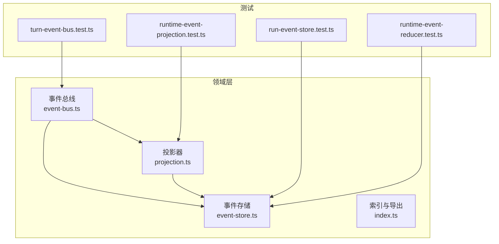
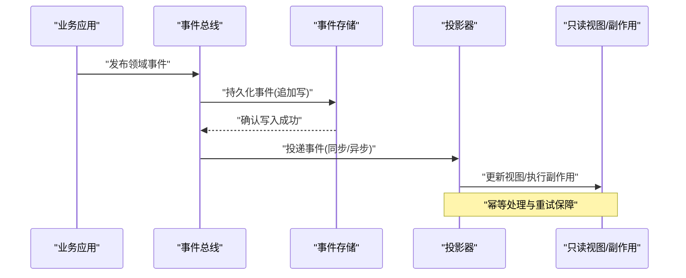
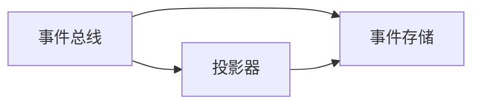

# 领域事件

<cite>
**本文引用的文件**   
- [engine/packages/domain-layer/src/events/event-bus.ts](file://engine/packages/domain-layer/src/events/event-bus.ts)
- [engine/packages/domain-layer/src/events/event-store.ts](file://engine/packages/domain-layer/src/events/event-store.ts)
- [engine/packages/domain-layer/src/events/projection.ts](file://engine/packages/domain-layer/src/events/projection.ts)
- [engine/packages/domain-layer/src/events/index.ts](file://engine/packages/domain-layer/src/events/index.ts)
- [engine/tests/run-event-store.test.ts](file://engine/tests/run-event-store.test.ts)
- [engine/tests/runtime-event-projection.test.ts](file://engine/tests/runtime-event-projection.test.ts)
- [engine/tests/runtime-event-reducer.test.ts](file://engine/tests/runtime-event-reducer.test.ts)
- [engine/tests/turn-event-bus.test.ts](file://engine/tests/turn-event-bus.test.ts)
</cite>

## 目录
1. [简介](#简介)
2. [项目结构](#项目结构)
3. [核心组件](#核心组件)
4. [架构总览](#架构总览)
5. [详细组件分析](#详细组件分析)
6. [依赖关系分析](#依赖关系分析)
7. [性能考量](#性能考量)
8. [故障排查指南](#故障排查指南)
9. [结论](#结论)
10. [附录](#附录)

## 简介
本文件面向KCoder的领域事件系统，系统性阐述事件驱动架构的设计理念与实现模式，覆盖事件的定义、发布与订阅机制；深入讲解事件溯源（Event Sourcing）的实现策略，包括事件存储、版本管理与重放机制；并通过测试用例路径给出具体示例说明如何定义事件、发布事件以及消费事件。同时，文档对幂等性与重复消费防护、性能优化与监控策略进行总结与建议。

## 项目结构
围绕领域事件的核心代码位于 engine/packages/domain-layer 的事件子系统，配合 tests 中的多组单测验证行为与边界条件。整体组织遵循“接口抽象 + 可插拔实现”的分层方式：
- 事件总线：负责事件注册、分发与生命周期管理
- 事件存储：提供持久化、查询、快照与重放能力
- 投影器：将不可变事件流转换为可读视图或副作用
- 索引与导出：统一对外暴露类型与入口

图表来源
- [engine/packages/domain-layer/src/events/event-bus.ts](file://engine/packages/domain-layer/src/events/event-bus.ts)
- [engine/packages/domain-layer/src/events/event-store.ts](file://engine/packages/domain-layer/src/events/event-store.ts)
- [engine/packages/domain-layer/src/events/projection.ts](file://engine/packages/domain-layer/src/events/projection.ts)
- [engine/packages/domain-layer/src/events/index.ts](file://engine/packages/domain-layer/src/events/index.ts)
- [engine/tests/run-event-store.test.ts](file://engine/tests/run-event-store.test.ts)
- [engine/tests/runtime-event-projection.test.ts](file://engine/tests/runtime-event-projection.test.ts)
- [engine/tests/runtime-event-reducer.test.ts](file://engine/tests/runtime-event-reducer.test.ts)
- [engine/tests/turn-event-bus.test.ts](file://engine/tests/turn-event-bus.test.ts)

章节来源
- [engine/packages/domain-layer/src/events/event-bus.ts](file://engine/packages/domain-layer/src/events/event-bus.ts)
- [engine/packages/domain-layer/src/events/event-store.ts](file://engine/packages/domain-layer/src/events/event-store.ts)
- [engine/packages/domain-layer/src/events/projection.ts](file://engine/packages/domain-layer/src/events/projection.ts)
- [engine/packages/domain-layer/src/events/index.ts](file://engine/packages/domain-layer/src/events/index.ts)
- [engine/tests/run-event-store.test.ts](file://engine/tests/run-event-store.test.ts)
- [engine/tests/runtime-event-projection.test.ts](file://engine/tests/runtime-event-projection.test.ts)
- [engine/tests/runtime-event-reducer.test.ts](file://engine/tests/runtime-event-reducer.test.ts)
- [engine/tests/turn-event-bus.test.ts](file://engine/tests/turn-event-bus.test.ts)

## 核心组件
- 事件总线（Event Bus）
  - 职责：事件类型注册、订阅者管理、同步/异步分发、错误隔离与重试策略
  - 关键能力：按主题/命名空间路由、批量投递、顺序保证（可选）、背压控制（可选）
- 事件存储（Event Store）
  - 职责：事件追加写、按聚合根/时间线查询、版本控制、快照、重放
  - 关键能力：幂等写入、冲突检测、一致性读、分页与游标
- 投影器（Projection）
  - 职责：消费事件流并维护只读视图或触发外部副作用
  - 关键能力：幂等处理、断点续投、失败重试、补偿操作
- 索引与导出（Index & Exports）
  - 职责：统一类型导出、便捷API封装、跨模块解耦

章节来源
- [engine/packages/domain-layer/src/events/event-bus.ts](file://engine/packages/domain-layer/src/events/event-bus.ts)
- [engine/packages/domain-layer/src/events/event-store.ts](file://engine/packages/domain-layer/src/events/event-store.ts)
- [engine/packages/domain-layer/src/events/projection.ts](file://engine/packages/domain-layer/src/events/projection.ts)
- [engine/packages/domain-layer/src/events/index.ts](file://engine/packages/domain-layer/src/events/index.ts)

## 架构总览
下图展示了事件从产生到落盘、再到投影消费的端到端流程，体现事件溯源的核心思想：以不可变事件为唯一事实源，通过重放恢复状态。

图表来源
- [engine/packages/domain-layer/src/events/event-bus.ts](file://engine/packages/domain-layer/src/events/event-bus.ts)
- [engine/packages/domain-layer/src/events/event-store.ts](file://engine/packages/domain-layer/src/events/event-store.ts)
- [engine/packages/domain-layer/src/events/projection.ts](file://engine/packages/domain-layer/src/events/projection.ts)

## 详细组件分析

### 事件总线（Event Bus）
- 设计要点
  - 订阅模型：支持按事件名/命名空间订阅，允许一次性订阅与长期订阅
  - 分发策略：同步调用链式处理器或异步队列；可配置并发度与超时
  - 错误隔离：单个处理器异常不影响其他处理器；记录上下文便于追踪
  - 扩展点：中间件用于日志、指标、审计、限流等横切关注点
- 典型用法（参考测试）
  - 注册处理器、发布事件、验证调用顺序与参数传递
  - 模拟异常场景，验证错误隔离与重试策略
- 幂等与重复消费
  - 建议在处理器侧基于事件ID去重；总线可结合存储返回已处理标记
- 性能建议
  - 高吞吐场景采用异步批处理；合理设置并发度与背压阈值
  - 避免在处理器中执行阻塞IO；必要时使用独立工作进程

章节来源
- [engine/tests/turn-event-bus.test.ts](file://engine/tests/turn-event-bus.test.ts)

### 事件存储（Event Store）
- 设计要点
  - 追加写模型：事件仅追加不修改，天然具备审计与重放能力
  - 版本管理：每个聚合根维护版本号，写入时校验乐观锁
  - 查询与重放：按聚合根、时间范围、事件类型过滤；支持全量/增量重放
  - 快照：周期性保存聚合状态以减少重放成本
- 典型用法（参考测试）
  - 追加事件、读取事件流、重放至指定版本、快照读写
  - 并发写入冲突与回滚场景
- 幂等与重复消费
  - 基于事件ID的唯一约束防止重复写入；写入前检查存在性
- 性能建议
  - 批量写入、预分配分区、冷热数据分离
  - 重放时使用游标与分页，避免一次性加载全部事件

章节来源
- [engine/tests/run-event-store.test.ts](file://engine/tests/run-event-store.test.ts)
- [engine/tests/runtime-event-reducer.test.ts](file://engine/tests/runtime-event-reducer.test.ts)

### 投影器（Projection）
- 设计要点
  - 事件到视图：将不可变事件映射为易查询的只读模型
  - 幂等处理：同一事件多次投递需保证结果一致
  - 断点续投：记录已处理事件的最大序列号，崩溃后从断点继续
  - 副作用安全：对外部系统的调用需具备重试与补偿机制
- 典型用法（参考测试）
  - 订阅事件流、构建视图、验证最终一致性
  - 模拟中断与恢复，验证断点续投
- 性能建议
  - 批量投影、惰性计算、缓存热点视图
  - 投影与主事务解耦，避免长事务

章节来源
- [engine/tests/runtime-event-projection.test.ts](file://engine/tests/runtime-event-projection.test.ts)

### 索引与导出（Index & Exports）
- 作用
  - 集中导出类型与便捷API，降低模块耦合
  - 提供默认实现与工厂方法，简化集成
- 建议
  - 保持最小公开API，内部实现细节通过私有模块封装

章节来源
- [engine/packages/domain-layer/src/events/index.ts](file://engine/packages/domain-layer/src/events/index.ts)

## 依赖关系分析
- 内聚与耦合
  - 事件总线依赖事件存储与投影器，但通过接口抽象降低耦合
  - 投影器依赖事件存储进行重放与查询
- 外部依赖
  - 存储后端（如SQLite/对象存储/消息队列）通过适配器注入
  - 监控与日志通过中间件接入
- 循环依赖
  - 通过分层与接口隔离避免循环引用

图表来源
- [engine/packages/domain-layer/src/events/event-bus.ts](file://engine/packages/domain-layer/src/events/event-bus.ts)
- [engine/packages/domain-layer/src/events/event-store.ts](file://engine/packages/domain-layer/src/events/event-store.ts)
- [engine/packages/domain-layer/src/events/projection.ts](file://engine/packages/domain-layer/src/events/projection.ts)

## 性能考量
- 写入路径
  - 批量追加、合并小事务、预分片与分区键设计
  - 写入前校验与去重，减少无效I/O
- 读取与重放
  - 游标分页、按需加载、选择性事件过滤
  - 快照策略平衡重建成本与一致性
- 投影消费
  - 异步批处理、并发上限控制、背压与退避
  - 幂等键与去重表，避免重复副作用
- 监控与可观测性
  - 埋点：发布/消费延迟、吞吐、错误率、重放进度
  - 告警：积压阈值、慢消费者、重复消费比率

[本节为通用指导，无需源码引用]

## 故障排查指南
- 常见问题定位
  - 事件未落地：检查存储连接、事务提交与幂等键
  - 投影不一致：核对幂等键、断点位置与重试次数
  - 性能退化：观察I/O等待、GC停顿与锁竞争
- 诊断手段
  - 启用详细日志与Trace ID，关联事件ID与处理器实例
  - 回放特定事件流，对比预期视图与实际视图差异
  - 使用压力脚本验证峰值吞吐与稳定性
- 恢复策略
  - 基于快照+增量事件快速重建
  - 针对脏数据的补偿事件与修复工具

章节来源
- [engine/tests/run-event-store.test.ts](file://engine/tests/run-event-store.test.ts)
- [engine/tests/runtime-event-projection.test.ts](file://engine/tests/runtime-event-projection.test.ts)
- [engine/tests/runtime-event-reducer.test.ts](file://engine/tests/runtime-event-reducer.test.ts)
- [engine/tests/turn-event-bus.test.ts](file://engine/tests/turn-event-bus.test.ts)

## 结论
KCoder的领域事件系统以事件溯源为核心，通过事件总线、事件存储与投影器的清晰分层，实现了高内聚、低耦合的可扩展架构。借助幂等与去重、断点续投与快照重放，系统在可靠性与性能之间取得良好平衡。建议在生产环境完善监控告警与容量规划，持续优化批处理与并发策略，确保在高负载下的稳定表现。

[本节为总结性内容，无需源码引用]

## 附录

### 事件定义、发布与消费示例（路径指引）
- 定义事件与处理器
  - 参考：[engine/tests/turn-event-bus.test.ts](file://engine/tests/turn-event-bus.test.ts)
- 事件存储与重放
  - 参考：[engine/tests/run-event-store.test.ts](file://engine/tests/run-event-store.test.ts)
  - 参考：[engine/tests/runtime-event-reducer.test.ts](file://engine/tests/runtime-event-reducer.test.ts)
- 投影器与幂等处理
  - 参考：[engine/tests/runtime-event-projection.test.ts](file://engine/tests/runtime-event-projection.test.ts)

### 幂等性与重复消费防护清单
- 全局唯一事件ID
- 写入前存在性检查与唯一约束
- 处理器侧基于事件ID的去重表
- 幂等键与补偿事件
- 断点续投与最大重试次数

### 监控指标建议
- 发布/消费延迟分布
- 事件吞吐与积压长度
- 错误率与重试成功率
- 重放进度与快照大小
- 投影视图一致性校验通过率

[本节为补充信息，无需源码引用]