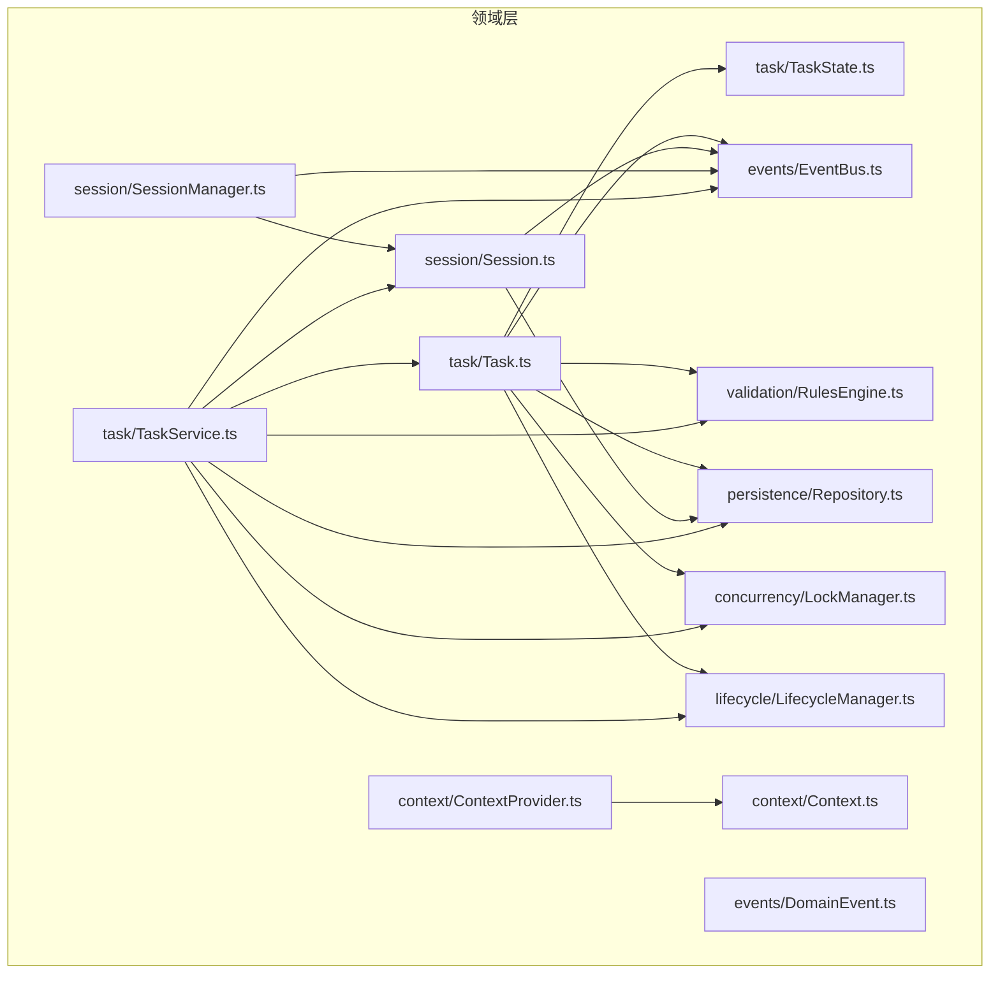
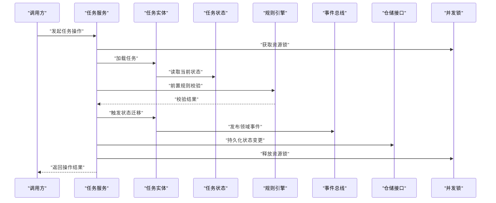
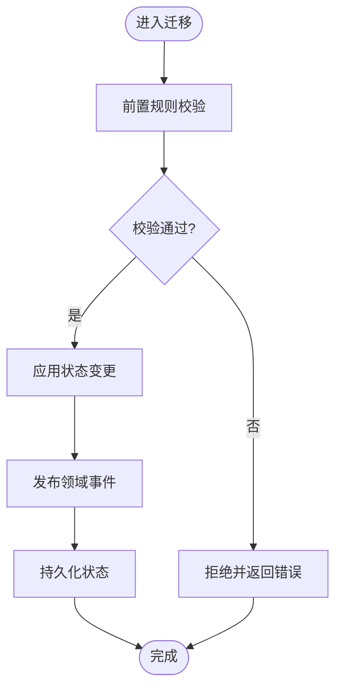
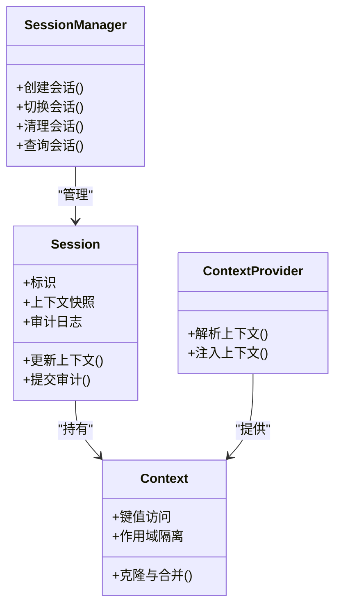
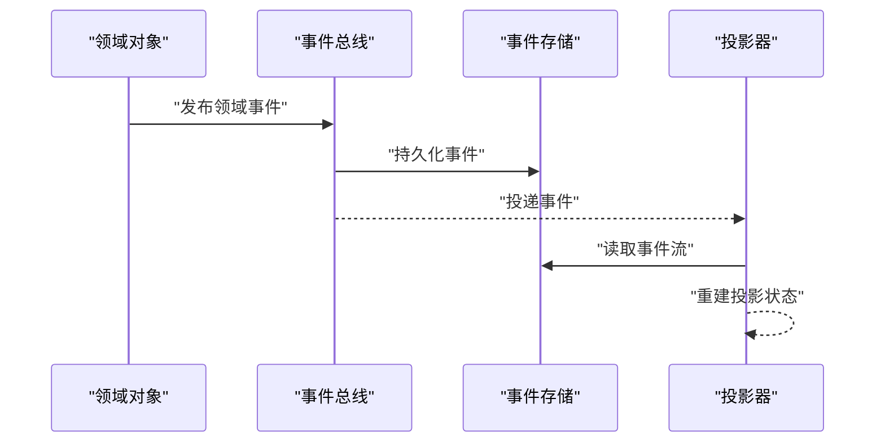
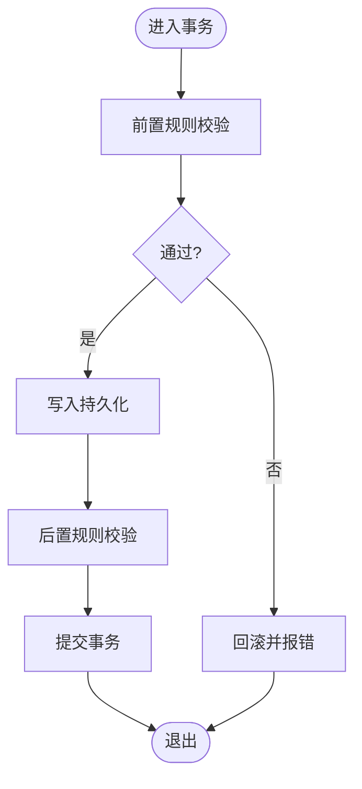
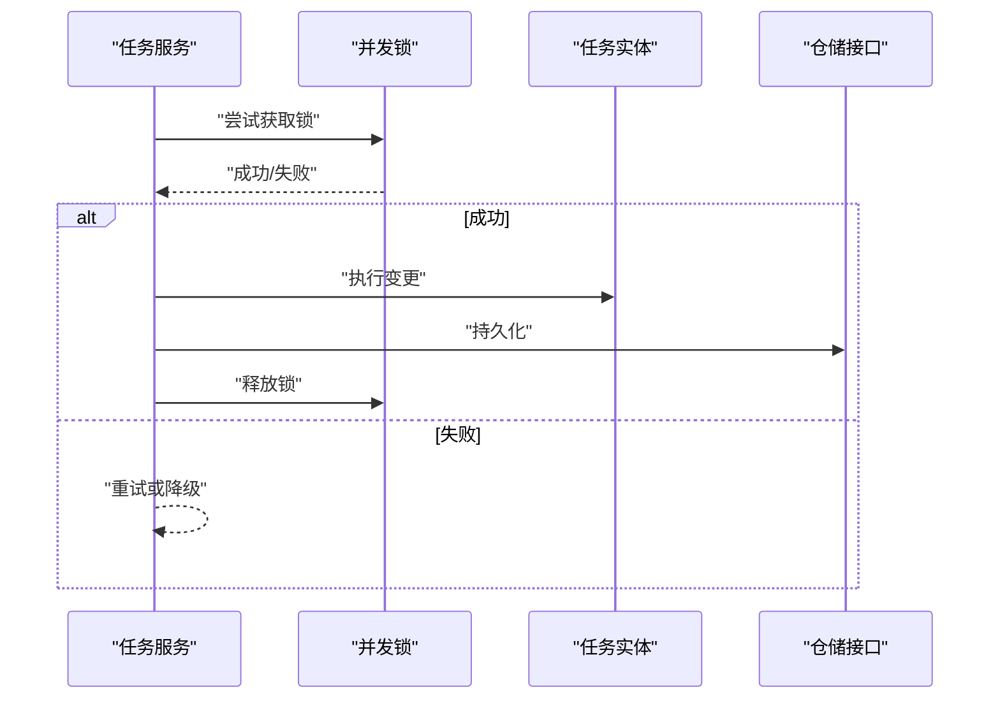
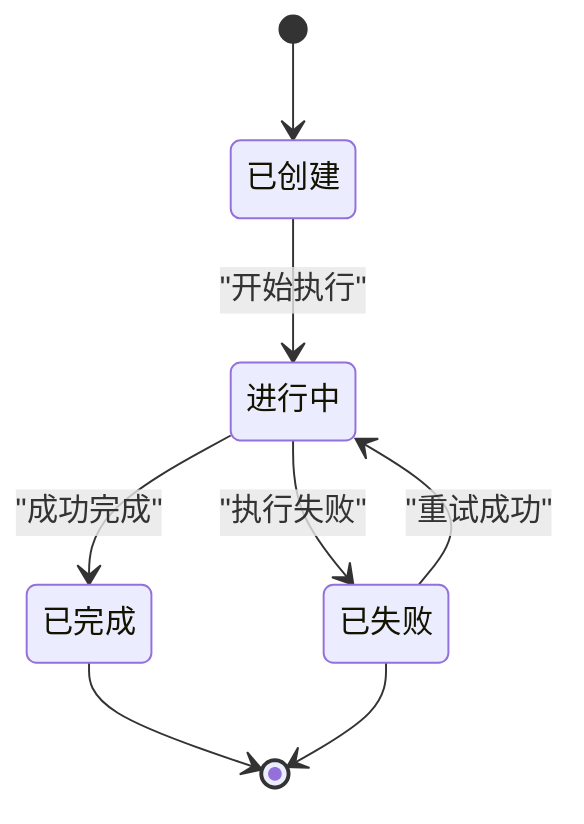
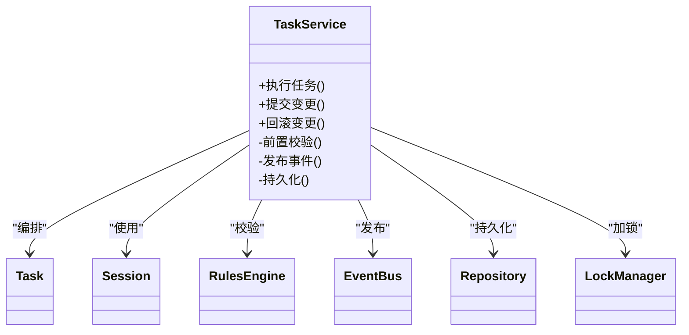
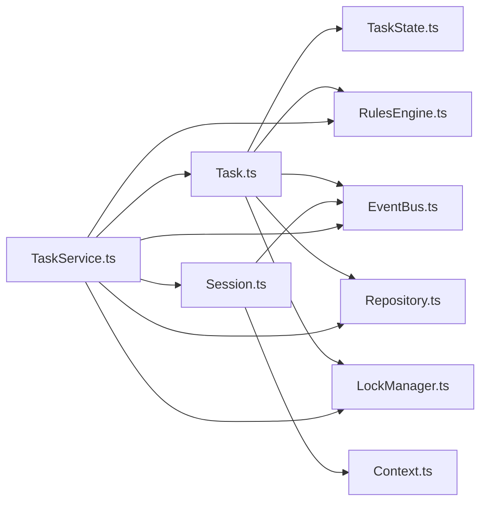

# 领域层（Domain Layer）

<cite>
**本文引用的文件**   
- [engine/packages/domain-layer/src/index.ts](file://engine/packages/domain-layer/src/index.ts)
- [engine/packages/domain-layer/src/task/Task.ts](file://engine/packages/domain-layer/src/task/Task.ts)
- [engine/packages/domain-layer/src/task/TaskState.ts](file://engine/packages/domain-layer/src/task/TaskState.ts)
- [engine/packages/domain-layer/src/task/TaskService.ts](file://engine/packages/domain-layer/src/task/TaskService.ts)
- [engine/packages/domain-layer/src/session/Session.ts](file://engine/packages/domain-layer/src/session/Session.ts)
- [engine/packages/domain-layer/src/session/SessionManager.ts](file://engine/packages/domain-layer/src/session/SessionManager.ts)
- [engine/packages/domain-layer/src/context/Context.ts](file://engine/packages/domain-layer/src/context/Context.ts)
- [engine/packages/domain-layer/src/context/ContextProvider.ts](file://engine/packages/domain-layer/src/context/ContextProvider.ts)
- [engine/packages/domain-layer/src/events/EventBus.ts](file://engine/packages/domain-layer/src/events/EventBus.ts)
- [engine/packages/domain-layer/src/events/DomainEvent.ts](file://engine/packages/domain-layer/src/events/DomainEvent.ts)
- [engine/packages/domain-layer/src/validation/RulesEngine.ts](file://engine/packages/domain-layer/src/validation/RulesEngine.ts)
- [engine/packages/domain-layer/src/persistence/Repository.ts](file://engine/packages/domain-layer/src/persistence/Repository.ts)
- [engine/packages/domain-layer/src/concurrency/LockManager.ts](file://engine/packages/domain-layer/src/concurrency/LockManager.ts)
- [engine/packages/domain-layer/src/lifecycle/LifecycleManager.ts](file://engine/packages/domain-layer/src/lifecycle/LifecycleManager.ts)
- [engine/packages/domain-layer/tests/domain.test.ts](file://engine/packages/domain-layer/tests/domain.test.ts)
- [engine/packages/domain-layer/tests/task-state-builder.test.ts](file://engine/packages/domain-layer/tests/task-state-builder.test.ts)
- [engine/packages/domain-layer/tests/run-event-store.test.ts](file://engine/packages/domain-layer/tests/run-event-store.test.ts)
</cite>

## 目录
1. [简介](#简介)
2. [项目结构](#项目结构)
3. [核心组件](#核心组件)
4. [架构总览](#架构总览)
5. [详细组件分析](#详细组件分析)
6. [依赖关系分析](#依赖关系分析)
7. [性能考量](#性能考量)
8. [故障排查指南](#故障排查指南)
9. [结论](#结论)
10. [附录](#附录)

## 简介
本章节聚焦于KCoder引擎的领域层，围绕业务逻辑的核心抽象进行系统化说明。重点包括：
- 任务模型、会话管理与上下文处理
- 领域事件定义与传播机制（含事件溯源与状态变更追踪）
- 业务规则验证、事务管理与并发控制策略
- 领域对象生命周期与状态转换规则
- 领域服务实现模式与测试策略（含模拟对象使用）

## 项目结构
领域层采用分层与按能力组织相结合的结构，核心包位于 engine/packages/domain-layer。主要目录与职责如下：
- task：任务实体、状态机与服务编排
- session：会话实体与会话管理器
- context：上下文抽象与提供者
- events：领域事件总线与事件基类
- validation：业务规则校验器
- persistence：仓储接口（持久化契约）
- concurrency：并发锁管理
- lifecycle：领域对象生命周期管理
- tests：单元测试与集成测试

图表来源
- [engine/packages/domain-layer/src/task/Task.ts](file://engine/packages/domain-layer/src/task/Task.ts)
- [engine/packages/domain-layer/src/task/TaskState.ts](file://engine/packages/domain-layer/src/task/TaskState.ts)
- [engine/packages/domain-layer/src/task/TaskService.ts](file://engine/packages/domain-layer/src/task/TaskService.ts)
- [engine/packages/domain-layer/src/session/Session.ts](file://engine/packages/domain-layer/src/session/Session.ts)
- [engine/packages/domain-layer/src/session/SessionManager.ts](file://engine/packages/domain-layer/src/session/SessionManager.ts)
- [engine/packages/domain-layer/src/context/Context.ts](file://engine/packages/domain-layer/src/context/Context.ts)
- [engine/packages/domain-layer/src/context/ContextProvider.ts](file://engine/packages/domain-layer/src/context/ContextProvider.ts)
- [engine/packages/domain-layer/src/events/EventBus.ts](file://engine/packages/domain-layer/src/events/EventBus.ts)
- [engine/packages/domain-layer/src/events/DomainEvent.ts](file://engine/packages/domain-layer/src/events/DomainEvent.ts)
- [engine/packages/domain-layer/src/validation/RulesEngine.ts](file://engine/packages/domain-layer/src/validation/RulesEngine.ts)
- [engine/packages/domain-layer/src/persistence/Repository.ts](file://engine/packages/domain-layer/src/persistence/Repository.ts)
- [engine/packages/domain-layer/src/concurrency/LockManager.ts](file://engine/packages/domain-layer/src/concurrency/LockManager.ts)
- [engine/packages/domain-layer/src/lifecycle/LifecycleManager.ts](file://engine/packages/domain-layer/src/lifecycle/LifecycleManager.ts)

章节来源
- [engine/packages/domain-layer/src/index.ts](file://engine/packages/domain-layer/src/index.ts)

## 核心组件
本节概述领域层的关键抽象及其职责边界：
- 任务模型（Task）：承载业务目标、输入输出、阶段与约束；封装状态转换与不变式检查
- 任务状态（TaskState）：描述任务当前状态及可迁移集合，提供一致性校验
- 任务服务（TaskService）：协调任务与资源，编排跨实体的业务流程，保证事务性与幂等性
- 会话（Session）：表示一次用户交互或执行单元，维护上下文与审计轨迹
- 会话管理器（SessionManager）：负责会话创建、切换、清理与聚合统计
- 上下文（Context）：提供请求级/执行级数据访问（如权限、租户、追踪ID）
- 上下文提供者（ContextProvider）：注入与解析上下文，支持多环境适配
- 领域事件（DomainEvent + EventBus）：定义不可变事件与发布订阅通道，支撑事件溯源
- 规则引擎（RulesEngine）：集中式业务规则校验与错误聚合
- 仓储接口（Repository）：领域对象的持久化契约，屏蔽底层存储差异
- 并发锁（LockManager）：细粒度分布式/进程内锁，保障并发安全
- 生命周期（LifecycleManager）：统一初始化、就绪、销毁钩子，确保资源有序释放

章节来源
- [engine/packages/domain-layer/src/task/Task.ts](file://engine/packages/domain-layer/src/task/Task.ts)
- [engine/packages/domain-layer/src/task/TaskState.ts](file://engine/packages/domain-layer/src/task/TaskState.ts)
- [engine/packages/domain-layer/src/task/TaskService.ts](file://engine/packages/domain-layer/src/task/TaskService.ts)
- [engine/packages/domain-layer/src/session/Session.ts](file://engine/packages/domain-layer/src/session/Session.ts)
- [engine/packages/domain-layer/src/session/SessionManager.ts](file://engine/packages/domain-layer/src/session/SessionManager.ts)
- [engine/packages/domain-layer/src/context/Context.ts](file://engine/packages/domain-layer/src/context/Context.ts)
- [engine/packages/domain-layer/src/context/ContextProvider.ts](file://engine/packages/domain-layer/src/context/ContextProvider.ts)
- [engine/packages/domain-layer/src/events/EventBus.ts](file://engine/packages/domain-layer/src/events/EventBus.ts)
- [engine/packages/domain-layer/src/events/DomainEvent.ts](file://engine/packages/domain-layer/src/events/DomainEvent.ts)
- [engine/packages/domain-layer/src/validation/RulesEngine.ts](file://engine/packages/domain-layer/src/validation/RulesEngine.ts)
- [engine/packages/domain-layer/src/persistence/Repository.ts](file://engine/packages/domain-layer/src/persistence/Repository.ts)
- [engine/packages/domain-layer/src/concurrency/LockManager.ts](file://engine/packages/domain-layer/src/concurrency/LockManager.ts)
- [engine/packages/domain-layer/src/lifecycle/LifecycleManager.ts](file://engine/packages/domain-layer/src/lifecycle/LifecycleManager.ts)

## 架构总览
领域层以“实体+服务+事件”为核心，通过仓储与上下文完成对外部系统的解耦。关键交互如下：
- 任务服务驱动任务状态迁移，并在每次变更时发布领域事件
- 会话管理器维护会话生命周期，为任务执行提供上下文
- 规则引擎在状态迁移前后进行前置/后置校验
- 并发锁保护热点资源的写路径，避免竞态条件
- 生命周期管理器协调启动/关闭顺序，确保资源正确释放

图表来源
- [engine/packages/domain-layer/src/task/TaskService.ts](file://engine/packages/domain-layer/src/task/TaskService.ts)
- [engine/packages/domain-layer/src/task/Task.ts](file://engine/packages/domain-layer/src/task/Task.ts)
- [engine/packages/domain-layer/src/task/TaskState.ts](file://engine/packages/domain-layer/src/task/TaskState.ts)
- [engine/packages/domain-layer/src/validation/RulesEngine.ts](file://engine/packages/domain-layer/src/validation/RulesEngine.ts)
- [engine/packages/domain-layer/src/events/EventBus.ts](file://engine/packages/domain-layer/src/events/EventBus.ts)
- [engine/packages/domain-layer/src/persistence/Repository.ts](file://engine/packages/domain-layer/src/persistence/Repository.ts)
- [engine/packages/domain-layer/src/concurrency/LockManager.ts](file://engine/packages/domain-layer/src/concurrency/LockManager.ts)

## 详细组件分析

### 任务模型与状态机
- 任务实体封装业务目标、输入参数、输出约定与审计信息，并提供受控的状态迁移方法
- 任务状态定义合法状态集合与迁移图，确保状态转换满足不变式
- 状态迁移流程包含前置校验、副作用记录、事件发布与持久化

图表来源
- [engine/packages/domain-layer/src/task/Task.ts](file://engine/packages/domain-layer/src/task/Task.ts)
- [engine/packages/domain-layer/src/task/TaskState.ts](file://engine/packages/domain-layer/src/task/TaskState.ts)
- [engine/packages/domain-layer/src/validation/RulesEngine.ts](file://engine/packages/domain-layer/src/validation/RulesEngine.ts)
- [engine/packages/domain-layer/src/events/EventBus.ts](file://engine/packages/domain-layer/src/events/EventBus.ts)
- [engine/packages/domain-layer/src/persistence/Repository.ts](file://engine/packages/domain-layer/src/persistence/Repository.ts)

章节来源
- [engine/packages/domain-layer/src/task/Task.ts](file://engine/packages/domain-layer/src/task/Task.ts)
- [engine/packages/domain-layer/src/task/TaskState.ts](file://engine/packages/domain-layer/src/task/TaskState.ts)

### 会话管理与上下文处理
- 会话实体维护一次交互的元数据、上下文快照与审计日志
- 会话管理器负责会话的创建、切换、合并与清理，并提供聚合查询
- 上下文抽象将请求级数据（如租户、权限、追踪ID）与业务逻辑解耦
- 上下文提供者根据运行环境注入具体实现，便于测试与部署

图表来源
- [engine/packages/domain-layer/src/session/Session.ts](file://engine/packages/domain-layer/src/session/Session.ts)
- [engine/packages/domain-layer/src/session/SessionManager.ts](file://engine/packages/domain-layer/src/session/SessionManager.ts)
- [engine/packages/domain-layer/src/context/Context.ts](file://engine/packages/domain-layer/src/context/Context.ts)
- [engine/packages/domain-layer/src/context/ContextProvider.ts](file://engine/packages/domain-layer/src/context/ContextProvider.ts)

章节来源
- [engine/packages/domain-layer/src/session/Session.ts](file://engine/packages/domain-layer/src/session/Session.ts)
- [engine/packages/domain-layer/src/session/SessionManager.ts](file://engine/packages/domain-layer/src/session/SessionManager.ts)
- [engine/packages/domain-layer/src/context/Context.ts](file://engine/packages/domain-layer/src/context/Context.ts)
- [engine/packages/domain-layer/src/context/ContextProvider.ts](file://engine/packages/domain-layer/src/context/ContextProvider.ts)

### 领域事件与事件溯源
- 领域事件是不可变的业务事实，用于表达状态变更与外部系统通知
- 事件总线提供发布/订阅通道，支持同步与异步分发
- 事件溯源通过持久化事件流重建领域对象状态，保证可审计与可回放

图表来源
- [engine/packages/domain-layer/src/events/DomainEvent.ts](file://engine/packages/domain-layer/src/events/DomainEvent.ts)
- [engine/packages/domain-layer/src/events/EventBus.ts](file://engine/packages/domain-layer/src/events/EventBus.ts)
- [engine/packages/domain-layer/tests/run-event-store.test.ts](file://engine/packages/domain-layer/tests/run-event-store.test.ts)

章节来源
- [engine/packages/domain-layer/src/events/DomainEvent.ts](file://engine/packages/domain-layer/src/events/DomainEvent.ts)
- [engine/packages/domain-layer/src/events/EventBus.ts](file://engine/packages/domain-layer/src/events/EventBus.ts)
- [engine/packages/domain-layer/tests/run-event-store.test.ts](file://engine/packages/domain-layer/tests/run-event-store.test.ts)

### 业务规则验证与事务管理
- 规则引擎集中管理业务规则，支持组合、优先级与错误聚合
- 任务服务在状态迁移前后调用规则引擎，确保不变式不被破坏
- 事务管理通过仓储接口包装持久化操作，保证原子性与一致性

图表来源
- [engine/packages/domain-layer/src/validation/RulesEngine.ts](file://engine/packages/domain-layer/src/validation/RulesEngine.ts)
- [engine/packages/domain-layer/src/task/TaskService.ts](file://engine/packages/domain-layer/src/task/TaskService.ts)
- [engine/packages/domain-layer/src/persistence/Repository.ts](file://engine/packages/domain-layer/src/persistence/Repository.ts)

章节来源
- [engine/packages/domain-layer/src/validation/RulesEngine.ts](file://engine/packages/domain-layer/src/validation/RulesEngine.ts)
- [engine/packages/domain-layer/src/task/TaskService.ts](file://engine/packages/domain-layer/src/task/TaskService.ts)
- [engine/packages/domain-layer/src/persistence/Repository.ts](file://engine/packages/domain-layer/src/persistence/Repository.ts)

### 并发控制策略
- 并发锁管理器提供细粒度锁，支持超时与重试策略
- 任务服务在热点资源写路径加锁，避免竞态条件与重复执行
- 结合事件溯源，可在冲突后通过重放恢复一致状态

图表来源
- [engine/packages/domain-layer/src/concurrency/LockManager.ts](file://engine/packages/domain-layer/src/concurrency/LockManager.ts)
- [engine/packages/domain-layer/src/task/TaskService.ts](file://engine/packages/domain-layer/src/task/TaskService.ts)
- [engine/packages/domain-layer/src/persistence/Repository.ts](file://engine/packages/domain-layer/src/persistence/Repository.ts)

章节来源
- [engine/packages/domain-layer/src/concurrency/LockManager.ts](file://engine/packages/domain-layer/src/concurrency/LockManager.ts)
- [engine/packages/domain-layer/src/task/TaskService.ts](file://engine/packages/domain-layer/src/task/TaskService.ts)

### 领域对象生命周期与状态转换
- 生命周期管理器统一处理初始化、就绪、销毁钩子
- 任务实体在生命周期各阶段触发相应事件，便于监控与审计
- 状态转换遵循最小权限原则，仅暴露必要的迁移入口

图表来源
- [engine/packages/domain-layer/src/lifecycle/LifecycleManager.ts](file://engine/packages/domain-layer/src/lifecycle/LifecycleManager.ts)
- [engine/packages/domain-layer/src/task/TaskState.ts](file://engine/packages/domain-layer/src/task/TaskState.ts)

章节来源
- [engine/packages/domain-layer/src/lifecycle/LifecycleManager.ts](file://engine/packages/domain-layer/src/lifecycle/LifecycleManager.ts)
- [engine/packages/domain-layer/src/task/TaskState.ts](file://engine/packages/domain-layer/src/task/TaskState.ts)

### 领域服务实现模式
- 任务服务作为协调者，组合任务、会话、上下文、规则、事件与持久化
- 典型流程：加载实体 → 前置校验 → 状态迁移 → 发布事件 → 持久化 → 释放资源
- 通过仓储接口与并发锁保证事务性与并发安全

图表来源
- [engine/packages/domain-layer/src/task/TaskService.ts](file://engine/packages/domain-layer/src/task/TaskService.ts)
- [engine/packages/domain-layer/src/task/Task.ts](file://engine/packages/domain-layer/src/task/Task.ts)
- [engine/packages/domain-layer/src/session/Session.ts](file://engine/packages/domain-layer/src/session/Session.ts)
- [engine/packages/domain-layer/src/validation/RulesEngine.ts](file://engine/packages/domain-layer/src/validation/RulesEngine.ts)
- [engine/packages/domain-layer/src/events/EventBus.ts](file://engine/packages/domain-layer/src/events/EventBus.ts)
- [engine/packages/domain-layer/src/persistence/Repository.ts](file://engine/packages/domain-layer/src/persistence/Repository.ts)
- [engine/packages/domain-layer/src/concurrency/LockManager.ts](file://engine/packages/domain-layer/src/concurrency/LockManager.ts)

章节来源
- [engine/packages/domain-layer/src/task/TaskService.ts](file://engine/packages/domain-layer/src/task/TaskService.ts)

## 依赖关系分析
领域层内部模块耦合度低、内聚度高，关键依赖方向如下：
- 任务模块依赖状态、规则、事件、持久化与并发锁
- 会话模块依赖上下文与事件
- 服务层作为协调者，依赖所有核心模块
- 上下文与提供者解耦，便于替换与测试

图表来源
- [engine/packages/domain-layer/src/task/Task.ts](file://engine/packages/domain-layer/src/task/Task.ts)
- [engine/packages/domain-layer/src/task/TaskState.ts](file://engine/packages/domain-layer/src/task/TaskState.ts)
- [engine/packages/domain-layer/src/task/TaskService.ts](file://engine/packages/domain-layer/src/task/TaskService.ts)
- [engine/packages/domain-layer/src/session/Session.ts](file://engine/packages/domain-layer/src/session/Session.ts)
- [engine/packages/domain-layer/src/context/Context.ts](file://engine/packages/domain-layer/src/context/Context.ts)
- [engine/packages/domain-layer/src/events/EventBus.ts](file://engine/packages/domain-layer/src/events/EventBus.ts)
- [engine/packages/domain-layer/src/validation/RulesEngine.ts](file://engine/packages/domain-layer/src/validation/RulesEngine.ts)
- [engine/packages/domain-layer/src/persistence/Repository.ts](file://engine/packages/domain-layer/src/persistence/Repository.ts)
- [engine/packages/domain-layer/src/concurrency/LockManager.ts](file://engine/packages/domain-layer/src/concurrency/LockManager.ts)

章节来源
- [engine/packages/domain-layer/src/index.ts](file://engine/packages/domain-layer/src/index.ts)

## 性能考量
- 事件发布尽量异步化，避免阻塞主流程
- 状态迁移批量持久化，减少IO次数
- 规则校验缓存热点规则，降低重复计算
- 并发锁粒度细化，缩短持锁时间
- 上下文克隆与合并按需进行，避免不必要的拷贝

[本节为通用指导，不直接分析具体文件]

## 故障排查指南
- 事件丢失或重复：检查事件总线投递策略与事件存储幂等性
- 状态不一致：核对状态迁移图与规则校验点，确认事务提交顺序
- 并发冲突：观察锁竞争与重试策略，必要时调整锁粒度或超时
- 上下文泄漏：确认上下文提供者是否正确注入与清理
- 生命周期异常：检查初始化/销毁钩子顺序与资源释放

章节来源
- [engine/packages/domain-layer/tests/domain.test.ts](file://engine/packages/domain-layer/tests/domain.test.ts)
- [engine/packages/domain-layer/tests/task-state-builder.test.ts](file://engine/packages/domain-layer/tests/task-state-builder.test.ts)
- [engine/packages/domain-layer/tests/run-event-store.test.ts](file://engine/packages/domain-layer/tests/run-event-store.test.ts)

## 结论
领域层通过清晰的分层与抽象，将业务逻辑从基础设施中剥离，提升了可测试性与可维护性。任务模型与会话管理构成了核心业务骨架，事件溯源与规则引擎保障了正确性与可审计性。配合并发控制与生命周期管理，系统在复杂场景下仍能保持稳定与高效。

[本节为总结性内容，不直接分析具体文件]

## 附录
- 测试策略建议：
  - 针对状态迁移编写正向与反向用例，覆盖非法迁移路径
  - 使用模拟对象替换仓储与事件总线，验证事务与事件行为
  - 对并发路径进行压力测试，验证锁策略与幂等性
  - 对上下文注入进行多环境测试，确保提供者可替换

章节来源
- [engine/packages/domain-layer/tests/domain.test.ts](file://engine/packages/domain-layer/tests/domain.test.ts)
- [engine/packages/domain-layer/tests/task-state-builder.test.ts](file://engine/packages/domain-layer/tests/task-state-builder.test.ts)
- [engine/packages/domain-layer/tests/run-event-store.test.ts](file://engine/packages/domain-layer/tests/run-event-store.test.ts)