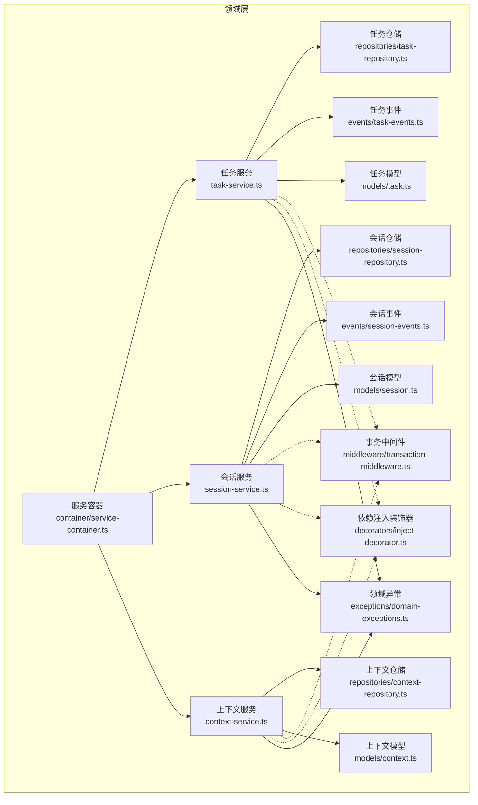
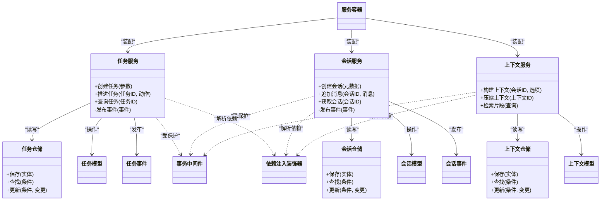
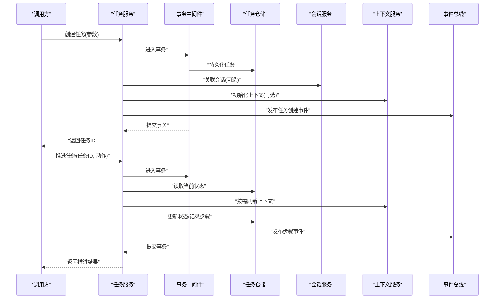
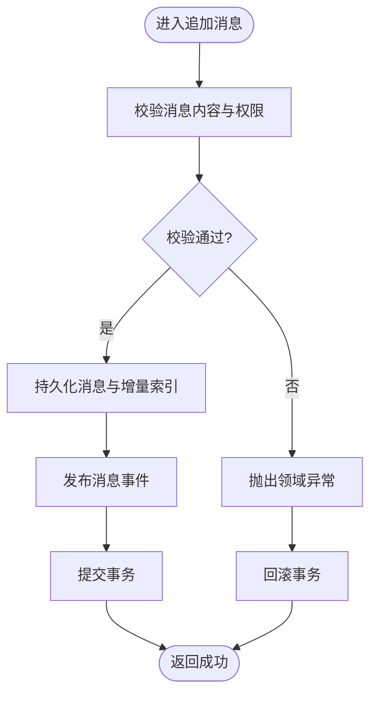
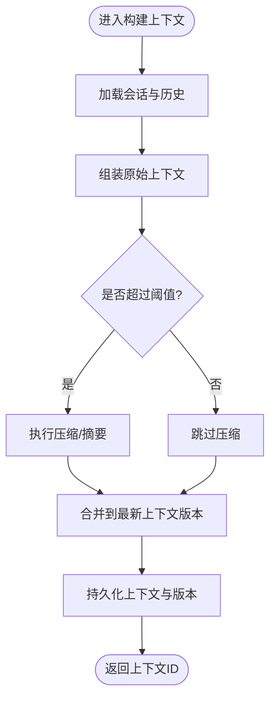
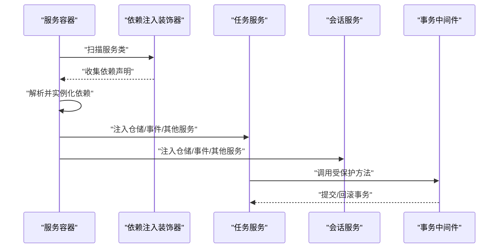
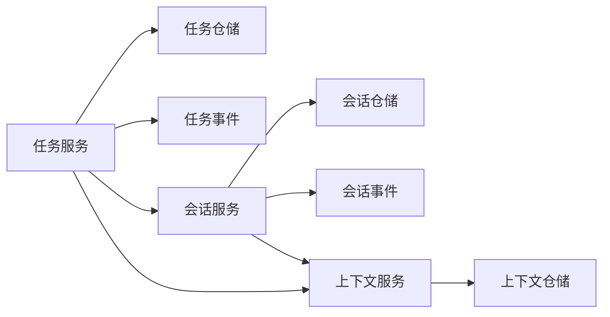

# 领域服务

<cite>
**本文引用的文件**   
- [engine/packages/domain-layer/src/services/task-service.ts](file://engine/packages/domain-layer/src/services/task-service.ts)
- [engine/packages/domain-layer/src/services/session-service.ts](file://engine/packages/domain-layer/src/services/session-service.ts)
- [engine/packages/domain-layer/src/services/context-service.ts](file://engine/packages/domain-layer/src/services/context-service.ts)
- [engine/packages/domain-layer/src/models/task.ts](file://engine/packages/domain-layer/src/models/task.ts)
- [engine/packages/domain-layer/src/models/session.ts](file://engine/packages/domain-layer/src/models/session.ts)
- [engine/packages/domain-layer/src/models/context.ts](file://engine/packages/domain-layer/src/models/context.ts)
- [engine/packages/domain-layer/src/repositories/task-repository.ts](file://engine/packages/domain-layer/src/repositories/task-repository.ts)
- [engine/packages/domain-layer/src/repositories/session-repository.ts](file://engine/packages/domain-layer/src/repositories/session-repository.ts)
- [engine/packages/domain-layer/src/repositories/context-repository.ts](file://engine/packages/domain-layer/src/repositories/context-repository.ts)
- [engine/packages/domain-layer/src/events/task-events.ts](file://engine/packages/domain-layer/src/events/task-events.ts)
- [engine/packages/domain-layer/src/events/session-events.ts](file://engine/packages/domain-layer/src/events/session-events.ts)
- [engine/packages/domain-layer/src/exceptions/domain-exceptions.ts](file://engine/packages/domain-layer/src/exceptions/domain-exceptions.ts)
- [engine/packages/domain-layer/src/middleware/transaction-middleware.ts](file://engine/packages/domain-layer/src/middleware/transaction-middleware.ts)
- [engine/packages/domain-layer/src/decorators/inject-decorator.ts](file://engine/packages/domain-layer/src/decorators/inject-decorator.ts)
- [engine/packages/domain-layer/src/container/service-container.ts](file://engine/packages/domain-layer/src/container/service-container.ts)
- [engine/packages/domain-layer/tests/task-service.test.ts](file://engine/packages/domain-layer/tests/task-service.test.ts)
- [engine/packages/domain-layer/tests/session-service.test.ts](file://engine/packages/domain-layer/tests/session-service.test.ts)
- [engine/packages/domain-layer/tests/context-service.test.ts](file://engine/packages/domain-layer/tests/context-service.test.ts)
</cite>

## 目录
1. [简介](#简介)
2. [项目结构](#项目结构)
3. [核心组件](#核心组件)
4. [架构总览](#架构总览)
5. [详细组件分析](#详细组件分析)
6. [依赖关系分析](#依赖关系分析)
7. [性能考量](#性能考量)
8. [故障排查指南](#故障排查指南)
9. [结论](#结论)
10. [附录](#附录)

## 简介
本文件聚焦于KCoder引擎的领域层服务，围绕任务编排、会话管理与上下文处理三大核心服务展开。文档从接口设计、依赖注入与事务管理入手，深入阐述复杂业务流程的编排与协调机制，并给出错误处理策略、异常传播路径以及测试策略与模拟对象使用方式。目标是帮助读者快速理解并正确使用这些领域服务，同时为扩展与维护提供清晰的参考。

## 项目结构
领域层采用分层与模块化组织：模型定义业务实体，仓储抽象持久化细节，服务承载领域逻辑，事件用于跨服务协作，中间件与装饰器支撑横切关注点（如事务与依赖注入），容器负责装配。

图表来源
- [engine/packages/domain-layer/src/services/task-service.ts](file://engine/packages/domain-layer/src/services/task-service.ts)
- [engine/packages/domain-layer/src/services/session-service.ts](file://engine/packages/domain-layer/src/services/session-service.ts)
- [engine/packages/domain-layer/src/services/context-service.ts](file://engine/packages/domain-layer/src/services/context-service.ts)
- [engine/packages/domain-layer/src/models/task.ts](file://engine/packages/domain-layer/src/models/task.ts)
- [engine/packages/domain-layer/src/models/session.ts](file://engine/packages/domain-layer/src/models/session.ts)
- [engine/packages/domain-layer/src/models/context.ts](file://engine/packages/domain-layer/src/models/context.ts)
- [engine/packages/domain-layer/src/repositories/task-repository.ts](file://engine/packages/domain-layer/src/repositories/task-repository.ts)
- [engine/packages/domain-layer/src/repositories/session-repository.ts](file://engine/packages/domain-layer/src/repositories/session-repository.ts)
- [engine/packages/domain-layer/src/repositories/context-repository.ts](file://engine/packages/domain-layer/src/repositories/context-repository.ts)
- [engine/packages/domain-layer/src/events/task-events.ts](file://engine/packages/domain-layer/src/events/task-events.ts)
- [engine/packages/domain-layer/src/events/session-events.ts](file://engine/packages/domain-layer/src/events/session-events.ts)
- [engine/packages/domain-layer/src/exceptions/domain-exceptions.ts](file://engine/packages/domain-layer/src/exceptions/domain-exceptions.ts)
- [engine/packages/domain-layer/src/middleware/transaction-middleware.ts](file://engine/packages/domain-layer/src/middleware/transaction-middleware.ts)
- [engine/packages/domain-layer/src/decorators/inject-decorator.ts](file://engine/packages/domain-layer/src/decorators/inject-decorator.ts)
- [engine/packages/domain-layer/src/container/service-container.ts](file://engine/packages/domain-layer/src/container/service-container.ts)

章节来源
- [engine/packages/domain-layer/src/services/task-service.ts](file://engine/packages/domain-layer/src/services/task-service.ts)
- [engine/packages/domain-layer/src/services/session-service.ts](file://engine/packages/domain-layer/src/services/session-service.ts)
- [engine/packages/domain-layer/src/services/context-service.ts](file://engine/packages/domain-layer/src/services/context-service.ts)
- [engine/packages/domain-layer/src/container/service-container.ts](file://engine/packages/domain-layer/src/container/service-container.ts)

## 核心组件
- 任务编排服务：负责任务的创建、状态推进、步骤调度与结果聚合，协调会话与上下文资源，发布领域事件以驱动外部流程。
- 会话管理服务：维护对话生命周期、消息序列与权限边界，提供会话级上下文隔离与恢复能力。
- 上下文处理服务：封装上下文构建、压缩、检索与版本管理，确保长对话场景下的可用性与性能。

上述服务通过仓储访问持久化数据，通过事件总线进行解耦通信，并通过事务中间件保障关键操作的一致性。

章节来源
- [engine/packages/domain-layer/src/services/task-service.ts](file://engine/packages/domain-layer/src/services/task-service.ts)
- [engine/packages/domain-layer/src/services/session-service.ts](file://engine/packages/domain-layer/src/services/session-service.ts)
- [engine/packages/domain-layer/src/services/context-service.ts](file://engine/packages/domain-layer/src/services/context-service.ts)
- [engine/packages/domain-layer/src/events/task-events.ts](file://engine/packages/domain-layer/src/events/task-events.ts)
- [engine/packages/domain-layer/src/events/session-events.ts](file://engine/packages/domain-layer/src/events/session-events.ts)
- [engine/packages/domain-layer/src/middleware/transaction-middleware.ts](file://engine/packages/domain-layer/src/middleware/transaction-middleware.ts)

## 架构总览
领域服务遵循“服务-仓储-模型-事件”的清晰分层，结合装饰器与中间件实现依赖注入与事务边界。容器集中装配服务与其依赖，对外暴露稳定的API。

图表来源
- [engine/packages/domain-layer/src/services/task-service.ts](file://engine/packages/domain-layer/src/services/task-service.ts)
- [engine/packages/domain-layer/src/services/session-service.ts](file://engine/packages/domain-layer/src/services/session-service.ts)
- [engine/packages/domain-layer/src/services/context-service.ts](file://engine/packages/domain-layer/src/services/context-service.ts)
- [engine/packages/domain-layer/src/repositories/task-repository.ts](file://engine/packages/domain-layer/src/repositories/task-repository.ts)
- [engine/packages/domain-layer/src/repositories/session-repository.ts](file://engine/packages/domain-layer/src/repositories/session-repository.ts)
- [engine/packages/domain-layer/src/repositories/context-repository.ts](file://engine/packages/domain-layer/src/repositories/context-repository.ts)
- [engine/packages/domain-layer/src/models/task.ts](file://engine/packages/domain-layer/src/models/task.ts)
- [engine/packages/domain-layer/src/models/session.ts](file://engine/packages/domain-layer/src/models/session.ts)
- [engine/packages/domain-layer/src/models/context.ts](file://engine/packages/domain-layer/src/models/context.ts)
- [engine/packages/domain-layer/src/events/task-events.ts](file://engine/packages/domain-layer/src/events/task-events.ts)
- [engine/packages/domain-layer/src/events/session-events.ts](file://engine/packages/domain-layer/src/events/session-events.ts)
- [engine/packages/domain-layer/src/middleware/transaction-middleware.ts](file://engine/packages/domain-layer/src/middleware/transaction-middleware.ts)
- [engine/packages/domain-layer/src/decorators/inject-decorator.ts](file://engine/packages/domain-layer/src/decorators/inject-decorator.ts)
- [engine/packages/domain-layer/src/container/service-container.ts](file://engine/packages/domain-layer/src/container/service-container.ts)

## 详细组件分析

### 任务编排服务
职责与边界
- 负责任务生命周期管理：创建、分步执行、重试、取消与完成。
- 协调会话与上下文：在推进任务时按需加载或刷新上下文，保证步骤执行的输入完备。
- 发布领域事件：任务状态变更、步骤开始/结束、失败等事件供上层订阅。

接口设计要点
- 创建任务：接收目标、约束与初始上下文引用，返回任务标识。
- 推进任务：基于当前状态与动作决定下一步，必要时触发子任务或工具调用。
- 查询任务：支持按ID、状态范围与时间窗口的查询。

依赖注入与事务
- 通过装饰器声明对仓储与事件的依赖，由容器统一注入。
- 关键写操作包裹在事务中间件中，确保多仓储写入的原子性。

复杂流程编排
- 采用“状态机+策略”模式：不同任务类型对应不同的推进策略；步骤间通过事件驱动异步回调。
- 失败重试与补偿：对可重试步骤进行指数退避重试；不可恢复错误立即终止并回滚。

错误处理与异常传播
- 领域异常用于表达业务规则违反（如非法状态转换）。
- 非领域异常（IO、网络）被包装为领域异常后向上抛出，保持调用方一致的错误语义。

图表来源
- [engine/packages/domain-layer/src/services/task-service.ts](file://engine/packages/domain-layer/src/services/task-service.ts)
- [engine/packages/domain-layer/src/repositories/task-repository.ts](file://engine/packages/domain-layer/src/repositories/task-repository.ts)
- [engine/packages/domain-layer/src/services/session-service.ts](file://engine/packages/domain-layer/src/services/session-service.ts)
- [engine/packages/domain-layer/src/services/context-service.ts](file://engine/packages/domain-layer/src/services/context-service.ts)
- [engine/packages/domain-layer/src/middleware/transaction-middleware.ts](file://engine/packages/domain-layer/src/middleware/transaction-middleware.ts)
- [engine/packages/domain-layer/src/events/task-events.ts](file://engine/packages/domain-layer/src/events/task-events.ts)

章节来源
- [engine/packages/domain-layer/src/services/task-service.ts](file://engine/packages/domain-layer/src/services/task-service.ts)
- [engine/packages/domain-layer/src/repositories/task-repository.ts](file://engine/packages/domain-layer/src/repositories/task-repository.ts)
- [engine/packages/domain-layer/src/events/task-events.ts](file://engine/packages/domain-layer/src/events/task-events.ts)
- [engine/packages/domain-layer/src/middleware/transaction-middleware.ts](file://engine/packages/domain-layer/src/middleware/transaction-middleware.ts)

### 会话管理服务
职责与边界
- 管理会话的创建、关闭与恢复，维护消息序列与权限上下文。
- 提供会话级隔离，确保不同会话间的上下文互不干扰。
- 与会话相关的事件（创建、消息追加、关闭）用于审计与追踪。

接口设计要点
- 创建会话：携带元数据（如用户、项目、工作区）。
- 追加消息：校验消息合法性，落盘并广播消息事件。
- 获取会话：支持分页与过滤，避免一次性加载过大历史。

依赖注入与事务
- 会话写入操作受事务中间件保护，保证消息与元数据一致性。
- 通过装饰器注入会话仓储与事件总线。

图表来源
- [engine/packages/domain-layer/src/services/session-service.ts](file://engine/packages/domain-layer/src/services/session-service.ts)
- [engine/packages/domain-layer/src/repositories/session-repository.ts](file://engine/packages/domain-layer/src/repositories/session-repository.ts)
- [engine/packages/domain-layer/src/events/session-events.ts](file://engine/packages/domain-layer/src/events/session-events.ts)
- [engine/packages/domain-layer/src/middleware/transaction-middleware.ts](file://engine/packages/domain-layer/src/middleware/transaction-middleware.ts)

章节来源
- [engine/packages/domain-layer/src/services/session-service.ts](file://engine/packages/domain-layer/src/services/session-service.ts)
- [engine/packages/domain-layer/src/repositories/session-repository.ts](file://engine/packages/domain-layer/src/repositories/session-repository.ts)
- [engine/packages/domain-layer/src/events/session-events.ts](file://engine/packages/domain-layer/src/events/session-events.ts)
- [engine/packages/domain-layer/src/middleware/transaction-middleware.ts](file://engine/packages/domain-layer/src/middleware/transaction-middleware.ts)

### 上下文处理服务
职责与边界
- 负责上下文的构建、压缩、检索与版本管理，支撑长对话与高并发场景。
- 提供上下文快照与差异合并，便于恢复与回放。
- 与任务服务协作，在任务推进前按需准备上下文。

接口设计要点
- 构建上下文：根据会话与配置生成结构化上下文。
- 压缩上下文：对冗余信息进行摘要与裁剪，保留关键信息。
- 检索片段：基于关键词或语义相似度召回相关片段。

依赖注入与事务
- 上下文写入与版本切换受事务保护，避免部分更新导致的不一致。
- 通过装饰器注入上下文仓储与缓存（如有）。

图表来源
- [engine/packages/domain-layer/src/services/context-service.ts](file://engine/packages/domain-layer/src/services/context-service.ts)
- [engine/packages/domain-layer/src/repositories/context-repository.ts](file://engine/packages/domain-layer/src/repositories/context-repository.ts)
- [engine/packages/domain-layer/src/middleware/transaction-middleware.ts](file://engine/packages/domain-layer/src/middleware/transaction-middleware.ts)

章节来源
- [engine/packages/domain-layer/src/services/context-service.ts](file://engine/packages/domain-layer/src/services/context-service.ts)
- [engine/packages/domain-layer/src/repositories/context-repository.ts](file://engine/packages/domain-layer/src/repositories/context-repository.ts)
- [engine/packages/domain-layer/src/middleware/transaction-middleware.ts](file://engine/packages/domain-layer/src/middleware/transaction-middleware.ts)

### 依赖注入与事务管理
- 依赖注入装饰器：在服务类上声明依赖字段，容器在启动时扫描并注入实例，降低耦合度。
- 事务中间件：为服务方法提供事务边界，自动开启、提交与回滚，确保跨仓储操作的原子性。
- 服务容器：集中注册服务与仓储，提供统一的获取入口，便于替换实现与测试。

图表来源
- [engine/packages/domain-layer/src/decorators/inject-decorator.ts](file://engine/packages/domain-layer/src/decorators/inject-decorator.ts)
- [engine/packages/domain-layer/src/container/service-container.ts](file://engine/packages/domain-layer/src/container/service-container.ts)
- [engine/packages/domain-layer/src/middleware/transaction-middleware.ts](file://engine/packages/domain-layer/src/middleware/transaction-middleware.ts)
- [engine/packages/domain-layer/src/services/task-service.ts](file://engine/packages/domain-layer/src/services/task-service.ts)
- [engine/packages/domain-layer/src/services/session-service.ts](file://engine/packages/domain-layer/src/services/session-service.ts)

章节来源
- [engine/packages/domain-layer/src/decorators/inject-decorator.ts](file://engine/packages/domain-layer/src/decorators/inject-decorator.ts)
- [engine/packages/domain-layer/src/container/service-container.ts](file://engine/packages/domain-layer/src/container/service-container.ts)
- [engine/packages/domain-layer/src/middleware/transaction-middleware.ts](file://engine/packages/domain-layer/src/middleware/transaction-middleware.ts)

## 依赖关系分析
- 低耦合：服务仅依赖仓储接口与事件总线，不感知具体存储实现。
- 内聚性：每个服务专注单一职责，通过事件与其他服务解耦。
- 循环依赖规避：通过容器延迟解析与接口抽象避免环。

图表来源
- [engine/packages/domain-layer/src/services/task-service.ts](file://engine/packages/domain-layer/src/services/task-service.ts)
- [engine/packages/domain-layer/src/services/session-service.ts](file://engine/packages/domain-layer/src/services/session-service.ts)
- [engine/packages/domain-layer/src/services/context-service.ts](file://engine/packages/domain-layer/src/services/context-service.ts)
- [engine/packages/domain-layer/src/repositories/task-repository.ts](file://engine/packages/domain-layer/src/repositories/task-repository.ts)
- [engine/packages/domain-layer/src/repositories/session-repository.ts](file://engine/packages/domain-layer/src/repositories/session-repository.ts)
- [engine/packages/domain-layer/src/repositories/context-repository.ts](file://engine/packages/domain-layer/src/repositories/context-repository.ts)
- [engine/packages/domain-layer/src/events/task-events.ts](file://engine/packages/domain-layer/src/events/task-events.ts)
- [engine/packages/domain-layer/src/events/session-events.ts](file://engine/packages/domain-layer/src/events/session-events.ts)

章节来源
- [engine/packages/domain-layer/src/services/task-service.ts](file://engine/packages/domain-layer/src/services/task-service.ts)
- [engine/packages/domain-layer/src/services/session-service.ts](file://engine/packages/domain-layer/src/services/session-service.ts)
- [engine/packages/domain-layer/src/services/context-service.ts](file://engine/packages/domain-layer/src/services/context-service.ts)

## 性能考量
- 上下文压缩：在上下文规模增长时主动压缩，减少内存占用与I/O压力。
- 分页与增量加载：会话消息与上下文片段采用分页与增量加载，避免全量读取。
- 事务粒度：尽量缩小事务范围，将只读操作移出事务，提升吞吐。
- 事件异步：将耗时处理（如统计、通知）通过事件异步执行，缩短主流程响应时间。

[本节为通用指导，无需代码来源]

## 故障排查指南
- 常见异常类型
  - 领域异常：表示业务规则违反，如非法状态转换、权限不足。
  - 基础设施异常：表示底层I/O、网络或数据库错误，通常会被包装为领域异常。
- 异常传播路径
  - 仓储层抛出基础异常 -> 服务层捕获并转换为领域异常 -> 事务中间件回滚 -> 调用方收到领域异常。
- 定位建议
  - 检查事务边界是否正确包裹了所有写操作。
  - 核对事件发布是否在事务提交之后，避免丢失事件。
  - 查看上下文压缩阈值与分页大小，确认是否存在性能瓶颈导致的超时。

章节来源
- [engine/packages/domain-layer/src/exceptions/domain-exceptions.ts](file://engine/packages/domain-layer/src/exceptions/domain-exceptions.ts)
- [engine/packages/domain-layer/src/middleware/transaction-middleware.ts](file://engine/packages/domain-layer/src/middleware/transaction-middleware.ts)

## 结论
KCoder领域服务通过清晰的分层、明确的职责划分与事件驱动机制，实现了高内聚、低耦合的业务编排。依赖注入与事务中间件进一步提升了可测试性与一致性保障。建议在扩展新功能时遵循现有模式：新增服务、定义模型与仓储、发布领域事件，并在事务边界内完成关键写操作。

[本节为总结，无需代码来源]

## 附录

### 测试策略与模拟对象
- 单元测试
  - 针对服务方法编写用例，使用模拟仓储与事件总线验证行为与异常路径。
  - 覆盖正常流程、边界条件与错误分支。
- 集成测试
  - 使用真实仓储实现（如内存或SQLite）验证事务与事件一致性。
- 模拟对象
  - 为仓储与事件总线提供轻量实现，断言调用次数与参数。
  - 对上下文压缩与检索逻辑提供可控输入，验证输出结构与性能指标。

章节来源
- [engine/packages/domain-layer/tests/task-service.test.ts](file://engine/packages/domain-layer/tests/task-service.test.ts)
- [engine/packages/domain-layer/tests/session-service.test.ts](file://engine/packages/domain-layer/tests/session-service.test.ts)
- [engine/packages/domain-layer/tests/context-service.test.ts](file://engine/packages/domain-layer/tests/context-service.test.ts)