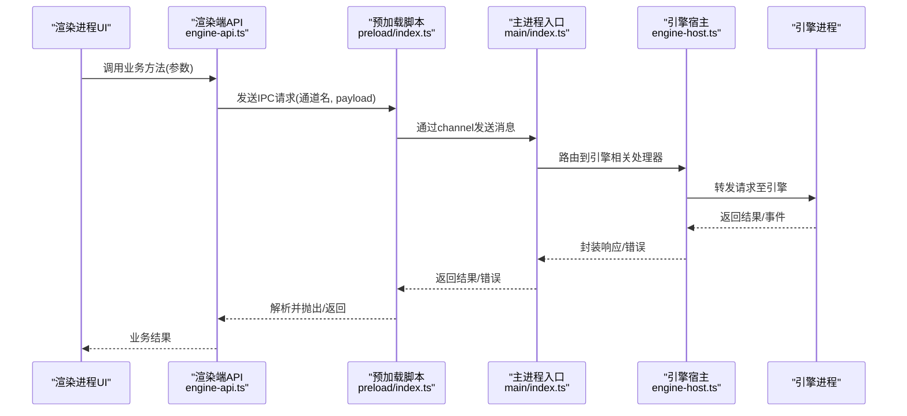
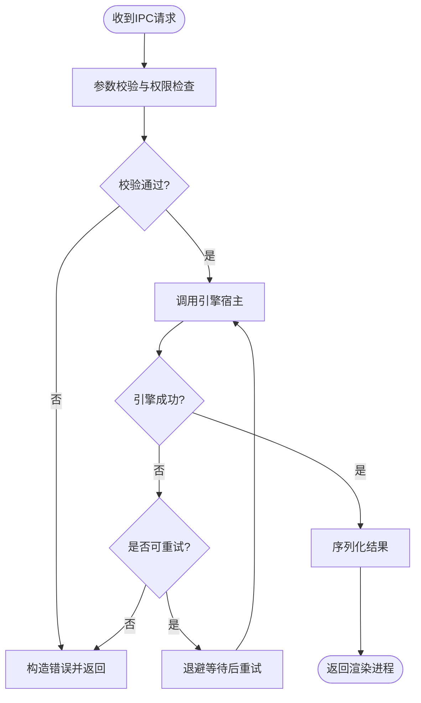
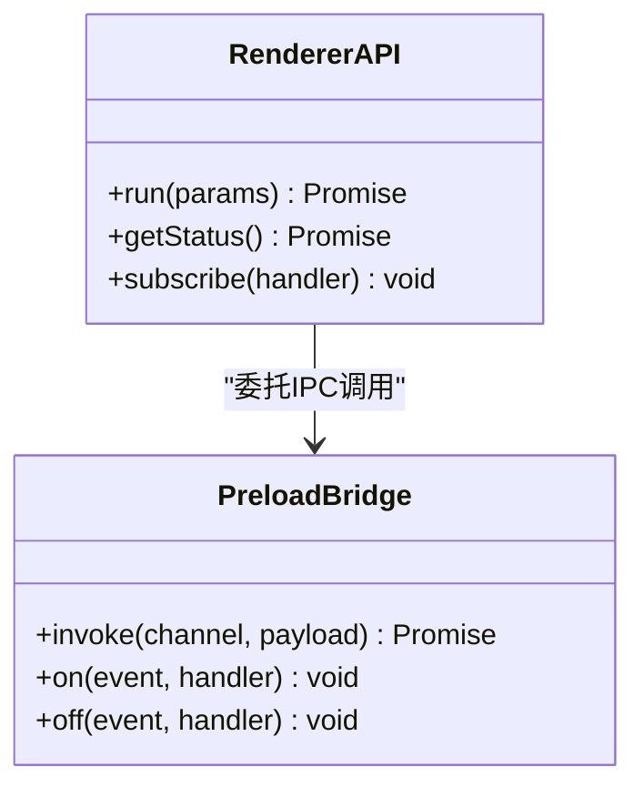
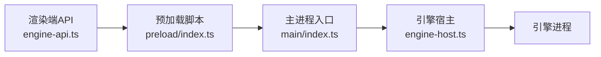

# IPC通信扩展

<cite>
**本文引用的文件**   
- [app/main/index.ts](file://app/main/index.ts)
- [app/main/engine-host.ts](file://app/main/engine-host.ts)
- [app/preload/index.ts](file://app/preload/index.ts)
- [app/renderer/src/services/engine-api.ts](file://app/renderer/src/services/engine-api.ts)
</cite>

## 目录
1. [简介](#简介)
2. [项目结构](#项目结构)
3. [核心组件](#核心组件)
4. [架构总览](#架构总览)
5. [详细组件分析](#详细组件分析)
6. [依赖关系分析](#依赖关系分析)
7. [性能考虑](#性能考虑)
8. [故障排查指南](#故障排查指南)
9. [结论](#结论)
10. [附录](#附录)

## 简介
本文件面向KCoder的IPC通信扩展，系统性阐述Electron主进程与渲染进程之间的通信机制、预加载脚本的职责、消息协议与数据序列化策略；并给出IPC通道注册与管理、安全验证与权限控制、错误处理的设计与实践。同时提供扩展开发指南（自定义IPC通道、事件监听与处理、异步操作封装），以及主进程与引擎间的桥接机制（进程间数据同步、状态管理、异常传播）。文末包含安全注意事项、性能优化建议与调试技巧，并说明如何扩展现有接口与新增通信通道。

## 项目结构
本项目采用Electron多进程架构：
- 主进程：负责应用生命周期、窗口管理、与外部引擎进程的桥接、IPC通道注册与安全校验。
- 预加载脚本：在渲染进程启动前注入受限API，暴露安全的IPC调用入口。
- 渲染进程：业务UI与交互逻辑，通过预加载脚本提供的API发起IPC请求。
- 引擎：独立的可执行或子进程，由主进程托管并与之进行进程间通信。

```mermaid
graph TB
subgraph "主进程"
main_index["主进程入口<br/>app/main/index.ts"]
engine_host["引擎宿主/桥接<br/>app/main/engine-host.ts"]
end
subgraph "预加载层"
preload["预加载脚本<br/>app/preload/index.ts"]
end
subgraph "渲染进程"
renderer_api["渲染端API封装<br/>app/renderer/src/services/engine-api.ts"]
ui["UI与业务逻辑"]
end
subgraph "引擎进程"
engine["引擎服务"]
end
ui --> renderer_api
renderer_api --> preload
preload --> main_index
main_index --> engine_host
engine_host < --> engine
```

图表来源
- [app/main/index.ts](file://app/main/index.ts)
- [app/main/engine-host.ts](file://app/main/engine-host.ts)
- [app/preload/index.ts](file://app/preload/index.ts)
- [app/renderer/src/services/engine-api.ts](file://app/renderer/src/services/engine-api.ts)

章节来源
- [app/main/index.ts](file://app/main/index.ts)
- [app/main/engine-host.ts](file://app/main/engine-host.ts)
- [app/preload/index.ts](file://app/preload/index.ts)
- [app/renderer/src/services/engine-api.ts](file://app/renderer/src/services/engine-api.ts)

## 核心组件
- 主进程入口：初始化应用、创建窗口、注册IPC通道、启动引擎宿主。
- 引擎宿主：负责与引擎进程建立连接、转发请求/响应、维护会话与状态、处理异常与重试。
- 预加载脚本：将受控的IPC能力暴露给渲染进程，屏蔽底层细节，统一序列化与错误包装。
- 渲染端API：为业务代码提供类型化、易用的方法，内部委托预加载脚本完成IPC调用。

章节来源
- [app/main/index.ts](file://app/main/index.ts)
- [app/main/engine-host.ts](file://app/main/engine-host.ts)
- [app/preload/index.ts](file://app/preload/index.ts)
- [app/renderer/src/services/engine-api.ts](file://app/renderer/src/services/engine-api.ts)

## 架构总览
下图展示从渲染进程到引擎的端到端调用路径，包括IPC通道、预加载桥接、主进程路由与引擎宿主的职责边界。



图表来源
- [app/renderer/src/services/engine-api.ts](file://app/renderer/src/services/engine-api.ts)
- [app/preload/index.ts](file://app/preload/index.ts)
- [app/main/index.ts](file://app/main/index.ts)
- [app/main/engine-host.ts](file://app/main/engine-host.ts)

## 详细组件分析

### 主进程入口与IPC通道注册
- 职责
  - 初始化应用与窗口。
  - 注册IPC通道，按功能域划分（如“引擎”、“设置”、“文件”等）。
  - 对每个通道实现处理器，负责参数校验、权限检查、调用下游模块、返回标准化响应。
- 设计要点
  - 通道命名规范：使用点分命名空间，如“engine.run”、“engine.status”，便于权限与日志追踪。
  - 处理器幂等性：对可重复调用的操作应保证幂等或明确副作用范围。
  - 错误模型：统一错误对象，包含code、message、details等字段，便于前端展示与定位。
- 扩展方式
  - 新增通道时，在主进程入口集中注册，避免散落在各处。
  - 对敏感通道增加白名单或角色校验。

章节来源
- [app/main/index.ts](file://app/main/index.ts)

### 引擎宿主与进程桥接
- 职责
  - 管理引擎进程生命周期（启动、停止、重启）。
  - 维护与引擎的连接与会话，转发请求与响应。
  - 处理超时、重试、断线重连、异常传播。
- 数据同步与状态管理
  - 维护当前任务/会话状态，确保主进程与引擎状态一致。
  - 对长耗时操作采用事件流或增量更新，避免阻塞主线程。
- 异常传播
  - 将引擎侧异常转换为统一错误模型，附带上下文信息（如任务ID、步骤索引）。
  - 对可恢复错误实施退避重试，对不可恢复错误快速失败并上报。



图表来源
- [app/main/engine-host.ts](file://app/main/engine-host.ts)

章节来源
- [app/main/engine-host.ts](file://app/main/engine-host.ts)

### 预加载脚本与渲染端API
- 预加载脚本
  - 仅暴露必要的IPC方法，隐藏底层通道名与序列化细节。
  - 对返回值进行规范化，统一错误包装，支持Promise风格调用。
  - 可选：对高频通道做轻量缓存或去抖。
- 渲染端API
  - 提供类型化的业务方法，内部委托预加载脚本完成IPC调用。
  - 对业务语义进行二次封装（如重试、取消、进度回调）。



图表来源
- [app/preload/index.ts](file://app/preload/index.ts)
- [app/renderer/src/services/engine-api.ts](file://app/renderer/src/services/engine-api.ts)

章节来源
- [app/preload/index.ts](file://app/preload/index.ts)
- [app/renderer/src/services/engine-api.ts](file://app/renderer/src/services/engine-api.ts)

### 消息传递协议与数据序列化
- 通道命名
  - 使用点分命名空间，如“engine.*”、“settings.*”。
- 请求/响应格式
  - 请求体包含：通道名、参数、可选的请求ID与时间戳。
  - 响应体包含：成功数据或错误对象（含code、message、details）。
- 序列化策略
  - 优先使用结构化JSON；对大对象或二进制数据采用分块传输或临时文件引用。
  - 对循环引用、函数、Symbol等进行过滤或转换，避免序列化失败。
- 事件机制
  - 对于长任务，采用事件推送（如progress、status）替代轮询。
  - 事件携带最小必要上下文，避免带宽浪费。

章节来源
- [app/preload/index.ts](file://app/preload/index.ts)
- [app/main/index.ts](file://app/main/index.ts)

### 安全验证、权限控制与错误处理
- 安全验证
  - 所有IPC通道均需显式注册，禁止隐式路由。
  - 对敏感通道进行来源校验（如窗口标识、用户角色）。
- 权限控制
  - 基于角色的访问控制（RBAC）或能力开关，限制可用通道集合。
  - 对写操作进行二次确认或审计日志记录。
- 错误处理
  - 统一错误码体系，区分客户端错误、服务端错误、网络/引擎错误。
  - 对关键错误进行告警与堆栈收集，便于线上问题定位。

章节来源
- [app/main/index.ts](file://app/main/index.ts)
- [app/main/engine-host.ts](file://app/main/engine-host.ts)

### 扩展开发指南
- 新增自定义IPC通道
  - 在主进程入口注册新通道与处理器，实现参数校验与权限检查。
  - 在预加载脚本中暴露对应方法，保持命名与通道一致。
  - 在渲染端API中封装业务方法，提供类型提示与默认参数。
- 事件监听与处理
  - 在预加载层订阅事件，转发到渲染端API的事件总线。
  - 在渲染端对事件进行节流与合并，避免UI抖动。
- 异步操作封装
  - 对长耗时操作提供取消令牌与进度回调。
  - 对可重试操作实现指数退避与最大重试次数限制。

章节来源
- [app/main/index.ts](file://app/main/index.ts)
- [app/preload/index.ts](file://app/preload/index.ts)
- [app/renderer/src/services/engine-api.ts](file://app/renderer/src/services/engine-api.ts)

## 依赖关系分析
- 组件耦合
  - 渲染端API强依赖预加载桥接，弱依赖主进程具体实现。
  - 主进程入口聚合各功能域处理器，引擎宿主作为独立子系统被调用。
- 外部依赖
  - Electron IPC用于主/渲染进程通信。
  - 引擎进程通过本地端口或标准输入输出进行通信（视实现而定）。
- 潜在循环依赖
  - 避免在预加载脚本中引入复杂业务逻辑，防止反向依赖主进程。



图表来源
- [app/renderer/src/services/engine-api.ts](file://app/renderer/src/services/engine-api.ts)
- [app/preload/index.ts](file://app/preload/index.ts)
- [app/main/index.ts](file://app/main/index.ts)
- [app/main/engine-host.ts](file://app/main/engine-host.ts)

章节来源
- [app/renderer/src/services/engine-api.ts](file://app/renderer/src/services/engine-api.ts)
- [app/preload/index.ts](file://app/preload/index.ts)
- [app/main/index.ts](file://app/main/index.ts)
- [app/main/engine-host.ts](file://app/main/engine-host.ts)

## 性能考虑
- 批量与去抖
  - 对高频小消息进行批处理与去抖，减少IPC开销。
- 分块与大对象
  - 对大对象采用分块传输或临时文件引用，避免一次性序列化导致卡顿。
- 事件驱动
  - 用事件替代轮询，降低无效往返。
- 资源回收
  - 及时释放事件监听器与定时器，避免内存泄漏。
- 超时与限流
  - 为长耗时操作设置合理超时与限流阈值，保护系统稳定性。

[本节为通用指导，不直接分析具体文件]

## 故障排查指南
- 常见问题
  - 通道未注册：检查主进程入口是否正确注册通道与处理器。
  - 权限不足：确认当前用户角色是否具备该通道访问权限。
  - 序列化失败：检查请求/响应对象是否包含不可序列化的属性。
  - 引擎无响应：查看引擎宿主的重试与超时配置，检查引擎进程健康状态。
- 定位手段
  - 启用IPC日志，记录通道名、请求ID、耗时与错误码。
  - 在预加载层与渲染端API添加断点与埋点，观察调用链。
  - 对引擎宿主增加心跳与健康检查，快速发现异常。

章节来源
- [app/main/index.ts](file://app/main/index.ts)
- [app/main/engine-host.ts](file://app/main/engine-host.ts)
- [app/preload/index.ts](file://app/preload/index.ts)
- [app/renderer/src/services/engine-api.ts](file://app/renderer/src/services/engine-api.ts)

## 结论
通过清晰的IPC通道注册、严格的权限校验与统一的错误模型，KCoder实现了稳定高效的跨进程通信。预加载脚本与渲染端API共同构成安全、易用的调用面，引擎宿主则承担与外部引擎的桥接与状态管理。遵循本文的扩展指南与最佳实践，可在保障安全与性能的前提下，持续扩展新的通信能力。

[本节为总结性内容，不直接分析具体文件]

## 附录
- 术语
  - 主进程：Electron应用的系统级进程，负责窗口与原生能力。
  - 渲染进程：运行Web页面的进程，负责UI与交互。
  - 预加载脚本：在渲染进程启动前注入的安全桥接层。
  - 引擎：独立的计算或服务进程，由主进程托管。
- 参考路径
  - 主进程入口：[app/main/index.ts](file://app/main/index.ts)
  - 引擎宿主：[app/main/engine-host.ts](file://app/main/engine-host.ts)
  - 预加载脚本：[app/preload/index.ts](file://app/preload/index.ts)
  - 渲染端API：[app/renderer/src/services/engine-api.ts](file://app/renderer/src/services/engine-api.ts)