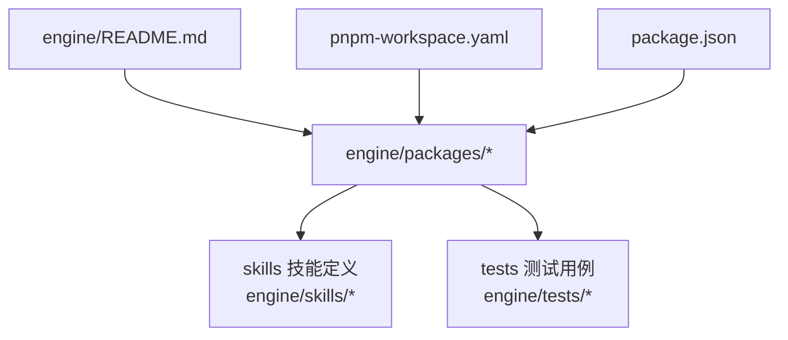
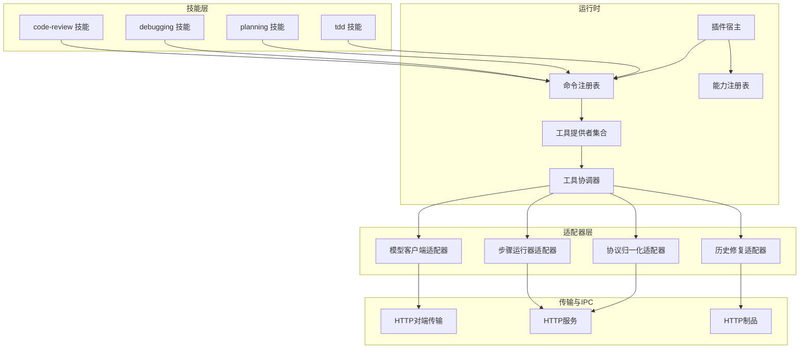
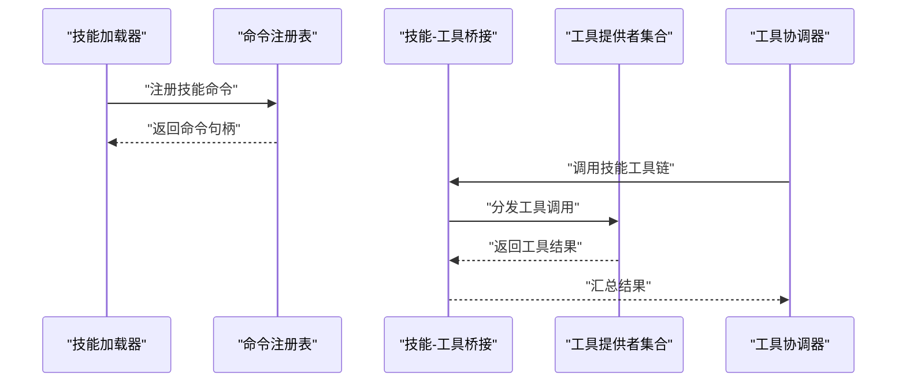
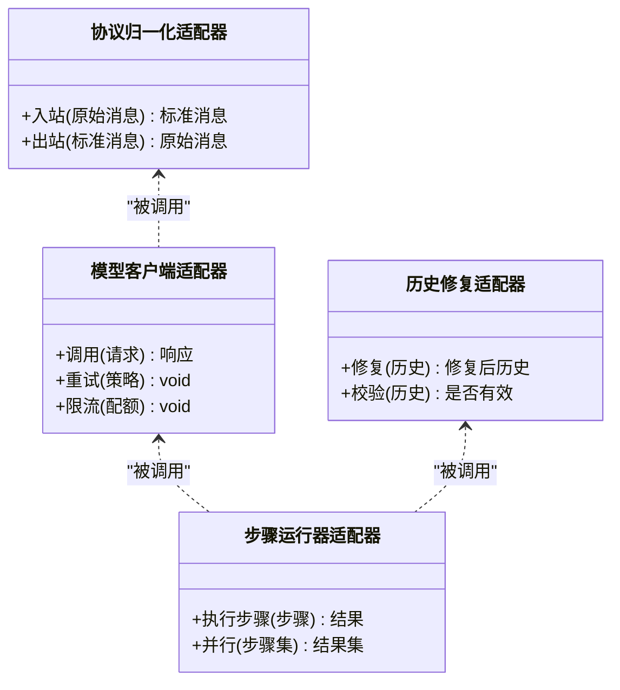
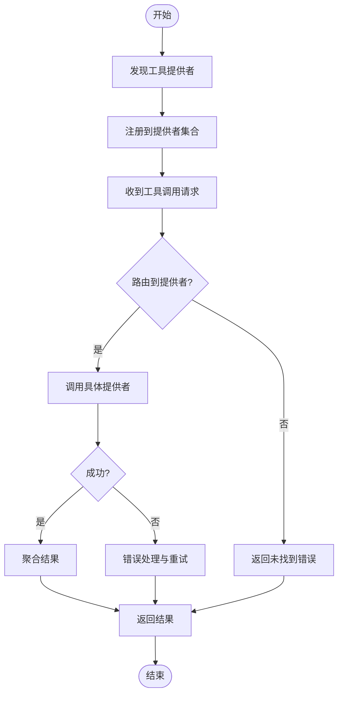
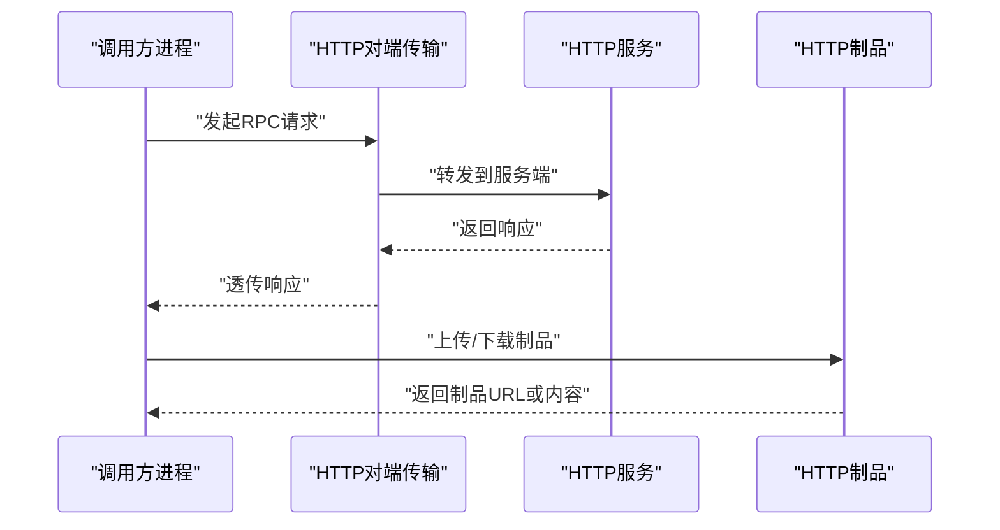
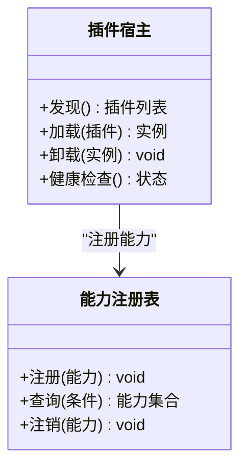
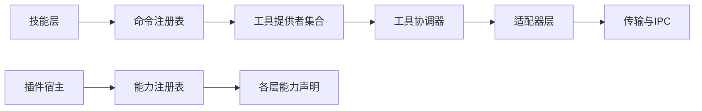

# 扩展点设计

<cite>
**本文引用的文件**   
- [engine/README.md](file://engine/README.md)
- [engine/package.json](file://engine/package.json)
- [engine/pnpm-workspace.yaml](file://engine/pnpm-workspace.yaml)
- [engine/skills/code-review/skill.json](file://engine/skills/code-review/skill.json)
- [engine/skills/debugging/skill.json](file://engine/skills/debugging/skill.json)
- [engine/skills/planning/skill.json](file://engine/skills/planning/skill.json)
- [engine/skills/tdd/skill.json](file://engine/skills/tdd/skill.json)
- [engine/tests/builtin-skills.test.ts](file://engine/tests/builtin-skills.test.ts)
- [engine/tests/skill-command-registry.test.ts](file://engine/tests/skill-command-registry.test.ts)
- [engine/tests/skill-tool-provider.test.ts](file://engine/tests/skill-tool-provider.test.ts)
- [engine/tests/skill-mcp-bridge.test.ts](file://engine/tests/skill-mcp-bridge.test.ts)
- [engine/tests/mcp-tool-provider.test.ts](file://engine/tests/mcp-tool-provider.test.ts)
- [engine/tests/web-tool-provider.test.ts](file://engine/tests/web-tool-provider.test.ts)
- [engine/tests/tool-runtime-v3.test.ts](file://engine/tests/tool-runtime-v3.test.ts)
- [engine/tests/tool-coordinator-runtime.test.ts](file://engine/tests/tool-coordinator-runtime.test.ts)
- [engine/tests/runtime-kernel-provider-matrix.test.ts](file://engine/tests/runtime-kernel-provider-matrix.test.ts)
- [engine/tests/provider-compatibility.test.ts](file://engine/tests/provider-compatibility.test.ts)
- [engine/tests/model-client.test.ts](file://engine/tests/model-client.test.ts)
- [engine/tests/model-step-runner.test.ts](file://engine/tests/model-step-runner.test.ts)
- [engine/tests/model-history-repair.test.ts](file://engine/tests/model-history-repair.test.ts)
- [engine/tests/model-proposal.test.ts](file://engine/tests/model-protocol-normalizer.test.ts)
- [engine/tests/http-peer-transport.test.ts](file://engine/tests/http-peer-transport.test.ts)
- [engine/tests/http-server.test.ts](file://engine/tests/http-server.test.ts)
- [engine/tests/http-artifacts.test.ts](file://engine/tests/http-artifacts.test.ts)
- [engine/tests/plugin-host.test.ts](file://engine/tests/plugin-host.test.ts)
- [engine/tests/capability-registry.test.ts](file://engine/tests/capability-registry.test.ts)
- [engine/tests/capabilities.test.ts](file://engine/tests/capabilities.test.ts)
- [engine/tests/contracts.test.ts](file://engine/tests/contracts.test.ts)
</cite>

## 目录
1. [引言](#引言)
2. [项目结构](#项目结构)
3. [核心组件](#核心组件)
4. [架构总览](#架构总览)
5. [详细组件分析](#详细组件分析)
6. [依赖关系分析](#依赖关系分析)
7. [性能考量](#性能考量)
8. [故障排查指南](#故障排查指南)
9. [结论](#结论)
10. [附录](#附录)

## 引言
本设计文档面向KCoder系统的扩展机制，围绕以下扩展点进行系统化说明：
- 技能插件系统：以“技能”为粒度封装可复用的工作流与工具组合。
- 适配器扩展点：对模型提供商、传输层等外部能力进行适配接入。
- 工具提供者接口：统一暴露工具调用契约，支持内置与第三方工具。
- IPC通信扩展：跨进程通信的协议与扩展方式。

文档将覆盖扩展点的注册机制、生命周期管理、版本兼容性策略，并提供完整的扩展开发指南（接口定义、配置格式、最佳实践），以及示例（自定义LLM提供商、新技能开发、第三方工具集成）。同时给出安全考虑、性能影响分析与调试方法，并解释如何保持向后兼容与渐进式升级。

## 项目结构
KCoder引擎采用多包工作区组织，核心扩展相关代码位于 engine/packages 下，技能定义位于 engine/skills，测试用例位于 engine/tests。顶层 README 提供整体概览与使用说明。

图表来源
- [engine/README.md](file://engine/README.md)
- [engine/pnpm-workspace.yaml](file://engine/pnpm-workspace.yaml)
- [engine/package.json](file://engine/package.json)

章节来源
- [engine/README.md](file://engine/README.md)
- [engine/package.json](file://engine/package.json)
- [engine/pnpm-workspace.yaml](file://engine/pnpm-workspace.yaml)

## 核心组件
本节聚焦扩展相关的核心概念与组件职责，结合测试用例与技能清单进行定位与说明。

- 技能插件系统
  - 每个技能包含描述与元数据（如 skill.json）及可选说明文档（SKILL.md）。
  - 通过命令注册表与工具提供者桥接，将技能能力暴露给运行时。
  - 关键验证与行为由测试覆盖，确保加载、解析、执行路径稳定。

- 适配器扩展点
  - 针对模型提供商与网络传输层提供抽象与适配，便于接入不同实现。
  - 通过运行时内核矩阵与兼容性测试保障多供应商组合可用。

- 工具提供者接口
  - 统一工具调用契约，支持多种来源（内置、MCP、Web等）。
  - 工具协调器负责调度、结果聚合与错误处理。

- IPC通信扩展
  - 基于HTTP对端传输与服务端能力，提供跨进程通信通道。
  - 通过事件总线与中间件机制扩展请求/响应链路。

章节来源
- [engine/skills/code-review/skill.json](file://engine/skills/code-review/skill.json)
- [engine/skills/debugging/skill.json](file://engine/skills/debugging/skill.json)
- [engine/skills/planning/skill.json](file://engine/skills/planning/skill.json)
- [engine/skills/tdd/skill.json](file://engine/skills/tdd/skill.json)
- [engine/tests/builtin-skills.test.ts](file://engine/tests/builtin-skills.test.ts)
- [engine/tests/skill-command-registry.test.ts](file://engine/tests/skill-command-registry.test.ts)
- [engine/tests/skill-tool-provider.test.ts](file://engine/tests/skill-tool-provider.test.ts)
- [engine/tests/skill-mcp-bridge.test.ts](file://engine/tests/skill-mcp-bridge.test.ts)
- [engine/tests/mcp-tool-provider.test.ts](file://engine/tests/mcp-tool-provider.test.ts)
- [engine/tests/web-tool-provider.test.ts](file://engine/tests/web-tool-provider.test.ts)
- [engine/tests/tool-runtime-v3.test.ts](file://engine/tests/tool-runtime-v3.test.ts)
- [engine/tests/tool-coordinator-runtime.test.ts](file://engine/tests/tool-coordinator-runtime.test.ts)
- [engine/tests/runtime-kernel-provider-matrix.test.ts](file://engine/tests/runtime-kernel-provider-matrix.test.ts)
- [engine/tests/provider-compatibility.test.ts](file://engine/tests/provider-compatibility.test.ts)
- [engine/tests/model-client.test.ts](file://engine/tests/model-client.test.ts)
- [engine/tests/model-step-runner.test.ts](file://engine/tests/model-step-runner.test.ts)
- [engine/tests/model-history-repair.test.ts](file://engine/tests/model-history-repair.test.ts)
- [engine/tests/model-protocol-normalizer.test.ts](file://engine/tests/model-protocol-normalizer.test.ts)
- [engine/tests/http-peer-transport.test.ts](file://engine/tests/http-peer-transport.test.ts)
- [engine/tests/http-server.test.ts](file://engine/tests/http-server.test.ts)
- [engine/tests/http-artifacts.test.ts](file://engine/tests/http-artifacts.test.ts)
- [engine/tests/plugin-host.test.ts](file://engine/tests/plugin-host.test.ts)
- [engine/tests/capability-registry.test.ts](file://engine/tests/capability-registry.test.ts)
- [engine/tests/capabilities.test.ts](file://engine/tests/capabilities.test.ts)
- [engine/tests/contracts.test.ts](file://engine/tests/contracts.test.ts)

## 架构总览
下图展示扩展点在系统中的位置与交互关系：技能通过命令注册表与工具提供者桥接；工具协调器统一调度工具；适配器对接模型与传输层；IPC通过HTTP对端与服务端完成跨进程通信。

图表来源
- [engine/tests/builtin-skills.test.ts](file://engine/tests/builtin-skills.test.ts)
- [engine/tests/skill-command-registry.test.ts](file://engine/tests/skill-command-registry.test.ts)
- [engine/tests/skill-tool-provider.test.ts](file://engine/tests/skill-tool-provider.test.ts)
- [engine/tests/tool-runtime-v3.test.ts](file://engine/tests/tool-runtime-v3.test.ts)
- [engine/tests/tool-coordinator-runtime.test.ts](file://engine/tests/tool-coordinator-runtime.test.ts)
- [engine/tests/model-client.test.ts](file://engine/tests/model-client.test.ts)
- [engine/tests/model-step-runner.test.ts](file://engine/tests/model-step-runner.test.ts)
- [engine/tests/model-history-repair.test.ts](file://engine/tests/model-history-repair.test.ts)
- [engine/tests/model-protocol-normalizer.test.ts](file://engine/tests/model-protocol-normalizer.test.ts)
- [engine/tests/http-peer-transport.test.ts](file://engine/tests/http-peer-transport.test.ts)
- [engine/tests/http-server.test.ts](file://engine/tests/http-server.test.ts)
- [engine/tests/http-artifacts.test.ts](file://engine/tests/http-artifacts.test.ts)
- [engine/tests/plugin-host.test.ts](file://engine/tests/plugin-host.test.ts)
- [engine/tests/capability-registry.test.ts](file://engine/tests/capability-registry.test.ts)

## 详细组件分析

### 技能插件系统
- 目标：以“技能”为单位封装可复用流程，通过声明式配置与命令注册表暴露给运行时。
- 关键要素
  - 技能清单：每个技能目录包含 skill.json 与可选 SKILL.md，用于描述能力、参数与约束。
  - 命令注册表：将技能映射到可执行的命令或动作，供上层编排调用。
  - 工具提供者桥接：技能内部可组合多个工具，通过桥接层统一调用。
- 生命周期
  - 发现与加载：启动时扫描技能目录，解析清单并注册命令。
  - 初始化与预热：按需加载依赖，建立上下文缓存。
  - 执行与回收：按任务上下文执行，完成后释放资源。
- 版本与兼容
  - 通过清单字段与测试矩阵校验能力边界，避免破坏性变更。
- 开发要点
  - 新增技能：在 skills 目录下创建子目录，编写 skill.json 与 SKILL.md，并在测试中覆盖基本路径。
  - 命令注册：遵循命令注册表的约定键名与回调签名。
  - 工具组合：使用工具提供者桥接，避免直接耦合具体工具实现。

图表来源
- [engine/tests/builtin-skills.test.ts](file://engine/tests/builtin-skills.test.ts)
- [engine/tests/skill-command-registry.test.ts](file://engine/tests/skill-command-registry.test.ts)
- [engine/tests/skill-tool-provider.test.ts](file://engine/tests/skill-tool-provider.test.ts)
- [engine/tests/tool-coordinator-runtime.test.ts](file://engine/tests/tool-coordinator-runtime.test.ts)

章节来源
- [engine/skills/code-review/skill.json](file://engine/skills/code-review/skill.json)
- [engine/skills/debugging/skill.json](file://engine/skills/debugging/skill.json)
- [engine/skills/planning/skill.json](file://engine/skills/planning/skill.json)
- [engine/skills/tdd/skill.json](file://engine/skills/tdd/skill.json)
- [engine/tests/builtin-skills.test.ts](file://engine/tests/builtin-skills.test.ts)
- [engine/tests/skill-command-registry.test.ts](file://engine/tests/skill-command-registry.test.ts)
- [engine/tests/skill-tool-provider.test.ts](file://engine/tests/skill-tool-provider.test.ts)

### 适配器扩展点（模型与传输）
- 目标：屏蔽底层差异，统一对外暴露模型调用、步骤执行、历史修复与协议归一化能力。
- 关键要素
  - 模型客户端适配器：封装不同LLM提供商的调用细节。
  - 步骤运行器适配器：将高层步骤转换为具体执行序列。
  - 历史修复适配器：保证对话历史的完整性与一致性。
  - 协议归一化适配器：对齐不同提供商的消息格式。
- 生命周期
  - 注册：在运行时初始化阶段注册适配器实例。
  - 选择：根据配置与能力矩阵选择合适实现。
  - 降级：当某实现不可用时回退至兼容模式。
- 版本与兼容
  - 通过兼容性测试矩阵验证多供应商组合，确保非破坏性演进。

图表来源
- [engine/tests/model-client.test.ts](file://engine/tests/model-client.test.ts)
- [engine/tests/model-step-runner.test.ts](file://engine/tests/model-step-runner.test.ts)
- [engine/tests/model-history-repair.test.ts](file://engine/tests/model-history-repair.test.ts)
- [engine/tests/model-protocol-normalizer.test.ts](file://engine/tests/model-protocol-normalizer.test.ts)
- [engine/tests/runtime-kernel-provider-matrix.test.ts](file://engine/tests/runtime-kernel-provider-matrix.test.ts)
- [engine/tests/provider-compatibility.test.ts](file://engine/tests/provider-compatibility.test.ts)

章节来源
- [engine/tests/model-client.test.ts](file://engine/tests/model-client.test.ts)
- [engine/tests/model-step-runner.test.ts](file://engine/tests/model-step-runner.test.ts)
- [engine/tests/model-history-repair.test.ts](file://engine/tests/model-history-repair.test.ts)
- [engine/tests/model-protocol-normalizer.test.ts](file://engine/tests/model-protocol-normalizer.test.ts)
- [engine/tests/runtime-kernel-provider-matrix.test.ts](file://engine/tests/runtime-kernel-provider-matrix.test.ts)
- [engine/tests/provider-compatibility.test.ts](file://engine/tests/provider-compatibility.test.ts)

### 工具提供者接口
- 目标：统一工具调用契约，支持内置、MCP、Web等多种来源的工具。
- 关键要素
  - 工具提供者集合：集中管理与路由工具调用。
  - MCP工具提供者：通过MCP协议发现与调用远程工具。
  - Web工具提供者：通过HTTP访问外部工具服务。
  - 工具协调器：负责并发控制、超时、重试与结果聚合。
- 生命周期
  - 发现：启动时扫描并注册可用工具。
  - 调用：按名称与参数路由到对应提供者。
  - 清理：会话结束时释放连接与缓存。
- 版本与兼容
  - 通过工具运行时v3与协调器测试保障接口稳定性。

图表来源
- [engine/tests/skill-tool-provider.test.ts](file://engine/tests/skill-tool-provider.test.ts)
- [engine/tests/mcp-tool-provider.test.ts](file://engine/tests/mcp-tool-provider.test.ts)
- [engine/tests/web-tool-provider.test.ts](file://engine/tests/web-tool-provider.test.ts)
- [engine/tests/tool-runtime-v3.test.ts](file://engine/tests/tool-runtime-v3.test.ts)
- [engine/tests/tool-coordinator-runtime.test.ts](file://engine/tests/tool-coordinator-runtime.test.ts)

章节来源
- [engine/tests/skill-tool-provider.test.ts](file://engine/tests/skill-tool-provider.test.ts)
- [engine/tests/mcp-tool-provider.test.ts](file://engine/tests/mcp-tool-provider.test.ts)
- [engine/tests/web-tool-provider.test.ts](file://engine/tests/web-tool-provider.test.ts)
- [engine/tests/tool-runtime-v3.test.ts](file://engine/tests/tool-runtime-v3.test.ts)
- [engine/tests/tool-coordinator-runtime.test.ts](file://engine/tests/tool-coordinator-runtime.test.ts)

### IPC通信扩展
- 目标：提供跨进程通信通道，支持服务间调用与制品共享。
- 关键要素
  - HTTP对端传输：作为远端调用通道。
  - HTTP服务：暴露本地能力供其他进程访问。
  - HTTP制品：上传/下载二进制或结构化产物。
- 生命周期
  - 启动：初始化服务端监听与对端连接。
  - 调用：通过协议发送请求并等待响应。
  - 关闭：优雅退出并释放端口与连接池。
- 版本与兼容
  - 通过HTTP服务与制品测试确保协议稳定与向后兼容。

图表来源
- [engine/tests/http-peer-transport.test.ts](file://engine/tests/http-peer-transport.test.ts)
- [engine/tests/http-server.test.ts](file://engine/tests/http-server.test.ts)
- [engine/tests/http-artifacts.test.ts](file://engine/tests/http-artifacts.test.ts)

章节来源
- [engine/tests/http-peer-transport.test.ts](file://engine/tests/http-peer-transport.test.ts)
- [engine/tests/http-server.test.ts](file://engine/tests/http-server.test.ts)
- [engine/tests/http-artifacts.test.ts](file://engine/tests/http-artifacts.test.ts)

### 插件宿主与能力注册
- 目标：提供统一的插件加载与能力管理能力，支撑扩展生态。
- 关键要素
  - 插件宿主：负责插件的发现、加载、隔离与生命周期管理。
  - 能力注册表：声明与查询系统能力，供运行时决策。
- 生命周期
  - 发现：扫描插件目录与清单。
  - 激活：初始化插件上下文并注册能力。
  - 卸载：清理资源并注销能力。
- 版本与兼容
  - 通过契约测试与能力矩阵确保插件与内核的兼容。

图表来源
- [engine/tests/plugin-host.test.ts](file://engine/tests/plugin-host.test.ts)
- [engine/tests/capability-registry.test.ts](file://engine/tests/capability-registry.test.ts)
- [engine/tests/capabilities.test.ts](file://engine/tests/capabilities.test.ts)
- [engine/tests/contracts.test.ts](file://engine/tests/contracts.test.ts)

章节来源
- [engine/tests/plugin-host.test.ts](file://engine/tests/plugin-host.test.ts)
- [engine/tests/capability-registry.test.ts](file://engine/tests/capability-registry.test.ts)
- [engine/tests/capabilities.test.ts](file://engine/tests/capabilities.test.ts)
- [engine/tests/contracts.test.ts](file://engine/tests/contracts.test.ts)

## 依赖关系分析
扩展点之间的依赖呈现分层与解耦特征：技能层依赖命令注册表与工具提供者；工具协调器依赖适配器层；适配器层依赖传输与IPC层；插件宿主与能力注册表贯穿各层提供治理。

图表来源
- [engine/tests/builtin-skills.test.ts](file://engine/tests/builtin-skills.test.ts)
- [engine/tests/skill-command-registry.test.ts](file://engine/tests/skill-command-registry.test.ts)
- [engine/tests/skill-tool-provider.test.ts](file://engine/tests/skill-tool-provider.test.ts)
- [engine/tests/tool-coordinator-runtime.test.ts](file://engine/tests/tool-coordinator-runtime.test.ts)
- [engine/tests/model-client.test.ts](file://engine/tests/model-client.test.ts)
- [engine/tests/http-peer-transport.test.ts](file://engine/tests/http-peer-transport.test.ts)
- [engine/tests/plugin-host.test.ts](file://engine/tests/plugin-host.test.ts)
- [engine/tests/capability-registry.test.ts](file://engine/tests/capability-registry.test.ts)

章节来源
- [engine/tests/builtin-skills.test.ts](file://engine/tests/builtin-skills.test.ts)
- [engine/tests/skill-command-registry.test.ts](file://engine/tests/skill-command-registry.test.ts)
- [engine/tests/skill-tool-provider.test.ts](file://engine/tests/skill-tool-provider.test.ts)
- [engine/tests/tool-coordinator-runtime.test.ts](file://engine/tests/tool-coordinator-runtime.test.ts)
- [engine/tests/model-client.test.ts](file://engine/tests/model-client.test.ts)
- [engine/tests/http-peer-transport.test.ts](file://engine/tests/http-peer-transport.test.ts)
- [engine/tests/plugin-host.test.ts](file://engine/tests/plugin-host.test.ts)
- [engine/tests/capability-registry.test.ts](file://engine/tests/capability-registry.test.ts)

## 性能考量
- 工具调用
  - 并发控制：通过工具协调器限制并发度，避免下游过载。
  - 超时与重试：设置合理超时与指数退避，提升鲁棒性。
  - 结果缓存：对幂等工具启用短期缓存，降低重复开销。
- 适配器层
  - 连接复用：HTTP与长连接复用减少握手成本。
  - 批量处理：合并小请求以降低网络往返。
- IPC通信
  - 序列化优化：选择高效编解码格式，减少CPU占用。
  - 背压与限流：防止突发流量导致内存抖动。
- 技能执行
  - 懒加载：按需初始化技能依赖，缩短启动时间。
  - 上下文复用：共享只读上下文，避免重复构建。

[本节为通用指导，不直接分析具体文件]

## 故障排查指南
- 技能加载失败
  - 检查技能清单字段与必填项，参考内置技能清单样例。
  - 查看命令注册表日志，确认命令是否成功注册。
- 工具调用异常
  - 核对工具提供者可用性（MCP/Web），检查网络连通性与鉴权。
  - 使用工具协调器日志定位超时、重试与错误码。
- 适配器问题
  - 通过模型客户端与步骤运行器测试用例对比行为差异。
  - 检查协议归一化前后消息结构是否符合契约。
- IPC通信问题
  - 验证HTTP服务端口与对端地址配置。
  - 检查制品上传/下载的权限与大小限制。
- 插件与能力
  - 确认插件宿主健康检查状态与能力注册表条目。
  - 对照契约测试用例，确保接口版本一致。

章节来源
- [engine/tests/builtin-skills.test.ts](file://engine/tests/builtin-skills.test.ts)
- [engine/tests/skill-command-registry.test.ts](file://engine/tests/skill-command-registry.test.ts)
- [engine/tests/mcp-tool-provider.test.ts](file://engine/tests/mcp-tool-provider.test.ts)
- [engine/tests/web-tool-provider.test.ts](file://engine/tests/web-tool-provider.test.ts)
- [engine/tests/tool-runtime-v3.test.ts](file://engine/tests/tool-runtime-v3.test.ts)
- [engine/tests/model-client.test.ts](file://engine/tests/model-client.test.ts)
- [engine/tests/model-step-runner.test.ts](file://engine/tests/model-step-runner.test.ts)
- [engine/tests/model-protocol-normalizer.test.ts](file://engine/tests/model-protocol-normalizer.test.ts)
- [engine/tests/http-server.test.ts](file://engine/tests/http-server.test.ts)
- [engine/tests/http-artifacts.test.ts](file://engine/tests/http-artifacts.test.ts)
- [engine/tests/plugin-host.test.ts](file://engine/tests/plugin-host.test.ts)
- [engine/tests/capability-registry.test.ts](file://engine/tests/capability-registry.test.ts)
- [engine/tests/contracts.test.ts](file://engine/tests/contracts.test.ts)

## 结论
KCoder的扩展点体系以“技能—工具—适配器—IPC”的分层架构为核心，配合插件宿主与能力注册表形成完整的扩展生态。通过清晰的注册机制、生命周期管理与严格的兼容性测试，系统能够在保持向后兼容的前提下持续演进。开发者可基于本文档提供的接口定义、配置格式与最佳实践，快速实现自定义LLM提供商、新技能与第三方工具集成，并通过调试方法与性能优化建议保障生产质量。

[本节为总结性内容，不直接分析具体文件]

## 附录

### 扩展开发指南（实操步骤）
- 自定义LLM提供商
  - 实现模型客户端适配器：封装调用、重试与限流逻辑。
  - 实现协议归一化适配器：对齐输入输出格式。
  - 在运行时矩阵中添加供应商组合，并通过兼容性测试验证。
  - 参考路径：
    - [engine/tests/model-client.test.ts](file://engine/tests/model-client.test.ts)
    - [engine/tests/model-protocol-normalizer.test.ts](file://engine/tests/model-protocol-normalizer.test.ts)
    - [engine/tests/runtime-kernel-provider-matrix.test.ts](file://engine/tests/runtime-kernel-provider-matrix.test.ts)
    - [engine/tests/provider-compatibility.test.ts](file://engine/tests/provider-compatibility.test.ts)

- 新技能开发
  - 在 skills 目录创建新技能子目录，编写 skill.json 与 SKILL.md。
  - 在命令注册表中注册技能命令，确保回调签名与参数约定一致。
  - 使用工具提供者桥接组合所需工具，编写端到端测试。
  - 参考路径：
    - [engine/skills/code-review/skill.json](file://engine/skills/code-review/skill.json)
    - [engine/skills/debugging/skill.json](file://engine/skills/debugging/skill.json)
    - [engine/skills/planning/skill.json](file://engine/skills/planning/skill.json)
    - [engine/skills/tdd/skill.json](file://engine/skills/tdd/skill.json)
    - [engine/tests/builtin-skills.test.ts](file://engine/tests/builtin-skills.test.ts)
    - [engine/tests/skill-command-registry.test.ts](file://engine/tests/skill-command-registry.test.ts)
    - [engine/tests/skill-tool-provider.test.ts](file://engine/tests/skill-tool-provider.test.ts)

- 第三方工具集成
  - 实现MCP或Web工具提供者，遵循工具提供者集合的注册与路由约定。
  - 在工具协调器中配置超时、重试与并发策略。
  - 参考路径：
    - [engine/tests/mcp-tool-provider.test.ts](file://engine/tests/mcp-tool-provider.test.ts)
    - [engine/tests/web-tool-provider.test.ts](file://engine/tests/web-tool-provider.test.ts)
    - [engine/tests/tool-runtime-v3.test.ts](file://engine/tests/tool-runtime-v3.test.ts)
    - [engine/tests/tool-coordinator-runtime.test.ts](file://engine/tests/tool-coordinator-runtime.test.ts)

- IPC通信扩展
  - 使用HTTP对端传输与服务端暴露能力，确保鉴权与限流。
  - 通过制品接口共享大对象与中间产物。
  - 参考路径：
    - [engine/tests/http-peer-transport.test.ts](file://engine/tests/http-peer-transport.test.ts)
    - [engine/tests/http-server.test.ts](file://engine/tests/http-server.test.ts)
    - [engine/tests/http-artifacts.test.ts](file://engine/tests/http-artifacts.test.ts)

- 安全考虑
  - 鉴权与授权：对所有外部调用进行身份校验与权限控制。
  - 输入校验：严格校验工具参数与消息体，防止注入攻击。
  - 资源限制：限制并发、超时与文件大小，避免资源耗尽。
  - 审计与追踪：记录关键操作与错误堆栈，便于事后追溯。

- 版本兼容与渐进式升级
  - 清单与契约：通过 skill.json 与契约测试声明能力边界。
  - 矩阵与回归：维护供应商与工具组合的测试矩阵，确保非破坏性变更。
  - 灰度发布：在新版本中保留旧接口，逐步迁移用户。

章节来源
- [engine/tests/model-client.test.ts](file://engine/tests/model-client.test.ts)
- [engine/tests/model-protocol-normalizer.test.ts](file://engine/tests/model-protocol-normalizer.test.ts)
- [engine/tests/runtime-kernel-provider-matrix.test.ts](file://engine/tests/runtime-kernel-provider-matrix.test.ts)
- [engine/tests/provider-compatibility.test.ts](file://engine/tests/provider-compatibility.test.ts)
- [engine/skills/code-review/skill.json](file://engine/skills/code-review/skill.json)
- [engine/skills/debugging/skill.json](file://engine/skills/debugging/skill.json)
- [engine/skills/planning/skill.json](file://engine/skills/planning/skill.json)
- [engine/skills/tdd/skill.json](file://engine/skills/tdd/skill.json)
- [engine/tests/builtin-skills.test.ts](file://engine/tests/builtin-skills.test.ts)
- [engine/tests/skill-command-registry.test.ts](file://engine/tests/skill-command-registry.test.ts)
- [engine/tests/skill-tool-provider.test.ts](file://engine/tests/skill-tool-provider.test.ts)
- [engine/tests/mcp-tool-provider.test.ts](file://engine/tests/mcp-tool-provider.test.ts)
- [engine/tests/web-tool-provider.test.ts](file://engine/tests/web-tool-provider.test.ts)
- [engine/tests/tool-runtime-v3.test.ts](file://engine/tests/tool-runtime-v3.test.ts)
- [engine/tests/tool-coordinator-runtime.test.ts](file://engine/tests/tool-coordinator-runtime.test.ts)
- [engine/tests/http-peer-transport.test.ts](file://engine/tests/http-peer-transport.test.ts)
- [engine/tests/http-server.test.ts](file://engine/tests/http-server.test.ts)
- [engine/tests/http-artifacts.test.ts](file://engine/tests/http-artifacts.test.ts)