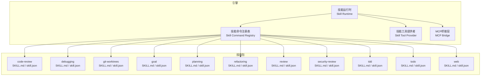
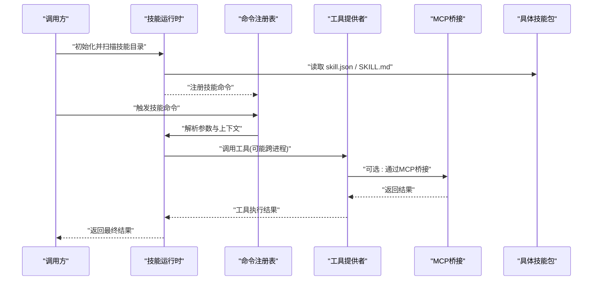
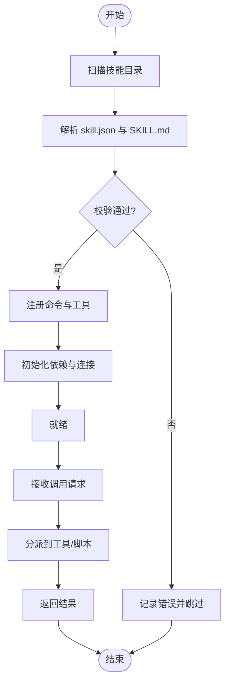
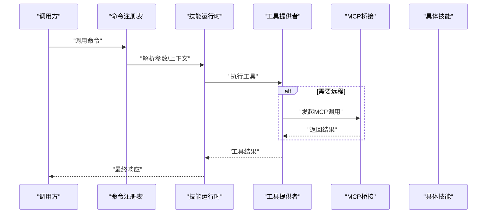
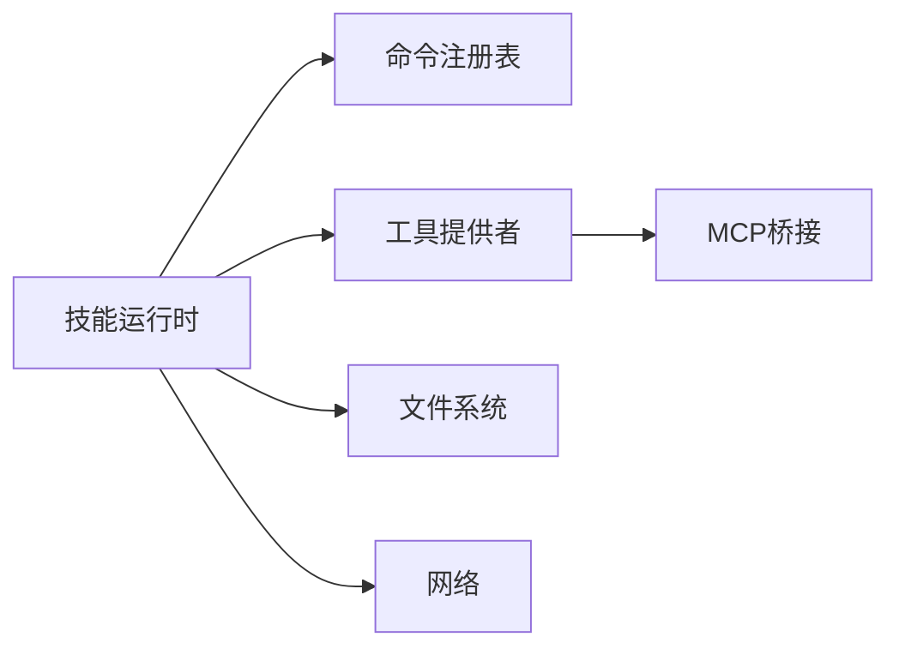

# 技能插件系统

<cite>
**本文引用的文件**   
- [engine/skills/code-review/SKILL.md](file://engine/skills/code-review/SKILL.md)
- [engine/skills/code-review/skill.json](file://engine/skills/code-review/skill.json)
- [engine/skills/debugging/SKILL.md](file://engine/skills/debugging/SKILL.md)
- [engine/skills/debugging/skill.json](file://engine/skills/debugging/skill.json)
- [engine/skills/git-worktrees/SKILL.md](file://engine/skills/git-worktrees/SKILL.md)
- [engine/skills/git-worktrees/skill.json](file://engine/skills/git-worktrees/skill.json)
- [engine/skills/goal/SKILL.md](file://engine/skills/goal/SKILL.md)
- [engine/skills/goal/skill.json](file://engine/skills/goal/skill.json)
- [engine/skills/planning/SKILL.md](file://engine/skills/planning/SKILL.md)
- [engine/skills/planning/skill.json](file://engine/skills/planning/skill.json)
- [engine/skills/refactoring/SKILL.md](file://engine/skills/refactoring/SKILL.md)
- [engine/skills/refactoring/skill.json](file://engine/skills/refactoring/skill.json)
- [engine/skills/review/SKILL.md](file://engine/skills/review/SKILL.md)
- [engine/skills/review/skill.json](file://engine/skills/review/skill.json)
- [engine/skills/security-review/SKILL.md](file://engine/skills/security-review/SKILL.md)
- [engine/skills/security-review/skill.json](file://engine/skills/security-review/skill.json)
- [engine/skills/tdd/SKILL.md](file://engine/skills/tdd/SKILL.md)
- [engine/skills/tdd/skill.json](file://engine/skills/tdd/skill.json)
- [engine/skills/todo/SKILL.md](file://engine/skills/todo/SKILL.md)
- [engine/skills/todo/skill.json](file://engine/skills/todo/skill.json)
- [engine/skills/web/SKILL.md](file://engine/skills/web/SKILL.md)
- [engine/skills/web/skill.json](file://engine/skills/web/skill.json)
- [engine/tests/builtin-skills.test.ts](file://engine/tests/builtin-skills.test.ts)
- [engine/tests/skill-command-registry.test.ts](file://engine/tests/skill-command-registry.test.ts)
- [engine/tests/skill-mcp-bridge.test.ts](file://engine/tests/skill-mcp-bridge.test.ts)
- [engine/tests/skill-runtime.test.ts](file://engine/tests/skill-runtime.test.ts)
- [engine/tests/skill-tool-provider.test.ts](file://engine/tests/skill-tool-provider.test.ts)
- [engine/tests/work-mode-skill-runtime.test.ts](file://engine/tests/work-mode-skill-runtime.test.ts)
</cite>

## 目录
1. [简介](#简介)
2. [项目结构](#项目结构)
3. [核心组件](#核心组件)
4. [架构总览](#架构总览)
5. [详细组件分析](#详细组件分析)
6. [依赖关系分析](#依赖关系分析)
7. [性能考量](#性能考量)
8. [故障排查指南](#故障排查指南)
9. [结论](#结论)
10. [附录](#附录)

## 简介
本文件面向KCoder“技能插件系统”的开发者与使用者，系统性阐述技能的定义格式、注册机制、生命周期、执行流程、工具调用、上下文传递、错误处理、依赖管理与版本控制、发布流程，以及调试、测试与性能优化实践。文档同时说明技能与引擎核心组件的集成方式与数据交互模式，并提供从简单文本处理到复杂代码分析的完整开发示例路径指引。

## 项目结构
KCoder的技能以“包”的形式组织在 engine/skills 目录下，每个技能包含：
- SKILL.md：描述性规范，用于人类阅读与LLM理解（如能力范围、输入输出约定、使用示例等）。
- skill.json：机器可读的技能清单，声明元数据、入口、工具、依赖、版本等信息。

此外，engine/tests 下提供了大量针对技能运行时的测试用例，覆盖内置技能发现、命令注册、MCP桥接、运行时调度、工具提供与隔离等工作模式。

图表来源
- [engine/skills/code-review/skill.json](file://engine/skills/code-review/skill.json)
- [engine/skills/debugging/skill.json](file://engine/skills/debugging/skill.json)
- [engine/skills/git-worktrees/skill.json](file://engine/skills/git-worktrees/skill.json)
- [engine/skills/goal/skill.json](file://engine/skills/goal/skill.json)
- [engine/skills/planning/skill.json](file://engine/skills/planning/skill.json)
- [engine/skills/refactoring/skill.json](file://engine/skills/refactoring/skill.json)
- [engine/skills/review/skill.json](file://engine/skills/review/skill.json)
- [engine/skills/security-review/skill.json](file://engine/skills/security-review/skill.json)
- [engine/skills/tdd/skill.json](file://engine/skills/tdd/skill.json)
- [engine/skills/todo/skill.json](file://engine/skills/todo/skill.json)
- [engine/skills/web/skill.json](file://engine/skills/web/skill.json)

章节来源
- [engine/skills/code-review/SKILL.md](file://engine/skills/code-review/SKILL.md)
- [engine/skills/code-review/skill.json](file://engine/skills/code-review/skill.json)
- [engine/skills/debugging/SKILL.md](file://engine/skills/debugging/SKILL.md)
- [engine/skills/debugging/skill.json](file://engine/skills/debugging/skill.json)
- [engine/skills/git-worktrees/SKILL.md](file://engine/skills/git-worktrees/SKILL.md)
- [engine/skills/git-worktrees/skill.json](file://engine/skills/git-worktrees/skill.json)
- [engine/skills/goal/SKILL.md](file://engine/skills/goal/SKILL.md)
- [engine/skills/goal/skill.json](file://engine/skills/goal/skill.json)
- [engine/skills/planning/SKILL.md](file://engine/skills/planning/SKILL.md)
- [engine/skills/planning/skill.json](file://engine/skills/planning/skill.json)
- [engine/skills/refactoring/SKILL.md](file://engine/skills/refactoring/SKILL.md)
- [engine/skills/refactoring/skill.json](file://engine/skills/refactoring/skill.json)
- [engine/skills/review/SKILL.md](file://engine/skills/review/SKILL.md)
- [engine/skills/review/skill.json](file://engine/skills/review/skill.json)
- [engine/skills/security-review/SKILL.md](file://engine/skills/security-review/SKILL.md)
- [engine/skills/security-review/skill.json](file://engine/skills/security-review/skill.json)
- [engine/skills/tdd/SKILL.md](file://engine/skills/tdd/SKILL.md)
- [engine/skills/tdd/skill.json](file://engine/skills/tdd/Skill.json)
- [engine/skills/todo/SKILL.md](file://engine/skills/todo/SKILL.md)
- [engine/skills/todo/skill.json](file://engine/skills/todo/skill.json)
- [engine/skills/web/SKILL.md](file://engine/skills/web/SKILL.md)
- [engine/skills/web/skill.json](file://engine/skills/web/skill.json)

## 核心组件
- 技能清单（skill.json）：声明技能元数据、入口点、可用工具、依赖项、版本约束、工作模式等，供引擎扫描与加载。
- 技能说明（SKILL.md）：面向人类与模型的可读说明，包括能力边界、输入输出约定、典型用法、注意事项等。
- 技能运行时（Skill Runtime）：负责发现、解析、校验、实例化与调度技能；管理生命周期与上下文。
- 技能命令注册表（Skill Command Registry）：将技能暴露为可被上层调用的命令/动作，维护命令命名空间与路由。
- 技能工具提供者（Skill Tool Provider）：将技能内部或外部工具统一暴露为工具接口，供LLM或编排器调用。
- MCP桥接（MCP Bridge）：将技能工具通过MCP协议对外暴露，便于跨进程/跨语言集成。

章节来源
- [engine/tests/skill-runtime.test.ts](file://engine/tests/skill-runtime.test.ts)
- [engine/tests/skill-command-registry.test.ts](file://engine/tests/skill-command-registry.test.ts)
- [engine/tests/skill-tool-provider.test.ts](file://engine/tests/skill-tool-provider.test.ts)
- [engine/tests/skill-mcp-bridge.test.ts](file://engine/tests/skill-mcp-bridge.test.ts)

## 架构总览
下图展示了技能从发现到执行的端到端流程，以及各组件之间的协作关系。

图表来源
- [engine/tests/skill-runtime.test.ts](file://engine/tests/skill-runtime.test.ts)
- [engine/tests/skill-command-registry.test.ts](file://engine/tests/skill-command-registry.test.ts)
- [engine/tests/skill-tool-provider.test.ts](file://engine/tests/skill-tool-provider.test.ts)
- [engine/tests/skill-mcp-bridge.test.ts](file://engine/tests/skill-mcp-bridge.test.ts)

## 详细组件分析

### 技能定义格式（SKILL.md 与 skill.json）
- SKILL.md
  - 作用：描述技能的能力范围、输入输出约定、使用示例、注意事项、与其他技能的协作方式等。
  - 读者：人类开发者、LLM提示词工程、自动化文档生成。
- skill.json
  - 作用：机器可读清单，包含元数据（名称、版本、描述）、入口点、工具列表、依赖声明、工作模式、权限与安全策略等。
  - 读者：引擎扫描器、运行时、安装器、包管理器。

建议字段（基于现有内置技能清单归纳）：
- 元信息：名称、版本、描述、作者、许可证
- 入口：主脚本/模块路径、命令映射
- 工具：工具名、参数Schema、返回值类型、是否异步、是否需沙箱
- 依赖：外部库、环境变量、系统工具、网络访问
- 工作模式：本地执行、远程执行、MCP服务
- 安全：资源限制、超时、重试、审计日志

章节来源
- [engine/skills/code-review/skill.json](file://engine/skills/code-review/skill.json)
- [engine/skills/debugging/skill.json](file://engine/skills/debugging/skill.json)
- [engine/skills/git-worktrees/skill.json](file://engine/skills/git-worktrees/skill.json)
- [engine/skills/goal/skill.json](file://engine/skills/goal/skill.json)
- [engine/skills/planning/skill.json](file://engine/skills/planning/skill.json)
- [engine/skills/refactoring/skill.json](file://engine/skills/refactoring/skill.json)
- [engine/skills/review/skill.json](file://engine/skills/review/skill.json)
- [engine/skills/security-review/skill.json](file://engine/skills/security-review/skill.json)
- [engine/skills/tdd/skill.json](file://engine/skills/tdd/skill.json)
- [engine/skills/todo/skill.json](file://engine/skills/todo/skill.json)
- [engine/skills/web/skill.json](file://engine/skills/web/skill.json)

### 技能生命周期管理
- 发现阶段：扫描 skills 目录，收集所有包含 skill.json 的目录作为候选技能。
- 解析与校验：读取并校验 skill.json 必填字段与约束；解析 SKILL.md 摘要用于索引。
- 注册阶段：将技能命令注册到命令注册表，建立命令名到实现的路由。
- 启动阶段：按需加载依赖、初始化工具提供者、建立MCP连接（若启用）。
- 运行阶段：接收调用请求，解析上下文，分派到对应工具或脚本。
- 销毁阶段：释放资源、关闭连接、清理临时文件。

章节来源
- [engine/tests/skill-runtime.test.ts](file://engine/tests/skill-runtime.test.ts)
- [engine/tests/builtin-skills.test.ts](file://engine/tests/builtin-skills.test.ts)

### 技能注册机制
- 命令注册表负责：
  - 维护命令命名空间与别名
  - 解析参数与上下文注入
  - 路由到具体工具或脚本
- 注册时机：
  - 启动时批量注册内置技能
  - 热插拔场景动态注册第三方技能

章节来源
- [engine/tests/skill-command-registry.test.ts](file://engine/tests/skill-command-registry.test.ts)

### 执行流程与工具调用
- 调用链：
  - 上层通过命令注册表发起调用
  - 运行时解析参数与上下文
  - 工具提供者执行具体逻辑（本地或远程）
  - 可选通过MCP桥接进行跨进程通信
- 上下文传递：
  - 任务ID、会话ID、用户标识、工作区路径、权限令牌等
- 错误处理：
  - 参数校验失败、工具执行异常、超时、权限不足、网络错误等
  - 统一错误码与结构化错误消息，便于追踪与重试

图表来源
- [engine/tests/skill-tool-provider.test.ts](file://engine/tests/skill-tool-provider.test.ts)
- [engine/tests/skill-mcp-bridge.test.ts](file://engine/tests/skill-mcp-bridge.test.ts)

### 自定义技能开发指南
- 步骤概览
  - 创建技能目录与清单：在 skills 下新建目录，编写 skill.json 与 SKILL.md。
  - 定义工具与入口：在 skill.json 中声明工具名、参数Schema、返回值类型、执行入口。
  - 实现工具逻辑：按约定实现工具函数或脚本，确保幂等性与健壮性。
  - 注册与测试：通过命令注册表注册，编写单元测试与集成测试。
  - 依赖与环境：声明外部依赖与环境变量，必要时配置沙箱与权限。
  - 发布与分发：打包技能包，提供版本与变更日志，纳入仓库或市场。
- 接口规范要点
  - 输入参数需遵循JSON Schema，严格校验类型与必填项。
  - 输出应包含状态、数据与可选的错误详情。
  - 支持异步执行与进度上报（长耗时操作）。
- 上下文传递
  - 自动注入：任务/会话/用户/工作区等上下文。
  - 显式传递：通过参数或环境变量传入敏感信息。
- 错误处理最佳实践
  - 区分业务错误与系统错误，提供可恢复建议。
  - 记录结构化日志，包含关联ID以便追踪。
  - 设置超时与重试上限，避免无限循环。

章节来源
- [engine/skills/todo/skill.json](file://engine/skills/todo/skill.json)
- [engine/skills/todo/SKILL.md](file://engine/skills/todo/SKILL.md)
- [engine/skills/web/skill.json](file://engine/skills/web/skill.json)
- [engine/skills/web/SKILL.md](file://engine/skills/web/SKILL.md)
- [engine/skills/tdd/skill.json](file://engine/skills/tdd/skill.json)
- [engine/skills/tdd/SKILL.md](file://engine/skills/tdd/SKILL.md)

### 完整开发示例（路径指引）
- 简单文本处理技能
  - 参考 todo 技能清单与说明，快速上手参数与返回结构。
  - 示例路径：[engine/skills/todo/skill.json](file://engine/skills/todo/skill.json)、[engine/skills/todo/SKILL.md](file://engine/skills/todo/SKILL.md)
- 复杂代码分析技能
  - 参考 code-review、refactoring、security-review 等技能，了解多工具组合与上下文使用。
  - 示例路径：[engine/skills/code-review/skill.json](file://engine/skills/code-review/skill.json)、[engine/skills/refactoring/skill.json](file://engine/skills/refactoring/skill.json)、[engine/skills/security-review/skill.json](file://engine/skills/security-review/skill.json)

章节来源
- [engine/skills/todo/skill.json](file://engine/skills/todo/skill.json)
- [engine/skills/todo/SKILL.md](file://engine/skills/todo/SKILL.md)
- [engine/skills/code-review/skill.json](file://engine/skills/code-review/skill.json)
- [engine/skills/refactoring/skill.json](file://engine/skills/refactoring/skill.json)
- [engine/skills/security-review/skill.json](file://engine/skills/security-review/skill.json)

### 依赖管理、版本控制与发布
- 依赖管理
  - 在 skill.json 中声明外部库、系统工具、环境变量与网络访问策略。
  - 支持本地依赖与远程MCP服务两种模式。
- 版本控制
  - 使用语义化版本号，配合变更日志与兼容性矩阵。
  - 通过测试套件验证向后兼容。
- 发布流程
  - 构建与打包技能包，上传至仓库或市场。
  - 提供安装脚本与校验哈希，确保安全可信。

章节来源
- [engine/skills/code-review/skill.json](file://engine/skills/code-review/skill.json)
- [engine/skills/debugging/skill.json](file://engine/skills/debugging/skill.json)
- [engine/skills/git-worktrees/skill.json](file://engine/skills/git-worktrees/skill.json)
- [engine/skills/goal/skill.json](file://engine/skills/goal/skill.json)
- [engine/skills/planning/skill.json](file://engine/skills/planning/skill.json)
- [engine/skills/refactoring/skill.json](file://engine/skills/refactoring/sskill.json)
- [engine/skills/review/skill.json](file://engine/skills/review/skill.json)
- [engine/skills/security-review/skill.json](file://engine/skills/security-review/skill.json)
- [engine/skills/tdd/skill.json](file://engine/skills/tdd/skill.json)
- [engine/skills/todo/skill.json](file://engine/skills/todo/skill.json)
- [engine/skills/web/skill.json](file://engine/skills/web/skill.json)

### 调试、测试与性能优化
- 调试
  - 启用详细日志与追踪ID，定位调用链路与错误堆栈。
  - 使用MCP桥接的调试模式，观察跨进程通信细节。
- 测试
  - 单元测试：验证工具输入输出与边界条件。
  - 集成测试：模拟真实环境与依赖，覆盖网络与文件系统。
  - 工作模式测试：验证不同运行模式下的行为一致性。
- 性能优化
  - 缓存热点数据，减少重复计算。
  - 合理设置超时与并发度，避免阻塞。
  - 对长耗时任务采用异步与增量更新。

章节来源
- [engine/tests/skill-runtime.test.ts](file://engine/tests/skill-runtime.test.ts)
- [engine/tests/skill-tool-provider.test.ts](file://engine/tests/skill-tool-provider.test.ts)
- [engine/tests/skill-mcp-bridge.test.ts](file://engine/tests/skill-mcp-bridge.test.ts)
- [engine/tests/work-mode-skill-runtime.test.ts](file://engine/tests/work-mode-skill-runtime.test.ts)

## 依赖关系分析
- 组件耦合
  - 运行时与命令注册表强耦合，负责生命周期与路由。
  - 工具提供者与MCP桥接松耦合，可通过适配器替换实现。
- 外部依赖
  - 文件系统、网络、外部工具与MCP服务。
- 潜在风险
  - 循环依赖应避免，通过接口抽象解耦。
  - 外部服务不可用时的降级与熔断策略。

图表来源
- [engine/tests/skill-runtime.test.ts](file://engine/tests/skill-runtime.test.ts)
- [engine/tests/skill-command-registry.test.ts](file://engine/tests/skill-command-registry.test.ts)
- [engine/tests/skill-tool-provider.test.ts](file://engine/tests/skill-tool-provider.test.ts)
- [engine/tests/skill-mcp-bridge.test.ts](file://engine/tests/skill-mcp-bridge.test.ts)

章节来源
- [engine/tests/skill-runtime.test.ts](file://engine/tests/skill-runtime.test.ts)
- [engine/tests/skill-command-registry.test.ts](file://engine/tests/skill-command-registry.test.ts)
- [engine/tests/skill-tool-provider.test.ts](file://engine/tests/skill-tool-provider.test.ts)
- [engine/tests/skill-mcp-bridge.test.ts](file://engine/tests/skill-mcp-bridge.test.ts)

## 性能考量
- 批处理与合并：对相似工具调用进行批处理，降低开销。
- 懒加载与按需初始化：仅在首次使用时加载重型依赖。
- 资源隔离：为高负载技能分配独立进程或容器，避免相互影响。
- 监控与度量：采集关键指标（延迟、吞吐、错误率），持续优化。

## 故障排查指南
- 常见问题
  - 技能未注册：检查命令注册表与清单字段是否正确。
  - 工具调用失败：确认参数Schema与上下文注入是否匹配。
  - MCP连接异常：检查网络可达性与认证配置。
- 诊断步骤
  - 查看运行时日志与追踪ID。
  - 复现最小用例，逐步缩小问题范围。
  - 切换工作模式，验证是否为环境相关。

章节来源
- [engine/tests/skill-runtime.test.ts](file://engine/tests/skill-runtime.test.ts)
- [engine/tests/skill-tool-provider.test.ts](file://engine/tests/skill-tool-provider.test.ts)
- [engine/tests/skill-mcp-bridge.test.ts](file://engine/tests/skill-mcp-bridge.test.ts)

## 结论
KCoder技能插件系统通过清晰的清单与说明文件、完善的运行时与注册机制、灵活的工具提供者与MCP桥接，实现了高内聚、低耦合的技能生态。开发者可据此快速构建从简单到复杂的各类技能，并通过严格的测试与性能优化保障稳定性与效率。

## 附录
- 术语
  - 技能：封装特定能力的可复用单元，包含清单与说明。
  - 工具：技能内部或外部可调用的原子能力。
  - MCP：跨进程/跨语言的标准化通信协议。
- 参考路径
  - 内置技能清单与说明：见“项目结构”所列文件。
  - 测试用例：见“详细组件分析”所列文件。