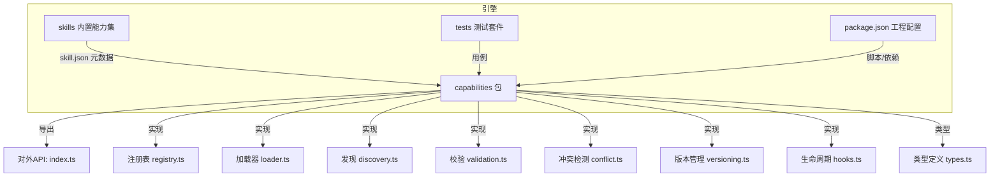
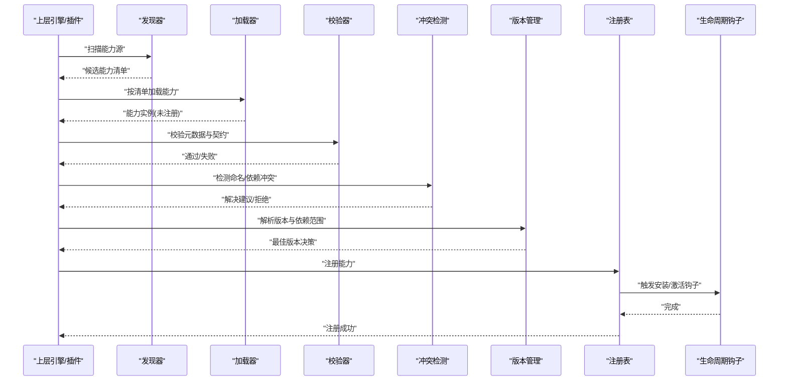
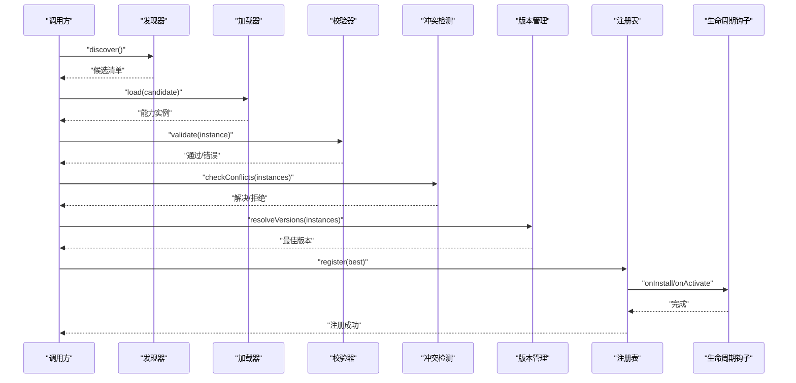
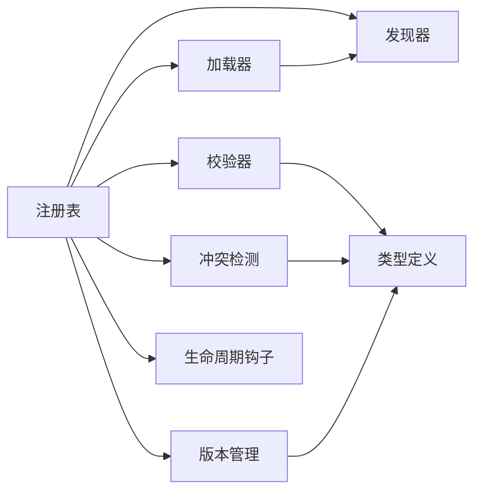

# 能力注册中心

<cite>
**本文引用的文件**   
- [engine/packages/capabilities/README.md](file://engine/packages/capabilities/README.md)
- [engine/packages/capabilities/src/index.ts](file://engine/packages/capabilities/src/index.ts)
- [engine/packages/capabilities/src/types.ts](file://engine/packages/capabilities/src/types.ts)
- [engine/packages/capabilities/src/registry.ts](file://engine/packages/capabilities/src/registry.ts)
- [engine/packages/capabilities/src/loader.ts](file://engine/packages/capabilities/src/loader.ts)
- [engine/packages/capabilities/src/discovery.ts](file://engine/packages/capabilities/src/discovery.ts)
- [engine/packages/capabilities/src/validation.ts](file://engine/packages/capabilities/src/validation.ts)
- [engine/packages/capabilities/src/conflict.ts](file://engine/packages/capabilities/src/conflict.ts)
- [engine/packages/capabilities/src/versioning.ts](file://engine/packages/capabilities/src/versioning.ts)
- [engine/packages/capabilities/src/hooks.ts](file://engine/packages/capabilities/src/hooks.ts)
- [engine/skills/code-review/skill.json](file://engine/skills/code-review/skill.json)
- [engine/skills/debugging/skill.json](file://engine/skills/debugging/skill.json)
- [engine/tests/capability-registry.test.ts](file://engine/tests/capability-registry.test.ts)
- [engine/tests/capabilities.test.ts](file://engine/tests/capabilities.test.ts)
- [engine/tests/builtin-skills.test.ts](file://engine/tests/builtin-skills.test.ts)
- [engine/package.json](file://engine/package.json)
</cite>

## 目录
1. [简介](#简介)
2. [项目结构](#项目结构)
3. [核心组件](#核心组件)
4. [架构总览](#架构总览)
5. [详细组件分析](#详细组件分析)
6. [依赖分析](#依赖分析)
7. [性能考虑](#性能考虑)
8. [故障排查指南](#故障排查指南)
9. [结论](#结论)
10. [附录](#附录)

## 简介
本文件面向KCoder“能力注册中心”的开发者与集成者，系统性阐述能力发现机制、动态加载系统、能力定义格式、元数据管理、依赖解析、注册流程（声明、验证、冲突检测、版本管理）、扩展开发指南（新能力类型、接口规范、生命周期钩子）、启用/禁用与条件加载、运行时切换、测试策略、性能影响评估与故障恢复机制，以及与插件系统的集成方式和扩展点设计原则。文档以代码级事实为依据，辅以可视化图示，帮助读者从概念到实现全面掌握该子系统。

## 项目结构
能力注册中心位于 engine 子仓库中，围绕 packages/capabilities 构建，配套 skills 目录提供内置能力示例，tests 目录覆盖关键路径用例。

图表来源
- [engine/packages/capabilities/src/index.ts](file://engine/packages/capabilities/src/index.ts)
- [engine/packages/capabilities/src/registry.ts](file://engine/packages/capabilities/src/registry.ts)
- [engine/packages/capabilities/src/loader.ts](file://engine/packages/capabilities/src/loader.ts)
- [engine/packages/capabilities/src/discovery.ts](file://engine/packages/capabilities/src/discovery.ts)
- [engine/packages/capabilities/src/validation.ts](file://engine/packages/capabilities/src/validation.ts)
- [engine/packages/capabilities/src/conflict.ts](file://engine/packages/capabilities/src/conflict.ts)
- [engine/packages/capabilities/src/versioning.ts](file://engine/packages/capabilities/src/versioning.ts)
- [engine/packages/capabilities/src/hooks.ts](file://engine/packages/capabilities/src/hooks.ts)
- [engine/packages/capabilities/src/types.ts](file://engine/packages/capabilities/src/types.ts)
- [engine/skills/code-review/skill.json](file://engine/skills/code-review/skill.json)
- [engine/skills/debugging/skill.json](file://engine/skills/debugging/skill.json)
- [engine/tests/capability-registry.test.ts](file://engine/tests/capability-registry.test.ts)
- [engine/tests/capabilities.test.ts](file://engine/tests/capabilities.test.ts)
- [engine/tests/builtin-skills.test.ts](file://engine/tests/builtin-skills.test.ts)
- [engine/package.json](file://engine/package.json)

章节来源
- [engine/packages/capabilities/README.md](file://engine/packages/capabilities/README.md)
- [engine/packages/capabilities/src/index.ts](file://engine/packages/capabilities/src/index.ts)
- [engine/package.json](file://engine/package.json)

## 核心组件
- 能力类型与契约：在类型定义文件中集中描述能力模型、元数据字段、依赖关系、版本约束与生命周期钩子签名，确保各模块对能力语义一致理解。
- 注册表：维护全局能力集合，提供注册、查询、过滤、排序、版本选择等原子操作，是能力发现与调度的中枢。
- 加载器：负责将外部能力包或内建能力装载为统一的能力实例，处理资源解析、依赖注入与初始化。
- 发现器：扫描能力源（文件系统、包清单、插件目录），产出候选能力清单并去重合并。
- 校验器：基于能力契约对元数据进行静态校验，拦截非法或缺失字段，保障注册安全。
- 冲突检测：针对同名能力、重复依赖、版本不兼容进行诊断与提示，支持自动降级或拒绝注册。
- 版本管理：解析能力版本与依赖版本范围，执行语义化版本比较与兼容性判定，决定最佳可用版本。
- 生命周期钩子：提供能力安装、激活、停用、卸载等阶段的扩展点，便于接入日志、监控、权限控制等横切逻辑。
- 对外API：聚合上述能力，暴露稳定入口供上层引擎与插件系统调用。

章节来源
- [engine/packages/capabilities/src/types.ts](file://engine/packages/capabilities/src/types.ts)
- [engine/packages/capabilities/src/registry.ts](file://engine/packages/capabilities/src/registry.ts)
- [engine/packages/capabilities/src/loader.ts](file://engine/packages/capabilities/src/loader.ts)
- [engine/packages/capabilities/src/discovery.ts](file://engine/packages/capabilities/src/discovery.ts)
- [engine/packages/capabilities/src/validation.ts](file://engine/packages/capabilities/src/validation.ts)
- [engine/packages/capabilities/src/conflict.ts](file://engine/packages/capabilities/src/conflict.ts)
- [engine/packages/capabilities/src/versioning.ts](file://engine/packages/capabilities/src/versioning.ts)
- [engine/packages/capabilities/src/hooks.ts](file://engine/packages/capabilities/src/hooks.ts)
- [engine/packages/capabilities/src/index.ts](file://engine/packages/capabilities/src/index.ts)

## 架构总览
能力注册中心采用分层与职责分离的设计：发现层定位候选能力，加载层将其转换为可运行实例，注册层维护全局状态并提供查询；校验与冲突检测作为前置门禁，版本管理贯穿选择与升级过程；生命周期钩子贯穿能力全周期。

图表来源
- [engine/packages/capabilities/src/discovery.ts](file://engine/packages/capabilities/src/discovery.ts)
- [engine/packages/capabilities/src/loader.ts](file://engine/packages/capabilities/src/loader.ts)
- [engine/packages/capabilities/src/validation.ts](file://engine/packages/capabilities/src/validation.ts)
- [engine/packages/capabilities/src/conflict.ts](file://engine/packages/capabilities/src/conflict.ts)
- [engine/packages/capabilities/src/versioning.ts](file://engine/packages/capabilities/src/versioning.ts)
- [engine/packages/capabilities/src/registry.ts](file://engine/packages/capabilities/src/registry.ts)
- [engine/packages/capabilities/src/hooks.ts](file://engine/packages/capabilities/src/hooks.ts)

## 详细组件分析

### 能力类型与契约
- 能力实体：包含标识、名称、版本、描述、分类、作者、许可证、图标、入口、参数模式、返回模式、副作用说明、权限要求、依赖列表、条件表达式等。
- 元数据规范：定义必填字段、枚举值域、正则校验、嵌套对象结构，以及可选扩展字段约定。
- 依赖模型：声明对其他能力的ID与版本范围依赖，支持可选依赖与条件依赖。
- 生命周期钩子：定义安装、激活、停用、卸载等阶段回调签名，允许异步与错误传播。
- 版本约束：遵循语义化版本，支持范围匹配、主/次/补丁级别兼容策略。

章节来源
- [engine/packages/capabilities/src/types.ts](file://engine/packages/capabilities/src/types.ts)

### 注册表（Registry）
- 能力存储：以能力ID为主键，维护能力实例、元数据、版本、状态（已启用/已禁用）。
- 注册与注销：提供幂等的注册与注销方法，支持批量注册与事务性回滚。
- 查询与过滤：按标签、分类、版本、启用状态、条件表达式筛选能力。
- 排序与选择：依据优先级、版本策略、依赖满足度选择最优能力。
- 并发安全：保证多线程/多进程环境下的读写一致性。

章节来源
- [engine/packages/capabilities/src/registry.ts](file://engine/packages/capabilities/src/registry.ts)

### 加载器（Loader）
- 能力包识别：根据能力清单或约定目录结构识别能力包。
- 资源解析：读取能力元数据、入口脚本、静态资源，并进行规范化。
- 依赖注入：根据依赖图注入所需能力实例，处理循环依赖与缺失依赖。
- 初始化：调用能力初始化钩子，准备上下文与缓存。

章节来源
- [engine/packages/capabilities/src/loader.ts](file://engine/packages/capabilities/src/loader.ts)

### 发现器（Discovery）
- 扫描策略：支持文件系统遍历、包清单解析、插件目录扫描。
- 去重合并：按能力ID合并多来源候选，保留最新或最高优先级版本。
- 条件过滤：基于环境变量、平台、运行时特性进行早期裁剪。

章节来源
- [engine/packages/capabilities/src/discovery.ts](file://engine/packages/capabilities/src/discovery.ts)

### 校验器（Validation）
- 静态校验：检查必填字段、类型、取值范围、依赖完整性。
- 动态校验：在加载后对能力行为契约进行断言（如参数/返回值模式）。
- 错误聚合：收集所有校验错误，提供修复建议与定位信息。

章节来源
- [engine/packages/capabilities/src/validation.ts](file://engine/packages/capabilities/src/validation.ts)

### 冲突检测（Conflict）
- 命名冲突：同一ID不同版本或实现并存时的冲突识别。
- 依赖冲突：版本范围不可满足、循环依赖、强依赖缺失。
- 解决策略：优先高版本、降级兼容、拒绝注册并给出迁移指引。

章节来源
- [engine/packages/capabilities/src/conflict.ts](file://engine/packages/capabilities/src/conflict.ts)

### 版本管理（Versioning）
- 版本解析：解析能力与依赖的版本字符串与范围。
- 兼容性判定：依据语义化版本规则判断主/次/补丁兼容。
- 最佳选择：在多候选中选择满足依赖且最稳定的版本。

章节来源
- [engine/packages/capabilities/src/versioning.ts](file://engine/packages/capabilities/src/versioning.ts)

### 生命周期钩子（Hooks）
- 阶段：安装、激活、停用、卸载、热重载。
- 钩子签名：统一的入参（能力上下文、配置、事件总线）与出参（结果、错误）。
- 编排：支持串行与并行执行，具备超时与重试策略。

章节来源
- [engine/packages/capabilities/src/hooks.ts](file://engine/packages/capabilities/src/hooks.ts)

### 对外API（Index）
- 聚合入口：统一暴露注册、查询、启用/禁用、条件加载、版本选择、钩子注册等API。
- 配置项：支持全局默认策略（冲突解决、版本策略、并发限制）。
- 扩展点：允许上层注入自定义发现器、加载器、校验器、冲突解决器。

章节来源
- [engine/packages/capabilities/src/index.ts](file://engine/packages/capabilities/src/index.ts)

### 能力定义格式与示例
- 能力清单：每个能力包提供清单文件，描述能力元数据、入口、依赖、条件与版本。
- 示例能力：内置技能目录提供若干示例，展示标准清单结构与最小可用实现。

章节来源
- [engine/skills/code-review/skill.json](file://engine/skills/code-review/skill.json)
- [engine/skills/debugging/skill.json](file://engine/skills/debugging/skill.json)

### 能力注册流程（序列图）

图表来源
- [engine/packages/capabilities/src/discovery.ts](file://engine/packages/capabilities/src/discovery.ts)
- [engine/packages/capabilities/src/loader.ts](file://engine/packages/capabilities/src/loader.ts)
- [engine/packages/capabilities/src/validation.ts](file://engine/packages/capabilities/src/validation.ts)
- [engine/packages/capabilities/src/conflict.ts](file://engine/packages/capabilities/src/conflict.ts)
- [engine/packages/capabilities/src/versioning.ts](file://engine/packages/capabilities/src/versioning.ts)
- [engine/packages/capabilities/src/registry.ts](file://engine/packages/capabilities/src/registry.ts)
- [engine/packages/capabilities/src/hooks.ts](file://engine/packages/capabilities/src/hooks.ts)

### 启用/禁用与条件加载
- 启用/禁用：注册表维护能力状态，支持运行时切换，触发停用/激活钩子。
- 条件加载：基于能力元数据中的条件表达式与环境变量，决定是否加载与激活。
- 热切换：在不重启进程的前提下完成能力替换，需保证状态迁移与依赖一致性。

章节来源
- [engine/packages/capabilities/src/registry.ts](file://engine/packages/capabilities/src/registry.ts)
- [engine/packages/capabilities/src/discovery.ts](file://engine/packages/capabilities/src/discovery.ts)
- [engine/packages/capabilities/src/hooks.ts](file://engine/packages/capabilities/src/hooks.ts)

### 扩展开发指南
- 新能力类型：在类型定义中新增能力类型与字段，更新校验规则与默认策略。
- 接口规范：遵循统一的能力入口与参数/返回模式，确保可被调度器正确调用。
- 生命周期钩子：按需实现安装、激活、停用、卸载钩子，处理资源清理与状态同步。
- 条件与依赖：在清单中声明条件与依赖，使用版本范围表达兼容性。
- 测试与发布：编写单元测试与集成测试，遵循发布流程与版本策略。

章节来源
- [engine/packages/capabilities/src/types.ts](file://engine/packages/capabilities/src/types.ts)
- [engine/packages/capabilities/src/validation.ts](file://engine/packages/capabilities/src/validation.ts)
- [engine/packages/capabilities/src/hooks.ts](file://engine/packages/capabilities/src/hooks.ts)

### 与插件系统的集成
- 扩展点：注册中心暴露发现器、加载器、校验器、冲突解决器的插拔点，插件可实现自定义策略。
- 生命周期：插件可在能力生命周期钩子中注入横切逻辑（审计、限流、遥测）。
- 配置共享：插件与能力共享配置与上下文，避免重复初始化。

章节来源
- [engine/packages/capabilities/src/index.ts](file://engine/packages/capabilities/src/index.ts)
- [engine/packages/capabilities/src/hooks.ts](file://engine/packages/capabilities/src/hooks.ts)

## 依赖分析
- 内部依赖：注册表依赖加载器、发现器、校验器、冲突检测、版本管理与钩子系统。
- 外部依赖：文件系统访问、JSON/YAML解析、版本解析库、事件总线（可选）。
- 耦合与内聚：各组件职责单一，通过接口解耦，降低循环依赖风险。
- 潜在风险：大量能力同时加载可能引发内存峰值；版本解析与冲突检测在高基数场景下复杂度上升。

图表来源
- [engine/packages/capabilities/src/registry.ts](file://engine/packages/capabilities/src/registry.ts)
- [engine/packages/capabilities/src/loader.ts](file://engine/packages/capabilities/src/loader.ts)
- [engine/packages/capabilities/src/discovery.ts](file://engine/packages/capabilities/src/discovery.ts)
- [engine/packages/capabilities/src/validation.ts](file://engine/packages/capabilities/src/validation.ts)
- [engine/packages/capabilities/src/conflict.ts](file://engine/packages/capabilities/src/conflict.ts)
- [engine/packages/capabilities/src/versioning.ts](file://engine/packages/capabilities/src/versioning.ts)
- [engine/packages/capabilities/src/hooks.ts](file://engine/packages/capabilities/src/hooks.ts)
- [engine/packages/capabilities/src/types.ts](file://engine/packages/capabilities/src/types.ts)

章节来源
- [engine/packages/capabilities/src/index.ts](file://engine/packages/capabilities/src/index.ts)

## 性能考虑
- 发现阶段：增量扫描与缓存命中可减少IO开销；对大型目录采用分片与并行遍历。
- 加载阶段：懒加载与按需初始化，避免一次性加载全部能力；对重型资源使用延迟创建。
- 校验与冲突：批处理与短路策略，尽早失败；对高频路径引入索引与预计算。
- 版本解析：缓存版本范围解析结果，减少重复计算。
- 并发控制：限制并发加载与钩子执行数量，防止资源争用。
- 内存占用：及时释放不再使用的能力实例，避免泄漏。

[本节为通用指导，无需具体文件引用]

## 故障排查指南
- 常见错误
  - 元数据缺失或类型错误：查看校验器输出与错误聚合信息，修正清单字段。
  - 依赖不满足：检查依赖版本范围与可用版本，必要时调整依赖或升级能力。
  - 命名冲突：识别重复ID，选择唯一实现或重命名。
  - 生命周期钩子异常：捕获钩子错误堆栈，确认资源清理与状态迁移。
- 诊断工具
  - 注册表快照：导出当前能力集合与状态，用于对比与回溯。
  - 日志与追踪：记录发现、加载、校验、冲突、版本选择的关键步骤。
  - 回放与复现：保存能力清单与配置，构造最小复现场景。
- 恢复策略
  - 回滚：在注册前保存快照，失败时快速回滚至上一稳定状态。
  - 降级：当新版本不兼容时，自动选择兼容旧版本。
  - 隔离：将问题能力隔离到沙箱或独立进程，避免影响整体。

章节来源
- [engine/tests/capability-registry.test.ts](file://engine/tests/capability-registry.test.ts)
- [engine/tests/capabilities.test.ts](file://engine/tests/capabilities.test.ts)
- [engine/tests/builtin-skills.test.ts](file://engine/tests/builtin-skills.test.ts)

## 结论
能力注册中心通过清晰的职责划分与可扩展的扩展点，实现了能力的高效发现、安全注册与灵活管理。借助校验与冲突检测、版本管理与生命周期钩子，系统在稳定性与可演进性之间取得平衡。配合完善的测试策略与性能优化手段，能够支撑大规模能力生态的持续集成与运行期切换。

[本节为总结性内容，无需具体文件引用]

## 附录
- 术语
  - 能力：可被引擎调用的功能单元，具有明确输入输出与副作用说明。
  - 能力清单：描述能力元数据、入口、依赖与条件的配置文件。
  - 生命周期钩子：能力在安装、激活、停用、卸载等阶段触发的扩展点。
- 参考清单示例
  - 代码审查能力清单：[engine/skills/code-review/skill.json](file://engine/skills/code-review/skill.json)
  - 调试能力清单：[engine/skills/debugging/skill.json](file://engine/skills/debugging/skill.json)