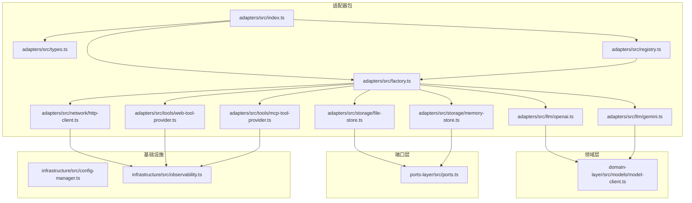
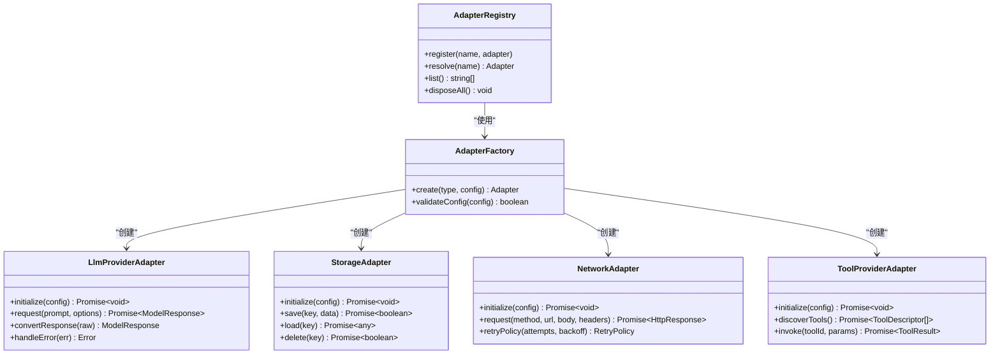
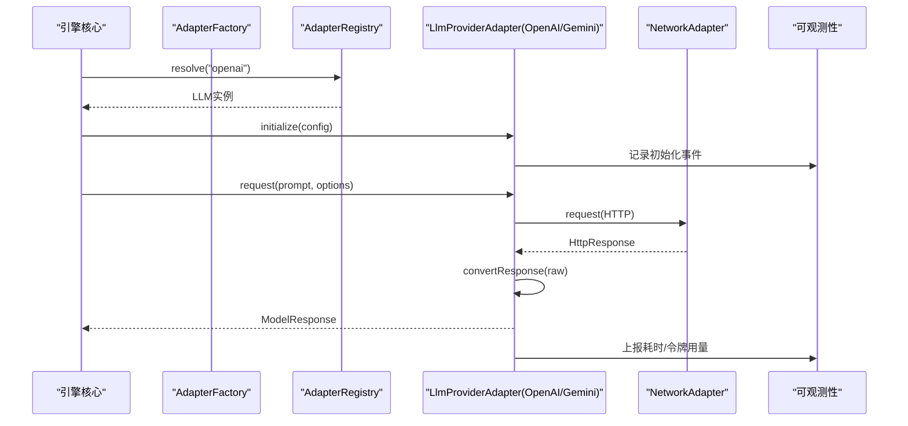
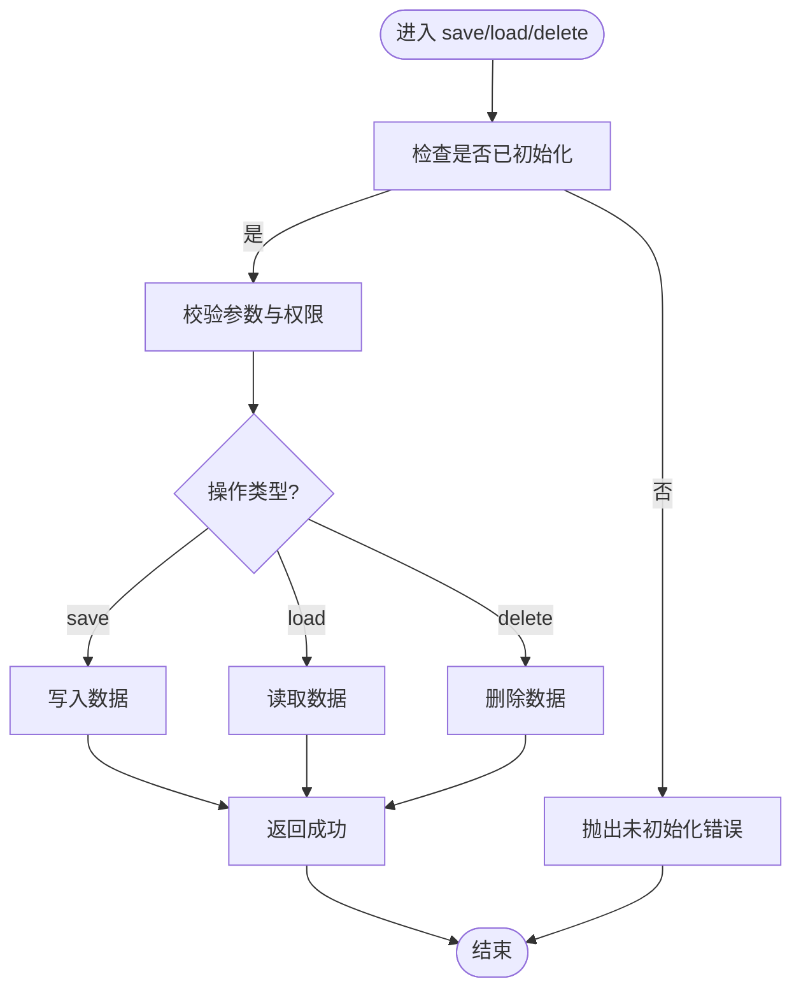
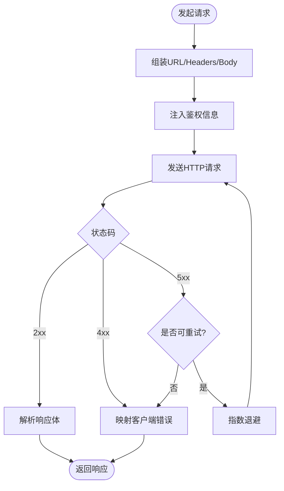
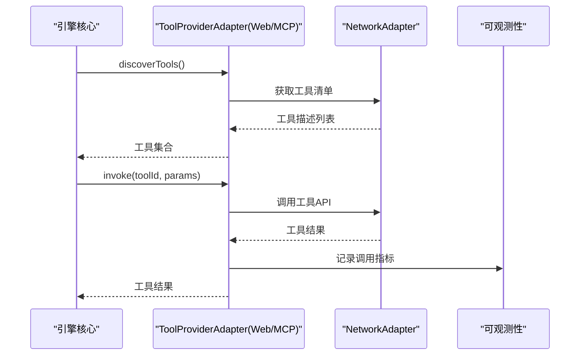
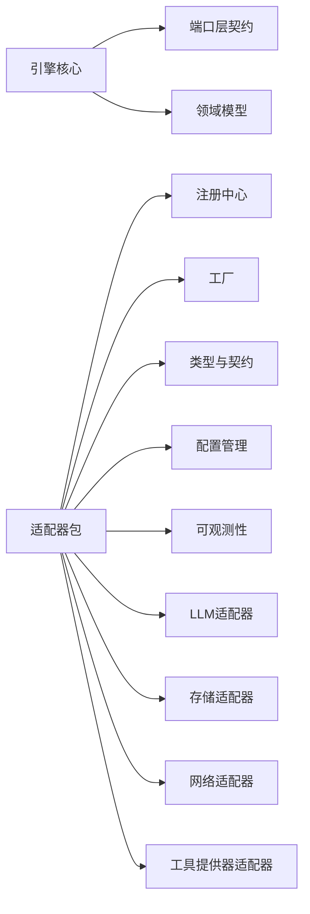

# 适配器扩展点

<cite>
**本文引用的文件**   
- [engine/packages/adapters/README.md](file://engine/packages/adapters/README.md)
- [engine/packages/adapters/src/index.ts](file://engine/packages/adapters/src/index.ts)
- [engine/packages/adapters/src/types.ts](file://engine/packages/adapters/src/types.ts)
- [engine/packages/adapters/src/registry.ts](file://engine/packages/adapters/src/registry.ts)
- [engine/packages/adapters/src/factory.ts](file://engine/packages/adapters/src/factory.ts)
- [engine/packages/adapters/src/llm/openai.ts](file://engine/packages/adapters/src/llm/openai.ts)
- [engine/packages/adapters/src/llm/gemini.ts](file://engine/packages/adapters/src/llm/gemini.ts)
- [engine/packages/adapters/src/storage/file-store.ts](file://engine/packages/adapters/src/storage/file-store.ts)
- [engine/packages/adapters/src/storage/memory-store.ts](file://engine/packages/adapters/src/storage/memory-store.ts)
- [engine/packages/adapters/src/network/http-client.ts](file://engine/packages/adapters/src/network/http-client.ts)
- [engine/packages/adapters/src/tools/web-tool-provider.ts](file://engine/packages/adapters/src/tools/web-tool-provider.ts)
- [engine/packages/adapters/src/tools/mcp-tool-provider.ts](file://engine/packages/adapters/src/tools/mcp-tool-provider.ts)
- [engine/packages/domain-layer/src/models/model-client.ts](file://engine/packages/domain-layer/src/models/model-client.ts)
- [engine/packages/domain-layer/src/models/model-history-repair.test.ts](file://engine/packages/domain-layer/src/models/model-history-repair.test.ts)
- [engine/packages/domain-layer/src/models/model-step-runner.test.ts](file://engine/packages/domain-layer/src/models/model-step-runner.test.ts)
- [engine/packages/domain-layer/src/models/model-proposal.test.ts](file://engine/packages/domain-layer/src/models/model-proposal.test.ts)
- [engine/packages/domain-layer/src/models/model-protocol-normalizer.test.ts](file://engine/packages/domain-layer/src/models/model-protocol-normalizer.test.ts)
- [engine/packages/domain-layer/src/models/model-client.test.ts](file://engine/packages/domain-layer/src/models/model-client.test.ts)
- [engine/packages/capabilities/src/capability-registry.test.ts](file://engine/packages/capabilities/src/capability-registry.test.ts)
- [engine/packages/capabilities/src/capability-registry.ts](file://engine/packages/capabilities/src/capability-registry.ts)
- [engine/packages/engine/src/runtime-kernel.test.ts](file://engine/packages/engine/src/runtime-kernel.test.ts)
- [engine/packages/engine/src/runtime-factory.test.ts](file://engine/packages/engine/src/runtime-factory.test.ts)
- [engine/packages/engine/src/runtime-kernel-provider-matrix.test.ts](file://engine/packages/engine/src/runtime-kernel-provider-matrix.test.ts)
- [engine/packages/ports-layer/src/ports.ts](file://engine/packages/ports-layer/src/ports.ts)
- [engine/packages/infrastructure/src/config-manager.ts](file://engine/packages/infrastructure/src/config-manager.ts)
- [engine/packages/infrastructure/src/observability.ts](file://engine/packages/infrastructure/src/observability.ts)
</cite>

## 目录
1. [简介](#简介)
2. [项目结构](#项目结构)
3. [核心组件](#核心组件)
4. [架构总览](#架构总览)
5. [详细组件分析](#详细组件分析)
6. [依赖关系分析](#依赖关系分析)
7. [性能考量](#性能考量)
8. [故障排除指南](#故障排除指南)
9. [结论](#结论)
10. [附录](#附录)

## 简介
本文件面向KCoder引擎的“适配器扩展点”，系统性阐述适配器模式在LLM提供商、存储、网络与工具提供器中的实现原理与接口规范，覆盖初始化配置、请求处理、响应转换与错误处理。同时给出完整的开发指南（接入新LLM、自定义存储后端、集成第三方服务），并说明适配器的注册机制、生命周期管理、配置管理与测试策略、性能监控与故障排除方法，以及适配器与引擎核心的解耦设计与向后兼容性保证。

## 项目结构
KCoder采用多包工作区组织，适配器相关能力集中在 engine/packages/adapters 下，并通过领域层模型、端口层契约、基础设施配置与可观测性进行协作。

图表来源
- [engine/packages/adapters/src/index.ts](file://engine/packages/adapters/src/index.ts)
- [engine/packages/adapters/src/types.ts](file://engine/packages/adapters/src/types.ts)
- [engine/packages/adapters/src/registry.ts](file://engine/packages/adapters/src/registry.ts)
- [engine/packages/adapters/src/factory.ts](file://engine/packages/adapters/src/factory.ts)
- [engine/packages/adapters/src/llm/openai.ts](file://engine/packages/adapters/src/llm/openai.ts)
- [engine/packages/adapters/src/llm/gemini.ts](file://engine/packages/adapters/src/llm/gemini.ts)
- [engine/packages/adapters/src/storage/file-store.ts](file://engine/packages/adapters/src/storage/file-store.ts)
- [engine/packages/adapters/src/storage/memory-store.ts](file://engine/packages/adapters/src/storage/memory-store.ts)
- [engine/packages/adapters/src/network/http-client.ts](file://engine/packages/adapters/src/network/http-client.ts)
- [engine/packages/adapters/src/tools/web-tool-provider.ts](file://engine/packages/adapters/src/tools/web-tool-provider.ts)
- [engine/packages/adapters/src/tools/mcp-tool-provider.ts](file://engine/packages/adapters/src/tools/mcp-tool-provider.ts)
- [engine/packages/domain-layer/src/models/model-client.ts](file://engine/packages/domain-layer/src/models/model-client.ts)
- [engine/packages/ports-layer/src/ports.ts](file://engine/packages/ports-layer/src/ports.ts)
- [engine/packages/infrastructure/src/config-manager.ts](file://engine/packages/infrastructure/src/config-manager.ts)
- [engine/packages/infrastructure/src/observability.ts](file://engine/packages/infrastructure/src/observability.ts)

章节来源
- [engine/packages/adapters/README.md](file://engine/packages/adapters/README.md)
- [engine/packages/adapters/src/index.ts](file://engine/packages/adapters/src/index.ts)
- [engine/packages/adapters/src/types.ts](file://engine/packages/adapters/src/types.ts)
- [engine/packages/adapters/src/registry.ts](file://engine/packages/adapters/src/registry.ts)
- [engine/packages/adapters/src/factory.ts](file://engine/packages/adapters/src/factory.ts)

## 核心组件
- 类型与契约：统一定义适配器通用类型、事件与错误约定，确保不同实现一致交互。
- 注册中心：集中管理适配器实例的生命周期、版本兼容性与发现。
- 工厂：根据配置创建具体适配器实例，注入依赖（如配置、可观测性）。
- LLM提供商适配器：将外部大模型API调用转换为领域模型协议。
- 存储适配器：抽象持久化语义，支持文件/内存等后端。
- 网络适配器：封装HTTP/HTTPS通信，统一重试、超时、鉴权与遥测。
- 工具提供器适配器：将Web/MCP等外部工具暴露为引擎可调用的工具集。

章节来源
- [engine/packages/adapters/src/types.ts](file://engine/packages/adapters/src/types.ts)
- [engine/packages/adapters/src/registry.ts](file://engine/packages/adapters/src/registry.ts)
- [engine/packages/adapters/src/factory.ts](file://engine/packages/adapters/src/factory.ts)
- [engine/packages/adapters/src/llm/openai.ts](file://engine/packages/adapters/src/llm/openai.ts)
- [engine/packages/adapters/src/llm/gemini.ts](file://engine/packages/adapters/src/llm/gemini.ts)
- [engine/packages/adapters/src/storage/file-store.ts](file://engine/packages/adapters/src/storage/file-store.ts)
- [engine/packages/adapters/src/storage/memory-store.ts](file://engine/packages/adapters/src/storage/memory-store.ts)
- [engine/packages/adapters/src/network/http-client.ts](file://engine/packages/adapters/src/network/http-client.ts)
- [engine/packages/adapters/src/tools/web-tool-provider.ts](file://engine/packages/adapters/src/tools/web-tool-provider.ts)
- [engine/packages/adapters/src/tools/mcp-tool-provider.ts](file://engine/packages/adapters/src/tools/mcp-tool-provider.ts)

## 架构总览
适配器通过“类型契约 + 注册中心 + 工厂”的组合，与引擎核心解耦。引擎仅依赖领域模型与端口层契约，不感知具体实现细节。

图表来源
- [engine/packages/adapters/src/registry.ts](file://engine/packages/adapters/src/registry.ts)
- [engine/packages/adapters/src/factory.ts](file://engine/packages/adapters/src/factory.ts)
- [engine/packages/adapters/src/llm/openai.ts](file://engine/packages/adapters/src/llm/openai.ts)
- [engine/packages/adapters/src/storage/file-store.ts](file://engine/packages/adapters/src/storage/file-store.ts)
- [engine/packages/adapters/src/network/http-client.ts](file://engine/packages/adapters/src/network/http-client.ts)
- [engine/packages/adapters/src/tools/web-tool-provider.ts](file://engine/packages/adapters/src/tools/web-tool-provider.ts)

## 详细组件分析

### LLM提供商适配器
- 职责：将外部大模型API的请求/响应映射到领域模型协议；负责鉴权、重试、限流、成本统计与遥测。
- 关键流程：初始化配置 → 构建标准化请求 → 调用网络适配器 → 解析响应 → 转换为领域模型 → 上报指标。

图表来源
- [engine/packages/adapters/src/factory.ts](file://engine/packages/adapters/src/factory.ts)
- [engine/packages/adapters/src/registry.ts](file://engine/packages/adapters/src/registry.ts)
- [engine/packages/adapters/src/llm/openai.ts](file://engine/packages/adapters/src/llm/openai.ts)
- [engine/packages/adapters/src/llm/gemini.ts](file://engine/packages/adapters/src/llm/gemini.ts)
- [engine/packages/adapters/src/network/http-client.ts](file://engine/packages/adapters/src/network/http-client.ts)
- [engine/packages/infrastructure/src/observability.ts](file://engine/packages/infrastructure/src/observability.ts)

章节来源
- [engine/packages/adapters/src/llm/openai.ts](file://engine/packages/adapters/src/llm/openai.ts)
- [engine/packages/adapters/src/llm/gemini.ts](file://engine/packages/adapters/src/llm/gemini.ts)
- [engine/packages/domain-layer/src/models/model-client.ts](file://engine/packages/domain-layer/src/models/model-client.ts)
- [engine/packages/domain-layer/src/models/model-client.test.ts](file://engine/packages/domain-layer/src/models/model-client.test.ts)
- [engine/packages/domain-layer/src/models/model-protocol-normalizer.test.ts](file://engine/packages/domain-layer/src/models/model-protocol-normalizer.test.ts)

### 存储适配器
- 职责：抽象键值/文档型存储语义，屏蔽底层差异（文件系统、内存、对象存储等）。
- 关键流程：初始化 → 保存/加载/删除 → 错误归一化 → 可选压缩/加密。

图表来源
- [engine/packages/adapters/src/storage/file-store.ts](file://engine/packages/adapters/src/storage/file-store.ts)
- [engine/packages/adapters/src/storage/memory-store.ts](file://engine/packages/adapters/src/storage/memory-store.ts)

章节来源
- [engine/packages/adapters/src/storage/file-store.ts](file://engine/packages/adapters/src/storage/file-store.ts)
- [engine/packages/adapters/src/storage/memory-store.ts](file://engine/packages/adapters/src/storage/memory-store.ts)
- [engine/packages/ports-layer/src/ports.ts](file://engine/packages/ports-layer/src/ports.ts)

### 网络适配器
- 职责：统一HTTP客户端行为，包括重试、退避、超时、鉴权头注入、代理、TLS、遥测与错误分类。
- 关键点：幂等请求自动重试；非幂等需显式控制；对上游错误码进行领域错误映射。

图表来源
- [engine/packages/adapters/src/network/http-client.ts](file://engine/packages/adapters/src/network/http-client.ts)
- [engine/packages/infrastructure/src/observability.ts](file://engine/packages/infrastructure/src/observability.ts)

章节来源
- [engine/packages/adapters/src/network/http-client.ts](file://engine/packages/adapters/src/network/http-client.ts)

### 工具提供器适配器
- 职责：发现并调用外部工具（Web API、MCP等），将结果转换为引擎内部工具调用协议。
- 关键点：工具清单动态发现；参数校验；执行上下文隔离；错误归一化与审计。

图表来源
- [engine/packages/adapters/src/tools/web-tool-provider.ts](file://engine/packages/adapters/src/tools/web-tool-provider.ts)
- [engine/packages/adapters/src/tools/mcp-tool-provider.ts](file://engine/packages/adapters/src/tools/mcp-tool-provider.ts)
- [engine/packages/adapters/src/network/http-client.ts](file://engine/packages/adapters/src/network/http-client.ts)
- [engine/packages/infrastructure/src/observability.ts](file://engine/packages/infrastructure/src/observability.ts)

章节来源
- [engine/packages/adapters/src/tools/web-tool-provider.ts](file://engine/packages/adapters/src/tools/web-tool-provider.ts)
- [engine/packages/adapters/src/tools/mcp-tool-provider.ts](file://engine/packages/adapters/src/tools/mcp-tool-provider.ts)

## 依赖关系分析
- 低耦合：引擎通过领域模型与端口层契约消费适配器，避免直接依赖具体实现。
- 注册与工厂：注册中心负责命名空间与生命周期，工厂负责按配置装配。
- 可观测性与配置：所有适配器均通过基础设施层注入配置与遥测。

图表来源
- [engine/packages/ports-layer/src/ports.ts](file://engine/packages/ports-layer/src/ports.ts)
- [engine/packages/adapters/src/registry.ts](file://engine/packages/adapters/src/registry.ts)
- [engine/packages/adapters/src/factory.ts](file://engine/packages/adapters/src/factory.ts)
- [engine/packages/adapters/src/types.ts](file://engine/packages/adapters/src/types.ts)
- [engine/packages/infrastructure/src/config-manager.ts](file://engine/packages/infrastructure/src/config-manager.ts)
- [engine/packages/infrastructure/src/observability.ts](file://engine/packages/infrastructure/src/observability.ts)

章节来源
- [engine/packages/ports-layer/src/ports.ts](file://engine/packages/ports-layer/src/ports.ts)
- [engine/packages/adapters/src/registry.ts](file://engine/packages/adapters/src/registry.ts)
- [engine/packages/adapters/src/factory.ts](file://engine/packages/adapters/src/factory.ts)
- [engine/packages/adapters/src/types.ts](file://engine/packages/adapters/src/types.ts)
- [engine/packages/infrastructure/src/config-manager.ts](file://engine/packages/infrastructure/src/config-manager.ts)
- [engine/packages/infrastructure/src/observability.ts](file://engine/packages/infrastructure/src/observability.ts)

## 性能考量
- 连接复用与池化：网络适配器应复用连接，减少握手开销。
- 批量与流式：对长文本或流式输出，优先使用流式传输以降低延迟。
- 重试与退避：合理设置最大重试次数与退避策略，避免雪崩。
- 缓存与会话：存储适配器可对热点数据进行本地缓存，注意一致性。
- 资源限制：并发上限、令牌配额与预算控制需在适配器层与引擎层协同。
- 遥测采样：高频指标建议采样上报，降低系统开销。

[本节为通用指导，无需源码引用]

## 故障排除指南
- 初始化失败：检查配置项完整性、密钥有效性、网络可达性与证书链。
- 请求超时/失败：查看网络适配器日志、重试策略与上游状态码映射。
- 响应格式异常：确认协议规范化逻辑与字段映射是否正确。
- 存储读写错误：验证路径权限、磁盘空间与序列化格式。
- 工具调用失败：核对工具清单、鉴权范围与参数约束。
- 回归与兼容性：运行领域模型与协议规范化测试用例，确保向后兼容。

章节来源
- [engine/packages/domain-layer/src/models/model-history-repair.test.ts](file://engine/packages/domain-layer/src/models/model-history-repair.test.ts)
- [engine/packages/domain-layer/src/models/model-step-runner.test.ts](file://engine/packages/domain-layer/src/models/model-step-runner.test.ts)
- [engine/packages/domain-layer/src/models/model-proposal.test.ts](file://engine/packages/domain-layer/src/models/model-proposal.test.ts)
- [engine/packages/domain-layer/src/models/model-protocol-normalizer.test.ts](file://engine/packages/domain-layer/src/models/model-protocol-normalizer.test.ts)
- [engine/packages/domain-layer/src/models/model-client.test.ts](file://engine/packages/domain-layer/src/models/model-client.test.ts)

## 结论
通过统一的类型契约、注册中心与工厂机制，KCoder实现了适配器与引擎核心之间的清晰解耦。LLM提供商、存储、网络与工具提供器四类适配器遵循一致的初始化、请求处理、响应转换与错误处理规范，便于扩展与维护。配合完善的测试策略、可观测性与配置管理，可在保障向后兼容性的前提下持续演进。

[本节为总结性内容，无需源码引用]

## 附录

### 适配器接口规范（摘要）
- 初始化配置
  - 输入：配置对象（包含鉴权、超时、重试、端点等）
  - 输出：Promise<void>，失败抛出自定义错误
- 请求处理
  - 输入：标准化请求（含消息、选项、上下文）
  - 输出：Promise<领域响应>
- 响应转换
  - 输入：原始响应
  - 输出：领域模型响应（含内容、元数据、统计信息）
- 错误处理
  - 统一错误分类（网络、认证、限流、业务）
  - 提供可诊断的错误信息与恢复建议

章节来源
- [engine/packages/adapters/src/types.ts](file://engine/packages/adapters/src/types.ts)
- [engine/packages/adapters/src/factory.ts](file://engine/packages/adapters/src/factory.ts)
- [engine/packages/adapters/src/registry.ts](file://engine/packages/adapters/src/registry.ts)

### 适配器开发指南
- 接入新的LLM提供商
  - 实现LLM适配器接口，完成初始化、请求构造、响应转换与错误映射
  - 在工厂中注册新类型，并在注册中心声明能力
  - 编写端到端测试，覆盖正常、异常与边界场景
- 自定义存储后端
  - 实现存储适配器接口，确保幂等与一致性语义
  - 提供迁移与回滚策略，保证数据可恢复
- 第三方服务集成
  - 使用网络适配器统一通信，注入遥测与审计
  - 对敏感信息进行脱敏与最小权限原则

章节来源
- [engine/packages/adapters/src/llm/openai.ts](file://engine/packages/adapters/src/llm/openai.ts)
- [engine/packages/adapters/src/llm/gemini.ts](file://engine/packages/adapters/src/llm/gemini.ts)
- [engine/packages/adapters/src/storage/file-store.ts](file://engine/packages/adapters/src/storage/file-store.ts)
- [engine/packages/adapters/src/storage/memory-store.ts](file://engine/packages/adapters/src/storage/memory-store.ts)
- [engine/packages/adapters/src/network/http-client.ts](file://engine/packages/adapters/src/network/http-client.ts)
- [engine/packages/adapters/src/tools/web-tool-provider.ts](file://engine/packages/adapters/src/tools/web-tool-provider.ts)
- [engine/packages/adapters/src/tools/mcp-tool-provider.ts](file://engine/packages/adapters/src/tools/mcp-tool-provider.ts)

### 注册机制、生命周期与配置管理
- 注册机制
  - 通过注册中心以名称+版本方式注册适配器
  - 支持热插拔与动态发现
- 生命周期
  - 初始化 → 就绪 → 运行 → 销毁
  - 提供优雅关闭钩子，释放资源
- 配置管理
  - 从配置管理器加载环境/文件配置
  - 支持运行时更新与灰度切换

章节来源
- [engine/packages/adapters/src/registry.ts](file://engine/packages/adapters/src/registry.ts)
- [engine/packages/adapters/src/factory.ts](file://engine/packages/adapters/src/factory.ts)
- [engine/packages/infrastructure/src/config-manager.ts](file://engine/packages/infrastructure/src/config-manager.ts)

### 测试策略
- 单元测试：针对适配器核心逻辑与边界条件
- 集成测试：对接真实或模拟的外部服务
- 契约测试：确保与领域模型和端口层契约一致
- 回归测试：覆盖历史修复与协议规范化用例

章节来源
- [engine/packages/domain-layer/src/models/model-history-repair.test.ts](file://engine/packages/domain-layer/src/models/model-history-repair.test.ts)
- [engine/packages/domain-layer/src/models/model-step-runner.test.ts](file://engine/packages/domain-layer/src/models/model-step-runner.test.ts)
- [engine/packages/domain-layer/src/models/model-proposal.test.ts](file://engine/packages/domain-layer/src/models/model-proposal.test.ts)
- [engine/packages/domain-layer/src/models/model-protocol-normalizer.test.ts](file://engine/packages/domain-layer/src/models/model-protocol-normalizer.test.ts)
- [engine/packages/domain-layer/src/models/model-client.test.ts](file://engine/packages/domain-layer/src/models/model-client.test.ts)

### 性能监控与可观测性
- 指标采集：请求耗时、成功率、错误率、令牌用量、吞吐
- 链路追踪：跨适配器的调用链ID透传
- 告警规则：基于阈值与趋势的异常检测

章节来源
- [engine/packages/infrastructure/src/observability.ts](file://engine/packages/infrastructure/src/observability.ts)

### 与引擎核心的解耦与向后兼容
- 解耦设计
  - 引擎仅依赖领域模型与端口层契约
  - 适配器通过工厂与注册中心装配，避免硬编码
- 向后兼容
  - 版本化适配器接口与配置
  - 协议规范化与历史修复测试保障兼容

章节来源
- [engine/packages/ports-layer/src/ports.ts](file://engine/packages/ports-layer/src/ports.ts)
- [engine/packages/domain-layer/src/models/model-history-repair.test.ts](file://engine/packages/domain-layer/src/models/model-history-repair.test.ts)
- [engine/packages/domain-layer/src/models/model-protocol-normalizer.test.ts](file://engine/packages/domain-layer/src/models/model-protocol-normalizer.test.ts)