# 数据流设计

<cite>
**本文引用的文件**   
- [app/main/index.ts](file://app/main/index.ts)
- [app/main/engine-host.ts](file://app/main/engine-host.ts)
- [app/preload/index.ts](file://app/preload/index.ts)
- [app/renderer/src/main.tsx](file://app/renderer/src/main.tsx)
- [app/renderer/src/App.tsx](file://app/renderer/src/App.tsx)
- [app/renderer/src/stores/app-store.ts](file://app/renderer/src/stores/app-store.ts)
- [app/renderer/src/hooks/useChat.ts](file://app/renderer/src/hooks/useChat.ts)
- [app/renderer/src/components/ChatPanel/index.tsx](file://app/renderer/src/components/ChatPanel/index.tsx)
- [app/renderer/src/components/ChatPanel/ChatInput.tsx](file://app/renderer/src/components/ChatPanel/ChatInput.tsx)
- [app/renderer/src/components/ChatPanel/MessageBubble.tsx](file://app/renderer/src/components/ChatPanel/MessageBubble.tsx)
- [app/renderer/src/services/engine-api.ts](file://app/renderer/src/services/engine-api.ts)
- [engine/package.json](file://engine/package.json)
- [engine/scripts/verify-evented-a2a-script.test.ts](file://engine/scripts/verify-evented-a2a-script.test.ts)
- [engine/tests/runtime-kernel.test.ts](file://engine/tests/runtime-kernel.test.ts)
- [engine/tests/runtime-kernel-e2e.test.ts](file://engine/tests/runtime-kernel-e2e.test.ts)
- [engine/tests/tool-runtime-v3.test.ts](file://engine/tests/tool-runtime-v3.test.ts)
- [engine/tests/run-event-store.test.ts](file://engine/tests/run-event-store.test.ts)
- [engine/tests/file-session-store.test.ts](file://engine/tests/file-session-store.test.ts)
- [engine/tests/hybrid-store.test.ts](file://engine/tests/hybrid-store.test.ts)
- [engine/tests/cache.test.ts](file://engine/tests/cache.test.ts)
- [engine/tests/memory-retrieval.test.ts](file://engine/tests/memory-retrieval.test.ts)
- [engine/tests/compaction-governor.test.ts](file://engine/tests/compaction-governor.test.ts)
- [engine/tests/context-compactor.test.ts](file://engine/tests/context-compactor.test.ts)
- [engine/tests/token-economy.test.ts](file://engine/tests/token-economy.test.ts)
- [engine/tests/tool-call-repair.test.ts](file://engine/tests/tool-call-repair.test.ts)
- [engine/tests/delegation-runtime.test.ts](file://engine/tests/delegation-runtime.test.ts)
- [engine/tests/http-server.test.ts](file://engine/tests/http-server.test.ts)
</cite>

## 目录
1. [简介](#简介)
2. [项目结构](#项目结构)
3. [核心组件](#核心组件)
4. [架构总览](#架构总览)
5. [详细组件分析](#详细组件分析)
6. [依赖分析](#依赖分析)
7. [性能考虑](#性能考虑)
8. [故障排查指南](#故障排查指南)
9. [结论](#结论)
10. [附录](#附录)

## 简介
本文件面向KCoder系统的数据流设计，覆盖从用户输入到AI响应的完整路径、文件变更传播、状态同步与持久化读写。文档基于事件驱动架构，阐述事件总线、消息队列与状态管理在系统中的角色，并给出一致性保证、错误处理与重试策略。同时提供时序图与状态转换图，说明缓存、压缩与传输优化，以及大数据量场景下的性能与内存管理建议。

## 项目结构
KCoder采用Electron多进程架构：主进程负责引擎宿主与IPC桥接，预加载脚本暴露安全API给渲染进程，渲染进程通过服务层调用引擎API；引擎侧以包形式组织，包含运行时内核、工具执行、能力注册、HTTP层等。测试脚本覆盖了事件驱动A2A、运行期内核、事件存储、会话存储、混合存储、缓存与上下文压缩等关键数据流路径。

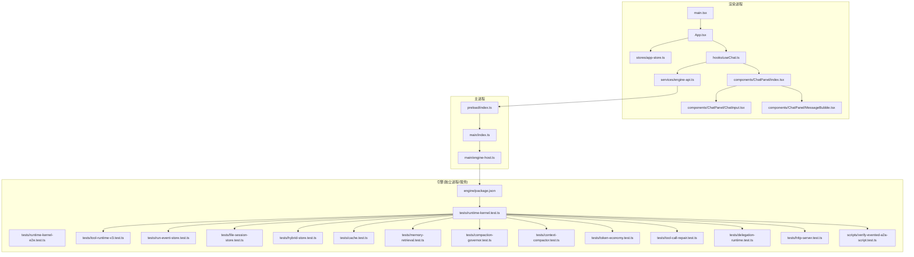

图表来源
- [app/main/index.ts](file://app/main/index.ts)
- [app/main/engine-host.ts](file://app/main/engine-host.ts)
- [app/preload/index.ts](file://app/preload/index.ts)
- [app/renderer/src/main.tsx](file://app/renderer/src/main.tsx)
- [app/renderer/src/App.tsx](file://app/renderer/src/App.tsx)
- [app/renderer/src/stores/app-store.ts](file://app/renderer/src/stores/app-store.ts)
- [app/renderer/src/hooks/useChat.ts](file://app/renderer/src/hooks/useChat.ts)
- [app/renderer/src/components/ChatPanel/index.tsx](file://app/renderer/src/components/ChatPanel/index.tsx)
- [app/renderer/src/components/ChatPanel/ChatInput.tsx](file://app/renderer/src/components/ChatPanel/ChatInput.tsx)
- [app/renderer/src/components/ChatPanel/MessageBubble.tsx](file://app/renderer/src/components/ChatPanel/MessageBubble.tsx)
- [app/renderer/src/services/engine-api.ts](file://app/renderer/src/services/engine-api.ts)
- [engine/package.json](file://engine/package.json)
- [engine/tests/runtime-kernel.test.ts](file://engine/tests/runtime-kernel.test.ts)
- [engine/tests/runtime-kernel-e2e.test.ts](file://engine/tests/runtime-kernel-e2e.test.ts)
- [engine/tests/tool-runtime-v3.test.ts](file://engine/tests/tool-runtime-v3.test.ts)
- [engine/tests/run-event-store.test.ts](file://engine/tests/run-event-store.test.ts)
- [engine/tests/file-session-store.test.ts](file://engine/tests/file-session-store.test.ts)
- [engine/tests/hybrid-store.test.ts](file://engine/tests/hybrid-store.test.ts)
- [engine/tests/cache.test.ts](file://engine/tests/cache.test.ts)
- [engine/tests/memory-retrieval.test.ts](file://engine/tests/memory-retrieval.test.ts)
- [engine/tests/compaction-governor.test.ts](file://engine/tests/compaction-governor.test.ts)
- [engine/tests/context-compactor.test.ts](file://engine/tests/context-compactor.test.ts)
- [engine/tests/token-economy.test.ts](file://engine/tests/token-economy.test.ts)
- [engine/tests/tool-call-repair.test.ts](file://engine/tests/tool-call-repair.test.ts)
- [engine/tests/delegation-runtime.test.ts](file://engine/tests/delegation-runtime.test.ts)
- [engine/tests/http-server.test.ts](file://engine/tests/http-server.test.ts)
- [engine/scripts/verify-evented-a2a-script.test.ts](file://engine/scripts/verify-evented-a2a-script.test.ts)

章节来源
- [app/main/index.ts](file://app/main/index.ts)
- [app/main/engine-host.ts](file://app/main/engine-host.ts)
- [app/preload/index.ts](file://app/preload/index.ts)
- [app/renderer/src/main.tsx](file://app/renderer/src/main.tsx)
- [app/renderer/src/App.tsx](file://app/renderer/src/App.tsx)
- [app/renderer/src/stores/app-store.ts](file://app/renderer/src/stores/app-store.ts)
- [app/renderer/src/hooks/useChat.ts](file://app/renderer/src/hooks/useChat.ts)
- [app/renderer/src/components/ChatPanel/index.tsx](file://app/renderer/src/components/ChatPanel/index.tsx)
- [app/renderer/src/components/ChatPanel/ChatInput.tsx](file://app/renderer/src/components/ChatPanel/ChatInput.tsx)
-app/renderer/src/components/ChatPanel/MessageBubble.tsx](file://app/renderer/src/components/ChatPanel/MessageBubble.tsx)
- [app/renderer/src/services/engine-api.ts](file://app/renderer/src/services/engine-api.ts)
- [engine/package.json](file://engine/package.json)

## 核心组件
- 渲染端UI与状态
  - ChatPanel及其子组件负责对话输入、消息展示与交互触发。
  - useChat钩子封装对话生命周期（发送、接收增量、完成、错误）。
  - app-store集中管理应用级状态，供UI订阅更新。
- 渲染端服务层
  - engine-api统一封装对引擎的调用（如HTTP或IPC），屏蔽底层通信细节。
- 主进程与预加载
  - main/index.ts启动主进程、窗口与菜单，桥接引擎宿主。
  - engine-host.ts负责引擎实例的生命周期管理与资源隔离。
  - preload/index.ts向渲染进程暴露安全的IPC通道。
- 引擎侧
  - 运行期内核负责编排任务、工具执行、事件记录与状态推进。
  - 事件存储与会话存储负责持久化与回放。
  - 混合存储、缓存、上下文压缩与令牌经济用于性能与成本优化。
  - HTTP服务器与A2A事件脚本验证事件驱动链路。

章节来源
- [app/renderer/src/components/ChatPanel/index.tsx](file://app/renderer/src/components/ChatPanel/index.tsx)
- [app/renderer/src/components/ChatPanel/ChatInput.tsx](file://app/renderer/src/components/ChatPanel/ChatInput.tsx)
- [app/renderer/src/components/ChatPanel/MessageBubble.tsx](file://app/renderer/src/components/ChatPanel/MessageBubble.tsx)
- [app/renderer/src/hooks/useChat.ts](file://app/renderer/src/hooks/useChat.ts)
- [app/renderer/src/stores/app-store.ts](file://app/renderer/src/stores/app-store.ts)
- [app/renderer/src/services/engine-api.ts](file://app/renderer/src/services/engine-api.ts)
- [app/main/index.ts](file://app/main/index.ts)
- [app/main/engine-host.ts](file://app/main/engine-host.ts)
- [app/preload/index.ts](file://app/preload/index.ts)
- [engine/tests/runtime-kernel.test.ts](file://engine/tests/runtime-kernel.test.ts)
- [engine/tests/run-event-store.test.ts](file://engine/tests/run-event-store.test.ts)
- [engine/tests/file-session-store.test.ts](file://engine/tests/file-session-store.test.ts)
- [engine/tests/hybrid-store.test.ts](file://engine/tests/hybrid-store.test.ts)
- [engine/tests/cache.test.ts](file://engine/tests/cache.test.ts)
- [engine/tests/context-compactor.test.ts](file://engine/tests/context-compactor.test.ts)
- [engine/tests/token-economy.test.ts](file://engine/tests/token-economy.test.ts)
- [engine/tests/http-server.test.ts](file://engine/tests/http-server.test.ts)
- [engine/scripts/verify-evented-a2a-script.test.ts](file://engine/scripts/verify-evented-a2a-script.test.ts)

## 架构总览
KCoder采用“渲染进程—主进程—引擎”三层架构，结合事件驱动与持久化回放机制。渲染端通过服务层发起请求，主进程将请求转发至引擎；引擎内部以事件为核心，驱动状态机推进，并将事件落盘以供回放与审计。文件变更与会话状态通过事件总线广播，确保跨模块一致。

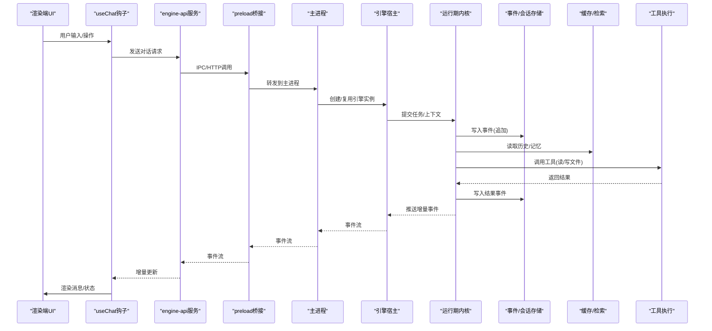

图表来源
- [app/renderer/src/hooks/useChat.ts](file://app/renderer/src/hooks/useChat.ts)
- [app/renderer/src/services/engine-api.ts](file://app/renderer/src/services/engine-api.ts)
- [app/preload/index.ts](file://app/preload/index.ts)
- [app/main/index.ts](file://app/main/index.ts)
- [app/main/engine-host.ts](file://app/main/engine-host.ts)
- [engine/tests/runtime-kernel.test.ts](file://engine/tests/runtime-kernel.test.ts)
- [engine/tests/run-event-store.test.ts](file://engine/tests/run-event-store.test.ts)
- [engine/tests/file-session-store.test.ts](file://engine/tests/file-session-store.test.ts)
- [engine/tests/cache.test.ts](file://engine/tests/cache.test.ts)
- [engine/tests/tool-runtime-v3.test.ts](file://engine/tests/tool-runtime-v3.test.ts)

## 详细组件分析

### 用户输入到AI响应数据流
- 入口：ChatInput捕获用户输入，ChatPanel聚合消息列表与交互逻辑。
- 状态与副作用：useChat维护发送状态、消息流与错误；app-store提供全局状态订阅。
- 服务层：engine-api封装请求参数、重试与错误映射，统一返回结构化结果。
- 主进程与宿主：main/index.ts初始化窗口与菜单，engine-host.ts管理引擎实例生命周期。
- 引擎内核：runtime-kernel根据事件推进状态，调用工具执行，产出增量事件。
- 持久化：run-event-store与file-session-store记录事件与会话，支持回放与恢复。
- 前端渲染：Hook消费事件流，增量更新UI。

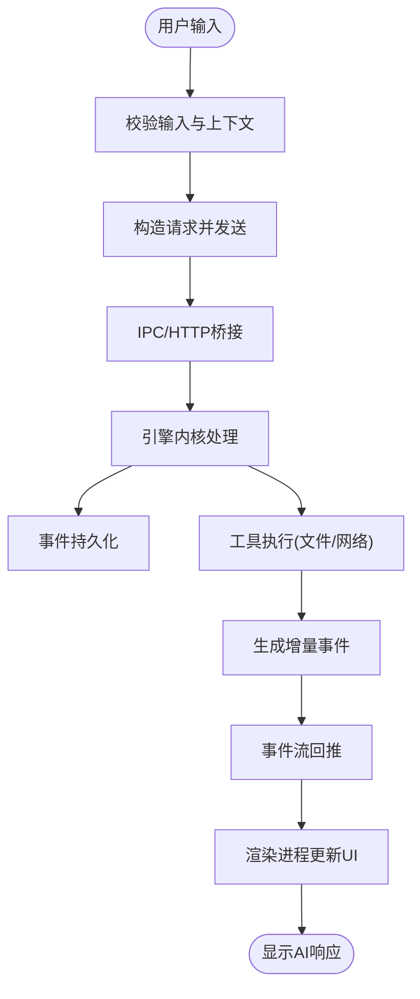

图表来源
- [app/renderer/src/components/ChatPanel/ChatInput.tsx](file://app/renderer/src/components/ChatPanel/ChatInput.tsx)
- [app/renderer/src/components/ChatPanel/index.tsx](file://app/renderer/src/components/ChatPanel/index.tsx)
- [app/renderer/src/hooks/useChat.ts](file://app/renderer/src/hooks/useChat.ts)
- [app/renderer/src/services/engine-api.ts](file://app/renderer/src/services/engine-api.ts)
- [app/preload/index.ts](file://app/preload/index.ts)
- [app/main/index.ts](file://app/main/index.ts)
- [app/main/engine-host.ts](file://app/main/engine-host.ts)
- [engine/tests/runtime-kernel.test.ts](file://engine/tests/runtime-kernel.test.ts)
- [engine/tests/run-event-store.test.ts](file://engine/tests/run-event-store.test.ts)
- [engine/tests/file-session-store.test.ts](file://engine/tests/file-session-store.test.ts)
- [engine/tests/tool-runtime-v3.test.ts](file://engine/tests/tool-runtime-v3.test.ts)

章节来源
- [app/renderer/src/components/ChatPanel/ChatInput.tsx](file://app/renderer/src/components/ChatPanel/ChatInput.tsx)
- [app/renderer/src/components/ChatPanel/index.tsx](file://app/renderer/src/components/ChatPanel/index.tsx)
- [app/renderer/src/hooks/useChat.ts](file://app/renderer/src/hooks/useChat.ts)
- [app/renderer/src/services/engine-api.ts](file://app/renderer/src/services/engine-api.ts)
- [app/preload/index.ts](file://app/preload/index.ts)
- [app/main/index.ts](file://app/main/index.ts)
- [app/main/engine-host.ts](file://app/main/engine-host.ts)
- [engine/tests/runtime-kernel.test.ts](file://engine/tests/runtime-kernel.test.ts)
- [engine/tests/run-event-store.test.ts](file://engine/tests/run-event-store.test.ts)
- [engine/tests/file-session-store.test.ts](file://engine/tests/file-session-store.test.ts)
- [engine/tests/tool-runtime-v3.test.ts](file://engine/tests/tool-runtime-v3.test.ts)

### 文件变更的数据传播
- 触发点：工具执行阶段可能产生文件写入/删除/重命名等操作。
- 事件化：文件变更被包装为事件写入事件存储，形成不可变日志。
- 传播：事件总线将变更事件广播至相关订阅者（如文件树、预览面板）。
- 一致性：通过顺序事件与幂等处理保证最终一致性。

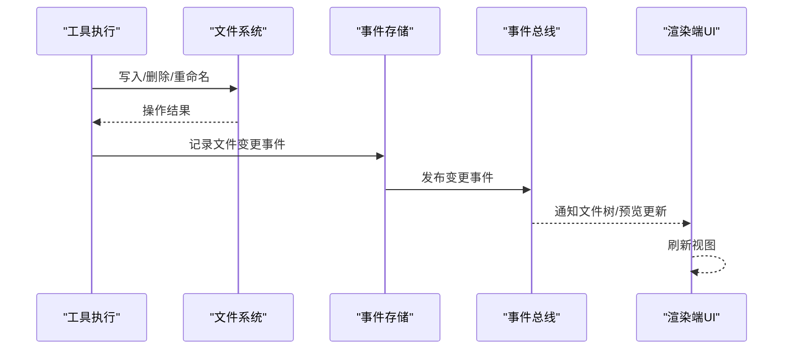

图表来源
- [engine/tests/tool-runtime-v3.test.ts](file://engine/tests/tool-runtime-v3.test.ts)
- [engine/tests/run-event-store.test.ts](file://engine/tests/run-event-store.test.ts)
- [engine/tests/file-session-store.test.ts](file://engine/tests/file-session-store.test.ts)

章节来源
- [engine/tests/tool-runtime-v3.test.ts](file://engine/tests/tool-runtime-v3.test.ts)
- [engine/tests/run-event-store.test.ts](file://engine/tests/run-event-store.test.ts)
- [engine/tests/file-session-store.test.ts](file://engine/tests/file-session-store.test.ts)

### 状态更新的数据同步
- 状态模型：运行期内核维护任务/回合/步骤等状态，并通过事件推进。
- 投影与回放：事件存储支持按时间线回放，重建任意时刻状态。
- 前端同步：渲染端订阅事件流，增量合并到本地状态，避免全量拉取。

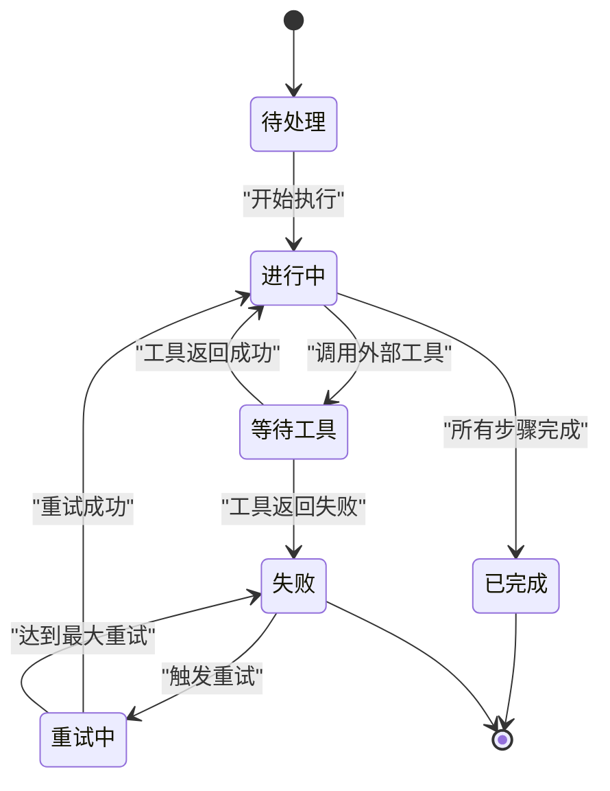

图表来源
- [engine/tests/runtime-kernel.test.ts](file://engine/tests/runtime-kernel.test.ts)
- [engine/tests/run-event-store.test.ts](file://engine/tests/run-event-store.test.ts)

章节来源
- [engine/tests/runtime-kernel.test.ts](file://engine/tests/runtime-kernel.test.ts)
- [engine/tests/run-event-store.test.ts](file://engine/tests/run-event-store.test.ts)

### 持久化存储的数据读写
- 事件存储：追加式写入，支持回放与审计。
- 会话存储：按会话维度组织事件，便于恢复与迁移。
- 混合存储：热路径使用内存/轻量存储，冷路径落盘，兼顾性能与容量。

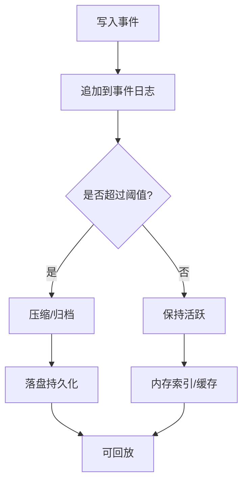

图表来源
- [engine/tests/run-event-store.test.ts](file://engine/tests/run-event-store.test.ts)
- [engine/tests/file-session-store.test.ts](file://engine/tests/file-session-store.test.ts)
- [engine/tests/hybrid-store.test.ts](file://engine/tests/hybrid-store.test.ts)

章节来源
- [engine/tests/run-event-store.test.ts](file://engine/tests/run-event-store.test.ts)
- [engine/tests/file-session-store.test.ts](file://engine/tests/file-session-store.test.ts)
- [engine/tests/hybrid-store.test.ts](file://engine/tests/hybrid-store.test.ts)

### 事件驱动的数据流架构
- 事件总线：作为解耦中枢，连接生产者（工具、内核）与消费者（UI、监控、审计）。
- 消息队列：在需要异步与削峰填谷的场景下，将事件入队并由消费者拉取。
- 状态管理：事件即事实，状态由事件还原，保证强一致性与可追溯性。

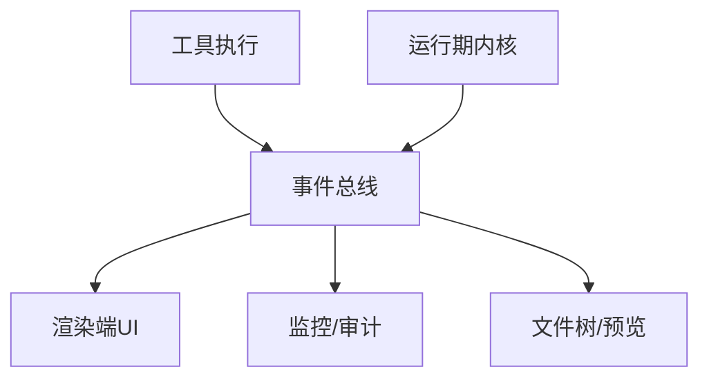

图表来源
- [engine/scripts/verify-evented-a2a-script.test.ts](file://engine/scripts/verify-evented-a2a-script.test.ts)
- [engine/tests/runtime-kernel.test.ts](file://engine/tests/runtime-kernel.test.ts)
- [engine/tests/run-event-store.test.ts](file://engine/tests/run-event-store.test.ts)

章节来源
- [engine/scripts/verify-evented-a2a-script.test.ts](file://engine/scripts/verify-evented-a2a-script.test.ts)
- [engine/tests/runtime-kernel.test.ts](file://engine/tests/runtime-kernel.test.ts)
- [engine/tests/run-event-store.test.ts](file://engine/tests/run-event-store.test.ts)

### 数据一致性保证、错误处理与重试机制
- 一致性：事件追加+幂等消费+顺序回放，确保最终一致与可重现。
- 错误处理：工具调用失败时记录错误事件，进入重试分支或降级流程。
- 重试机制：可配置最大重试次数与退避策略，避免雪崩。

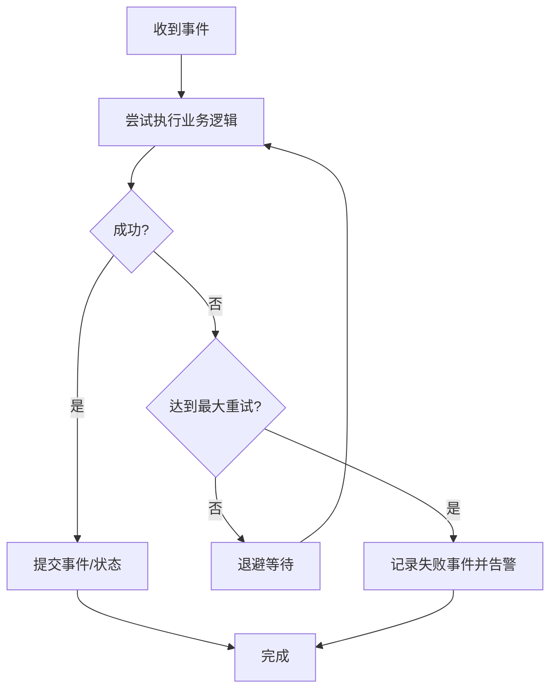

图表来源
- [engine/tests/tool-call-repair.test.ts](file://engine/tests/tool-call-repair.test.ts)
- [engine/tests/runtime-kernel.test.ts](file://engine/tests/runtime-kernel.test.ts)

章节来源
- [engine/tests/tool-call-repair.test.ts](file://engine/tests/tool-call-repair.test.ts)
- [engine/tests/runtime-kernel.test.ts](file://engine/tests/runtime-kernel.test.ts)

### 缓存策略、数据压缩与传输优化
- 缓存策略：热点上下文与检索结果缓存，减少重复计算与IO。
- 数据压缩：上下文压缩器按需裁剪历史，降低传输与存储体积。
- 传输优化：增量事件流、分页与批处理，降低带宽占用。

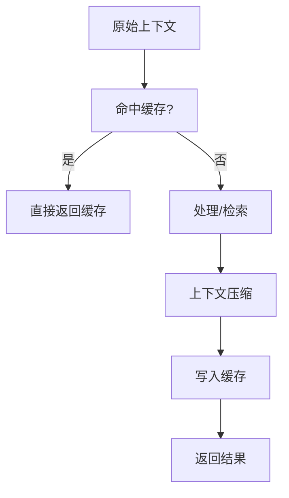

图表来源
- [engine/tests/cache.test.ts](file://engine/tests/cache.test.ts)
- [engine/tests/memory-retrieval.test.ts](file://engine/tests/memory-retrieval.test.ts)
- [engine/tests/context-compactor.test.ts](file://engine/tests/context-compactor.test.ts)

章节来源
- [engine/tests/cache.test.ts](file://engine/tests/cache.test.ts)
- [engine/tests/memory-retrieval.test.ts](file://engine/tests/memory-retrieval.test.ts)
- [engine/tests/context-compactor.test.ts](file://engine/tests/context-compactor.test.ts)

### 大数据量场景的性能考虑与内存管理
- 令牌经济：限制单次上下文长度与输出长度，控制成本与延迟。
- 压缩治理：根据策略自动压缩历史，释放内存与磁盘空间。
- 分片与流式：大对象分块传输，流式渲染避免阻塞。

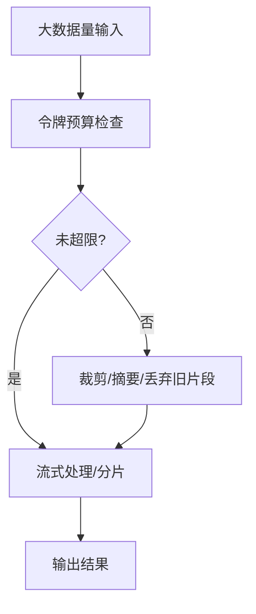

图表来源
- [engine/tests/token-economy.test.ts](file://engine/tests/token-economy.test.ts)
- [engine/tests/compaction-governor.test.ts](file://engine/tests/compaction-governor.test.ts)

章节来源
- [engine/tests/token-economy.test.ts](file://engine/tests/token-economy.test.ts)
- [engine/tests/compaction-governor.test.ts](file://engine/tests/compaction-governor.test.ts)

### 委托与协作的数据流
- 子代理：复杂任务可委派给子代理执行，结果事件汇入主流程。
- 协调器：父代理汇总子代理结果，继续推进上层状态。

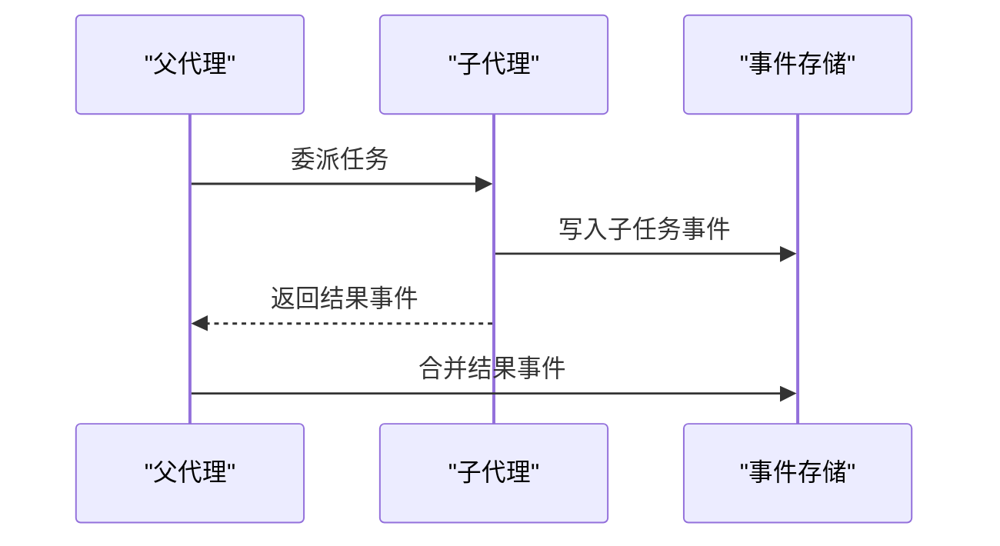

图表来源
- [engine/tests/delegation-runtime.test.ts](file://engine/tests/delegation-runtime.test.ts)
- [engine/tests/run-event-store.test.ts](file://engine/tests/run-event-store.test.ts)

章节来源
- [engine/tests/delegation-runtime.test.ts](file://engine/tests/delegation-runtime.test.ts)
- [engine/tests/run-event-store.test.ts](file://engine/tests/run-event-store.test.ts)

### HTTP与服务端集成
- HTTP接口：对外暴露REST/WebSocket接口，承载事件流与查询。
- 可观测性：服务端指标与日志辅助定位问题。

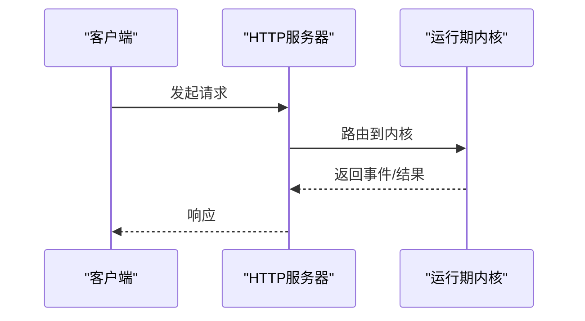

图表来源
- [engine/tests/http-server.test.ts](file://engine/tests/http-server.test.ts)
- [engine/tests/runtime-kernel.test.ts](file://engine/tests/runtime-kernel.test.ts)

章节来源
- [engine/tests/http-server.test.ts](file://engine/tests/http-server.test.ts)
- [engine/tests/runtime-kernel.test.ts](file://engine/tests/runtime-kernel.test.ts)

## 依赖分析
- 渲染端依赖：UI组件依赖useChat与app-store；useChat依赖engine-api；engine-api依赖preload桥接。
- 主进程依赖：main/index.ts依赖engine-host；engine-host依赖引擎包与运行时。
- 引擎依赖：内核依赖事件存储、会话存储、缓存、工具执行、HTTP服务与A2A脚本。

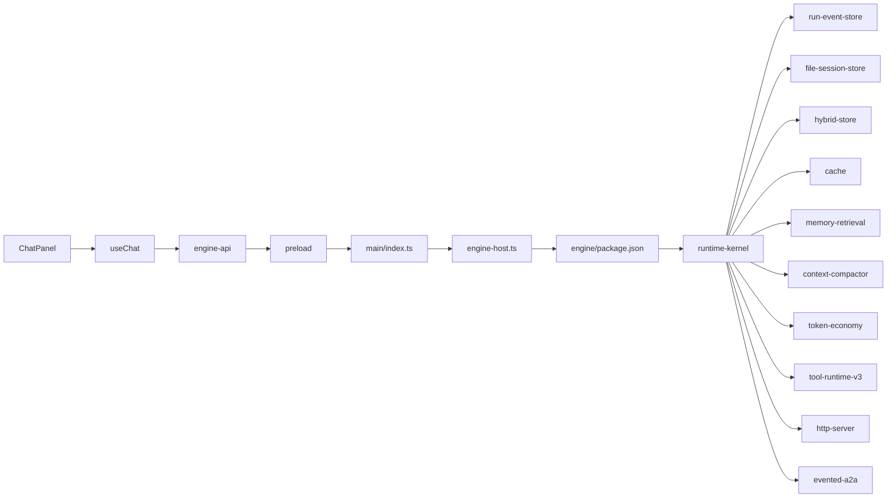

图表来源
- [app/renderer/src/components/ChatPanel/index.tsx](file://app/renderer/src/components/ChatPanel/index.tsx)
- [app/renderer/src/hooks/useChat.ts](file://app/renderer/src/hooks/useChat.ts)
- [app/renderer/src/services/engine-api.ts](file://app/renderer/src/services/engine-api.ts)
- [app/preload/index.ts](file://app/preload/index.ts)
- [app/main/index.ts](file://app/main/index.ts)
- [app/main/engine-host.ts](file://app/main/engine-host.ts)
- [engine/package.json](file://engine/package.json)
- [engine/tests/runtime-kernel.test.ts](file://engine/tests/runtime-kernel.test.ts)
- [engine/tests/run-event-store.test.ts](file://engine/tests/run-event-store.test.ts)
- [engine/tests/file-session-store.test.ts](file://engine/tests/file-session-store.test.ts)
- [engine/tests/hybrid-store.test.ts](file://engine/tests/hybrid-store.test.ts)
- [engine/tests/cache.test.ts](file://engine/tests/cache.test.ts)
- [engine/tests/memory-retrieval.test.ts](file://engine/tests/memory-retrieval.test.ts)
- [engine/tests/context-compactor.test.ts](file://engine/tests/context-compactor.test.ts)
- [engine/tests/token-economy.test.ts](file://engine/tests/token-economy.test.ts)
- [engine/tests/tool-runtime-v3.test.ts](file://engine/tests/tool-runtime-v3.test.ts)
- [engine/tests/http-server.test.ts](file://engine/tests/http-server.test.ts)
- [engine/scripts/verify-evented-a2a-script.test.ts](file://engine/scripts/verify-evented-a2a-script.test.ts)

章节来源
- [app/renderer/src/components/ChatPanel/index.tsx](file://app/renderer/src/components/ChatPanel/index.tsx)
- [app/renderer/src/hooks/useChat.ts](file://app/renderer/src/hooks/useChat.ts)
- [app/renderer/src/services/engine-api.ts](file://app/renderer/src/services/engine-api.ts)
- [app/preload/index.ts](file://app/preload/index.ts)
- [app/main/index.ts](file://app/main/index.ts)
- [app/main/engine-host.ts](file://app/main/engine-host.ts)
- [engine/package.json](file://engine/package.json)
- [engine/tests/runtime-kernel.test.ts](file://engine/tests/runtime-kernel.test.ts)
- [engine/tests/run-event-store.test.ts](file://engine/tests/run-event-store.test.ts)
- [engine/tests/file-session-store.test.ts](file://engine/tests/file-session-store.test.ts)
- [engine/tests/hybrid-store.test.ts](file://engine/tests/hybrid-store.test.ts)
- [engine/tests/cache.test.ts](file://engine/tests/cache.test.ts)
- [engine/tests/memory-retrieval.test.ts](file://engine/tests/memory-retrieval.test.ts)
- [engine/tests/context-compactor.test.ts](file://engine/tests/context-compactor.test.ts)
- [engine/tests/token-economy.test.ts](file://engine/tests/token-economy.test.ts)
- [engine/tests/tool-runtime-v3.test.ts](file://engine/tests/tool-runtime-v3.test.ts)
- [engine/tests/http-server.test.ts](file://engine/tests/http-server.test.ts)
- [engine/scripts/verify-evented-a2a-script.test.ts](file://engine/scripts/verify-evented-a2a-script.test.ts)

## 性能考虑
- 事件批处理与节流：批量合并高频事件，减少UI抖动与渲染压力。
- 流式传输：长响应采用增量事件流，提升首屏体验。
- 缓存命中率：针对检索与上下文构建进行缓存，降低重复开销。
- 压缩治理：动态调整压缩策略，平衡上下文质量与体积。
- 令牌预算：严格限制上下文与输出大小，避免超支与超时。

[本节为通用性能指导，不直接分析具体文件]

## 故障排查指南
- 事件回放：利用事件存储回放特定时间段的事件，定位状态不一致。
- 工具修复：当工具调用失败时，查看修复策略与重试日志，确认是否达到最大重试。
- 委托链路：检查子代理事件是否汇入主流程，确认事件合并是否正确。
- HTTP可观测性：通过服务端日志与指标，定位接口异常与内核错误。

章节来源
- [engine/tests/run-event-store.test.ts](file://engine/tests/run-event-store.test.ts)
- [engine/tests/tool-call-repair.test.ts](file://engine/tests/tool-call-repair.test.ts)
- [engine/tests/delegation-runtime.test.ts](file://engine/tests/delegation-runtime.test.ts)
- [engine/tests/http-server.test.ts](file://engine/tests/http-server.test.ts)

## 结论
KCoder的数据流以事件为核心，贯穿渲染端、主进程与引擎侧，实现高内聚、低耦合与可回放的状态管理。通过事件存储、会话存储与混合存储，系统在一致性与性能之间取得平衡；借助缓存、压缩与令牌经济，有效应对大数据量与高并发场景。错误处理与重试机制增强了鲁棒性，HTTP与A2A扩展提升了可集成性与可观测性。

[本节为总结性内容，不直接分析具体文件]

## 附录
- 端到端验证：参考E2E测试用例，复现典型数据流路径。
- 事件驱动A2A：参考脚本验证事件驱动的双向通信。

章节来源
- [engine/tests/runtime-kernel-e2e.test.ts](file://engine/tests/runtime-kernel-e2e.test.ts)
- [engine/scripts/verify-evented-a2a-script.test.ts](file://engine/scripts/verify-evented-a2a-script.test.ts)