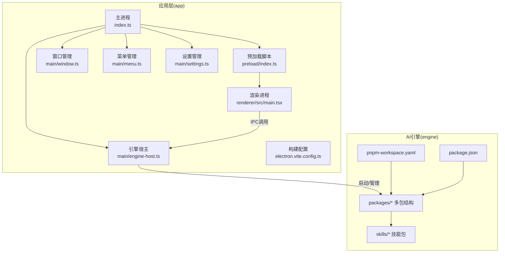
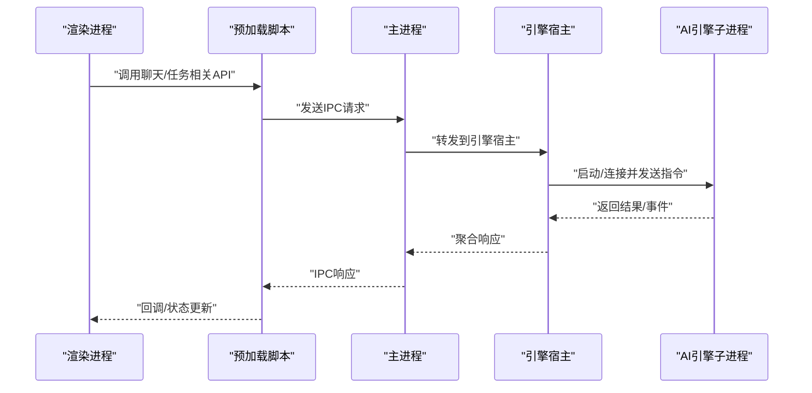
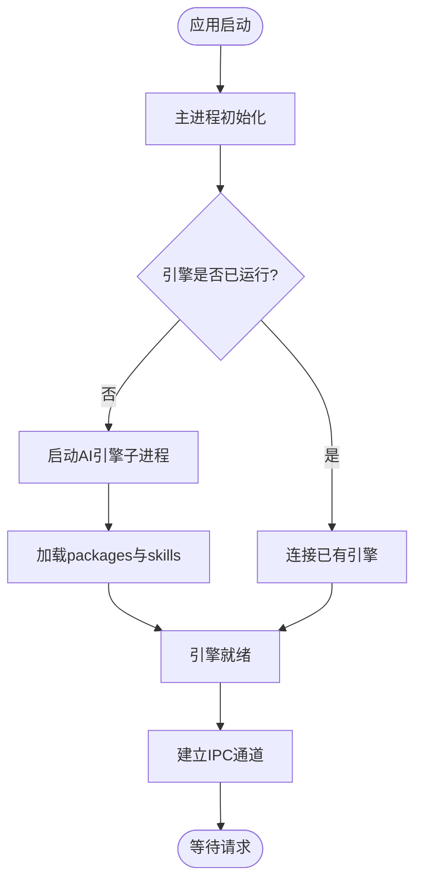
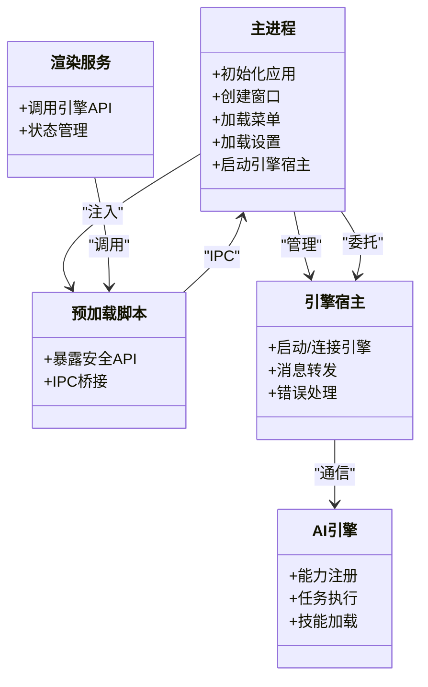
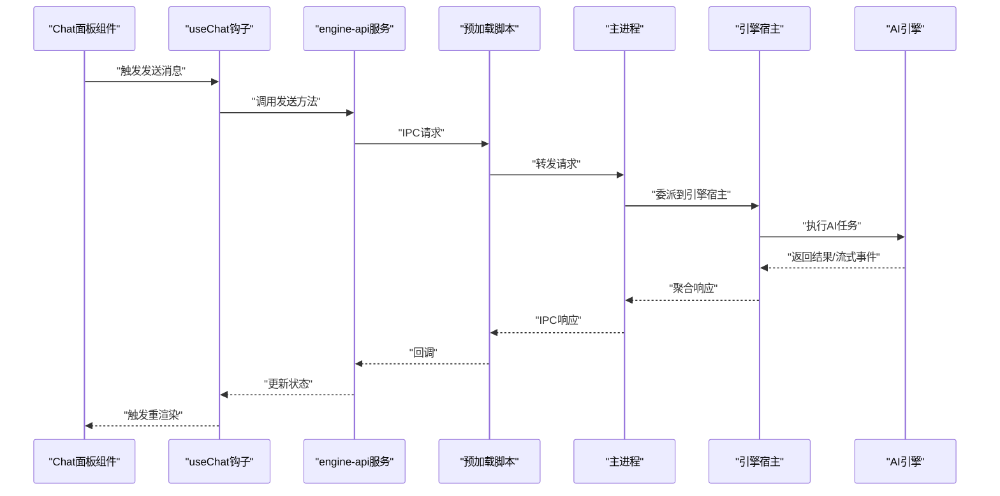
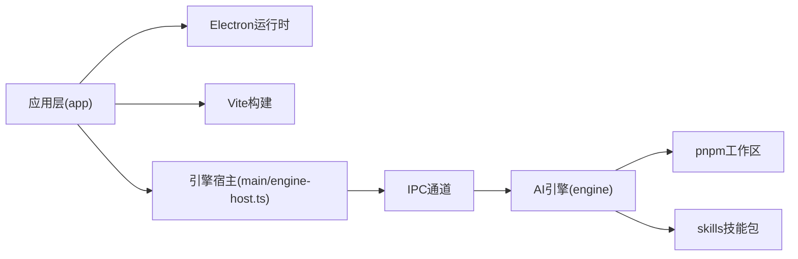

# 整体架构概览

<cite>
**本文引用的文件**   
- [app/main/index.ts](file://app/main/index.ts)
- [app/main/engine-host.ts](file://app/main/engine-host.ts)
- [app/main/window.ts](file://app/main/window.ts)
- [app/main/menu.ts](file://app/main/menu.ts)
- [app/main/settings.ts](file://app/main/settings.ts)
- [app/preload/index.ts](file://app/preload/index.ts)
- [app/renderer/src/services/engine-api.ts](file://app/renderer/src/services/engine-api.ts)
- [app/renderer/src/hooks/useChat.ts](file://app/renderer/src/hooks/useChat.ts)
- [app/renderer/src/components/ChatPanel/index.tsx](file://app/renderer/src/components/ChatPanel/index.tsx)
- [app/electron.vite.config.ts](file://app/electron.vite.config.ts)
- [engine/package.json](file://engine/package.json)
- [engine/pnpm-workspace.yaml](file://engine/pnpm-workspace.yaml)
- [engine/skills/code-review/skill.json](file://engine/skills/code-review/skill.json)
- [engine/skills/debugging/skill.json](file://engine/skills/debugging/skill.json)
</cite>

## 目录
1. [简介](#简介)
2. [项目结构](#项目结构)
3. [核心组件](#核心组件)
4. [架构总览](#架构总览)
5. [详细组件分析](#详细组件分析)
6. [依赖关系分析](#依赖关系分析)
7. [性能与可扩展性](#性能与可扩展性)
8. [故障排查指南](#故障排查指南)
9. [结论](#结论)

## 简介
本文件为KCoder系统的整体架构概览，面向工程与管理读者，帮助快速理解系统的高层设计、进程边界、通信机制以及AI引擎的启动流程。KCoder采用Electron桌面应用承载前端渲染进程，并通过主进程桥接并托管独立的AI引擎子进程；同时通过Monorepo将“应用层（app）”与“AI引擎层（engine）”解耦，形成清晰的职责边界与扩展点。

## 项目结构
仓库采用顶层Monorepo组织，包含两个主要子系统：
- app：基于Electron + Vite的前端桌面应用，包含主进程、预加载脚本与React渲染进程。
- engine：独立可复用的AI引擎，内部以packages划分领域与层次，并提供skills等能力包。



图表来源
- [app/main/index.ts](file://app/main/index.ts)
- [app/main/window.ts](file://app/main/window.ts)
- [app/main/menu.ts](file://app/main/menu.ts)
- [app/main/settings.ts](file://app/main/settings.ts)
- [app/main/engine-host.ts](file://app/main/engine-host.ts)
- [app/preload/index.ts](file://app/preload/index.ts)
- [app/electron.vite.config.ts](file://app/electron.vite.config.ts)
- [engine/pnpm-workspace.yaml](file://engine/pnpm-workspace.yaml)
- [engine/package.json](file://engine/package.json)
- [engine/skills/code-review/skill.json](file://engine/skills/code-review/skill.json)

章节来源
- [app/main/index.ts](file://app/main/index.ts)
- [app/main/engine-host.ts](file://app/main/engine-host.ts)
- [app/main/window.ts](file://app/main/window.ts)
- [app/main/menu.ts](file://app/main/menu.ts)
- [app/main/settings.ts](file://app/main/settings.ts)
- [app/preload/index.ts](file://app/preload/index.ts)
- [app/electron.vite.config.ts](file://app/electron.vite.config.ts)
- [engine/package.json](file://engine/package.json)
- [engine/pnpm-workspace.yaml](file://engine/pnpm-workspace.yaml)
- [engine/skills/code-review/skill.json](file://engine/skills/code-review/skill.json)

## 核心组件
- 主进程（App Main）
  - 负责应用生命周期、窗口创建、菜单与设置初始化，以及AI引擎进程的托管与通信桥接。
- 预加载脚本（Preload）
  - 暴露安全的API给渲染进程，屏蔽Node/Electron原生能力，仅暴露必要接口。
- 渲染进程（Renderer）
  - React UI与业务交互逻辑，通过预加载脚本调用主进程提供的能力。
- AI引擎宿主（Engine Host）
  - 在主进程中启动、管理与AI引擎子进程通信，封装IPC协议与错误处理。
- AI引擎（Engine）
  - 独立的可执行服务，提供模型路由、工具编排、会话持久化、MCP/HTTP等能力，支持插件与技能扩展。

章节来源
- [app/main/index.ts](file://app/main/index.ts)
- [app/main/engine-host.ts](file://app/main/engine-host.ts)
- [app/preload/index.ts](file://app/preload/index.ts)
- [app/renderer/src/services/engine-api.ts](file://app/renderer/src/services/engine-api.ts)
- [engine/package.json](file://engine/package.json)

## 架构总览
下图展示KCoder的整体架构与数据流向：渲染进程通过预加载脚本调用主进程暴露的API，主进程再与AI引擎子进程进行双向通信；AI引擎内部按分层与包组织，对外暴露统一的能力入口。

```mermaid
graph TB
RUI["渲染进程 UI<br/>renderer/src/main.tsx"]
Pre["预加载脚本<br/>preload/index.ts"]
Main["主进程<br/>main/index.ts"]
EH["引擎宿主<br/>main/engine-host.ts"]
Eng["AI引擎子进程<br/>engine/packages/*"]
Skills["技能包<br/>engine/skills/*"]
RUI --> |"调用安全API"| Pre
Pre --> |"IPC请求"| Main
Main --> |"转发/管理"| EH
EH <- --> |"消息协议/事件流"| Eng
Eng --> |"加载/执行"| Skills
```

图表来源
- [app/renderer/src/services/engine-api.ts](file://app/renderer/src/services/engine-api.ts)
- [app/preload/index.ts](file://app/preload/index.ts)
- [app/main/index.ts](file://app/main/index.ts)
- [app/main/engine-host.ts](file://app/main/engine-host.ts)
- [engine/package.json](file://engine/package.json)
- [engine/skills/code-review/skill.json](file://engine/skills/code-review/skill.json)

## 详细组件分析

### 主进程与渲染进程通信机制
- 渲染进程通过预加载脚本暴露的安全API发起请求，避免直接访问Node/Electron原生对象。
- 主进程集中处理IPC通道，负责参数校验、权限控制与错误归一化。
- 引擎宿主在需要时启动或复用AI引擎子进程，并将渲染侧的请求转换为引擎协议。



图表来源
- [app/renderer/src/services/engine-api.ts](file://app/renderer/src/services/engine-api.ts)
- [app/preload/index.ts](file://app/preload/index.ts)
- [app/main/index.ts](file://app/main/index.ts)
- [app/main/engine-host.ts](file://app/main/engine-host.ts)

章节来源
- [app/renderer/src/services/engine-api.ts](file://app/renderer/src/services/engine-api.ts)
- [app/preload/index.ts](file://app/preload/index.ts)
- [app/main/index.ts](file://app/main/index.ts)
- [app/main/engine-host.ts](file://app/main/engine-host.ts)

### AI引擎启动流程
- 主进程在应用就绪后，由引擎宿主负责检测/启动AI引擎子进程。
- 引擎子进程加载workspace中的packages与skills，完成能力注册与初始化。
- 主进程与引擎建立稳定的消息通道，后续所有AI相关请求均经此通道传输。



图表来源
- [app/main/engine-host.ts](file://app/main/engine-host.ts)
- [engine/package.json](file://engine/package.json)
- [engine/pnpm-workspace.yaml](file://engine/pnpm-workspace.yaml)

章节来源
- [app/main/engine-host.ts](file://app/main/engine-host.ts)
- [engine/package.json](file://engine/package.json)
- [engine/pnpm-workspace.yaml](file://engine/pnpm-workspace.yaml)

### 关键模块职责与关系
- 主进程入口：负责应用生命周期、窗口与菜单、设置与引擎宿主的装配。
- 窗口与菜单：管理应用窗口生命周期与平台菜单项。
- 设置管理：读取/写入用户偏好，影响引擎行为与UI表现。
- 预加载脚本：定义最小化的安全API契约，供渲染进程使用。
- 渲染服务：封装对引擎能力的调用，如聊天、任务管理等。
- 引擎宿主：封装与AI引擎的通信细节，包括错误重试、超时与日志。



图表来源
- [app/main/index.ts](file://app/main/index.ts)
- [app/main/window.ts](file://app/main/window.ts)
- [app/main/menu.ts](file://app/main/menu.ts)
- [app/main/settings.ts](file://app/main/settings.ts)
- [app/main/engine-host.ts](file://app/main/engine-host.ts)
- [app/preload/index.ts](file://app/preload/index.ts)
- [app/renderer/src/services/engine-api.ts](file://app/renderer/src/services/engine-api.ts)
- [engine/package.json](file://engine/package.json)

章节来源
- [app/main/index.ts](file://app/main/index.ts)
- [app/main/window.ts](file://app/main/window.ts)
- [app/main/menu.ts](file://app/main/menu.ts)
- [app/main/settings.ts](file://app/main/settings.ts)
- [app/main/engine-host.ts](file://app/main/engine-host.ts)
- [app/preload/index.ts](file://app/preload/index.ts)
- [app/renderer/src/services/engine-api.ts](file://app/renderer/src/services/engine-api.ts)
- [engine/package.json](file://engine/package.json)

### 前端组件与状态流
- Chat面板组件驱动聊天输入与消息展示。
- useChat钩子封装与引擎服务的交互，维护本地状态。
- engine-api服务统一封装IPC调用，向上层提供Promise风格接口。



图表来源
- [app/renderer/src/components/ChatPanel/index.tsx](file://app/renderer/src/components/ChatPanel/index.tsx)
- [app/renderer/src/hooks/useChat.ts](file://app/renderer/src/hooks/useChat.ts)
- [app/renderer/src/services/engine-api.ts](file://app/renderer/src/services/engine-api.ts)
- [app/preload/index.ts](file://app/preload/index.ts)
- [app/main/index.ts](file://app/main/index.ts)
- [app/main/engine-host.ts](file://app/main/engine-host.ts)

章节来源
- [app/renderer/src/components/ChatPanel/index.tsx](file://app/renderer/src/components/ChatPanel/index.tsx)
- [app/renderer/src/hooks/useChat.ts](file://app/renderer/src/hooks/useChat.ts)
- [app/renderer/src/services/engine-api.ts](file://app/renderer/src/services/engine-api.ts)

## 依赖关系分析
- 应用层依赖Electron运行时与Vite构建产物，渲染进程依赖React生态。
- 引擎层通过pnpm workspace统一管理多包，skills作为可插拔能力单元。
- 主进程与引擎之间通过IPC/子进程通信，避免共享内存与全局状态耦合。



图表来源
- [app/electron.vite.config.ts](file://app/electron.vite.config.ts)
- [app/main/engine-host.ts](file://app/main/engine-host.ts)
- [engine/pnpm-workspace.yaml](file://engine/pnpm-workspace.yaml)
- [engine/package.json](file://engine/package.json)

章节来源
- [app/electron.vite.config.ts](file://app/electron.vite.config.ts)
- [app/main/engine-host.ts](file://app/main/engine-host.ts)
- [engine/pnpm-workspace.yaml](file://engine/pnpm-workspace.yaml)
- [engine/package.json](file://engine/package.json)

## 性能与可扩展性
- 进程隔离：渲染进程与AI引擎分属不同进程，降低崩溃面与资源竞争。
- 按需加载：引擎通过workspace与skills实现能力按需启用，减少冷启动开销。
- 通信优化：主进程集中处理IPC，便于批处理、节流与缓存策略落地。
- 模块化：engine内按domain/layer拆分，便于替换实现与并行开发。

[本节为通用指导，不直接分析具体文件]

## 故障排查指南
- 渲染侧无法调用引擎API
  - 检查预加载脚本是否正确注入安全API。
  - 确认主进程IPC通道是否注册且未报错。
- 引擎未启动或频繁重启
  - 查看引擎宿主启动逻辑与错误重试策略。
  - 验证engine工作区与依赖是否完整。
- 消息丢失或乱序
  - 检查IPC序列化与反序列化一致性。
  - 确认引擎侧事件流是否具备幂等与去重机制。

章节来源
- [app/preload/index.ts](file://app/preload/index.ts)
- [app/main/index.ts](file://app/main/index.ts)
- [app/main/engine-host.ts](file://app/main/engine-host.ts)
- [engine/package.json](file://engine/package.json)

## 结论
KCoder采用“Electron桌面应用 + 独立AI引擎”的分层架构，结合Monorepo将应用与引擎解耦。主进程承担进程协调与IPC桥接职责，渲染进程专注UI与交互，AI引擎聚焦智能能力与任务编排。该设计提升了稳定性、可测试性与可扩展性，使团队可以并行迭代前端体验与AI能力，同时通过skills与工作区机制灵活扩展新能力。