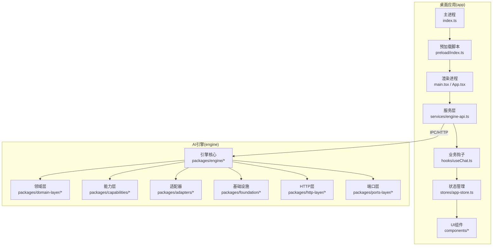
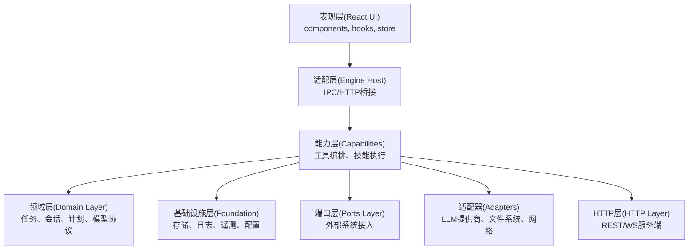
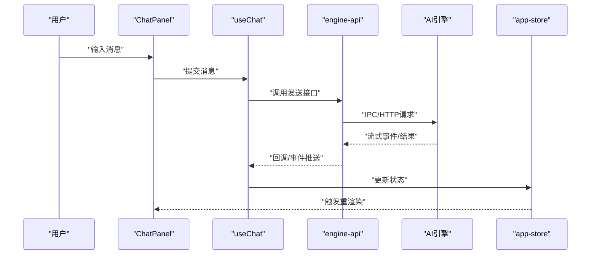
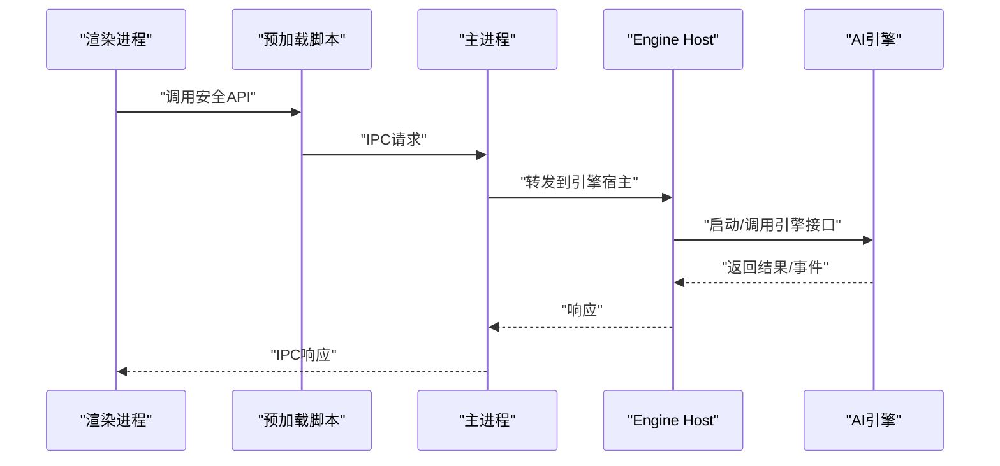
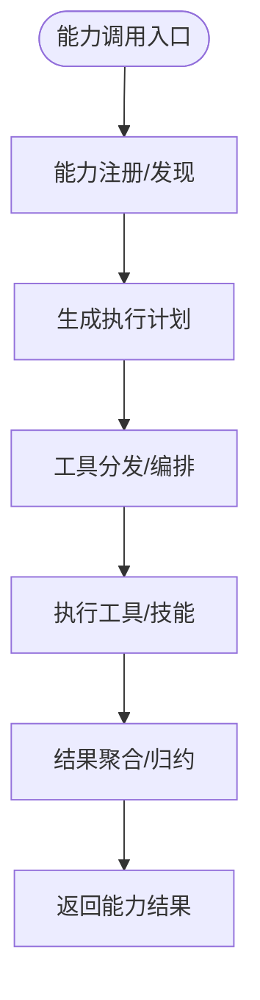
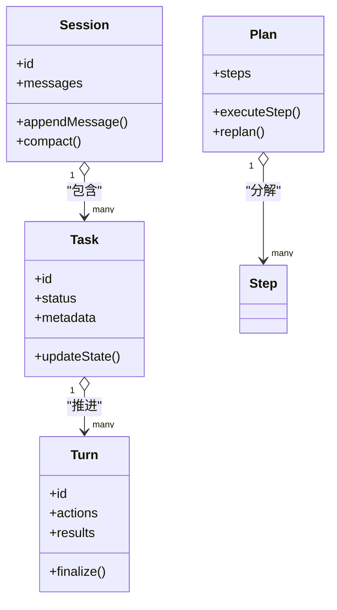
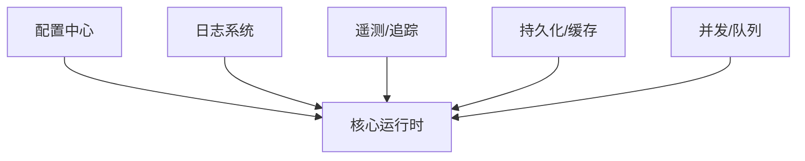
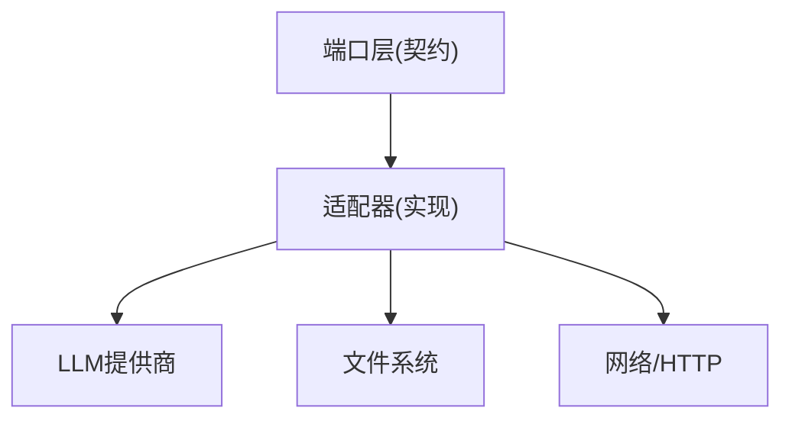
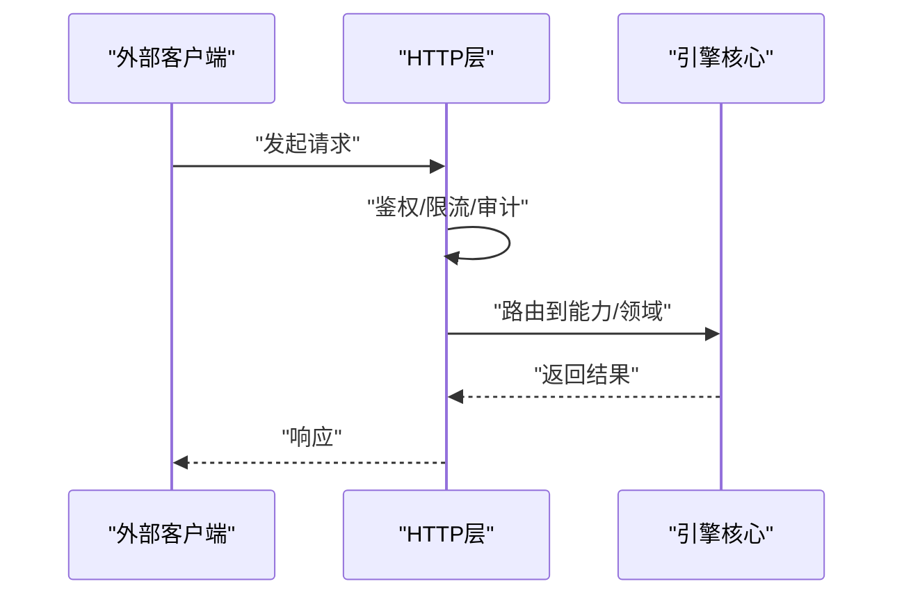
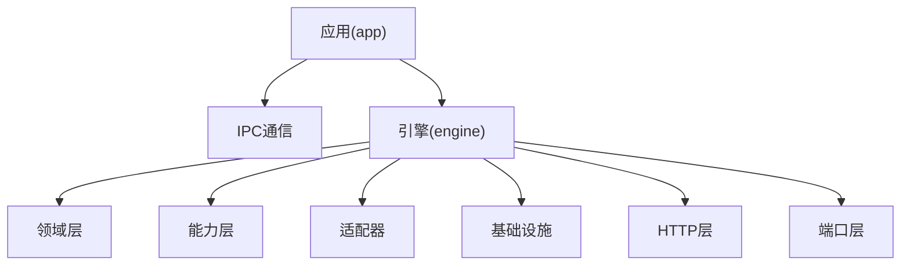

# 架构设计

<cite>
**本文引用的文件**   
- [app/main/index.ts](file://app/main/index.ts)
- [app/main/engine-host.ts](file://app/main/engine-host.ts)
- [app/main/window.ts](file://app/main/window.ts)
- [app/main/menu.ts](file://app/main/menu.ts)
- [app/main/settings.ts](file://app/main/settings.ts)
- [app/preload/index.ts](file://app/preload/index.ts)
- [app/renderer/src/main.tsx](file://app/renderer/src/main.tsx)
- [app/renderer/src/App.tsx](file://app/renderer/src/App.tsx)
- [app/renderer/src/services/engine-api.ts](file://app/renderer/src/services/engine-api.ts)
- [app/renderer/src/hooks/useChat.ts](file://app/renderer/src/hooks/useChat.ts)
- [app/renderer/src/stores/app-store.ts](file://app/renderer/src/stores/app-store.ts)
- [app/renderer/src/components/ChatPanel/index.tsx](file://app/renderer/src/components/ChatPanel/index.tsx)
- [app/renderer/src/components/ChatPanel/MessageBubble.tsx](file://app/renderer/src/components/ChatPanel/MessageBubble.tsx)
- [app/renderer/src/components/ChatPanel/ChatInput.tsx](file://app/renderer/src/components/ChatPanel/ChatInput.tsx)
- [engine/package.json](file://engine/package.json)
- [engine/Dockerfile](file://engine/Dockerfile)
- [engine/docker-compose.yml](file://engine/docker-compose.yml)
- [engine/config.example.json](file://engine/config.example.json)
</cite>

## 目录
1. [简介](#简介)
2. [项目结构](#项目结构)
3. [核心组件](#核心组件)
4. [架构总览](#架构总览)
5. [详细组件分析](#详细组件分析)
6. [依赖分析](#依赖分析)
7. [性能考虑](#性能考虑)
8. [故障排查指南](#故障排查指南)
9. [结论](#结论)
10. [附录](#附录)

## 简介
本架构文档面向KCoder系统，目标是清晰呈现高层设计与分层边界，解释表现层（React UI）、适配层（Engine Host）、能力层（Capabilities）、领域层（Domain Layer）与基础设施层（Foundation）的职责与交互。文档重点说明：
- Electron主进程与渲染进程的通信机制
- AI引擎的核心设计模式与可插拔扩展点
- 数据流、集成模式与横切关注点（安全、监控、灾难恢复）
- 技术栈、第三方依赖与版本兼容性
- 部署拓扑、可扩展性与运维要求

## 项目结构
KCoder采用多包工作区与前后端分离的Electron应用形态：
- app：Electron桌面应用，包含主进程、预加载脚本与React渲染进程
- engine：AI引擎核心，以多包形式组织，包含适配器、能力、领域、基础设施等层次

**图表来源**
- [app/main/index.ts](file://app/main/index.ts)
- [app/preload/index.ts](file://app/preload/index.ts)
- [app/renderer/src/main.tsx](file://app/renderer/src/main.tsx)
- [app/renderer/src/App.tsx](file://app/renderer/src/App.tsx)
- [app/renderer/src/services/engine-api.ts](file://app/renderer/src/services/engine-api.ts)
- [app/renderer/src/hooks/useChat.ts](file://app/renderer/src/hooks/useChat.ts)
- [app/renderer/src/stores/app-store.ts](file://app/renderer/src/stores/app-store.ts)
- [app/renderer/src/components/ChatPanel/index.tsx](file://app/renderer/src/components/ChatPanel/index.tsx)

**章节来源**
- [app/main/index.ts](file://app/main/index.ts)
- [app/preload/index.ts](file://app/preload/index.ts)
- [app/renderer/src/main.tsx](file://app/renderer/src/main.tsx)
- [app/renderer/src/App.tsx](file://app/renderer/src/App.tsx)
- [app/renderer/src/services/engine-api.ts](file://app/renderer/src/services/engine-api.ts)
- [app/renderer/src/hooks/useChat.ts](file://app/renderer/src/hooks/useChat.ts)
- [app/renderer/src/stores/app-store.ts](file://app/renderer/src/stores/app-store.ts)
- [app/renderer/src/components/ChatPanel/index.tsx](file://app/renderer/src/components/ChatPanel/index.tsx)

## 核心组件
- 主进程（App Main）
  - 负责应用生命周期、窗口管理、菜单、设置持久化以及与引擎宿主（Engine Host）的桥接
  - 关键入口与配置参考：[app/main/index.ts](file://app/main/index.ts)、[app/main/window.ts](file://app/main/window.ts)、[app/main/menu.ts](file://app/main/menu.ts)、[app/main/settings.ts](file://app/main/settings.ts)
- 预加载脚本（Preload）
  - 暴露安全的API给渲染进程，隔离Node/Electron原生能力
  - 参考：[app/preload/index.ts](file://app/preload/index.ts)
- 渲染进程（Renderer）
  - React UI与业务逻辑，通过服务层调用引擎接口
  - 参考：[app/renderer/src/main.tsx](file://app/renderer/src/main.tsx)、[app/renderer/src/App.tsx](file://app/renderer/src/App.tsx)
- 服务层（Services）
  - 封装与引擎的通信（IPC或HTTP），统一错误处理与重试策略
  - 参考：[app/renderer/src/services/engine-api.ts](file://app/renderer/src/services/engine-api.ts)
- 业务钩子（Hooks）
  - 封装聊天会话、消息发送、流式更新等业务流程
  - 参考：[app/renderer/src/hooks/useChat.ts](file://app/renderer/src/hooks/useChat.ts)
- 状态管理（Store）
  - 集中管理应用状态，驱动UI更新
  - 参考：[app/renderer/src/stores/app-store.ts](file://app/renderer/src/stores/app-store.ts)
- UI组件（Components）
  - 聊天面板、消息气泡、输入框等
  - 参考：[app/renderer/src/components/ChatPanel/index.tsx](file://app/renderer/src/components/ChatPanel/index.tsx)、[app/renderer/src/components/ChatPanel/MessageBubble.tsx](file://app/renderer/src/components/ChatPanel/MessageBubble.tsx)、[app/renderer/src/components/ChatPanel/ChatInput.tsx](file://app/renderer/src/components/ChatPanel/ChatInput.tsx)
- AI引擎（Engine）
  - 多包分层架构，包含领域、能力、适配器、基础设施、HTTP与端口层
  - 参考：[engine/package.json](file://engine/package.json)

**章节来源**
- [app/main/index.ts](file://app/main/index.ts)
- [app/main/window.ts](file://app/main/window.ts)
- [app/main/menu.ts](file://app/main/menu.ts)
- [app/main/settings.ts](file://app/main/settings.ts)
- [app/preload/index.ts](file://app/preload/index.ts)
- [app/renderer/src/main.tsx](file://app/renderer/src/main.tsx)
- [app/renderer/src/App.tsx](file://app/renderer/src/App.tsx)
- [app/renderer/src/services/engine-api.ts](file://app/renderer/src/services/engine-api.ts)
- [app/renderer/src/hooks/useChat.ts](file://app/renderer/src/hooks/useChat.ts)
- [app/renderer/src/stores/app-store.ts](file://app/renderer/src/stores/app-store.ts)
- [app/renderer/src/components/ChatPanel/index.tsx](file://app/renderer/src/components/ChatPanel/index.tsx)
- [app/renderer/src/components/ChatPanel/MessageBubble.tsx](file://app/renderer/src/components/ChatPanel/MessageBubble.tsx)
- [app/renderer/src/components/ChatPanel/ChatInput.tsx](file://app/renderer/src/components/ChatPanel/ChatInput.tsx)
- [engine/package.json](file://engine/package.json)

## 架构总览
KCoder采用分层架构与事件驱动模式，结合Electron IPC与HTTP两种通信方式，实现UI与AI引擎的解耦。

**图表来源**
- [app/renderer/src/services/engine-api.ts](file://app/renderer/src/services/engine-api.ts)
- [app/main/engine-host.ts](file://app/main/engine-host.ts)
- [engine/package.json](file://engine/package.json)

**章节来源**
- [app/renderer/src/services/engine-api.ts](file://app/renderer/src/services/engine-api.ts)
- [app/main/engine-host.ts](file://app/main/engine-host.ts)
- [engine/package.json](file://engine/package.json)

## 详细组件分析

### 表现层（React UI）
- 职责
  - 用户交互、消息展示、输入校验、状态同步
  - 通过hooks与store协调业务流程与UI更新
- 关键路径
  - 入口与根组件：[app/renderer/src/main.tsx](file://app/renderer/src/main.tsx)、[app/renderer/src/App.tsx](file://app/renderer/src/App.tsx)
  - 聊天面板与消息：[app/renderer/src/components/ChatPanel/index.tsx](file://app/renderer/src/components/ChatPanel/index.tsx)、[app/renderer/src/components/ChatPanel/MessageBubble.tsx](file://app/renderer/src/components/ChatPanel/MessageBubble.tsx)、[app/renderer/src/components/ChatPanel/ChatInput.tsx](file://app/renderer/src/components/ChatPanel/ChatInput.tsx)
  - 业务钩子：[app/renderer/src/hooks/useChat.ts](file://app/renderer/src/hooks/useChat.ts)
  - 状态管理：[app/renderer/src/stores/app-store.ts](file://app/renderer/src/stores/app-store.ts)
- 数据流
  - 用户输入 → useChat → engine-api → 引擎 → 事件回推 → store更新 → UI重绘

**图表来源**
- [app/renderer/src/components/ChatPanel/index.tsx](file://app/renderer/src/components/ChatPanel/index.tsx)
- [app/renderer/src/hooks/useChat.ts](file://app/renderer/src/hooks/useChat.ts)
- [app/renderer/src/services/engine-api.ts](file://app/renderer/src/services/engine-api.ts)
- [app/renderer/src/stores/app-store.ts](file://app/renderer/src/stores/app-store.ts)

**章节来源**
- [app/renderer/src/main.tsx](file://app/renderer/src/main.tsx)
- [app/renderer/src/App.tsx](file://app/renderer/src/App.tsx)
- [app/renderer/src/components/ChatPanel/index.tsx](file://app/renderer/src/components/ChatPanel/index.tsx)
- [app/renderer/src/components/ChatPanel/MessageBubble.tsx](file://app/renderer/src/components/ChatPanel/MessageBubble.tsx)
- [app/renderer/src/components/ChatPanel/ChatInput.tsx](file://app/renderer/src/components/ChatPanel/ChatInput.tsx)
- [app/renderer/src/hooks/useChat.ts](file://app/renderer/src/hooks/useChat.ts)
- [app/renderer/src/stores/app-store.ts](file://app/renderer/src/stores/app-store.ts)

### 适配层（Engine Host）
- 职责
  - 在Electron主进程中启动/管理AI引擎进程
  - 提供IPC通道，将渲染进程请求转发到引擎
  - 处理进程健康检查、重启与资源隔离
- 关键文件
  - 引擎宿主：[app/main/engine-host.ts](file://app/main/engine-host.ts)
  - 主进程入口：[app/main/index.ts](file://app/main/index.ts)
  - 窗口与菜单：[app/main/window.ts](file://app/main/window.ts)、[app/main/menu.ts](file://app/main/menu.ts)
  - 设置持久化：[app/main/settings.ts](file://app/main/settings.ts)
- 通信机制
  - 预加载脚本暴露受限API：[app/preload/index.ts](file://app/preload/index.ts)
  - 渲染进程通过IPC调用主进程，再由主进程转发至引擎

**图表来源**
- [app/preload/index.ts](file://app/preload/index.ts)
- [app/main/index.ts](file://app/main/index.ts)
- [app/main/engine-host.ts](file://app/main/engine-host.ts)

**章节来源**
- [app/main/engine-host.ts](file://app/main/engine-host.ts)
- [app/main/index.ts](file://app/main/index.ts)
- [app/main/window.ts](file://app/main/window.ts)
- [app/main/menu.ts](file://app/main/menu.ts)
- [app/main/settings.ts](file://app/main/settings.ts)
- [app/preload/index.ts](file://app/preload/index.ts)

### 能力层（Capabilities）
- 职责
  - 定义并编排AI能力（如代码审查、调试、规划、TDD循环等）
  - 通过技能（Skills）与工具（Tools）组合形成可复用的业务能力
- 关键位置
  - 能力包：[engine/packages/capabilities](file://engine/packages/capabilities)
  - 技能清单与描述：[engine/skills](file://engine/skills)
- 设计要点
  - 能力注册与发现
  - 工具调度与结果聚合
  - 与领域层的契约（Task、Plan、Turn等）

**图表来源**
- [engine/packages/capabilities](file://engine/packages/capabilities)
- [engine/skills](file://engine/skills)

**章节来源**
- [engine/packages/capabilities](file://engine/packages/capabilities)
- [engine/skills](file://engine/skills)

### 领域层（Domain Layer）
- 职责
  - 定义核心概念与不变式：任务、会话、回合、计划、模型协议等
  - 提供领域服务与规则校验
- 关键位置
  - 领域包：[engine/packages/domain-layer](file://engine/packages/domain-layer)
- 设计要点
  - 不可变数据与值对象
  - 事件溯源与状态机
  - 与能力层和基础设施层的解耦

**图表来源**
- [engine/packages/domain-layer](file://engine/packages/domain-layer)

**章节来源**
- [engine/packages/domain-layer](file://engine/packages/domain-layer)

### 基础设施层（Foundation）
- 职责
  - 提供通用能力：配置、日志、遥测、持久化、缓存、并发控制等
- 关键位置
  - 基础包：[engine/packages/foundation](file://engine/packages/foundation)
- 设计要点
  - 抽象接口与可替换实现
  - 可观测性（指标、追踪、审计）
  - 容错与降级

**图表来源**
- [engine/packages/foundation](file://engine/packages/foundation)

**章节来源**
- [engine/packages/foundation](file://engine/packages/foundation)

### 端口层与适配器（Ports & Adapters）
- 职责
  - 端口层定义对外接口契约；适配器层实现具体第三方系统对接（如LLM提供商、文件系统、网络）
- 关键位置
  - 端口层：[engine/packages/ports-layer](file://engine/packages/ports-layer)
  - 适配器：[engine/packages/adapters](file://engine/packages/adapters)
- 设计要点
  - 依赖倒置与可插拔
  - 协议标准化与兼容层

**图表来源**
- [engine/packages/ports-layer](file://engine/packages/ports-layer)
- [engine/packages/adapters](file://engine/packages/adapters)

**章节来源**
- [engine/packages/ports-layer](file://engine/packages/ports-layer)
- [engine/packages/adapters](file://engine/packages/adapters)

### HTTP层与服务端
- 职责
  - 提供REST/WS接口供外部系统集成与远程调用
- 关键位置
  - HTTP层：[engine/packages/http-layer](file://engine/packages/http-layer)
- 设计要点
  - 中间件链（鉴权、限流、审计）
  - 错误码与幂等性

**图表来源**
- [engine/packages/http-layer](file://engine/packages/http-layer)

**章节来源**
- [engine/packages/http-layer](file://engine/packages/http-layer)

## 依赖分析
- 应用侧依赖
  - Electron主进程与渲染进程通过IPC通信，预加载脚本作为安全边界
  - React UI使用状态管理与业务钩子进行数据流编排
- 引擎侧依赖
  - 多包工作区，按层次划分（domain、capabilities、adapters、foundation、http、ports）
  - 通过端口层与适配器实现外部依赖的可插拔

**图表来源**
- [app/main/index.ts](file://app/main/index.ts)
- [app/preload/index.ts](file://app/preload/index.ts)
- [engine/package.json](file://engine/package.json)

**章节来源**
- [app/main/index.ts](file://app/main/index.ts)
- [app/preload/index.ts](file://app/preload/index.ts)
- [engine/package.json](file://engine/package.json)

## 性能考虑
- 渲染进程优化
  - 减少不必要的重渲染，使用细粒度状态与选择器
  - 大文本与长列表虚拟化
- IPC与HTTP
  - 批量请求与合并更新
  - 流式传输与背压控制
- 引擎侧
  - 异步任务与队列隔离
  - 缓存热点数据与上下文压缩
  - 资源限制与超时熔断

## 故障排查指南
- 常见问题定位
  - IPC通信失败：检查预加载脚本暴露的API与主进程监听通道
  - 引擎进程崩溃：查看主进程健康检查与自动重启逻辑
  - 配置错误：核对引擎配置文件与默认值
- 建议步骤
  - 启用详细日志与遥测
  - 复现最小用例并收集上下文
  - 检查外部依赖（LLM提供商、文件系统权限）

**章节来源**
- [app/main/engine-host.ts](file://app/main/engine-host.ts)
- [app/main/settings.ts](file://app/main/settings.ts)
- [engine/config.example.json](file://engine/config.example.json)

## 结论
KCoder通过分层架构与事件驱动模式，实现了UI与AI引擎的松耦合与高内聚。Electron主进程作为适配层，屏蔽底层复杂性并提供稳定接口；引擎内部以领域为核心，能力为编排单元，基础设施与适配器为支撑，确保可扩展性与可维护性。结合HTTP层与端口层，系统具备良好的集成能力与生态扩展潜力。

## 附录

### 技术栈与第三方依赖
- 前端
  - React、TypeScript、Tailwind CSS
- 桌面框架
  - Electron、Vite构建
- 引擎
  - Node.js、pnpm工作区、Docker支持
- 参考
  - 应用包配置：[app/package.json](file://app/package.json)
  - 引擎包配置：[engine/package.json](file://engine/package.json)

**章节来源**
- [app/package.json](file://app/package.json)
- [engine/package.json](file://engine/package.json)

### 部署拓扑与环境要求
- 本地开发
  - 安装Node.js与pnpm，运行应用与引擎
- 容器化部署
  - 使用Docker镜像与docker-compose编排
- 参考
  - Dockerfile：[engine/Dockerfile](file://engine/Dockerfile)
  - 编排文件：[engine/docker-compose.yml](file://engine/docker-compose.yml)
  - 示例配置：[engine/config.example.json](file://engine/config.example.json)

**章节来源**
- [engine/Dockerfile](file://engine/Dockerfile)
- [engine/docker-compose.yml](file://engine/docker-compose.yml)
- [engine/config.example.json](file://engine/config.example.json)

### 安全性、监控与灾难恢复
- 安全性
  - 预加载脚本最小权限原则
  - 鉴权与访问控制（HTTP中间件）
- 监控
  - 结构化日志、指标采集与分布式追踪
- 灾难恢复
  - 进程健康检查与自动重启
  - 状态持久化与回放重建