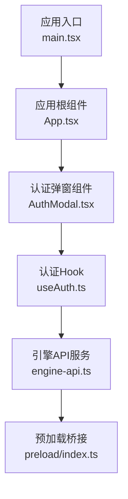
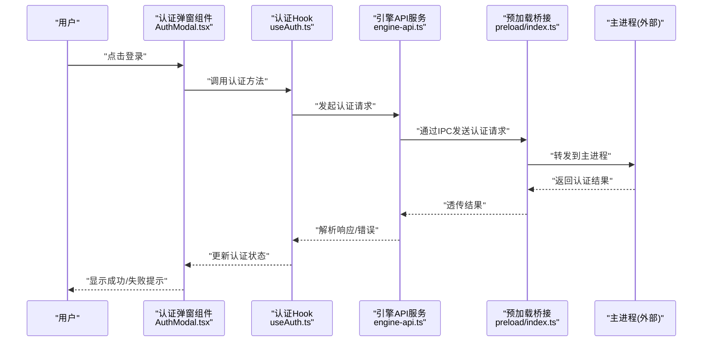
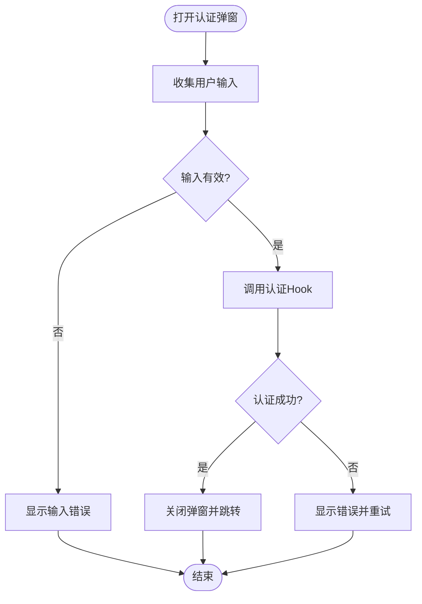
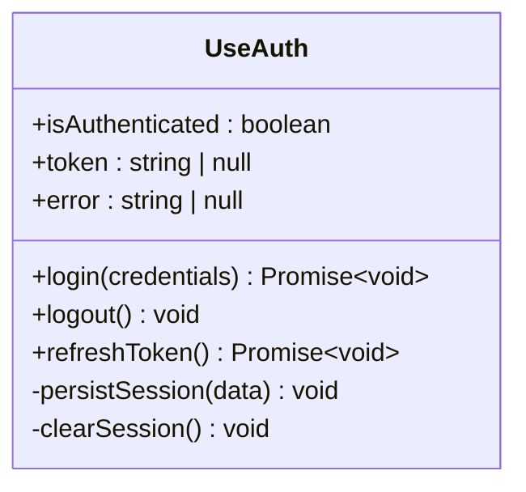
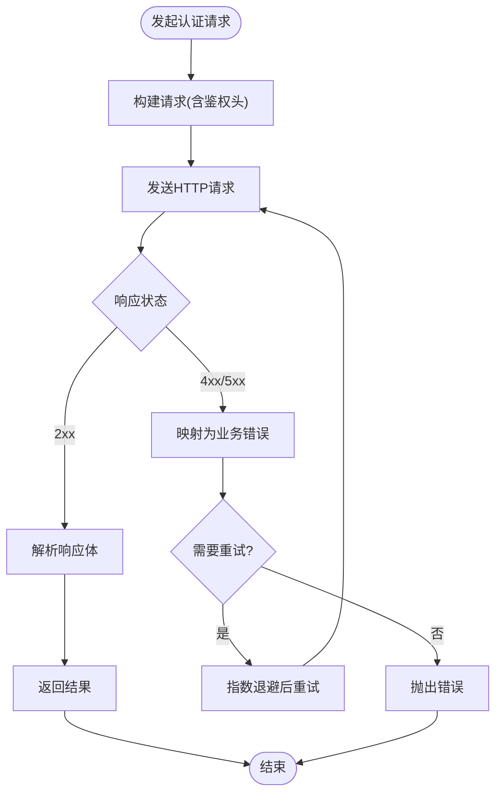
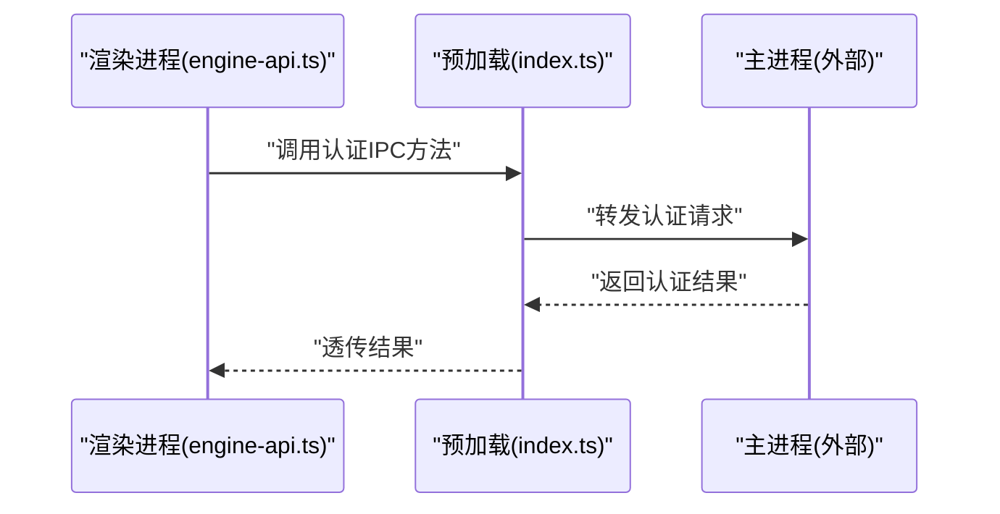
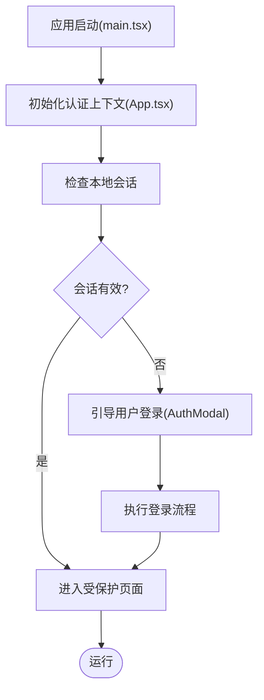
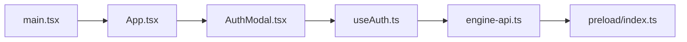

# 认证系统

<cite>
**本文引用的文件**   
- [AuthModal.tsx](file://app/renderer/src/components/AuthModal.tsx)
- [useAuth.ts](file://app/renderer/src/hooks/useAuth.ts)
- [engine-api.ts](file://app/renderer/src/services/engine-api.ts)
- [index.ts](file://app/preload/index.ts)
- [main.tsx](file://app/renderer/src/main.tsx)
- [App.tsx](file://app/renderer/src/App.tsx)
</cite>

## 目录
1. [简介](#简介)
2. [项目结构](#项目结构)
3. [核心组件](#核心组件)
4. [架构总览](#架构总览)
5. [详细组件分析](#详细组件分析)
6. [依赖分析](#依赖分析)
7. [性能考虑](#性能考虑)
8. [故障排查指南](#故障排查指南)
9. [结论](#结论)

## 简介
本文件聚焦于前端渲染进程中的“认证系统”，覆盖用户界面、状态管理、与引擎服务通信以及预加载桥接等关键环节。目标是帮助读者快速理解认证流程、数据流向、错误处理策略，并提供可操作的排障建议。

## 项目结构
认证相关代码主要位于渲染进程的前端模块中，包括：
- 认证弹窗组件：用于展示登录/授权交互
- 认证 Hook：封装认证状态与操作
- 引擎 API 服务：负责与后端引擎进行认证相关的 HTTP 调用
- 预加载脚本：暴露安全接口给渲染进程
- 应用入口与根组件：集成认证能力到整体应用中

**图表来源**
- [AuthModal.tsx](file://app/renderer/src/components/AuthModal.tsx)
- [useAuth.ts](file://app/renderer/src/hooks/useAuth.ts)
- [engine-api.ts](file://app/renderer/src/services/engine-api.ts)
- [index.ts](file://app/preload/index.ts)
- [App.tsx](file://app/renderer/src/App.tsx)
- [main.tsx](file://app/renderer/src/main.tsx)

**章节来源**
- [AuthModal.tsx](file://app/renderer/src/components/AuthModal.tsx)
- [useAuth.ts](file://app/renderer/src/hooks/useAuth.ts)
- [engine-api.ts](file://app/renderer/src/services/engine-api.ts)
- [index.ts](file://app/preload/index.ts)
- [App.tsx](file://app/renderer/src/App.tsx)
- [main.tsx](file://app/renderer/src/main.tsx)

## 核心组件
- 认证弹窗组件
  - 职责：提供登录/授权的用户交互界面，触发认证流程并展示结果或错误信息
  - 关键行为：打开/关闭弹窗、收集用户输入、调用认证 Hook 执行认证、反馈状态
- 认证 Hook
  - 职责：维护认证状态（如是否已认证、令牌、错误）、封装认证逻辑（发起请求、更新状态）
  - 关键行为：初始化检查、发起认证、刷新令牌、清理会话
- 引擎 API 服务
  - 职责：封装与引擎的认证相关 HTTP 接口（如登录、令牌校验、刷新）
  - 关键行为：构建请求头、处理响应、统一错误转换、重试策略（如有）
- 预加载桥接
  - 职责：在渲染进程与主进程之间建立安全通道，暴露受限 API
  - 关键行为：转发认证请求至主进程、返回结果或错误
- 应用集成
  - 职责：在应用启动时注入认证能力，将认证状态与全局 UI 联动
  - 关键行为：挂载认证上下文、监听认证变化、控制受保护路由/功能

**章节来源**
- [AuthModal.tsx](file://app/renderer/src/components/AuthModal.tsx)
- [useAuth.ts](file://app/renderer/src/hooks/useAuth.ts)
- [engine-api.ts](file://app/renderer/src/services/engine-api.ts)
- [index.ts](file://app/preload/index.ts)
- [App.tsx](file://app/renderer/src/App.tsx)
- [main.tsx](file://app/renderer/src/main.tsx)

## 架构总览
下图展示了从用户点击登录到完成认证的端到端流程，涵盖渲染进程、预加载桥接、引擎 API 服务及主进程之间的交互。

**图表来源**
- [AuthModal.tsx](file://app/renderer/src/components/AuthModal.tsx)
- [useAuth.ts](file://app/renderer/src/hooks/useAuth.ts)
- [engine-api.ts](file://app/renderer/src/services/engine-api.ts)
- [index.ts](file://app/preload/index.ts)

## 详细组件分析

### 认证弹窗组件（AuthModal.tsx）
- 设计要点
  - 作为受控组件，由上层状态驱动显示与内容
  - 对用户输入进行基础校验，避免无效请求
  - 与认证 Hook 解耦，仅负责触发与展示
- 交互流程
  - 打开弹窗 -> 收集凭据 -> 调用认证 Hook -> 根据返回状态更新 UI
- 错误处理
  - 捕获网络异常与服务端错误，转换为友好提示
  - 支持重试与取消操作

**图表来源**
- [AuthModal.tsx](file://app/renderer/src/components/AuthModal.tsx)
- [useAuth.ts](file://app/renderer/src/hooks/useAuth.ts)

**章节来源**
- [AuthModal.tsx](file://app/renderer/src/components/AuthModal.tsx)
- [useAuth.ts](file://app/renderer/src/hooks/useAuth.ts)

### 认证 Hook（useAuth.ts）
- 设计要点
  - 集中管理认证状态与副作用（如令牌存储、自动刷新）
  - 对外暴露统一的认证方法，屏蔽底层实现细节
- 关键方法
  - 初始化：检查本地会话/令牌有效性
  - 认证：调用引擎 API，更新状态与持久化
  - 登出：清除本地状态与会话
- 并发与幂等
  - 对重复认证请求进行去抖或合并，避免多次网络请求
  - 保证状态更新的原子性

**图表来源**
- [useAuth.ts](file://app/renderer/src/hooks/useAuth.ts)

**章节来源**
- [useAuth.ts](file://app/renderer/src/hooks/useAuth.ts)

### 引擎 API 服务（engine-api.ts）
- 设计要点
  - 统一封装认证相关 HTTP 接口（登录、令牌校验、刷新）
  - 集中处理请求拦截（添加鉴权头）、响应拦截（错误码映射）
- 错误策略
  - 区分网络错误、服务端错误与业务错误
  - 提供重试与退避策略（如指数退避）
- 扩展性
  - 以适配器模式预留不同传输层（HTTP/WebSocket）切换点

**图表来源**
- [engine-api.ts](file://app/renderer/src/services/engine-api.ts)

**章节来源**
- [engine-api.ts](file://app/renderer/src/services/engine-api.ts)

### 预加载桥接（preload/index.ts）
- 设计要点
  - 通过 IPC 暴露最小必要 API，限制渲染进程直接访问敏感能力
  - 对参数进行白名单校验，防止注入攻击
- 安全边界
  - 仅转发认证相关请求，不暴露文件系统或系统级 API
  - 记录审计日志（可选），便于追踪认证事件

**图表来源**
- [index.ts](file://app/preload/index.ts)
- [engine-api.ts](file://app/renderer/src/services/engine-api.ts)

**章节来源**
- [index.ts](file://app/preload/index.ts)

### 应用集成（App.tsx / main.tsx）
- 设计要点
  - 在应用启动阶段初始化认证上下文，确保全局可用
  - 监听认证状态变化，动态启用/禁用受保护功能
- 生命周期
  - 初始化：恢复本地会话、校验令牌有效性
  - 销毁：清理监听器与缓存

**图表来源**
- [main.tsx](file://app/renderer/src/main.tsx)
- [App.tsx](file://app/renderer/src/App.tsx)
- [AuthModal.tsx](file://app/renderer/src/components/AuthModal.tsx)

**章节来源**
- [main.tsx](file://app/renderer/src/main.tsx)
- [App.tsx](file://app/renderer/src/App.tsx)

## 依赖分析
认证系统的依赖关系如下：
- 认证弹窗组件依赖认证 Hook
- 认证 Hook 依赖引擎 API 服务
- 引擎 API 服务依赖预加载桥接
- 应用入口与根组件负责装配与生命周期管理

**图表来源**
- [AuthModal.tsx](file://app/renderer/src/components/AuthModal.tsx)
- [useAuth.ts](file://app/renderer/src/hooks/useAuth.ts)
- [engine-api.ts](file://app/renderer/src/services/engine-api.ts)
- [index.ts](file://app/preload/index.ts)
- [main.tsx](file://app/renderer/src/main.tsx)
- [App.tsx](file://app/renderer/src/App.tsx)

**章节来源**
- [AuthModal.tsx](file://app/renderer/src/components/AuthModal.tsx)
- [useAuth.ts](file://app/renderer/src/hooks/useAuth.ts)
- [engine-api.ts](file://app/renderer/src/services/engine-api.ts)
- [index.ts](file://app/preload/index.ts)
- [main.tsx](file://app/renderer/src/main.tsx)
- [App.tsx](file://app/renderer/src/App.tsx)

## 性能考虑
- 减少不必要的重渲染：在认证 Hook 中合并状态更新，避免频繁触发组件重渲染
- 请求去抖与合并：对高频认证检查进行节流，降低网络压力
- 令牌缓存与懒刷新：仅在必要时刷新令牌，避免每次请求都校验
- 错误快速失败：对不可恢复错误立即返回，避免长时间阻塞用户操作

[本节为通用指导，无需特定文件引用]

## 故障排查指南
- 常见问题
  - 登录失败：检查网络连通性与服务端状态；查看引擎 API 的错误映射
  - 令牌过期：确认刷新令牌逻辑是否生效；检查本地会话是否被意外清除
  - 弹窗无法关闭：验证认证 Hook 的状态更新是否被执行
- 定位步骤
  - 在认证 Hook 中添加日志输出，跟踪状态变更与方法调用链
  - 使用浏览器开发者工具监控网络请求，确认请求头与响应体
  - 检查预加载桥接的 IPC 调用是否被正确转发
- 恢复策略
  - 提供“重新登录”入口，允许用户主动清理会话并重新认证
  - 对临时性错误实施有限次数的自动重试

**章节来源**
- [useAuth.ts](file://app/renderer/src/hooks/useAuth.ts)
- [engine-api.ts](file://app/renderer/src/services/engine-api.ts)
- [index.ts](file://app/preload/index.ts)

## 结论
本认证系统采用分层设计，将 UI、状态管理与网络通信清晰分离，具备良好的可维护性与可扩展性。通过预加载桥接保障安全性，结合合理的错误处理与性能优化策略，能够在复杂环境中稳定运行。建议在后续迭代中完善审计日志、增强令牌安全策略，并补充端到端测试用例以提升可靠性。