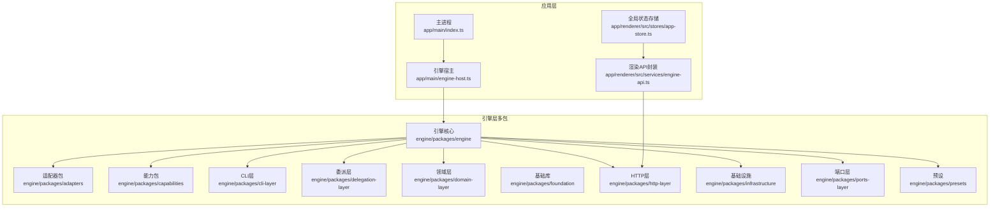
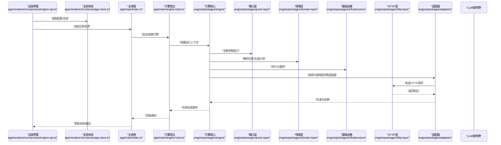
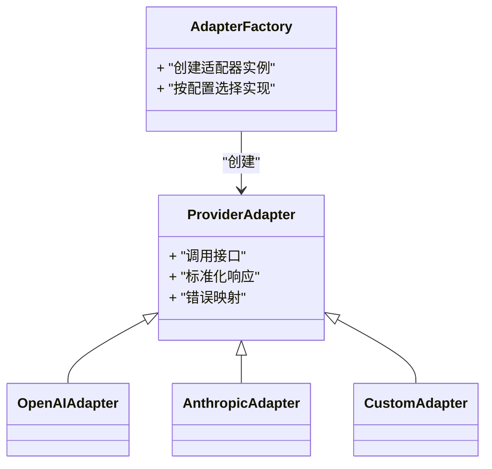
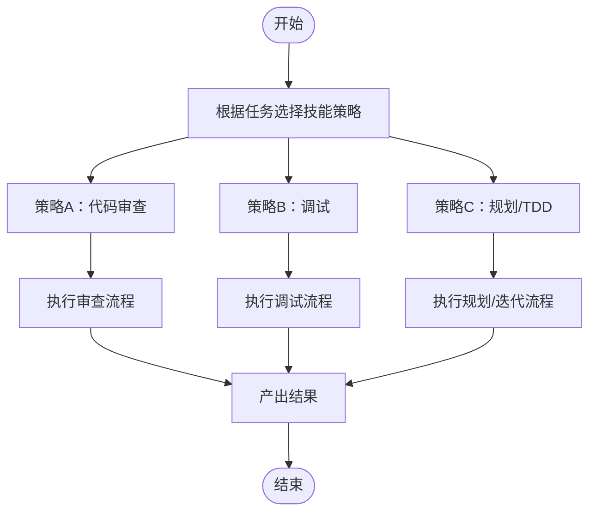
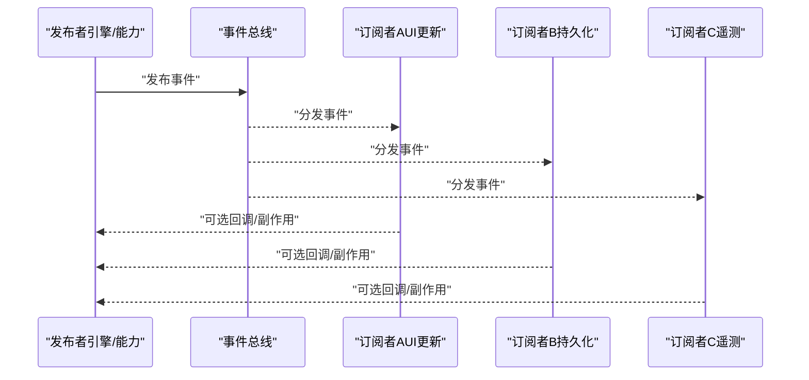
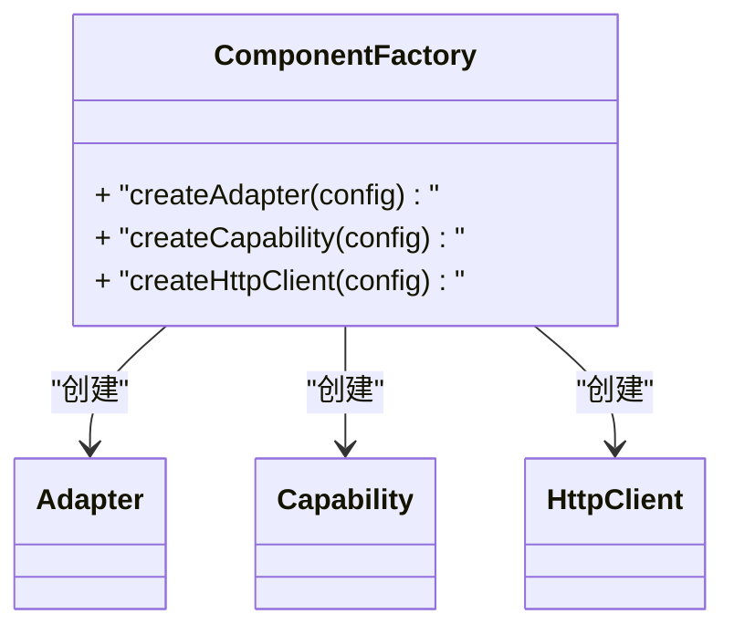
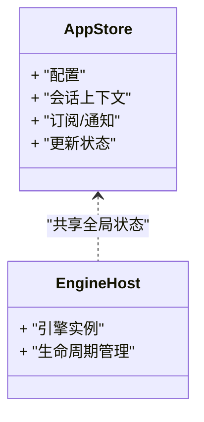
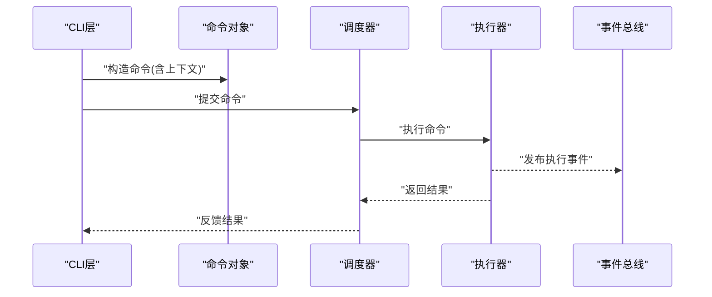
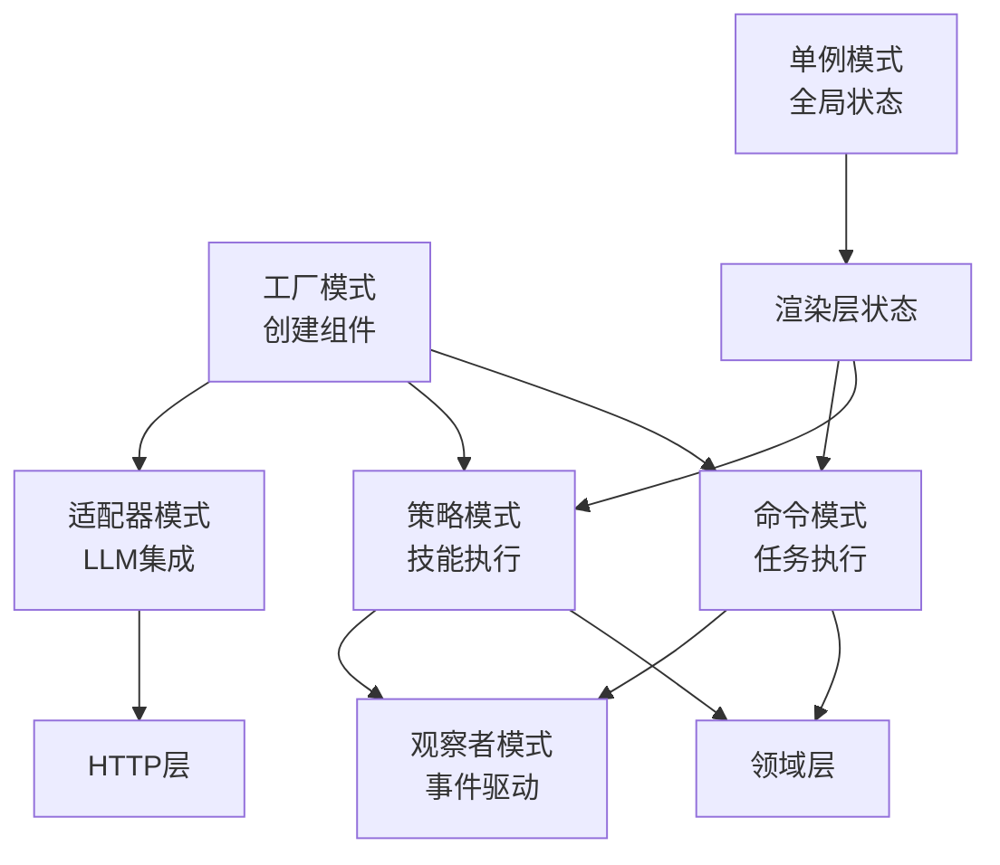
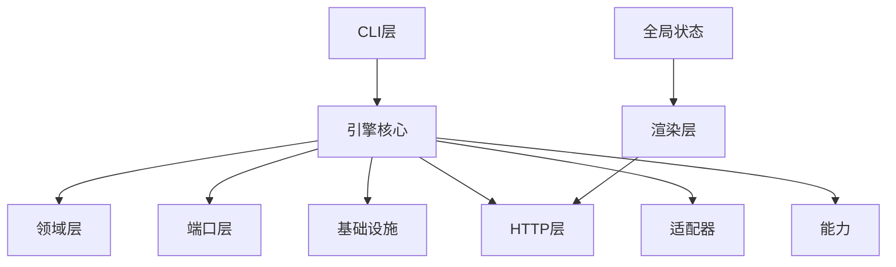

# 设计模式应用

<cite>
**本文引用的文件**   
- [engine/README.md](file://engine/README.md)
- [engine/package.json](file://engine/package.json)
- [engine/pnpm-workspace.yaml](file://engine/pnpm-workspace.yaml)
- [app/main/index.ts](file://app/main/index.ts)
- [app/main/engine-host.ts](file://app/main/engine-host.ts)
- [app/renderer/src/services/engine-api.ts](file://app/renderer/src/services/engine-api.ts)
- [app/renderer/src/stores/app-store.ts](file://app/renderer/src/stores/app-store.ts)
- [engine/packages/adapters/README.md](file://engine/packages/adapters/README.md)
- [engine/packages/capabilities/README.md](file://engine/packages/capabilities/README.md)
- [engine/packages/cli-layer/README.md](file://engine/packages/cli-layer/README.md)
- [engine/packages/delegation-layer/README.md](file://engine/packages/delegation-layer/README.md)
- [engine/packages/domain-layer/README.md](file://engine/packages/domain-layer/README.md)
- [engine/packages/engine/README.md](file://engine/packages/engine/README.md)
- [engine/packages/foundation/README.md](file://engine/packages/foundation/README.md)
- [engine/packages/http-layer/README.md](file://engine/packages/http-layer/README.md)
- [engine/packages/infrastructure/README.md](file://engine/packages/infrastructure/README.md)
- [engine/packages/ports-layer/README.md](file://engine/packages/ports-layer/README.md)
- [engine/packages/presets/README.md](file://engine/packages/presets/README.md)
</cite>

## 目录
1. [简介](#简介)
2. [项目结构](#项目结构)
3. [核心组件](#核心组件)
4. [架构总览](#架构总览)
5. [详细组件分析](#详细组件分析)
6. [依赖分析](#依赖分析)
7. [性能考虑](#性能考虑)
8. [故障排查指南](#故障排查指南)
9. [结论](#结论)
10. [附录](#附录)

## 简介
本文件聚焦于KCoder系统在设计模式层面的工程实践，围绕以下关键模式展开：适配器模式（LLM提供商集成）、策略模式（技能执行策略）、观察者模式（事件驱动通信）、工厂模式（组件创建）、单例模式（全局状态管理）、命令模式（任务执行）。文档旨在帮助读者理解这些模式在系统中的实现方式、使用场景与收益，并通过图示和代码片段路径展示其协同工作方式。同时提供权衡分析与替代方案，便于在演进中做出更合适的技术决策。

## 项目结构
KCoder采用多包工作区组织，引擎端以分层与模块化为核心，前端基于Electron+React构建。整体结构如下：
- 引擎端（engine）：按能力域划分为多个packages，包括adapters、capabilities、cli-layer、delegation-layer、domain-layer、engine、foundation、http-layer、infrastructure、ports-layer、presets等。
- 应用端（app）：包含主进程（main）、预加载（preload）、渲染进程（renderer），以及构建配置与样式工具链。

图表来源
- [engine/README.md](file://engine/README.md)
- [engine/package.json](file://engine/package.json)
- [engine/pnpm-workspace.yaml](file://engine/pnpm-workspace.yaml)
- [app/main/index.ts](file://app/main/index.ts)
- [app/main/engine-host.ts](file://app/main/engine-host.ts)
- [app/renderer/src/services/engine-api.ts](file://app/renderer/src/services/engine-api.ts)
- [app/renderer/src/stores/app-store.ts](file://app/renderer/src/stores/app-store.ts)

章节来源
- [engine/README.md](file://engine/README.md)
- [engine/package.json](file://engine/package.json)
- [engine/pnpm-workspace.yaml](file://engine/pnpm-workspace.yaml)
- [app/main/index.ts](file://app/main/index.ts)
- [app/main/engine-host.ts](file://app/main/engine-host.ts)
- [app/renderer/src/services/engine-api.ts](file://app/renderer/src/services/engine-api.ts)
- [app/renderer/src/stores/app-store.ts](file://app/renderer/src/stores/app-store.ts)

## 核心组件
本节概述各包职责与协作关系，为后续设计模式分析奠定基础：
- adapters：面向不同LLM提供商的适配实现，统一对外接口。
- capabilities：可插拔的能力模块，定义能力契约与注册机制。
- cli-layer：命令行入口与参数解析，编排调用引擎。
- delegation-layer：子代理委派与协调。
- domain-layer：领域模型与业务规则。
- engine：运行时内核，调度能力、工具、会话与持久化。
- foundation：通用基础库（日志、错误、配置等）。
- http-layer：HTTP服务与传输抽象。
- infrastructure：外部系统集成（文件系统、数据库、缓存等）。
- ports-layer：对外暴露的端口与协议。
- presets：常用配置与模板。

章节来源
- [engine/packages/adapters/README.md](file://engine/packages/adapters/README.md)
- [engine/packages/capabilities/README.md](file://engine/packages/capabilities/README.md)
- [engine/packages/cli-layer/README.md](file://engine/packages/cli-layer/README.md)
- [engine/packages/delegation-layer/README.md](file://engine/packages/delegation-layer/README.md)
- [engine/packages/domain-layer/README.md](file://engine/packages/domain-layer/README.md)
- [engine/packages/engine/README.md](file://engine/packages/engine/README.md)
- [engine/packages/foundation/README.md](file://engine/packages/foundation/README.md)
- [engine/packages/http-layer/README.md](file://engine/packages/http-layer/README.md)
- [engine/packages/infrastructure/README.md](file://engine/packages/infrastructure/README.md)
- [engine/packages/ports-layer/README.md](file://engine/packages/ports-layer/README.md)
- [engine/packages/presets/README.md](file://engine/packages/presets/README.md)

## 架构总览
下图展示了从前端到引擎再到LLM提供商的整体交互流程，体现适配器、策略、观察者、工厂、单例与命令模式的协作点。

图表来源
- [app/renderer/src/services/engine-api.ts](file://app/renderer/src/services/engine-api.ts)
- [app/renderer/src/stores/app-store.ts](file://app/renderer/src/stores/app-store.ts)
- [app/main/index.ts](file://app/main/index.ts)
- [app/main/engine-host.ts](file://app/main/engine-host.ts)
- [engine/packages/engine/README.md](file://engine/packages/engine/README.md)
- [engine/packages/ports-layer/README.md](file://engine/packages/ports-layer/README.md)
- [engine/packages/domain-layer/README.md](file://engine/packages/domain-layer/README.md)
- [engine/packages/infrastructure/README.md](file://engine/packages/infrastructure/README.md)
- [engine/packages/http-layer/README.md](file://engine/packages/http-layer/README.md)
- [engine/packages/adapters/README.md](file://engine/packages/adapters/README.md)

## 详细组件分析

### 适配器模式（LLM提供商集成）
- 实现方式
  - 通过统一的适配器接口屏蔽不同LLM提供商的差异，将具体实现隔离在adapters包内。
  - 由引擎或HTTP层根据配置选择具体适配器实例，进行请求构造与响应标准化。
- 使用场景
  - 新增第三方LLM时，仅需实现适配器而不改动上层逻辑。
  - 对同一提供商的不同版本或不同接入点进行兼容。
- 带来的好处
  - 解耦上游调用方与下游提供商差异，提升可测试性与可替换性。
  - 集中处理鉴权、重试、限流、错误映射等横切关注点。
- 代码示例路径
  - [engine/packages/adapters/README.md](file://engine/packages/adapters/README.md)
  - [engine/packages/http-layer/README.md](file://engine/packages/http-layer/README.md)

图表来源
- [engine/packages/adapters/README.md](file://engine/packages/adapters/README.md)
- [engine/packages/http-layer/README.md](file://engine/packages/http-layer/README.md)

章节来源
- [engine/packages/adapters/README.md](file://engine/packages/adapters/README.md)
- [engine/packages/http-layer/README.md](file://engine/packages/http-layer/README.md)

### 策略模式（技能执行策略）
- 实现方式
  - 将“技能”的执行逻辑抽象为策略接口，不同技能（如代码审查、调试、规划、TDD等）各自实现策略。
  - 引擎根据任务类型或用户选择动态切换策略，执行相应流程。
- 使用场景
  - 多种工作流并行存在且可能扩展新流程时。
  - 需要按上下文条件（如项目规模、语言、风险等级）选择最优策略。
- 带来的好处
  - 开放封闭原则：新增技能无需修改现有调度逻辑。
  - 提高复用度与可测试性，策略可独立验证与替换。
- 代码示例路径
  - [engine/packages/capabilities/README.md](file://engine/packages/capabilities/README.md)
  - [engine/skills/code-review/skill.json](file://engine/skills/code-review/skill.json)
  - [engine/skills/debugging/skill.json](file://engine/skills/debugging/skill.json)
  - [engine/skills/planning/skill.json](file://engine/skills/planning/skill.json)
  - [engine/skills/tdd/skill.json](file://engine/skills/tdd/skill.json)

图表来源
- [engine/packages/capabilities/README.md](file://engine/packages/capabilities/README.md)
- [engine/skills/code-review/skill.json](file://engine/skills/code-review/skill.json)
- [engine/skills/debugging/skill.json](file://engine/skills/debugging/skill.json)
- [engine/skills/planning/skill.json](file://engine/skills/planning/skill.json)
- [engine/skills/tdd/skill.json](file://engine/skills/tdd/skill.json)

章节来源
- [engine/packages/capabilities/README.md](file://engine/packages/capabilities/README.md)
- [engine/skills/code-review/skill.json](file://engine/skills/code-review/skill.json)
- [engine/skills/debugging/skill.json](file://engine/skills/debugging/skill.json)
- [engine/skills/planning/skill.json](file://engine/skills/planning/skill.json)
- [engine/skills/tdd/skill.json](file://engine/skills/tdd/skill.json)

### 观察者模式（事件驱动通信）
- 实现方式
  - 在引擎或端口层定义事件总线/发布订阅机制，组件间通过事件进行松耦合通信。
  - 典型事件包括任务进度、状态变更、错误上报、遥测指标等。
- 使用场景
  - 跨进程/跨模块的状态同步与通知。
  - 异步流水线中的阶段推进与回滚触发。
- 带来的好处
  - 降低耦合度，提升可扩展性与可观测性。
  - 支持多订阅者监听同一事件，便于审计、监控与回放。
- 代码示例路径
  - [engine/packages/engine/README.md](file://engine/packages/engine/README.md)
  - [engine/packages/ports-layer/README.md](file://engine/packages/ports-layer/README.md)

图表来源
- [engine/packages/engine/README.md](file://engine/packages/engine/README.md)
- [engine/packages/ports-layer/README.md](file://engine/packages/ports-layer/README.md)

章节来源
- [engine/packages/engine/README.md](file://engine/packages/engine/README.md)
- [engine/packages/ports-layer/README.md](file://engine/packages/ports-layer/README.md)

### 工厂模式（组件创建）
- 实现方式
  - 通过工厂方法或类工厂集中创建复杂对象（如适配器、能力、中间件、HTTP客户端等），隐藏构造细节。
  - 结合配置或运行时上下文决定具体实现。
- 使用场景
  - 组件生命周期管理、依赖注入、按需加载。
  - 单元测试中用Mock工厂替换真实实现。
- 带来的好处
  - 统一创建入口，便于追踪与治理。
  - 降低耦合，提升可测试性与可维护性。
- 代码示例路径
  - [engine/packages/engine/README.md](file://engine/packages/engine/README.md)
  - [engine/packages/foundation/README.md](file://engine/packages/foundation/README.md)

图表来源
- [engine/packages/engine/README.md](file://engine/packages/engine/README.md)
- [engine/packages/foundation/README.md](file://engine/packages/foundation/README.md)

章节来源
- [engine/packages/engine/README.md](file://engine/packages/engine/README.md)
- [engine/packages/foundation/README.md](file://engine/packages/foundation/README.md)

### 单例模式（全局状态管理）
- 实现方式
  - 在渲染层使用单一状态源（如全局store），确保UI与业务逻辑共享一致状态。
  - 在主进程侧也可使用单例管理引擎实例或资源池。
- 使用场景
  - 全局配置、用户偏好、会话上下文、引擎句柄等。
- 带来的好处
  - 避免重复初始化，保证一致性。
  - 简化跨组件数据访问。
- 代码示例路径
  - [app/renderer/src/stores/app-store.ts](file://app/renderer/src/stores/app-store.ts)
  - [app/main/engine-host.ts](file://app/main/engine-host.ts)

图表来源
- [app/renderer/src/stores/app-store.ts](file://app/renderer/src/stores/app-store.ts)
- [app/main/engine-host.ts](file://app/main/engine-host.ts)

章节来源
- [app/renderer/src/stores/app-store.ts](file://app/renderer/src/stores/app-store.ts)
- [app/main/engine-host.ts](file://app/main/engine-host.ts)

### 命令模式（任务执行）
- 实现方式
  - 将“任务”抽象为命令对象，包含执行所需的全部上下文；由调度器或CLI层负责执行与撤销/重做。
  - 命令可与事件总线结合，记录执行轨迹用于审计与回放。
- 使用场景
  - 批量操作、事务性任务、可撤销编辑、远程任务编排。
- 带来的好处
  - 增强可组合性与可测试性，便于记录与恢复。
  - 清晰分离请求发起者与执行者。
- 代码示例路径
  - [engine/packages/cli-layer/README.md](file://engine/packages/cli-layer/README.md)
  - [engine/packages/engine/README.md](file://engine/packages/engine/README.md)

图表来源
- [engine/packages/cli-layer/README.md](file://engine/packages/cli-layer/README.md)
- [engine/packages/engine/README.md](file://engine/packages/engine/README.md)

章节来源
- [engine/packages/cli-layer/README.md](file://engine/packages/cli-layer/README.md)
- [engine/packages/engine/README.md](file://engine/packages/engine/README.md)

### 模式协同工作图
下图展示六大模式如何协同构建灵活可扩展的系统：

图表来源
- [engine/packages/engine/README.md](file://engine/packages/engine/README.md)
- [engine/packages/adapters/README.md](file://engine/packages/adapters/README.md)
- [engine/packages/capabilities/README.md](file://engine/packages/capabilities/README.md)
- [engine/packages/cli-layer/README.md](file://engine/packages/cli-layer/README.md)
- [engine/packages/domain-layer/README.md](file://engine/packages/domain-layer/README.md)
- [engine/packages/http-layer/README.md](file://engine/packages/http-layer/README.md)
- [app/renderer/src/stores/app-store.ts](file://app/renderer/src/stores/app-store.ts)

## 依赖分析
- 包级依赖关系
  - 引擎核心依赖领域层、端口层、基础设施与HTTP层。
  - 适配器与能力模块通过端口层与引擎交互，保持低耦合。
  - CLI层作为入口，编排命令与能力。
- 直接/间接依赖
  - 渲染层通过HTTP层与引擎通信，间接依赖适配器与能力。
  - 全局状态（单例）被UI与命令执行链路共同消费。
- 潜在循环依赖
  - 应确保能力与适配器不反向依赖引擎核心，避免环状依赖。
- 外部依赖与集成点
  - HTTP层对接网络IO；基础设施对接文件系统与数据库；适配器对接外部LLM服务。
- 接口契约与实现细节
  - 端口层定义稳定契约，具体实现位于各包内部，遵循开闭原则。

图表来源
- [engine/packages/engine/README.md](file://engine/packages/engine/README.md)
- [engine/packages/ports-layer/README.md](file://engine/packages/ports-layer/README.md)
- [engine/packages/domain-layer/README.md](file://engine/packages/domain-layer/README.md)
- [engine/packages/infrastructure/README.md](file://engine/packages/infrastructure/README.md)
- [engine/packages/http-layer/README.md](file://engine/packages/http-layer/README.md)
- [engine/packages/adapters/README.md](file://engine/packages/adapters/README.md)
- [engine/packages/capabilities/README.md](file://engine/packages/capabilities/README.md)
- [engine/packages/cli-layer/README.md](file://engine/packages/cli-layer/README.md)
- [app/renderer/src/services/engine-api.ts](file://app/renderer/src/services/engine-api.ts)
- [app/renderer/src/stores/app-store.ts](file://app/renderer/src/stores/app-store.ts)

章节来源
- [engine/packages/engine/README.md](file://engine/packages/engine/README.md)
- [engine/packages/ports-layer/README.md](file://engine/packages/ports-layer/README.md)
- [engine/packages/domain-layer/README.md](file://engine/packages/domain-layer/README.md)
- [engine/packages/infrastructure/README.md](file://engine/packages/infrastructure/README.md)
- [engine/packages/http-layer/README.md](file://engine/packages/http-layer/README.md)
- [engine/packages/adapters/README.md](file://engine/packages/adapters/README.md)
- [engine/packages/capabilities/README.md](file://engine/packages/capabilities/README.md)
- [engine/packages/cli-layer/README.md](file://engine/packages/cli-layer/README.md)
- [app/renderer/src/services/engine-api.ts](file://app/renderer/src/services/engine-api.ts)
- [app/renderer/src/stores/app-store.ts](file://app/renderer/src/stores/app-store.ts)

## 性能考虑
- 适配器层
  - 合理设置超时与重试策略，避免雪崩；对大响应进行流式处理。
- 策略层
  - 对耗时策略启用并发控制与熔断降级；缓存热点结果。
- 观察者层
  - 事件批处理与去抖，避免高频事件导致UI卡顿。
- 工厂层
  - 对象池复用昂贵资源（如HTTP客户端、连接池）。
- 单例层
  - 避免在单例中持有大量瞬时数据，必要时分片或惰性加载。
- 命令层
  - 批量命令合并执行，减少I/O与序列化开销。

[本节为通用指导，不涉及具体文件分析]

## 故障排查指南
- 常见问题定位
  - 适配器异常：检查HTTP层日志与错误映射，确认鉴权与限流配置。
  - 策略执行失败：核对能力注册与选择逻辑，查看事件总线是否收到错误事件。
  - 命令执行中断：检查命令上下文完整性与调度器队列状态。
  - 全局状态不一致：确认单例更新路径与订阅者通知顺序。
- 建议的排障手段
  - 开启遥测与审计事件，回放关键步骤。
  - 使用工厂注入Mock实现，隔离外部依赖。
  - 对关键路径添加断言与快照对比。

章节来源
- [engine/packages/engine/README.md](file://engine/packages/engine/README.md)
- [engine/packages/http-layer/README.md](file://engine/packages/http-layer/README.md)
- [engine/packages/ports-layer/README.md](file://engine/packages/ports-layer/README.md)

## 结论
通过适配器、策略、观察者、工厂、单例与命令模式的系统化应用，KCoder实现了高内聚、低耦合、易扩展的架构。各模式在不同层次各司其职，并在关键交互点协同工作，既保证了系统的稳定性与可观测性，也为未来引入新的LLM提供商、技能与工作流提供了良好基础。在实际演进中，应持续关注模式选择的权衡与替代方案，确保架构随需求增长而稳健演化。

[本节为总结性内容，不涉及具体文件分析]

## 附录
- 相关文件索引
  - 引擎说明与包清单：[engine/README.md](file://engine/README.md)、[engine/package.json](file://engine/package.json)、[engine/pnpm-workspace.yaml](file://engine/pnpm-workspace.yaml)
  - 应用入口与宿主：[app/main/index.ts](file://app/main/index.ts)、[app/main/engine-host.ts](file://app/main/engine-host.ts)
  - 渲染API与状态：[app/renderer/src/services/engine-api.ts](file://app/renderer/src/services/engine-api.ts)、[app/renderer/src/stores/app-store.ts](file://app/renderer/src/stores/app-store.ts)
  - 适配器与能力：[engine/packages/adapters/README.md](file://engine/packages/adapters/README.md)、[engine/packages/capabilities/README.md](file://engine/packages/capabilities/README.md)
  - CLI与委派：[engine/packages/cli-layer/README.md](file://engine/packages/cli-layer/README.md)、[engine/packages/delegation-layer/README.md](file://engine/packages/delegation-layer/README.md)
  - 领域与端口：[engine/packages/domain-layer/README.md](file://engine/packages/domain-layer/README.md)、[engine/packages/ports-layer/README.md](file://engine/packages/ports-layer/README.md)
  - 引擎与基础：[engine/packages/engine/README.md](file://engine/packages/engine/README.md)、[engine/packages/foundation/README.md](file://engine/packages/foundation/README.md)
  - HTTP与基础设施：[engine/packages/http-layer/README.md](file://engine/packages/http-layer/README.md)、[engine/packages/infrastructure/README.md](file://engine/packages/infrastructure/README.md)
  - 预设：[engine/packages/presets/README.md](file://engine/packages/presets/README.md)

[本节为索引信息，不涉及具体文件分析]