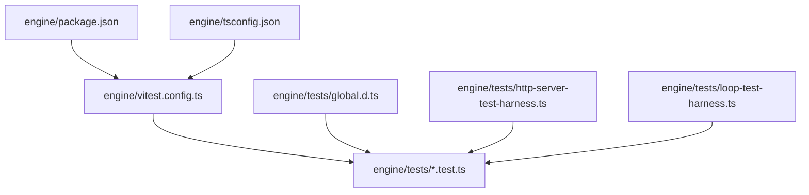
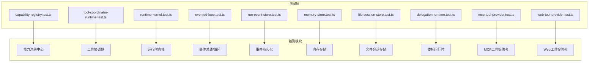
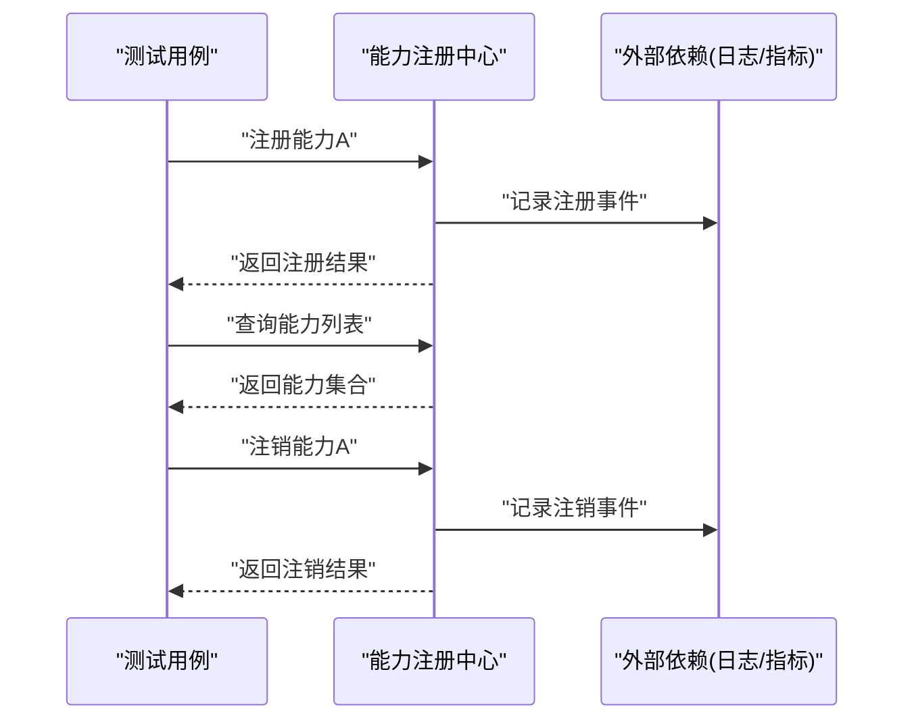
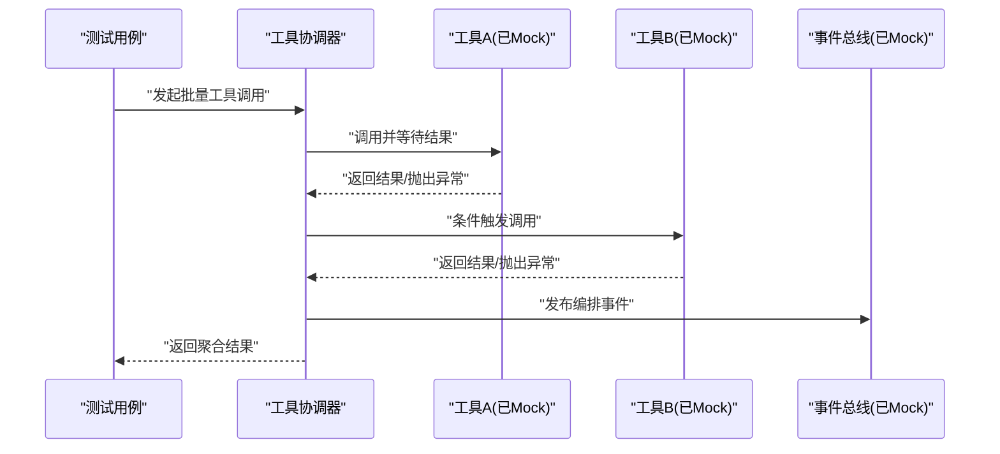
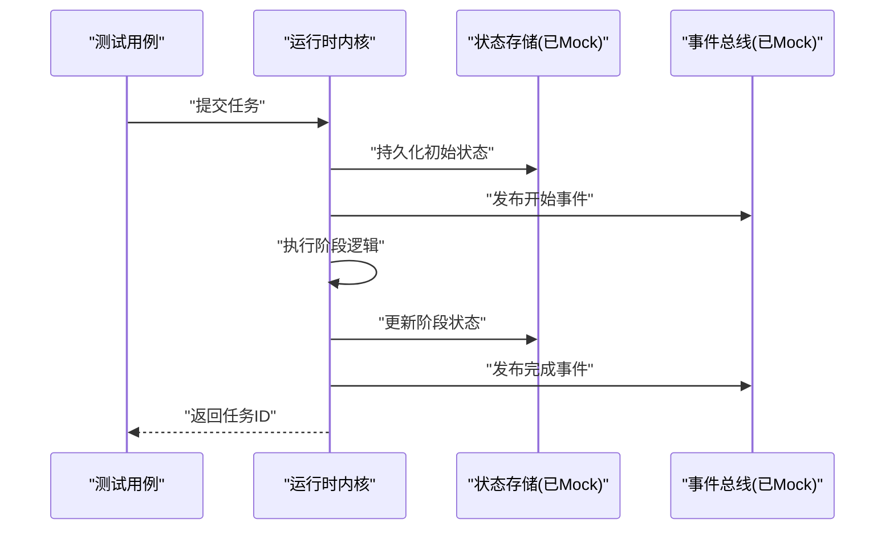
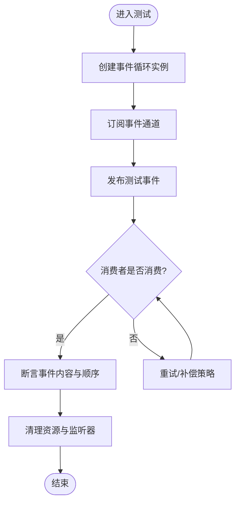
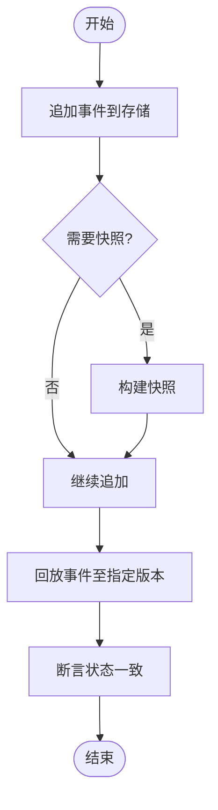
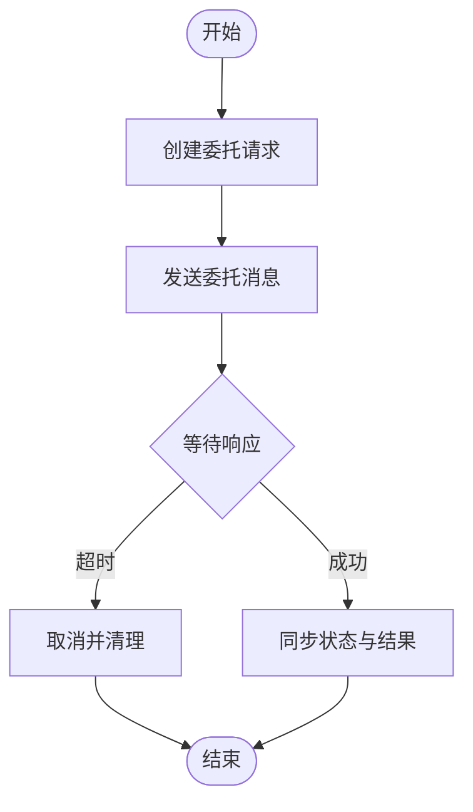
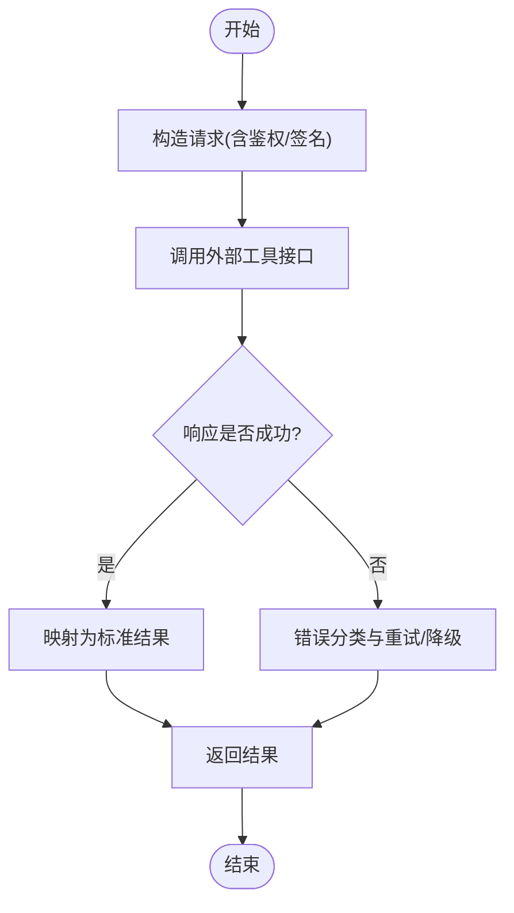
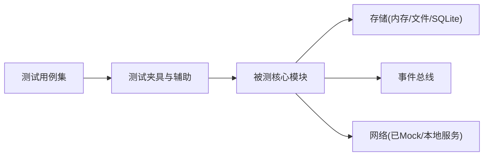

# 单元测试

<cite>
**本文引用的文件**   
- [vitest.config.ts](file://engine/vitest.config.ts)
- [package.json](file://engine/package.json)
- [tsconfig.json](file://engine/tsconfig.json)
- [global.d.ts](file://engine/tests/global.d.ts)
- [http-server-test-harness.ts](file://engine/tests/http-server-test-harness.ts)
- [loop-test-harness.ts](file://engine/tests/loop-test-harness.ts)
- [capability-registry.test.ts](file://engine/tests/capability-registry.test.ts)
- [tool-coordinator-runtime.test.ts](file://engine/tests/tool-coordinator-runtime.test.ts)
- [runtime-kernel.test.ts](file://engine/tests/runtime-kernel.test.ts)
- [evented-loop.test.ts](file://engine/tests/evented-loop.test.ts)
- [run-event-store.test.ts](file://engine/tests/run-event-store.test.ts)
- [memory-store.test.ts](file://engine/tests/memory-store.test.ts)
- [file-session-store.test.ts](file://engine/tests/file-session-store.test.ts)
- [task-state-store.test.ts](file://engine/tests/task-state-store.test.ts)
- [delegation-runtime.test.ts](file://engine/tests/delegation-runtime.test.ts)
- [mcp-tool-provider.test.ts](file://engine/tests/mcp-tool-provider.test.ts)
- [web-tool-provider.test.ts](file://engine/tests/web-tool-provider.test.ts)
</cite>

## 目录
1. [简介](#简介)
2. [项目结构](#项目结构)
3. [核心组件](#核心组件)
4. [架构总览](#架构总览)
5. [详细组件分析](#详细组件分析)
6. [依赖分析](#依赖分析)
7. [性能考虑](#性能考虑)
8. [故障排查指南](#故障排查指南)
9. [结论](#结论)
10. [附录](#附录)

## 简介
本文件面向KCoder引擎层的单元测试，聚焦基于Vitest的测试框架配置与使用实践。文档覆盖以下主题：
- 测试文件组织、测试环境设置、Mock策略
- 核心模块的单元测试实现：引擎核心、适配器层、能力注册中心、工具协调器等
- 异步测试处理：Promise、Async/Await、事件驱动模式
- 测试数据准备与隔离：测试夹具、数据库测试、文件系统模拟
- 断言方法与错误处理最佳实践
- 覆盖率要求与性能优化技巧

## 项目结构
KCoder采用多包工作区，测试集中在 engine/tests 目录下，按被测模块或特性进行拆分；同时提供通用测试辅助（如HTTP服务启动器、循环执行测试夹具等）。根级配置文件位于 engine 目录，包含Vitest、TypeScript与包管理配置。

图表来源
- [vitest.config.ts](file://engine/vitest.config.ts)
- [package.json](file://engine/package.json)
- [tsconfig.json](file://engine/tsconfig.json)
- [global.d.ts](file://engine/tests/global.d.ts)
- [http-server-test-harness.ts](file://engine/tests/http-server-test-harness.ts)
- [loop-test-harness.ts](file://engine/tests/loop-test-harness.ts)

章节来源
- [vitest.config.ts](file://engine/vitest.config.ts)
- [package.json](file://engine/package.json)
- [tsconfig.json](file://engine/tsconfig.json)
- [global.d.ts](file://engine/tests/global.d.ts)
- [http-server-test-harness.ts](file://engine/tests/http-server-test-harness.ts)
- [loop-test-harness.ts](file://engine/tests/loop-test-harness.ts)

## 核心组件
本节概述关键测试基础设施与常用模式：
- 全局类型与环境声明：在 tests/global.d.ts 中扩展全局类型，便于测试代码统一访问
- HTTP服务测试夹具：tests/http-server-test-harness.ts 提供轻量HTTP服务生命周期管理，用于集成测试
- 循环执行测试夹具：tests/loop-test-harness.ts 封装循环执行流程，简化复杂场景构造
- Vitest配置：engine/vitest.config.ts 定义测试运行参数、路径别名、覆盖率等
- 包脚本：engine/package.json 暴露 test、coverage 等命令入口

章节来源
- [global.d.ts](file://engine/tests/global.d.ts)
- [http-server-test-harness.ts](file://engine/tests/http-server-test-harness.ts)
- [loop-test-harness.ts](file://engine/tests/loop-test-harness.ts)
- [vitest.config.ts](file://engine/vitest.config.ts)
- [package.json](file://engine/package.json)

## 架构总览
下图展示测试层与核心模块的交互关系：测试用例通过夹具与辅助方法调用被测模块（能力注册中心、工具协调器、运行时内核、事件总线、存储等），并通过Mock与夹具控制外部依赖（网络、文件系统、数据库）。

图表来源
- [capability-registry.test.ts](file://engine/tests/capability-registry.test.ts)
- [tool-coordinator-runtime.test.ts](file://engine/tests/tool-coordinator-runtime.test.ts)
- [runtime-kernel.test.ts](file://engine/tests/runtime-kernel.test.ts)
- [evented-loop.test.ts](file://engine/tests/evented-loop.test.ts)
- [run-event-store.test.ts](file://engine/tests/run-event-store.test.ts)
- [memory-store.test.ts](file://engine/tests/memory-store.test.ts)
- [file-session-store.test.ts](file://engine/tests/file-session-store.test.ts)
- [delegation-runtime.test.ts](file://engine/tests/delegation-runtime.test.ts)
- [mcp-tool-provider.test.ts](file://engine/tests/mcp-tool-provider.test.ts)
- [web-tool-provider.test.ts](file://engine/tests/web-tool-provider.test.ts)

## 详细组件分析

### 能力注册中心测试
- 目标：验证能力的注册、发现、冲突检测、生命周期钩子与权限校验
- 设计要点：
  - 使用独立实例避免跨用例污染
  - 构造最小能力描述对象，覆盖成功注册、重复注册、非法能力名等分支
  - 对副作用（日志、指标上报）使用Mock或监听器断言
- 典型流程（序列图）：

图表来源
- [capability-registry.test.ts](file://engine/tests/capability-registry.test.ts)

章节来源
- [capability-registry.test.ts](file://engine/tests/capability-registry.test.ts)

### 工具协调器运行时测试
- 目标：验证工具调用编排、重试与熔断、超时控制、结果聚合与错误传播
- 设计要点：
  - 使用夹具注入可替换的工具实现，模拟成功、失败、延迟、异常等场景
  - 针对并发调用与限流策略编写边界用例
  - 对中间件链（鉴权、审计、度量）进行分层Mock
- 典型流程（序列图）：

图表来源
- [tool-coordinator-runtime.test.ts](file://engine/tests/tool-coordinator-runtime.test.ts)

章节来源
- [tool-coordinator-runtime.test.ts](file://engine/tests/tool-coordinator-runtime.test.ts)

### 运行时内核测试
- 目标：验证任务调度、上下文传递、资源隔离、崩溃恢复与回滚
- 设计要点：
  - 使用轻量内核实例，注入内存存储与事件总线
  - 构造不同状态迁移路径，覆盖正常完成、中断、重试、幂等性
  - 对I/O与外部系统调用进行Mock，确保可重复性
- 典型流程（序列图）：

图表来源
- [runtime-kernel.test.ts](file://engine/tests/runtime-kernel.test.ts)

章节来源
- [runtime-kernel.test.ts](file://engine/tests/runtime-kernel.test.ts)

### 事件驱动循环测试
- 目标：验证事件订阅/发布、顺序保证、背压与丢失事件处理
- 设计要点：
  - 使用事件夹具构造生产者/消费者模型
  - 注入延迟与异常，验证重放与补偿机制
  - 断言事件时序与最终一致性
- 流程图（算法/策略）：

图表来源
- [evented-loop.test.ts](file://engine/tests/evented-loop.test.ts)

章节来源
- [evented-loop.test.ts](file://engine/tests/evented-loop.test.ts)

### 事件持久化与存储测试
- 目标：验证事件追加、快照、回放与一致性
- 设计要点：
  - 使用内存存储作为默认后端，必要时切换为文件/SQLite
  - 构造高并发写入与读取，断言无丢失与有序性
  - 对损坏数据进行容错与修复路径测试
- 流程图（算法/策略）：

图表来源
- [run-event-store.test.ts](file://engine/tests/run-event-store.test.ts)
- [memory-store.test.ts](file://engine/tests/memory-store.test.ts)
- [file-session-store.test.ts](file://engine/tests/file-session-store.test.ts)
- [task-state-store.test.ts](file://engine/tests/task-state-store.test.ts)

章节来源
- [run-event-store.test.ts](file://engine/tests/run-event-store.test.ts)
- [memory-store.test.ts](file://engine/tests/memory-store.test.ts)
- [file-session-store.test.ts](file://engine/tests/file-session-store.test.ts)
- [task-state-store.test.ts](file://engine/tests/task-state-store.test.ts)

### 委托运行时测试
- 目标：验证子任务委派、状态同步、超时与取消
- 设计要点：
  - 使用夹具模拟远程委托端点
  - 覆盖网络抖动、部分失败与重试
  - 断言委托生命周期事件与最终状态
- 流程图（算法/策略）：

图表来源
- [delegation-runtime.test.ts](file://engine/tests/delegation-runtime.test.ts)

章节来源
- [delegation-runtime.test.ts](file://engine/tests/delegation-runtime.test.ts)

### MCP/Web工具提供者测试
- 目标：验证外部工具接入、协议适配、鉴权与错误映射
- 设计要点：
  - 使用本地HTTP夹具模拟MCP/Web服务
  - 构造不同响应码与负载，断言错误转换与重试策略
  - 对认证头、签名、限流进行边界测试
- 流程图（算法/策略）：

图表来源
- [mcp-tool-provider.test.ts](file://engine/tests/mcp-tool-provider.test.ts)
- [web-tool-provider.test.ts](file://engine/tests/web-tool-provider.test.ts)

章节来源
- [mcp-tool-provider.test.ts](file://engine/tests/mcp-tool-provider.test.ts)
- [web-tool-provider.test.ts](file://engine/tests/web-tool-provider.test.ts)

## 依赖分析
测试层与被测模块之间的耦合关系如下：
- 测试用例通过夹具与辅助方法减少对外部系统的直接依赖
- 存储与事件总线通常以内存实现或Mock替代，提升稳定性与速度
- HTTP相关测试通过本地服务夹具隔离网络不确定性

图表来源
- [http-server-test-harness.ts](file://engine/tests/http-server-test-harness.ts)
- [loop-test-harness.ts](file://engine/tests/loop-test-harness.ts)
- [memory-store.test.ts](file://engine/tests/memory-store.test.ts)
- [file-session-store.test.ts](file://engine/tests/file-session-store.test.ts)
- [run-event-store.test.ts](file://engine/tests/run-event-store.test.ts)

章节来源
- [http-server-test-harness.ts](file://engine/tests/http-server-test-harness.ts)
- [loop-test-harness.ts](file://engine/tests/loop-test-harness.ts)
- [memory-store.test.ts](file://engine/tests/memory-store.test.ts)
- [file-session-store.test.ts](file://engine/tests/file-session-store.test.ts)
- [run-event-store.test.ts](file://engine/tests/run-event-store.test.ts)

## 性能考虑
- 并行执行：利用Vitest的并行能力，将独立测试分组，缩短整体耗时
- 惰性初始化：仅在需要时创建重型对象（如HTTP服务、数据库连接）
- 缓存与复用：对不可变数据与只读配置进行共享引用
- 减少I/O：优先使用内存存储与内存文件系统，必要时再切换到真实文件系统
- 精准断言：避免过度断言无关字段，降低比较开销
- 监控热点：对慢测试定位瓶颈，考虑拆分为更小的单元或引入异步批处理

[本节为通用指导，不直接分析具体文件]

## 故障排查指南
- 异步测试挂起：检查未处理的Promise与事件监听器，确保在afterEach中清理
- 随机失败：确认时间相关逻辑使用可控时钟或固定种子；网络请求使用夹具或Mock
- 资源泄漏：关闭HTTP服务、文件句柄、定时器与事件订阅
- 数据污染：每个用例使用独立实例与隔离的数据空间
- 断言失败：打印最小可复现场景，逐步缩小范围，定位具体分支

章节来源
- [http-server-test-harness.ts](file://engine/tests/http-server-test-harness.ts)
- [loop-test-harness.ts](file://engine/tests/loop-test-harness.ts)

## 结论
通过统一的Vitest配置、完善的测试夹具与清晰的Mock策略，KCoder引擎层的测试覆盖了从核心编排到外部适配的关键路径。结合事件驱动与异步模式的专项测试，以及存储与文件系统的隔离方案，能够在保证正确性的同时维持良好的执行性能。建议持续完善覆盖率阈值与回归套件，并将性能基准纳入CI流程。

[本节为总结性内容，不直接分析具体文件]

## 附录

### 测试框架配置与使用
- 运行测试：通过包脚本执行测试命令
- 覆盖率：启用覆盖率收集并按需输出报告
- TypeScript支持：通过tsconfig与Vitest集成，确保类型安全
- 全局类型：在tests/global.d.ts中扩展全局类型，方便测试代码访问

章节来源
- [package.json](file://engine/package.json)
- [vitest.config.ts](file://engine/vitest.config.ts)
- [tsconfig.json](file://engine/tsconfig.json)
- [global.d.ts](file://engine/tests/global.d.ts)

### 异步测试处理方法
- Promise：使用then/catch或async/await包装，配合超时与错误断言
- Async/Await：在测试函数前加async，使用try/catch捕获异常
- 事件驱动：订阅事件后等待特定事件完成，确保在清理阶段移除监听器

章节来源
- [evented-loop.test.ts](file://engine/tests/evented-loop.test.ts)
- [run-event-store.test.ts](file://engine/tests/run-event-store.test.ts)

### 测试数据准备与隔离策略
- 测试夹具：在tests下提供通用夹具与领域专用夹具
- 数据库测试：优先使用内存存储，必要时切换为SQLite并清理数据
- 文件系统模拟：使用内存文件系统或临时目录，并在afterEach清理

章节来源
- [memory-store.test.ts](file://engine/tests/memory-store.test.ts)
- [file-session-store.test.ts](file://engine/tests/file-session-store.test.ts)
- [task-state-store.test.ts](file://engine/tests/task-state-store.test.ts)

### 断言方法与错误处理最佳实践
- 明确断言范围：仅断言与行为相关的状态变化
- 错误分类：区分业务错误与系统错误，分别断言其属性与消息
- 幂等与重试：对可重试操作编写幂等性断言，避免副作用影响后续用例

章节来源
- [tool-coordinator-runtime.test.ts](file://engine/tests/tool-coordinator-runtime.test.ts)
- [mcp-tool-provider.test.ts](file://engine/tests/mcp-tool-provider.test.ts)
- [web-tool-provider.test.ts](file://engine/tests/web-tool-provider.test.ts)