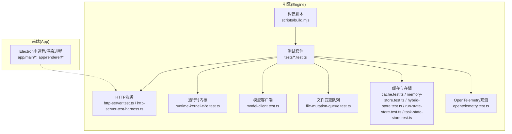
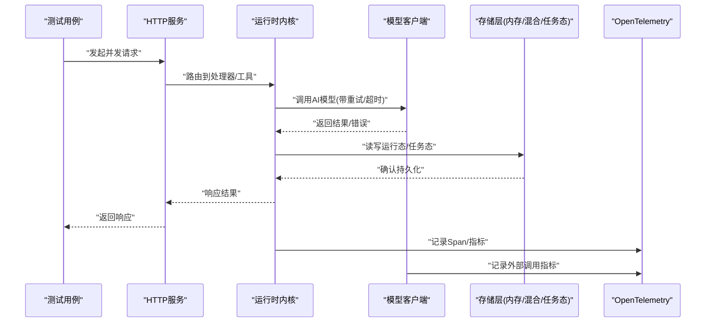
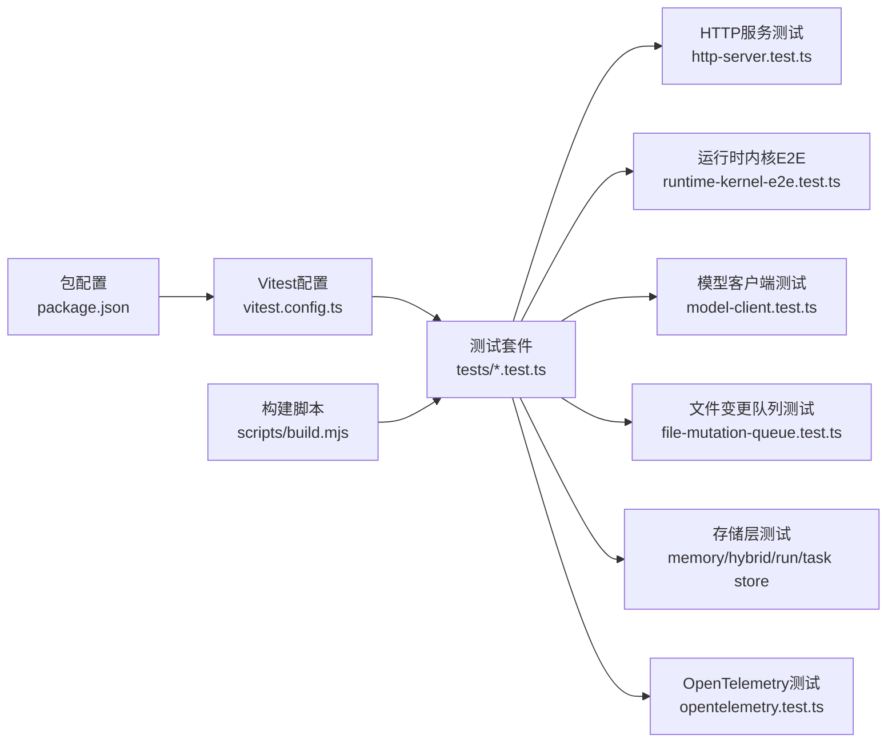

# 性能测试

<cite>
**本文引用的文件**   
- [package.json](file://engine/package.json)
- [vitest.config.ts](file://engine/vitest.config.ts)
- [tests/cache.test.ts](file://engine/tests/cache.test.ts)
- [tests/file-mutation-queue.test.ts](file://engine/tests/file-mutation-queue.test.ts)
- [tests/http-server-test-harness.ts](file://engine/tests/http-server-test-harness.ts)
- [tests/http-server.test.ts](file://engine/tests/http-server.test.ts)
- [tests/runtime-kernel-e2e.test.ts](file://engine/tests/runtime-kernel-e2e.test.ts)
- [tests/tool-runtime-v3.test.ts](file://engine/tests/tool-runtime-v3.test.ts)
- [tests/loop-runner.test.ts](file://engine/tests/loop-runner.test.ts)
- [tests/model-client.test.ts](file://engine/tests/model-client.test.ts)
- [tests/memory-store.test.ts](file://engine/tests/memory-store.test.ts)
- [tests/hybrid-store.test.ts](file://engine/tests/hybrid-store.test.ts)
- [tests/run-state-store.test.ts](file://engine/tests/run-state-store.test.ts)
- [tests/task-state-store.test.ts](file://engine/tests/task-state-store.test.ts)
- [tests/opentelemetry.test.ts](file://engine/tests/opentelemetry.test.ts)
- [tests/serve.test.ts](file://engine/tests/serve.test.ts)
- [scripts/build.mjs](file://engine/scripts/build.mjs)
</cite>

## 目录
1. [简介](#简介)
2. [项目结构](#项目结构)
3. [核心组件](#核心组件)
4. [架构总览](#架构总览)
5. [详细组件分析](#详细组件分析)
6. [依赖分析](#依赖分析)
7. [性能考量](#性能考量)
8. [故障排查指南](#故障排查指南)
9. [结论](#结论)
10. [附录](#附录)

## 简介
本文件面向KCoder引擎与前端应用的性能测试实践，覆盖基准测试、负载测试、性能回归测试与优化验证。重点围绕以下方面：
- AI模型调用性能：端到端延迟、吞吐、重试与超时控制
- 文件操作性能：并发写入、批量读写、队列化变更
- 内存使用监控：堆快照、泄漏检测、存储层容量与回收
- CPU占用分析：热点函数识别、事件循环阻塞、I/O等待
- 负载策略：并发请求、大量文件操作、长时间运行稳定性
- 瓶颈识别：剖析工具、指标采集、告警机制
- 回归测试：基线建立、自动化检查、阈值告警
- 优化验证：缓存效果、算法优化、资源使用优化
- 数据收集与分析：指标采集、报告生成、最佳实践

## 项目结构
KCoder采用多包工作区（engine为后端引擎，app为Electron前端）。性能测试主要位于engine/tests目录，使用Vitest作为测试框架；HTTP服务与运行时内核在engine内实现，便于进行端到端与集成级性能验证。

图表来源
- [tests/http-server.test.ts](file://engine/tests/http-server.test.ts)
- [tests/http-server-test-harness.ts](file://engine/tests/http-server-test-harness.ts)
- [tests/runtime-kernel-e2e.test.ts](file://engine/tests/runtime-kernel-e2e.test.ts)
- [tests/model-client.test.ts](file://engine/tests/model-client.test.ts)
- [tests/file-mutation-queue.test.ts](file://engine/tests/file-mutation-queue.test.ts)
- [tests/cache.test.ts](file://engine/tests/cache.test.ts)
- [tests/memory-store.test.ts](file://engine/tests/memory-store.test.ts)
- [tests/hybrid-store.test.ts](file://engine/tests/hybrid-store.test.ts)
- [tests/run-state-store.test.ts](file://engine/tests/run-state-store.test.ts)
- [tests/task-state-store.test.ts](file://engine/tests/task-state-store.test.ts)
- [tests/opentelemetry.test.ts](file://engine/tests/opentelemetry.test.ts)
- [scripts/build.mjs](file://engine/scripts/build.mjs)

章节来源
- [package.json:1-200](file://engine/package.json)
- [vitest.config.ts:1-200](file://engine/vitest.config.ts)

## 核心组件
- HTTP服务与测试夹具：提供可复用的HTTP服务器实例与请求构造能力，适合并发与压力场景。
- 运行时内核E2E：覆盖任务编排、工具执行、状态持久化的端到端路径，用于长稳与吞吐评估。
- 模型客户端：封装AI模型调用，适合延迟、吞吐、重试与限流测试。
- 文件变更队列：对文件写操作进行批处理与顺序化，适合高并发写入与一致性验证。
- 缓存与存储：内存/混合存储、运行态与任务态存储，适合命中率、扩容与回收测试。
- OpenTelemetry观测：链路追踪与指标上报，支撑性能分析与回归对比。

章节来源
- [tests/http-server-test-harness.ts](file://engine/tests/http-server-test-harness.ts)
- [tests/http-server.test.ts](file://engine/tests/http-server.test.ts)
- [tests/runtime-kernel-e2e.test.ts](file://engine/tests/runtime-kernel-e2e.test.ts)
- [tests/model-client.test.ts](file://engine/tests/model-client.test.ts)
- [tests/file-mutation-queue.test.ts](file://engine/tests/file-mutation-queue.test.ts)
- [tests/cache.test.ts](file://engine/tests/cache.test.ts)
- [tests/memory-store.test.ts](file://engine/tests/memory-store.test.ts)
- [tests/hybrid-store.test.ts](file://engine/tests/hybrid-store.test.ts)
- [tests/run-state-store.test.ts](file://engine/tests/run-state-store.test.ts)
- [tests/task-state-store.test.ts](file://engine/tests/task-state-store.test.ts)
- [tests/opentelemetry.test.ts](file://engine/tests/opentelemetry.test.ts)

## 架构总览
下图展示性能测试在系统中的位置与交互关系：测试驱动HTTP接口触发内核流程，经由模型客户端与存储层完成业务逻辑，并通过OpenTelemetry输出指标与链路信息。

图表来源
- [tests/http-server.test.ts](file://engine/tests/http-server.test.ts)
- [tests/runtime-kernel-e2e.test.ts](file://engine/tests/runtime-kernel-e2e.test.ts)
- [tests/model-client.test.ts](file://engine/tests/model-client.test.ts)
- [tests/run-state-store.test.ts](file://engine/tests/run-state-store.test.ts)
- [tests/task-state-store.test.ts](file://engine/tests/task-state-store.test.ts)
- [tests/opentelemetry.test.ts](file://engine/tests/opentelemetry.test.ts)

## 详细组件分析

### 基准测试：AI模型调用性能
目标
- 测量端到端延迟分布（P50/P95/P99）、吞吐（RPS）、失败率、重试次数、超时比例。
- 评估不同模型/参数组合下的性能差异。

方法
- 使用HTTP服务夹具构造标准化请求，固定上下文大小与提示长度，避免噪声。
- 通过并发度阶梯（如1/10/50/200）逐步加压，观察延迟与吞吐拐点。
- 开启OpenTelemetry，记录模型调用Span，聚合外部网络耗时。

关键指标
- 首字节时间(TTFB)、完整响应时间、模型调用耗时占比、重试与退避开销。

建议
- 将模型调用视为外部依赖，设置合理超时与熔断阈值，避免雪崩。
- 对大上下文请求进行分片或压缩，减少传输与解析成本。

章节来源
- [tests/model-client.test.ts](file://engine/tests/model-client.test.ts)
- [tests/opentelemetry.test.ts](file://engine/tests/opentelemetry.test.ts)
- [tests/http-server.test.ts](file://engine/tests/http-server.test.ts)

### 基准测试：文件操作性能
目标
- 评估并发写入、批量写入、顺序写入的吞吐与一致性。
- 验证文件变更队列的批处理与去重效果。

方法
- 构造N个文件的增量变更，按不同并发度提交至变更队列。
- 统计落盘耗时、队列积压、重复写入比例、最终一致性校验。

关键指标
- 写入延迟分布、队列深度、批大小、磁盘I/O利用率、锁竞争情况。

建议
- 调整批大小与并发度，平衡吞吐与延迟。
- 对热点文件进行合并写入，降低系统调用开销。

章节来源
- [tests/file-mutation-queue.test.ts](file://engine/tests/file-mutation-queue.test.ts)

### 基准测试：内存使用监控
目标
- 识别内存峰值、增长趋势与潜在泄漏点。
- 评估缓存与存储层的内存占用与回收行为。

方法
- 在测试前后采集堆快照，比较对象数量与大小变化。
- 针对缓存与混合存储，设计“填充-访问-淘汰”场景，验证LRU/过期策略。
- 结合OpenTelemetry自定义指标，上报堆大小、GC次数与暂停时间。

关键指标
- 常驻集大小(RSS)、堆使用量、对象分配速率、GC频率与停顿。

建议
- 对大对象进行池化或流式处理，避免一次性加载。
- 限制缓存上限并启用惰性淘汰，防止内存膨胀。

章节来源
- [tests/cache.test.ts](file://engine/tests/cache.test.ts)
- [tests/memory-store.test.ts](file://engine/tests/memory-store.test.ts)
- [tests/hybrid-store.test.ts](file://engine/tests/hybrid-store.test.ts)
- [tests/opentelemetry.test.ts](file://engine/tests/opentelemetry.test.ts)

### 基准测试：CPU占用分析
目标
- 定位热点函数与阻塞路径，评估事件循环健康度。
- 验证复杂计算与序列化/反序列化的CPU开销。

方法
- 使用Node.js内置性能分析器或第三方剖析工具，生成火焰图。
- 在测试中注入可控负载，观察CPU使用率与事件循环延迟。

关键指标
- CPU使用率、事件循环延迟、热点函数耗时占比。

建议
- 将CPU密集型任务迁移至Worker线程或子进程。
- 优化数据结构与算法复杂度，减少不必要的拷贝与深比较。

章节来源
- [tests/runtime-kernel-e2e.test.ts](file://engine/tests/runtime-kernel-e2e.test.ts)
- [tests/tool-runtime-v3.test.ts](file://engine/tests/tool-runtime-v3.test.ts)

### 负载测试：并发请求处理
目标
- 评估HTTP服务在高并发下的稳定性与吞吐。
- 验证连接池、限流与背压策略的有效性。

方法
- 使用测试夹具启动本地服务，以阶梯并发发送请求，持续一段时间。
- 记录成功率、延迟分布、错误码分布与资源使用。

关键指标
- RPS、P95/P99延迟、错误率、连接复用率、队列积压。

建议
- 根据硬件与外部依赖能力设定合理的并发上限与超时。
- 引入自适应限流与快速失败，保护下游服务。

章节来源
- [tests/http-server-test-harness.ts](file://engine/tests/http-server-test-harness.ts)
- [tests/http-server.test.ts](file://engine/tests/http-server.test.ts)

### 负载测试：大量文件操作
目标
- 验证在大规模文件变更场景下的吞吐与一致性。
- 评估队列批处理与落盘策略的稳定性。

方法
- 生成海量小文件或少量大文件，模拟真实编辑模式。
- 观察队列堆积、批大小动态调整与最终一致性。

关键指标
- 写入吞吐、批处理效率、磁盘I/O、一致性校验通过率。

建议
- 对热点目录进行分区与索引优化。
- 采用增量同步与冲突合并策略，提升用户体验。

章节来源
- [tests/file-mutation-queue.test.ts](file://engine/tests/file-mutation-queue.test.ts)

### 负载测试：长时间运行稳定性
目标
- 验证系统在长时间运行下的内存、CPU与错误率表现。
- 发现慢泄漏与资源未释放问题。

方法
- 设计持续数小时的稳定运行用例，周期性注入负载。
- 监控关键指标并设置阈值告警。

关键指标
- 资源使用趋势、错误率漂移、GC行为、任务积压。

建议
- 定期重启或优雅降级，避免长期累积问题。
- 对异常路径增加兜底与自愈逻辑。

章节来源
- [tests/runtime-kernel-e2e.test.ts](file://engine/tests/runtime-kernel-e2e.test.ts)

### 性能回归测试：基线与自动化
目标
- 建立稳定的性能基线，自动检测回归。
- 在CI中执行关键路径的性能用例，阻断质量下降。

方法
- 定义关键指标阈值（如P95延迟、错误率、RSS），在每次PR触发轻量级性能测试。
- 将历史结果与基线对比，超阈则标记失败并生成报告。

关键指标
- 回归幅度、置信区间、环境差异。

建议
- 隔离外部依赖，使用Mock或沙箱环境，确保结果可重复。
- 对不稳定指标采用多次采样与稳健统计。

章节来源
- [tests/opentelemetry.test.ts](file://engine/tests/opentelemetry.test.ts)
- [tests/http-server.test.ts](file://engine/tests/http-server.test.ts)

### 性能回归测试：告警机制
目标
- 当性能指标偏离基线时及时通知团队。
- 支持分级告警与自动回滚建议。

方法
- 将OpenTelemetry指标接入监控系统，配置阈值规则。
- 在CI流水线中输出告警摘要与链接到详细报告。

关键指标
- 告警准确率、误报率、平均修复时间(MTTR)。

建议
- 区分严重级别，避免告警疲劳。
- 关联变更上下文，辅助定位根因。

章节来源
- [tests/opentelemetry.test.ts](file://engine/tests/opentelemetry.test.ts)

### 性能优化验证：缓存效果评估
目标
- 量化缓存命中率与延迟改善。
- 验证不同缓存策略对整体性能的影响。

方法
- 设计命中/未命中场景，对比有无缓存的延迟与吞吐。
- 监控缓存大小、淘汰次数与失效事件。

关键指标
- 命中率、平均延迟降低比例、缓存开销。

建议
- 分层缓存（L1/L2）与预取策略，提升热数据访问速度。
- 对冷数据采用惰性加载与延迟初始化。

章节来源
- [tests/cache.test.ts](file://engine/tests/cache.test.ts)

### 性能优化验证：算法优化验证
目标
- 评估算法改进对CPU与内存的影响。
- 确保功能正确性不受影响。

方法
- 在相同输入规模下对比优化前后的耗时与资源使用。
- 使用剖析工具定位新热点。

关键指标
- 耗时降低、内存峰值下降、CPU占用减少。

建议
- 渐进式替换算法，保留回滚路径。
- 对边界条件进行充分测试。

章节来源
- [tests/tool-runtime-v3.test.ts](file://engine/tests/tool-runtime-v3.test.ts)

### 性能优化验证：资源使用优化
目标
- 验证连接池、线程池、文件句柄等资源优化效果。
- 避免资源耗尽与死锁。

方法
- 在高负载下观察资源使用趋势与回收行为。
- 注入异常路径，验证资源清理逻辑。

关键指标
- 资源持有数、回收率、泄漏迹象。

建议
- 统一资源管理入口，强制关闭与超时释放。
- 对长生命周期对象进行引用审计。

章节来源
- [tests/hybrid-store.test.ts](file://engine/tests/hybrid-store.test.ts)
- [tests/run-state-store.test.ts](file://engine/tests/run-state-store.test.ts)

## 依赖分析
性能测试与核心模块的依赖关系如下：

图表来源
- [vitest.config.ts](file://engine/vitest.config.ts)
- [package.json](file://engine/package.json)
- [tests/http-server.test.ts](file://engine/tests/http-server.test.ts)
- [tests/runtime-kernel-e2e.test.ts](file://engine/tests/runtime-kernel-e2e.test.ts)
- [tests/model-client.test.ts](file://engine/tests/model-client.test.ts)
- [tests/file-mutation-queue.test.ts](file://engine/tests/file-mutation-queue.test.ts)
- [tests/memory-store.test.ts](file://engine/tests/memory-store.test.ts)
- [tests/hybrid-store.test.ts](file://engine/tests/hybrid-store.test.ts)
- [tests/run-state-store.test.ts](file://engine/tests/run-state-store.test.ts)
- [tests/task-state-store.test.ts](file://engine/tests/task-state-store.test.ts)
- [tests/opentelemetry.test.ts](file://engine/tests/opentelemetry.test.ts)
- [scripts/build.mjs](file://engine/scripts/build.mjs)

章节来源
- [vitest.config.ts](file://engine/vitest.config.ts)
- [package.json](file://engine/package.json)

## 性能考量
- 环境一致性：固定Node版本、操作系统与硬件规格，避免环境噪声。
- 外部依赖隔离：对AI模型与文件系统使用可控Mock或沙箱，提高可重复性。
- 指标完备性：同时采集延迟、吞吐、错误率、资源使用与链路追踪。
- 统计稳健性：多次采样、剔除异常值、使用分位数而非平均值。
- 渐进式回归：在CI中仅运行关键路径，全量回归定时执行。

[本节为通用指导，不直接分析具体文件]

## 故障排查指南
- 定位慢请求：通过OpenTelemetry链路追踪，识别最慢Span与外部调用。
- 内存泄漏：对比前后堆快照，关注持续增长的对象类型与引用链。
- CPU热点：使用剖析工具生成火焰图，聚焦顶层热点函数。
- 文件I/O瓶颈：观察队列深度与批大小，调整落盘策略与并发度。
- 服务不稳定：检查连接池、超时与重试策略，必要时引入熔断与降级。

章节来源
- [tests/opentelemetry.test.ts](file://engine/tests/opentelemetry.test.ts)
- [tests/file-mutation-queue.test.ts](file://engine/tests/file-mutation-queue.test.ts)
- [tests/http-server.test.ts](file://engine/tests/http-server.test.ts)

## 结论
通过系统的基准测试、负载测试与回归测试，结合OpenTelemetry与存储/缓存层观测，能够全面评估KCoder在AI模型调用、文件操作、内存与CPU方面的性能表现。建议在CI中固化关键性能用例，建立基线与告警，持续验证优化效果，保障系统在高负载下的稳定性与可扩展性。

[本节为总结，不直接分析具体文件]

## 附录
- 指标基线模板：定义P50/P95/P99延迟、错误率、RSS、GC次数等阈值。
- 报告生成：将测试结果与链路追踪导出为可视化报告，便于回溯与分享。
- 最佳实践：最小化外部依赖、使用异步与批处理、避免阻塞事件循环。

[本节为补充说明，不直接分析具体文件]