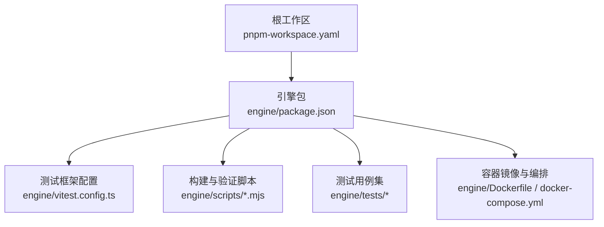
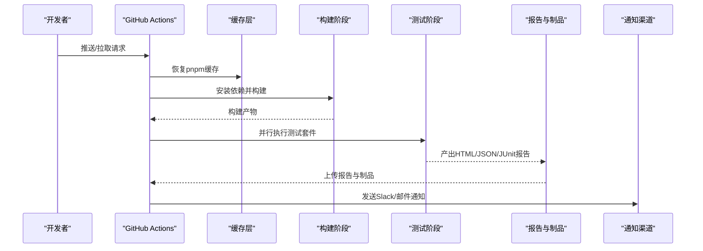
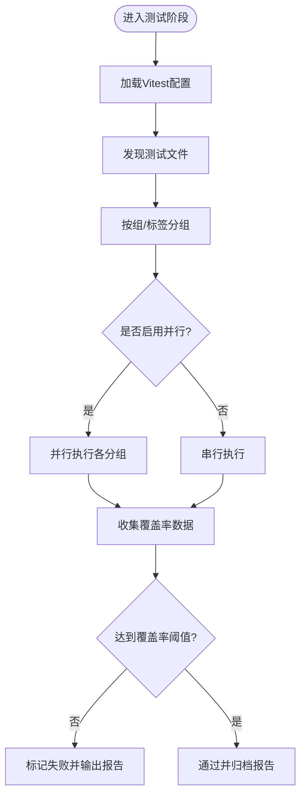
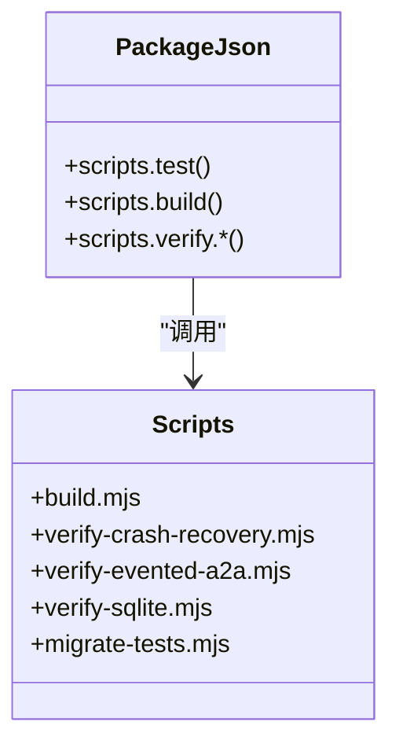
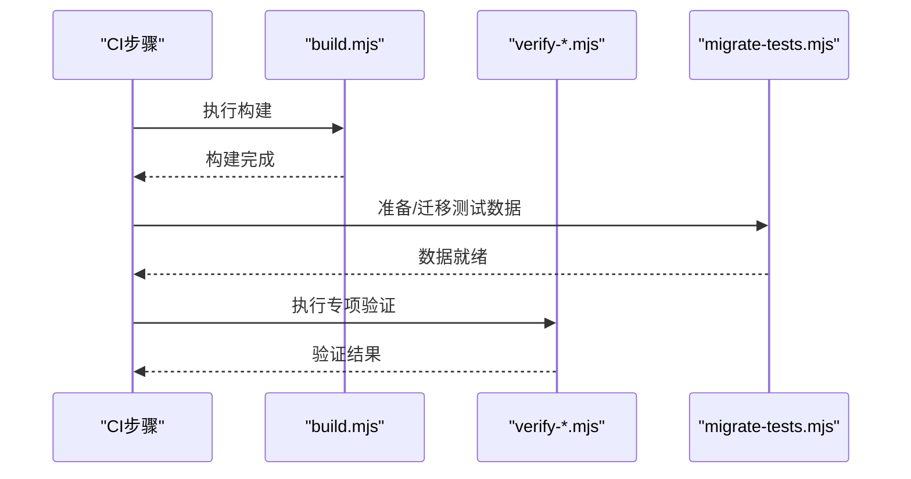
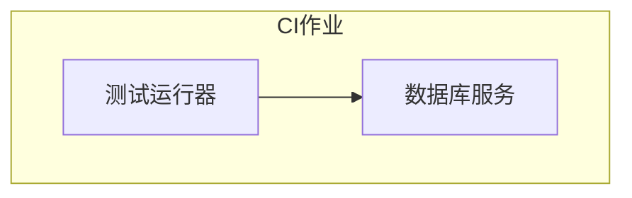
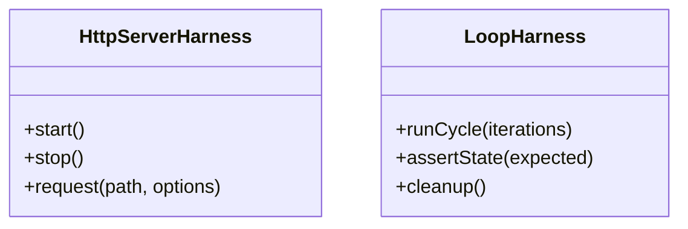
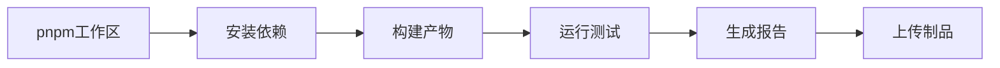

# 持续集成

<cite>
**本文引用的文件**   
- [package.json](file://engine/package.json)
- [vitest.config.ts](file://engine/vitest.config.ts)
- [pnpm-workspace.yaml](file://engine/pnpm-workspace.yaml)
- [Dockerfile](file://engine/Dockerfile)
- [docker-compose.yml](file://engine/docker-compose.yml)
- [scripts/build.mjs](file://engine/scripts/build.mjs)
- [scripts/verify-crash-recovery.mjs](file://engine/scripts/verify-crash-recovery.mjs)
- [scripts/verify-evented-a2a.mjs](file://engine/scripts/verify-evented-a2a.mjs)
- [scripts/verify-sqlite.mjs](file://engine/scripts/verify-sqlite.mjs)
- [scripts/migrate-tests.mjs](file://engine/scripts/migrate-tests.mjs)
- [tests/http-server-test-harness.ts](file://engine/tests/http-server-test-harness.ts)
- [tests/loop-test-harness.ts](file://engine/tests/loop-test-harness.ts)
</cite>

## 目录
1. [简介](#简介)
2. [项目结构](#项目结构)
3. [核心组件](#核心组件)
4. [架构总览](#架构总览)
5. [详细组件分析](#详细组件分析)
6. [依赖分析](#依赖分析)
7. [性能考虑](#性能考虑)
8. [故障排查指南](#故障排查指南)
9. [结论](#结论)
10. [附录](#附录)

## 简介
本文件面向KCoder项目的持续集成（CI）与测试自动化，聚焦于在GitHub Actions或同类工具中编排测试任务、并行执行策略、质量门禁、报告与通知、失败重试与诊断、以及测试环境维护与更新策略。文档基于仓库现有工程结构与脚本能力进行系统化说明，并提供可直接落地的流水线设计建议与可视化图示，帮助团队快速搭建稳定高效的CI/CD测试体系。

## 项目结构
KCoder采用多包工作区组织方式，引擎层位于engine目录，包含大量单元测试、集成测试与验证脚本；前端应用位于app目录。CI相关的关键配置集中在engine子项目中：
- 工作区与工作流入口：pnpm工作区定义、包脚本、Vitest配置
- 构建与验证脚本：构建、迁移、校验等Node脚本
- 容器化与本地编排：Dockerfile与docker-compose用于隔离的测试环境
- 测试夹具与辅助：HTTP服务测试桩、循环测试桩等

**图表来源**
- [pnpm-workspace.yaml](file://engine/pnpm-workspace.yaml)
- [package.json](file://engine/package.json)
- [vitest.config.ts](file://engine/vitest.config.ts)
- [Dockerfile](file://engine/Dockerfile)
- [docker-compose.yml](file://engine/docker-compose.yml)

**章节来源**
- [pnpm-workspace.yaml](file://engine/pnpm-workspace.yaml)
- [package.json](file://engine/package.json)
- [vitest.config.ts](file://engine/vitest.config.ts)

## 核心组件
- 测试运行器与配置
  - 使用Vitest作为统一测试运行器，集中式配置文件位于engine/vitest.config.ts，负责测试发现、并行度、覆盖率、环境隔离等关键参数。
- 包脚本与任务编排
  - engine/package.json提供测试、构建、验证等命令入口，便于在CI中直接调用。
- 构建与验证脚本
  - scripts目录下提供构建、迁移、专项验证脚本，可在CI中以独立步骤执行，增强可观测性与稳定性。
- 容器化与本地编排
  - Dockerfile与docker-compose用于在CI中拉起数据库或其他外部依赖，保证测试环境的可重复性。
- 测试夹具与辅助
  - tests目录下的http-server-test-harness.ts与loop-test-harness.ts为特定场景提供稳定的测试基础设施。

**章节来源**
- [vitest.config.ts](file://engine/vitest.config.ts)
- [package.json](file://engine/package.json)
- [scripts/build.mjs](file://engine/scripts/build.mjs)
- [scripts/verify-crash-recovery.mjs](file://engine/scripts/verify-crash-recovery.mjs)
- [scripts/verify-evented-a2a.mjs](file://engine/scripts/verify-evented-a2a.mjs)
- [scripts/verify-sqlite.mjs](file://engine/scripts/verify-sqlite.mjs)
- [scripts/migrate-tests.mjs](file://engine/scripts/migrate-tests.mjs)
- [tests/http-server-test-harness.ts](file://engine/tests/http-server-test-harness.ts)
- [tests/loop-test-harness.ts](file://engine/tests/loop-test-harness.ts)

## 架构总览
下图展示CI流水线的端到端流程：从代码提交触发，到安装依赖、构建产物、运行测试套件、生成报告、上传结果、发布通知与制品。

[此图为概念性流程图，不直接映射具体源码文件]

## 详细组件分析

### 测试运行器与配置（Vitest）
- 职责
  - 定义测试发现规则、并行执行策略、覆盖率阈值与环境变量注入。
- 关键要点
  - 通过配置文件控制测试分组与并发度，结合CI矩阵实现跨平台/跨版本并行。
  - 启用覆盖率收集并在CI中设置最低覆盖率门槛，作为质量门禁的一部分。
  - 针对需要外部依赖的测试，可通过环境变量或测试桩进行隔离。

**图表来源**
- [vitest.config.ts](file://engine/vitest.config.ts)

**章节来源**
- [vitest.config.ts](file://engine/vitest.config.ts)

### 包脚本与任务编排（engine/package.json）
- 职责
  - 暴露统一的测试、构建、验证命令，供CI直接调用。
- 典型任务
  - 测试：运行全部或指定测试套件，支持过滤与并行。
  - 构建：编译TypeScript、打包资源，供后续测试与制品使用。
  - 验证：执行专项验证脚本（如崩溃恢复、事件驱动A2A、SQLite持久化）。

**图表来源**
- [package.json](file://engine/package.json)
- [scripts/build.mjs](file://engine/scripts/build.mjs)
- [scripts/verify-crash-recovery.mjs](file://engine/scripts/verify-crash-recovery.mjs)
- [scripts/verify-evented-a2a.mjs](file://engine/scripts/verify-evented-a2a.mjs)
- [scripts/verify-sqlite.mjs](file://engine/scripts/verify-sqlite.mjs)
- [scripts/migrate-tests.mjs](file://engine/scripts/migrate-tests.mjs)

**章节来源**
- [package.json](file://engine/package.json)
- [scripts/build.mjs](file://engine/scripts/build.mjs)
- [scripts/verify-crash-recovery.mjs](file://engine/scripts/verify-crash-recovery.mjs)
- [scripts/verify-evented-a2a.mjs](file://engine/scripts/verify-evented-a2a.mjs)
- [scripts/verify-sqlite.mjs](file://engine/scripts/verify-sqlite.mjs)
- [scripts/migrate-tests.mjs](file://engine/scripts/migrate-tests.mjs)

### 构建与验证脚本
- build.mjs
  - 负责构建产物准备，确保测试阶段能访问到最新编译结果。
- verify-*.mjs
  - 专项验证脚本，覆盖崩溃恢复、事件驱动A2A、SQLite持久化等关键路径，适合在CI中作为独立步骤执行，提高问题定位效率。
- migrate-tests.mjs
  - 测试数据与迁移脚本，保障测试数据一致性与可重复性。

**图表来源**
- [scripts/build.mjs](file://engine/scripts/build.mjs)
- [scripts/verify-crash-recovery.mjs](file://engine/scripts/verify-crash-recovery.mjs)
- [scripts/verify-evented-a2a.mjs](file://engine/scripts/verify-evented-a2a.mjs)
- [scripts/verify-sqlite.mjs](file://engine/scripts/verify-sqlite.mjs)
- [scripts/migrate-tests.mjs](file://engine/scripts/migrate-tests.mjs)

**章节来源**
- [scripts/build.mjs](file://engine/scripts/build.mjs)
- [scripts/verify-crash-recovery.mjs](file://engine/scripts/verify-crash-recovery.mjs)
- [scripts/verify-evented-a2a.mjs](file://engine/scripts/verify-evented-a2a.mjs)
- [scripts/verify-sqlite.mjs](file://engine/scripts/verify-sqlite.mjs)
- [scripts/migrate-tests.mjs](file://engine/scripts/migrate-tests.mjs)

### 容器化与测试环境（Docker与docker-compose）
- Dockerfile
  - 定义测试运行所需的运行时环境与依赖，确保CI与本地一致性。
- docker-compose.yml
  - 编排外部依赖（如数据库），在CI中按需启动，避免共享状态导致的偶发失败。

**图表来源**
- [Dockerfile](file://engine/Dockerfile)
- [docker-compose.yml](file://engine/docker-compose.yml)

**章节来源**
- [Dockerfile](file://engine/Dockerfile)
- [docker-compose.yml](file://engine/docker-compose.yml)

### 测试夹具与辅助（HTTP与Loop）
- http-server-test-harness.ts
  - 提供HTTP服务器测试桩，便于对网络接口进行稳定测试。
- loop-test-harness.ts
  - 提供循环/迭代类逻辑的测试桩，简化复杂场景的断言与清理。

**图表来源**
- [tests/http-server-test-harness.ts](file://engine/tests/http-server-test-harness.ts)
- [tests/loop-test-harness.ts](file://engine/tests/loop-test-harness.ts)

**章节来源**
- [tests/http-server-test-harness.ts](file://engine/tests/http-server-test-harness.ts)
- [tests/loop-test-harness.ts](file://engine/tests/loop-test-harness.ts)

## 依赖分析
- 工作区与包管理
  - pnpm工作区定义将多个包纳入统一管理，便于在CI中一次性安装与缓存依赖。
- 测试与构建依赖
  - 通过package.json中的scripts与vitest.config.ts协同，形成“安装→构建→测试”的标准链路。
- 外部依赖与容器化
  - 借助Docker与docker-compose，将数据库等外部依赖纳入CI可控范围，降低环境差异带来的不稳定因素。

**图表来源**
- [pnpm-workspace.yaml](file://engine/pnpm-workspace.yaml)
- [package.json](file://engine/package.json)
- [vitest.config.ts](file://engine/vitest.config.ts)

**章节来源**
- [pnpm-workspace.yaml](file://engine/pnpm-workspace.yaml)
- [package.json](file://engine/package.json)
- [vitest.config.ts](file://engine/vitest.config.ts)

## 性能考虑
- 并行测试执行
  - 利用Vitest的并行能力与CI矩阵，按模块或标签拆分测试组，最大化利用多核与多实例。
- 增量测试优化
  - 基于变更检测仅运行受影响测试套件，减少不必要的执行时间。
- 缓存与复用
  - 缓存pnpm依赖与构建产物，缩短冷启动时间。
- 资源隔离
  - 使用容器化或进程级隔离避免测试间干扰，提升稳定性与吞吐。

[本节为通用指导，无需源码引用]

## 故障排查指南
- 失败重跑与日志收集
  - 在CI中对失败的测试步骤自动重跑一次，并保留完整日志与截图/堆栈信息，便于复现与定位。
- 专项验证脚本
  - 当出现偶发失败时，优先运行verify-*.mjs系列脚本以快速确认是否为特定路径问题。
- 测试数据与迁移
  - 若涉及数据不一致，检查migrate-tests.mjs的执行顺序与幂等性，确保每次CI前数据处于已知状态。
- 容器化环境问题
  - 使用docker-compose在本地复现CI环境，核对端口、卷挂载与服务健康检查。

**章节来源**
- [scripts/verify-crash-recovery.mjs](file://engine/scripts/verify-crash-recovery.mjs)
- [scripts/verify-evented-a2a.mjs](file://engine/scripts/verify-evented-a2a.mjs)
- [scripts/verify-sqlite.mjs](file://engine/scripts/verify-sqlite.mjs)
- [scripts/migrate-tests.mjs](file://engine/scripts/migrate-tests.mjs)
- [docker-compose.yml](file://engine/docker-compose.yml)

## 结论
通过将Vitest、包脚本、专项验证与容器化编排整合进CI流水线，KCoder可实现高可靠、高性能且可观测的测试自动化。建议在GitHub Actions中引入矩阵并行、覆盖率门禁、报告归档与Slack通知，并结合增量测试与缓存策略进一步优化执行效率。对于偶发问题，优先使用专项验证脚本与容器化环境进行复现与诊断。

[本节为总结性内容，无需源码引用]

## 附录
- 建议的CI任务清单
  - 安装依赖与缓存
  - 构建产物
  - 运行单元与集成测试（并行）
  - 执行专项验证脚本
  - 生成并上传HTML/JSON/JUnit报告
  - 触发通知（Slack/邮件）
  - 发布制品（可选）
- 质量门禁建议
  - 覆盖率阈值（例如≥80%）
  - 静态检查（lint/typecheck）
  - 安全扫描（依赖漏洞与敏感信息）
- 环境维护策略
  - 依赖版本锁定与定期升级
  - 测试数据快照与迁移脚本幂等性
  - 容器镜像版本管理与最小化体积

[本节为补充信息，无需源码引用]