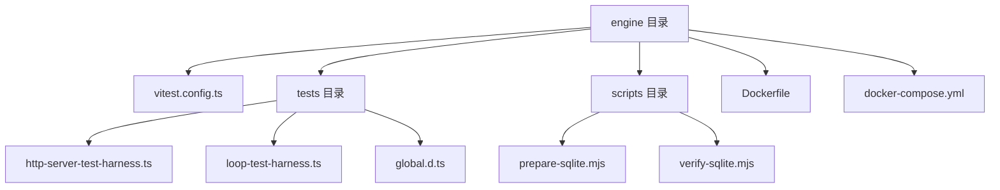
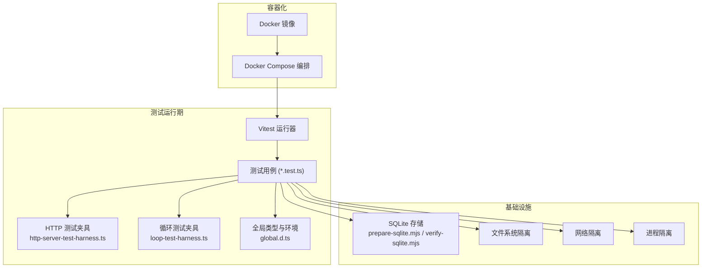
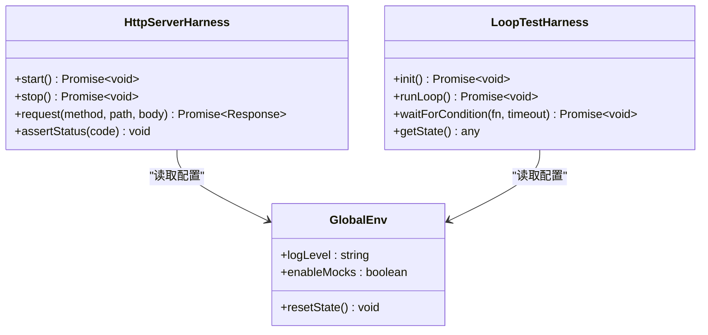
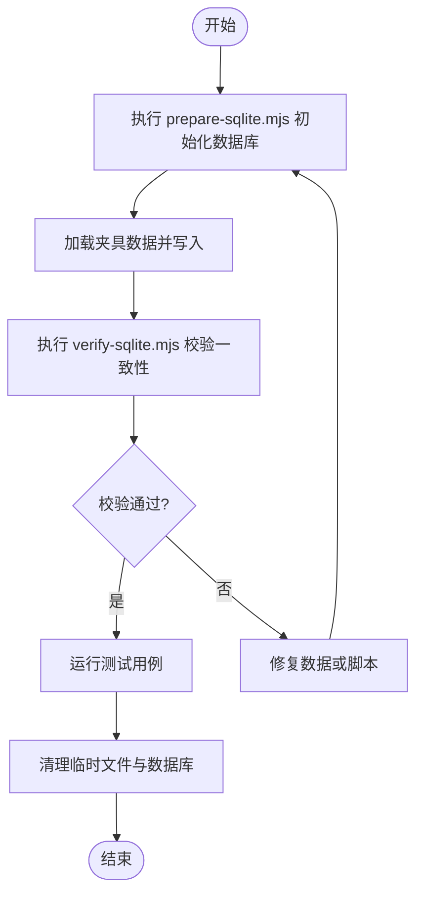
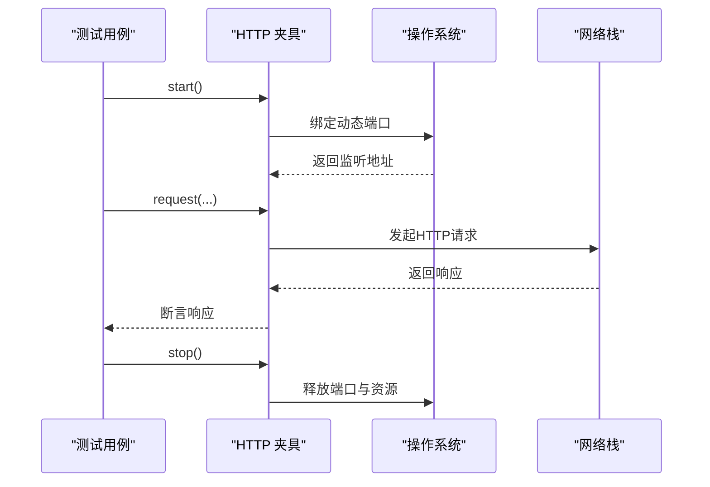
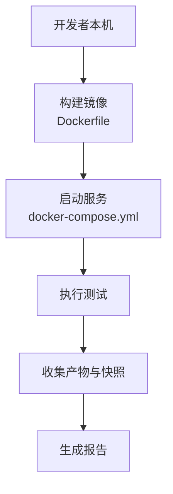
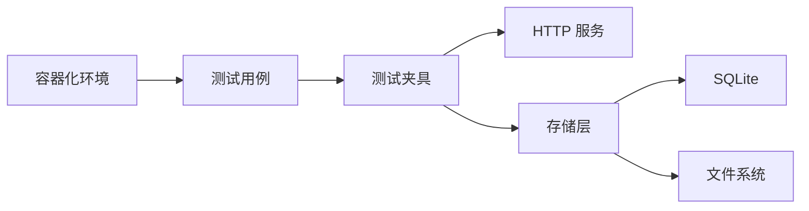

# 测试环境

<cite>
**本文引用的文件**   
- [vitest.config.ts](file://engine/vitest.config.ts)
- [package.json](file://engine/package.json)
- [pnpm-workspace.yaml](file://engine/pnpm-workspace.yaml)
- [tsconfig.json](file://engine/tsconfig.json)
- [Dockerfile](file://engine/Dockerfile)
- [docker-compose.yml](file://engine/docker-compose.yml)
- [global.d.ts](file://engine/tests/global.d.ts)
- [http-server-test-harness.ts](file://engine/tests/http-server-test-harness.ts)
- [loop-test-harness.ts](file://engine/tests/loop-test-harness.ts)
- [runtime-kernel-isolation.test.ts](file://engine/tests/runtime-kernel-isolation.test.ts)
- [steering-queue-isolation.test.ts](file://engine/tests/steering-queue-isolation.test.ts)
- [task-state-store.test.ts](file://engine/tests/task-state-store.test.ts)
- [run-event-store.test.ts](file://engine/tests/run-event-store.test.ts)
- [memory-store.test.ts](file://engine/tests/memory-store.test.ts)
- [hybrid-store.test.ts](file://engine/tests/hybrid-store.test.ts)
- [file-session-store.test.ts](file://engine/tests/file-session-store.test.ts)
- [file-session-store-integration.test.ts](file://engine/tests/file-session-store-integration.test.ts)
- [http-server.test.ts](file://engine/tests/http-server.test.ts)
- [opentelemetry.test.ts](file://engine/tests/opentelemetry.test.ts)
- [verify-sqlite.mjs](file://engine/scripts/verify-sqlite.mjs)
- [prepare-sqlite.mjs](file://engine/scripts/prepare-sqlite.mjs)
</cite>

## 目录
1. [简介](#简介)
2. [项目结构](#项目结构)
3. [核心组件](#核心组件)
4. [架构总览](#架构总览)
5. [详细组件分析](#详细组件分析)
6. [依赖关系分析](#依赖关系分析)
7. [性能考虑](#性能考虑)
8. [故障排查指南](#故障排查指南)
9. [结论](#结论)
10. [附录](#附录)

## 简介
本文件面向KCoder项目的测试环境搭建与运维，聚焦于Vitest配置、全局变量定义、测试工具函数封装、测试数据准备与管理策略、隔离机制（进程/文件系统/网络）、测试辅助工具与框架扩展、快速搭建与清理方案（含Docker容器化、快照、并行），以及故障排查与性能调优建议。文档以仓库中现有实现为依据，提供可操作的步骤与图示说明，帮助读者快速构建稳定高效的本地与CI测试环境。

## 项目结构
KCoder采用多包工作区组织，测试相关代码集中在 engine 子工程下：
- 根级工作区与工作区配置位于 engine 目录
- Vitest 配置文件位于 engine/vitest.config.ts
- 测试用例集中于 engine/tests
- 测试辅助与夹具位于 engine/tests 下的特定文件与目录
- Docker 构建与编排脚本位于 engine/Dockerfile 与 engine/docker-compose.yml
- 数据库初始化与验证脚本位于 engine/scripts

图表来源
- [vitest.config.ts](file://engine/vitest.config.ts)
- [http-server-test-harness.ts](file://engine/tests/http-server-test-harness.ts)
- [loop-test-harness.ts](file://engine/tests/loop-test-harness.ts)
- [global.d.ts](file://engine/tests/global.d.ts)
- [prepare-sqlite.mjs](file://engine/scripts/prepare-sqlite.mjs)
- [verify-sqlite.mjs](file://engine/scripts/verify-sqlite.mjs)
- [Dockerfile](file://engine/Dockerfile)
- [docker-compose.yml](file://engine/docker-compose.yml)

章节来源
- [vitest.config.ts](file://engine/vitest.config.ts)
- [package.json](file://engine/package.json)
- [pnpm-workspace.yaml](file://engine/pnpm-workspace.yaml)
- [tsconfig.json](file://engine/tsconfig.json)

## 核心组件
本节概述测试环境的关键组成部分及其职责：
- Vitest 配置：集中管理测试运行器、解析器、覆盖率、钩子等
- 全局类型与环境：在 tests/global.d.ts 中声明全局变量与类型，供所有测试共享
- 测试工具与夹具：通过 http-server-test-harness.ts、loop-test-harness.ts 等封装常用能力
- 数据准备与持久化：使用 scripts 中的 prepare-sqlite.mjs 与 verify-sqlite.mjs 进行SQLite初始化与校验
- 容器化与编排：Dockerfile 与 docker-compose.yml 提供一致的测试运行环境

章节来源
- [vitest.config.ts](file://engine/vitest.config.ts)
- [global.d.ts](file://engine/tests/global.d.ts)
- [http-server-test-harness.ts](file://engine/tests/http-server-test-harness.ts)
- [loop-test-harness.ts](file://engine/tests/loop-test-harness.ts)
- [prepare-sqlite.mjs](file://engine/scripts/prepare-sqlite.mjs)
- [verify-sqlite.mjs](file://engine/scripts/verify-sqlite.mjs)
- [Dockerfile](file://engine/Dockerfile)
- [docker-compose.yml](file://engine/docker-compose.yml)

## 架构总览
下图展示了测试环境的整体架构与交互关系，包括Vitest运行器、测试夹具、HTTP服务、存储层与外部依赖的隔离方式。

图表来源
- [vitest.config.ts](file://engine/vitest.config.ts)
- [http-server-test-harness.ts](file://engine/tests/http-server-test-harness.ts)
- [loop-test-harness.ts](file://engine/tests/loop-test-harness.ts)
- [global.d.ts](file://engine/tests/global.d.ts)
- [prepare-sqlite.mjs](file://engine/scripts/prepare-sqlite.mjs)
- [verify-sqlite.mjs](file://engine/scripts/verify-sqlite.mjs)
- [Dockerfile](file://engine/Dockerfile)
- [docker-compose.yml](file://engine/docker-compose.yml)

## 详细组件分析

### Vitest 配置与运行参数
- 目标：统一测试入口、解析TS/JSX、设置覆盖率、注册钩子、控制并发与超时
- 关键要点：
  - 解析器与别名：确保测试能正确解析源码路径与模块
  - 覆盖率：开启并配置阈值，便于回归质量门禁
  - 钩子：beforeAll/afterAll 用于资源初始化与清理
  - 并发与超时：根据任务规模调整，避免CI不稳定
  - 环境：Node或浏览器环境的选择需与测试类型匹配

章节来源
- [vitest.config.ts](file://engine/vitest.config.ts)

### 全局变量与类型声明
- 目标：为所有测试提供一致的全局API与类型，减少重复导入
- 常见内容：
  - 全局断言增强、日志开关、测试常量
  - 自定义类型声明，如测试夹具接口、HTTP响应结构
- 最佳实践：
  - 将易变配置放入环境变量，避免硬编码
  - 保持全局副作用最小化，必要时在钩子中重置状态

章节来源
- [global.d.ts](file://engine/tests/global.d.ts)

### 测试工具函数与夹具
- HTTP 测试夹具：
  - 提供启动/停止HTTP服务的便捷方法
  - 封装请求发送、响应断言、错误处理
  - 支持端口分配与连接池管理
- 循环测试夹具：
  - 封装循环执行、事件总线、状态检查
  - 提供等待条件与超时控制
- 通用工具：
  - 随机数据生成、时间冻结、文件系统操作封装

图表来源
- [http-server-test-harness.ts](file://engine/tests/http-server-test-harness.ts)
- [loop-test-harness.ts](file://engine/tests/loop-test-harness.ts)
- [global.d.ts](file://engine/tests/global.d.ts)

章节来源
- [http-server-test-harness.ts](file://engine/tests/http-server-test-harness.ts)
- [loop-test-harness.ts](file://engine/tests/loop-test-harness.ts)
- [global.d.ts](file://engine/tests/global.d.ts)

### 测试数据准备与管理策略
- 夹具组织：
  - 按功能域划分目录，命名清晰，包含输入输出样例
  - 使用JSON或TypeScript模块导出结构化数据
- Mock数据创建：
  - 针对外部依赖（HTTP、文件系统、数据库）提供Mock实现
  - 使用夹具替换真实IO，保证确定性
- 测试数据库初始化：
  - 使用 prepare-sqlite.mjs 初始化SQLite数据库结构与种子数据
  - 使用 verify-sqlite.mjs 验证数据库一致性

图表来源
- [prepare-sqlite.mjs](file://engine/scripts/prepare-sqlite.mjs)
- [verify-sqlite.mjs](file://engine/scripts/verify-sqlite.mjs)

章节来源
- [prepare-sqlite.mjs](file://engine/scripts/prepare-sqlite.mjs)
- [verify-sqlite.mjs](file://engine/scripts/verify-sqlite.mjs)

### 测试环境隔离机制
- 进程隔离：
  - 每个测试文件或套件可在独立进程中运行，避免状态泄漏
  - 通过Vitest的worker模式与进程重启策略保障稳定性
- 文件系统隔离：
  - 使用内存文件系统或临时目录，防止跨测试污染
  - 测试前后自动清理，确保幂等性
- 网络隔离：
  - 使用本地回环地址与动态端口，避免端口冲突
  - 通过夹具管理HTTP服务生命周期，确保关闭与释放

图表来源
- [http-server-test-harness.ts](file://engine/tests/http-server-test-harness.ts)

章节来源
- [runtime-kernel-isolation.test.ts](file://engine/tests/runtime-kernel-isolation.test.ts)
- [steering-queue-isolation.test.ts](file://engine/tests/steering-queue-isolation.test.ts)
- [http-server-test-harness.ts](file://engine/tests/http-server-test-harness.ts)

### 测试辅助工具与框架扩展
- 自定义断言：
  - 基于Vitest断言库扩展领域特定的比较逻辑
  - 提供可读性更强的失败消息与上下文信息
- 测试装饰器：
  - 对异步流程、重试、超时等进行横切处理
  - 简化复杂场景的样板代码
- 生命周期钩子：
  - beforeAll/afterAll 用于资源初始化与清理
  - beforeEach/beforeEach 用于单测级别的隔离与重置

章节来源
- [vitest.config.ts](file://engine/vitest.config.ts)
- [global.d.ts](file://engine/tests/global.d.ts)

### 快速搭建与清理方案
- Docker 容器化测试：
  - 使用 Dockerfile 构建镜像，固化依赖版本
  - 通过 docker-compose.yml 编排数据库与服务，一键启动
- 测试环境快照：
  - 在CI中保存测试产物与数据库快照，便于复现问题
- 并行测试支持：
  - 调整Vitest并发度与worker数量，提升吞吐
  - 合理拆分测试套件，避免长尾任务

图表来源
- [Dockerfile](file://engine/Dockerfile)
- [docker-compose.yml](file://engine/docker-compose.yml)

章节来源
- [Dockerfile](file://engine/Dockerfile)
- [docker-compose.yml](file://engine/docker-compose.yml)

## 依赖关系分析
测试环境与核心模块的依赖关系如下：
- 测试用例依赖测试夹具与全局环境
- 测试夹具依赖HTTP服务与存储层
- 存储层依赖SQLite与文件系统
- 容器化层提供一致的运行时环境

图表来源
- [http-server-test-harness.ts](file://engine/tests/http-server-test-harness.ts)
- [task-state-store.test.ts](file://engine/tests/task-state-store.test.ts)
- [run-event-store.test.ts](file://engine/tests/run-event-store.test.ts)
- [memory-store.test.ts](file://engine/tests/memory-store.test.ts)
- [hybrid-store.test.ts](file://engine/tests/hybrid-store.test.ts)
- [file-session-store.test.ts](file://engine/tests/file-session-store.test.ts)
- [file-session-store-integration.test.ts](file://engine/tests/file-session-store-integration.test.ts)

章节来源
- [task-state-store.test.ts](file://engine/tests/task-state-store.test.ts)
- [run-event-store.test.ts](file://engine/tests/run-event-store.test.ts)
- [memory-store.test.ts](file://engine/tests/memory-store.test.ts)
- [hybrid-store.test.ts](file://engine/tests/hybrid-store.test.ts)
- [file-session-store.test.ts](file://engine/tests/file-session-store.test.ts)
- [file-session-store-integration.test.ts](file://engine/tests/file-session-store-integration.test.ts)

## 性能考虑
- 并行度调优：
  - 根据CPU核数与I/O特性调整Vitest并发度
  - 将CPU密集型与I/O密集型测试分组运行
- 资源复用：
  - 复用HTTP服务实例与数据库连接，减少启动开销
  - 使用内存缓存与对象池降低GC压力
- 监控与度量：
  - 结合OpenTelemetry采集指标，定位瓶颈
  - 记录测试耗时分布，识别慢用例

章节来源
- [opentelemetry.test.ts](file://engine/tests/opentelemetry.test.ts)

## 故障排查指南
- 常见问题：
  - 端口占用：检查HTTP夹具是否正确释放端口
  - 数据库不一致：运行verify-sqlite.mjs校验数据完整性
  - 测试不稳定：增加重试与超时，启用进程隔离
- 调试技巧：
  - 启用详细日志，定位失败路径
  - 使用快照对比，追踪变更影响
  - 分步执行测试套件，缩小范围

章节来源
- [http-server.test.ts](file://engine/tests/http-server.test.ts)
- [verify-sqlite.mjs](file://engine/scripts/verify-sqlite.mjs)

## 结论
通过统一的Vitest配置、完善的全局环境与夹具、严格的隔离机制与容器化方案，KCoder的测试环境具备高稳定性与可维护性。配合合理的性能调优与故障排查流程，可有效支撑持续集成与高质量交付。

## 附录
- 快速命令参考：
  - 安装依赖：在 engine 目录下执行 pnpm install
  - 初始化数据库：node scripts/prepare-sqlite.mjs
  - 校验数据库：node scripts/verify-sqlite.mjs
  - 运行测试：npx vitest run
  - 容器化测试：docker compose up --build

章节来源
- [package.json](file://engine/package.json)
- [pnpm-workspace.yaml](file://engine/pnpm-workspace.yaml)
- [tsconfig.json](file://engine/tsconfig.json)
- [prepare-sqlite.mjs](file://engine/scripts/prepare-sqlite.mjs)
- [verify-sqlite.mjs](file://engine/scripts/verify-sqlite.mjs)
- [vitest.config.ts](file://engine/vitest.config.ts)