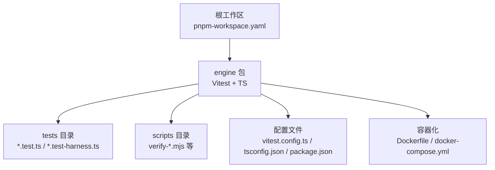
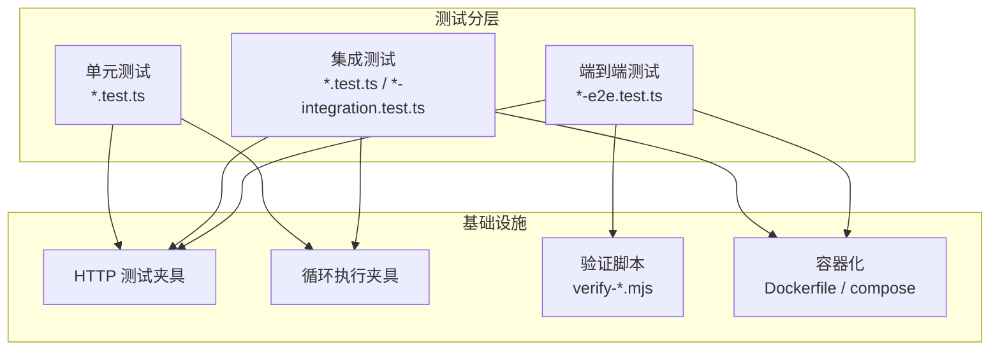
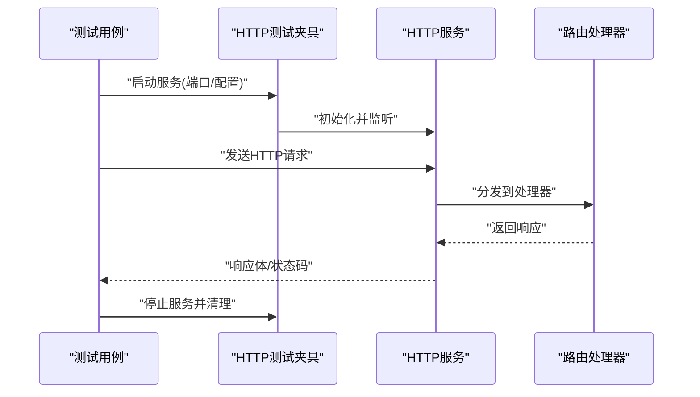
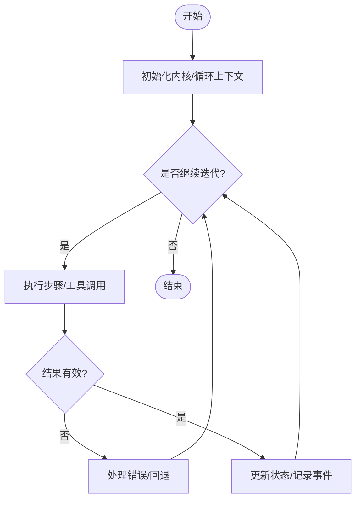
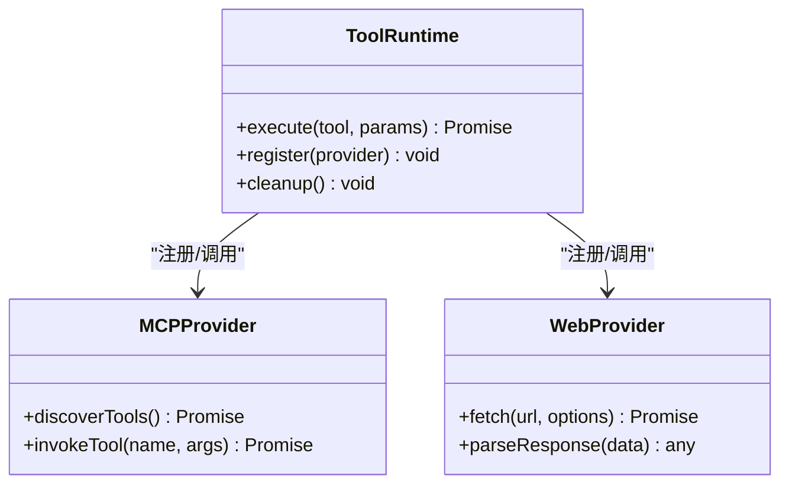
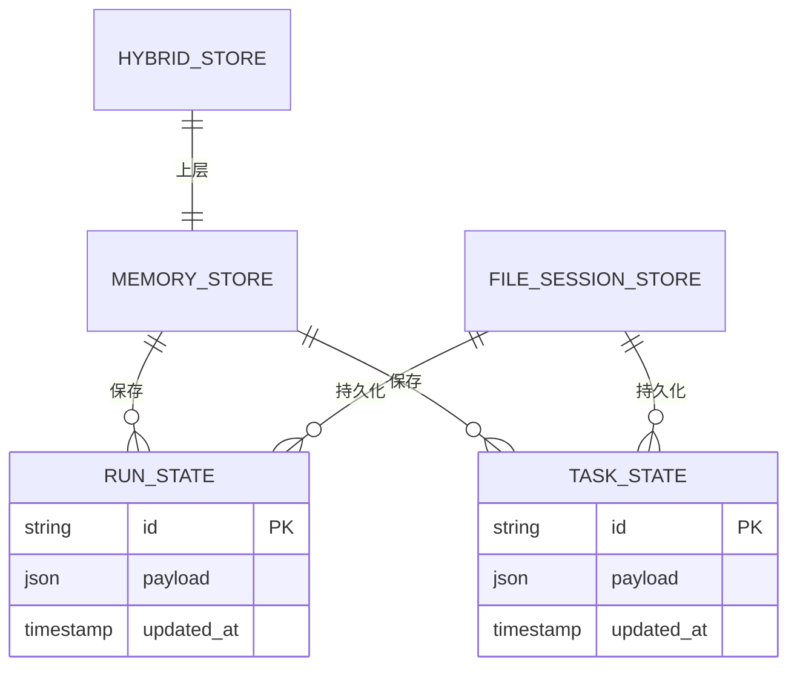
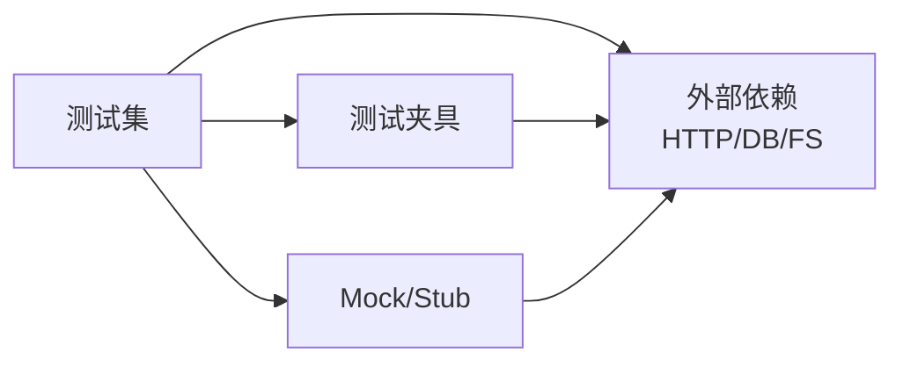

# 测试策略

<cite>
**本文引用的文件**   
- [vitest.config.ts](file://engine/vitest.config.ts)
- [package.json](file://engine/package.json)
- [pnpm-workspace.yaml](file://engine/pnpm-workspace.yaml)
- [tsconfig.json](file://engine/tsconfig.json)
- [Dockerfile](file://engine/Dockerfile)
- [docker-compose.yml](file://engine/docker-compose.yml)
- [http-server-test-harness.ts](file://engine/tests/http-server-test-harness.ts)
- [loop-test-harness.ts](file://engine/tests/loop-test-harness.ts)
- [runtime-kernel-e2e.test.ts](file://engine/tests/runtime-kernel-e2e.test.ts)
- [runtime-kernel.test.ts](file://engine/tests/runtime-kernel.test.ts)
- [tool-runtime-v3.test.ts](file://engine/tests/tool-runtime-v3.test.ts)
- [http-server.test.ts](file://engine/tests/http-server.test.ts)
- [mcp-tool-provider.test.ts](file://engine/tests/mcp-tool-provider.test.ts)
- [web-tool-provider.test.ts](file://engine/tests/web-tool-provider.test.ts)
- [memory-store.test.ts](file://engine/tests/memory-store.test.ts)
- [run-state-store.test.ts](file://engine/tests/run-state-store.test.ts)
- [task-state-store.test.ts](file://engine/tests/task-state-store.test.ts)
- [hybrid-store.test.ts](file://engine/tests/hybrid-store.test.ts)
- [file-session-store-integration.test.ts](file://engine/tests/file-session-store-integration.test.ts)
- [model-client.test.ts](file://engine/tests/model-client.test.ts)
- [delegation-runtime.test.ts](file://engine/tests/delegation-runtime.test.ts)
- [execution-graph.test.ts](file://engine/tests/execution-graph.test.ts)
- [opentelemetry.test.ts](file://engine/tests/opentelemetry.test.ts)
- [serve.test.ts](file://engine/tests/serve.test.ts)
- [verify-crash-recovery.mjs](file://engine/scripts/verify-crash-recovery.mjs)
- [verify-evented-a2a.mjs](file://engine/scripts/verify-evented-a2a.mjs)
- [verify-sqlite.mjs](file://engine/scripts/verify-sqlite.mjs)
</cite>

## 目录
1. [简介](#简介)
2. [项目结构](#项目结构)
3. [核心组件](#核心组件)
4. [架构总览](#架构总览)
5. [详细组件分析](#详细组件分析)
6. [依赖分析](#依赖分析)
7. [性能考虑](#性能考虑)
8. [故障排查指南](#故障排查指南)
9. [结论](#结论)
10. [附录](#附录)

## 简介
本测试策略面向KCoder项目的引擎层与渲染层，覆盖单元测试、集成测试、端到端测试、性能测试以及持续集成中的质量门禁。目标包括：
- 明确测试分层与职责边界
- 规范用例设计、Mock策略与断言方法
- 提供API、数据库、UI自动化与用户流程模拟方案
- 建立负载、压力与基准测试方法论
- 定义测试环境搭建、数据准备、隔离与并行执行
- 在CI中实现自动化测试、覆盖率报告与质量门禁
- 沉淀最佳实践、调试技巧与常见问题解决方案
- 推广TDD实践与工具链使用

## 项目结构
仓库采用多包工作区组织，测试主要集中在 engine 目录下，使用 Vitest 作为统一测试框架，配合 TypeScript 配置与脚本工具完成构建、迁移与验证。

图表来源
- [pnpm-workspace.yaml](file://engine/pnpm-workspace.yaml)
- [vitest.config.ts](file://engine/vitest.config.ts)
- [tsconfig.json](file://engine/tsconfig.json)
- [package.json](file://engine/package.json)
- [Dockerfile](file://engine/Dockerfile)
- [docker-compose.yml](file://engine/docker-compose.yml)

章节来源
- [pnpm-workspace.yaml](file://engine/pnpm-workspace.yaml)
- [vitest.config.ts](file://engine/vitest.config.ts)
- [tsconfig.json](file://engine/tsconfig.json)
- [package.json](file://engine/package.json)

## 核心组件
- 测试框架与运行器
  - 基于 Vitest 的集中式配置，支持TS、ESM、并发与测试隔离。
  - 通过 workspace 与脚本命令统一管理单测、集成与E2E入口。
- 测试辅助与夹具
  - 提供 HTTP 服务测试夹具、循环执行测试夹具等，用于稳定地启动/停止被测服务与编排复杂流程。
- 关键业务测试集
  - 运行时内核、工具运行时、HTTP 服务、模型客户端、存储（内存/混合/文件会话）、任务状态、委托运行时、可观测性（OpenTelemetry）等。
- 验证脚本
  - 针对崩溃恢复、事件驱动A2A、SQLite持久化的专项验证脚本，可作为回归或预发布检查。

章节来源
- [vitest.config.ts](file://engine/vitest.config.ts)
- [http-server-test-harness.ts](file://engine/tests/http-server-test-harness.ts)
- [loop-test-harness.ts](file://engine/tests/loop-test-harness.ts)
- [runtime-kernel-e2e.test.ts](file://engine/tests/runtime-kernel-e2e.test.ts)
- [runtime-kernel.test.ts](file://engine/tests/runtime-kernel.test.ts)
- [tool-runtime-v3.test.ts](file://engine/tests/tool-runtime-v3.test.ts)
- [http-server.test.ts](file://engine/tests/http-server.test.ts)
- [mcp-tool-provider.test.ts](file://engine/tests/mcp-tool-provider.test.ts)
- [web-tool-provider.test.ts](file://engine/tests/web-tool-provider.test.ts)
- [memory-store.test.ts](file://engine/tests/memory-store.test.ts)
- [run-state-store.test.ts](file://engine/tests/run-state-store.test.ts)
- [task-state-store.test.ts](file://engine/tests/task-state-store.test.ts)
- [hybrid-store.test.ts](file://engine/tests/hybrid-store.test.ts)
- [file-session-store-integration.test.ts](file://engine/tests/file-session-store-integration.test.ts)
- [model-client.test.ts](file://engine/tests/model-client.test.ts)
- [delegation-runtime.test.ts](file://engine/tests/delegation-runtime.test.ts)
- [execution-graph.test.ts](file://engine/tests/execution-graph.test.ts)
- [opentelemetry.test.ts](file://engine/tests/opentelemetry.test.ts)
- [serve.test.ts](file://engine/tests/serve.test.ts)
- [verify-crash-recovery.mjs](file://engine/scripts/verify-crash-recovery.mjs)
- [verify-evented-a2a.mjs](file://engine/scripts/verify-evented-a2a.mjs)
- [verify-sqlite.mjs](file://engine/scripts/verify-sqlite.mjs)

## 架构总览
下图展示测试体系的分层与交互关系：单元/集成/E2E 分别聚焦不同范围；测试夹具与脚本贯穿各层；容器化与CI支撑环境与门禁。

图表来源
- [http-server-test-harness.ts](file://engine/tests/http-server-test-harness.ts)
- [loop-test-harness.ts](file://engine/tests/loop-test-harness.ts)
- [verify-crash-recovery.mjs](file://engine/scripts/verify-crash-recovery.mjs)
- [verify-evented-a2a.mjs](file://engine/scripts/verify-evented-a2a.mjs)
- [verify-sqlite.mjs](file://engine/scripts/verify-sqlite.mjs)
- [Dockerfile](file://engine/Dockerfile)
- [docker-compose.yml](file://engine/docker-compose.yml)

## 详细组件分析

### 测试框架与运行配置（Vitest）
- 目标
  - 统一测试入口、TS编译、模块解析、并发与隔离策略。
- 关键点
  - 通过配置文件启用必要的插件与全局设置，确保跨包一致行为。
  - 结合工作区与脚本命令，区分单测、集成与E2E执行路径。
- 建议
  - 为不同层级配置不同的超时、重试与资源清理钩子。
  - 对网络/IO密集的用例进行分组与限流，避免相互干扰。

章节来源
- [vitest.config.ts](file://engine/vitest.config.ts)
- [package.json](file://engine/package.json)
- [pnpm-workspace.yaml](file://engine/pnpm-workspace.yaml)
- [tsconfig.json](file://engine/tsconfig.json)

### HTTP 服务测试夹具与API测试
- 目标
  - 快速启动/停止HTTP服务，提供稳定的请求/响应断言环境。
- 关键点
  - 夹具负责生命周期管理、端口分配、健康检查与清理。
  - API测试覆盖路由、鉴权、错误码、幂等性与异常分支。
- 建议
  - 使用独立端口与临时数据目录，保证并行安全。
  - 对第三方依赖进行Mock或替换为轻量实现。

图表来源
- [http-server-test-harness.ts](file://engine/tests/http-server-test-harness.ts)
- [http-server.test.ts](file://engine/tests/http-server.test.ts)

章节来源
- [http-server-test-harness.ts](file://engine/tests/http-server-test-harness.ts)
- [http-server.test.ts](file://engine/tests/http-server.test.ts)

### 循环执行与运行时内核测试
- 目标
  - 验证内核调度、循环控制、中间件与治理策略的正确性。
- 关键点
  - 循环夹具用于编排多轮对话/任务推进，便于复现复杂场景。
  - 内核测试覆盖正常路径、中断恢复、预算与契约校验。
- 建议
  - 将长耗时用例放入集成组，限制并发度。
  - 对时间相关逻辑使用可控时钟或延迟注入。

图表来源
- [loop-test-harness.ts](file://engine/tests/loop-test-harness.ts)
- [runtime-kernel.test.ts](file://engine/tests/runtime-kernel.test.ts)
- [runtime-kernel-e2e.test.ts](file://engine/tests/runtime-kernel-e2e.test.ts)

章节来源
- [loop-test-harness.ts](file://engine/tests/loop-test-harness.ts)
- [runtime-kernel.test.ts](file://engine/tests/runtime-kernel.test.ts)
- [runtime-kernel-e2e.test.ts](file://engine/tests/runtime-kernel-e2e.test.ts)

### 工具运行时与提供者（MCP/Web）
- 目标
  - 验证工具协调、调用协议、错误传播与资源管理。
- 关键点
  - 工具运行时测试覆盖参数校验、结果聚合、超时与重试。
  - MCP/Web提供者测试关注协议适配、鉴权与传输可靠性。
- 建议
  - 对网络I/O与外部系统调用进行Mock，确保可重复性。
  - 对大对象输出进行采样断言，避免内存压力。

图表来源
- [tool-runtime-v3.test.ts](file://engine/tests/tool-runtime-v3.test.ts)
- [mcp-tool-provider.test.ts](file://engine/tests/mcp-tool-provider.test.ts)
- [web-tool-provider.test.ts](file://engine/tests/web-tool-provider.test.ts)

章节来源
- [tool-runtime-v3.test.ts](file://engine/tests/tool-runtime-v3.test.ts)
- [mcp-tool-provider.test.ts](file://engine/tests/mcp-tool-provider.test.ts)
- [web-tool-provider.test.ts](file://engine/tests/web-tool-provider.test.ts)

### 存储层测试（内存/混合/文件会话）
- 目标
  - 验证状态持久化、一致性、事务与恢复能力。
- 关键点
  - 内存存储侧重正确性与并发安全。
  - 混合存储关注缓存命中、降级与回源。
  - 文件会话存储关注序列化、损坏恢复与迁移。
- 建议
  - 使用临时目录与随机前缀，避免并行冲突。
  - 对写入路径增加破坏性测试（如断电、磁盘满）。

图表来源
- [memory-store.test.ts](file://engine/tests/memory-store.test.ts)
- [run-state-store.test.ts](file://engine/tests/run-state-store.test.ts)
- [task-state-store.test.ts](file://engine/tests/task-state-store.test.ts)
- [hybrid-store.test.ts](file://engine/tests/hybrid-store.test.ts)
- [file-session-store-integration.test.ts](file://engine/tests/file-session-store-integration.test.ts)

章节来源
- [memory-store.test.ts](file://engine/tests/memory-store.test.ts)
- [run-state-store.test.ts](file://engine/tests/run-state-store.test.ts)
- [task-state-store.test.ts](file://engine/tests/task-state-store.test.ts)
- [hybrid-store.test.ts](file://engine/tests/hybrid-store.test.ts)
- [file-session-store-integration.test.ts](file://engine/tests/file-session-store-integration.test.ts)

### 模型客户端与委托运行时
- 目标
  - 验证模型调用封装、重试与错误分类；委托任务的创建、委派与回收。
- 关键点
  - 模型客户端测试覆盖连接、鉴权、速率限制与失败回退。
  - 委托运行时测试关注任务拆分、状态同步与最终一致性。
- 建议
  - 对模型接口进行Mock，固定响应以增强稳定性。
  - 对异步任务加入等待与轮询机制，避免竞态。

章节来源
- [model-client.test.ts](file://engine/tests/model-client.test.ts)
- [delegation-runtime.test.ts](file://engine/tests/delegation-runtime.test.ts)

### 执行图与可观测性
- 目标
  - 验证执行图的构建、调度与回溯；链路追踪与指标上报。
- 关键点
  - 执行图测试覆盖节点依赖、拓扑排序与异常传播。
  - OpenTelemetry测试关注Span生成、采样与导出。
- 建议
  - 对Tracer进行Mock或注入本地收集器，避免外部依赖。
  - 对大规模图用例进行分片执行。

章节来源
- [execution-graph.test.ts](file://engine/tests/execution-graph.test.ts)
- [opentelemetry.test.ts](file://engine/tests/opentelemetry.test.ts)

### 服务启动与进程管理
- 目标
  - 验证服务启动、优雅关闭、端口占用与进程间通信。
- 关键点
  - 服务测试覆盖启动参数、健康检查与日志输出。
- 建议
  - 使用动态端口与进程池，避免端口冲突。
  - 对长时间运行的服务引入健康探针与自动重启。

章节来源
- [serve.test.ts](file://engine/tests/serve.test.ts)

### 专项验证脚本（崩溃恢复/事件驱动A2A/SQLite）
- 目标
  - 在真实环境中验证关键路径的健壮性与兼容性。
- 关键点
  - 崩溃恢复脚本模拟异常并验证恢复。
  - 事件驱动A2A脚本验证消息流转与幂等。
  - SQLite脚本验证持久化与迁移。
- 建议
  - 将脚本纳入预发布流水线，作为质量门禁的一部分。
  - 输出结构化日志与指标，便于定位问题。

章节来源
- [verify-crash-recovery.mjs](file://engine/scripts/verify-crash-recovery.mjs)
- [verify-evented-a2a.mjs](file://engine/scripts/verify-evented-a2a.mjs)
- [verify-sqlite.mjs](file://engine/scripts/verify-sqlite.mjs)

## 依赖分析
- 内部依赖
  - 测试夹具被多个测试集复用，降低耦合度并提升一致性。
  - 存储类测试共享通用断言与构造器，提高内聚性。
- 外部依赖
  - HTTP服务、模型客户端、文件系统与数据库访问均通过夹具或Mock隔离。
- 潜在风险
  - 并行执行时的端口/文件竞争需严格隔离。
  - 第三方服务不稳定时，应提供降级与重试策略。

图表来源
- [http-server-test-harness.ts](file://engine/tests/http-server-test-harness.ts)
- [loop-test-harness.ts](file://engine/tests/loop-test-harness.ts)
- [memory-store.test.ts](file://engine/tests/memory-store.test.ts)
- [hybrid-store.test.ts](file://engine/tests/hybrid-store.test.ts)

章节来源
- [http-server-test-harness.ts](file://engine/tests/http-server-test-harness.ts)
- [loop-test-harness.ts](file://engine/tests/loop-test-harness.ts)
- [memory-store.test.ts](file://engine/tests/memory-store.test.ts)
- [hybrid-store.test.ts](file://engine/tests/hybrid-store.test.ts)

## 性能考虑
- 负载测试
  - 使用HTTP夹具批量发起请求，统计吞吐、P95/P99延迟与错误率。
  - 逐步增加并发度，识别瓶颈点（CPU/IO/锁竞争）。
- 压力测试
  - 模拟峰值流量与异常输入，验证系统弹性与自愈能力。
  - 对存储层进行高写压，观察持久化延迟与抖动。
- 基准测试
  - 对关键算法与序列化路径建立基线，防止回归。
  - 定期对比历史数据，评估优化效果。
- 建议
  - 在CI中仅运行关键路径的基准，避免拖慢流水线。
  - 对长耗时用例进行分组与限流，保障稳定性。

[本节为通用指导，不直接分析具体文件]

## 故障排查指南
- 常见现象
  - 端口占用导致服务启动失败
  - 并行测试互相污染（文件/状态）
  - 网络超时与第三方服务不可用
  - 内存泄漏与堆增长
- 排查步骤
  - 使用夹具提供的端口分配与健康检查，确认服务就绪。
  - 为每个测试用例创建独立的数据目录与命名空间。
  - 对网络调用添加重试与超时，必要时切换至Mock。
  - 使用堆快照与火焰图定位热点与泄漏。
- 实用技巧
  - 开启详细日志与Trace ID，关联上下游调用。
  - 对失败用例单独重跑，缩小范围。
  - 利用专项验证脚本复现生产问题。

章节来源
- [http-server-test-harness.ts](file://engine/tests/http-server-test-harness.ts)
- [verify-crash-recovery.mjs](file://engine/scripts/verify-crash-recovery.mjs)
- [verify-evented-a2a.mjs](file://engine/scripts/verify-evented-a2a.mjs)
- [verify-sqlite.mjs](file://engine/scripts/verify-sqlite.mjs)

## 结论
通过分层清晰的测试体系、完善的夹具与脚本、严格的隔离与并行策略，以及CI中的质量门禁，KCoder可在保持开发效率的同时，持续提升代码质量与系统稳定性。建议持续完善覆盖率与基准基线，推动TDD落地与团队规范统一。

[本节为总结，不直接分析具体文件]

## 附录

### 单元测试编写规范
- 用例设计
  - 遵循Given-When-Then结构，覆盖正常、边界与异常路径。
  - 对异步与并发场景显式断言时序与状态。
- Mock策略
  - 优先Mock外部依赖（网络、文件系统、数据库），保留核心逻辑真实执行。
  - 使用夹具提供的工厂函数与桩实现，减少样板代码。
- 断言方法
  - 使用类型安全的断言库，避免字符串匹配。
  - 对复杂对象进行结构化比较与字段级断言。

[本节为通用指导，不直接分析具体文件]

### 集成测试实现要点
- 组件集成
  - 使用夹具组装子系统，验证端到端交互。
  - 对中间件、管道与事件总线进行组合测试。
- API测试
  - 覆盖所有路由、鉴权、参数校验与错误码。
  - 对幂等与去重进行专门验证。
- 数据库测试
  - 使用临时数据库或内存实现，保证可重复性。
  - 验证迁移、回滚与数据一致性。

章节来源
- [http-server.test.ts](file://engine/tests/http-server.test.ts)
- [file-session-store-integration.test.ts](file://engine/tests/file-session-store-integration.test.ts)
- [hybrid-store.test.ts](file://engine/tests/hybrid-store.test.ts)

### 端到端测试方案
- UI自动化测试
  - 基于渲染层页面进行元素定位与交互，验证主流程。
  - 使用截图与录屏辅助定位问题。
- 用户流程模拟
  - 从登录到核心功能的全链路演练，覆盖关键业务闭环。
  - 对异常路径（网络中断、权限不足）进行模拟。

[本节为通用指导，不直接分析具体文件]

### 测试环境搭建
- 测试数据准备
  - 使用种子数据与夹具生成器，保证数据一致性与多样性。
- 环境隔离
  - 每个用例独立端口、目录与命名空间，避免交叉影响。
- 并行执行
  - 合理设置并发度，按模块分组执行，缩短整体时长。

章节来源
- [vitest.config.ts](file://engine/vitest.config.ts)
- [http-server-test-harness.ts](file://engine/tests/http-server-test-harness.ts)
- [loop-test-harness.ts](file://engine/tests/loop-test-harness.ts)

### 持续集成中的测试流程
- 自动化测试
  - 在CI中依次执行单元、集成与E2E，失败即阻断。
- 质量门禁
  - 设定最低覆盖率阈值与关键路径通过率。
- 覆盖率报告
  - 生成HTML与JSON报告，归档并对比趋势。

章节来源
- [package.json](file://engine/package.json)
- [vitest.config.ts](file://engine/vitest.config.ts)

### 测试最佳实践与代码规范
- 命名与结构
  - 文件名与用例名清晰表达意图，按模块组织。
- 可维护性
  - 抽取公共夹具与断言，减少重复。
- 可读性
  - 注释关键假设与前置条件，避免黑盒用例。

[本节为通用指导，不直接分析具体文件]

### 测试调试技巧与常见问题
- 调试技巧
  - 使用交互式模式与断点，逐步定位问题。
  - 打印关键状态与上下文，辅助分析。
- 常见问题
  - 端口冲突、文件锁、网络超时、内存溢出等。
  - 通过夹具与隔离策略逐一排除。

章节来源
- [http-server-test-harness.ts](file://engine/tests/http-server-test-harness.ts)
- [verify-crash-recovery.mjs](file://engine/scripts/verify-crash-recovery.mjs)

### 测试驱动开发（TDD）实践
- 红-绿-重构
  - 先写失败用例，再实现最小可用代码，最后重构。
- 小步快跑
  - 频繁提交与运行测试，保持反馈闭环。
- 领域建模
  - 从用例反推接口与数据结构，提升设计质量。

[本节为通用指导，不直接分析具体文件]

### 测试工具与框架使用指南
- Vitest
  - 配置TS、插件与全局钩子，合理使用分组与标签。
- Docker与Compose
  - 容器化测试环境，统一依赖版本与运行环境。
- 脚本工具
  - 使用verify脚本进行专项验证与回归检查。

章节来源
- [vitest.config.ts](file://engine/vitest.config.ts)
- [Dockerfile](file://engine/Dockerfile)
- [docker-compose.yml](file://engine/docker-compose.yml)
- [verify-crash-recovery.mjs](file://engine/scripts/verify-crash-recovery.mjs)
- [verify-evented-a2a.mjs](file://engine/scripts/verify-evented-a2a.mjs)
- [verify-sqlite.mjs](file://engine/scripts/verify-sqlite.mjs)