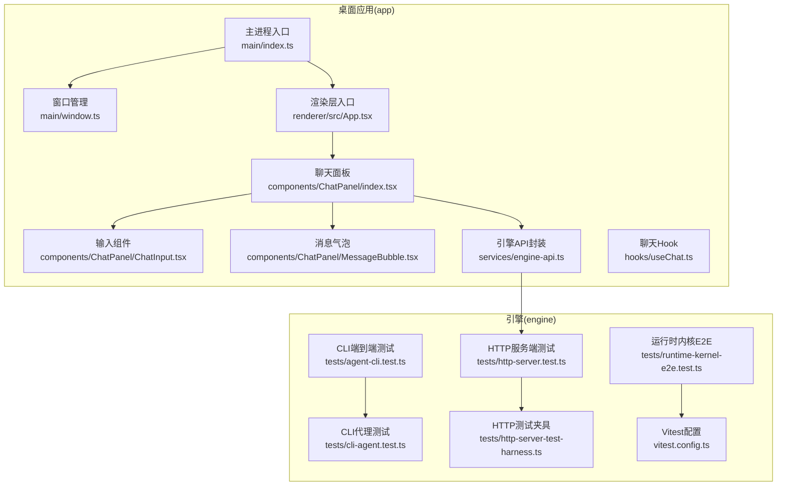
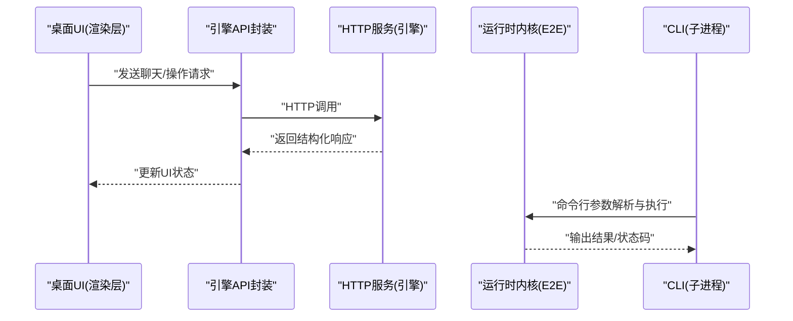
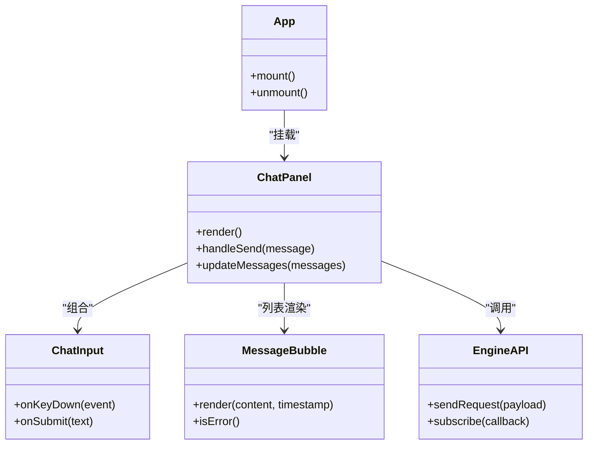
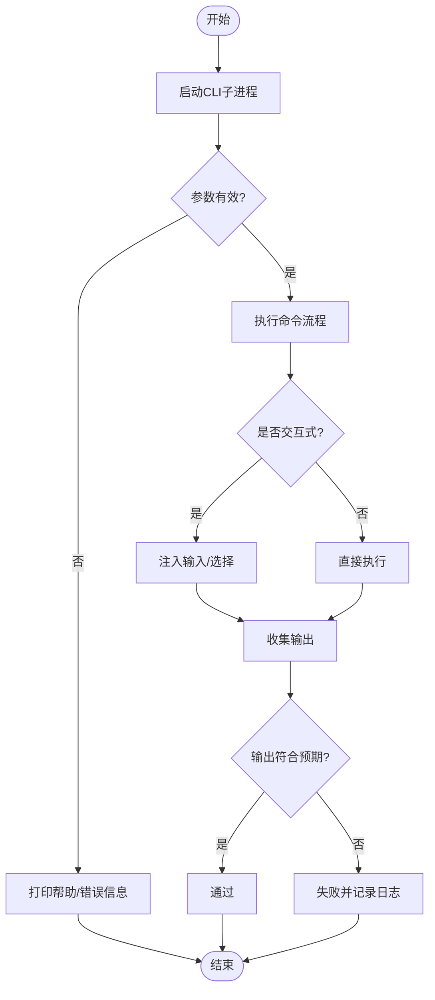
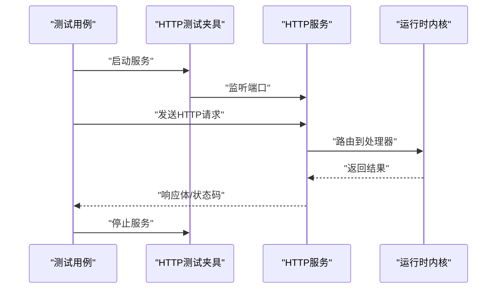
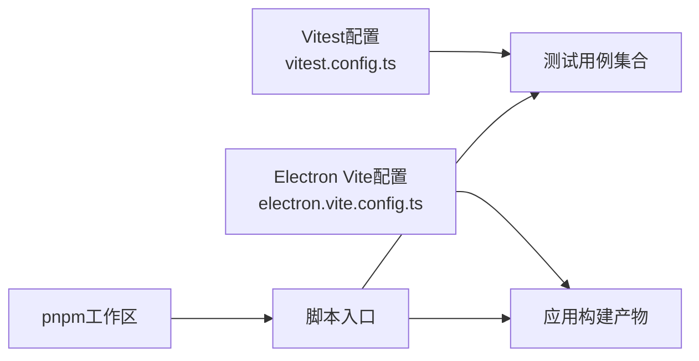

# 端到端测试

<cite>
**本文引用的文件**   
- [package.json](file://app/package.json)
- [electron.vite.config.ts](file://app/electron.vite.config.ts)
- [index.ts](file://app/main/index.ts)
- [window.ts](file://app/main/window.ts)
- [engine-api.ts](file://app/renderer/src/services/engine-api.ts)
- [App.tsx](file://app/renderer/src/App.tsx)
- [ChatInput.tsx](file://app/renderer/src/components/ChatPanel/ChatInput.tsx)
- [MessageBubble.tsx](file://app/renderer/src/components/ChatPanel/MessageBubble.tsx)
- [index.tsx](file://app/renderer/src/components/ChatPanel/index.tsx)
- [useChat.ts](file://app/renderer/src/hooks/useChat.ts)
- [agent-cli.test.ts](file://engine/tests/agent-cli.test.ts)
- [cli-agent.test.ts](file://engine/tests/cli-agent.test.ts)
- [http-server.test.ts](file://engine/tests/http-server.test.ts)
- [http-server-test-harness.ts](file://engine/tests/http-server-test-harness.ts)
- [runtime-kernel-e2e.test.ts](file://engine/tests/runtime-kernel-e2e.test.ts)
- [vitest.config.ts](file://engine/vitest.config.ts)
</cite>

## 目录
1. [简介](#简介)
2. [项目结构](#项目结构)
3. [核心组件](#核心组件)
4. [架构总览](#架构总览)
5. [详细组件分析](#详细组件分析)
6. [依赖分析](#依赖分析)
7. [性能考虑](#性能考虑)
8. [故障排查指南](#故障排查指南)
9. [结论](#结论)
10. [附录](#附录)

## 简介
本文件为KCoder项目的端到端（E2E）测试文档，覆盖以下目标：
- 桌面应用（Electron）UI自动化测试方案：用户界面交互、操作流程模拟、窗口状态管理。
- CLI工具的端到端测试实现：命令行参数解析、交互式会话、输出结果验证。
- 跨平台兼容性测试策略：Windows、macOS、Linux平台的执行与差异处理。
- 测试环境搭建与管理：应用启动、依赖安装、测试数据准备。
- 用户行为模拟方法：鼠标点击、键盘输入、文件拖拽等。
- 测试报告生成与失败案例分析最佳实践。

## 项目结构
KCoder采用多包工作区，包含桌面应用（app）、引擎与服务（engine）两大主体。E2E测试主要分布在engine/tests中，针对CLI、HTTP服务、运行时内核等进行集成与端到端验证；桌面应用的UI自动化测试建议基于现有渲染层组件与服务接口进行编排。

图表来源
- [index.ts](file://app/main/index.ts)
- [window.ts](file://app/main/window.ts)
- [App.tsx](file://app/renderer/src/App.tsx)
- [index.tsx](file://app/renderer/src/components/ChatPanel/index.tsx)
- [ChatInput.tsx](file://app/renderer/src/components/ChatPanel/ChatInput.tsx)
- [MessageBubble.tsx](file://app/renderer/src/components/ChatPanel/MessageBubble.tsx)
- [engine-api.ts](file://app/renderer/src/services/engine-api.ts)
- [agent-cli.test.ts](file://engine/tests/agent-cli.test.ts)
- [cli-agent.test.ts](file://engine/tests/cli-agent.test.ts)
- [http-server.test.ts](file://engine/tests/http-server.test.ts)
- [http-server-test-harness.ts](file://engine/tests/http-server-test-harness.ts)
- [runtime-kernel-e2e.test.ts](file://engine/tests/runtime-kernel-e2e.test.ts)
- [vitest.config.ts](file://engine/vitest.config.ts)

章节来源
- [package.json](file://app/package.json)
- [electron.vite.config.ts](file://app/electron.vite.config.ts)
- [index.ts](file://app/main/index.ts)
- [window.ts](file://app/main/window.ts)
- [App.tsx](file://app/renderer/src/App.tsx)
- [ChatInput.tsx](file://app/renderer/src/components/ChatPanel/ChatInput.tsx)
- [MessageBubble.tsx](file://app/renderer/src/components/ChatPanel/MessageBubble.tsx)
- [index.tsx](file://app/renderer/src/components/ChatPanel/index.tsx)
- [engine-api.ts](file://app/renderer/src/services/engine-api.ts)
- [agent-cli.test.ts](file://engine/tests/agent-cli.test.ts)
- [cli-agent.test.ts](file://engine/tests/cli-agent.test.ts)
- [http-server.test.ts](file://engine/tests/http-server.test.ts)
- [http-server-test-harness.ts](file://engine/tests/http-server-test-harness.ts)
- [runtime-kernel-e2e.test.ts](file://engine/tests/runtime-kernel-e2e.test.ts)
- [vitest.config.ts](file://engine/vitest.config.ts)

## 核心组件
- 桌面应用UI自动化测试要点
  - 通过渲染层组件（聊天面板、输入框、消息气泡）作为可定位的UI锚点，结合主进程窗口生命周期进行断言。
  - 使用渲染层提供的引擎API封装发起请求，确保UI与后端引擎的端到端链路被覆盖。
- CLI端到端测试要点
  - 以子进程方式启动CLI，注入命令行参数，捕获标准输出/错误流，校验退出码与关键文本片段。
  - 对交互式场景，提供伪终端或脚本化输入，验证提示符响应与流程分支。
- HTTP服务与内核E2E
  - 使用测试夹具快速启动HTTP服务，构造请求并断言响应结构与业务语义。
  - 运行内核级E2E用例，覆盖任务编排、工具调用、事件总线等关键路径。

章节来源
- [engine-api.ts](file://app/renderer/src/services/engine-api.ts)
- [agent-cli.test.ts](file://engine/tests/agent-cli.test.ts)
- [cli-agent.test.ts](file://engine/tests/cli-agent.test.ts)
- [http-server.test.ts](file://engine/tests/http-server.test.ts)
- [http-server-test-harness.ts](file://engine/tests/http-server-test-harness.ts)
- [runtime-kernel-e2e.test.ts](file://engine/tests/runtime-kernel-e2e.test.ts)

## 架构总览
下图展示从桌面应用到引擎服务的端到端调用链路与测试切入点。

图表来源
- [engine-api.ts](file://app/renderer/src/services/engine-api.ts)
- [http-server.test.ts](file://engine/tests/http-server.test.ts)
- [runtime-kernel-e2e.test.ts](file://engine/tests/runtime-kernel-e2e.test.ts)
- [agent-cli.test.ts](file://engine/tests/agent-cli.test.ts)

## 详细组件分析

### 桌面应用UI自动化测试
- 测试范围
  - 聊天面板的输入、发送、消息渲染与滚动。
  - 设置面板的开关切换与持久化。
  - 状态栏信息更新与错误提示。
- 关键锚点
  - 输入框组件用于键盘输入与回车发送。
  - 消息气泡用于断言内容渲染与时间戳。
  - 聊天面板容器用于断言布局与可见性。
- 窗口状态管理
  - 主进程负责创建与销毁窗口，测试需等待窗口就绪后再进行交互。
  - 断言窗口大小、位置、最小化/最大化状态变化。

图表来源
- [index.tsx](file://app/renderer/src/components/ChatPanel/index.tsx)
- [ChatInput.tsx](file://app/renderer/src/components/ChatPanel/ChatInput.tsx)
- [MessageBubble.tsx](file://app/renderer/src/components/ChatPanel/MessageBubble.tsx)
- [App.tsx](file://app/renderer/src/App.tsx)
- [engine-api.ts](file://app/renderer/src/services/engine-api.ts)

章节来源
- [index.tsx](file://app/renderer/src/components/ChatPanel/index.tsx)
- [ChatInput.tsx](file://app/renderer/src/components/ChatPanel/ChatInput.tsx)
- [MessageBubble.tsx](file://app/renderer/src/components/ChatPanel/MessageBubble.tsx)
- [App.tsx](file://app/renderer/src/App.tsx)
- [engine-api.ts](file://app/renderer/src/services/engine-api.ts)

#### 用户行为模拟方法
- 鼠标点击
  - 在输入框或按钮上触发click事件，断言后续UI更新。
- 键盘输入
  - 向输入框写入字符序列，模拟回车发送，断言消息列表新增项。
- 文件拖拽
  - 在文件树或编辑器区域触发dragover/drop事件，断言文件加载与预览。
- 窗口操作
  - 通过主进程暴露的IPC或测试夹具控制窗口尺寸与焦点，断言布局重排。

章节来源
- [ChatInput.tsx](file://app/renderer/src/components/ChatPanel/ChatInput.tsx)
- [MessageBubble.tsx](file://app/renderer/src/components/ChatPanel/MessageBubble.tsx)
- [index.tsx](file://app/renderer/src/components/ChatPanel/index.tsx)
- [window.ts](file://app/main/window.ts)

### CLI工具的端到端测试
- 命令行参数解析
  - 启动CLI子进程，传入不同参数组合，断言帮助信息、错误提示与退出码。
- 交互式会话测试
  - 使用伪终端或脚本化输入驱动CLI，验证提示符、确认对话框与分支逻辑。
- 输出结果验证
  - 捕获stdout/stderr，匹配关键字段与JSON结构，断言成功/失败路径。

图表来源
- [agent-cli.test.ts](file://engine/tests/agent-cli.test.ts)
- [cli-agent.test.ts](file://engine/tests/cli-agent.test.ts)

章节来源
- [agent-cli.test.ts](file://engine/tests/agent-cli.test.ts)
- [cli-agent.test.ts](file://engine/tests/cli-agent.test.ts)

### HTTP服务与运行时内核E2E
- HTTP服务测试
  - 使用测试夹具启动服务，构造请求并断言响应体、状态码与头部。
- 运行时内核E2E
  - 覆盖任务编排、工具调用、事件总线、中间件治理等关键路径。
- 测试夹具
  - 提供统一的HTTP服务启动、停止与清理能力，确保测试隔离与可重复性。

图表来源
- [http-server.test.ts](file://engine/tests/http-server.test.ts)
- [http-server-test-harness.ts](file://engine/tests/http-server-test-harness.ts)
- [runtime-kernel-e2e.test.ts](file://engine/tests/runtime-kernel-e2e.test.ts)

章节来源
- [http-server.test.ts](file://engine/tests/http-server.test.ts)
- [http-server-test-harness.ts](file://engine/tests/http-server-test-harness.ts)
- [runtime-kernel-e2e.test.ts](file://engine/tests/runtime-kernel-e2e.test.ts)

## 依赖分析
- 测试框架与配置
  - 使用Vitest进行单元测试与集成测试，配置文件位于engine根目录。
- 桌面应用构建与打包
  - Electron Vite配置用于开发/构建流程，影响测试环境的启动与资源加载。
- 工作区与包管理
  - pnpm工作区统一依赖版本与脚本入口，便于在多包环境下运行E2E。

图表来源
- [vitest.config.ts](file://engine/vitest.config.ts)
- [electron.vite.config.ts](file://app/electron.vite.config.ts)
- [package.json](file://app/package.json)

章节来源
- [vitest.config.ts](file://engine/vitest.config.ts)
- [electron.vite.config.ts](file://app/electron.vite.config.ts)
- [package.json](file://app/package.json)

## 性能考虑
- 并行执行
  - 将UI、CLI、HTTP与内核E2E用例分组并行，缩短整体时长。
- 资源隔离
  - 每个测试套件独立启动/停止服务与窗口，避免共享状态导致的竞态。
- 超时与重试
  - 合理设置网络与I/O超时，对不稳定外部依赖增加重试与退避策略。
- 快照与对比
  - 对UI截图与输出快照进行增量对比，减少全量比对开销。

[本节为通用指导，不直接分析具体文件]

## 故障排查指南
- 常见失败原因
  - 端口占用导致HTTP服务无法启动。
  - 窗口未就绪即进行交互导致断言失败。
  - CLI输出格式变更导致正则匹配失败。
- 定位步骤
  - 查看测试夹具日志与服务启动输出。
  - 启用调试模式，捕获完整请求/响应与窗口事件。
  - 复现最小用例，逐步缩小问题范围。
- 恢复措施
  - 随机端口分配与自动释放。
  - 等待条件与轮询机制确保UI稳定。
  - 输出契约化校验，避免脆弱匹配。

章节来源
- [http-server-test-harness.ts](file://engine/tests/http-server-test-harness.ts)
- [window.ts](file://app/main/window.ts)
- [agent-cli.test.ts](file://engine/tests/agent-cli.test.ts)

## 结论
通过分层化的E2E策略，KCoder能够覆盖从桌面UI到CLI与HTTP服务的关键路径。结合严格的测试夹具、清晰的断言契约与跨平台执行策略，可在保证质量的同时提升回归效率。建议在CI中固化并行执行与报告归档，持续优化失败分析与回归闭环。

[本节为总结性内容，不直接分析具体文件]

## 附录
- 测试环境搭建与管理
  - 安装依赖：在工作区根目录执行包管理器安装脚本。
  - 构建应用：使用Electron Vite配置进行开发与构建。
  - 启动服务：通过测试夹具或本地脚本启动HTTP服务。
  - 准备数据：使用fixtures与种子脚本初始化测试数据集。
- 跨平台兼容性测试策略
  - Windows：注意路径分隔符与行尾符差异，使用统一转义与规范化。
  - macOS：权限与沙箱限制可能影响文件访问与窗口操作。
  - Linux：字体与渲染差异可能导致UI快照不一致，建议使用容差比较。
- 测试报告生成与失败案例分析
  - 使用Vitest内置报告插件输出HTML/JSON报告。
  - 失败用例附带截图、日志与上下文快照，便于快速定位。
  - 建立失败案例库，定期复盘与修复根因。

章节来源
- [vitest.config.ts](file://engine/vitest.config.ts)
- [electron.vite.config.ts](file://app/electron.vite.config.ts)
- [package.json](file://app/package.json)