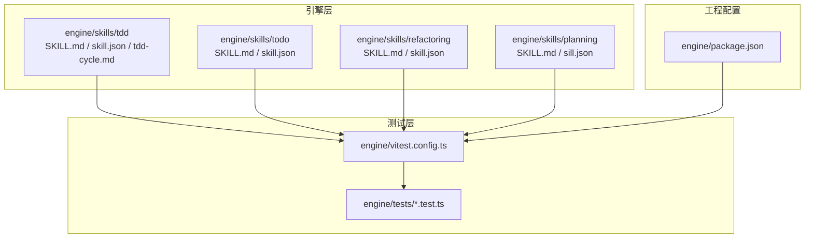
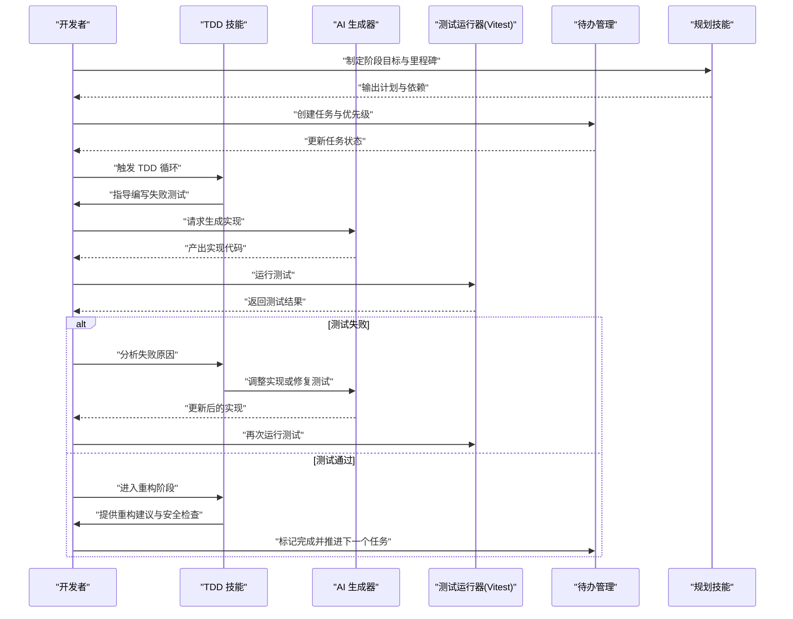
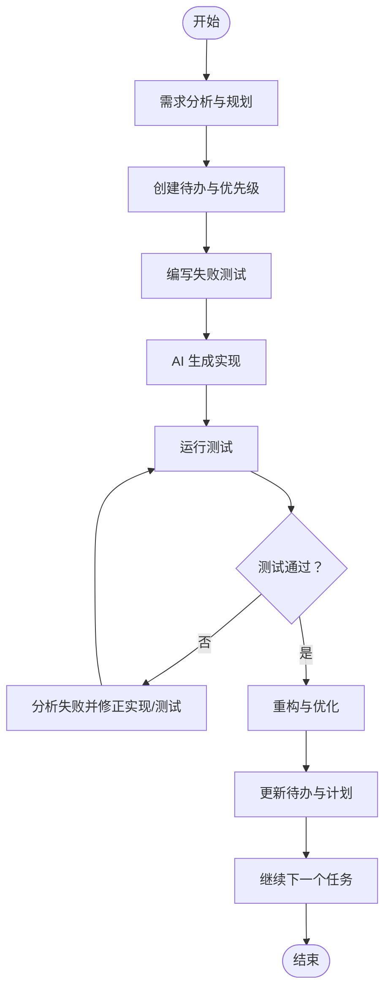
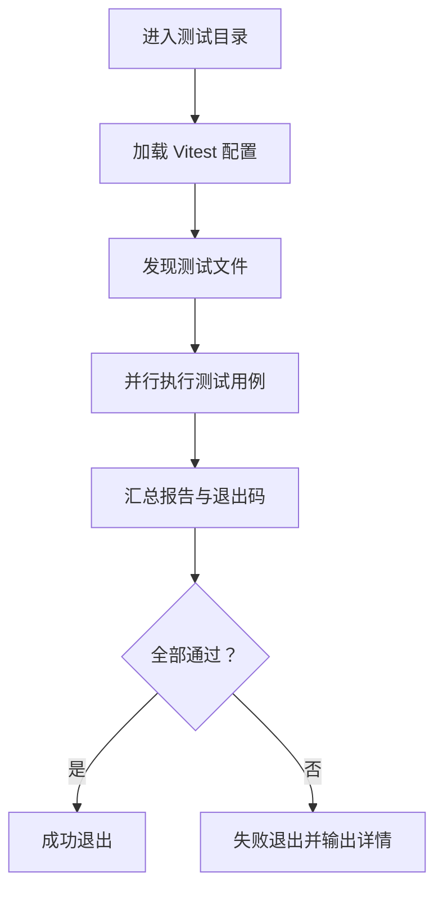
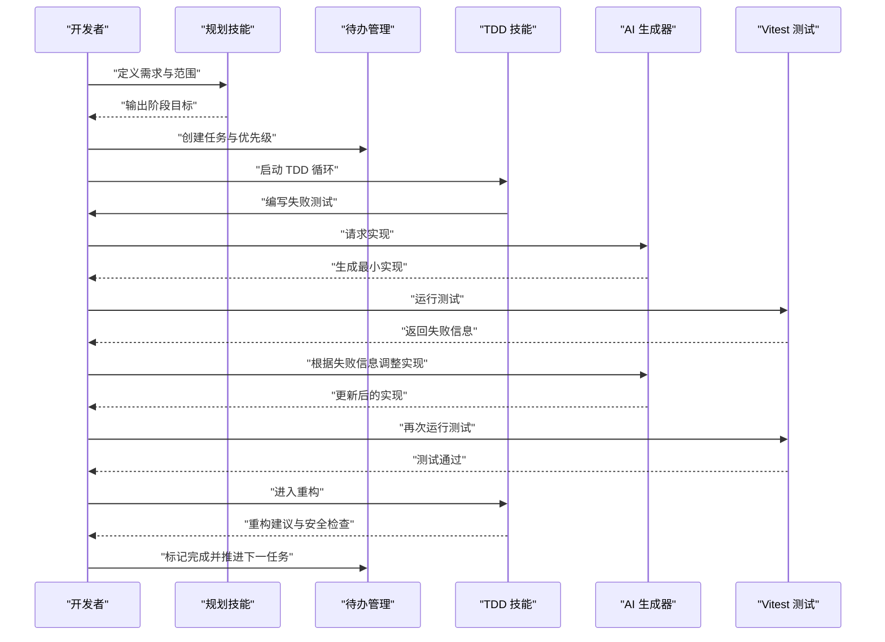
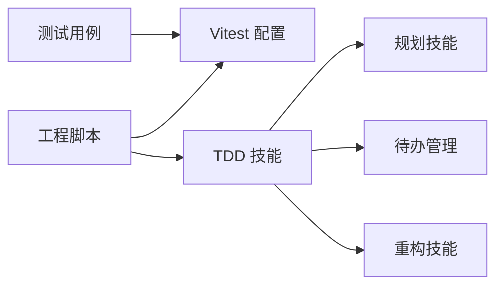

# TDD开发工作流

<cite>
**本文引用的文件**   
- [engine/skills/tdd/SKILL.md](file://engine/skills/tdd/SKILL.md)
- [engine/skills/tdd/skill.json](file://engine/skills/tdd/skill.json)
- [engine/skills/tdd/tdd-cycle.md](file://engine/skills/tdd/tdd-cycle.md)
- [engine/skills/todo/SKILL.md](file://engine/skills/todo/SKILL.md)
- [engine/skills/todo/skill.json](file://engine/skills/todo/skill.json)
- [engine/skills/refactoring/SKILL.md](file://engine/skills/refactoring/SKILL.md)
- [engine/skills/refactoring/skill.json](file://engine/skills/refactoring/skill.json)
- [engine/skills/planning/SKILL.md](file://engine/skills/planning/SKILL.md)
- [engine/skills/planning/sill.json](file://engine/skills/planning/sill.json)
- [engine/vitest.config.ts](file://engine/vitest.config.ts)
- [engine/package.json](file://engine/package.json)
- [engine/tests/loop-runner.test.ts](file://engine/tests/loop-runner.test.ts)
- [engine/tests/runtime-kernel.test.ts](file://engine/tests/runtime-kernel.test.ts)
</cite>

## 目录
1. [简介](#简介)
2. [项目结构](#项目结构)
3. [核心组件](#核心组件)
4. [架构总览](#架构总览)
5. [详细组件分析](#详细组件分析)
6. [依赖分析](#依赖分析)
7. [性能考虑](#性能考虑)
8. [故障排查指南](#故障排查指南)
9. [结论](#结论)
10. [附录](#附录)

## 简介
本指南面向使用 KCoder 进行测试驱动开发（TDD）的工程师与团队，围绕“红-绿-重构”循环，提供从需求到实现、从测试到重构、从本地到持续集成的完整实践路径。文档基于仓库中内置的 TDD 技能与测试基础设施，帮助读者：
- 掌握完整的 TDD 循环流程
- 配置并运行自动化测试
- 制定测试规范与用例设计原则
- 安全地进行重构与优化
- 将 TDD 融入日常开发与持续集成

## 项目结构
KCoder 引擎侧采用多包工作区组织，TDD 相关能力以“技能（Skill）”形式提供，并通过测试框架与脚本支撑自动化执行。关键位置如下：
- 技能定义与说明：位于 engine/skills 下，包含 tdd、todo、refactoring、planning 等
- 测试配置与示例：位于 engine/vitest.config.ts 与 engine/tests 目录
- 工程脚本与入口：位于 engine/package.json 与 scripts 目录

图表来源
- [engine/skills/tdd/SKILL.md](file://engine/skills/tdd/SKILL.md)
- [engine/skills/tdd/skill.json](file://engine/skills/tdd/skill.json)
- [engine/skills/tdd/tdd-cycle.md](file://engine/skills/tdd/tdd-cycle.md)
- [engine/skills/todo/SKILL.md](file://engine/skills/todo/SKILL.md)
- [engine/skills/todo/skill.json](file://engine/skills/todo/skill.json)
- [engine/skills/refactoring/SKILL.md](file://engine/skills/refactoring/SKILL.md)
- [engine/skills/refactoring/skill.json](file://engine/skills/refactoring/skill.json)
- [engine/skills/planning/SKILL.md](file://engine/skills/planning/SKILL.md)
- [engine/skills/planning/sill.json](file://engine/skills/planning/sill.json)
- [engine/vitest.config.ts](file://engine/vitest.config.ts)
- [engine/tests/loop-runner.test.ts](file://engine/tests/loop-runner.test.ts)
- [engine/tests/runtime-kernel.test.ts](file://engine/tests/runtime-kernel.test.ts)
- [engine/package.json](file://engine/package.json)

章节来源
- [engine/skills/tdd/SKILL.md](file://engine/skills/tdd/SKILL.md)
- [engine/skills/tdd/skill.json](file://engine/skills/tdd/skill.json)
- [engine/skills/tdd/tdd-cycle.md](file://engine/skills/tdd/tdd-cycle.md)
- [engine/vitest.config.ts](file://engine/vitest.config.ts)
- [engine/package.json](file://engine/package.json)

## 核心组件
- TDD 技能（tdd）：定义 TDD 工作流、步骤与提示，指导如何编写失败测试、生成实现、运行测试与重构。
- 待办管理（todo）：用于维护任务清单、优先级与迭代计划，辅助在 TDD 过程中拆解需求与跟踪进度。
- 重构技能（refactoring）：提供重构策略与安全边界，确保在保持行为不变的前提下改进代码结构与可读性。
- 规划技能（planning）：用于制定阶段性目标、里程碑与依赖关系，配合 TDD 小步快跑。
- 测试框架（Vitest）：统一测试配置与执行入口，支持单测与集成测试。
- 示例测试：通过现有测试文件展示测试风格与断言方式，便于模仿与扩展。

章节来源
- [engine/skills/tdd/SKILL.md](file://engine/skills/tdd/SKILL.md)
- [engine/skills/todo/SKILL.md](file://engine/skills/todo/SKILL.md)
- [engine/skills/refactoring/SKILL.md](file://engine/skills/refactoring/SKILL.md)
- [engine/skills/planning/SKILL.md](file://engine/skills/planning/SKILL.md)
- [engine/vitest.config.ts](file://engine/vitest.config.ts)
- [engine/tests/loop-runner.test.ts](file://engine/tests/loop-runner.test.ts)
- [engine/tests/runtime-kernel.test.ts](file://engine/tests/runtime-kernel.test.ts)

## 架构总览
下图展示了 TDD 工作流在 KCoder 中的整体交互：开发者在需求驱动下编写测试，AI 根据 TDD 技能生成实现，随后运行测试并依据结果进行重构与优化；同时借助待办与规划技能管理任务与计划。

图表来源
- [engine/skills/tdd/SKILL.md](file://engine/skills/tdd/SKILL.md)
- [engine/skills/tdd/tdd-cycle.md](file://engine/skills/tdd/tdd-cycle.md)
- [engine/skills/todo/SKILL.md](file://engine/skills/todo/SKILL.md)
- [engine/skills/planning/SKILL.md](file://engine/skills/planning/SKILL.md)
- [engine/vitest.config.ts](file://engine/vitest.config.ts)

## 详细组件分析

### TDD 技能与工作流
- 角色与职责
  - TDD 技能：定义“红-绿-重构”循环的步骤、输入输出与约束条件，指导测试先行与最小实现。
  - 规划技能：将需求拆分为可验证的小目标，明确依赖与顺序。
  - 待办管理：记录任务、优先级、状态与备注，形成可追踪的开发计划。
  - 重构技能：提供重构策略、命名与结构优化建议，保证行为不变。
- 典型流程
  - 需求分析：使用规划技能分解目标，使用待办管理建立任务清单。
  - 编写测试：先写失败的测试用例，明确预期行为与边界条件。
  - 生成实现：由 AI 根据测试与 TDD 技能提示生成最小可行实现。
  - 运行测试：使用 Vitest 执行测试，定位失败原因。
  - 重构优化：在测试保护下进行重构，提升可读性与可维护性。
  - 迭代推进：更新待办与计划，进入下一个功能点。

图表来源
- [engine/skills/tdd/SKILL.md](file://engine/skills/tdd/SKILL.md)
- [engine/skills/tdd/tdd-cycle.md](file://engine/skills/tdd/tdd-cycle.md)
- [engine/skills/todo/SKILL.md](file://engine/skills/todo/SKILL.md)
- [engine/skills/planning/SKILL.md](file://engine/skills/planning/SKILL.md)
- [engine/skills/refactoring/SKILL.md](file://engine/skills/refactoring/SKILL.md)

章节来源
- [engine/skills/tdd/SKILL.md](file://engine/skills/tdd/SKILL.md)
- [engine/skills/tdd/tdd-cycle.md](file://engine/skills/tdd/tdd-cycle.md)
- [engine/skills/todo/SKILL.md](file://engine/skills/todo/SKILL.md)
- [engine/skills/planning/SKILL.md](file://engine/skills/planning/SKILL.md)
- [engine/skills/refactoring/SKILL.md](file://engine/skills/refactoring/SKILL.md)

### 测试框架与自动化执行
- 测试框架选择：使用 Vitest 作为统一测试运行时，提供快速执行与清晰的报告。
- 配置要点
  - 测试入口与匹配规则：在配置文件内定义测试文件匹配模式与基础选项。
  - 环境设置：按需配置全局变量、模拟与覆盖率开关。
- 执行命令
  - 在工程根目录下执行测试套件，支持过滤特定文件或描述符。
  - 结合 CI 脚本进行全量回归与增量测试。

图表来源
- [engine/vitest.config.ts](file://engine/vitest.config.ts)
- [engine/package.json](file://engine/package.json)

章节来源
- [engine/vitest.config.ts](file://engine/vitest.config.ts)
- [engine/package.json](file://engine/package.json)

### 测试用例设计与最佳实践
- 设计原则
  - 单一职责：每个测试聚焦一个行为或场景。
  - 可重复性：不依赖外部状态，必要时使用模拟与固定数据。
  - 可读性：命名清晰，断言表达意图，避免冗余细节。
  - 边界覆盖：包括正常路径、异常路径与边界条件。
- 断言与期望
  - 使用明确的断言库与错误消息，便于定位问题。
  - 对异步操作使用合适的等待与超时策略。
- 示例参考
  - 参考现有测试文件了解断言风格与组织方式，如循环执行与运行时内核相关的测试。

章节来源
- [engine/tests/loop-runner.test.ts](file://engine/tests/loop-runner.test.ts)
- [engine/tests/runtime-kernel.test.ts](file://engine/tests/runtime-kernel.test.ts)

### 重构与安全策略
- 重构前提
  - 拥有足够的测试覆盖，确保行为不变。
  - 小步提交，频繁运行测试，及时发现问题。
- 安全策略
  - 仅做局部改动，避免一次性大规模重写。
  - 使用版本控制回滚机制，保留可恢复的历史。
  - 对公共接口变更进行兼容性评估与渐进替换。
- 工具与技能
  - 利用重构技能提供的建议与检查清单，减少人为失误。

章节来源
- [engine/skills/refactoring/SKILL.md](file://engine/skills/refactoring/SKILL.md)

### 待办管理与开发计划
- 任务拆分
  - 将需求拆分为可独立验证的小任务，优先实现关键路径。
- 优先级与依赖
  - 标注依赖关系与阻塞项，合理排序迭代内容。
- 状态跟踪
  - 实时更新任务状态，记录风险与决策，便于复盘。

章节来源
- [engine/skills/todo/SKILL.md](file://engine/skills/todo/SKILL.md)
- [engine/skills/planning/SKILL.md](file://engine/skills/planning/SKILL.md)

### 端到端案例演示（从需求到实现）
以下为一个简化的 TDD 案例流程，展示如何将需求转化为测试与实现：
- 需求：实现一个函数，计算两个整数的和，并在参数为负数时抛出错误。
- 步骤：
  - 规划：将该功能拆分为“正常求和”与“负数校验”两个子任务。
  - 待办：创建两条任务，分别对应上述子任务，并设定优先级。
  - 测试先行：先编写“负数校验”的失败测试，再编写“正常求和”的失败测试。
  - 生成实现：让 AI 根据测试生成最小实现。
  - 运行测试：执行测试，观察失败信息并逐步修正。
  - 重构：在测试通过后进行命名与结构优化。
  - 推进：更新待办，进入下一个功能点。

图表来源
- [engine/skills/tdd/SKILL.md](file://engine/skills/tdd/SKILL.md)
- [engine/skills/tdd/tdd-cycle.md](file://engine/skills/tdd/tdd-cycle.md)
- [engine/skills/todo/SKILL.md](file://engine/skills/todo/SKILL.md)
- [engine/skills/planning/SKILL.md](file://engine/skills/planning/SKILL.md)
- [engine/vitest.config.ts](file://engine/vitest.config.ts)

## 依赖分析
- 内部依赖
  - TDD 技能依赖规划与待办管理，形成“计划-任务-测试-实现-重构”的闭环。
  - 测试运行器（Vitest）被所有测试用例引用，提供统一的执行与报告。
- 外部依赖
  - 构建与脚本通过 package.json 暴露常用命令，便于在本地与 CI 环境中复用。
- 耦合与内聚
  - 技能之间低耦合，通过约定与提示协作；测试与实现分离，提高内聚与可维护性。

图表来源
- [engine/skills/tdd/SKILL.md](file://engine/skills/tdd/SKILL.md)
- [engine/skills/planning/SKILL.md](file://engine/skills/planning/SKILL.md)
- [engine/skills/todo/SKILL.md](file://engine/skills/todo/SKILL.md)
- [engine/skills/refactoring/SKILL.md](file://engine/skills/refactoring/SKILL.md)
- [engine/vitest.config.ts](file://engine/vitest.config.ts)
- [engine/package.json](file://engine/package.json)

章节来源
- [engine/skills/tdd/SKILL.md](file://engine/skills/tdd/SKILL.md)
- [engine/skills/planning/SKILL.md](file://engine/skills/planning/SKILL.md)
- [engine/skills/todo/SKILL.md](file://engine/skills/todo/SKILL.md)
- [engine/skills/refactoring/SKILL.md](file://engine/skills/refactoring/SKILL.md)
- [engine/vitest.config.ts](file://engine/vitest.config.ts)
- [engine/package.json](file://engine/package.json)

## 性能考虑
- 测试执行
  - 合理使用并行执行与过滤，缩短反馈时间。
  - 对耗时测试进行隔离与缓存，避免不必要的 I/O。
- 资源管理
  - 避免在测试中创建持久化资源，使用内存或临时存储。
  - 控制日志与调试输出，减少 IO 开销。
- 覆盖率与质量门禁
  - 在 CI 中启用覆盖率阈值，防止退化。
  - 对关键路径增加更细粒度的测试，提升稳定性。

[本节为通用指导，不涉及具体文件分析]

## 故障排查指南
- 常见问题
  - 测试未找到：检查测试文件匹配规则与命名约定。
  - 异步超时：确认等待逻辑与超时配置是否合理。
  - 外部依赖不稳定：使用模拟或沙箱环境替代真实服务。
- 定位方法
  - 缩小范围：按文件或描述符运行单个测试，快速复现问题。
  - 查看报告：关注失败堆栈与断言信息，定位根因。
  - 版本回溯：通过版本控制对比最近变更，识别引入问题的提交。
- 参考用例
  - 参考现有测试文件的断言与组织方式，对照自身用例进行修正。

章节来源
- [engine/vitest.config.ts](file://engine/vitest.config.ts)
- [engine/tests/loop-runner.test.ts](file://engine/tests/loop-runner.test.ts)
- [engine/tests/runtime-kernel.test.ts](file://engine/tests/runtime-kernel.test.ts)

## 结论
通过将 TDD 技能、待办与规划、重构策略以及 Vitest 测试框架有机结合，KCoder 提供了从需求到实现的完整闭环。遵循“测试先行、小步快跑、持续重构”的原则，可以显著提升代码质量与交付效率。建议在团队内推广该工作流，并结合 CI 进行持续验证与质量门禁。

[本节为总结性内容，不涉及具体文件分析]

## 附录
- 术语表
  - TDD：测试驱动开发，强调先写测试后写实现。
  - 红-绿-重构：TDD 的三个基本步骤。
  - Vitest：轻量级、高性能的 JavaScript/TypeScript 测试框架。
- 参考路径
  - TDD 技能说明与循环流程：[engine/skills/tdd/SKILL.md](file://engine/skills/tdd/SKILL.md)、[engine/skills/tdd/tdd-cycle.md](file://engine/skills/tdd/tdd-cycle.md)
  - 待办与规划：[engine/skills/todo/SKILL.md](file://engine/skills/todo/SKILL.md)、[engine/skills/planning/SKILL.md](file://engine/skills/planning/SKILL.md)
  - 重构策略：[engine/skills/refactoring/SKILL.md](file://engine/skills/refactoring/SKILL.md)
  - 测试配置与示例：[engine/vitest.config.ts](file://engine/vitest.config.ts)、[engine/tests/loop-runner.test.ts](file://engine/tests/loop-runner.test.ts)、[engine/tests/runtime-kernel.test.ts](file://engine/tests/runtime-kernel.test.ts)