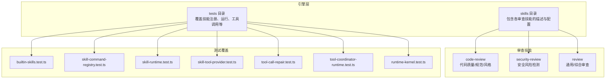
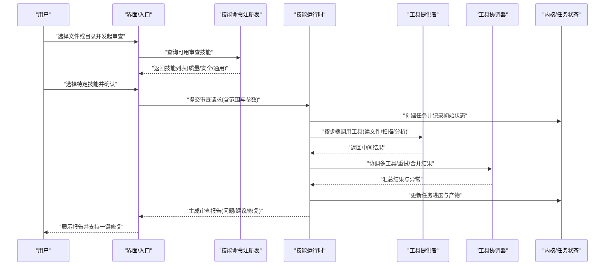
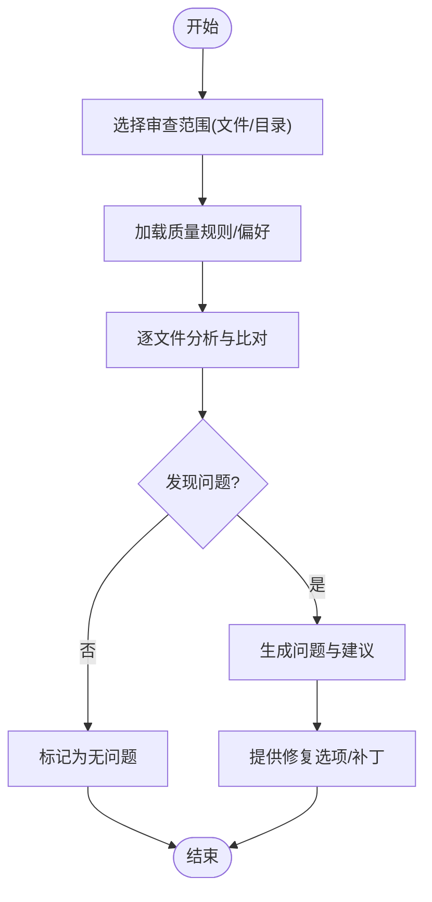
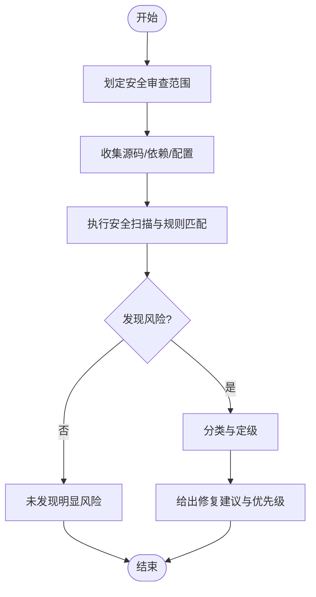
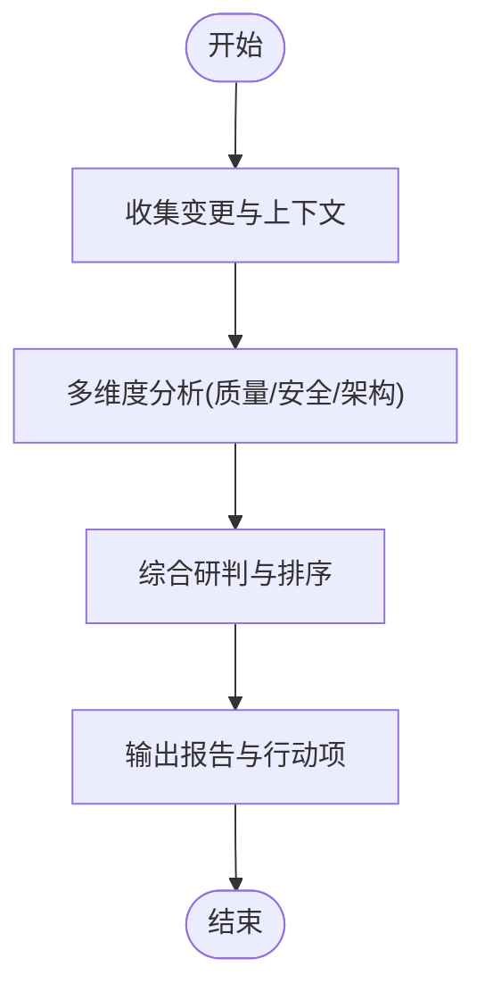
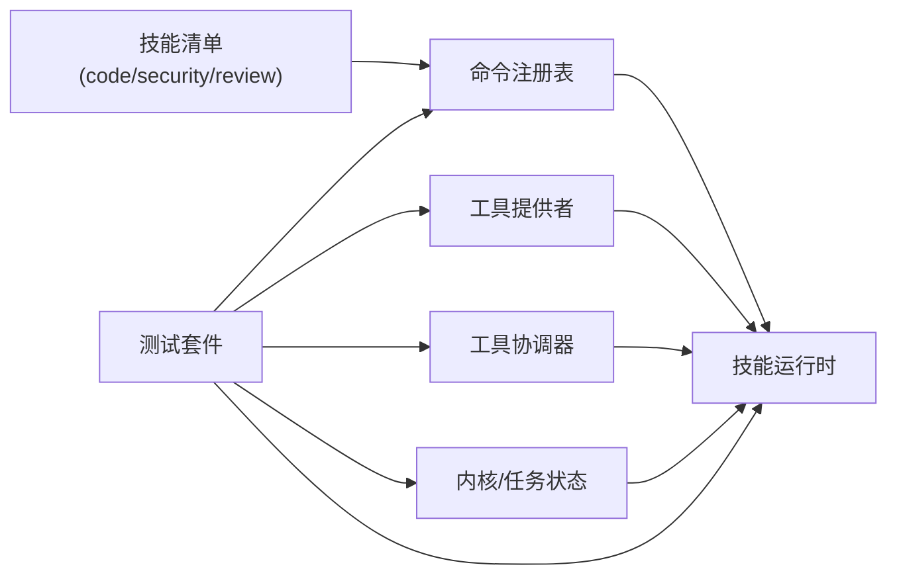

# 代码审查工作流

<cite>
**本文引用的文件**   
- [engine/skills/code-review/SKILL.md](file://engine/skills/code-review/SKILL.md)
- [engine/skills/code-review/skill.json](file://engine/skills/code-review/skill.json)
- [engine/skills/security-review/SKILL.md](file://engine/skills/security-review/SKILL.md)
- [engine/skills/security-review/skill.json](file://engine/skills/security-review/skill.json)
- [engine/skills/review/SKILL.md](file://engine/skills/review/SKILL.md)
- [engine/skills/review/skill.json](file://engine/skills/review/skill.json)
- [engine/tests/builtin-skills.test.ts](file://engine/tests/builtin-skills.test.ts)
- [engine/tests/skill-command-registry.test.ts](file://engine/tests/skill-command-registry.test.ts)
- [engine/tests/skill-runtime.test.ts](file://engine/tests/skill-runtime.test.ts)
- [engine/tests/skill-tool-provider.test.ts](file://engine/tests/skill-tool-provider.test.ts)
- [engine/tests/tool-call-repair.test.ts](file://engine/tests/tool-call-repair.test.ts)
- [engine/tests/tool-coordinator-runtime.test.ts](file://engine/tests/tool-coordinator-runtime.test.ts)
- [engine/tests/runtime-kernel.test.ts](file://engine/tests/runtime-kernel.test.ts)
</cite>

## 目录
1. [简介](#简介)
2. [项目结构](#项目结构)
3. [核心组件](#核心组件)
4. [架构总览](#架构总览)
5. [详细组件分析](#详细组件分析)
6. [依赖分析](#依赖分析)
7. [性能考虑](#性能考虑)
8. [故障排查指南](#故障排查指南)
9. [结论](#结论)
10. [附录](#附录)

## 简介
本指南面向使用 KCoder 进行代码审查的开发者与团队，聚焦于“如何选择要审查的文件或目录、触发内置审查技能（代码质量、安全、通用审查）、查看 AI 生成的审查报告、理解问题与建议、应用推荐修复”的完整工作流。文档同时覆盖不同审查类型的侧重点与适用场景，并提供结果解读技巧与批量审查最佳实践，帮助你在日常开发中高效落地高质量、高安全性的代码变更。

## 项目结构
围绕代码审查能力，仓库中与“技能（Skill）”相关的定义位于 engine/skills 目录下，测试用例位于 engine/tests 下。关键路径如下：
- 代码质量/通用审查技能：engine/skills/code-review、engine/skills/review
- 安全审查技能：engine/skills/security-review
- 技能注册与运行时行为验证：engine/tests 下的多个 *.test.ts

图表来源
- [engine/skills/code-review/SKILL.md](file://engine/skills/code-review/SKILL.md)
- [engine/skills/code-review/skill.json](file://engine/skills/code-review/skill.json)
- [engine/skills/security-review/SKILL.md](file://engine/skills/security-review/SKILL.md)
- [engine/skills/security-review/skill.json](file://engine/skills/security-review/skill.json)
- [engine/skills/review/SKILL.md](file://engine/skills/review/SKILL.md)
- [engine/skills/review/skill.json](file://engine/skills/review/skill.json)
- [engine/tests/builtin-skills.test.ts](file://engine/tests/builtin-skills.test.ts)
- [engine/tests/skill-command-registry.test.ts](file://engine/tests/skill-command-registry.test.ts)
- [engine/tests/skill-runtime.test.ts](file://engine/tests/skill-runtime.test.ts)
- [engine/tests/skill-tool-provider.test.ts](file://engine/tests/skill-tool-provider.test.ts)
- [engine/tests/tool-call-repair.test.ts](file://engine/tests/tool-call-repair.test.ts)
- [engine/tests/tool-coordinator-runtime.test.ts](file://engine/tests/tool-coordinator-runtime.test.ts)
- [engine/tests/runtime-kernel.test.ts](file://engine/tests/runtime-kernel.test.ts)

章节来源
- [engine/skills/code-review/SKILL.md](file://engine/skills/code-review/SKILL.md)
- [engine/skills/code-review/skill.json](file://engine/skills/code-review/skill.json)
- [engine/skills/security-review/SKILL.md](file://engine/skills/security-review/SKILL.md)
- [engine/skills/security-review/skill.json](file://engine/skills/security-review/skill.json)
- [engine/skills/review/SKILL.md](file://engine/skills/review/SKILL.md)
- [engine/skills/review/skill.json](file://engine/skills/review/skill.json)
- [engine/tests/builtin-skills.test.ts](file://engine/tests/builtin-skills.test.ts)
- [engine/tests/skill-command-registry.test.ts](file://engine/tests/skill-command-registry.test.ts)
- [engine/tests/skill-runtime.test.ts](file://engine/tests/skill-runtime.test.ts)
- [engine/tests/skill-tool-provider.test.ts](file://engine/tests/skill-tool-provider.test.ts)
- [engine/tests/tool-call-repair.test.ts](file://engine/tests/tool-call-repair.test.ts)
- [engine/tests/tool-coordinator-runtime.test.ts](file://engine/tests/tool-coordinator-runtime.test.ts)
- [engine/tests/runtime-kernel.test.ts](file://engine/tests/runtime-kernel.test.ts)

## 核心组件
- 技能清单与元数据
  - 每个审查技能由一个 SKILL.md 与 skill.json 组成，前者描述技能目标、输入输出与执行约定，后者提供结构化元数据供引擎加载与调度。
- 技能命令注册与发现
  - 通过命令注册机制将技能暴露为可触发的命令，便于在 UI 或 CLI 中选择并执行。
- 技能运行时
  - 负责解析技能参数、准备上下文、编排工具调用、收集结果并生成审查报告。
- 工具提供者与协调器
  - 工具提供者实现具体能力（如读取文件、执行静态检查、生成建议），协调器负责多工具协作与错误恢复。
- 内核与任务状态
  - 内核承载任务生命周期、事件总线与持久化，确保审查过程可追踪、可中断与可恢复。

章节来源
- [engine/skills/code-review/SKILL.md](file://engine/skills/code-review/SKILL.md)
- [engine/skills/code-review/skill.json](file://engine/skills/code-review/skill.json)
- [engine/skills/security-review/SKILL.md](file://engine/skills/security-review/SKILL.md)
- [engine/skills/security-review/skill.json](file://engine/skills/security-review/skill.json)
- [engine/skills/review/SKILL.md](file://engine/skills/review/SKILL.md)
- [engine/skills/review/skill.json](file://engine/skills/review/skill.json)
- [engine/tests/skill-command-registry.test.ts](file://engine/tests/skill-command-registry.test.ts)
- [engine/tests/skill-runtime.test.ts](file://engine/tests/skill-runtime.test.ts)
- [engine/tests/skill-tool-provider.test.ts](file://engine/tests/skill-tool-provider.test.ts)
- [engine/tests/tool-coordinator-runtime.test.ts](file://engine/tests/tool-coordinator-runtime.test.ts)
- [engine/tests/runtime-kernel.test.ts](file://engine/tests/runtime-kernel.test.ts)

## 架构总览
下图展示了从用户选择待审范围到生成审查报告的端到端流程，涵盖技能选择、命令注册、运行时编排、工具调用与结果聚合。

图表来源
- [engine/tests/skill-command-registry.test.ts](file://engine/tests/skill-command-registry.test.ts)
- [engine/tests/skill-runtime.test.ts](file://engine/tests/skill-runtime.test.ts)
- [engine/tests/skill-tool-provider.test.ts](file://engine/tests/skill-tool-provider.test.ts)
- [engine/tests/tool-coordinator-runtime.test.ts](file://engine/tests/tool-coordinator-runtime.test.ts)
- [engine/tests/runtime-kernel.test.ts](file://engine/tests/runtime-kernel.test.ts)

## 详细组件分析

### 代码质量审查（code-review）
- 侧重点
  - 代码规范与风格一致性
  - 潜在逻辑缺陷与边界条件
  - 可读性与维护性改进建议
- 典型使用场景
  - 提交前自检
  - PR 合并前的自动化门禁
  - 团队协作规范落地
- 输入与范围
  - 单文件、多文件或整个目录
  - 可选语言/规则集过滤
- 输出与产物
  - 问题清单（位置、严重级别、说明）
  - 改进建议与示例引用
  - 可选的一键修复补丁

图表来源
- [engine/skills/code-review/SKILL.md](file://engine/skills/code-review/SKILL.md)
- [engine/skills/code-review/skill.json](file://engine/skills/code-review/skill.json)

章节来源
- [engine/skills/code-review/SKILL.md](file://engine/skills/code-review/SKILL.md)
- [engine/skills/code-review/skill.json](file://engine/skills/code-review/skill.json)

### 安全审查（security-review）
- 侧重点
  - 常见漏洞模式识别（注入、越权、敏感信息泄露等）
  - 第三方依赖风险与已知漏洞提示
  - 安全编码最佳实践建议
- 典型使用场景
  - 涉及认证授权、数据处理、网络通信的代码变更
  - 合规审计与上线前安全检查
- 输入与范围
  - 重点关注高风险模块与外部接口
  - 可结合依赖清单与配置文件
- 输出与产物
  - 风险等级与影响面评估
  - 修复优先级与缓解措施
  - 参考标准与修复指引

图表来源
- [engine/skills/security-review/SKILL.md](file://engine/skills/security-review/SKILL.md)
- [engine/skills/security-review/skill.json](file://engine/skills/security-review/skill.json)

章节来源
- [engine/skills/security-review/SKILL.md](file://engine/skills/security-review/SKILL.md)
- [engine/skills/security-review/skill.json](file://engine/skills/security-review/skill.json)

### 通用审查（review）
- 侧重点
  - 跨维度综合审视（质量+安全+可维护性）
  - 业务语义与架构一致性校验
  - 变更影响面评估与回归风险提示
- 典型使用场景
  - 复杂功能重构或跨模块改动
  - 重要版本发布前的全面把关
- 输入与范围
  - 大范围变更或多文件联动修改
  - 可附带需求/设计说明以增强上下文
- 输出与产物
  - 综合性审查报告
  - 分模块/分层级的改进建议
  - 回归测试建议与关注点

图表来源
- [engine/skills/review/SKILL.md](file://engine/skills/review/SKILL.md)
- [engine/skills/review/skill.json](file://engine/skills/review/skill.json)

章节来源
- [engine/skills/review/SKILL.md](file://engine/skills/review/SKILL.md)
- [engine/skills/review/skill.json](file://engine/skills/review/skill.json)

### 技能注册与命令发现
- 作用
  - 将各审查技能注册为可发现、可调用的命令，统一入口管理
- 关键点
  - 命令名、参数契约、权限与可见性
  - 动态加载与热更新支持
- 验证方式
  - 通过单元测试覆盖注册、查找与执行路径

章节来源
- [engine/tests/skill-command-registry.test.ts](file://engine/tests/skill-command-registry.test.ts)

### 技能运行时与工具编排
- 作用
  - 解析技能参数、构建上下文、驱动工具链、聚合结果
- 关键点
  - 工具提供者抽象与实现分离
  - 协调器处理并发、重试、熔断与结果合并
  - 错误恢复与部分成功策略
- 验证方式
  - 针对运行时、工具提供者、协调器的专项测试

章节来源
- [engine/tests/skill-runtime.test.ts](file://engine/tests/skill-runtime.test.ts)
- [engine/tests/skill-tool-provider.test.ts](file://engine/tests/skill-tool-provider.test.ts)
- [engine/tests/tool-coordinator-runtime.test.ts](file://engine/tests/tool-coordinator-runtime.test.ts)
- [engine/tests/tool-call-repair.test.ts](file://engine/tests/tool-call-repair.test.ts)

### 内核与任务状态
- 作用
  - 提供任务生命周期管理、事件总线、持久化与可观测性
- 关键点
  - 任务状态机、断点续查、回放与审计
  - 资源预算与超时控制
- 验证方式
  - 内核主流程与治理相关测试

章节来源
- [engine/tests/runtime-kernel.test.ts](file://engine/tests/runtime-kernel.test.ts)

## 依赖分析
- 内聚与耦合
  - 技能定义（SKILL.md + skill.json）与运行时解耦，通过命令注册表与工具提供者接口松耦合
  - 协调器对工具提供者具有较高内聚，屏蔽底层差异
- 直接依赖
  - 运行时依赖命令注册表、工具提供者、协调器与内核
- 间接依赖
  - 测试套件覆盖注册、运行、工具调用与内核行为，保障集成正确性

图表来源
- [engine/tests/builtin-skills.test.ts](file://engine/tests/builtin-skills.test.ts)
- [engine/tests/skill-command-registry.test.ts](file://engine/tests/skill-command-registry.test.ts)
- [engine/tests/skill-runtime.test.ts](file://engine/tests/skill-runtime.test.ts)
- [engine/tests/skill-tool-provider.test.ts](file://engine/tests/skill-tool-provider.test.ts)
- [engine/tests/tool-coordinator-runtime.test.ts](file://engine/tests/tool-coordinator-runtime.test.ts)
- [engine/tests/runtime-kernel.test.ts](file://engine/tests/runtime-kernel.test.ts)

章节来源
- [engine/tests/builtin-skills.test.ts](file://engine/tests/builtin-skills.test.ts)
- [engine/tests/skill-command-registry.test.ts](file://engine/tests/skill-command-registry.test.ts)
- [engine/tests/skill-runtime.test.ts](file://engine/tests/skill-runtime.test.ts)
- [engine/tests/skill-tool-provider.test.ts](file://engine/tests/skill-tool-provider.test.ts)
- [engine/tests/tool-coordinator-runtime.test.ts](file://engine/tests/tool-coordinator-runtime.test.ts)
- [engine/tests/runtime-kernel.test.ts](file://engine/tests/runtime-kernel.test.ts)

## 性能考虑
- 范围裁剪
  - 优先限定变更范围，避免全仓扫描带来的开销
- 增量审查
  - 基于上次结果缓存与差异分析，减少重复计算
- 并行与批处理
  - 对独立文件/模块并行分析；大仓库分批提交审查任务
- 资源治理
  - 设置超时、内存与并发上限，防止长时间阻塞
- 结果复用
  - 对稳定规则与历史问题建立基线，降低噪声

[本节为通用指导，不直接分析具体文件]

## 故障排查指南
- 常见问题定位
  - 技能未注册或不可见：检查命令注册表与技能清单是否一致
  - 工具调用失败：查看工具提供者日志与协调器重试策略
  - 任务卡住或超时：核对内核任务状态与资源配额
- 快速验证路径
  - 使用内置技能测试用例验证注册与运行链路
  - 通过工具调用修复测试确认错误恢复路径
- 建议操作
  - 缩小审查范围复现问题
  - 开启更详细的运行日志
  - 逐步隔离工具提供者与协调器定位瓶颈

章节来源
- [engine/tests/builtin-skills.test.ts](file://engine/tests/builtin-skills.test.ts)
- [engine/tests/skill-command-registry.test.ts](file://engine/tests/skill-command-registry.test.ts)
- [engine/tests/skill-runtime.test.ts](file://engine/tests/skill-runtime.test.ts)
- [engine/tests/skill-tool-provider.test.ts](file://engine/tests/skill-tool-provider.test.ts)
- [engine/tests/tool-call-repair.test.ts](file://engine/tests/tool-call-repair.test.ts)
- [engine/tests/tool-coordinator-runtime.test.ts](file://engine/tests/tool-coordinator-runtime.test.ts)
- [engine/tests/runtime-kernel.test.ts](file://engine/tests/runtime-kernel.test.ts)

## 结论
通过将“代码质量、安全、通用”三类审查技能纳入统一的命令注册与运行时编排体系，KCocker 提供了从范围选择、技能触发、报告生成到修复落地的闭环工作流。配合合理的范围裁剪、增量与批处理策略，以及完善的错误恢复与可观测性，可在保证效率的同时持续提升代码质量与安全水位。

[本节为总结性内容，不直接分析具体文件]

## 附录

### 工作流清单（实操要点）
- 选择范围
  - 明确本次审查的目标文件/目录，必要时排除无关目录
- 选择技能
  - 常规变更：优先“代码质量审查”
  - 涉及鉴权/数据/网络：增加“安全审查”
  - 重大重构/跨模块：启用“通用审查”
- 触发与等待
  - 提交审查任务后关注进度与中间产出
- 阅读报告
  - 先关注高严重级别与高风险项，再处理低优问题
- 应用修复
  - 优先采用自动修复或最小改动方案，必要时人工复核
- 回归与归档
  - 补充必要测试，保留审查记录以便追溯

[本节为概念性指导，不直接分析具体文件]