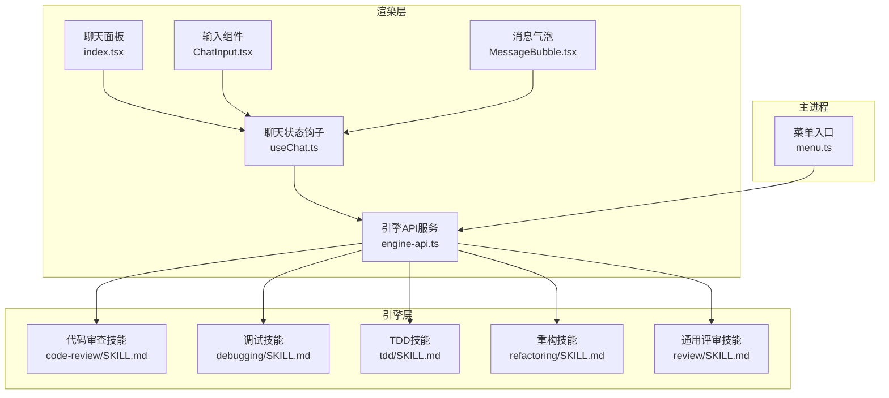
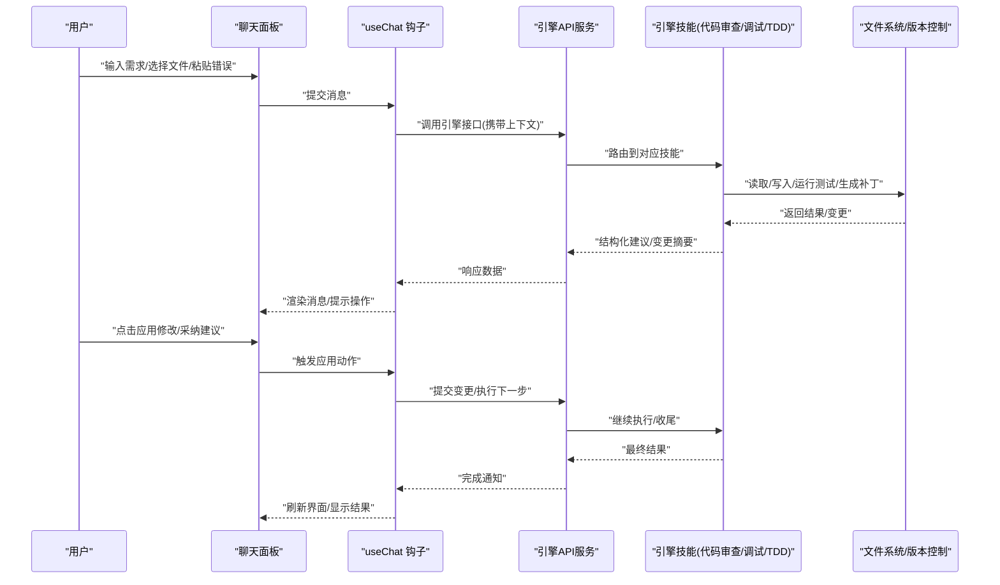
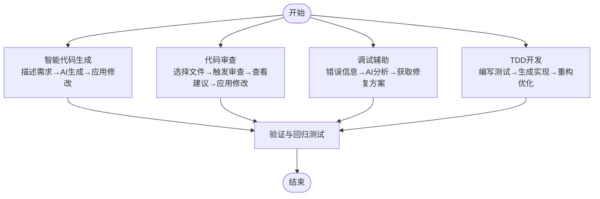
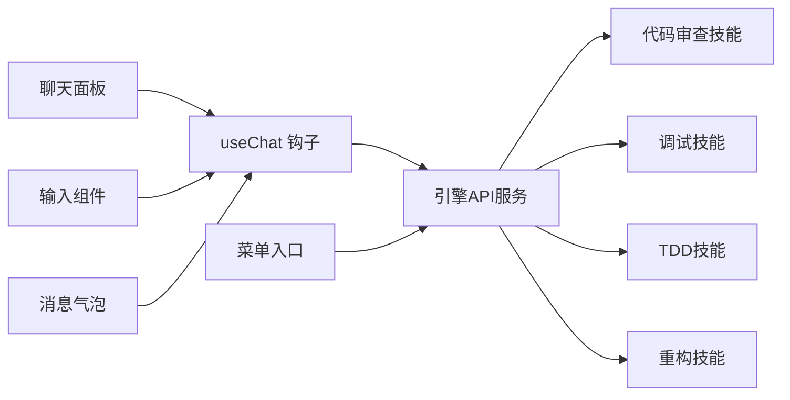

# 常用工作流

<cite>
**本文引用的文件**   
- [engine/skills/code-review/SKILL.md](file://engine/skills/code-review/SKILL.md)
- [engine/skills/code-review/skill.json](file://engine/skills/code-review/skill.json)
- [engine/skills/debugging/SKILL.md](file://engine/skills/debugging/SKILL.md)
- [engine/skills/debugging/skill.json](file://engine/skills/debugging/skill.json)
- [engine/skills/tdd/SKILL.md](file://engine/skills/tdd/SKILL.md)
- [engine/skills/tdd/skill.json](file://engine/skills/tdd/skill.json)
- [engine/skills/tdd/tdd-cycle.md](file://engine/skills/tdd/tdd-cycle.md)
- [engine/skills/review/SKILL.md](file://engine/skills/review/SKILL.md)
- [engine/skills/review/skill.json](file://engine/skills/review/skill.json)
- [engine/skills/refactoring/SKILL.md](file://engine/skills/refactoring/SKILL.md)
- [engine/skills/refactoring/skill.json](file://engine/skills/refactoring/skill.json)
- [app/renderer/src/components/ChatPanel/index.tsx](file://app/renderer/src/components/ChatPanel/index.tsx)
- [app/renderer/src/components/ChatPanel/ChatInput.tsx](file://app/renderer/src/components/ChatPanel/ChatInput.tsx)
- [app/renderer/src/components/ChatPanel/MessageBubble.tsx](file://app/renderer/src/components/ChatPanel/MessageBubble.tsx)
- [app/renderer/src/hooks/useChat.ts](file://app/renderer/src/hooks/useChat.ts)
- [app/renderer/src/services/engine-api.ts](file://app/renderer/src/services/engine-api.ts)
- [app/main/menu.ts](file://app/main/menu.ts)
</cite>

## 目录
1. [简介](#简介)
2. [项目结构](#项目结构)
3. [核心组件](#核心组件)
4. [架构总览](#架构总览)
5. [详细组件分析](#详细组件分析)
6. [依赖分析](#依赖分析)
7. [性能考虑](#性能考虑)
8. [故障排查指南](#故障排查指南)
9. [结论](#结论)
10. [附录](#附录)

## 简介
本指南聚焦于在 KCoder 中完成四类高频开发工作流的实操方法：智能代码生成、代码审查、调试辅助与 TDD 开发。每个流程均提供步骤说明、最佳实践与效率技巧，并结合仓库中的“技能（Skill）”定义与前端交互组件进行落地讲解，帮助你在日常开发中更高效地使用 AI 能力。

## 项目结构
KCoder 采用前后端分离的桌面应用架构：
- 渲染层（前端）：基于 React + Electron，提供聊天面板、消息气泡、输入框等 UI 组件，并通过服务层调用引擎 API。
- 主进程：负责菜单、窗口与设置等系统级能力。
- 引擎层：以“技能（Skill）”为单元封装可复用的工作流，如代码审查、调试、TDD、重构等。

图表来源
- [app/renderer/src/components/ChatPanel/index.tsx](file://app/renderer/src/components/ChatPanel/index.tsx)
- [app/renderer/src/components/ChatPanel/ChatInput.tsx](file://app/renderer/src/components/ChatPanel/ChatInput.tsx)
- [app/renderer/src/components/ChatPanel/MessageBubble.tsx](file://app/renderer/src/components/ChatPanel/MessageBubble.tsx)
- [app/renderer/src/hooks/useChat.ts](file://app/renderer/src/hooks/useChat.ts)
- [app/renderer/src/services/engine-api.ts](file://app/renderer/src/services/engine-api.ts)
- [app/main/menu.ts](file://app/main/menu.ts)
- [engine/skills/code-review/SKILL.md](file://engine/skills/code-review/SKILL.md)
- [engine/skills/debugging/SKILL.md](file://engine/skills/debugging/SKILL.md)
- [engine/skills/tdd/SKILL.md](file://engine/skills/tdd/SKILL.md)
- [engine/skills/refactoring/SKILL.md](file://engine/skills/refactoring/SKILL.md)
- [engine/skills/review/SKILL.md](file://engine/skills/review/SKILL.md)

章节来源
- [app/renderer/src/components/ChatPanel/index.tsx](file://app/renderer/src/components/ChatPanel/index.tsx)
- [app/renderer/src/components/ChatPanel/ChatInput.tsx](file://app/renderer/src/components/ChatPanel/ChatInput.tsx)
- [app/renderer/src/components/ChatPanel/MessageBubble.tsx](file://app/renderer/src/components/ChatPanel/MessageBubble.tsx)
- [app/renderer/src/hooks/useChat.ts](file://app/renderer/src/hooks/useChat.ts)
- [app/renderer/src/services/engine-api.ts](file://app/renderer/src/services/engine-api.ts)
- [app/main/menu.ts](file://app/main/menu.ts)
- [engine/skills/code-review/SKILL.md](file://engine/skills/code-review/SKILL.md)
- [engine/skills/debugging/SKILL.md](file://engine/skills/debugging/SKILL.md)
- [engine/skills/tdd/SKILL.md](file://engine/skills/tdd/SKILL.md)
- [engine/skills/refactoring/SKILL.md](file://engine/skills/refactoring/SKILL.md)
- [engine/skills/review/SKILL.md](file://engine/skills/review/SKILL.md)

## 核心组件
- 聊天面板与消息展示：用于承载对话上下文、展示 AI 建议与变更摘要。
- 输入组件：支持自然语言描述需求或粘贴错误信息，作为工作流触发入口。
- 聊天状态钩子：管理会话历史、发送请求、接收结果并驱动 UI 更新。
- 引擎 API 服务：统一封装对引擎层的调用，将用户意图映射到具体“技能”。
- 技能定义：以 SKILL.md 与 skill.json 描述工作流的目标、输入输出、工具链与执行策略。

章节来源
- [app/renderer/src/components/ChatPanel/index.tsx](file://app/renderer/src/components/ChatPanel/index.tsx)
- [app/renderer/src/components/ChatPanel/ChatInput.tsx](file://app/renderer/src/components/ChatPanel/ChatInput.tsx)
- [app/renderer/src/components/ChatPanel/MessageBubble.tsx](file://app/renderer/src/components/ChatPanel/MessageBubble.tsx)
- [app/renderer/src/hooks/useChat.ts](file://app/renderer/src/hooks/useChat.ts)
- [app/renderer/src/services/engine-api.ts](file://app/renderer/src/services/engine-api.ts)
- [engine/skills/code-review/SKILL.md](file://engine/skills/code-review/SKILL.md)
- [engine/skills/debugging/SKILL.md](file://engine/skills/debugging/SKILL.md)
- [engine/skills/tdd/SKILL.md](file://engine/skills/tdd/SKILL.md)
- [engine/skills/refactoring/SKILL.md](file://engine/skills/refactoring/SKILL.md)
- [engine/skills/review/SKILL.md](file://engine/skills/review/SKILL.md)

## 架构总览
下图展示了从用户输入到引擎执行再到结果回传的端到端流程，以及各“技能”在工作流中的角色。

图表来源
- [app/renderer/src/components/ChatPanel/index.tsx](file://app/renderer/src/components/ChatPanel/index.tsx)
- [app/renderer/src/components/ChatPanel/ChatInput.tsx](file://app/renderer/src/components/ChatPanel/ChatInput.tsx)
- [app/renderer/src/components/ChatPanel/MessageBubble.tsx](file://app/renderer/src/components/ChatPanel/MessageBubble.tsx)
- [app/renderer/src/hooks/useChat.ts](file://app/renderer/src/hooks/useChat.ts)
- [app/renderer/src/services/engine-api.ts](file://app/renderer/src/services/engine-api.ts)
- [engine/skills/code-review/SKILL.md](file://engine/skills/code-review/SKILL.md)
- [engine/skills/debugging/SKILL.md](file://engine/skills/debugging/SKILL.md)
- [engine/skills/tdd/SKILL.md](file://engine/skills/tdd/SKILL.md)

## 详细组件分析

### 智能代码生成工作流
目标：通过自然语言描述需求，由 AI 生成代码并应用到目标文件。

操作步骤
- 打开聊天面板，切换到“智能生成”相关技能（若存在）。
- 在输入框中清晰描述需求：功能目标、输入输出、约束条件、期望的文件路径。
- 附加上下文：粘贴关键片段、接口定义或错误日志，提升生成质量。
- 查看生成的变更摘要与预览，确认无误后点击“应用修改”。
- 运行测试或手动验证，必要时回到聊天面板提出迭代要求。

最佳实践
- 明确范围：指定目标文件与函数名，避免大范围改动。
- 分步推进：复杂需求拆分为多个小任务，逐个生成与验证。
- 保留上下文：在对话中持续补充约束与反馈，提高一致性。
- 先预览后应用：利用变更摘要核对影响面，降低回滚成本。

效率技巧
- 使用模板化提示词：固定“背景→目标→约束→验收标准”的结构。
- 复用历史对话：复制成功提示词，快速启动相似任务。
- 结合快捷键：通过菜单或快捷键快速定位输入框与“应用”按钮。

章节来源
- [app/renderer/src/components/ChatPanel/index.tsx](file://app/renderer/src/components/ChatPanel/index.tsx)
- [app/renderer/src/components/ChatPanel/ChatInput.tsx](file://app/renderer/src/components/ChatPanel/ChatInput.tsx)
- [app/renderer/src/components/ChatPanel/MessageBubble.tsx](file://app/renderer/src/components/ChatPanel/MessageBubble.tsx)
- [app/renderer/src/hooks/useChat.ts](file://app/renderer/src/hooks/useChat.ts)
- [app/renderer/src/services/engine-api.ts](file://app/renderer/src/services/engine-api.ts)

### 代码审查工作流
目标：选择文件后触发审查，查看建议并应用修改。

操作步骤
- 在编辑器中选择待审查文件或目录。
- 通过聊天面板或菜单触发“代码审查”技能。
- 审查要点：可读性、复杂度、潜在缺陷、安全与性能风险。
- 逐条审阅建议，选择“采纳/拒绝”，批量应用后保存。
- 运行测试与静态检查，确保无回归问题。

最佳实践
- 聚焦变更：仅审查本次提交或分支差异，减少噪音。
- 分层审查：先整体结构，再细节实现，最后边界与异常处理。
- 记录决策：在对话中记录采纳原因，便于后续复盘。

效率技巧
- 预设规则：在技能配置中注入团队规范，自动识别常见问题。
- 组合技能：与“重构”技能联动，一键优化重复或复杂逻辑。
- 自动化流水线：在 CI 中集成审查建议，形成闭环。

章节来源
- [engine/skills/code-review/SKILL.md](file://engine/skills/code-review/SKILL.md)
- [engine/skills/code-review/skill.json](file://engine/skills/code-review/skill.json)
- [engine/skills/review/SKILL.md](file://engine/skills/review/SKILL.md)
- [engine/skills/review/skill.json](file://engine/skills/review/skill.json)
- [engine/skills/refactoring/SKILL.md](file://engine/skills/refactoring/SKILL.md)
- [engine/skills/refactoring/skill.json](file://engine/skills/refactoring/skill.json)
- [app/main/menu.ts](file://app/main/menu.ts)

### 调试辅助工作流
目标：根据错误信息获取根因分析与修复方案，快速恢复开发节奏。

操作步骤
- 复制终端或控制台错误堆栈，粘贴至聊天输入框。
- 指明运行环境与复现步骤，必要时附加最小可复现代码片段。
- 阅读 AI 给出的根因分析与修复建议，优先尝试低风险方案。
- 应用修复后重新运行，观察是否解决；若未解决，继续追加日志与反馈。

最佳实践
- 最小复现：尽量提供最小可复现场景，缩短诊断时间。
- 分层定位：先确认外部依赖与环境，再深入业务逻辑。
- 渐进修复：每次只改一处，便于验证与回滚。

效率技巧
- 模板化提问：包含“环境→现象→期望→实际→已尝试”的结构。
- 关联日志：附带最近一次成功运行的日志对比，突出差异。
- 自动化重试：对偶发问题，让 AI 给出重试与降级策略。

章节来源
- [engine/skills/debugging/SKILL.md](file://engine/skills/debugging/SKILL.md)
- [engine/skills/debugging/skill.json](file://engine/skills/debugging/skill.json)
- [app/renderer/src/components/ChatPanel/ChatInput.tsx](file://app/renderer/src/components/ChatPanel/ChatInput.tsx)
- [app/renderer/src/hooks/useChat.ts](file://app/renderer/src/hooks/useChat.ts)

### TDD 开发工作流
目标：遵循“编写测试→生成实现→重构优化”的循环，提升代码质量与可维护性。

操作步骤
- 编写测试用例：覆盖正常路径、边界条件与异常场景。
- 运行测试，确认失败（红），然后让 AI 生成最小实现以满足测试（绿）。
- 逐步重构：在不改变行为的前提下优化结构与命名，保持测试通过。
- 持续迭代：新增需求时先写测试，再扩展实现，反复循环。

最佳实践
- 测试先行：先定义预期行为，再实现逻辑，避免过度设计。
- 单一职责：每个测试关注一个断言点，便于定位问题。
- 增量演进：小步快跑，频繁运行测试，尽早发现问题。

效率技巧
- 使用 TDD 技能：借助内置技能自动生成测试骨架与实现。
- 参考周期文档：遵循 tdd-cycle.md 的流程指引，保持一致性。
- 结合审查：对重构阶段引入的变更进行轻量审查，防止退化。

章节来源
- [engine/skills/tdd/SKILL.md](file://engine/skills/tdd/SKILL.md)
- [engine/skills/tdd/skill.json](file://engine/skills/tdd/skill.json)
- [engine/skills/tdd/tdd-cycle.md](file://engine/skills/tdd/tdd-cycle.md)
- [app/renderer/src/components/ChatPanel/index.tsx](file://app/renderer/src/components/ChatPanel/index.tsx)
- [app/renderer/src/hooks/useChat.ts](file://app/renderer/src/hooks/useChat.ts)

### 概念总览
下图为上述四个工作流的概念流程图，便于理解整体协作关系。

[此图为概念流程示意，不直接映射具体源码文件]

## 依赖分析
- 渲染层依赖聊天状态钩子与服务层，服务层再与引擎技能对接。
- 菜单入口可作为快捷触发点，统一调度不同技能。
- 技能之间可组合使用，例如“审查+重构”、“调试+生成”。

图表来源
- [app/renderer/src/components/ChatPanel/index.tsx](file://app/renderer/src/components/ChatPanel/index.tsx)
- [app/renderer/src/components/ChatPanel/ChatInput.tsx](file://app/renderer/src/components/ChatPanel/ChatInput.tsx)
- [app/renderer/src/components/ChatPanel/MessageBubble.tsx](file://app/renderer/src/components/ChatPanel/MessageBubble.tsx)
- [app/renderer/src/hooks/useChat.ts](file://app/renderer/src/hooks/useChat.ts)
- [app/renderer/src/services/engine-api.ts](file://app/renderer/src/services/engine-api.ts)
- [app/main/menu.ts](file://app/main/menu.ts)
- [engine/skills/code-review/SKILL.md](file://engine/skills/code-review/SKILL.md)
- [engine/skills/debugging/SKILL.md](file://engine/skills/debugging/SKILL.md)
- [engine/skills/tdd/SKILL.md](file://engine/skills/tdd/SKILL.md)
- [engine/skills/refactoring/SKILL.md](file://engine/skills/refactoring/SKILL.md)

章节来源
- [app/renderer/src/components/ChatPanel/index.tsx](file://app/renderer/src/components/ChatPanel/index.tsx)
- [app/renderer/src/components/ChatPanel/ChatInput.tsx](file://app/renderer/src/components/ChatPanel/ChatInput.tsx)
- [app/renderer/src/components/ChatPanel/MessageBubble.tsx](file://app/renderer/src/components/ChatPanel/MessageBubble.tsx)
- [app/renderer/src/hooks/useChat.ts](file://app/renderer/src/hooks/useChat.ts)
- [app/renderer/src/services/engine-api.ts](file://app/renderer/src/services/engine-api.ts)
- [app/main/menu.ts](file://app/main/menu.ts)
- [engine/skills/code-review/SKILL.md](file://engine/skills/code-review/SKILL.md)
- [engine/skills/debugging/SKILL.md](file://engine/skills/debugging/SKILL.md)
- [engine/skills/tdd/SKILL.md](file://engine/skills/tdd/SKILL.md)
- [engine/skills/refactoring/SKILL.md](file://engine/skills/refactoring/SKILL.md)

## 性能考虑
- 控制上下文大小：避免一次性粘贴过大代码块，按需裁剪以提升响应速度。
- 分批处理：大文件审查或生成时，按模块或函数拆分，减少单次负载。
- 缓存与复用：复用成功的提示词与变更模板，减少重复思考成本。
- 异步与进度：在长耗时操作中关注进度反馈，避免阻塞界面。

## 故障排查指南
- 无法触发技能：检查菜单入口是否正确挂载，确认聊天面板与服务层通信正常。
- 生成结果不符合预期：补充更多上下文与约束，缩小范围，逐步迭代。
- 应用修改失败：查看变更摘要与差异，确认冲突与权限，必要时回滚并重试。
- 调试建议无效：提供更精确的错误堆栈与复现步骤，区分环境差异与依赖问题。

章节来源
- [app/renderer/src/components/ChatPanel/index.tsx](file://app/renderer/src/components/ChatPanel/index.tsx)
- [app/renderer/src/components/ChatPanel/ChatInput.tsx](file://app/renderer/src/components/ChatPanel/ChatInput.tsx)
- [app/renderer/src/components/ChatPanel/MessageBubble.tsx](file://app/renderer/src/components/ChatPanel/MessageBubble.tsx)
- [app/renderer/src/hooks/useChat.ts](file://app/renderer/src/hooks/useChat.ts)
- [app/renderer/src/services/engine-api.ts](file://app/renderer/src/services/engine-api.ts)
- [app/main/menu.ts](file://app/main/menu.ts)

## 结论
通过将“技能”与工作流深度绑定，KCoder 实现了从需求到实现、从审查到修复、从测试到重构的完整闭环。遵循本指南的步骤与最佳实践，可以显著提升开发效率与代码质量。建议在团队内推广标准化提示词与技能配置，形成一致的开发体验。

## 附录
- 截图说明：可在聊天面板中录制关键步骤截图，包括输入内容、变更摘要与应用按钮位置，便于团队培训与知识沉淀。
- 技能清单：参考各技能的 SKILL.md 与 skill.json，了解其输入输出、工具链与执行策略，按需定制与扩展。