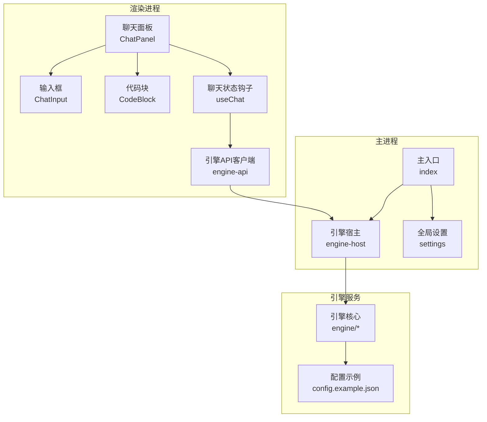
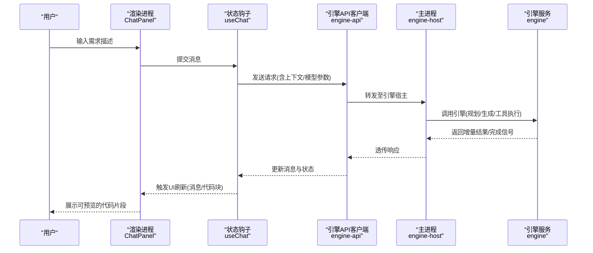
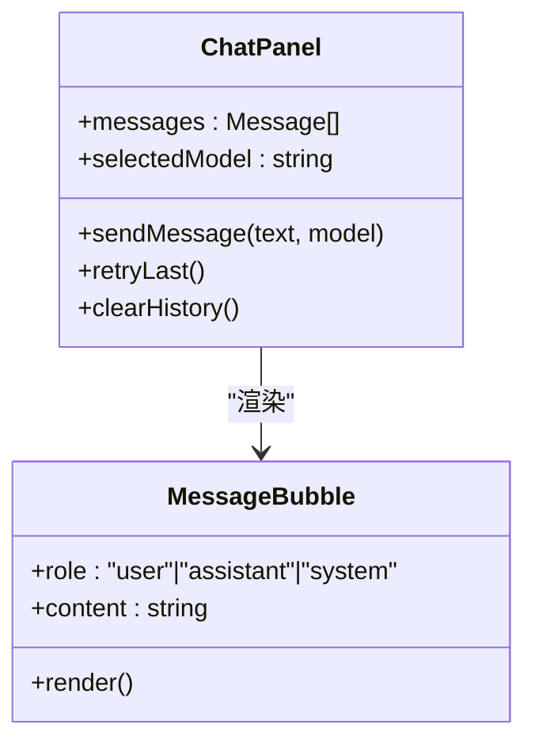
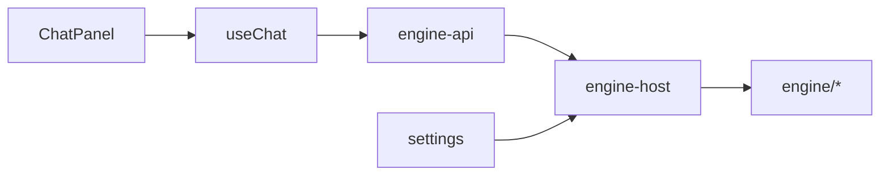
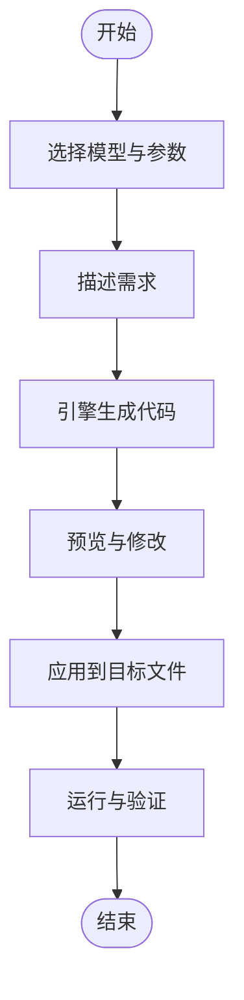

# 智能代码生成工作流

<cite>
**本文引用的文件**   
- [app/main/index.ts](file://app/main/index.ts)
- [app/main/engine-host.ts](file://app/main/engine-host.ts)
- [app/main/settings.ts](file://app/main/settings.ts)
- [app/renderer/src/App.tsx](file://app/renderer/src/App.tsx)
- [app/renderer/src/components/ChatPanel/index.tsx](file://app/renderer/src/components/ChatPanel/index.tsx)
- [app/renderer/src/components/ChatPanel/ChatInput.tsx](file://app/renderer/src/components/ChatPanel/ChatInput.tsx)
- [app/renderer/src/components/ChatPanel/MessageBubble.tsx](file://app/renderer/src/components/ChatPanel/MessageBubble.tsx)
- [app/renderer/src/components/CodeBlock/index.tsx](file://app/renderer/src/components/CodeBlock/index.tsx)
- [app/renderer/src/hooks/useChat.ts](file://app/renderer/src/hooks/useChat.ts)
- [app/renderer/src/services/engine-api.ts](file://app/renderer/src/services/engine-api.ts)
- [engine/README.md](file://engine/README.md)
- [engine/config.example.json](file://engine/config.example.json)
</cite>

## 目录
1. [简介](#简介)
2. [项目结构](#项目结构)
3. [核心组件](#核心组件)
4. [架构总览](#架构总览)
5. [详细组件分析](#详细组件分析)
6. [依赖关系分析](#依赖关系分析)
7. [性能与稳定性](#性能与稳定性)
8. [故障排查指南](#故障排查指南)
9. [结论](#结论)
10. [附录：使用示例与最佳实践](#附录使用示例与最佳实践)

## 简介
本指南面向KCoder用户，系统化介绍“从需求描述到代码落地”的智能代码生成工作流。内容涵盖：
- 在聊天界面中表达编程需求
- 选择合适的AI模型
- 生成高质量代码
- 预览与修改生成的代码
- 将变更应用到目标文件
- 典型场景（函数、类、API接口）
- 提示词编写技巧与质量验证方法
- 实际案例演示与效果截图说明

## 项目结构
KCoder采用前后端分离的Electron应用架构：
- 渲染进程（前端）：提供聊天面板、代码块展示、设置面板等UI能力
- 主进程：负责引擎宿主、窗口管理、菜单与全局设置
- 引擎层（独立服务）：提供模型路由、工具编排、任务执行与持久化等能力

图表来源
- [app/main/index.ts](file://app/main/index.ts)
- [app/main/engine-host.ts](file://app/main/engine-host.ts)
- [app/main/settings.ts](file://app/main/settings.ts)
- [app/renderer/src/App.tsx](file://app/renderer/src/App.tsx)
- [app/renderer/src/components/ChatPanel/index.tsx](file://app/renderer/src/components/ChatPanel/index.tsx)
- [app/renderer/src/components/ChatPanel/ChatInput.tsx](file://app/renderer/src/components/ChatPanel/ChatInput.tsx)
- [app/renderer/src/components/ChatPanel/MessageBubble.tsx](file://app/renderer/src/components/ChatPanel/MessageBubble.tsx)
- [app/renderer/src/components/CodeBlock/index.tsx](file://app/renderer/src/components/CodeBlock/index.tsx)
- [app/renderer/src/hooks/useChat.ts](file://app/renderer/src/hooks/hooks/useChat.ts)
- [app/renderer/src/services/engine-api.ts](file://app/renderer/src/services/engine-api.ts)
- [engine/README.md](file://engine/README.md)
- [engine/config.example.json](file://engine/config.example.json)

章节来源
- [app/main/index.ts](file://app/main/index.ts)
- [app/main/engine-host.ts](file://app/main/engine-host.ts)
- [app/main/settings.ts](file://app/main/settings.ts)
- [app/renderer/src/App.tsx](file://app/renderer/src/App.tsx)
- [app/renderer/src/components/ChatPanel/index.tsx](file://app/renderer/src/components/ChatPanel/index.tsx)
- [app/renderer/src/components/ChatPanel/ChatInput.tsx](file://app/renderer/src/components/ChatPanel/ChatInput.tsx)
- [app/renderer/src/components/ChatPanel/MessageBubble.tsx](file://app/renderer/src/components/ChatPanel/MessageBubble.tsx)
- [app/renderer/src/components/CodeBlock/index.tsx](file://app/renderer/src/components/CodeBlock/index.tsx)
- [app/renderer/src/hooks/useChat.ts](file://app/renderer/src/hooks/useChat.ts)
- [app/renderer/src/services/engine-api.ts](file://app/renderer/src/services/engine-api.ts)
- [engine/README.md](file://engine/README.md)
- [engine/config.example.json](file://engine/config.example.json)

## 核心组件
- 聊天面板与消息气泡：承载对话上下文、历史消息与交互反馈
- 输入框：支持自然语言需求描述与快捷指令
- 代码块：高亮显示、复制、插入到编辑器等操作
- 聊天状态钩子：集中管理会话、消息、加载态与错误
- 引擎API客户端：封装与引擎服务的通信协议与重试策略
- 引擎宿主：桥接渲染进程与引擎服务，处理生命周期与事件
- 设置面板：模型选择、参数调优、功能开关

章节来源
- [app/renderer/src/components/ChatPanel/index.tsx](file://app/renderer/src/components/ChatPanel/index.tsx)
- [app/renderer/src/components/ChatPanel/ChatInput.tsx](file://app/renderer/src/components/ChatPanel/ChatInput.tsx)
- [app/renderer/src/components/ChatPanel/MessageBubble.tsx](file://app/renderer/src/components/ChatPanel/MessageBubble.tsx)
- [app/renderer/src/components/CodeBlock/index.tsx](file://app/renderer/src/components/CodeBlock/index.tsx)
- [app/renderer/src/hooks/useChat.ts](file://app/renderer/src/hooks/useChat.ts)
- [app/renderer/src/services/engine-api.ts](file://app/renderer/src/services/engine-api.ts)
- [app/main/engine-host.ts](file://app/main/engine-host.ts)
- [app/main/settings.ts](file://app/main/settings.ts)

## 架构总览
下图展示了从用户输入到代码落地的端到端流程，包括渲染进程、主进程与引擎服务的协作。

图表来源
- [app/renderer/src/components/ChatPanel/index.tsx](file://app/renderer/src/components/ChatPanel/index.tsx)
- [app/renderer/src/hooks/useChat.ts](file://app/renderer/src/hooks/useChat.ts)
- [app/renderer/src/services/engine-api.ts](file://app/renderer/src/services/engine-api.ts)
- [app/main/engine-host.ts](file://app/main/engine-host.ts)
- [engine/README.md](file://engine/README.md)

## 详细组件分析

### 聊天面板与消息气泡
- 职责：维护会话列表、渲染消息气泡、处理用户交互（发送、编辑、重试）
- 关键点：
  - 消息类型区分（用户/系统/AI），用于差异化渲染
  - 长文本与代码片段的分块渲染，避免阻塞
  - 错误消息的可读性增强（包含简要原因与建议）

图表来源
- [app/renderer/src/components/ChatPanel/index.tsx](file://app/renderer/src/components/ChatPanel/index.tsx)
- [app/renderer/src/components/ChatPanel/MessageBubble.tsx](file://app/renderer/src/components/ChatPanel/MessageBubble.tsx)

章节来源
- [app/renderer/src/components/ChatPanel/index.tsx](file://app/renderer/src/components/ChatPanel/index.tsx)
- [app/renderer/src/components/ChatPanel/MessageBubble.tsx](file://app/renderer/src/components/ChatPanel/MessageBubble.tsx)

### 输入框与快捷指令
- 职责：接收用户输入、校验、格式化并触发发送
- 关键点：
  - 支持多行输入与快捷键（如Enter发送、Shift+Enter换行）
  - 可选的快捷指令前缀（例如以特定字符开头触发不同行为）
  - 输入长度限制与防抖，减少无效请求

章节来源
- [app/renderer/src/components/ChatPanel/ChatInput.tsx](file://app/renderer/src/components/ChatPanel/ChatInput.tsx)

### 代码块展示与操作
- 职责：高亮显示、复制、插入到当前文件或新建文件
- 关键点：
  - 语言检测与语法高亮
  - 一键插入到编辑器光标位置或指定文件
  - 变更预览模式（diff视图）

章节来源
- [app/renderer/src/components/CodeBlock/index.tsx](file://app/renderer/src/components/CodeBlock/index.tsx)

### 聊天状态钩子
- 职责：集中管理消息队列、加载态、错误态、重连与重试
- 关键点：
  - 消息追加与去重
  - 失败自动重试与退避策略
  - 与引擎API客户端解耦，便于替换实现

章节来源
- [app/renderer/src/hooks/useChat.ts](file://app/renderer/src/hooks/useChat.ts)

### 引擎API客户端
- 职责：封装与引擎服务的HTTP/IPC通信、序列化、鉴权与重试
- 关键点：
  - 统一请求头与错误码映射
  - 断线重连与幂等请求ID
  - 大响应分块接收与进度回调

章节来源
- [app/renderer/src/services/engine-api.ts](file://app/renderer/src/services/engine-api.ts)

### 主进程引擎宿主
- 职责：启动/停止引擎服务、转发渲染进程请求、管理会话与资源
- 关键点：
  - 进程间通信桥接
  - 引擎健康检查与优雅关闭
  - 日志与遥测上报

章节来源
- [app/main/engine-host.ts](file://app/main/engine-host.ts)

### 设置与模型选择
- 职责：提供模型选择、参数调节、功能开关与持久化
- 关键点：
  - 模型清单与兼容性校验
  - 参数范围与默认值
  - 设置变更热重载

章节来源
- [app/main/settings.ts](file://app/main/settings.ts)

## 依赖关系分析
渲染进程通过hooks与服务层与主进程交互，主进程再与引擎服务对接。设置模块为全局配置源。

图表来源
- [app/renderer/src/components/ChatPanel/index.tsx](file://app/renderer/src/components/ChatPanel/index.tsx)
- [app/renderer/src/hooks/useChat.ts](file://app/renderer/src/hooks/useChat.ts)
- [app/renderer/src/services/engine-api.ts](file://app/renderer/src/services/engine-api.ts)
- [app/main/engine-host.ts](file://app/main/engine-host.ts)
- [app/main/settings.ts](file://app/main/settings.ts)

章节来源
- [app/renderer/src/components/ChatPanel/index.tsx](file://app/renderer/src/components/ChatPanel/index.tsx)
- [app/renderer/src/hooks/useChat.ts](file://app/renderer/src/hooks/useChat.ts)
- [app/renderer/src/services/engine-api.ts](file://app/renderer/src/services/engine-api.ts)
- [app/main/engine-host.ts](file://app/main/engine-host.ts)
- [app/main/settings.ts](file://app/main/settings.ts)

## 性能与稳定性
- 增量渲染：对长回复进行分块渲染，降低UI卡顿
- 请求合并与去抖：输入阶段合并相似请求，避免重复调用
- 重试与回退：网络异常时指数退避，必要时切换备用模型
- 内存控制：清理过期会话与大图/大文本缓存
- 可观测性：关键路径埋点与错误上报，便于定位问题

[本节为通用指导，不直接分析具体文件]

## 故障排查指南
- 无法连接引擎服务
  - 检查主进程是否成功启动引擎宿主
  - 查看引擎服务端口与防火墙设置
  - 确认引擎配置文件中的认证与地址
- 模型不可用或报错
  - 核对模型清单与密钥配置
  - 尝试切换其他模型或降级参数
- 生成代码未生效
  - 确认插入目标文件是否正确
  - 检查编辑器权限与只读状态
  - 查看变更预览差异并手动合并冲突

章节来源
- [app/main/engine-host.ts](file://app/main/engine-host.ts)
- [engine/config.example.json](file://engine/config.example.json)

## 结论
通过聊天式交互与引擎能力的结合，KCoder实现了从自然语言需求到可运行代码的闭环。合理组织提示词、选择合适的模型、利用预览与修改能力，可以显著提升生成代码的质量与可用性。

[本节为总结性内容，不直接分析具体文件]

## 附录：使用示例与最佳实践

### 端到端工作流步骤
- 打开聊天面板，选择目标模型与参数
- 在输入框中描述需求（语言、框架、边界条件、期望输出）
- 点击发送，等待引擎规划与生成
- 在代码块区域预览生成结果，必要时进行微调
- 将变更应用到目标文件，并在编辑器中验证

[此图为概念流程图，无需图表来源]

### 典型场景示例
- 函数生成
  - 输入要点：函数签名、入参出参、异常处理、复杂度要求
  - 建议：附带测试用例描述，便于后续验证
- 类设计
  - 输入要点：职责边界、属性与方法、继承/组合关系、可扩展点
  - 建议：给出领域术语与约束，提升一致性
- API接口实现
  - 输入要点：URL、方法、请求体/响应体、鉴权、错误码
  - 建议：明确数据校验规则与分页/排序策略

[本节为概念性示例，不直接分析具体文件]

### 提示词编写最佳实践
- 结构化表达：背景-目标-约束-验收标准
- 明确技术栈：语言版本、框架、依赖库
- 限定范围：仅生成必要部分，避免过度扩展
- 提供样例：输入输出示例有助于对齐预期
- 迭代优化：根据首次结果逐步细化约束

[本节为通用指导，不直接分析具体文件]

### 质量验证清单
- 编译/类型检查通过
- 单元测试覆盖关键分支
- 静态扫描无高危告警
- 性能基准满足预期
- 安全审查通过（敏感信息、注入风险）

[本节为通用指导，不直接分析具体文件]

### 实际项目案例演示与效果截图
- 案例一：在现有项目中新增一个REST接口
  - 步骤：描述接口契约 -> 选择后端模型 -> 生成控制器与DTO -> 预览差异 -> 应用并运行测试
- 案例二：重构复杂函数为清晰的小函数集合
  - 步骤：粘贴原函数 -> 描述拆分原则 -> 生成新结构 -> 对比差异 -> 应用并回归测试
- 截图说明
  - 聊天面板展示对话与进度
  - 代码块区域呈现高亮与差异视图
  - 设置面板显示所选模型与参数

[本节为概念性演示，不直接分析具体文件]