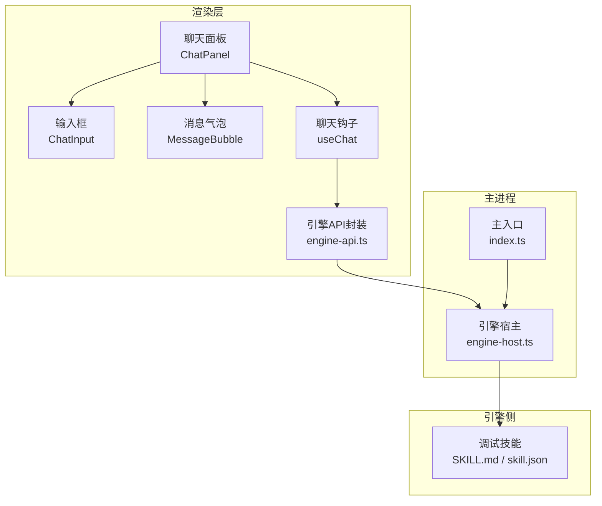
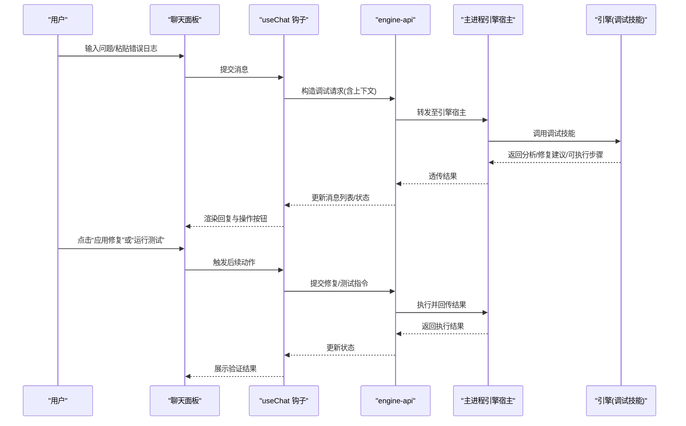
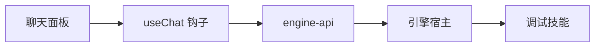
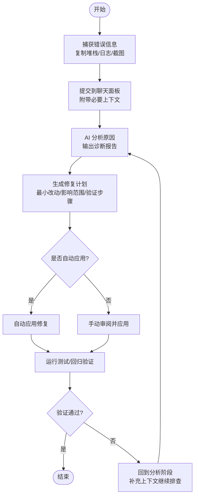
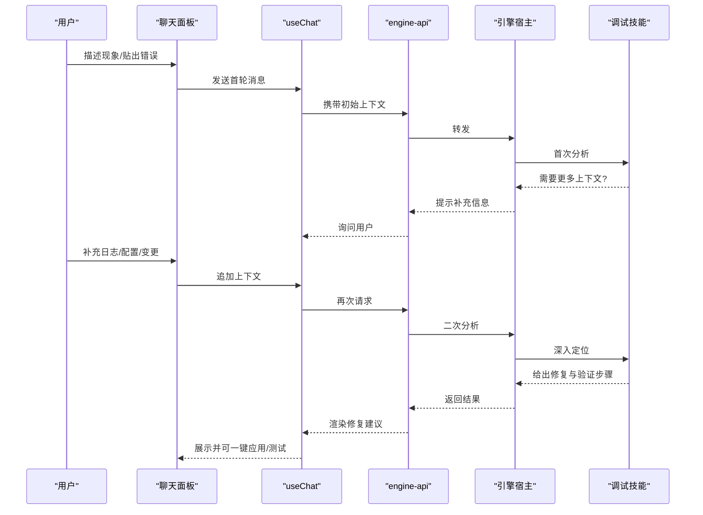

# 调试辅助工作流

<cite>
**本文引用的文件**   
- [engine/skills/debugging/SKILL.md](file://engine/skills/debugging/SKILL.md)
- [engine/skills/debugging/skill.json](file://engine/skills/debugging/skill.json)
- [app/renderer/src/components/ChatPanel/index.tsx](file://app/renderer/src/components/ChatPanel/index.tsx)
- [app/renderer/src/components/ChatPanel/ChatInput.tsx](file://app/renderer/src/components/ChatPanel/ChatInput.tsx)
- [app/renderer/src/components/ChatPanel/MessageBubble.tsx](file://app/renderer/src/components/ChatPanel/MessageBubble.tsx)
- [app/renderer/src/hooks/useChat.ts](file://app/renderer/src/hooks/useChat.ts)
- [app/renderer/src/services/engine-api.ts](file://app/renderer/src/services/engine-api.ts)
- [app/main/engine-host.ts](file://app/main/engine-host.ts)
- [app/main/index.ts](file://app/main/index.ts)
</cite>

## 目录
1. [简介](#简介)
2. [项目结构](#项目结构)
3. [核心组件](#核心组件)
4. [架构总览](#架构总览)
5. [详细组件分析](#详细组件分析)
6. [依赖关系分析](#依赖关系分析)
7. [性能与稳定性考量](#性能与稳定性考量)
8. [故障排查指南](#故障排查指南)
9. [结论](#结论)
10. [附录：常见调试场景与对话式调试流程](#附录常见调试场景与对话式调试流程)

## 简介
本指南面向使用 KCoder 的开发者，系统化介绍“智能调试”的完整工作流：从错误捕获与提交、AI 原因分析、修复建议生成、自动应用修复到效果验证；并覆盖运行时错误、编译错误、逻辑错误、性能问题等典型场景。同时提供对话式调试方法，包括上下文收集、多轮深度分析与测试用例自动生成和验证，帮助快速定位问题并提升调试效率。

## 项目结构
围绕调试能力，工程由两部分组成：
- 引擎侧（engine）：包含“调试技能”定义与工具链，用于驱动 AI 进行错误分析、修复方案生成与执行。
- 渲染层（app/renderer）：提供聊天面板、消息气泡、输入框等 UI，承载对话式调试交互。
- 主进程（app/main）：负责与引擎通信、管理会话生命周期与事件转发。

图表来源
- [app/renderer/src/components/ChatPanel/index.tsx](file://app/renderer/src/components/ChatPanel/index.tsx)
- [app/renderer/src/components/ChatPanel/ChatInput.tsx](file://app/renderer/src/components/ChatPanel/ChatInput.tsx)
- [app/renderer/src/components/ChatPanel/MessageBubble.tsx](file://app/renderer/src/components/ChatPanel/MessageBubble.tsx)
- [app/renderer/src/hooks/useChat.ts](file://app/renderer/src/hooks/useChat.ts)
- [app/renderer/src/services/engine-api.ts](file://app/renderer/src/services/engine-api.ts)
- [app/main/engine-host.ts](file://app/main/engine-host.ts)
- [app/main/index.ts](file://app/main/index.ts)
- [engine/skills/debugging/SKILL.md](file://engine/skills/debugging/SKILL.md)
- [engine/skills/debugging/skill.json](file://engine/skills/debugging/skill.json)

章节来源
- [app/renderer/src/components/ChatPanel/index.tsx](file://app/renderer/src/components/ChatPanel/index.tsx)
- [app/renderer/src/components/ChatPanel/ChatInput.tsx](file://app/renderer/src/components/ChatPanel/ChatInput.tsx)
- [app/renderer/src/components/ChatPanel/MessageBubble.tsx](file://app/renderer/src/components/ChatPanel/MessageBubble.tsx)
- [app/renderer/src/hooks/useChat.ts](file://app/renderer/src/hooks/useChat.ts)
- [app/renderer/src/services/engine-api.ts](file://app/renderer/src/services/engine-api.ts)
- [app/main/engine-host.ts](file://app/main/engine-host.ts)
- [app/main/index.ts](file://app/main/index.ts)
- [engine/skills/debugging/SKILL.md](file://engine/skills/debugging/SKILL.md)
- [engine/skills/debugging/skill.json](file://engine/skills/debugging/skill.json)

## 核心组件
- 聊天面板（ChatPanel）：聚合输入、消息展示与状态管理，是用户发起调试请求的入口。
- 聊天钩子（useChat）：封装消息发送、接收、历史管理与重试策略。
- 引擎API（engine-api.ts）：统一调用引擎侧能力（如调试技能），处理请求参数与响应解析。
- 引擎宿主（engine-host.ts）：在主进程中桥接渲染层与引擎，负责会话、任务与结果回传。
- 调试技能（debugging SKILL）：定义调试流程、工具调用规范与输出格式，指导 AI 完成分析、修复与验证。

章节来源
- [app/renderer/src/components/ChatPanel/index.tsx](file://app/renderer/src/components/ChatPanel/index.tsx)
- [app/renderer/src/hooks/useChat.ts](file://app/renderer/src/hooks/useChat.ts)
- [app/renderer/src/services/engine-api.ts](file://app/renderer/src/services/engine-api.ts)
- [app/main/engine-host.ts](file://app/main/engine-host.ts)
- [engine/skills/debugging/SKILL.md](file://engine/skills/debugging/SKILL.md)
- [engine/skills/debugging/skill.json](file://engine/skills/debugging/skill.json)

## 架构总览
下图展示了从用户触发调试到 AI 分析、修复与验证的端到端流程。

图表来源
- [app/renderer/src/components/ChatPanel/index.tsx](file://app/renderer/src/components/ChatPanel/index.tsx)
- [app/renderer/src/hooks/useChat.ts](file://app/renderer/src/hooks/useChat.ts)
- [app/renderer/src/services/engine-api.ts](file://app/renderer/src/services/engine-api.ts)
- [app/main/engine-host.ts](file://app/main/engine-host.ts)
- [engine/skills/debugging/SKILL.md](file://engine/skills/debugging/SKILL.md)

## 详细组件分析

### 聊天面板与消息流
- 职责：承载用户输入、展示 AI 回复、提供“应用修复/运行测试”等操作入口。
- 关键点：
  - 将用户输入与必要上下文（如当前文件、错误片段）打包后通过 useChat 提交。
  - 根据引擎返回的结构化内容渲染不同区块（说明、代码变更、测试结果）。
  - 对长耗时操作提供进度与重试提示。

章节来源
- [app/renderer/src/components/ChatPanel/index.tsx](file://app/renderer/src/components/ChatPanel/index.tsx)
- [app/renderer/src/components/ChatPanel/MessageBubble.tsx](file://app/renderer/src/components/ChatPanel/MessageBubble.tsx)
- [app/renderer/src/components/ChatPanel/ChatInput.tsx](file://app/renderer/src/components/ChatPanel/ChatInput.tsx)

### 聊天钩子 useChat
- 职责：维护消息历史、发送/接收消息、错误重试、加载态控制。
- 关键点：
  - 将消息转换为 engine-api 所需参数，附加会话标识与上下文。
  - 支持增量更新与失败重试，保证弱网环境下的稳定性。
  - 暴露统一的“应用修复/运行测试”回调接口供 UI 调用。

章节来源
- [app/renderer/src/hooks/useChat.ts](file://app/renderer/src/hooks/useChat.ts)

### 引擎API封装 engine-api.ts
- 职责：统一封装与引擎的通信协议、序列化/反序列化、错误映射。
- 关键点：
  - 将聊天消息与调试上下文包装为引擎可调用的请求体。
  - 对引擎返回的标准化结果进行解析，区分“分析结果/修复建议/执行结果”。
  - 提供重试与超时控制，屏蔽底层差异。

章节来源
- [app/renderer/src/services/engine-api.ts](file://app/renderer/src/services/engine-api.ts)

### 主进程引擎宿主 engine-host.ts
- 职责：作为渲染层与引擎之间的桥梁，管理会话、任务调度与结果回传。
- 关键点：
  - 接收来自渲染层的调试请求，路由到对应引擎模块。
  - 维护会话上下文，确保多轮对话连贯性。
  - 将执行结果（含修复与测试反馈）回传给渲染层。

章节来源
- [app/main/engine-host.ts](file://app/main/engine-host.ts)

### 调试技能 debugging SKILL
- 职责：定义调试流程、工具调用规范、输出格式与最佳实践。
- 关键点：
  - 明确错误分类（运行时/编译/逻辑/性能）与对应的诊断路径。
  - 规定如何收集上下文（堆栈、日志、配置、最近变更）。
  - 输出结构化修复建议（含最小改动、影响范围、验证步骤）。
  - 支持自动化执行（如应用补丁、运行单测/集成测）并汇总结果。

章节来源
- [engine/skills/debugging/SKILL.md](file://engine/skills/debugging/SKILL.md)
- [engine/skills/debugging/skill.json](file://engine/skills/debugging/skill.json)

## 依赖关系分析
- 渲染层依赖 useChat 与 engine-api，后者再依赖主进程引擎宿主。
- 引擎宿主依赖调试技能定义，驱动 AI 完成分析、修复与验证。
- 整体耦合点集中在“请求/响应契约”与“会话上下文传递”。

图表来源
- [app/renderer/src/components/ChatPanel/index.tsx](file://app/renderer/src/components/ChatPanel/index.tsx)
- [app/renderer/src/hooks/useChat.ts](file://app/renderer/src/hooks/useChat.ts)
- [app/renderer/src/services/engine-api.ts](file://app/renderer/src/services/engine-api.ts)
- [app/main/engine-host.ts](file://app/main/engine-host.ts)
- [engine/skills/debugging/SKILL.md](file://engine/skills/debugging/SKILL.md)

## 性能与稳定性考量
- 大文本与长日志：建议在提交前裁剪无关部分，保留关键堆栈与时间线。
- 批量修复：优先采用最小改动原则，分步应用并逐步验证，避免一次性大范围变更。
- 网络与重试：在 useChat 中实现指数退避重试，降低偶发失败的影响。
- 资源占用：对重型任务（全量测试）提供后台执行与进度反馈，避免阻塞 UI。

## 故障排查指南
- 无法连接引擎：检查主进程是否启动、端口/通道是否正常、权限是否足够。
- 消息未显示：确认 useChat 的消息队列与渲染刷新逻辑是否被正确触发。
- 修复未生效：核对引擎返回的变更范围与目标文件一致性，必要时回滚并重新生成。
- 测试失败：查看引擎返回的详细断言信息与日志，结合上下文缩小复现范围。

章节来源
- [app/renderer/src/hooks/useChat.ts](file://app/renderer/src/hooks/useChat.ts)
- [app/renderer/src/services/engine-api.ts](file://app/renderer/src/services/engine-api.ts)
- [app/main/engine-host.ts](file://app/main/engine-host.ts)

## 结论
通过“聊天面板 + 引擎宿主 + 调试技能”的分层设计，KCoder 实现了从错误捕获、AI 分析、修复建议到自动应用与验证的闭环调试体验。配合对话式调试，可在复杂问题中持续收敛根因，显著提升定位与修复效率。

## 附录：常见调试场景与对话式调试流程

### 端到端工作流（通用）

[本图为概念流程图，无需图表来源]

### 运行时错误
- 要点：收集完整堆栈、最近一次成功运行的版本、相关配置与环境变量。
- 建议：先复现最小用例，再让 AI 基于最小用例给出修复与回归测试。

### 编译错误
- 要点：提供编译器输出、依赖版本、构建脚本与平台信息。
- 建议：优先修复类型/语法层面的阻断性问题，再处理警告。

### 逻辑错误
- 要点：提供输入样例、期望与实际输出、关键分支路径。
- 建议：让 AI 生成针对性单测，以测试驱动修复。

### 性能问题
- 要点：提供热点函数、采样数据、内存/CPU 指标与调用链。
- 建议：先做瓶颈定位（I/O、CPU、锁竞争），再提出优化方案与基准对比。

### 对话式调试（多轮深度分析）

图表来源
- [app/renderer/src/components/ChatPanel/index.tsx](file://app/renderer/src/components/ChatPanel/index.tsx)
- [app/renderer/src/hooks/useChat.ts](file://app/renderer/src/hooks/useChat.ts)
- [app/renderer/src/services/engine-api.ts](file://app/renderer/src/services/engine-api.ts)
- [app/main/engine-host.ts](file://app/main/engine-host.ts)
- [engine/skills/debugging/SKILL.md](file://engine/skills/debugging/SKILL.md)

### 技巧与快速定位
- 精准上下文：只保留与问题相关的片段，减少噪声。
- 分治法：将大问题拆成小问题逐个击破。
- 最小复现：用最少代码/数据复现问题，提高 AI 定位准确率。
- 渐进验证：每次只改一处，立即运行测试验证。
- 记录决策：在对话中记录关键假设与尝试，便于回溯。