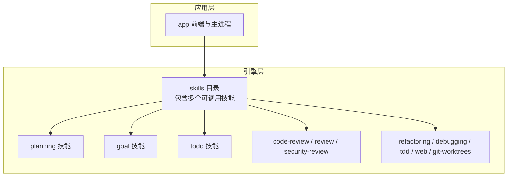
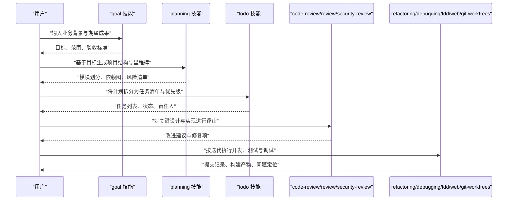
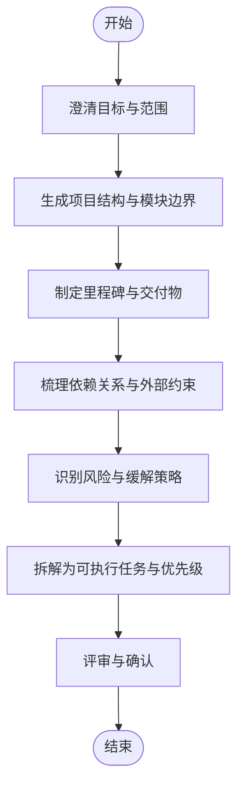
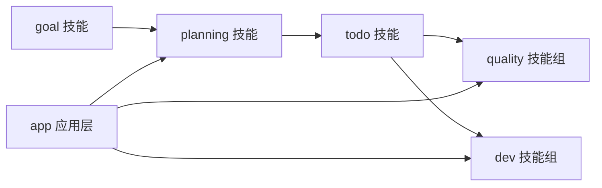

# 项目规划工作流

<cite>
**本文引用的文件**   
- [engine/skills/planning/SKILL.md](file://engine/skills/planning/SKILL.md)
- [engine/skills/planning/skill.json](file://engine/skills/planning/skill.json)
- [engine/skills/goal/SKILL.md](file://engine/skills/goal/SKILL.md)
- [engine/skills/goal/skill.json](file://engine/skills/goal/skill.json)
- [engine/skills/todo/SKILL.md](file://engine/skills/todo/SKILL.md)
- [engine/skills/todo/skill.json](file://engine/skills/todo/skill.json)
- [engine/skills/code-review/SKILL.md](file://engine/skills/code-review/SKILL.md)
- [engine/skills/code-review/skill.json](file://engine/skills/code-review/skill.json)
- [engine/skills/debugging/SKILL.md](file://engine/skills/debugging/SKILL.md)
- [engine/skills/debugging/skill.json](file://engine/skills/debugging/skill.json)
- [engine/skills/refactoring/SKILL.md](file://engine/skills/refactoring/SKILL.md)
- [engine/skills/refactoring/skill.json](file://engine/skills/refactoring/skill.json)
- [engine/skills/review/SKILL.md](file://engine/skills/review/SKILL.md)
- [engine/skills/review/skill.json](file://engine/skills/review/skill.json)
- [engine/skills/security-review/SKILL.md](file://engine/skills/security-review/SKILL.md)
- [engine/skills/security-review/skill.json](file://engine/skills/security-review/skill.json)
- [engine/skills/tdd/SKILL.md](file://engine/skills/tdd/SKILL.md)
- [engine/skills/tdd/skill.json](file://engine/skills/tdd/skill.json)
- [engine/skills/web/SKILL.md](file://engine/skills/web/SKILL.md)
- [engine/skills/web/skill.json](file://engine/skills/web/skill.json)
- [engine/skills/git-worktrees/SKILL.md](file://engine/skills/git-worktrees/SKILL.md)
- [engine/skills/git-worktrees/skill.json](file://engine/skills/git-worktrees/skill.json)
- [engine/README.md](file://engine/README.md)
- [app/package.json](file://app/package.json)
- [engine/package.json](file://engine/package.json)
</cite>

## 目录
1. [简介](#简介)
2. [项目结构](#项目结构)
3. [核心组件](#核心组件)
4. [架构总览](#架构总览)
5. [详细组件分析](#详细组件分析)
6. [依赖分析](#依赖分析)
7. [性能考虑](#性能考虑)
8. [故障排查指南](#故障排查指南)
9. [结论](#结论)
10. [附录](#附录)

## 简介
本指南面向使用KCoder进行“AI辅助项目规划”的工程师与团队，围绕以下目标提供端到端的工作流：
- 定义项目目标与需求，形成可执行的项目计划
- 自动生成项目结构与架构设计草案
- 将复杂任务分解为可执行的子任务，并建立里程碑
- 跟踪进度、依赖关系与风险
- 使用规划技能（planning）、目标管理（goal）、待办（todo）等能力完成从概念到执行的全流程
- 针对大型项目的模块化设计、版本管理与团队协作分工提供实践建议

## 项目结构
KCoder采用多包工程组织，其中“skills”目录包含一系列可被AI调用的技能。与项目规划直接相关的技能包括：
- planning：用于生成计划、拆解任务、制定里程碑与依赖图
- goal：用于明确目标、范围与验收标准
- todo：用于维护任务清单、优先级与状态
- code-review、review、security-review、refactoring、debugging、tdd、web、git-worktrees：在规划落地阶段提供质量保障与协作支持

图表来源
- [engine/skills/planning/SKILL.md](file://engine/skills/planning/SKILL.md)
- [engine/skills/planning/skill.json](file://engine/skills/planning/skill.json)
- [engine/skills/goal/SKILL.md](file://engine/skills/goal/SKILL.md)
- [engine/skills/goal/skill.json](file://engine/skills/goal/skill.json)
- [engine/skills/todo/SKILL.md](file://engine/skills/todo/SKILL.md)
- [engine/skills/todo/skill.json](file://engine/skills/todo/skill.json)
- [engine/skills/code-review/SKILL.md](file://engine/skills/code-review/SKILL.md)
- [engine/skills/code-review/skill.json](file://engine/skills/code-review/skill.json)
- [engine/skills/debugging/SKILL.md](file://engine/skills/debugging/SKILL.md)
- [engine/skills/debugging/skill.json](file://engine/skills/debugging/skill.json)
- [engine/skills/refactoring/SKILL.md](file://engine/skills/refactoring/SKILL.md)
- [engine/skills/refactoring/skill.json](file://engine/skills/refactoring/skill.json)
- [engine/skills/review/SKILL.md](file://engine/skills/review/SKILL.md)
- [engine/skills/review/skill.json](file://engine/skills/review/skill.json)
- [engine/skills/security-review/SKILL.md](file://engine/skills/security-review/SKILL.md)
- [engine/skills/security-review/skill.json](file://engine/skills/security-review/skill.json)
- [engine/skills/tdd/SKILL.md](file://engine/skills/tdd/SKILL.md)
- [engine/skills/tdd/skill.json](file://engine/skills/tdd/skill.json)
- [engine/skills/web/SKILL.md](file://engine/skills/web/SKILL.md)
- [engine/skills/web/sill.json](file://engine/skills/web/skill.json)
- [engine/skills/git-worktrees/SKILL.md](file://engine/skills/git-worktrees/SKILL.md)
- [engine/skills/git-worktrees/skill.json](file://engine/skills/git-worktrees/skill.json)
- [app/package.json](file://app/package.json)

章节来源
- [engine/README.md](file://engine/README.md)
- [app/package.json](file://app/package.json)
- [engine/package.json](file://engine/package.json)

## 核心组件
- 规划技能（planning）：负责将模糊需求转化为结构化计划，输出项目结构、模块划分、里程碑、依赖关系与风险评估。
- 目标管理（goal）：聚焦于目标澄清、范围界定、验收标准与成功指标。
- 待办管理（todo）：维护任务清单、优先级、状态与责任人，支撑迭代推进。
- 质量与安全（code-review、review、security-review）：在计划落地阶段提供代码审查、安全扫描与重构建议。
- 开发与协作（refactoring、debugging、tdd、web、git-worktrees）：辅助实现阶段的测试驱动开发、调试、Web相关能力与分支策略。

章节来源
- [engine/skills/planning/SKILL.md](file://engine/skills/planning/SKILL.md)
- [engine/skills/planning/skill.json](file://engine/skills/planning/skill.json)
- [engine/skills/goal/SKILL.md](file://engine/skills/goal/SKILL.md)
- [engine/skills/goal/skill.json](file://engine/skills/goal/skill.json)
- [engine/skills/todo/SKILL.md](file://engine/skills/todo/SKILL.md)
- [engine/skills/todo/skill.json](file://engine/skills/todo/skill.json)
- [engine/skills/code-review/SKILL.md](file://engine/skills/code-review/SKILL.md)
- [engine/skills/code-review/skill.json](file://engine/skills/code-review/skill.json)
- [engine/skills/debugging/SKILL.md](file://engine/skills/debugging/SKILL.md)
- [engine/skills/debugging/skill.json](file://engine/skills/debugging/skill.json)
- [engine/skills/refactoring/SKILL.md](file://engine/skills/refactoring/SKILL.md)
- [engine/skills/refactoring/sill.json](file://engine/skills/refactoring/skill.json)
- [engine/skills/review/SKILL.md](file://engine/skills/review/SKILL.md)
- [engine/skills/review/skill.json](file://engine/skills/review/skill.json)
- [engine/skills/security-review/SKILL.md](file://engine/skills/security-review/SKILL.md)
- [engine/skills/security-review/sill.json](file://engine/skills/security-review/skill.json)
- [engine/skills/tdd/SKILL.md](file://engine/skills/tdd/SKILL.md)
- [engine/skills/tdd/skill.json](file://engine/skills/tdd/skill.json)
- [engine/skills/web/SKILL.md](file://engine/skills/web/SKILL.md)
- [engine/skills/web/skill.json](file://engine/skills/web/skill.json)
- [engine/skills/git-worktrees/SKILL.md](file://engine/skills/git-worktrees/SKILL.md)
- [engine/skills/git-worktrees/skill.json](file://engine/skills/git-worktrees/skill.json)

## 架构总览
下图展示了从“需求输入”到“可执行计划”的端到端流程，以及各技能之间的交互关系。

图表来源
- [engine/skills/goal/SKILL.md](file://engine/skills/goal/SKILL.md)
- [engine/skills/planning/SKILL.md](file://engine/skills/planning/SKILL.md)
- [engine/skills/todo/SKILL.md](file://engine/skills/todo/SKILL.md)
- [engine/skills/code-review/SKILL.md](file://engine/skills/code-review/SKILL.md)
- [engine/skills/review/SKILL.md](file://engine/skills/review/SKILL.md)
- [engine/skills/security-review/SKILL.md](file://engine/skills/security-review/SKILL.md)
- [engine/skills/refactoring/SKILL.md](file://engine/skills/refactoring/SKILL.md)
- [engine/skills/debugging/SKILL.md](file://engine/skills/debugging/SKILL.md)
- [engine/skills/tdd/SKILL.md](file://engine/skills/tdd/SKILL.md)
- [engine/skills/web/SKILL.md](file://engine/skills/web/SKILL.md)
- [engine/skills/git-worktrees/SKILL.md](file://engine/skills/git-worktrees/SKILL.md)

## 详细组件分析

### 规划技能（planning）
- 职责
  - 将模糊需求转化为结构化计划：项目结构、模块边界、接口契约、里程碑与依赖关系
  - 识别风险与约束，提出缓解措施
  - 输出可追踪的任务清单与验收标准
- 使用方法
  - 通过SKILL.md了解技能输入输出规范与提示模板
  - 通过skill.json注册技能元数据，供运行时加载与调度
- 典型产出
  - 项目结构草案、架构图、里程碑表、依赖图、风险登记册
- 最佳实践
  - 先明确目标与范围，再展开计划；以“最小可行计划”启动，逐步细化
  - 将高风险路径前置验证，降低后期返工成本

章节来源
- [engine/skills/planning/SKILL.md](file://engine/skills/planning/SKILL.md)
- [engine/skills/planning/skill.json](file://engine/skills/planning/skill.json)

#### 流程图：从需求到计划

图表来源
- [engine/skills/planning/SKILL.md](file://engine/skills/planning/SKILL.md)

### 目标管理（goal）
- 职责
  - 明确业务目标、成功指标与验收标准
  - 划定范围与边界，避免范围蔓延
- 使用方法
  - 使用SKILL.md中的模板引导输入关键信息
  - 通过skill.json注册，确保在规划阶段优先调用
- 典型产出
  - 目标声明、范围说明、验收清单、度量指标

章节来源
- [engine/skills/goal/SKILL.md](file://engine/skills/goal/SKILL.md)
- [engine/skills/goal/skill.json](file://engine/skills/goal/skill.json)

### 待办管理（todo）
- 职责
  - 维护任务清单、优先级、状态与责任人
  - 支持迭代推进与进度可视化
- 使用方法
  - 结合planning的输出，将任务逐项录入
  - 定期更新状态，同步变更影响
- 典型产出
  - 任务看板、燃尽图、阻塞项清单

章节来源
- [engine/skills/todo/SKILL.md](file://engine/skills/todo/SKILL.md)
- [engine/skills/todo/skill.json](file://engine/skills/todo/skill.json)

### 质量与安全（code-review、review、security-review）
- 职责
  - 对设计与实现进行同行评审、安全检查与重构建议
- 使用方法
  - 在关键里程碑前后触发评审
  - 将评审意见纳入待办并闭环
- 典型产出
  - 评审报告、修复清单、重构建议

章节来源
- [engine/skills/code-review/SKILL.md](file://engine/skills/code-review/SKILL.md)
- [engine/skills/code-review/skill.json](file://engine/skills/code-review/skill.json)
- [engine/skills/review/SKILL.md](file://engine/skills/review/SKILL.md)
- [engine/skills/review/skill.json](file://engine/skills/review/skill.json)
- [engine/skills/security-review/SKILL.md](file://engine/skills/security-review/SKILL.md)
- [engine/skills/security-review/skill.json](file://engine/skills/security-review/skill.json)

### 开发与协作（refactoring、debugging、tdd、web、git-worktrees）
- 职责
  - 提供重构、调试、TDD、Web相关能力与Git工作树策略
- 使用方法
  - 在实现阶段按需启用相应技能
  - 结合分支策略与变更记录，保持可追溯性
- 典型产出
  - 重构方案、缺陷定位、测试用例、分支与工作区

章节来源
- [engine/skills/refactoring/SKILL.md](file://engine/skills/refactoring/SKILL.md)
- [engine/skills/refactoring/skill.json](file://engine/skills/refactoring/skill.json)
- [engine/skills/debugging/SKILL.md](file://engine/skills/debugging/SKILL.md)
- [engine/skills/debugging/skill.json](file://engine/skills/debugging/skill.json)
- [engine/skills/tdd/SKILL.md](file://engine/skills/tdd/SKILL.md)
- [engine/skills/tdd/skill.json](file://engine/skills/tdd/skill.json)
- [engine/skills/web/SKILL.md](file://engine/skills/web/SKILL.md)
- [engine/skills/web/skill.json](file://engine/skills/web/skill.json)
- [engine/skills/git-worktrees/SKILL.md](file://engine/skills/git-worktrees/SKILL.md)
- [engine/skills/git-worktrees/skill.json](file://engine/skills/git-worktrees/skill.json)

## 依赖分析
- 技能间耦合
  - planning依赖goal的输入（目标与范围），并产出todo所需的任务清单
  - quality与dev技能在实现阶段消费planning与todo的输出
- 外部集成点
  - 应用层（app）通过package.json声明依赖，与engine的多包结构协同
- 潜在循环依赖
  - 建议在技能定义中保持单向依赖：goal → planning → todo → quality/dev

图表来源
- [engine/skills/goal/SKILL.md](file://engine/skills/goal/SKILL.md)
- [engine/skills/planning/SKILL.md](file://engine/skills/planning/SKILL.md)
- [engine/skills/todo/SKILL.md](file://engine/skills/todo/SKILL.md)
- [engine/skills/code-review/SKILL.md](file://engine/skills/code-review/SKILL.md)
- [engine/skills/refactoring/SKILL.md](file://engine/skills/refactoring/SKILL.md)
- [app/package.json](file://app/package.json)

章节来源
- [app/package.json](file://app/package.json)
- [engine/package.json](file://engine/package.json)

## 性能考虑
- 规划阶段
  - 控制上下文规模：仅引入必要信息，避免一次性注入过多历史
  - 分步生成：先生成高层结构，再逐步细化模块与任务
- 执行阶段
  - 并行化独立任务：利用git-worktrees与多包特性并行推进
  - 增量评审：小步快跑，频繁触发轻量评审与自动化检查
- 资源优化
  - 缓存常用模板与结构，减少重复生成
  - 对长链路任务设置超时与重试策略

[本节为通用指导，不直接分析具体文件]

## 故障排查指南
- 常见问题
  - 目标不清导致计划反复修改：先用goal技能收敛范围与验收标准
  - 任务粒度不当导致进度不可控：调整todo粒度，确保每个任务可在短周期内完成
  - 依赖冲突引发阻塞：在planning阶段显式标注依赖，提前协调
- 处理步骤
  - 回溯最近一次计划变更，定位影响面
  - 使用review与security-review快速评估风险
  - 通过debugging与tdd定位问题根因并回归验证

章节来源
- [engine/skills/review/SKILL.md](file://engine/skills/review/SKILL.md)
- [engine/skills/security-review/SKILL.md](file://engine/skills/security-review/SKILL.md)
- [engine/skills/debugging/SKILL.md](file://engine/skills/debugging/SKILL.md)
- [engine/skills/tdd/SKILL.md](file://engine/skills/tdd/SKILL.md)

## 结论
借助KCoder的规划技能体系，团队可以在需求澄清、结构设计、任务拆解、里程碑制定与风险控制方面形成标准化、可复用的工作流。配合质量与安全技能，以及开发与协作工具，能够显著提升大型项目的可控性与交付效率。

[本节为总结性内容，不直接分析具体文件]

## 附录

### 实际案例：从概念到执行计划
- 场景
  - 构建一个跨平台桌面应用，具备聊天面板、代码块渲染、设置面板与状态栏
- 步骤
  - 使用goal技能明确目标、范围与验收标准
  - 使用planning技能生成项目结构、模块边界与里程碑
  - 使用todo技能拆分任务、设定优先级与责任人
  - 在关键节点触发code-review与security-review，确保质量与安全
  - 使用refactoring、debugging、tdd与web技能推进实现与验证
  - 使用git-worktrees管理并行分支与协作
- 产出
  - 目标声明、项目结构草案、里程碑表、任务清单、评审报告、重构与修复清单

章节来源
- [engine/skills/goal/SKILL.md](file://engine/skills/goal/SKILL.md)
- [engine/skills/planning/SKILL.md](file://engine/skills/planning/SKILL.md)
- [engine/skills/todo/SKILL.md](file://engine/skills/todo/SKILL.md)
- [engine/skills/code-review/SKILL.md](file://engine/skills/code-review/SKILL.md)
- [engine/skills/security-review/SKILL.md](file://engine/skills/security-review/SKILL.md)
- [engine/skills/refactoring/SKILL.md](file://engine/skills/refactoring/SKILL.md)
- [engine/skills/debugging/SKILL.md](file://engine/skills/debugging/SKILL.md)
- [engine/skills/tdd/SKILL.md](file://engine/skills/tdd/SKILL.md)
- [engine/skills/web/SKILL.md](file://engine/skills/web/SKILL.md)
- [engine/skills/git-worktrees/SKILL.md](file://engine/skills/git-worktrees/SKILL.md)