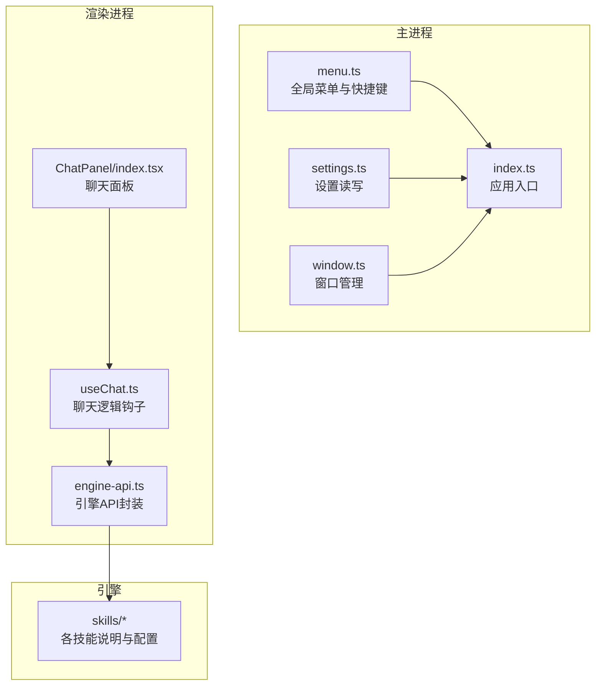
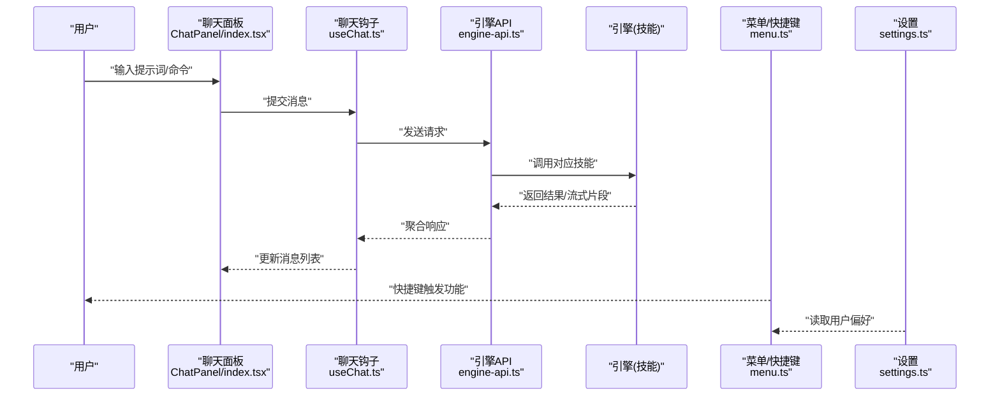
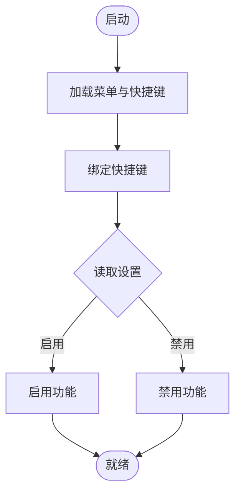
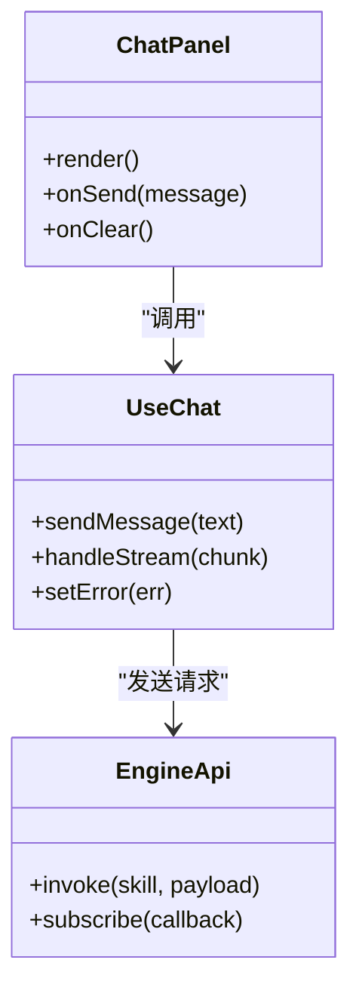
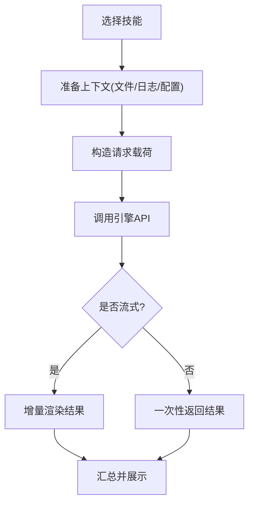
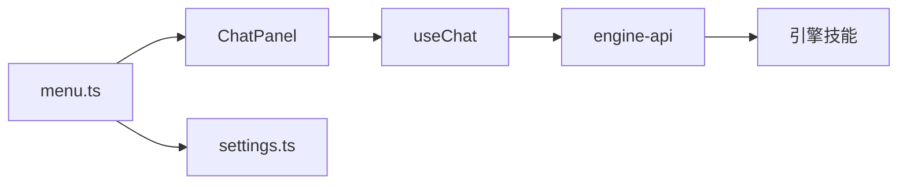

# 快捷键与技巧

<cite>
**本文引用的文件**   
- [app/main/menu.ts](file://app/main/menu.ts)
- [app/main/settings.ts](file://app/main/settings.ts)
- [app/main/index.ts](file://app/main/index.ts)
- [app/main/window.ts](file://app/main/window.ts)
- [app/renderer/src/components/ChatPanel/index.tsx](file://app/renderer/src/components/ChatPanel/index.tsx)
- [app/renderer/src/hooks/useChat.ts](file://app/renderer/src/hooks/useChat.ts)
- [app/renderer/src/services/engine-api.ts](file://app/renderer/src/services/engine-api.ts)
- [engine/skills/code-review/SKILL.md](file://engine/skills/code-review/SKILL.md)
- [engine/skills/debugging/SKILL.md](file://engine/skills/debugging/SKILL.md)
- [engine/skills/planning/SKILL.md](file://engine/skills/planning/SKILL.md)
- [engine/skills/refactoring/SKILL.md](file://engine/skills/refactoring/SKILL.md)
- [engine/skills/review/SKILL.md](file://engine/skills/review/SKILL.md)
- [engine/skills/security-review/SKILL.md](file://engine/skills/security-review/SKILL.md)
- [engine/skills/tdd/SKILL.md](file://engine/skills/tdd/SKILL.md)
- [engine/skills/todo/SKILL.md](file://engine/skills/todo/SKILL.md)
- [engine/skills/web/SKILL.md](file://engine/skills/web/SKILL.md)
</cite>

## 目录
1. [简介](#简介)
2. [项目结构](#项目结构)
3. [核心组件](#核心组件)
4. [架构总览](#架构总览)
5. [详细组件分析](#详细组件分析)
6. [依赖分析](#依赖分析)
7. [性能考虑](#性能考虑)
8. [故障排查指南](#故障排查指南)
9. [结论](#结论)
10. [附录](#附录)

## 简介
本指南聚焦于提升在 KCoder 中的开发效率，围绕键盘快捷键、鼠标操作、右键菜单、AI 交互、批量与自动化、工具集成与数据交换格式，以及个性化设置建议展开。文档内容基于仓库中主进程菜单、设置、渲染层聊天面板与引擎技能等源码位置进行梳理与归纳，帮助不同使用习惯的用户快速上手并高效工作。

## 项目结构
KCoder 采用 Electron 多进程架构：
- 主进程负责应用生命周期、窗口管理、全局菜单与快捷键注册、设置持久化等。
- 渲染进程承载 UI（React），包括聊天面板、状态栏、设置面板等。
- 引擎侧提供可插拔的“技能”能力，覆盖代码审查、调试、规划、重构、安全审查、TDD、待办、Web 等场景。

**图示来源**
- [app/main/menu.ts](file://app/main/menu.ts)
- [app/main/settings.ts](file://app/main/settings.ts)
- [app/main/index.ts](file://app/main/index.ts)
- [app/main/window.ts](file://app/main/window.ts)
- [app/renderer/src/components/ChatPanel/index.tsx](file://app/renderer/src/components/ChatPanel/index.tsx)
- [app/renderer/src/hooks/useChat.ts](file://app/renderer/src/hooks/useChat.ts)
- [app/renderer/src/services/engine-api.ts](file://app/renderer/src/services/engine-api.ts)
- [engine/skills/code-review/SKILL.md](file://engine/skills/code-review/SKILL.md)
- [engine/skills/debugging/SKILL.md](file://engine/skills/debugging/SKILL.md)
- [engine/skills/planning/SKILL.md](file://engine/skills/planning/SKILL.md)
- [engine/skills/refactoring/SKILL.md](file://engine/skills/refactoring/SKILL.md)
- [engine/skills/review/SKILL.md](file://engine/skills/review/SKILL.md)
- [engine/skills/security-review/SKILL.md](file://engine/skills/security-review/SKILL.md)
- [engine/skills/tdd/SKILL.md](file://engine/skills/tdd/SKILL.md)
- [engine/skills/todo/SKILL.md](file://engine/skills/todo/SKILL.md)
- [engine/skills/web/SKILL.md](file://engine/skills/web/SKILL.md)

**章节来源**
- [app/main/menu.ts](file://app/main/menu.ts)
- [app/main/settings.ts](file://app/main/settings.ts)
- [app/main/index.ts](file://app/main/index.ts)
- [app/main/window.ts](file://app/main/window.ts)
- [app/renderer/src/components/ChatPanel/index.tsx](file://app/renderer/src/components/ChatPanel/index.tsx)
- [app/renderer/src/hooks/useChat.ts](file://app/renderer/src/hooks/useChat.ts)
- [app/renderer/src/services/engine-api.ts](file://app/renderer/src/services/engine-api.ts)

## 核心组件
- 全局菜单与快捷键：通过主进程菜单模块集中定义，便于统一管理与扩展。
- 设置系统：提供用户偏好与行为开关的持久化存储，支持按平台区分。
- 聊天面板与 AI 交互：渲染层聊天输入与消息展示，结合 useChat 钩子与 engine-api 调用引擎能力。
- 引擎技能：以“技能”为粒度组织的能力集合，涵盖代码审查、调试、规划、重构、安全审查、TDD、待办、Web 等。

**章节来源**
- [app/main/menu.ts](file://app/main/menu.ts)
- [app/main/settings.ts](file://app/main/settings.ts)
- [app/renderer/src/components/ChatPanel/index.tsx](file://app/renderer/src/components/ChatPanel/index.tsx)
- [app/renderer/src/hooks/useChat.ts](file://app/renderer/src/hooks/useChat.ts)
- [app/renderer/src/services/engine-api.ts](file://app/renderer/src/services/engine-api.ts)
- [engine/skills/code-review/SKILL.md](file://engine/skills/code-review/SKILL.md)
- [engine/skills/debugging/SKILL.md](file://engine/skills/debugging/SKILL.md)
- [engine/skills/planning/SKILL.md](file://engine/skills/planning/SKILL.md)
- [engine/skills/refactoring/SKILL.md](file://engine/skills/refactoring/SKILL.md)
- [engine/skills/review/SKILL.md](file://engine/skills/review/SKILL.md)
- [engine/skills/security-review/SKILL.md](file://engine/skills/security-review/SKILL.md)
- [engine/skills/tdd/SKILL.md](file://engine/skills/tdd/SKILL.md)
- [engine/skills/todo/SKILL.md](file://engine/skills/todo/SKILL.md)
- [engine/skills/web/SKILL.md](file://engine/skills/web/SKILL.md)

## 架构总览
下图展示了从用户输入到引擎执行的关键路径：用户在聊天面板输入指令，useChat 将请求转发至 engine-api，后者与引擎通信；同时，主进程菜单与设置影响整体行为与可用能力。

**图示来源**
- [app/renderer/src/components/ChatPanel/index.tsx](file://app/renderer/src/components/ChatPanel/index.tsx)
- [app/renderer/src/hooks/useChat.ts](file://app/renderer/src/hooks/useChat.ts)
- [app/renderer/src/services/engine-api.ts](file://app/renderer/src/services/engine-api.ts)
- [app/main/menu.ts](file://app/main/menu.ts)
- [app/main/settings.ts](file://app/main/settings.ts)

## 详细组件分析

### 全局菜单与快捷键
- 职责：集中定义应用级菜单项与快捷键绑定，确保跨平台一致性与可扩展性。
- 关键点：
  - 通过主进程菜单模块注册快捷键，避免与编辑器内部快捷键冲突。
  - 菜单项可与设置联动，根据用户偏好启用/禁用特定功能。
  - 建议将常用操作（新建、保存、切换面板、打开聊天）映射为快捷键，减少鼠标操作。

**图示来源**
- [app/main/menu.ts](file://app/main/menu.ts)
- [app/main/settings.ts](file://app/main/settings.ts)

**章节来源**
- [app/main/menu.ts](file://app/main/menu.ts)
- [app/main/settings.ts](file://app/main/settings.ts)

### 聊天面板与 AI 交互
- 职责：提供用户与 AI 的对话界面，处理消息发送、接收与展示。
- 关键点：
  - ChatPanel 组件负责 UI 渲染与事件分发。
  - useChat 钩子封装聊天状态与业务逻辑，如发送消息、处理流式响应、错误重试。
  - engine-api 作为与引擎通信的抽象层，屏蔽底层协议细节。

**图示来源**
- [app/renderer/src/components/ChatPanel/index.tsx](file://app/renderer/src/components/ChatPanel/index.tsx)
- [app/renderer/src/hooks/useChat.ts](file://app/renderer/src/hooks/useChat.ts)
- [app/renderer/src/services/engine-api.ts](file://app/renderer/src/services/engine-api.ts)

**章节来源**
- [app/renderer/src/components/ChatPanel/index.tsx](file://app/renderer/src/components/ChatPanel/index.tsx)
- [app/renderer/src/hooks/useChat.ts](file://app/renderer/src/hooks/useChat.ts)
- [app/renderer/src/services/engine-api.ts](file://app/renderer/src/services/engine-api.ts)

### 引擎技能与工作流
- 职责：以“技能”为单位封装领域能力，供上层通过 API 调用。
- 常见技能：
  - 代码审查：静态检查、风格规范、潜在问题定位。
  - 调试：日志分析、断点辅助、堆栈解读。
  - 规划：任务拆解、里程碑设定、依赖关系梳理。
  - 重构：结构优化、命名规范化、重复代码消除。
  - 安全审查：漏洞扫描、敏感信息检测、合规建议。
  - TDD：测试驱动开发流程引导、用例生成、覆盖率统计。
  - 待办：任务清单维护、优先级排序、进度跟踪。
  - Web：前端工程化、构建优化、部署流水线建议。

**图示来源**
- [app/renderer/src/services/engine-api.ts](file://app/renderer/src/services/engine-api.ts)
- [engine/skills/code-review/SKILL.md](file://engine/skills/code-review/SKILL.md)
- [engine/skills/debugging/SKILL.md](file://engine/skills/debugging/SKILL.md)
- [engine/skills/planning/SKILL.md](file://engine/skills/planning/SKILL.md)
- [engine/skills/refactoring/SKILL.md](file://engine/skills/refactoring/SKILL.md)
- [engine/skills/review/SKILL.md](file://engine/skills/review/SKILL.md)
- [engine/skills/security-review/SKILL.md](file://engine/skills/security-review/SKILL.md)
- [engine/skills/tdd/SKILL.md](file://engine/skills/tdd/SKILL.md)
- [engine/skills/todo/SKILL.md](file://engine/skills/todo/SKILL.md)
- [engine/skills/web/SKILL.md](file://engine/skills/web/SKILL.md)

**章节来源**
- [engine/skills/code-review/SKILL.md](file://engine/skills/code-review/SKILL.md)
- [engine/skills/debugging/SKILL.md](file://engine/skills/debugging/SKILL.md)
- [engine/skills/planning/SKILL.md](file://engine/skills/planning/SKILL.md)
- [engine/skills/refactoring/SKILL.md](file://engine/skills/refactoring/SKILL.md)
- [engine/skills/review/SKILL.md](file://engine/skills/review/SKILL.md)
- [engine/skills/security-review/SKILL.md](file://engine/skills/security-review/SKILL.md)
- [engine/skills/tdd/SKILL.md](file://engine/skills/tdd/SKILL.md)
- [engine/skills/todo/SKILL.md](file://engine/skills/todo/SKILL.md)
- [engine/skills/web/SKILL.md](file://engine/skills/web/SKILL.md)

## 依赖分析
- 耦合关系：
  - 聊天面板依赖 useChat 钩子，useChat 依赖 engine-api。
  - 主进程菜单与设置相互协作，控制功能开关与快捷键行为。
- 外部集成：
  - 引擎通过技能体系对外暴露能力，上层仅关注接口契约。
  - 渲染层与主进程通过 IPC 通信（由 Electron 框架提供）。

**图示来源**
- [app/renderer/src/components/ChatPanel/index.tsx](file://app/renderer/src/components/ChatPanel/index.tsx)
- [app/renderer/src/hooks/useChat.ts](file://app/renderer/src/hooks/useChat.ts)
- [app/renderer/src/services/engine-api.ts](file://app/renderer/src/services/engine-api.ts)
- [app/main/menu.ts](file://app/main/menu.ts)
- [app/main/settings.ts](file://app/main/settings.ts)

**章节来源**
- [app/renderer/src/components/ChatPanel/index.tsx](file://app/renderer/src/components/ChatPanel/index.tsx)
- [app/renderer/src/hooks/useChat.ts](file://app/renderer/src/hooks/useChat.ts)
- [app/renderer/src/services/engine-api.ts](file://app/renderer/src/services/engine-api.ts)
- [app/main/menu.ts](file://app/main/menu.ts)
- [app/main/settings.ts](file://app/main/settings.ts)

## 性能考虑
- 流式响应：对长耗时任务优先采用流式输出，降低首屏等待时间。
- 批处理：对批量操作（如批量重命名、批量替换）采用队列与节流策略，避免阻塞 UI。
- 缓存：对频繁查询的结果（如技能元数据、最近会话）进行本地缓存。
- 资源释放：及时清理未使用的监听器与定时器，防止内存泄漏。

[本节为通用指导，不直接分析具体文件]

## 故障排查指南
- 常见问题：
  - 快捷键无效：检查主进程菜单是否正确注册，确认设置中未禁用相关功能。
  - 聊天无响应：查看 engine-api 的错误回调与网络状态，确认引擎服务可达。
  - 技能执行失败：核对技能所需的上下文（文件、日志、配置）是否完整。
- 定位步骤：
  - 在主进程控制台打印关键事件与参数。
  - 在渲染层捕获异常并上报错误信息。
  - 使用设置面板临时关闭可疑功能，逐步缩小范围。

**章节来源**
- [app/main/menu.ts](file://app/main/menu.ts)
- [app/main/settings.ts](file://app/main/settings.ts)
- [app/renderer/src/services/engine-api.ts](file://app/renderer/src/services/engine-api.ts)

## 结论
通过合理组织快捷键、善用右键菜单与聊天面板、结合引擎技能完成复杂任务，并配合个性化设置与批处理策略，可以显著提升在 KCoder 中的开发效率。建议在团队内推广标准化快捷键与技能使用规范，形成一致的协作体验。

[本节为总结性内容，不直接分析具体文件]

## 附录

### 快捷键与效率技巧（分类整理）
- 文件操作
  - 新建文件/文件夹：通过主进程菜单或快捷键触发，适合快速创建模板文件。
  - 保存与自动保存：结合设置开启自动保存，减少手动操作。
  - 查找与替换：在大型项目中优先使用全局查找，配合正则表达式提高精度。
- 编辑操作
  - 撤销/重做：保持连续编辑节奏，必要时分步撤销以避免误改。
  - 折叠/展开：利用代码块折叠减少视觉干扰，专注当前逻辑。
  - 格式化代码：在提交前统一格式，提升可读性与协作效率。
- 导航操作
  - 跳转到定义/引用：快速定位依赖关系，理解模块边界。
  - 面包屑导航：在深层目录结构中快速回退。
  - 标签页管理：合并相似文件，减少标签页数量。
- AI 交互
  - 聊天面板快捷发送：为常用指令设置快捷键，缩短输入路径。
  - 流式结果预览：边生成边阅读，及时调整提示词。
  - 技能选择：根据任务类型选择合适技能，获得更精准的建议。

[本节为概念性指引，不直接分析具体文件]

### 鼠标操作与右键菜单
- 右键菜单
  - 文件上下文：新增、删除、重命名、复制路径等。
  - 代码上下文：跳转到定义、查找所有引用、格式化选中区域。
  - 聊天上下文：复制消息、清空会话、导出记录。
- 拖拽与多选
  - 拖拽文件到聊天面板：快速附加上下文。
  - 多选文件批量操作：批量移动、重命名、删除。

[本节为概念性指引，不直接分析具体文件]

### 高级技巧：批量操作、自动化脚本、自定义命令
- 批量操作
  - 批量重命名：结合正则表达式统一命名规范。
  - 批量替换：跨文件替换关键字，注意备份与校验。
- 自动化脚本
  - 构建与测试：将常用命令封装为脚本，一键执行。
  - 代码质量：集成 lint、format、test 等步骤，保证一致性。
- 自定义命令
  - 在聊天面板中定义常用命令模板，减少重复输入。
  - 将重复性工作固化为技能，实现可复用流程。

[本节为概念性指引，不直接分析具体文件]

### 与其他工具的集成与数据交换格式
- 集成方式
  - 通过引擎 API 调用外部工具（如 linter、formatter、测试框架）。
  - 使用插件机制扩展能力，保持内核稳定。
- 数据交换格式
  - JSON：结构化配置与结果传输。
  - Markdown：文档与报告输出。
  - 日志文本：调试与分析依据。

[本节为概念性指引，不直接分析具体文件]

### 个性化设置建议
- 快捷键主题
  - 根据操作系统与编辑器习惯选择相近的键位布局，降低学习成本。
- 界面与行为
  - 调整字体大小与行高，提升长时间阅读的舒适度。
  - 开启自动保存与实时预览，提高反馈速度。
- 技能与能力
  - 按需启用技能，避免无关能力干扰注意力。
  - 为常用技能设置快捷入口，加速访问。

**章节来源**
- [app/main/settings.ts](file://app/main/settings.ts)