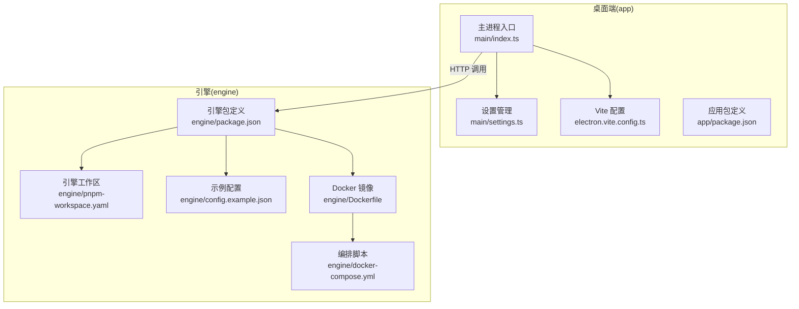
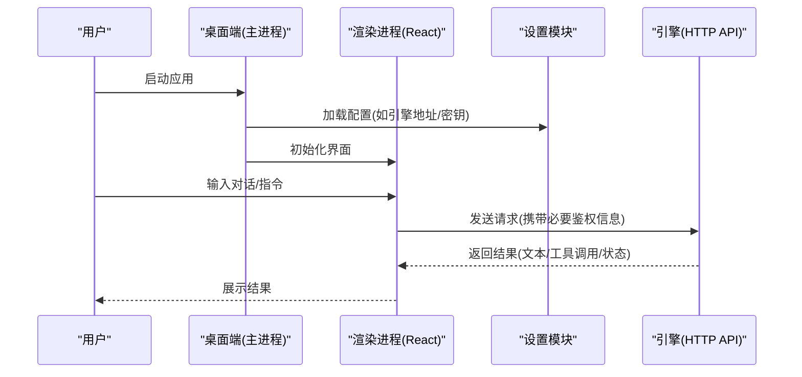
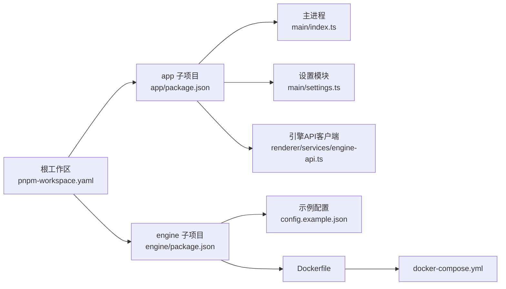

# 快速开始

<cite>
**本文引用的文件**   
- [package.json](file://package.json)
- [pnpm-workspace.yaml](file://pnpm-workspace.yaml)
- [engine/package.json](file://engine/package.json)
- [engine/pnpm-workspace.yaml](file://engine/pnpm-workspace.yaml)
- [app/package.json](file://app/package.json)
- [app/electron.vite.config.ts](file://app/electron.vite.config.ts)
- [app/main/index.ts](file://app/main/index.ts)
- [app/main/settings.ts](file://app/main/settings.ts)
- [app/renderer/src/services/engine-api.ts](file://app/renderer/src/services/engine-api.ts)
- [engine/config.example.json](file://engine/config.example.json)
- [engine/Dockerfile](file://engine/Dockerfile)
- [engine/docker-compose.yml](file://engine/docker-compose.yml)
</cite>

## 目录
1. [简介](#简介)
2. [项目结构](#项目结构)
3. [核心组件](#核心组件)
4. [架构总览](#架构总览)
5. [详细组件分析](#详细组件分析)
6. [依赖关系分析](#依赖关系分析)
7. [性能与资源建议](#性能与资源建议)
8. [故障排除指南](#故障排除指南)
9. [结论](#结论)
10. [附录](#附录) 

## 简介
本指南面向首次使用 KCoder 的开发者，帮助你从零开始完成环境准备、安装构建、首次启动配置与验证。KCoder 由前端桌面应用（Electron + Vite）与后端引擎（Node.js 多包工作区）组成，支持通过本地或容器方式运行引擎，并通过 API 与前端交互。

## 项目结构
仓库采用顶层 pnpm 工作区组织，包含：
- app：桌面端（Electron + Vite），负责 UI、窗口与菜单、设置面板等
- engine：AI 推理与任务编排引擎，提供 HTTP API、插件/能力注册、工具执行等

图表来源 
- [app/main/index.ts:1-200](file://app/main/index.ts#L1-L200)
- [app/main/settings.ts:1-200](file://app/main/settings.ts#L1-L200)
- [app/electron.vite.config.ts:1-200](file://app/electron.vite.config.ts#L1-L200)
- [app/package.json:1-200](file://app/package.json#L1-L200)
- [engine/package.json:1-200](file://engine/package.json#L1-L200)
- [engine/pnpm-workspace.yaml:1-200](file://engine/pnpm-workspace.yaml#L1-L200)
- [engine/config.example.json:1-200](file://engine/config.example.json#L1-L200)
- [engine/Dockerfile:1-200](file://engine/Dockerfile#L1-L200)
- [engine/docker-compose.yml:1-200](file://engine/docker-compose.yml#L1-L200)

章节来源
- [package.json:1-200](file://package.json#L1-L200)
- [pnpm-workspace.yaml:1-200](file://pnpm-workspace.yaml#L1-L200)
- [engine/package.json:1-200](file://engine/package.json#L1-L200)
- [engine/pnpm-workspace.yaml:1-200](file://engine/pnpm-workspace.yaml#L1-L200)
- [app/package.json:1-200](file://app/package.json#L1-L200)
- [app/electron.vite.config.ts:1-200](file://app/electron.vite.config.ts#L1-L200)
- [app/main/index.ts:1-200](file://app/main/index.ts#L1-L200)
- [app/main/settings.ts:1-200](file://app/main/settings.ts#L1-L200)
- [engine/config.example.json:1-200](file://engine/config.example.json#L1-L200)
- [engine/Dockerfile:1-200](file://engine/Dockerfile#L1-L200)
- [engine/docker-compose.yml:1-200](file://engine/docker-compose.yml#L1-L200)

## 核心组件
- 桌面端（Electron + Vite）
  - 主进程：窗口创建、菜单、设置读取与持久化
  - 渲染进程：React 界面、聊天面板、代码块、状态栏等
  - 与引擎通信：通过 HTTP 服务访问引擎 API
- 引擎（Node.js 多包）
  - 提供 HTTP API、模型适配、工具执行、会话与任务管理等
  - 支持本地运行与 Docker 容器化部署
  - 配置文件用于指定模型提供商、密钥、端口等

章节来源
- [app/main/index.ts:1-200](file://app/main/index.ts#L1-L200)
- [app/main/settings.ts:1-200](file://app/main/settings.ts#L1-L200)
- [app/renderer/src/services/engine-api.ts:1-200](file://app/renderer/src/services/engine-api.ts#L1-L200)
- [engine/package.json:1-200](file://engine/package.json#L1-L200)
- [engine/config.example.json:1-200](file://engine/config.example.json#L1-L200)

## 架构总览
下图展示了从用户操作到引擎调用的端到端流程。

图表来源 
- [app/main/index.ts:1-200](file://app/main/index.ts#L1-L200)
- [app/main/settings.ts:1-200](file://app/main/settings.ts#L1-L200)
- [app/renderer/src/services/engine-api.ts:1-200](file://app/renderer/src/services/engine-api.ts#L1-L200)
- [engine/config.example.json:1-200](file://engine/config.example.json#L1-L200)

## 详细组件分析

### 环境要求
- Node.js
  - 建议使用 LTS 版本（例如 18.x 或 20.x）。若安装失败，请检查系统是否已安装兼容版本的 Node.js。
- pnpm
  - 推荐使用 pnpm 作为包管理器，以利用工作区特性进行统一安装与构建。
- 操作系统
  - 支持主流桌面系统（Windows、macOS、Linux）。在 Linux 上可能需要安装系统级依赖（见“常见问题”）。
- 内存与磁盘
  - 建议至少 4GB 内存；磁盘预留 2GB 以上空间用于依赖与构建产物。

章节来源
- [package.json:1-200](file://package.json#L1-L200)
- [pnpm-workspace.yaml:1-200](file://pnpm-workspace.yaml#L1-L200)
- [engine/package.json:1-200](file://engine/package.json#L1-L200)
- [engine/pnpm-workspace.yaml:1-200](file://engine/pnpm-workspace.yaml#L1-L200)

### 安装步骤（从源码构建）
- 克隆仓库并进入根目录
- 安装依赖
  - 在项目根目录执行 pnpm 安装命令，将同时为顶层与子工作区安装依赖
- 构建与运行
  - 先构建引擎（如需本地开发引擎），再启动桌面端
  - 桌面端启动后会自动加载设置并与引擎通信

说明：
- 具体脚本名称与参数请参考各 package.json 中的 scripts 字段
- 若使用预编译产物，可跳过构建步骤直接运行对应入口

章节来源
- [package.json:1-200](file://package.json#L1-L200)
- [app/package.json:1-200](file://app/package.json#L1-L200)
- [engine/package.json:1-200](file://engine/package.json#L1-L200)

### 首次启动配置
- 引擎配置
  - 复制示例配置到实际配置文件路径，并按需修改模型提供商、API 密钥、端口等
  - 示例配置位于 engine/config.example.json
- 桌面端设置
  - 启动后在设置面板中确认引擎地址、鉴权信息等
  - 设置模块会持久化配置并在下次启动时自动加载

章节来源
- [engine/config.example.json:1-200](file://engine/config.example.json#L1-L200)
- [app/main/settings.ts:1-200](file://app/main/settings.ts#L1-L200)
- [app/main/index.ts:1-200](file://app/main/index.ts#L1-L200)

### 安装验证
- 验证引擎
  - 启动引擎服务后，可通过浏览器或 curl 访问健康检查接口（参考引擎文档或日志输出）
- 验证桌面端
  - 启动桌面端后，打开设置面板，确认能连接到引擎
  - 在聊天面板发送一条消息，观察是否能收到响应
- 验证容器化引擎（可选）
  - 使用 docker-compose 启动引擎服务，然后重复上述验证步骤

章节来源
- [engine/docker-compose.yml:1-200](file://engine/docker-compose.yml#L1-L200)
- [engine/Dockerfile:1-200](file://engine/Dockerfile#L1-L200)
- [app/main/index.ts:1-200](file://app/main/index.ts#L1-L200)
- [app/renderer/src/services/engine-api.ts:1-200](file://app/renderer/src/services/engine-api.ts#L1-L200)

## 依赖关系分析
- 顶层工作区协调 app 与 engine 两个子项目
- 桌面端依赖 Electron 与 Vite 生态，渲染层基于 React
- 引擎为独立 Node.js 服务，提供 HTTP API，供桌面端调用

图表来源 
- [pnpm-workspace.yaml:1-200](file://pnpm-workspace.yaml#L1-L200)
- [app/package.json:1-200](file://app/package.json#L1-L200)
- [engine/package.json:1-200](file://engine/package.json#L1-L200)
- [app/main/index.ts:1-200](file://app/main/index.ts#L1-L200)
- [app/main/settings.ts:1-200](file://app/main/settings.ts#L1-L200)
- [app/renderer/src/services/engine-api.ts:1-200](file://app/renderer/src/services/engine-api.ts#L1-L200)
- [engine/config.example.json:1-200](file://engine/config.example.json#L1-L200)
- [engine/Dockerfile:1-200](file://engine/Dockerfile#L1-L200)
- [engine/docker-compose.yml:1-200](file://engine/docker-compose.yml#L1-L200)

章节来源
- [pnpm-workspace.yaml:1-200](file://pnpm-workspace.yaml#L1-L200)
- [app/package.json:1-200](file://app/package.json#L1-L200)
- [engine/package.json:1-200](file://engine/package.json#L1-L200)

## 性能与资源建议
- 优先使用 pnpm 缓存与并行安装，缩短依赖安装时间
- 在 CI 或生产环境中启用构建缓存与增量构建
- 合理设置引擎并发与超时参数，避免高负载下阻塞
- 对大模型调用增加重试与退避策略，提升稳定性

[本节为通用建议，不直接分析具体文件]

## 故障排除指南
- 无法安装依赖
  - 检查 Node.js 版本是否符合要求
  - 清理 pnpm 缓存后重试安装
- 桌面端无法连接引擎
  - 确认引擎服务已启动且端口可达
  - 检查设置中的引擎地址与鉴权信息是否正确
- 引擎启动失败
  - 查看引擎日志，定位错误原因
  - 校验 config.example.json 复制到实际配置后的必填项是否完整
- 容器化相关问题
  - 检查 docker 与 docker-compose 是否可用
  - 确认端口未被占用，镜像拉取成功

章节来源
- [app/main/settings.ts:1-200](file://app/main/settings.ts#L1-L200)
- [app/renderer/src/services/engine-api.ts:1-200](file://app/renderer/src/services/engine-api.ts#L1-L200)
- [engine/config.example.json:1-200](file://engine/config.example.json#L1-L200)
- [engine/docker-compose.yml:1-200](file://engine/docker-compose.yml#L1-L200)

## 结论
按照本指南完成环境准备、安装构建与首次配置后，即可在桌面端与引擎之间建立稳定通信。建议在正式使用前完成基础验证，并根据团队需求调整引擎配置与性能参数。

[本节为总结性内容，不直接分析具体文件]

## 附录
- 常用命令
  - 安装依赖：在根目录执行 pnpm 安装命令
  - 构建引擎：参考 engine/package.json 中的构建脚本
  - 启动桌面端：参考 app/package.json 中的启动脚本
- 参考文件
  - 顶层与工作区配置：package.json、pnpm-workspace.yaml
  - 桌面端：app/package.json、app/electron.vite.config.ts、app/main/index.ts、app/main/settings.ts
  - 引擎：engine/package.json、engine/config.example.json、engine/Dockerfile、engine/docker-compose.yml

章节来源
- [package.json:1-200](file://package.json#L1-L200)
- [pnpm-workspace.yaml:1-200](file://pnpm-workspace.yaml#L1-L200)
- [app/package.json:1-200](file://app/package.json#L1-L200)
- [app/electron.vite.config.ts:1-200](file://app/electron.vite.config.ts#L1-L200)
- [app/main/index.ts:1-200](file://app/main/index.ts#L1-L200)
- [app/main/settings.ts:1-200](file://app/main/settings.ts#L1-L200)
- [engine/package.json:1-200](file://engine/package.json#L1-L200)
- [engine/config.example.json:1-200](file://engine/config.example.json#L1-L200)
- [engine/Dockerfile:1-200](file://engine/Dockerfile#L1-L200)
- [engine/docker-compose.yml:1-200](file://engine/docker-compose.yml#L1-L200)