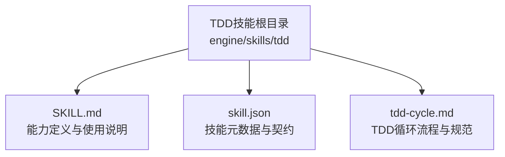
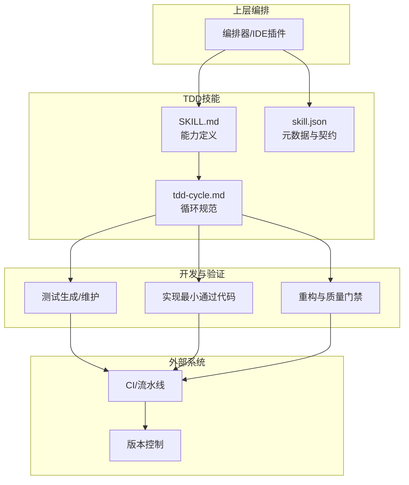
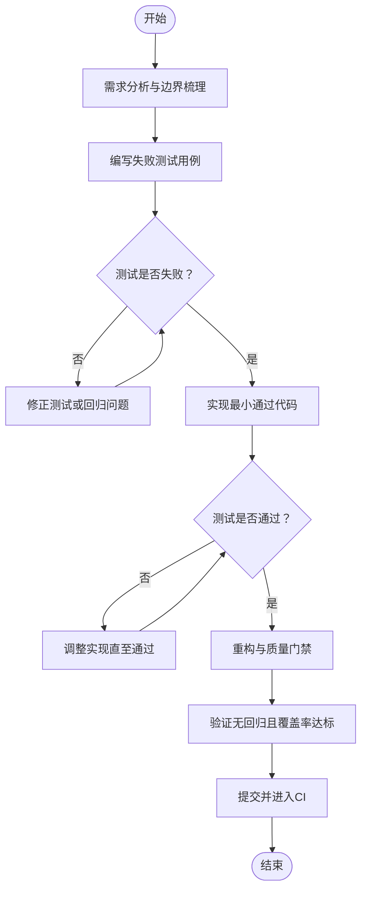
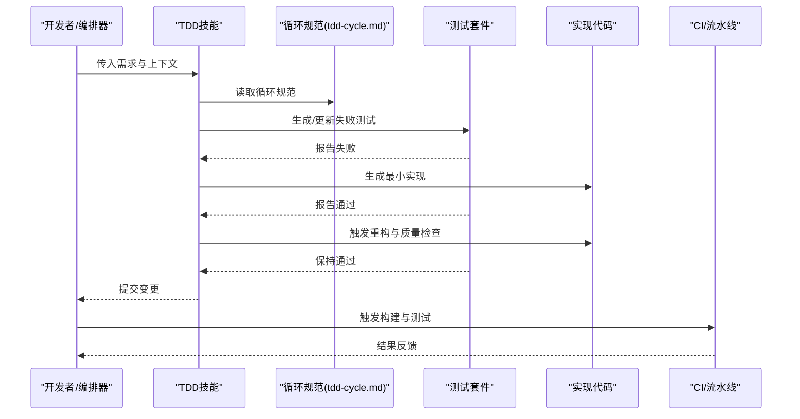
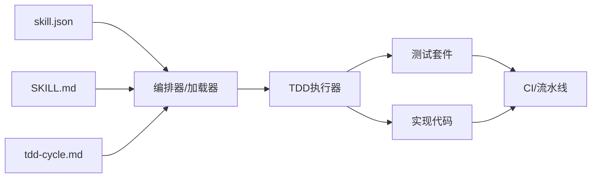

# TDD技能

<cite>
**本文引用的文件**   
- [engine/skills/tdd/SKILL.md](file://engine/skills/tdd/SKILL.md)
- [engine/skills/tdd/skill.json](file://engine/skills/tdd/skill.json)
- [engine/skills/tdd/tdd-cycle.md](file://engine/skills/tdd/tdd-cycle.md)
</cite>

## 目录
1. [简介](#简介)
2. [项目结构](#项目结构)
3. [核心组件](#核心组件)
4. [架构总览](#架构总览)
5. [详细组件分析](#详细组件分析)
6. [依赖关系分析](#依赖关系分析)
7. [性能与效率考量](#性能与效率考量)
8. [故障排查指南](#故障排查指南)
9. [结论](#结论)
10. [附录](#附录)

## 简介
本文件面向希望系统化掌握并实践测试驱动开发（TDD）的工程师，围绕仓库中“TDD技能”的能力定义、工作流规范与实践指引进行说明。该技能覆盖完整的TDD循环：需求分析、编写失败测试、实现最小通过代码、重构提升质量，并提供跨语言与多项目的落地建议，帮助团队在持续集成环境下稳定产出高质量代码。

## 项目结构
TDD技能位于引擎的skills目录下，采用“能力描述 + 配置 + 流程文档”的组织方式：
- SKILL.md：能力的目标、范围、输入输出、约束与使用方式
- skill.json：技能的元数据与可执行/调用契约
- tdd-cycle.md：TDD循环的详细步骤、规则与最佳实践

**图示来源**
- [engine/skills/tdd/SKILL.md](file://engine/skills/tdd/SKILL.md)
- [engine/skills/tdd/skill.json](file://engine/skills/tdd/skill.json)
- [engine/skills/tdd/tdd-cycle.md](file://engine/skills/tdd/tdd-cycle.md)

**章节来源**
- [engine/skills/tdd/SKILL.md](file://engine/skills/tdd/SKILL.md)
- [engine/skills/tdd/skill.json](file://engine/skills/tdd/skill.json)
- [engine/skills/tdd/tdd-cycle.md](file://engine/skills/tdd/tdd-cycle.md)

## 核心组件
- 能力定义（SKILL.md）
  - 明确TDD技能的目标、适用场景、输入（需求/接口契约）、输出（测试用例、实现、重构建议）以及运行约束（如测试框架、覆盖率要求）。
- 技能契约（skill.json）
  - 提供技能的元数据与调用约定，便于上层编排器或工具链识别、加载与执行。
- 循环规范（tdd-cycle.md）
  - 规定TDD红-绿-重构三阶段的具体步骤、验收标准、自动化触发点与回滚策略。

这些组件共同构成一个可被自动化工具链调用的“TDD能力单元”，可在不同语言与项目中复用。

**章节来源**
- [engine/skills/tdd/SKILL.md](file://engine/skills/tdd/SKILL.md)
- [engine/skills/tdd/skill.json](file://engine/skills/tdd/skill.json)
- [engine/skills/tdd/tdd-cycle.md](file://engine/skills/tdd/tdd-cycle.md)

## 架构总览
下图展示了TDD技能在整体工程中的位置与交互关系：上层编排器根据需求生成任务，调用TDD技能；TDD技能依据循环规范驱动测试与实现；结果反馈至CI与版本控制。

**图示来源**
- [engine/skills/tdd/SKILL.md](file://engine/skills/tdd/SKILL.md)
- [engine/skills/tdd/skill.json](file://engine/skills/tdd/skill.json)
- [engine/skills/tdd/tdd-cycle.md](file://engine/skills/tdd/tdd-cycle.md)

## 详细组件分析

### 能力定义（SKILL.md）
- 作用
  - 描述TDD技能的目标、适用范围、输入输出、约束条件与使用方式。
- 关键要点
  - 输入：需求描述、接口契约、现有代码上下文。
  - 输出：失败的测试用例、最小实现、重构清单与变更说明。
  - 约束：遵循单一职责、可测试性优先、覆盖率阈值等。
- 使用方式
  - 由编排器读取能力定义后，按规范驱动后续流程。

**章节来源**
- [engine/skills/tdd/SKILL.md](file://engine/skills/tdd/SKILL.md)

### 技能契约（skill.json）
- 作用
  - 提供技能的元数据与调用契约，使上层系统能够发现、加载与执行TDD技能。
- 关键要点
  - 标识信息：名称、版本、描述。
  - 输入/输出模式：参数结构、返回结果格式。
  - 执行环境：所需工具链、依赖与权限。
- 集成方式
  - 上层编排器解析该文件后，将TDD技能纳入任务图或工作流。

**章节来源**
- [engine/skills/tdd/skill.json](file://engine/skills/tdd/skill.json)

### TDD循环规范（tdd-cycle.md）
- 作用
  - 定义TDD红-绿-重构三阶段的详细步骤、验收标准与自动化触发点。
- 循环步骤
  - 红：基于需求编写失败的测试用例，确保测试能捕获预期行为。
  - 绿：编写最小实现使测试通过，不引入额外逻辑。
  - 重构：在不改变外部行为的前提下优化结构与可读性，保持测试全绿。
- 自动化与门禁
  - 测试失败即阻断提交；重构需保证覆盖率与静态检查通过。
- 回滚策略
  - 任一阶段失败应快速回滚到上一个稳定状态，避免污染主干。

**图示来源**
- [engine/skills/tdd/tdd-cycle.md](file://engine/skills/tdd/tdd-cycle.md)

**章节来源**
- [engine/skills/tdd/tdd-cycle.md](file://engine/skills/tdd/tdd-cycle.md)

### 端到端序列：从需求到提交
以下序列图展示编排器如何驱动TDD技能完成一次完整迭代。

**图示来源**
- [engine/skills/tdd/SKILL.md](file://engine/skills/tdd/SKILL.md)
- [engine/skills/tdd/skill.json](file://engine/skills/tdd/skill.json)
- [engine/skills/tdd/tdd-cycle.md](file://engine/skills/tdd/tdd-cycle.md)

## 依赖关系分析
- 内部依赖
  - SKILL.md 与 tdd-cycle.md 为运行时决策与步骤执行的依据。
  - skill.json 为上层编排器的入口契约，决定如何加载与调用TDD技能。
- 外部依赖
  - 测试框架与覆盖率工具：用于断言与质量门禁。
  - CI/流水线：用于自动化验证与发布门禁。
  - 版本控制系统：用于变更追踪与回滚。

**图示来源**
- [engine/skills/tdd/SKILL.md](file://engine/skills/tdd/SKILL.md)
- [engine/skills/tdd/skill.json](file://engine/skills/tdd/skill.json)
- [engine/skills/tdd/tdd-cycle.md](file://engine/skills/tdd/tdd-cycle.md)

**章节来源**
- [engine/skills/tdd/SKILL.md](file://engine/skills/tdd/SKILL.md)
- [engine/skills/tdd/skill.json](file://engine/skills/tdd/skill.json)
- [engine/skills/tdd/tdd-cycle.md](file://engine/skills/tdd/tdd-cycle.md)

## 性能与效率考量
- 小步快跑：每次只写一个失败的测试，尽快让实现通过，降低调试成本。
- 测试隔离：单测聚焦单一职责，减少耦合，提高并行执行效率。
- 覆盖率门槛：设定合理的覆盖率阈值，避免过度追求数字而牺牲可读性。
- 增量重构：在测试保护下进行局部重构，避免大规模改动带来的回归风险。
- 自动化优先：将测试、格式化、静态检查纳入提交流水线，减少人工负担。

[本节为通用指导，不涉及具体文件分析]

## 故障排查指南
- 测试未失败
  - 检查测试断言是否正确表达需求；确认测试环境与依赖可用。
- 实现无法通过
  - 缩小范围，先实现最简路径；逐步增加分支与异常处理。
- 重构导致回归
  - 回滚至上一次通过的提交；拆分重构粒度，配合测试定位问题。
- CI失败
  - 查看日志定位失败用例；复现本地环境；必要时添加更多断言以增强稳定性。

[本节为通用指导，不涉及具体文件分析]

## 结论
TDD技能通过标准化的能力定义、明确的循环规范与可被编排器调用的契约，将“需求→测试→实现→重构”的流程固化为可重复、可自动化的工程实践。结合CI与版本控制，能够在多语言与多项目中持续提升代码质量与交付效率。

[本节为总结性内容，不涉及具体文件分析]

## 附录
- 术语
  - 红：测试失败阶段
  - 绿：测试通过阶段
  - 重构：在不改变外部行为前提下改进内部结构
- 参考
  - 能力定义：[engine/skills/tdd/SKILL.md](file://engine/skills/tdd/SKILL.md)
  - 技能契约：[engine/skills/tdd/skill.json](file://engine/skills/tdd/skill.json)
  - 循环规范：[engine/skills/tdd/tdd-cycle.md](file://engine/skills/tdd/tdd-cycle.md)