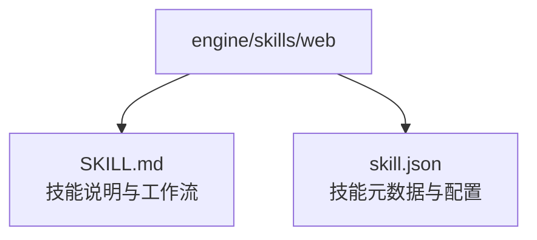
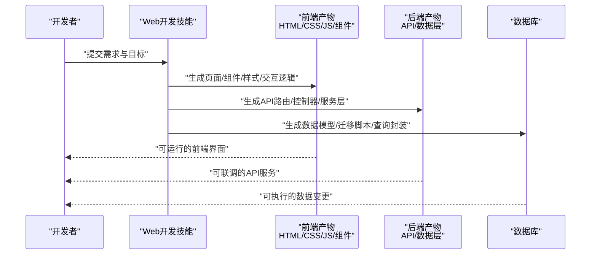
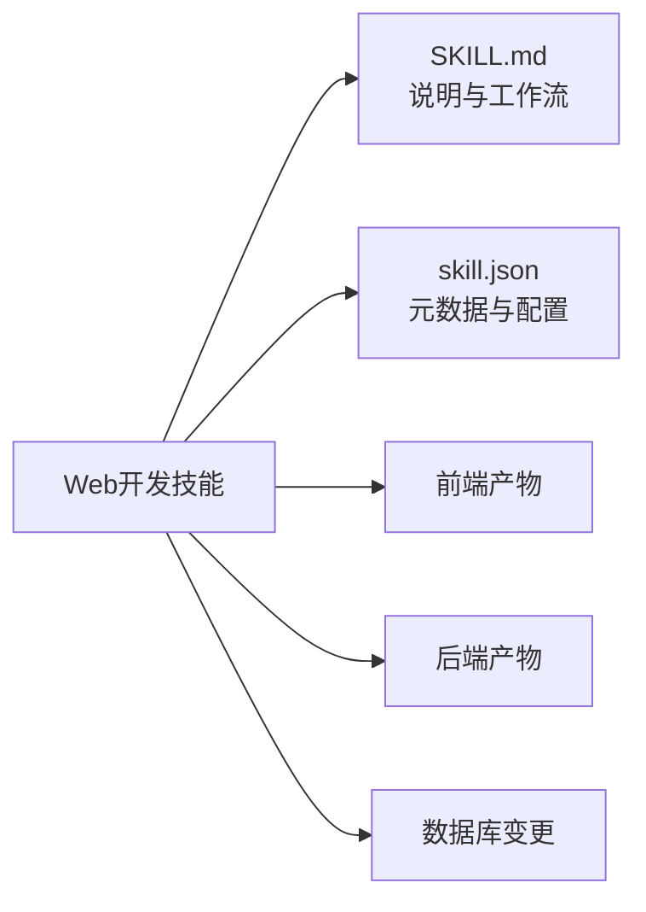

# Web开发技能

<cite>
**本文引用的文件**   
- [engine/skills/web/SKILL.md](file://engine/skills/web/SKILL.md)
- [engine/skills/web/skill.json](file://engine/skills/web/skill.json)
</cite>

## 目录
1. [简介](#简介)
2. [项目结构](#项目结构)
3. [核心组件](#核心组件)
4. [架构总览](#架构总览)
5. [详细组件分析](#详细组件分析)
6. [依赖关系分析](#依赖关系分析)
7. [性能与可用性建议](#性能与可用性建议)
8. [故障排查指南](#故障排查指南)
9. [结论](#结论)
10. [附录](#附录)

## 简介
本文件面向使用“Web开发技能”的前端与后端开发者，系统性说明该技能如何辅助快速搭建Web项目、生成常用组件与页面模板、处理用户交互与数据流，并覆盖HTML/CSS/JavaScript代码生成、响应式设计、API接口开发与数据库操作等关键能力。文档同时提供实际示例与最佳实践，帮助团队提升Web应用开发效率与一致性。

## 项目结构
围绕“Web开发技能”，仓库中相关定义位于 engine/skills/web 目录，包含技能描述与元数据两个核心文件：
- SKILL.md：技能的用途、能力边界、输入输出约定、工作流与注意事项的说明性文档。
- skill.json：技能的运行时元数据（如名称、版本、工具/命令清单、参数约束等），供引擎加载与调度。

图表来源
- [engine/skills/web/SKILL.md](file://engine/skills/web/SKILL.md)
- [engine/skills/web/skill.json](file://engine/skills/web/skill.json)

章节来源
- [engine/skills/web/SKILL.md](file://engine/skills/web/SKILL.md)
- [engine/skills/web/skill.json](file://engine/skills/web/skill.json)

## 核心组件
- 技能说明（SKILL.md）
  - 作用：定义Web开发技能的目标、适用场景、能力范围、输入输出规范、典型工作流与约束条件。
  - 关注点：前端（HTML/CSS/JS）、响应式布局、组件与页面模板、交互与状态管理、API设计与联调、数据库访问模式与迁移策略。
- 技能元数据（skill.json）
  - 作用：为引擎提供可执行的技能契约，包括标识、版本、可用工具/命令、参数校验规则、错误码与返回格式约定等。
  - 关注点：可组合性、可观测性、幂等性与重试策略、安全与权限控制。

章节来源
- [engine/skills/web/SKILL.md](file://engine/skills/web/SKILL.md)
- [engine/skills/web/skill.json](file://engine/skills/web/skill.json)

## 架构总览
从“技能驱动工程化”的角度，Web开发技能在整体流程中的角色如下：
- 需求解析：将业务需求转化为前端页面/组件与后端API/数据模型。
- 代码生成：基于技能约定，自动生成HTML/CSS/JS、路由、组件、页面模板与API骨架。
- 数据流设计：统一前后端数据契约，明确请求/响应结构与错误语义。
- 质量保障：通过技能内置的检查项（如响应式断点、可访问性、API规范）提升交付质量。

[此图为概念性流程图，不直接映射具体源码文件]

## 详细组件分析

### 技能说明（SKILL.md）
- 定位与范围
  - 面向Web全栈开发，覆盖前端展示层、交互层、后端接口层与数据持久层的协同。
- 能力要点
  - HTML/CSS/JavaScript代码生成：结构化页面、样式组织、模块化脚本。
  - 响应式设计：移动端优先、断点策略、弹性布局与适配原则。
  - API接口开发：RESTful/GraphQL风格、鉴权、分页、限流、错误码与文档。
  - 数据库操作：ORM/原生SQL选择、事务、索引优化、迁移与回滚。
- 输入输出约定
  - 输入：需求摘要、技术栈偏好、约束条件（性能、安全、兼容性）。
  - 输出：可编译的前端资源、可启动的后端服务、数据库变更脚本、联调说明。
- 工作流建议
  - 需求澄清 → 方案确认 → 代码生成 → 自测与联调 → 发布与监控。
- 注意事项
  - 保持前后端契约一致；遵循安全基线；对敏感信息做最小暴露；对关键路径进行压测。

章节来源
- [engine/skills/web/SKILL.md](file://engine/skills/web/SKILL.md)

### 技能元数据（skill.json）
- 关键字段建议
  - 标识与版本：用于识别与升级。
  - 工具/命令清单：定义可被调用的子能力（如“生成页面”、“生成API”、“生成迁移”）。
  - 参数约束：必填字段、类型、取值范围与默认值。
  - 错误码与返回格式：统一错误语义，便于自动化处理。
- 集成方式
  - 由引擎加载后，按调用方传入的参数动态生成对应产物，并记录执行上下文以便追踪。

章节来源
- [engine/skills/web/skill.json](file://engine/skills/web/skill.json)

### 前端能力：HTML/CSS/JavaScript与响应式
- 代码生成
  - 页面骨架：语义化标签、SEO基础、可访问性属性。
  - 样式体系：原子化或BEM命名、主题变量、暗色模式支持。
  - 脚本模块：事件绑定、异步请求、错误处理与日志埋点。
- 响应式设计
  - 断点策略：小屏优先、渐进增强。
  - 布局方案：Flex/Grid、容器查询、图片自适应。
- 组件与模板
  - 通用组件：表单、列表、弹窗、导航、消息提示。
  - 页面模板：首页、详情页、列表页、设置页。
- 交互与数据流
  - 状态管理：局部状态与全局状态分层。
  - 数据获取：缓存、重试、去抖与节流。
  - 错误与异常：用户可见的错误提示与降级策略。

章节来源
- [engine/skills/web/SKILL.md](file://engine/skills/web/SKILL.md)

### 后端能力：API接口与数据库操作
- API设计
  - 风格与规范：RESTful/GraphQL、版本化、分页与过滤。
  - 鉴权与授权：JWT/OAuth、RBAC、细粒度权限。
  - 错误与日志：统一错误码、结构化日志、审计追踪。
- 数据层
  - ORM/原生SQL：根据场景选择，兼顾可读性与性能。
  - 事务与并发：隔离级别、锁策略、幂等设计。
  - 迁移与回滚：增量变更、灰度发布、回滚预案。
- 性能与安全
  - 缓存：Redis/内存缓存、CDN静态资源。
  - 安全：输入校验、XSS/CSRF防护、敏感数据脱敏。

章节来源
- [engine/skills/web/SKILL.md](file://engine/skills/web/SKILL.md)

### 端到端示例：快速搭建一个“商品详情”页面
- 步骤概览
  - 需求输入：商品ID、字段清单、交互要求（收藏、评价）。
  - 前端生成：页面模板、商品卡片、收藏按钮、评价列表。
  - 后端生成：GET /items/:id、POST /items/:id/favorite、GET /items/:id/reviews。
  - 数据层：商品表、收藏表、评价表及关联查询。
  - 联调与测试：Mock数据、接口契约校验、UI回归。
- 结果产出
  - 可运行的前端页面、可联调的API、可执行的数据库迁移脚本。

章节来源
- [engine/skills/web/SKILL.md](file://engine/skills/web/SKILL.md)

## 依赖关系分析
- 内部依赖
  - 技能说明与元数据相互补充：SKILL.md定义“做什么与怎么做”，skill.json定义“如何被调用”。
- 外部依赖
  - 运行环境：Node.js/包管理器/构建工具（依据团队技术栈）。
  - 第三方库：前端框架、CSS工具、HTTP客户端、ORM/数据库驱动。
- 耦合与内聚
  - 高内聚：每个子能力（页面/组件/API/数据）职责清晰。
  - 低耦合：通过统一的契约与错误码降低前后端耦合。

图表来源
- [engine/skills/web/SKILL.md](file://engine/skills/web/SKILL.md)
- [engine/skills/web/skill.json](file://engine/skills/web/skill.json)

章节来源
- [engine/skills/web/SKILL.md](file://engine/skills/web/SKILL.md)
- [engine/skills/web/skill.json](file://engine/skills/web/skill.json)

## 性能与可用性建议
- 前端
  - 首屏优化：按需加载、懒加载、资源压缩与缓存。
  - 渲染优化：虚拟列表、防抖节流、减少重排重绘。
  - 可访问性：语义化标签、键盘导航、屏幕阅读器友好。
- 后端
  - 接口优化：分页与字段裁剪、连接池、读写分离。
  - 缓存策略：多级缓存、失效与预热。
  - 监控告警：QPS、延迟、错误率、慢查询。
- 数据库
  - 索引设计：复合索引、覆盖索引、避免过度索引。
  - 查询优化：EXPLAIN分析、避免N+1问题。
  - 容量规划：分库分表、冷热数据分离。

[本节为通用指导，无需特定文件引用]

## 故障排查指南
- 常见问题
  - 前后端契约不一致：字段缺失、类型不符、错误码未对齐。
  - 响应式异常：断点冲突、图片失真、滚动穿透。
  - 接口超时与重试风暴：缺少熔断与退避策略。
  - 数据库慢查询：缺索引、复杂JOIN、未分页。
- 排查步骤
  - 复现与定位：最小化用例、抓包与日志。
  - 契约校验：对比接口文档与实际返回。
  - 性能分析：浏览器Performance、APM、数据库慢查询日志。
  - 修复与回归：补丁验证、回归测试与灰度发布。

章节来源
- [engine/skills/web/SKILL.md](file://engine/skills/web/SKILL.md)

## 结论
“Web开发技能”通过标准化的技能说明与元数据，将前端、后端与数据层的协作流程工程化，显著提升Web应用的开发效率与交付质量。建议在团队内推广该技能的使用，结合持续集成与质量门禁，形成稳定的研发流水线。

[本节为总结性内容，无需特定文件引用]

## 附录
- 术语
  - 响应式设计：在不同屏幕尺寸下自动适配的界面设计方法。
  - 幂等：多次执行与单次执行效果一致的操作特性。
  - 灰度发布：逐步放量上线以降低风险。
- 参考
  - 技能说明与工作流详见：[engine/skills/web/SKILL.md](file://engine/skills/web/SKILL.md)
  - 技能元数据与配置详见：[engine/skills/web/skill.json](file://engine/skills/web/skill.json)