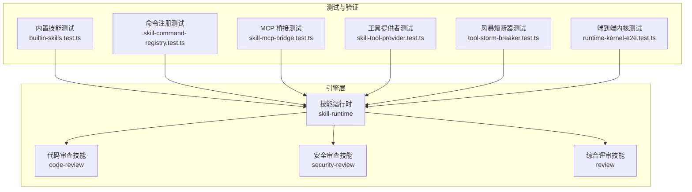
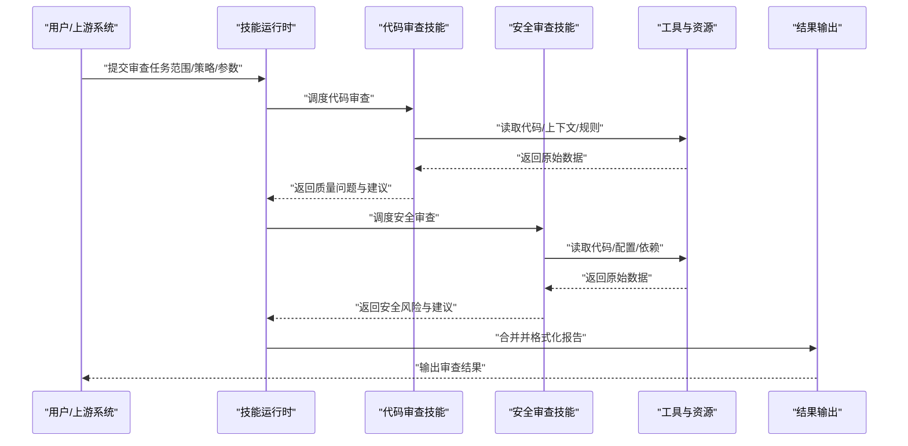
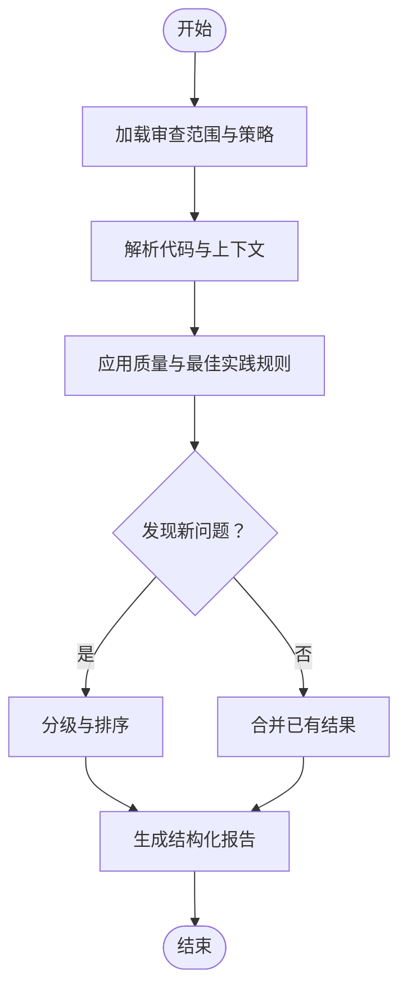
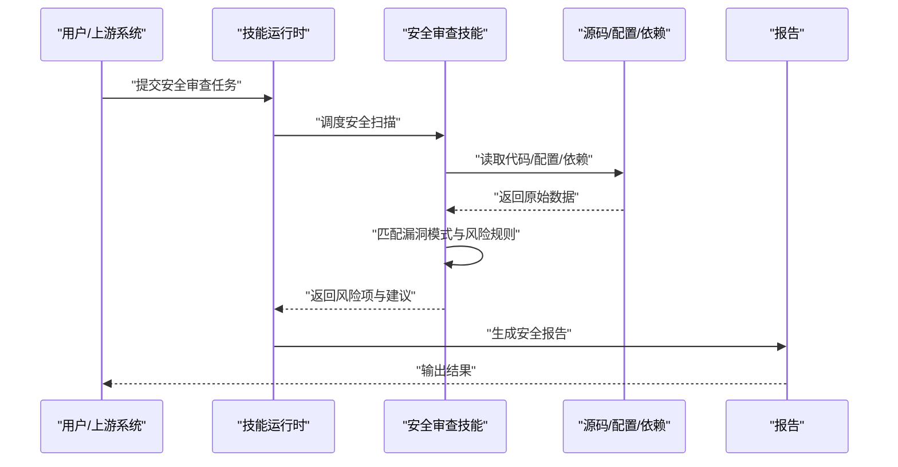
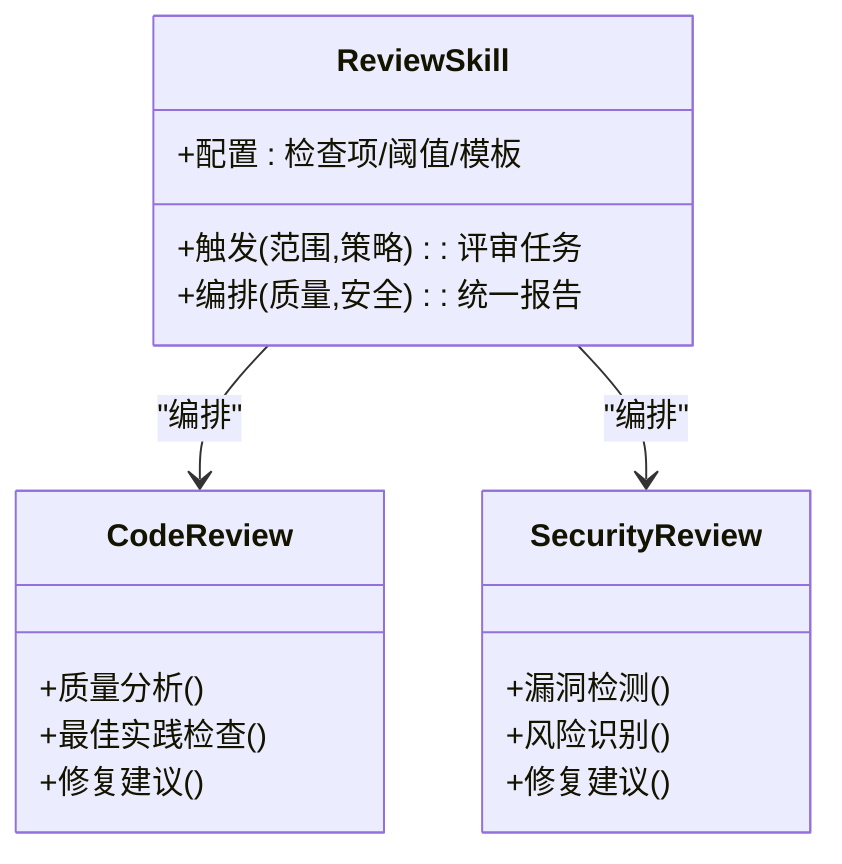
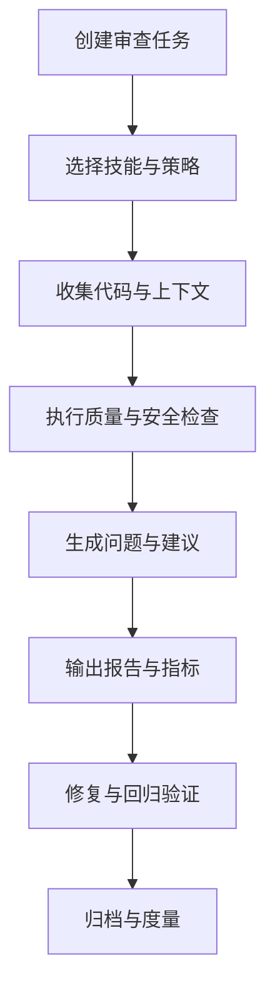
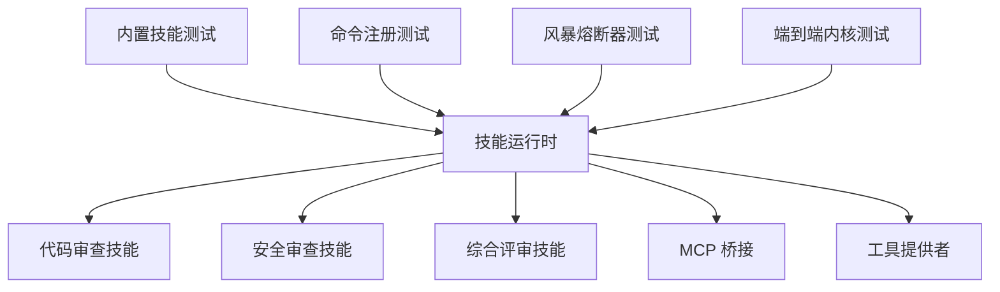

# 代码审查技能

<cite>
**本文引用的文件**   
- [engine/skills/code-review/SKILL.md](file://engine/skills/code-review/SKILL.md)
- [engine/skills/code-review/skill.json](file://engine/skills/code-review/skill.json)
- [engine/skills/security-review/SKILL.md](file://engine/skills/security-review/SKILL.md)
- [engine/skills/security-review/skill.json](file://engine/skills/security-review/skill.json)
- [engine/skills/review/SKILL.md](file://engine/skills/review/SKILL.md)
- [engine/skills/review/skill.json](file://engine/skills/review/skill.json)
- [engine/tests/builtin-skills.test.ts](file://engine/tests/builtin-skills.test.ts)
- [engine/tests/skill-command-registry.test.ts](file://engine/tests/skill-command-registry.test.ts)
- [engine/tests/skill-runtime.test.ts](file://engine/tests/skill-runtime.test.ts)
- [engine/tests/skill-mcp-bridge.test.ts](file://engine/tests/skill-mcp-bridge.test.ts)
- [engine/tests/skill-tool-provider.test.ts](file://engine/tests/skill-tool-provider.test.ts)
- [engine/tests/tool-storm-breaker.test.ts](file://engine/tests/tool-storm-breaker.test.ts)
- [engine/tests/runtime-kernel-e2e.test.ts](file://engine/tests/runtime-kernel-e2e.test.ts)
- [engine/README.md](file://engine/README.md)
</cite>

## 目录
1. [简介](#简介)
2. [项目结构](#项目结构)
3. [核心组件](#核心组件)
4. [架构总览](#架构总览)
5. [详细组件分析](#详细组件分析)
6. [依赖关系分析](#依赖关系分析)
7. [性能考虑](#性能考虑)
8. [故障排查指南](#故障排查指南)
9. [结论](#结论)
10. [附录](#附录)

## 简介
本文件面向使用“代码审查技能”的开发者与团队，系统性说明如何触发代码审查、配置审查规则、查看结果与修复建议，并给出将审查能力集成到日常开发工作流的实践建议。内容覆盖：
- 代码质量分析（风格、复杂度、可维护性）
- 安全漏洞检测（常见注入、越权、敏感信息泄露等）
- 最佳实践检查（命名、模块化、错误处理、测试覆盖等）
- 结果呈现与修复建议（问题定位、优先级、修复指引）
- 常见问题与性能优化建议

## 项目结构
仓库采用多包工程组织，与“代码审查技能”直接相关的定义位于 engine/skills 目录下，包含多个子技能：
- code-review：通用代码审查（质量、可读性、最佳实践）
- security-review：安全专项审查（漏洞扫描、风险识别）
- review：综合评审流程编排（结合多种检查项）

此外，engine/tests 下提供多项与技能注册、运行时、工具桥接等相关的测试用例，可用于理解技能的加载、执行与集成方式。

图表来源
- [engine/skills/code-review/SKILL.md](file://engine/skills/code-review/SKILL.md)
- [engine/skills/security-review/SKILL.md](file://engine/skills/security-review/SKILL.md)
- [engine/skills/review/SKILL.md](file://engine/skills/review/SKILL.md)
- [engine/tests/builtin-skills.test.ts](file://engine/tests/builtin-skills.test.ts)
- [engine/tests/skill-command-registry.test.ts](file://engine/tests/skill-command-registry.test.ts)
- [engine/tests/skill-mcp-bridge.test.ts](file://engine/tests/skill-mcp-bridge.test.ts)
- [engine/tests/skill-tool-provider.test.ts](file://engine/tests/skill-tool-provider.test.ts)
- [engine/tests/tool-storm-breaker.test.ts](file://engine/tests/tool-storm-breaker.test.ts)
- [engine/tests/runtime-kernel-e2e.test.ts](file://engine/tests/runtime-kernel-e2e.test.ts)

章节来源
- [engine/README.md](file://engine/README.md)

## 核心组件
- 代码审查技能（code-review）
  - 职责：对代码进行质量评估、可读性与可维护性检查、最佳实践校验，输出结构化问题与建议。
  - 典型输入：待审查的代码片段或文件集合；可选上下文（语言、框架、目标规范）。
  - 典型输出：问题清单（含严重级别、位置、描述）、修复建议、改进方向。
- 安全审查技能（security-review）
  - 职责：聚焦安全风险识别，包括注入、权限控制、敏感数据暴露、不安全的第三方依赖等。
  - 典型输入：源代码、配置文件、依赖清单；可选攻击面范围。
  - 典型输出：风险项列表（含风险等级、影响面、修复方案）。
- 综合评审技能（review）
  - 职责：编排多种检查项，串联质量与安全维度，形成统一评审报告。
  - 典型输入：任务范围、审查策略、阈值与过滤条件。
  - 典型输出：汇总报告、行动项、回归验证建议。

章节来源
- [engine/skills/code-review/SKILL.md](file://engine/skills/code-review/SKILL.md)
- [engine/skills/security-review/SKILL.md](file://engine/skills/security-review/SKILL.md)
- [engine/skills/review/SKILL.md](file://engine/skills/review/SKILL.md)

## 架构总览
下图展示了“代码审查技能”在引擎中的运行路径：从用户或上游系统发起请求，经技能运行时调度具体技能，调用相关工具与资源，最终返回结构化审查结果。

图表来源
- [engine/tests/skill-runtime.test.ts](file://engine/tests/skill-runtime.test.ts)
- [engine/tests/skill-mcp-bridge.test.ts](file://engine/tests/skill-mcp-bridge.test.ts)
- [engine/tests/skill-tool-provider.test.ts](file://engine/tests/skill-tool-provider.test.ts)

## 详细组件分析

### 代码审查技能（code-review）
- 功能要点
  - 代码质量分析：复杂度、重复度、可读性、命名规范、注释覆盖率等。
  - 最佳实践检查：模块划分、错误处理、日志记录、常量与配置管理。
  - 修复建议：针对每个问题给出最小改动建议与参考实现思路。
- 触发方式
  - 通过技能运行时以命令或 API 形式触发，指定审查范围与策略。
- 配置项
  - 规则开关、严重级别阈值、忽略模式、语言/框架偏好。
- 结果展示
  - 按文件/函数/行号定位问题，附带严重级别与修复建议。

图表来源
- [engine/skills/code-review/SKILL.md](file://engine/skills/code-review/SKILL.md)
- [engine/skills/code-review/skill.json](file://engine/skills/code-review/skill.json)

章节来源
- [engine/skills/code-review/SKILL.md](file://engine/skills/code-review/SKILL.md)
- [engine/skills/code-review/skill.json](file://engine/skills/code-review/skill.json)

### 安全审查技能（security-review）
- 功能要点
  - 漏洞检测：注入、跨站脚本、SQL 注入、路径遍历、硬编码密钥等。
  - 风险识别：不安全的默认配置、弱加密算法、未授权访问点。
  - 修复建议：替换为安全 API、增加鉴权、脱敏与审计。
- 触发方式
  - 通过技能运行时调用，支持批量文件与依赖清单扫描。
- 配置项
  - 风险阈值、忽略清单、扫描深度、外部依赖源。
- 结果展示
  - 风险项清单（含严重级别、影响面、修复步骤），并可导出为标准格式。

图表来源
- [engine/skills/security-review/SKILL.md](file://engine/skills/security-review/SKILL.md)
- [engine/skills/security-review/skill.json](file://engine/skills/security-review/skill.json)

章节来源
- [engine/skills/security-review/SKILL.md](file://engine/skills/security-review/SKILL.md)
- [engine/skills/security-review/skill.json](file://engine/skills/security-review/skill.json)

### 综合评审技能（review）
- 功能要点
  - 编排质量与安全两类检查，统一输出评审报告。
  - 支持自定义检查项组合与优先级策略。
- 触发方式
  - 通过技能运行时提交评审任务，指定范围、策略与输出格式。
- 配置项
  - 检查项开关、阈值、过滤条件、报告模板。
- 结果展示
  - 汇总报告（含问题统计、趋势、行动项），便于追踪与闭环。

图表来源
- [engine/skills/review/SKILL.md](file://engine/skills/review/SKILL.md)
- [engine/skills/review/skill.json](file://engine/skills/review/skill.json)

章节来源
- [engine/skills/review/SKILL.md](file://engine/skills/review/SKILL.md)
- [engine/skills/review/skill.json](file://engine/skills/review/skill.json)

### 概念总览
以下流程图展示一次完整的“代码审查”生命周期，从任务创建到结果落地与修复跟踪。

[此图为概念流程，无需图表来源]

## 依赖关系分析
- 内部依赖
  - 技能运行时负责加载与调度各技能，提供统一的触发接口与结果聚合。
  - MCP 桥接与工具提供者用于与外部工具链（如静态分析、依赖扫描）交互。
- 测试依赖
  - 内置技能测试验证技能注册与可用性。
  - 命令注册测试确保技能命令正确挂载。
  - 工具风暴熔断器测试保障在高并发或异常场景下的稳定性。
  - 端到端内核测试覆盖完整运行路径。

图表来源
- [engine/tests/builtin-skills.test.ts](file://engine/tests/builtin-skills.test.ts)
- [engine/tests/skill-command-registry.test.ts](file://engine/tests/skill-command-registry.test.ts)
- [engine/tests/skill-mcp-bridge.test.ts](file://engine/tests/skill-mcp-bridge.test.ts)
- [engine/tests/skill-tool-provider.test.ts](file://engine/tests/skill-tool-provider.test.ts)
- [engine/tests/tool-storm-breaker.test.ts](file://engine/tests/tool-storm-breaker.test.ts)
- [engine/tests/runtime-kernel-e2e.test.ts](file://engine/tests/runtime-kernel-e2e.test.ts)

章节来源
- [engine/tests/builtin-skills.test.ts](file://engine/tests/builtin-skills.test.ts)
- [engine/tests/skill-command-registry.test.ts](file://engine/tests/skill-command-registry.test.ts)
- [engine/tests/skill-mcp-bridge.test.ts](file://engine/tests/skill-mcp-bridge.test.ts)
- [engine/tests/skill-tool-provider.test.ts](file://engine/tests/skill-tool-provider.test.ts)
- [engine/tests/tool-storm-breaker.test.ts](file://engine/tests/tool-storm-breaker.test.ts)
- [engine/tests/runtime-kernel-e2e.test.ts](file://engine/tests/runtime-kernel-e2e.test.ts)

## 性能考虑
- 增量审查
  - 仅对变更文件与受影响模块执行检查，减少全量扫描开销。
- 并行化
  - 对独立文件与检查项并行执行，提升吞吐。
- 缓存与复用
  - 缓存规则解析结果与中间产物，避免重复计算。
- 限流与熔断
  - 借助风暴熔断器防止异常放大，保障服务稳定。
- 结果压缩
  - 对大规模问题进行分组与摘要，降低输出体积。

[本节为通用指导，无需章节来源]

## 故障排查指南
- 技能未加载或不可用
  - 检查内置技能注册与命令挂载是否成功。
  - 参考内置技能与命令注册测试用例定位问题。
- 工具调用失败
  - 确认 MCP 桥接与工具提供者配置正确。
  - 参考 MCP 桥接与工具提供者测试用例验证链路。
- 高负载或超时
  - 启用风暴熔断器与限流策略，观察熔断行为。
  - 参考风暴熔断器测试用例调整阈值。
- 端到端流程异常
  - 使用端到端内核测试复现并定位断点。
  - 参考端到端测试用例核对关键路径。

章节来源
- [engine/tests/builtin-skills.test.ts](file://engine/tests/builtin-skills.test.ts)
- [engine/tests/skill-command-registry.test.ts](file://engine/tests/skill-command-registry.test.ts)
- [engine/tests/skill-mcp-bridge.test.ts](file://engine/tests/skill-mcp-bridge.test.ts)
- [engine/tests/skill-tool-provider.test.ts](file://engine/tests/skill-tool-provider.test.ts)
- [engine/tests/tool-storm-breaker.test.ts](file://engine/tests/tool-storm-breaker.test.ts)
- [engine/tests/runtime-kernel-e2e.test.ts](file://engine/tests/runtime-kernel-e2e.test.ts)

## 结论
“代码审查技能”通过模块化设计与清晰的运行时编排，提供了从质量到安全的全面审查能力。配合合理的配置与集成策略，可在日常开发与 CI/CD 中持续产出高质量、可追溯的审查结果，有效降低缺陷流入生产环境的概率。

[本节为总结，无需章节来源]

## 附录
- 使用示例（概览）
  - 对前端组件进行质量与最佳实践检查，关注命名、模块化与错误处理。
  - 对后端接口进行安全审查，重点检查鉴权、输入校验与敏感信息处理。
  - 对数据库访问层进行安全与性能双重审查，关注 SQL 注入与慢查询。
- 集成到工作流
  - 在本地开发阶段通过命令触发轻量审查，快速反馈。
  - 在 CI 流水线中执行全量审查，阻断高风险问题合并。
  - 将审查结果与缺陷管理系统对接，形成闭环跟踪。

[本节为概念性内容，无需章节来源]