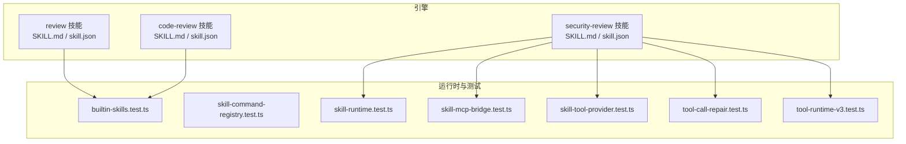
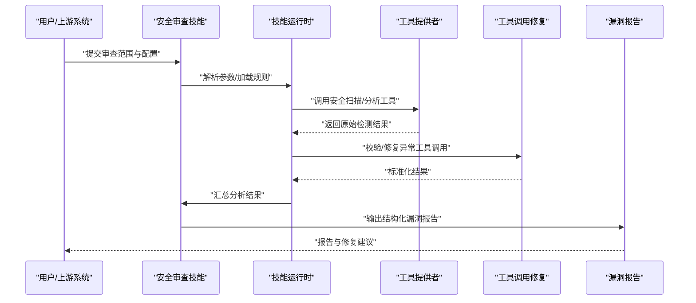
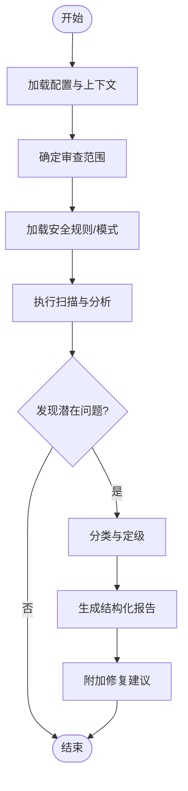
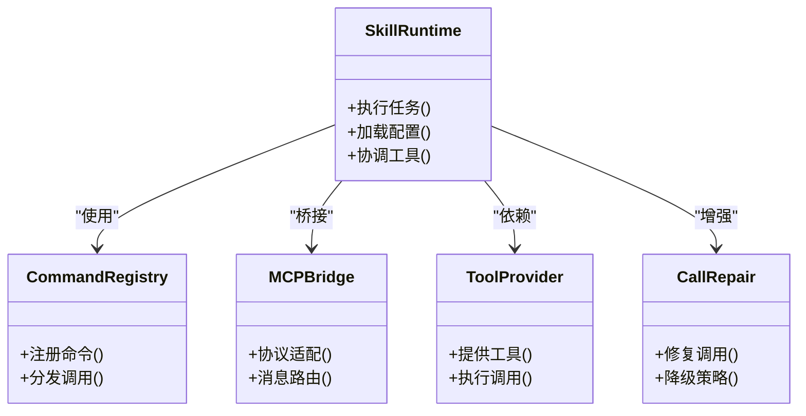
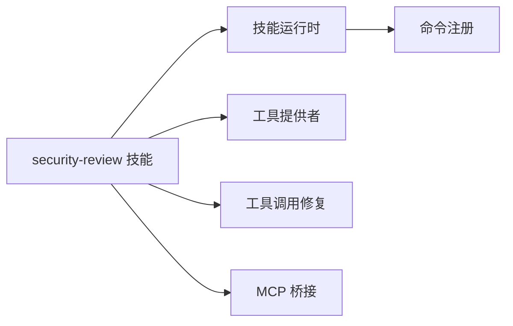

# 安全审查技能

<cite>
**本文引用的文件**   
- [engine/skills/security-review/SKILL.md](file://engine/skills/security-review/SKILL.md)
- [engine/skills/security-review/skill.json](file://engine/skills/security-review/skill.json)
- [engine/skills/review/SKILL.md](file://engine/skills/review/SKILL.md)
- [engine/skills/review/skill.json](file://engine/skills/review/skill.json)
- [engine/skills/code-review/SKILL.md](file://engine/skills/code-review/SKILL.md)
- [engine/skills/code-review/skill.json](file://engine/skills/code-review/skill.json)
- [engine/tests/builtin-skills.test.ts](file://engine/tests/builtin-skills.test.ts)
- [engine/tests/skill-command-registry.test.ts](file://engine/tests/skill-command-registry.test.ts)
- [engine/tests/skill-runtime.test.ts](file://engine/tests/skill-runtime.test.ts)
- [engine/tests/skill-mcp-bridge.test.ts](file://engine/tests/skill-mcp-bridge.test.ts)
- [engine/tests/skill-tool-provider.test.ts](file://engine/tests/skill-tool-provider.test.ts)
- [engine/tests/tool-call-repair.test.ts](file://engine/tests/tool-call-repair.test.ts)
- [engine/tests/tool-runtime-v3.test.ts](file://engine/tests/tool-runtime-v3.test.ts)
</cite>

## 目录
1. [简介](#简介)
2. [项目结构](#项目结构)
3. [核心组件](#核心组件)
4. [架构总览](#架构总览)
5. [详细组件分析](#详细组件分析)
6. [依赖分析](#依赖分析)
7. [性能考虑](#性能考虑)
8. [故障排查指南](#故障排查指南)
9. [结论](#结论)
10. [附录](#附录)

## 简介
本指南面向使用“安全审查技能”的开发者与团队，帮助理解该技能如何检测与预防代码中的常见安全问题（如 SQL 注入、XSS、认证绕过、敏感信息泄露等），并说明配置选项、漏洞报告格式与修复建议。文档同时提供安全编码最佳实践与常见漏洞修复示例路径，便于在工程实践中落地。

## 项目结构
与安全审查相关的技能定义位于 engine/skills 目录下，其中 security-review 为安全审查技能的核心定义；review 与 code-review 为通用评审相关技能，可作为参考与扩展点。测试用例覆盖技能的注册、运行、工具调用与 MCP 桥接等关键路径。

图表来源
- [engine/skills/security-review/SKILL.md](file://engine/skills/security-review/SKILL.md)
- [engine/skills/security-review/skill.json](file://engine/skills/security-review/skill.json)
- [engine/skills/review/SKILL.md](file://engine/skills/review/SKILL.md)
- [engine/skills/review/skill.json](file://engine/skills/review/skill.json)
- [engine/skills/code-review/SKILL.md](file://engine/skills/code-review/SKILL.md)
- [engine/skills/code-review/skill.json](file://engine/skills/code-review/skill.json)
- [engine/tests/builtin-skills.test.ts](file://engine/tests/builtin-skills.test.ts)
- [engine/tests/skill-command-registry.test.ts](file://engine/tests/skill-command-registry.test.ts)
- [engine/tests/skill-runtime.test.ts](file://engine/tests/skill-runtime.test.ts)
- [engine/tests/skill-mcp-bridge.test.ts](file://engine/tests/skill-mcp-bridge.test.ts)
- [engine/tests/skill-tool-provider.test.ts](file://engine/tests/skill-tool-provider.test.ts)
- [engine/tests/tool-call-repair.test.ts](file://engine/tests/tool-call-repair.test.ts)
- [engine/tests/tool-runtime-v3.test.ts](file://engine/tests/tool-runtime-v3.test.ts)

章节来源
- [engine/skills/security-review/SKILL.md](file://engine/skills/security-review/SKILL.md)
- [engine/skills/security-review/skill.json](file://engine/skills/security-review/skill.json)
- [engine/skills/review/SKILL.md](file://engine/skills/review/SKILL.md)
- [engine/skills/review/skill.json](file://engine/skills/review/skill.json)
- [engine/skills/code-review/SKILL.md](file://engine/skills/code-review/SKILL.md)
- [engine/skills/code-review/skill.json](file://engine/skills/code-review/skill.json)
- [engine/tests/builtin-skills.test.ts](file://engine/tests/builtin-skills.test.ts)
- [engine/tests/skill-command-registry.test.ts](file://engine/tests/skill-command-registry.test.ts)
- [engine/tests/skill-runtime.test.ts](file://engine/tests/skill-runtime.test.ts)
- [engine/tests/skill-mcp-bridge.test.ts](file://engine/tests/skill-mcp-bridge.test.ts)
- [engine/tests/skill-tool-provider.test.ts](file://engine/tests/skill-tool-provider.test.ts)
- [engine/tests/tool-call-repair.test.ts](file://engine/tests/tool-call-repair.test.ts)
- [engine/tests/tool-runtime-v3.test.ts](file://engine/tests/tool-runtime-v3.test.ts)

## 核心组件
- 安全审查技能定义：包含能力描述、输入输出约定、工具调用策略与报告规范。
- 评审类技能（review、code-review）：提供通用评审流程与模板，可复用至安全审查场景。
- 运行时与集成：通过命令注册、MCP 桥接、工具提供者与工具调用修复机制，保障安全审查任务稳定执行。

章节来源
- [engine/skills/security-review/SKILL.md](file://engine/skills/security-review/SKILL.md)
- [engine/skills/security-review/skill.json](file://engine/skills/security-review/skill.json)
- [engine/skills/review/SKILL.md](file://engine/skills/review/SKILL.md)
- [engine/skills/review/skill.json](file://engine/skills/review/skill.json)
- [engine/skills/code-review/SKILL.md](file://engine/skills/code-review/SKILL.md)
- [engine/skills/code-review/skill.json](file://engine/skills/code-review/skill.json)
- [engine/tests/skill-command-registry.test.ts](file://engine/tests/skill-command-registry.test.ts)
- [engine/tests/skill-mcp-bridge.test.ts](file://engine/tests/skill-mcp-bridge.test.ts)
- [engine/tests/skill-tool-provider.test.ts](file://engine/tests/skill-tool-provider.test.ts)
- [engine/tests/tool-call-repair.test.ts](file://engine/tests/tool-call-repair.test.ts)

## 架构总览
下图展示了安全审查技能从触发到产出的端到端流程：用户或上游系统发起安全审查请求，由技能运行时解析参数、加载规则与上下文，调用安全扫描与分析工具，生成结构化漏洞报告，并在必要时进行工具调用修复与二次验证。

图表来源
- [engine/skills/security-review/SKILL.md](file://engine/skills/security-review/SKILL.md)
- [engine/skills/security-review/skill.json](file://engine/skills/security-review/skill.json)
- [engine/tests/skill-runtime.test.ts](file://engine/tests/skill-runtime.test.ts)
- [engine/tests/skill-mcp-bridge.test.ts](file://engine/tests/skill-mcp-bridge.test.ts)
- [engine/tests/skill-tool-provider.test.ts](file://engine/tests/skill-tool-provider.test.ts)
- [engine/tests/tool-call-repair.test.ts](file://engine/tests/tool-call-repair.test.ts)

## 详细组件分析

### 安全审查技能（security-review）
- 目标与范围：聚焦于识别与预防常见安全问题，包括但不限于 SQL 注入、跨站脚本（XSS）、认证绕过、敏感信息泄露等。
- 输入与上下文：支持指定审查范围（文件/目录/变更集）、语言与框架上下文、风险偏好与阈值。
- 处理逻辑：基于规则与模式匹配、静态分析与工具链集成，对可疑代码片段进行定位与风险评估。
- 输出与报告：以结构化格式输出漏洞条目，包含位置、严重级别、影响面、根因分析与修复建议。
- 配置项：涵盖扫描深度、忽略规则、告警阈值、报告模板、工具开关等。

图表来源
- [engine/skills/security-review/SKILL.md](file://engine/skills/security-review/SKILL.md)
- [engine/skills/security-review/skill.json](file://engine/skills/security-review/skill.json)

章节来源
- [engine/skills/security-review/SKILL.md](file://engine/skills/security-review/SKILL.md)
- [engine/skills/security-review/skill.json](file://engine/skills/security-review/skill.json)

### 评审类技能（review、code-review）
- review：提供通用评审流程、检查清单与报告模板，适用于功能、质量与安全等多维度评审。
- code-review：聚焦代码层面的可读性、一致性与潜在缺陷，可与安全审查结合形成更全面的评审闭环。

章节来源
- [engine/skills/review/SKILL.md](file://engine/skills/review/SKILL.md)
- [engine/skills/review/skill.json](file://engine/skills/review/skill.json)
- [engine/skills/code-review/SKILL.md](file://engine/skills/code-review/SKILL.md)
- [engine/skills/code-review/skill.json](file://engine/skills/code-review/skill.json)

### 运行时与集成（命令注册、MCP 桥接、工具提供者、调用修复）
- 命令注册：确保安全审查技能可通过统一入口被调用与编排。
- MCP 桥接：实现与外部模型/工具的协议适配，提升可扩展性。
- 工具提供者：抽象具体扫描与分析工具，支持多实现与动态切换。
- 工具调用修复：对异常或失败的调用进行重试、降级与规范化，提高稳定性。

图表来源
- [engine/tests/skill-command-registry.test.ts](file://engine/tests/skill-command-registry.test.ts)
- [engine/tests/skill-mcp-bridge.test.ts](file://engine/tests/skill-mcp-bridge.test.ts)
- [engine/tests/skill-tool-provider.test.ts](file://engine/tests/skill-tool-provider.test.ts)
- [engine/tests/tool-call-repair.test.ts](file://engine/tests/tool-call-repair.test.ts)
- [engine/tests/tool-runtime-v3.test.ts](file://engine/tests/tool-runtime-v3.test.ts)

章节来源
- [engine/tests/skill-command-registry.test.ts](file://engine/tests/skill-command-registry.test.ts)
- [engine/tests/skill-mcp-bridge.test.ts](file://engine/tests/skill-mcp-bridge.test.ts)
- [engine/tests/skill-tool-provider.test.ts](file://engine/tests/skill-tool-provider.test.ts)
- [engine/tests/tool-call-repair.test.ts](file://engine/tests/tool-call-repair.test.ts)
- [engine/tests/tool-runtime-v3.test.ts](file://engine/tests/tool-runtime-v3.test.ts)

## 依赖分析
- 内聚与耦合：安全审查技能围绕“规则+工具”的内核设计，运行时负责编排与容错，降低直接耦合度。
- 外部依赖：通过工具提供者与 MCP 桥接解耦具体扫描器与外部服务，便于替换与升级。
- 循环依赖：当前结构未见明显循环依赖迹象，职责边界清晰。

图表来源
- [engine/skills/security-review/SKILL.md](file://engine/skills/security-review/SKILL.md)
- [engine/skills/security-review/skill.json](file://engine/skills/security-review/skill.json)
- [engine/tests/skill-command-registry.test.ts](file://engine/tests/skill-command-registry.test.ts)
- [engine/tests/skill-mcp-bridge.test.ts](file://engine/tests/skill-mcp-bridge.test.ts)
- [engine/tests/skill-tool-provider.test.ts](file://engine/tests/skill-tool-provider.test.ts)
- [engine/tests/tool-call-repair.test.ts](file://engine/tests/tool-call-repair.test.ts)

章节来源
- [engine/tests/builtin-skills.test.ts](file://engine/tests/builtin-skills.test.ts)
- [engine/tests/skill-runtime.test.ts](file://engine/tests/skill-runtime.test.ts)

## 性能考虑
- 增量扫描：优先针对变更集与受影响模块进行扫描，减少全量分析开销。
- 规则裁剪：按语言与框架启用必要规则，避免无关规则带来的额外成本。
- 并行与批处理：对独立文件/模块并行分析，合并结果后统一报告。
- 缓存命中：对已知安全的模式与历史修复结果建立缓存，降低重复计算。
- 超时与降级：对耗时较长的工具调用设置超时与降级策略，保证整体可用性。

[本节为通用指导，不直接分析具体文件]

## 故障排查指南
- 技能未注册或不可用：检查命令注册与内置技能加载路径是否正确。
- 工具调用失败：查看工具提供者实现与 MCP 桥接日志，确认协议与参数是否匹配。
- 报告缺失或字段不完整：核对输出结构与报告模板，确保各字段填充完整。
- 误报/漏报：调整规则阈值与忽略列表，补充上下文与示例以提升准确率。
- 调用修复生效与否：验证修复策略与降级逻辑，关注重试次数与错误码映射。

章节来源
- [engine/tests/builtin-skills.test.ts](file://engine/tests/builtin-skills.test.ts)
- [engine/tests/skill-command-registry.test.ts](file://engine/tests/skill-command-registry.test.ts)
- [engine/tests/skill-mcp-bridge.test.ts](file://engine/tests/skill-mcp-bridge.test.ts)
- [engine/tests/skill-tool-provider.test.ts](file://engine/tests/skill-tool-provider.test.ts)
- [engine/tests/tool-call-repair.test.ts](file://engine/tests/tool-call-repair.test.ts)
- [engine/tests/tool-runtime-v3.test.ts](file://engine/tests/tool-runtime-v3.test.ts)

## 结论
安全审查技能通过“规则+工具+运行时”的组合，实现对常见安全问题的系统化检测与报告，并提供修复建议与最佳实践指引。借助灵活的配置与稳定的集成机制，可在持续集成与日常开发中有效降低安全风险，提升代码质量与安全性。

[本节为总结性内容，不直接分析具体文件]

## 附录

### 配置选项（建议）
- 扫描范围：文件/目录/变更集
- 语言与框架：限定目标技术栈
- 规则集：启用/禁用特定规则
- 告警阈值：严重级别与数量阈值
- 报告模板：字段与格式定制
- 工具开关：按需启用外部扫描器
- 忽略列表：排除已知低风险或误报项

章节来源
- [engine/skills/security-review/skill.json](file://engine/skills/security-review/skill.json)

### 漏洞报告格式（建议）
- 基本信息：标题、严重级别、状态
- 定位信息：文件、行号、函数/方法
- 问题描述：现象与影响面
- 根因分析：触发条件与上下文
- 修复建议：步骤与参考链接
- 证据材料：日志、截图、复现步骤

章节来源
- [engine/skills/security-review/SKILL.md](file://engine/skills/security-review/SKILL.md)

### 常见安全问题与修复要点
- SQL 注入
  - 检测要点：拼接查询、未参数化语句、动态表名/列名
  - 修复要点：使用参数化查询、白名单校验、最小权限原则
- XSS 攻击
  - 检测要点：未转义的用户输入渲染、危险 HTML/JS 插入
  - 修复要点：输出编码、CSP 策略、严格的内容类型限制
- 认证绕过
  - 检测要点：弱校验逻辑、越权访问、会话管理不当
  - 修复要点：统一鉴权中间件、最小权限、会话安全配置
- 敏感信息泄露
  - 检测要点：硬编码密钥、日志打印敏感数据、错误堆栈暴露
  - 修复要点：环境变量/密钥管理服务、脱敏与最小日志、错误页隐藏细节

章节来源
- [engine/skills/security-review/SKILL.md](file://engine/skills/security-review/SKILL.md)

### 安全编码最佳实践
- 输入校验与输出编码：对所有外部输入进行严格校验，对输出进行适当编码。
- 最小权限与纵深防御：数据库、文件系统与服务间通信遵循最小权限原则。
- 安全依赖与更新：定期审计第三方依赖，及时修补已知漏洞。
- 安全测试左移：在开发与单元测试阶段引入安全检查与自动化扫描。
- 审计与追踪：记录关键操作与异常事件，便于事后追溯与取证。

章节来源
- [engine/skills/security-review/SKILL.md](file://engine/skills/security-review/SKILL.md)