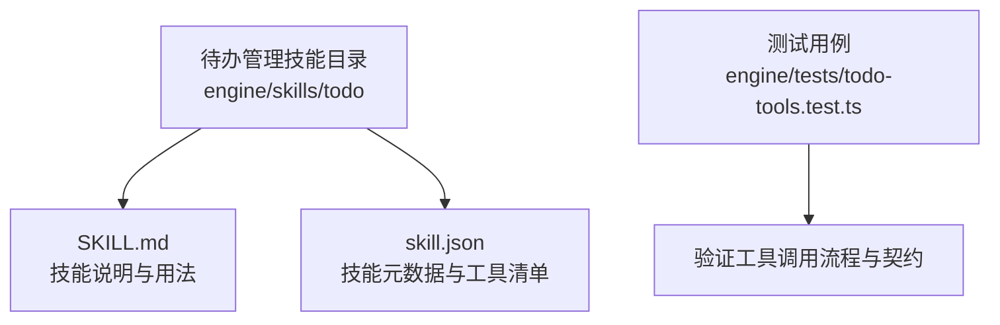
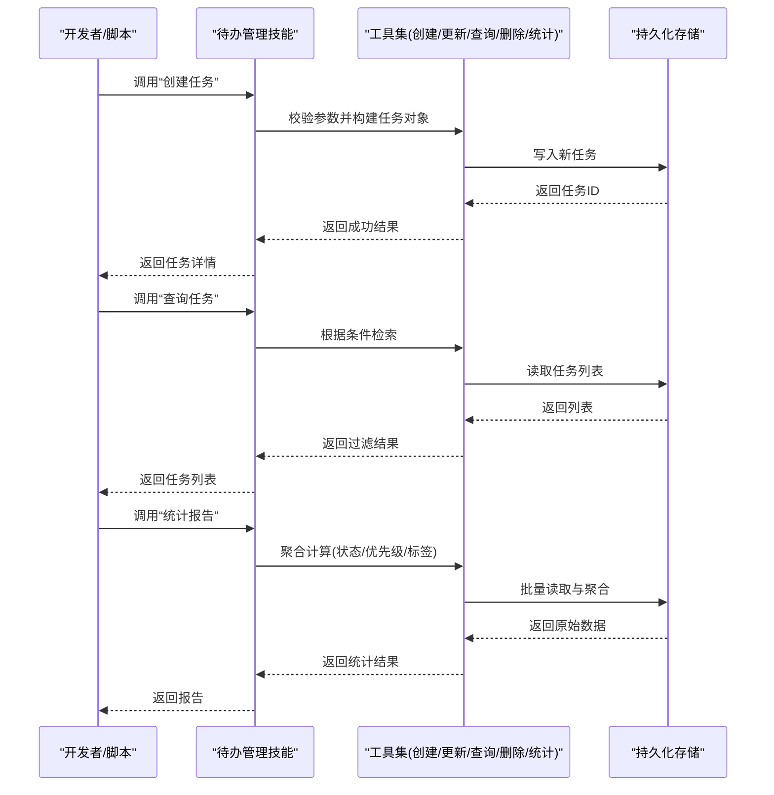
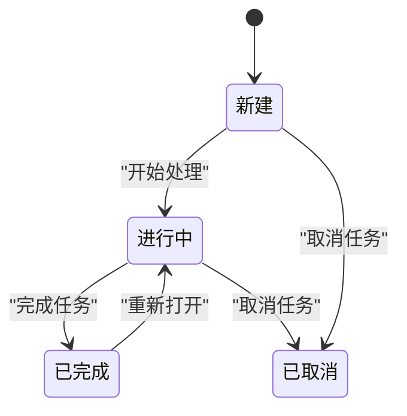
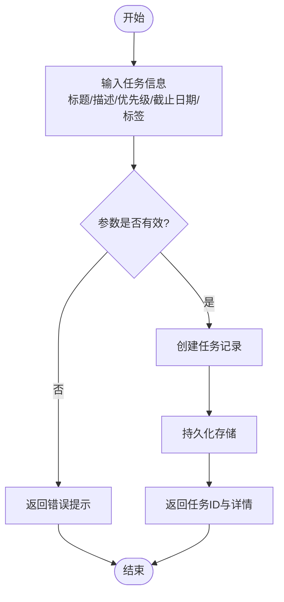
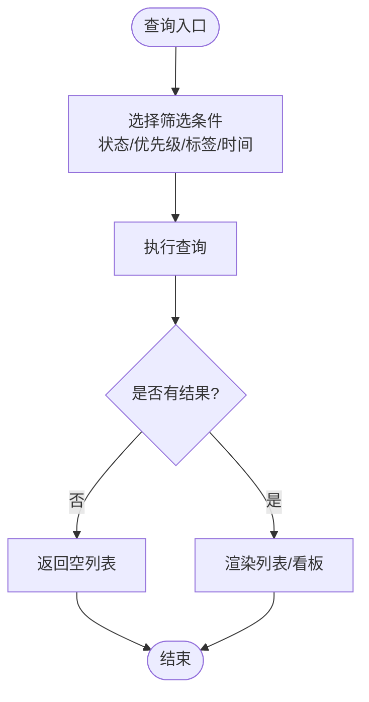
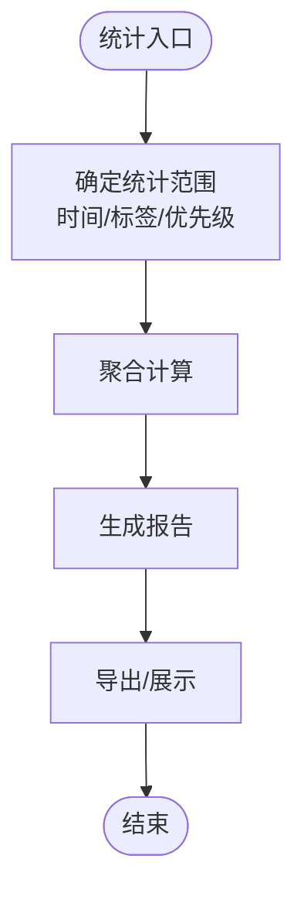
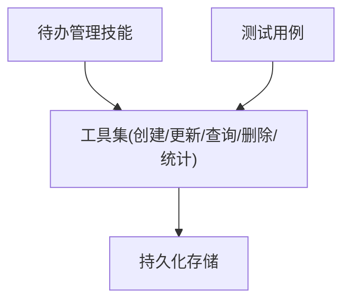

# 待办管理技能

<cite>
**本文引用的文件**   
- [engine/skills/todo/SKILL.md](file://engine/skills/todo/SKILL.md)
- [engine/skills/todo/skill.json](file://engine/skills/todo/skill.json)
- [engine/tests/todo-tools.test.ts](file://engine/tests/todo-tools.test.ts)
</cite>

## 目录
1. [简介](#简介)
2. [项目结构](#项目结构)
3. [核心组件](#核心组件)
4. [架构总览](#架构总览)
5. [详细组件分析](#详细组件分析)
6. [依赖分析](#依赖分析)
7. [性能考虑](#性能考虑)
8. [故障排查指南](#故障排查指南)
9. [结论](#结论)
10. [附录](#附录)

## 简介
本指南面向开发者与团队，系统化介绍“待办管理技能”的使用方法与实践。该技能围绕任务创建、优先级排序、状态跟踪与完成度统计等能力，帮助个人与团队高效组织开发工作、设定截止日期、追踪进展并生成工作报告。通过统一的任务模型与工具集，开发者可在日常工作中快速落地计划、执行与复盘闭环。

## 项目结构
在仓库中，“待办管理技能”位于 engine/skills/todo 目录下，包含技能说明与配置：
- SKILL.md：技能的用途、能力边界、使用方式与示例说明
- skill.json：技能的元数据与工具清单（如创建、更新、查询、删除、统计等）

此外，测试用例位于 engine/tests/todo-tools.test.ts，覆盖常用操作路径与异常场景，便于理解接口契约与行为约定。

图表来源
- [engine/skills/todo/SKILL.md](file://engine/skills/todo/SKILL.md)
- [engine/skills/todo/skill.json](file://engine/skills/todo/skill.json)
- [engine/tests/todo-tools.test.ts](file://engine/tests/todo-tools.test.ts)

章节来源
- [engine/skills/todo/SKILL.md](file://engine/skills/todo/SKILL.md)
- [engine/skills/todo/skill.json](file://engine/skills/todo/skill.json)
- [engine/tests/todo-tools.test.ts](file://engine/tests/todo-tools.test.ts)

## 核心组件
- 任务模型
  - 字段通常包括：标题、描述、优先级、状态、截止日期、标签/分类、关联上下文等
  - 状态流转：新建 → 进行中 → 已完成（可回退或取消）
- 工具集合（由 skill.json 定义）
  - 创建任务：支持设置优先级、截止日期、标签等
  - 更新任务：修改状态、优先级、截止日期、描述等
  - 查询任务：按条件筛选（状态、优先级、标签、时间范围等）
  - 删除任务：逻辑删除或物理删除
  - 统计报告：按状态、优先级、标签等维度汇总完成度与进度
- 使用入口
  - 通过技能注册的工具进行交互；具体命令/参数以 skill.json 为准
  - 结合 SKILL.md 中的最佳实践与示例进行编排

章节来源
- [engine/skills/todo/skill.json](file://engine/skills/todo/skill.json)
- [engine/skills/todo/SKILL.md](file://engine/skills/todo/SKILL.md)

## 架构总览
待办管理技能作为“能力层”的一部分，对外暴露一组工具方法，供上层应用或自动化流程调用。典型交互路径如下：

图表来源
- [engine/skills/todo/skill.json](file://engine/skills/todo/skill.json)
- [engine/tests/todo-tools.test.ts](file://engine/tests/todo-tools.test.ts)

## 详细组件分析

### 任务生命周期与状态机
任务从创建到完成经历明确的状态转换，确保过程可追踪、可审计。

图表来源
- [engine/skills/todo/SKILL.md](file://engine/skills/todo/SKILL.md)
- [engine/skills/todo/skill.json](file://engine/skills/todo/skill.json)

章节来源
- [engine/skills/todo/SKILL.md](file://engine/skills/todo/SKILL.md)
- [engine/skills/todo/skill.json](file://engine/skills/todo/skill.json)

### 任务创建与优先级排序
- 创建任务时建议明确优先级与截止日期，以便后续排程与提醒
- 优先级可用于看板视图与报表排序，帮助聚焦高价值任务
- 标签/分类有助于跨项目归并与检索

图表来源
- [engine/skills/todo/skill.json](file://engine/skills/todo/skill.json)
- [engine/tests/todo-tools.test.ts](file://engine/tests/todo-tools.test.ts)

章节来源
- [engine/skills/todo/skill.json](file://engine/skills/todo/skill.json)
- [engine/tests/todo-tools.test.ts](file://engine/tests/todo-tools.test.ts)

### 状态跟踪与进度可视化
- 通过查询工具按状态、优先级、标签、时间范围筛选任务
- 结合看板视图或报表，直观展示各状态任务数量与分布
- 定期刷新与增量同步，保证视图与数据一致

图表来源
- [engine/skills/todo/skill.json](file://engine/skills/todo/skill.json)
- [engine/tests/todo-tools.test.ts](file://engine/tests/todo-tools.test.ts)

章节来源
- [engine/skills/todo/skill.json](file://engine/skills/todo/skill.json)
- [engine/tests/todo-tools.test.ts](file://engine/tests/todo-tools.test.ts)

### 完成度统计与工作报告
- 统计维度：按状态、优先级、标签、负责人（如有）、时间区间
- 指标示例：总数、已完成数、完成率、逾期任务数、平均处理时长
- 输出形式：文本摘要、表格、图表（若前端支持）

图表来源
- [engine/skills/todo/skill.json](file://engine/skills/todo/skill.json)
- [engine/tests/todo-tools.test.ts](file://engine/tests/todo-tools.test.ts)

章节来源
- [engine/skills/todo/skill.json](file://engine/skills/todo/skill.json)
- [engine/tests/todo-tools.test.ts](file://engine/tests/todo-tools.test.ts)

### 实际案例：个人与团队协作
- 个人开发
  - 每日站前：列出当日任务，标注优先级与截止时间
  - 进行中：将任务状态切换为“进行中”，完成后立即归档
  - 日报：基于统计工具生成当日完成度与遗留任务清单
- 团队协作
  - 迭代规划：按功能模块划分标签，分配优先级与截止日期
  - 进度跟踪：看板视图监控各状态任务量，识别瓶颈
  - 周报：按标签/优先级汇总完成率与延期项，驱动改进

[本节为概念性内容，不直接分析具体文件，故无章节来源]

## 依赖分析
- 内部依赖
  - 工具实现与持久化存储的耦合：通过 skill.json 声明的工具接口访问底层存储
  - 测试用例对工具契约的约束：确保新增/变更不破坏既有行为
- 外部集成点
  - 可与日历/提醒系统对接（通过扩展工具或外部脚本）
  - 可与代码仓库/CI流水线联动（例如自动创建缺陷修复任务）

图表来源
- [engine/skills/todo/skill.json](file://engine/skills/todo/skill.json)
- [engine/tests/todo-tools.test.ts](file://engine/tests/todo-tools.test.ts)

章节来源
- [engine/skills/todo/skill.json](file://engine/skills/todo/skill.json)
- [engine/tests/todo-tools.test.ts](file://engine/tests/todo-tools.test.ts)

## 性能考虑
- 查询优化
  - 合理使用索引字段（状态、优先级、标签、时间戳）
  - 分页与增量查询，避免一次性加载大量数据
- 统计性能
  - 预聚合与缓存热点指标（如当日完成率）
  - 异步生成复杂报告，避免阻塞主流程
- 并发与一致性
  - 更新任务时采用乐观锁或事务，防止竞态条件
  - 批量操作尽量合并提交，减少IO次数

[本节提供通用指导，不直接分析具体文件，故无章节来源]

## 故障排查指南
- 常见问题
  - 参数校验失败：检查必填字段、日期格式、枚举值
  - 查询结果为空：确认筛选条件与数据范围
  - 统计不一致：核对时间窗口与状态定义
- 定位步骤
  - 查看工具调用日志与错误码
  - 使用最小复现用例逐步缩小范围
  - 对照测试用例验证预期行为
- 恢复策略
  - 重试幂等操作（如创建）
  - 回滚未完成的批量更新
  - 重建统计缓存

章节来源
- [engine/tests/todo-tools.test.ts](file://engine/tests/todo-tools.test.ts)

## 结论
待办管理技能以清晰的任务模型与完备的工具集，为个人与团队提供了从计划到执行的完整闭环。通过合理的优先级与截止日期管理、持续的状态跟踪与多维度的完成度统计，开发者能够显著提升效率与可观测性。建议在日常工作中将其纳入标准流程，并结合团队规范持续优化。

[本节为总结性内容，不直接分析具体文件，故无章节来源]

## 附录
- 术语表
  - 任务：可独立交付的最小工作单元
  - 优先级：影响排程与关注度的重要程度
  - 状态：任务所处阶段（新建/进行中/已完成/已取消）
  - 标签：用于分类与检索的标记
- 最佳实践
  - 始终为任务设置明确的截止日期与优先级
  - 及时更新状态，保持看板真实反映进展
  - 定期复盘，调整优先级与资源分配

[本节为补充信息，不直接分析具体文件，故无章节来源]