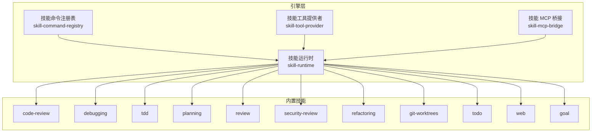
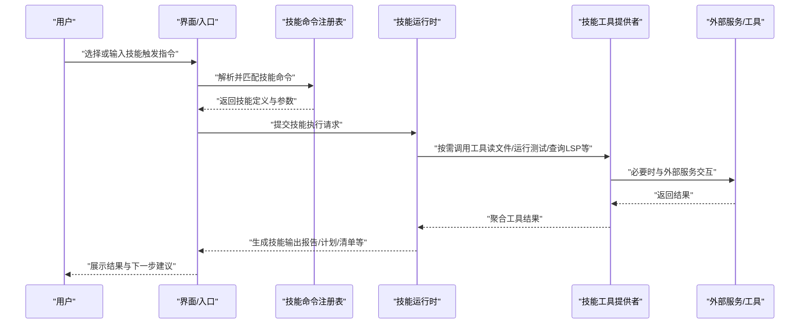
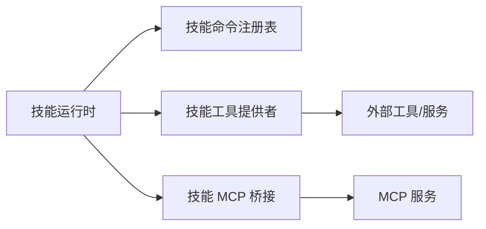

# 技能系统

<cite>
**本文引用的文件**   
- [engine/skills/code-review/SKILL.md](file://engine/skills/code-review/SKILL.md)
- [engine/skills/code-review/skill.json](file://engine/skills/code-review/skill.json)
- [engine/skills/debugging/SKILL.md](file://engine/skills/debugging/SKILL.md)
- [engine/skills/debugging/skill.json](file://engine/skills/debugging/skill.json)
- [engine/skills/tdd/SKILL.md](file://engine/skills/tdd/SKILL.md)
- [engine/skills/tdd/skill.json](file://engine/skills/tdd/skill.json)
- [engine/skills/tdd/tdd-cycle.md](file://engine/skills/tdd/tdd-cycle.md)
- [engine/skills/planning/SKILL.md](file://engine/skills/planning/SKILL.md)
- [engine/skills/planning/skill.json](file://engine/skills/planning/skill.json)
- [engine/skills/review/SKILL.md](file://engine/skills/review/SKILL.md)
- [engine/skills/review/skill.json](file://engine/skills/review/skill.json)
- [engine/skills/security-review/SKILL.md](file://engine/skills/security-review/SKILL.md)
- [engine/skills/security-review/skill.json](file://engine/skills/security-review/skill.json)
- [engine/skills/refactoring/SKILL.md](file://engine/skills/refactoring/SKILL.md)
- [engine/skills/refactoring/skill.json](file://engine/skills/refactoring/skill.json)
- [engine/skills/git-worktrees/SKILL.md](file://engine/skills/git-worktrees/SKILL.md)
- [engine/skills/git-worktrees/skill.json](file://engine/skills/git-worktrees/skill.json)
- [engine/skills/todo/SKILL.md](file://engine/skills/todo/SKILL.md)
- [engine/skills/todo/skill.json](file://engine/skills/todo/skill.json)
- [engine/skills/web/SKILL.md](file://engine/skills/web/SKILL.md)
- [engine/skills/web/skill.json](file://engine/skills/web/skill.json)
- [engine/skills/goal/SKILL.md](file://engine/skills/goal/SKILL.md)
- [engine/skills/goal/skill.json](file://engine/skills/goal/skill.json)
- [engine/tests/builtin-skills.test.ts](file://engine/tests/builtin-skills.test.ts)
- [engine/tests/skill-command-registry.test.ts](file://engine/tests/skill-command-registry.test.ts)
- [engine/tests/skill-mcp-bridge.test.ts](file://engine/tests/skill-mcp-bridge.test.ts)
- [engine/tests/skill-runtime.test.ts](file://engine/tests/skill-runtime.test.ts)
- [engine/tests/skill-tool-provider.test.ts](file://engine/tests/skill-tool-provider.test.ts)
- [engine/tests/work-mode-skill-runtime.test.ts](file://engine/tests/work-mode-skill-runtime.test.ts)
</cite>

## 目录
1. [简介](#简介)
2. [项目结构](#项目结构)
3. [核心组件](#核心组件)
4. [架构总览](#架构总览)
5. [详细组件分析](#详细组件分析)
6. [依赖分析](#依赖分析)
7. [性能考虑](#性能考虑)
8. [故障排查指南](#故障排查指南)
9. [结论](#结论)
10. [附录](#附录)

## 简介
本指南面向使用 KCoder 的开发者与团队，系统化介绍“技能系统”的概念、能力边界与使用方法。技能是围绕特定开发任务（如代码审查、调试、TDD、规划等）封装的可复用工作流，通过统一的触发方式、参数配置与输出规范，帮助你在工程中稳定地执行高质量的开发实践。

在本仓库中，内置技能位于 engine/skills 目录下，每个技能包含：
- SKILL.md：说明该技能的用途、输入/输出、触发方式与最佳实践
- skill.json：描述技能的元数据与可配置项
- 部分技能附带补充文档（例如 tdd/tdd-cycle.md）

此外，engine/tests 下提供了针对技能注册、运行时、工具桥接与工作模式等的测试用例，可作为理解技能运行机制的参考。

## 项目结构
技能系统的核心资源集中在 engine/skills 目录，按功能域划分如下：
- code-review：代码质量与安全审查相关
- debugging：定位与修复缺陷
- tdd：测试驱动开发流程
- planning：项目规划与任务分解
- review：通用评审流程
- security-review：安全专项审查
- refactoring：重构辅助
- git-worktrees：基于 Git Worktrees 的工作区管理
- todo：待办事项管理
- web：Web 相关能力
- goal：目标导向的任务编排

图表来源
- [engine/tests/skill-runtime.test.ts](file://engine/tests/skill-runtime.test.ts)
- [engine/tests/skill-command-registry.test.ts](file://engine/tests/skill-command-registry.test.ts)
- [engine/tests/skill-tool-provider.test.ts](file://engine/tests/skill-tool-provider.test.ts)
- [engine/tests/skill-mcp-bridge.test.ts](file://engine/tests/skill-mcp-bridge.test.ts)

章节来源
- [engine/skills/code-review/SKILL.md](file://engine/skills/code-review/SKILL.md)
- [engine/skills/debugging/SKILL.md](file://engine/skills/debugging/SKILL.md)
- [engine/skills/tdd/SKILL.md](file://engine/skills/tdd/SKILL.md)
- [engine/skills/planning/SKILL.md](file://engine/skills/planning/SKILL.md)
- [engine/skills/review/SKILL.md](file://engine/skills/review/SKILL.md)
- [engine/skills/security-review/SKILL.md](file://engine/skills/security-review/SKILL.md)
- [engine/skills/refactoring/SKILL.md](file://engine/skills/refactoring/SKILL.md)
- [engine/skills/git-worktrees/SKILL.md](file://engine/skills/git-worktrees/SKILL.md)
- [engine/skills/todo/SKILL.md](file://engine/skills/todo/SKILL.md)
- [engine/skills/web/SKILL.md](file://engine/skills/web/SKILL.md)
- [engine/skills/goal/SKILL.md](file://engine/skills/goal/SKILL.md)

## 核心组件
- 技能运行时（Skill Runtime）：负责加载、调度与执行技能，协调上下文、工具与外部服务。
- 技能命令注册表（Skill Command Registry）：维护技能的命令映射与解析逻辑，支持从自然语言或结构化指令触发技能。
- 技能工具提供者（Skill Tool Provider）：将技能所需的具体操作（如读取文件、运行测试、调用 LSP 等）暴露为可调用的工具接口。
- 技能 MCP 桥接（Skill MCP Bridge）：在需要时通过 MCP 协议与其他服务或工具链集成。

这些组件在测试文件中被验证与串联，体现了技能从“注册—触发—执行—产出”的完整链路。

章节来源
- [engine/tests/skill-runtime.test.ts](file://engine/tests/skill-runtime.test.ts)
- [engine/tests/skill-command-registry.test.ts](file://engine/tests/skill-command-registry.test.ts)
- [engine/tests/skill-tool-provider.test.ts](file://engine/tests/skill-tool-provider.test.ts)
- [engine/tests/skill-mcp-bridge.test.ts](file://engine/tests/skill-mcp-bridge.test.ts)

## 架构总览
下图展示了用户如何通过命令或对话触发技能，并由运行时协调工具与服务完成具体任务。

图表来源
- [engine/tests/skill-command-registry.test.ts](file://engine/tests/skill-command-registry.test.ts)
- [engine/tests/skill-runtime.test.ts](file://engine/tests/skill-runtime.test.ts)
- [engine/tests/skill-tool-provider.test.ts](file://engine/tests/skill-tool-provider.test.ts)
- [engine/tests/skill-mcp-bridge.test.ts](file://engine/tests/skill-mcp-bridge.test.ts)

## 详细组件分析

### 代码审查技能（code-review）
- 作用：对代码进行质量与安全维度的审查，识别潜在问题与改进点，输出结构化报告与建议。
- 触发方式：通过命令注册表匹配“代码审查”相关指令；也可由工作流自动触发（如 PR 前检查）。
- 参数配置：可在 skill.json 中指定审查范围、规则集、严重级别阈值、忽略路径等。
- 输出结果：包含问题列表、风险等级、修复建议与引用位置。
- 组合建议：可与 refactoring 技能联动，先定位问题再给出重构方案；与 security-review 并行扫描以提升覆盖率。

章节来源
- [engine/skills/code-review/SKILL.md](file://engine/skills/code-review/SKILL.md)
- [engine/skills/code-review/skill.json](file://engine/skills/code-review/skill.json)

### 调试技能（debugging）
- 作用：协助定位与修复 bug，包括日志分析、断点策略、复现步骤与最小化示例生成。
- 触发方式：以“调试某问题”为意图触发，传入错误信息、堆栈、环境上下文。
- 参数配置：可设置日志源、调试器类型、重试次数、超时时间等。
- 输出结果：根因分析、修复步骤、补丁建议与回归测试建议。
- 组合建议：与 todo 技能协作，将修复任务纳入待办；与 tdd 技能配合，确保修复后新增测试覆盖。

章节来源
- [engine/skills/debugging/SKILL.md](file://engine/skills/debugging/SKILL.md)
- [engine/skills/debugging/skill.json](file://engine/skills/debugging/skill.json)

### TDD 技能（tdd）
- 作用：支持测试驱动开发流程，引导编写失败测试、实现最小可用代码、逐步重构。
- 触发方式：以“开始 TDD 循环”为意图触发，传入需求描述或用户故事。
- 参数配置：可指定测试框架、断言库、覆盖率阈值、循环轮次上限。
- 输出结果：测试用例、实现代码、重构建议与覆盖率统计。
- 关键流程：见 tdd-cycle.md 中的循环步骤说明。
- 组合建议：与 planning 技能结合，将大需求拆分为可测试的小增量；与 todo 技能跟踪未覆盖场景。

章节来源
- [engine/skills/tdd/SKILL.md](file://engine/skills/tdd/SKILL.md)
- [engine/skills/tdd/skill.json](file://engine/skills/tdd/skill.json)
- [engine/skills/tdd/tdd-cycle.md](file://engine/skills/tdd/tdd-cycle.md)

### 规划技能（planning）
- 作用：协助项目规划与任务分解，生成里程碑、任务清单、依赖关系与风险评估。
- 触发方式：以“制定计划”为意图触发，传入目标、约束与资源信息。
- 参数配置：可设定粒度、优先级策略、交付物格式、评审节点。
- 输出结果：结构化计划（任务树、依赖图、时间表）、风险与缓解措施。
- 组合建议：与 goal 技能对齐高层目标；与 todo 技能落地到可执行条目；与 review 技能引入阶段性评审。

章节来源
- [engine/skills/planning/SKILL.md](file://engine/skills/planning/SKILL.md)
- [engine/skills/planning/skill.json](file://engine/skills/planning/skill.json)

### 通用评审技能（review）
- 作用：提供通用的评审流程，适用于设计文档、技术方案与变更集。
- 触发方式：以“发起评审”为意图触发，传入待评审材料与关注点。
- 参数配置：可指定评审维度、参与角色、反馈模板与截止时间。
- 输出结果：评审意见汇总、行动项与闭环跟踪。
- 组合建议：与 code-review 和 security-review 协同，形成多维评审矩阵。

章节来源
- [engine/skills/review/SKILL.md](file://engine/skills/review/SKILL.md)
- [engine/skills/review/skill.json](file://engine/skills/review/skill.json)

### 安全审查技能（security-review）
- 作用：聚焦安全漏洞扫描、依赖风险与合规性检查。
- 触发方式：以“安全扫描”为意图触发，传入代码范围与策略。
- 参数配置：可启用不同规则集、忽略误报、导出报告格式。
- 输出结果：安全问题清单、修复建议与合规状态。
- 组合建议：与 code-review 并行执行，提升整体质量基线。

章节来源
- [engine/skills/security-review/SKILL.md](file://engine/skills/security-review/SKILL.md)
- [engine/skills/security-review/skill.json](file://engine/skills/security-review/skill.json)

### 重构技能（refactoring）
- 作用：在明确重构目标的前提下，提供安全的重构步骤与自动化建议。
- 触发方式：以“执行重构”为意图触发，传入重构范围与约束。
- 参数配置：可指定重构策略、保留兼容性、回滚预案。
- 输出结果：重构计划、变更清单与回归建议。
- 组合建议：与 code-review 联动，确保重构前后质量不降级。

章节来源
- [engine/skills/refactoring/SKILL.md](file://engine/skills/refactoring/SKILL.md)
- [engine/skills/refactoring/skill.json](file://engine/skills/refactoring/skill.json)

### Git Worktrees 技能（git-worktrees）
- 作用：基于 Git Worktrees 的多分支并行工作流，隔离特性开发与修复。
- 触发方式：以“创建/管理工作区”为意图触发，传入分支与目录策略。
- 参数配置：可指定命名规范、清理策略、同步行为。
- 输出结果：工作区清单、切换建议与冲突提示。
- 组合建议：与 planning 技能结合，为每个任务分配独立工作区。

章节来源
- [engine/skills/git-worktrees/SKILL.md](file://engine/skills/git-worktrees/SKILL.md)
- [engine/skills/git-worktrees/skill.json](file://engine/skills/git-worktrees/skill.json)

### 待办事项技能（todo）
- 作用：管理任务清单、优先级与进度跟踪。
- 触发方式：以“添加/更新/查看待办”为意图触发。
- 参数配置：可设置标签、截止日期、关联任务。
- 输出结果：待办列表、统计视图与提醒。
- 组合建议：作为所有技能的持久化出口，沉淀行动计划与修复项。

章节来源
- [engine/skills/todo/SKILL.md](file://engine/skills/todo/SKILL.md)
- [engine/skills/todo/skill.json](file://engine/skills/todo/skill.json)

### Web 技能（web）
- 作用：提供与 Web 相关的辅助能力（如前端构建、预览、联调等），具体能力以 SKILL.md 为准。
- 触发方式：以“Web 任务”为意图触发。
- 参数配置：视具体子能力而定。
- 输出结果：构建产物、预览链接或诊断报告。

章节来源
- [engine/skills/web/SKILL.md](file://engine/skills/web/SKILL.md)
- [engine/skills/web/skill.json](file://engine/skills/web/skill.json)

### 目标技能（goal）
- 作用：将高层目标拆解为可执行计划，贯穿规划、实施与复盘。
- 触发方式：以“设定/推进目标”为意图触发。
- 参数配置：可定义成功标准、里程碑与度量指标。
- 输出结果：目标看板、进度追踪与偏差分析。
- 组合建议：与 planning 技能共同驱动端到端交付。

章节来源
- [engine/skills/goal/SKILL.md](file://engine/skills/goal/SKILL.md)
- [engine/skills/goal/skill.json](file://engine/skills/goal/skill.json)

## 依赖分析
- 组件耦合
  - 技能运行时依赖命令注册表进行指令解析，依赖工具提供者获取具体能力，必要时通过 MCP 桥接扩展外部服务。
  - 各技能之间通过共享的运行时与工具提供者解耦，便于替换与升级。
- 外部依赖
  - 工具提供者可能对接 LSP、测试框架、静态分析工具、版本控制等。
  - MCP 桥接用于跨进程或服务间通信。
- 循环依赖
  - 当前设计通过分层与接口抽象避免直接循环依赖；若新增技能，应遵循相同模式。

图表来源
- [engine/tests/skill-runtime.test.ts](file://engine/tests/skill-runtime.test.ts)
- [engine/tests/skill-command-registry.test.ts](file://engine/tests/skill-command-registry.test.ts)
- [engine/tests/skill-tool-provider.test.ts](file://engine/tests/skill-tool-provider.test.ts)
- [engine/tests/skill-mcp-bridge.test.ts](file://engine/tests/skill-mcp-bridge.test.ts)

章节来源
- [engine/tests/skill-runtime.test.ts](file://engine/tests/skill-runtime.test.ts)
- [engine/tests/skill-command-registry.test.ts](file://engine/tests/skill-command-registry.test.ts)
- [engine/tests/skill-tool-provider.test.ts](file://engine/tests/skill-tool-provider.test.ts)
- [engine/tests/skill-mcp-bridge.test.ts](file://engine/tests/skill-mcp-bridge.test.ts)

## 性能考虑
- 并发与批处理：对于大规模代码审查与安全检查，建议启用批处理与并行扫描，减少 I/O 等待。
- 缓存与增量：利用缓存命中已分析模块，仅对变更部分重新计算。
- 资源限制：为工具调用设置超时与重试上限，防止长时间阻塞。
- 输出压缩：大型报告建议分块输出与分页展示，降低内存占用。

[本节为通用指导，无需源码引用]

## 故障排查指南
- 技能未触发
  - 检查命令注册表是否正确加载与匹配，确认意图解析是否命中对应技能。
  - 参考测试用例了解命令解析与注册的预期行为。
- 工具调用失败
  - 校验工具提供者配置与权限，确认外部服务可达性与鉴权。
  - 查看工具调用日志与错误码，定位具体失败环节。
- 运行时异常
  - 检查技能运行时上下文与参数完整性，确认必要依赖已就绪。
  - 参考工作模式下的运行时行为差异，确保环境与模式一致。
- 输出不完整
  - 确认输出累积器与分页策略，避免截断或丢失中间结果。

章节来源
- [engine/tests/skill-command-registry.test.ts](file://engine/tests/skill-command-registry.test.ts)
- [engine/tests/skill-tool-provider.test.ts](file://engine/tests/skill-tool-provider.test.ts)
- [engine/tests/skill-runtime.test.ts](file://engine/tests/skill-runtime.test.ts)
- [engine/tests/work-mode-skill-runtime.test.ts](file://engine/tests/work-mode-skill-runtime.test.ts)

## 结论
KCder 的技能系统通过统一运行时、命令注册与工具提供者，将复杂开发任务封装为可复用、可组合的工作流。借助内置的审查、调试、TDD 与规划等技能，团队可以在保证质量的同时提升交付效率。建议在日常工作中将技能组合为固定流水线，持续优化参数与输出，形成稳定的工程实践。

[本节为总结性内容，无需源码引用]

## 附录

### 常用工作流示例
- 代码质量门禁
  - 触发顺序：code-review → security-review → review
  - 目的：在合并前完成质量与安全双重把关
- 缺陷修复闭环
  - 触发顺序：debugging → todo → tdd
  - 目的：快速定位、记录修复任务并以测试保障回归
- 新功能迭代
  - 触发顺序：goal → planning → tdd → refactoring → review
  - 目的：从目标到交付的全链路可控

[本节为概念性流程，无需源码引用]