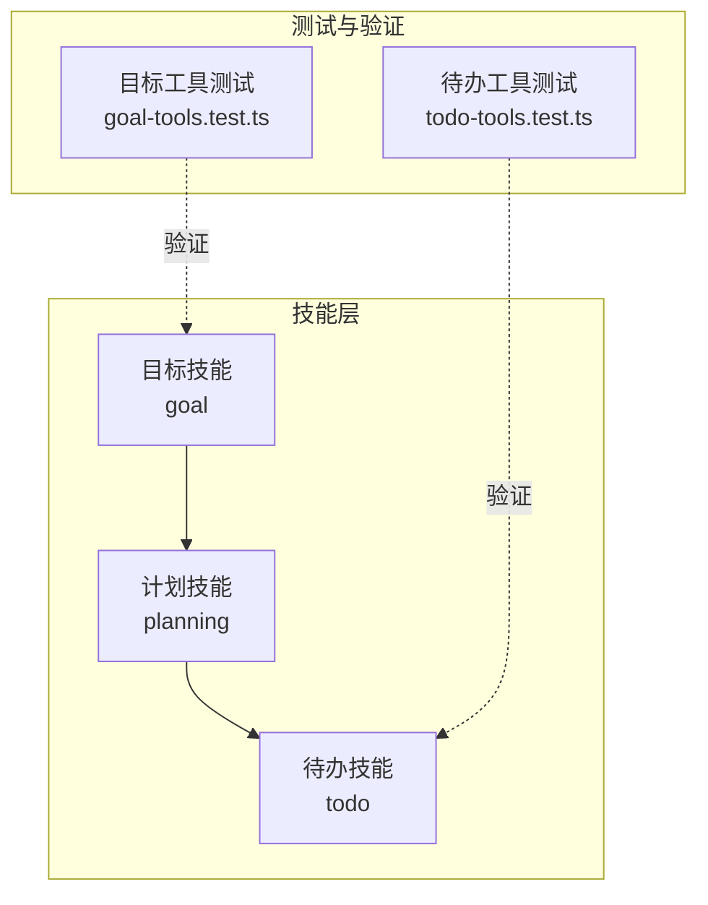
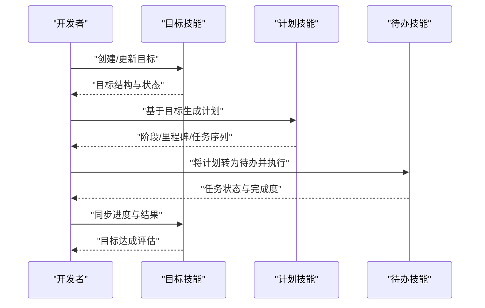
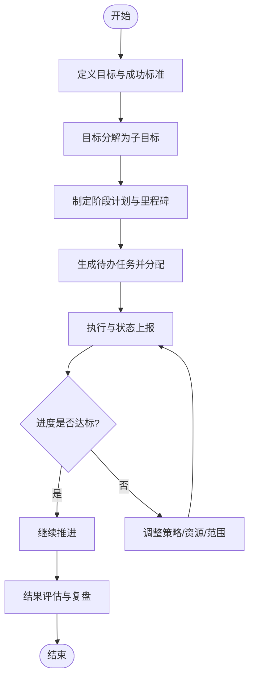
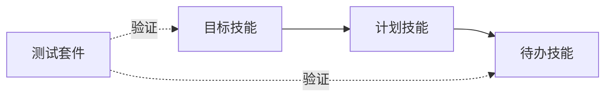

# 目标导向技能

<cite>
**本文引用的文件**   
- [engine/skills/goal/SKILL.md](file://engine/skills/goal/SKILL.md)
- [engine/skills/goal/skill.json](file://engine/skills/goal/skill.json)
- [engine/skills/planning/SKILL.md](file://engine/skills/planning/SKILL.md)
- [engine/skills/todo/SKILL.md](file://engine/skills/todo/SKILL.md)
- [engine/tests/goal-tools.test.ts](file://engine/tests/goal-tools.test.ts)
- [engine/tests/todo-tools.test.ts](file://engine/tests/todo-tools.test.ts)
</cite>

## 目录
1. [简介](#简介)
2. [项目结构](#项目结构)
3. [核心组件](#核心组件)
4. [架构总览](#架构总览)
5. [详细组件分析](#详细组件分析)
6. [依赖分析](#依赖分析)
7. [性能考虑](#性能考虑)
8. [故障排查指南](#故障排查指南)
9. [结论](#结论)
10. [附录](#附录)

## 简介
本文件面向开发者，系统化介绍“目标导向技能”的使用方法与实践。围绕目标的设定与实现，文档覆盖目标分解、路径规划、进度监控与结果评估等关键环节，帮助你将复杂开发目标转化为可执行的行动计划，并通过关键指标跟踪与策略调整，持续逼近预期成果。

## 项目结构
目标导向能力由一组技能与配套工具组成，主要位于 engine/skills 目录下：
- goal：目标定义与管理（创建、拆解、状态追踪）
- planning：计划制定与路径规划（任务编排、里程碑设计）
- todo：待办清单与执行跟踪（任务落地、完成度统计）
- 测试用例：goal-tools.test.ts、todo-tools.test.ts 提供行为契约与回归保障

图表来源
- [engine/skills/goal/SKILL.md](file://engine/skills/goal/SKILL.md)
- [engine/skills/planning/SKILL.md](file://engine/skills/planning/SKILL.md)
- [engine/skills/todo/SKILL.md](file://engine/skills/todo/SKILL.md)
- [engine/tests/goal-tools.test.ts](file://engine/tests/goal-tools.test.ts)
- [engine/tests/todo-tools.test.ts](file://engine/tests/todo-tools.test.ts)

章节来源
- [engine/skills/goal/SKILL.md](file://engine/skills/goal/SKILL.md)
- [engine/skills/planning/SKILL.md](file://engine/skills/planning/SKILL.md)
- [engine/skills/todo/SKILL.md](file://engine/skills/todo/SKILL.md)
- [engine/tests/goal-tools.test.ts](file://engine/tests/goal-tools.test.ts)
- [engine/tests/todo-tools.test.ts](file://engine/tests/todo-tools.test.ts)

## 核心组件
- 目标管理（goal）
  - 负责将高层目标结构化，支持目标拆分、依赖关系、优先级与状态流转。
  - 典型操作包括创建目标、定义子目标、更新状态、汇总进度。
- 计划制定（planning）
  - 基于目标生成可执行计划，包含阶段划分、里程碑、资源与时间约束。
  - 输出为任务序列或工作流，便于后续落地到待办清单。
- 待办跟踪（todo）
  - 承载具体任务项，记录执行状态、完成比例与阻塞原因。
  - 提供聚合视图，用于计算整体完成度与识别瓶颈。

章节来源
- [engine/skills/goal/SKILL.md](file://engine/skills/goal/SKILL.md)
- [engine/skills/planning/SKILL.md](file://engine/skills/planning/SKILL.md)
- [engine/skills/todo/SKILL.md](file://engine/skills/todo/SKILL.md)

## 架构总览
目标导向流程从“目标”出发，经“计划”拆解为“待办”，并在执行中持续反馈进度与风险，最终形成闭环评估。

图表来源
- [engine/skills/goal/SKILL.md](file://engine/skills/goal/SKILL.md)
- [engine/skills/planning/SKILL.md](file://engine/skills/planning/SKILL.md)
- [engine/skills/todo/SKILL.md](file://engine/skills/todo/SKILL.md)

## 详细组件分析

### 目标管理（goal）
- 职责
  - 定义目标层级与依赖，维护生命周期状态（如新建、进行中、已完成、已取消）。
  - 提供目标级指标（范围、质量、风险）与进度汇总。
- 关键用法
  - 创建目标：明确业务价值、成功标准与约束条件。
  - 目标分解：自上而下拆分为子目标，确保每个子目标可度量、可交付。
  - 状态同步：随执行推进更新状态，保持全局一致。
  - 结果评估：对照成功标准进行复盘，沉淀经验。
- 示例场景
  - 将“重构核心模块”的目标分解为“接口抽象”、“单元测试补全”、“性能回归”三个子目标，分别指定负责人与验收标准。

章节来源
- [engine/skills/goal/SKILL.md](file://engine/skills/goal/SKILL.md)
- [engine/tests/goal-tools.test.ts](file://engine/tests/goal-tools.test.ts)

### 计划制定（planning）
- 职责
  - 将目标映射为阶段性计划，定义里程碑、前置依赖与资源需求。
  - 输出可执行的任务序列，供待办技能承接。
- 关键用法
  - 路径规划：按依赖拓扑排序，识别关键路径与并行机会。
  - 里程碑设计：以可验证的交付物作为检查点。
  - 风险预案：对高风险任务设置缓冲与回退方案。
- 示例场景
  - 针对“上线新特性”的计划，划分为“需求澄清”、“设计与评审”、“开发与联调”、“测试与发布”四个阶段，每阶段产出明确。

章节来源
- [engine/skills/planning/SKILL.md](file://engine/skills/planning/SKILL.md)

### 待办跟踪（todo）
- 职责
  - 承载具体任务项，记录状态、耗时、阻塞原因与关联目标/计划。
  - 提供完成度统计与可视化，辅助决策与沟通。
- 关键用法
  - 任务落地：将计划中的步骤转化为待办，分配责任人。
  - 进度上报：定期更新状态与完成比例，标注风险与阻碍。
  - 指标汇总：按目标维度聚合完成度，识别偏差。
- 示例场景
  - 将“接口抽象”的子目标细化为若干代码改造任务，逐项标记完成，自动汇总至父目标进度。

章节来源
- [engine/skills/todo/SKILL.md](file://engine/skills/todo/SKILL.md)
- [engine/tests/todo-tools.test.ts](file://engine/tests/todo-tools.test.ts)

### 端到端工作流（示例）
以下流程图展示从目标到结果的完整闭环，适用于复杂开发目标的落地。

[此图为概念性流程示意，不直接对应具体源码文件]

## 依赖分析
- 组件耦合
  - 目标技能驱动计划技能，计划技能驱动待办技能，形成单向依赖链，降低循环依赖风险。
- 外部依赖
  - 通过测试用例验证工具契约与边界行为，确保跨版本稳定性。
- 集成点
  - 目标/计划/待办的数据模型与状态机需保持一致，避免信息孤岛。

图表来源
- [engine/skills/goal/SKILL.md](file://engine/skills/goal/SKILL.md)
- [engine/skills/planning/SKILL.md](file://engine/skills/planning/SKILL.md)
- [engine/skills/todo/SKILL.md](file://engine/skills/todo/SKILL.md)
- [engine/tests/goal-tools.test.ts](file://engine/tests/goal-tools.test.ts)
- [engine/tests/todo-tools.test.ts](file://engine/tests/todo-tools.test.ts)

章节来源
- [engine/skills/goal/SKILL.md](file://engine/skills/goal/SKILL.md)
- [engine/skills/planning/SKILL.md](file://engine/skills/planning/SKILL.md)
- [engine/skills/todo/SKILL.md](file://engine/skills/todo/SKILL.md)
- [engine/tests/goal-tools.test.ts](file://engine/tests/goal-tools.test.ts)
- [engine/tests/todo-tools.test.ts](file://engine/tests/todo-tools.test.ts)

## 性能考虑
- 粒度控制
  - 目标与任务的粒度应适中，过粗不利于跟踪，过细增加管理成本。
- 增量更新
  - 优先采用增量式状态更新与合并，减少全量重算。
- 指标采样
  - 对高频指标进行采样与缓存，避免频繁聚合带来的开销。
- 批处理
  - 批量提交待办状态变更，降低系统压力。

## 故障排查指南
- 常见问题
  - 目标未分解：导致无法落地执行。建议检查目标层级与依赖关系。
  - 计划缺失里程碑：难以定位偏差。建议补充关键检查点。
  - 待办状态不同步：造成进度失真。建议统一上报入口与校验规则。
- 定位方法
  - 使用测试用例复现问题，确认工具契约是否被破坏。
  - 查看目标/计划/待办的状态流转日志，定位断点。
- 恢复策略
  - 回滚到最近稳定快照，重新生成计划与待办，逐步对齐状态。

章节来源
- [engine/tests/goal-tools.test.ts](file://engine/tests/goal-tools.test.ts)
- [engine/tests/todo-tools.test.ts](file://engine/tests/todo-tools.test.ts)

## 结论
目标导向技能通过“目标—计划—待办”的清晰链路，帮助团队将复杂开发目标转化为可执行、可度量、可调整的行动计划。配合关键指标与复盘机制，能够显著提升交付效率与质量。

## 附录
- 实践建议
  - 在启动前明确成功标准与约束条件，避免范围蔓延。
  - 定期回顾计划与待办，及时识别并化解风险。
  - 将复盘结论沉淀为模板与规范，持续优化流程。