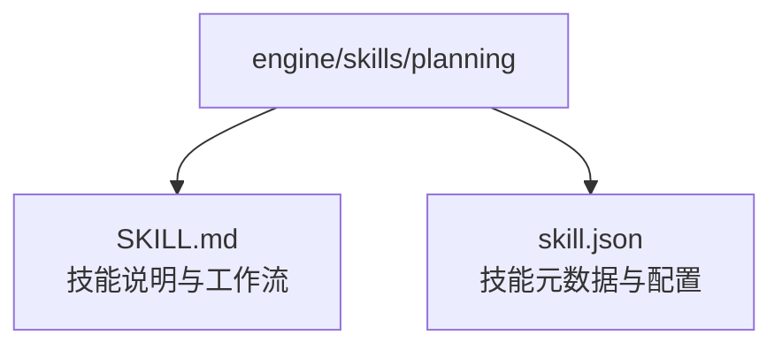
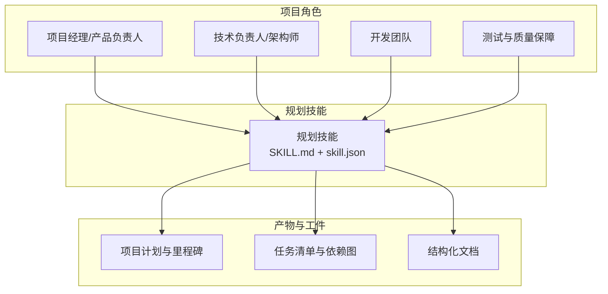
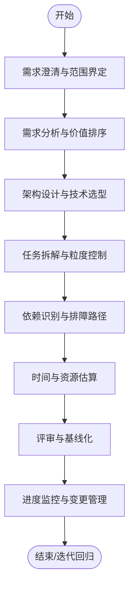
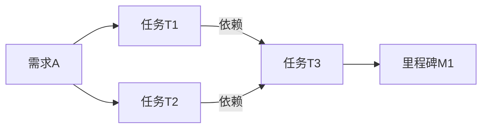
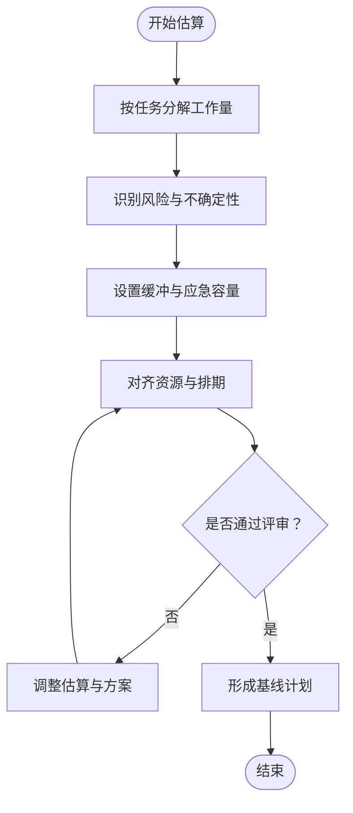
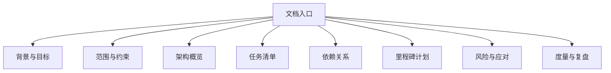
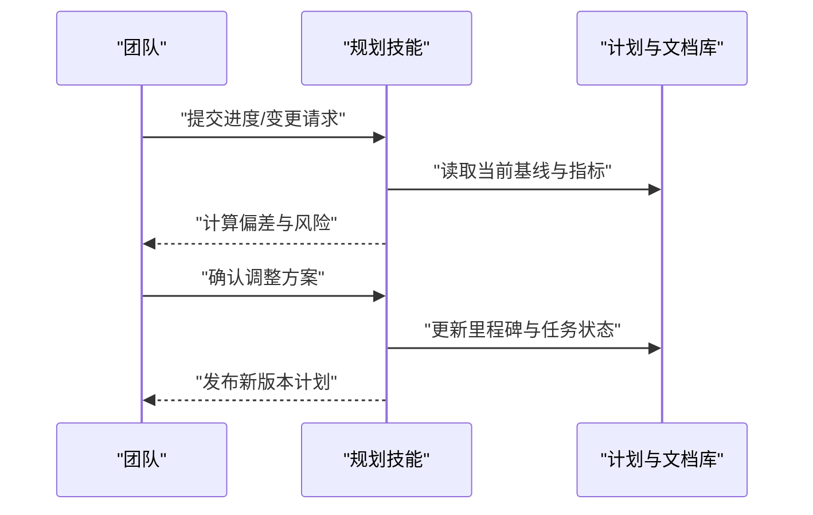
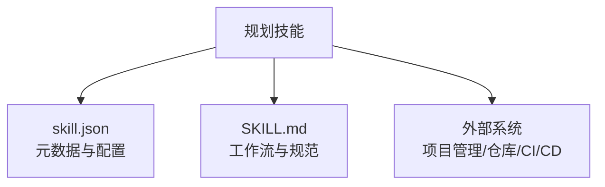

# 规划技能

<cite>
**本文引用的文件**   
- [SKILL.md](file://engine/skills/planning/SKILL.md)
- [skill.json](file://engine/skills/planning/skill.json)
</cite>

## 目录
1. [简介](#简介)
2. [项目结构](#项目结构)
3. [核心组件](#核心组件)
4. [架构总览](#架构总览)
5. [详细组件分析](#详细组件分析)
6. [依赖关系分析](#依赖关系分析)
7. [性能与可维护性建议](#性能与可维护性建议)
8. [故障排查指南](#故障排查指南)
9. [结论](#结论)
10. [附录](#附录)

## 简介
本指南面向使用“规划技能”的项目团队，帮助你将复杂需求转化为可执行的任务计划、识别依赖关系、合理分配资源并监控进度。规划技能覆盖需求分析、架构设计、任务拆解和时间估算等关键环节，并提供结构化文档与里程碑产物的生成方法，使项目从模糊目标走向清晰落地。

## 项目结构
在仓库中，规划技能位于 engine/skills/planning 目录下，包含两个关键文件：
- SKILL.md：定义技能的用途、能力边界、输入输出规范、工作流与最佳实践。
- skill.json：描述技能的元数据与配置（如名称、版本、工具绑定、参数约束等）。

图表来源
- [SKILL.md](file://engine/skills/planning/SKILL.md)
- [skill.json](file://engine/skills/planning/skill.json)

章节来源
- [SKILL.md](file://engine/skills/planning/SKILL.md)
- [skill.json](file://engine/skills/planning/skill.json)

## 核心组件
- 技能说明（SKILL.md）
  - 职责范围：明确规划技能能做什么、不能做什么，以及与其他技能的协作方式。
  - 输入/输出：定义触发条件、所需上下文、期望产出物（如任务清单、依赖图、里程碑计划等）。
  - 工作流：提供从需求到计划的步骤化流程，包括需求澄清、架构草图、任务分解、依赖识别、时间估算与评审闭环。
  - 质量门槛：规定验收标准、风险点与回退策略。
- 技能配置（skill.json）
  - 元信息：名称、版本、作者、描述等。
  - 能力声明：对外暴露的工具或接口、参数校验规则、权限与安全要求。
  - 集成点：与引擎、其他技能或外部系统的对接约定。

章节来源
- [SKILL.md](file://engine/skills/planning/SKILL.md)
- [skill.json](file://engine/skills/planning/skill.json)

## 架构总览
下图展示了规划技能在项目中的位置及其与相关角色的交互关系。

[此图为概念性架构图，不直接映射具体源码文件]

## 详细组件分析

### 规划工作流（从需求到计划）
该工作流将复杂需求逐步细化为可执行任务，并持续对齐目标与约束。

[此图为概念性工作流，不直接映射具体源码文件]

### 任务拆解与依赖建模
- 任务粒度：以“可独立交付、可验证”的最小单元为目标，避免过大或过小的任务。
- 依赖建模：区分硬依赖（阻塞型）与软依赖（建议型），标注跨模块/跨团队的耦合点。
- 可视化：用依赖图呈现关键路径与并行机会，辅助资源调度。

[此图为概念性依赖图，不直接映射具体源码文件]

### 时间估算与资源分配
- 估算方法：采用自上而下（里程碑驱动）与自下而上（任务驱动）相结合，交叉校验。
- 缓冲策略：为高风险任务设置缓冲，预留应急容量。
- 资源匹配：依据任务复杂度与依赖强度，动态调整人员与工具投入。

[此图为概念性估算流程，不直接映射具体源码文件]

### 里程碑与结构化文档
- 里程碑：以“可演示、可验收”的阶段性成果为标志，串联关键依赖与交付物。
- 文档结构：建议包含背景与目标、范围与约束、架构概览、任务清单、依赖关系、里程碑计划、风险与应对、度量指标与复盘模板。
- 版本化：所有计划与文档纳入版本管理，确保可追溯与可审计。

[此图为概念性文档结构，不直接映射具体源码文件]

### 进度监控与变更管理
- 指标体系：完成度、阻塞时长、变更频率、返工率、预测偏差等。
- 预警机制：对关键路径延迟、依赖未就绪、资源不足进行自动预警。
- 变更流程：提出变更申请、影响评估、审批与基线更新，保持计划一致性。

[此图为概念性监控流程，不直接映射具体源码文件]

## 依赖关系分析
- 内部依赖：规划技能与其元数据（skill.json）和说明（SKILL.md）紧密耦合，二者需同步演进。
- 外部依赖：与项目管理系统、代码仓库、CI/CD流水线、知识库等系统存在集成点，用于拉取上下文、沉淀产物与追踪进度。
- 风险点：过度耦合导致迁移成本高；缺少统一契约易造成信息不一致。

[此图为概念性依赖图，不直接映射具体源码文件]

## 性能与可维护性建议
- 文档即代码：将计划与文档纳入版本管理，配合自动化检查与预览。
- 增量式规划：以短周期迭代推进，降低一次性大规划的失败风险。
- 指标驱动：建立稳定的度量口径，持续优化估算与排程模型。
- 模板化：沉淀常用模板（任务卡、里程碑表、风险评估表），提升复用效率。

[本节为通用建议，不直接分析具体文件]

## 故障排查指南
- 常见问题
  - 需求不清：补充用户故事与验收标准，明确范围与边界。
  - 依赖遗漏：绘制端到端依赖图，组织跨团队对齐会。
  - 估算偏差：引入历史数据校准，增加风险缓冲与滚动重估。
  - 进度失控：聚焦关键路径，及时升级阻塞问题，必要时裁剪范围。
- 定位步骤
  - 核对计划基线与变更记录，确认最近一次变更的影响面。
  - 检查任务状态与依赖就绪情况，识别瓶颈环节。
  - 审查度量指标趋势，判断是偶发波动还是系统性问题。
  - 组织复盘会议，形成改进项并纳入下一轮计划。

[本节为通用指导，不直接分析具体文件]

## 结论
规划技能通过标准化的工作流、清晰的依赖建模与稳健的估算方法，帮助团队将复杂需求转化为可执行的计划与里程碑。结合度量与变更管理，可实现持续可控的交付节奏与高质量产出。

[本节为总结性内容，不直接分析具体文件]

## 附录
- 术语表
  - 里程碑：具有明确交付物与验收标准的阶段性目标。
  - 关键路径：决定整体进度的最长依赖链。
  - 缓冲：为不确定性与风险预留的时间与资源。
- 参考模板
  - 任务卡模板、里程碑计划表、风险评估表、复盘报告模板等（可在团队知识库中沉淀与维护）。

[本节为补充信息，不直接分析具体文件]