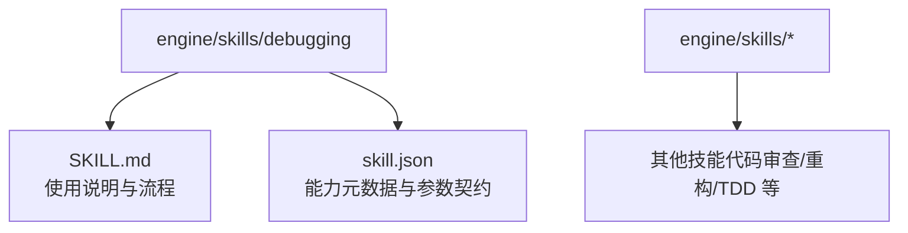
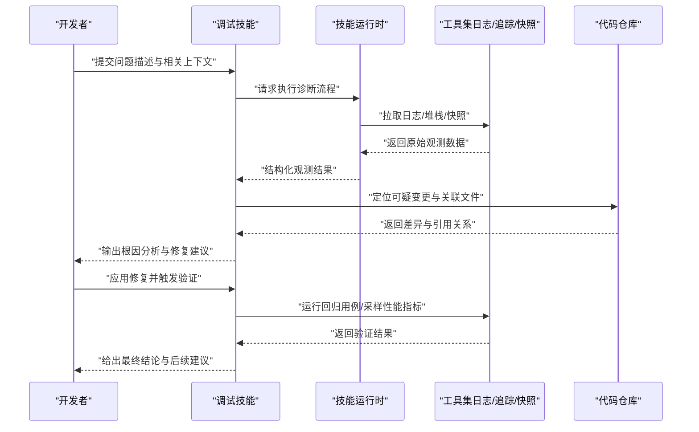
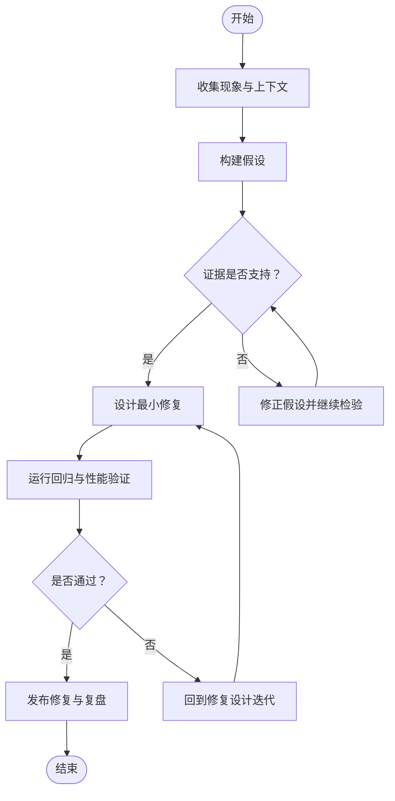
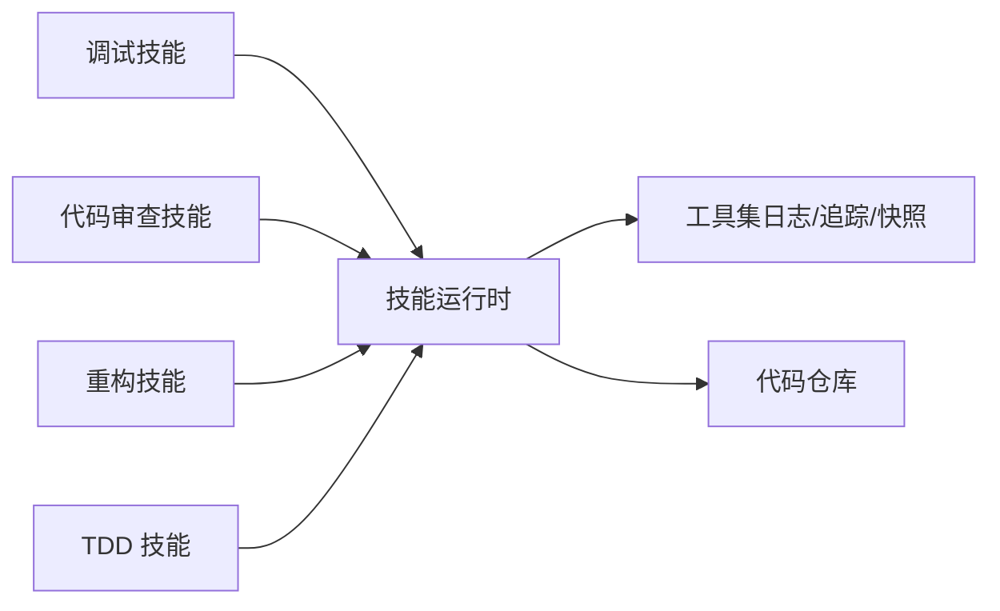

# 调试技能

<cite>
**本文引用的文件**   
- [SKILL.md](file://engine/skills/debugging/SKILL.md)
- [skill.json](file://engine/skills/debugging/skill.json)
</cite>

## 目录
1. [简介](#简介)
2. [项目结构](#项目结构)
3. [核心组件](#核心组件)
4. [架构总览](#架构总览)
5. [详细组件分析](#详细组件分析)
6. [依赖关系分析](#依赖关系分析)
7. [性能考虑](#性能考虑)
8. [故障排查指南](#故障排查指南)
9. [结论](#结论)
10. [附录](#附录)

## 简介
本指南面向开发者，系统化介绍“调试技能”的使用方法与最佳实践。内容涵盖错误信息分析、堆栈跟踪解读、变量状态检查、问题诊断流程、修复建议生成与修复验证等关键环节，并提供常见编程错误、运行时异常与性能问题的实战场景示例，以及可落地的调试技巧与工作流优化建议，帮助你在复杂系统中快速定位并解决问题。

## 项目结构
调试技能位于引擎的 skills 目录下，采用“能力包”组织方式：每个技能包含说明文档与元数据配置，便于被上层运行时加载与编排。

图示来源
- [SKILL.md](file://engine/skills/debugging/SKILL.md)
- [skill.json](file://engine/skills/debugging/skill.json)

章节来源
- [SKILL.md](file://engine/skills/debugging/SKILL.md)
- [skill.json](file://engine/skills/debugging/skill.json)

## 核心组件
- 能力说明文档（SKILL.md）
  - 定义调试技能的职责边界、输入输出约定、典型工作流与注意事项。
  - 提供错误信息解析、堆栈跟踪解读、上下文收集与复现步骤的标准方法。
- 能力元数据（skill.json）
  - 描述能力的标识、版本、参数契约、工具调用接口与权限范围，供运行时注册与调度。

章节来源
- [SKILL.md](file://engine/skills/debugging/SKILL.md)
- [skill.json](file://engine/skills/debugging/skill.json)

## 架构总览
调试技能作为“能力包”被运行时加载，通过统一的技能运行时进行编排，结合日志、追踪与上下文快照，形成从“现象采集—根因定位—修复建议—验证回归”的闭环。

图示来源
- [SKILL.md](file://engine/skills/debugging/SKILL.md)
- [skill.json](file://engine/skills/debugging/skill.json)

## 详细组件分析

### 调试工作流（端到端）
- 目标
  - 将模糊的问题描述转化为可执行的诊断计划，逐步收敛到根因并产出可验证的修复方案。
- 关键阶段
  - 现象确认：收集错误信息、堆栈、时间线与复现步骤。
  - 假设构建：基于日志与变更历史提出若干可能原因。
  - 证据检验：通过断点/快照/对比测试逐一验证或排除假设。
  - 修复设计：最小化改动、明确影响面与回滚策略。
  - 验证回归：自动化用例覆盖、性能基线比对与灰度观察。
- 交付物
  - 诊断报告（含证据链）、修复补丁、回归验证结果与复盘要点。

[此图为概念性流程图，无需图示来源]

章节来源
- [SKILL.md](file://engine/skills/debugging/SKILL.md)

### 错误信息分析
- 原则
  - 优先关注“最近一次失败”的完整错误消息、错误码与上下文键值。
  - 区分“业务错误”和“系统错误”，前者多为预期分支，后者需深入调查。
- 方法
  - 提取关键字段：错误类型、错误码、模块/服务名、请求ID、时间戳。
  - 关联上下文：用户操作路径、输入参数、上游依赖状态。
  - 分层归因：UI层—网关层—业务层—存储/外部依赖。
- 输出
  - 结构化错误摘要、关联链路图与下一步取证清单。

章节来源
- [SKILL.md](file://engine/skills/debugging/SKILL.md)

### 堆栈跟踪解读
- 重点
  - 自顶向下阅读，先定位“抛出点”，再回溯“传播路径”。
  - 关注异步边界、线程切换与重试/补偿逻辑。
- 技巧
  - 过滤噪声：忽略框架样板调用，聚焦业务函数。
  - 识别热点：重复出现的调用链通常指向瓶颈或脆弱点。
  - 关联变更：对照最近提交，缩小可疑范围。
- 产物
  - 精简后的调用链、关键帧快照与需要补充的观测点。

章节来源
- [SKILL.md](file://engine/skills/debugging/SKILL.md)

### 变量状态检查
- 策略
  - 在关键分支前后抓取快照，记录入参、中间态与返回值。
  - 对共享状态加锁顺序与可见性问题保持敏感。
- 工具
  - 使用快照/内存转储/对象图对比，避免手工打印带来的遗漏。
- 注意
  - 控制采样频率与数据量，避免二次放大问题。

章节来源
- [SKILL.md](file://engine/skills/debugging/SKILL.md)

### 问题诊断与修复建议生成
- 诊断
  - 以“最小复现”为核心，构造可控输入，隔离外部依赖。
  - 用二分法或特征开关快速定位引入点。
- 建议
  - 给出多种修复路径（热修复/重构/降级），评估风险与成本。
  - 附带回归用例与监控指标，确保可验证。

章节来源
- [SKILL.md](file://engine/skills/debugging/SKILL.md)

### 修复效果验证
- 维度
  - 功能正确性：用例通过率、边界条件覆盖。
  - 稳定性：崩溃率、错误率、超时率。
  - 性能：延迟分布、吞吐、资源占用。
- 手段
  - 本地回归—集成测试—预发灰度—线上观察四步走。
  - 建立基线与告警阈值，自动判定是否回归。

章节来源
- [SKILL.md](file://engine/skills/debugging/SKILL.md)

### 实战场景示例

#### 场景一：常见编程错误（空指针/越界/类型不匹配）
- 现象
  - 偶发崩溃或报错，伴随特定输入组合。
- 步骤
  - 定位抛出处与最近调用者；核对前置校验与默认值处理。
  - 增加防御式判断与单元测试覆盖。
- 验证
  - 新增边界用例，确认不再触发。

章节来源
- [SKILL.md](file://engine/skills/debugging/SKILL.md)

#### 场景二：运行时异常（并发竞态/死锁/资源泄漏）
- 现象
  - 高负载下出现卡顿、无响应或内存持续增长。
- 步骤
  - 抓取线程快照与锁等待图；分析持有时间与释放路径。
  - 引入超时与熔断，减少级联失败。
- 验证
  - 压测回归，观察资源曲线与错误率。

章节来源
- [SKILL.md](file://engine/skills/debugging/SKILL.md)

#### 场景三：性能问题（慢查询/序列化开销/缓存未命中）
- 现象
  - P95/P99 延迟升高，CPU/IO 指标异常。
- 步骤
  - 定位热点函数与 I/O 热点；对比不同数据规模下的耗时。
  - 引入索引/批处理/缓存预热，减少不必要计算。
- 验证
  - 基准测试对比，确保收益稳定且无副作用。

章节来源
- [SKILL.md](file://engine/skills/debugging/SKILL.md)

### 调试技巧与工作流优化
- 技巧
  - 先复现后修复：无法稳定复现的问题难以可靠修复。
  - 小步快跑：每次只改一处，配合最小用例验证。
  - 留痕：为关键路径添加可观测埋点，便于事后复盘。
- 工作流优化
  - 将常用诊断步骤固化为脚本/模板，缩短平均修复时间。
  - 建立“问题—假设—证据—结论”的结构化记录规范。

章节来源
- [SKILL.md](file://engine/skills/debugging/SKILL.md)

## 依赖关系分析
调试技能作为独立能力包，通过运行时统一注册与调度，与其他技能（如代码审查、重构、TDD）协同工作，形成“发现—诊断—修复—验证”的协作闭环。

图示来源
- [SKILL.md](file://engine/skills/debugging/SKILL.md)
- [skill.json](file://engine/skills/debugging/skill.json)

章节来源
- [SKILL.md](file://engine/skills/debugging/SKILL.md)
- [skill.json](file://engine/skills/debugging/skill.json)

## 性能考虑
- 采样与限流
  - 在高并发场景下，合理设置采样率与批量大小，避免二次放大。
- 数据最小化
  - 仅采集必要字段，脱敏敏感信息，降低传输与存储压力。
- 离线分析
  - 将重型分析任务下沉至离线流水线，保障在线服务稳定性。

[本节为通用指导，无需章节来源]

## 故障排查指南
- 常见问题
  - 现象不一致：优先补齐可观测数据，构造最小复现场景。
  - 修复无效：回退变更，逐层剥离，重新定位根因。
  - 回归失败：补充用例，明确期望行为，避免隐性破坏。
- 排障清单
  - 是否具备完整错误信息与上下文？
  - 是否已尝试最小复现与隔离依赖？
  - 是否建立了回归用例与监控指标？
  - 是否记录了假设—证据—结论的推理链？

章节来源
- [SKILL.md](file://engine/skills/debugging/SKILL.md)

## 结论
调试技能通过标准化的诊断流程、结构化的证据收集与可验证的修复闭环，显著提升问题定位效率与修复质量。建议在团队内推广其方法论与实践模板，持续沉淀案例与工具，形成可复用的工程资产。

[本节为总结性内容，无需章节来源]

## 附录
- 术语
  - 堆栈跟踪：程序异常时的调用链快照。
  - 快照：某一时刻的系统状态或数据结构视图。
  - 回归：修复引入的新问题导致原有功能失效。
- 参考
  - 能力说明与参数契约详见对应文件。

章节来源
- [SKILL.md](file://engine/skills/debugging/SKILL.md)
- [skill.json](file://engine/skills/debugging/skill.json)