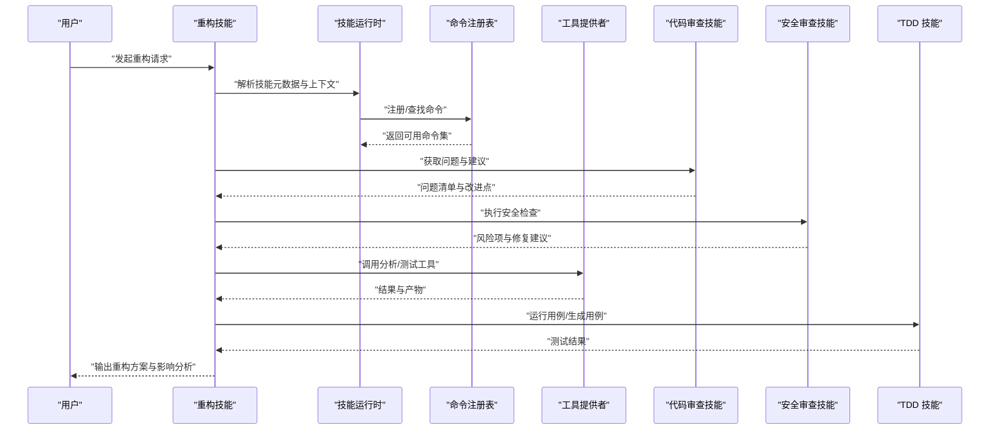
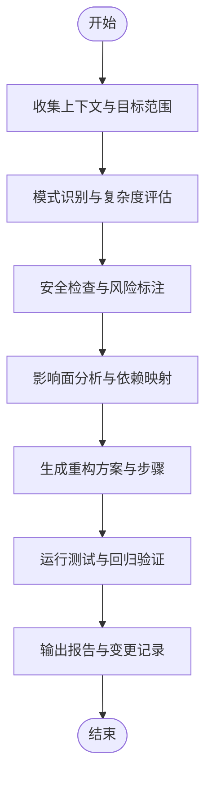
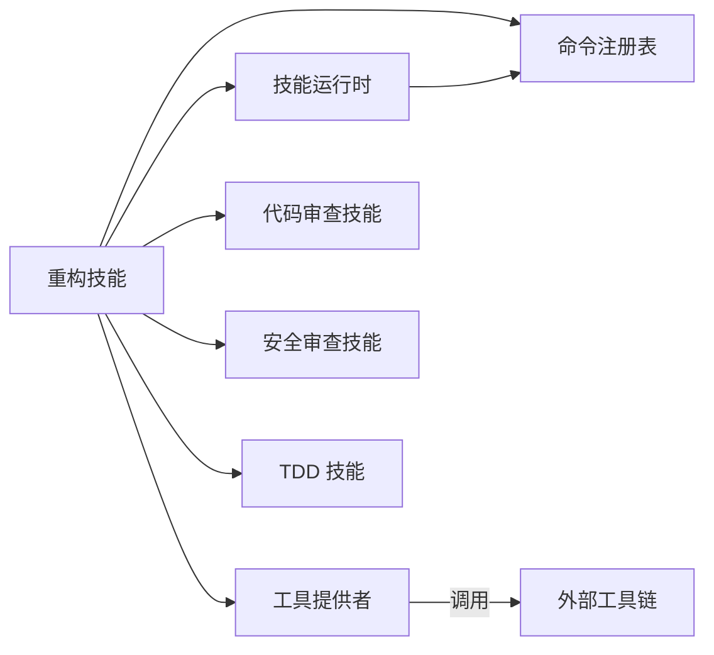

# 重构技能

<cite>
**本文引用的文件**
- [engine/skills/refactoring/SKILL.md](file://engine/skills/refactoring/SKILL.md)
- [engine/skills/refactoring/skill.json](file://engine/skills/refactoring/skill.json)
- [engine/skills/code-review/SKILL.md](file://engine/skills/code-review/SKILL.md)
- [engine/skills/security-review/SKILL.md](file://engine/skills/security-review/SKILL.md)
- [engine/skills/review/SKILL.md](file://engine/skills/review/SKILL.md)
- [engine/skills/debugging/SKILL.md](file://engine/skills/debugging/SKILL.md)
- [engine/skills/tdd/SKILL.md](file://engine/skills/tdd/SKILL.md)
- [engine/skills/tdd/tdd-cycle.md](file://engine/skills/tdd/tdd-cycle.md)
- [engine/skills/planning/SKILL.md](file://engine/skills/planning/SKILL.md)
- [engine/skills/todo/SKILL.md](file://engine/skills/todo/SKILL.md)
- [engine/skills/web/SKILL.md](file://engine/skills/web/SKILL.md)
- [engine/skills/git-worktrees/SKILL.md](file://engine/skills/git-worktrees/SKILL.md)
- [engine/skills/goal/SKILL.md](file://engine/skills/goal/SKILL.md)
- [engine/tests/builtin-skills.test.ts](file://engine/tests/builtin-skills.test.ts)
- [engine/tests/skill-command-registry.test.ts](file://engine/tests/skill-command-registry.test.ts)
- [engine/tests/skill-runtime.test.ts](file://engine/tests/skill-runtime.test.ts)
- [engine/tests/skill-tool-provider.test.ts](file://engine/tests/skill-tool-provider.test.ts)
- [engine/tests/work-mode-skill-runtime.test.ts](file://engine/tests/work-mode-skill-runtime.test.ts)
</cite>

## 目录
1. [简介](#简介)
2. [项目结构](#项目结构)
3. [核心组件](#核心组件)
4. [架构总览](#架构总览)
5. [详细组件分析](#详细组件分析)
6. [依赖分析](#依赖分析)
7. [性能考虑](#性能考虑)
8. [故障排查指南](#故障排查指南)
9. [结论](#结论)
10. [附录](#附录)

## 简介
本文件面向希望使用“重构技能”改进代码结构与设计的工程师与团队。该技能聚焦于在保持功能不变的前提下，提升代码的可读性、可维护性与可扩展性，同时提供模式识别、重构建议生成、安全性检查与影响分析等能力。通过与其他内置技能（如代码审查、安全审查、调试、TDD、计划与待办）协同工作，形成从问题发现到落地验证的完整闭环。

## 项目结构
仓库采用多包与多技能组织方式。与重构相关的定义与说明位于 engine/skills 目录下，其中 refactoring 子目录包含重构技能的描述与元数据；其他相关技能（如 code-review、security-review、review、debugging、tdd、planning、todo、web、git-worktrees、goal）可作为协作流程的一部分。测试覆盖集中在 engine/tests 中，包括对技能注册、运行时、工具提供者与工作模式的验证。

```mermaid
graph TB
subgraph "引擎"
A["engine/skills/refactoring<br/>SKILL.md / skill.json"]
B["engine/skills/code-review<br/>SKILL.md / skill.json"]
C["engine/skills/security-review<br/>SKILL.md / skill.json"]
D["engine/skills/review<br/>SKILL.md / skill.json"]
E["engine/skills/debugging<br/>SKILL.md / skill.json"]
F["engine/skills/tdd<br/>SKILL.md / tdd-cycle.md"]
G["engine/skills/planning<br/>SKILL.md / skill.json"]
H["engine/skills/todo<br/>SKILL.md / skill.json"]
I["engine/skills/web<br/>SKILL.md / skill.json"]
J["engine/skills/git-worktrees<br/>SKILL.md / skill.json"]
K["engine/skills/goal<br/>SKILL.md / skill.json"]
end
subgraph "测试"
T1["tests/builtin-skills.test.ts"]
T2["tests/skill-command-registry.test.ts"]
T3["tests/skill-runtime.test.ts"]
T4["tests/skill-tool-provider.test.ts"]
T5["tests/work-mode-skill-runtime.test.ts"]
end
A --> T3
A --> T4
B --> T1
C --> T1
D --> T1
E --> T1
F --> T1
G --> T1
H --> T1
I --> T1
J --> T1
K --> T1
T2 --> T3
T5 --> T3
```

图表来源
- [engine/skills/refactoring/SKILL.md](file://engine/skills/refactoring/SKILL.md)
- [engine/skills/refactoring/skill.json](file://engine/skills/refactoring/skill.json)
- [engine/skills/code-review/SKILL.md](file://engine/skills/code-review/SKILL.md)
- [engine/skills/security-review/SKILL.md](file://engine/skills/security-review/SKILL.md)
- [engine/skills/review/SKILL.md](file://engine/skills/review/SKILL.md)
- [engine/skills/debugging/SKILL.md](file://engine/skills/debugging/SKILL.md)
- [engine/skills/tdd/SKILL.md](file://engine/skills/tdd/SKILL.md)
- [engine/skills/tdd/tdd-cycle.md](file://engine/skills/tdd/tdd-cycle.md)
- [engine/skills/planning/SKILL.md](file://engine/skills/planning/SKILL.md)
- [engine/skills/todo/SKILL.md](file://engine/skills/todo/SKILL.md)
- [engine/skills/web/SKILL.md](file://engine/skills/web/SKILL.md)
- [engine/skills/git-worktrees/SKILL.md](file://engine/skills/git-worktrees/SKILL.md)
- [engine/skills/goal/SKILL.md](file://engine/skills/goal/SKILL.md)
- [engine/tests/builtin-skills.test.ts](file://engine/tests/builtin-skills.test.ts)
- [engine/tests/skill-command-registry.test.ts](file://engine/tests/skill-command-registry.test.ts)
- [engine/tests/skill-runtime.test.ts](file://engine/tests/skill-runtime.test.ts)
- [engine/tests/skill-tool-provider.test.ts](file://engine/tests/skill-tool-provider.test.ts)
- [engine/tests/work-mode-skill-runtime.test.ts](file://engine/tests/work-mode-skill-runtime.test.ts)

章节来源
- [engine/skills/refactoring/SKILL.md](file://engine/skills/refactoring/SKILL.md)
- [engine/skills/refactoring/skill.json](file://engine/skills/refactoring/skill.json)
- [engine/tests/builtin-skills.test.ts](file://engine/tests/builtin-skills.test.ts)
- [engine/tests/skill-command-registry.test.ts](file://engine/tests/skill-command-registry.test.ts)
- [engine/tests/skill-runtime.test.ts](file://engine/tests/skill-runtime.test.ts)
- [engine/tests/skill-tool-provider.test.ts](file://engine/tests/skill-tool-provider.test.ts)
- [engine/tests/work-mode-skill-runtime.test.ts](file://engine/tests/work-mode-skill-runtime.test.ts)

## 核心组件
- 重构技能定义：包含技能说明与元数据，用于描述能力范围、输入输出约定、与工具的集成方式以及与其他技能的协作关系。
- 相关技能：
  - 代码审查：辅助识别潜在问题与改进点，为重构提供依据。
  - 安全审查：在重构过程中进行安全扫描与风险提醒。
  - 通用审查：对变更进行整体质量把关。
  - 调试：定位问题并验证重构后行为一致性。
  - TDD：以测试驱动的方式保障重构不破坏既有行为。
  - 计划与待办：将重构任务拆解、跟踪与验收。
  - Web/Git/目标：支持在线文档、分支隔离与目标对齐。

章节来源
- [engine/skills/refactoring/SKILL.md](file://engine/skills/refactoring/SKILL.md)
- [engine/skills/code-review/SKILL.md](file://engine/skills/code-review/SKILL.md)
- [engine/skills/security-review/SKILL.md](file://engine/skills/security-review/SKILL.md)
- [engine/skills/review/SKILL.md](file://engine/skills/review/SKILL.md)
- [engine/skills/debugging/SKILL.md](file://engine/skills/debugging/SKILL.md)
- [engine/skills/tdd/SKILL.md](file://engine/skills/tdd/SKILL.md)
- [engine/skills/tdd/tdd-cycle.md](file://engine/skills/tdd/tdd-cycle.md)
- [engine/skills/planning/SKILL.md](file://engine/skills/planning/SKILL.md)
- [engine/skills/todo/SKILL.md](file://engine/skills/todo/SKILL.md)
- [engine/skills/web/SKILL.md](file://engine/skills/web/SKILL.md)
- [engine/skills/git-worktrees/SKILL.md](file://engine/skills/git-worktrees/SKILL.md)
- [engine/skills/goal/SKILL.md](file://engine/skills/goal/SKILL.md)

## 架构总览
重构技能作为“能力单元”，由元数据与说明组成，并通过技能运行时与命令注册表加载。其可与工具提供者交互，调用静态分析、AST 解析、测试执行等外部能力，完成模式识别、建议生成、安全检查与影响分析。

图表来源
- [engine/skills/refactoring/SKILL.md](file://engine/skills/refactoring/SKILL.md)
- [engine/skills/refactoring/skill.json](file://engine/skills/refactoring/skill.json)
- [engine/tests/skill-command-registry.test.ts](file://engine/tests/skill-command-registry.test.ts)
- [engine/tests/skill-runtime.test.ts](file://engine/tests/skill-runtime.test.ts)
- [engine/tests/skill-tool-provider.test.ts](file://engine/tests/skill-tool-provider.test.ts)
- [engine/skills/code-review/SKILL.md](file://engine/skills/code-review/SKILL.md)
- [engine/skills/security-review/SKILL.md](file://engine/skills/security-review/SKILL.md)
- [engine/skills/tdd/SKILL.md](file://engine/skills/tdd/SKILL.md)

## 详细组件分析

### 重构技能（refactoring）
- 职责与边界
  - 负责识别常见代码模式与反模式，生成可落地的重构建议。
  - 结合安全审查与代码审查结果，评估重构风险与收益。
  - 产出影响分析报告，明确改动范围、依赖变化与回归风险。
- 关键流程
  - 输入：目标代码片段或模块、上下文信息（如依赖图、测试覆盖）。
  - 处理：模式匹配、复杂度评估、安全扫描、影响面分析。
  - 输出：重构方案、步骤化建议、风险评估与回归策略。
- 与其他技能协作
  - 与代码审查联动，优先处理高价值问题。
  - 与安全审查联动，确保重构不引入漏洞。
  - 与 TDD 联动，保证重构前后行为一致。
  - 与计划/待办联动，拆分任务与追踪进度。

图表来源
- [engine/skills/refactoring/SKILL.md](file://engine/skills/refactoring/SKILL.md)
- [engine/skills/refactoring/skill.json](file://engine/skills/refactoring/skill.json)

章节来源
- [engine/skills/refactoring/SKILL.md](file://engine/skills/refactoring/SKILL.md)
- [engine/skills/refactoring/skill.json](file://engine/skills/refactoring/skill.json)

### 代码审查（code-review）
- 作用：在重构前识别潜在问题、重复代码、复杂逻辑与不一致风格，为重构优先级排序提供依据。
- 与重构联动：将审查结果转化为具体重构任务，并在重构完成后再次审查以确认改进效果。

章节来源
- [engine/skills/code-review/SKILL.md](file://engine/skills/code-review/SKILL.md)

### 安全审查（security-review）
- 作用：在重构过程中检测不安全用法、依赖漏洞与配置风险，给出修复建议。
- 与重构联动：将安全风险纳入重构方案，确保在优化结构的同时降低攻击面。

章节来源
- [engine/skills/security-review/SKILL.md](file://engine/skills/security-review/SKILL.md)

### 通用审查（review）
- 作用：对重构变更进行整体质量把关，包括可读性、一致性、文档与可测试性。
- 与重构联动：作为合并前的最后一道防线，确保重构符合团队规范。

章节来源
- [engine/skills/review/SKILL.md](file://engine/skills/review/SKILL.md)

### 调试（debugging）
- 作用：在重构后快速定位异常与回归问题，辅助验证重构正确性。
- 与重构联动：配合最小化复现与断点策略，缩短问题定位时间。

章节来源
- [engine/skills/debugging/SKILL.md](file://engine/skills/debugging/SKILL.md)

### 测试驱动开发（TDD）
- 作用：以测试为先，确保重构不改变外部行为；必要时补充缺失用例以提升覆盖率。
- 与重构联动：在重构前先完善测试，再逐步实施重构，最后回归验证。

章节来源
- [engine/skills/tdd/SKILL.md](file://engine/skills/tdd/SKILL.md)
- [engine/skills/tdd/tdd-cycle.md](file://engine/skills/tdd/tdd-cycle.md)

### 计划与待办（planning/todo）
- 作用：将重构任务分解为可执行的步骤，记录风险、依赖与验收标准。
- 与重构联动：贯穿重构全生命周期，确保可控与可追踪。

章节来源
- [engine/skills/planning/SKILL.md](file://engine/skills/planning/SKILL.md)
- [engine/skills/todo/SKILL.md](file://engine/skills/todo/SKILL.md)

### Web、Git 工作树与目标（web/git-worktrees/goal）
- 作用：Web 提供在线文档与参考；Git 工作树支持并行重构与隔离实验；目标对齐确保重构服务于业务价值。
- 与重构联动：提升协作效率与风险控制能力。

章节来源
- [engine/skills/web/SKILL.md](file://engine/skills/web/SKILL.md)
- [engine/skills/git-worktrees/SKILL.md](file://engine/skills/git-worktrees/SKILL.md)
- [engine/skills/goal/SKILL.md](file://engine/skills/goal/SKILL.md)

## 依赖分析
- 内部依赖
  - 重构技能依赖技能运行时与命令注册表进行加载与调度。
  - 通过工具提供者与外部分析/测试工具交互。
  - 与其他技能通过统一接口协作，形成组合式工作流。
- 外部依赖
  - 静态分析、AST 解析、测试执行、安全扫描等工具链。
- 耦合与内聚
  - 技能间松耦合，通过标准化输入输出与事件机制通信。
  - 重构技能内聚于“模式识别—建议生成—影响分析—验证”的主路径。

图表来源
- [engine/skills/refactoring/SKILL.md](file://engine/skills/refactoring/SKILL.md)
- [engine/skills/refactoring/skill.json](file://engine/skills/refactoring/skill.json)
- [engine/tests/skill-command-registry.test.ts](file://engine/tests/skill-command-registry.test.ts)
- [engine/tests/skill-runtime.test.ts](file://engine/tests/skill-runtime.test.ts)
- [engine/tests/skill-tool-provider.test.ts](file://engine/tests/skill-tool-provider.test.ts)
- [engine/skills/code-review/SKILL.md](file://engine/skills/code-review/SKILL.md)
- [engine/skills/security-review/SKILL.md](file://engine/skills/security-review/SKILL.md)
- [engine/skills/tdd/SKILL.md](file://engine/skills/tdd/SKILL.md)

章节来源
- [engine/tests/skill-command-registry.test.ts](file://engine/tests/skill-command-registry.test.ts)
- [engine/tests/skill-runtime.test.ts](file://engine/tests/skill-runtime.test.ts)
- [engine/tests/skill-tool-provider.test.ts](file://engine/tests/skill-tool-provider.test.ts)

## 性能考虑
- 增量分析：仅对受影响模块进行模式识别与安全检查，减少全量扫描开销。
- 缓存策略：复用 AST 与依赖图，避免重复构建。
- 并行执行：将独立的重构步骤与测试用例并行化，缩短反馈周期。
- 资源限制：对大型仓库设置超时与内存上限，防止长时间阻塞。
- 渐进式重构：按小步快跑原则分批提交，降低回滚成本与风险。

[本节为通用指导，无需引用具体文件]

## 故障排查指南
- 常见问题
  - 技能未加载：检查命令注册表是否正确注册，确认运行时初始化顺序。
  - 工具调用失败：核对工具提供者配置与权限，查看外部工具日志。
  - 重构后回归失败：使用调试技能定位差异，结合 TDD 补充用例。
  - 安全告警误报：复核规则配置与上下文，调整阈值或白名单。
- 诊断步骤
  - 启用更详细的日志输出，捕获命令执行轨迹。
  - 缩小范围至最小可复现场景，逐步排除干扰因素。
  - 对比重构前后的依赖图与测试覆盖率，定位潜在断裂点。

章节来源
- [engine/tests/skill-command-registry.test.ts](file://engine/tests/skill-command-registry.test.ts)
- [engine/tests/skill-runtime.test.ts](file://engine/tests/skill-runtime.test.ts)
- [engine/tests/skill-tool-provider.test.ts](file://engine/tests/skill-tool-provider.test.ts)
- [engine/tests/work-mode-skill-runtime.test.ts](file://engine/tests/work-mode-skill-runtime.test.ts)

## 结论
重构技能通过模式识别、建议生成、安全检查与影响分析，帮助团队在保持功能不变的前提下持续改进代码结构与设计。结合代码审查、安全审查、调试与 TDD 等技能，可以形成高效、可控且可追溯的重构流程。建议在大型遗留系统中采用渐进式重构策略，以小步快跑的方式降低风险并持续提升质量。

[本节为总结性内容，无需引用具体文件]

## 附录
- 实践案例（基于仓库现有技能的工作流）
  - 遗留代码治理：先通过代码审查定位问题，再用重构技能生成方案，结合安全审查规避风险，最后用 TDD 验证回归。
  - 算法复杂度优化：在重构前建立基准测试，重构后对比性能指标，确保优化有效且不引入回归。
  - 软件架构演进：利用计划与待办拆分大改，使用 Git 工作树并行推进，最终合并并评审。

[本节为概念性内容，无需引用具体文件]