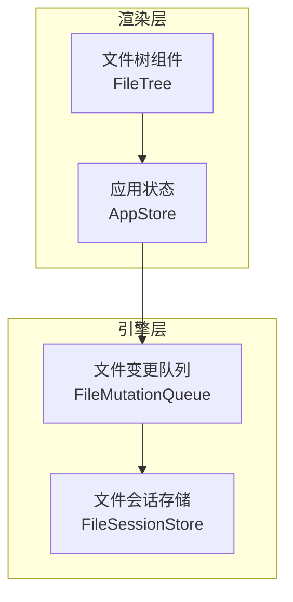
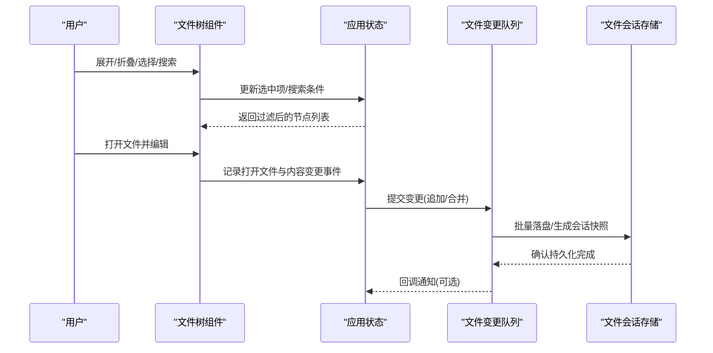
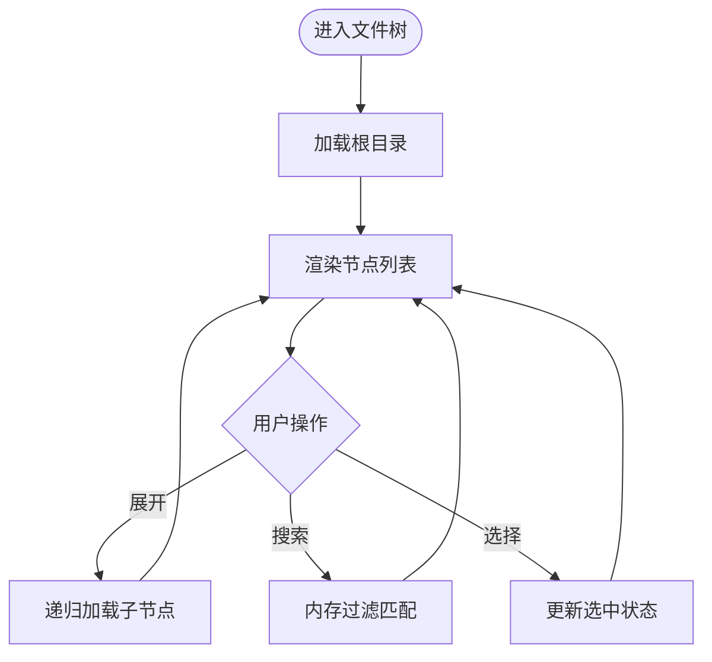
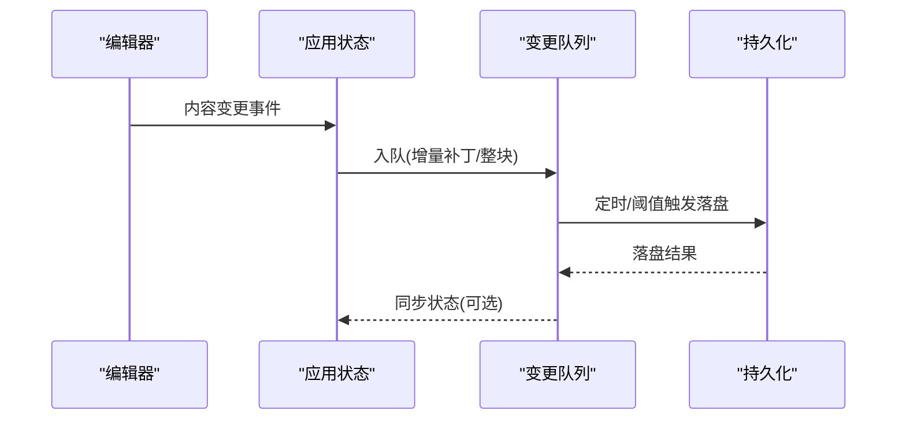
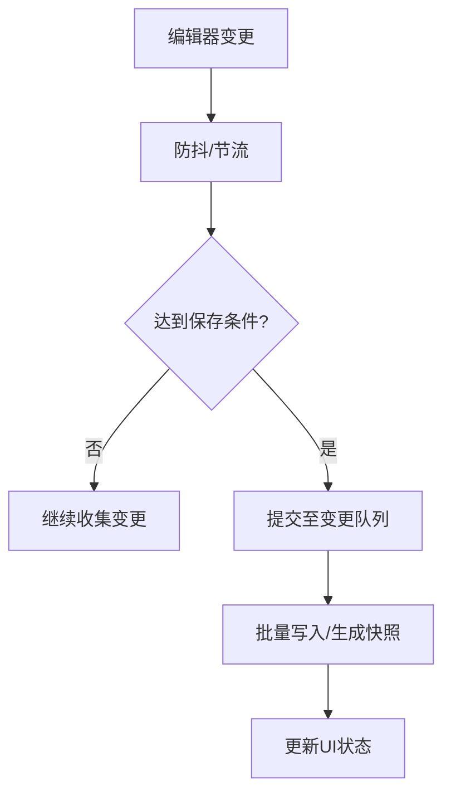
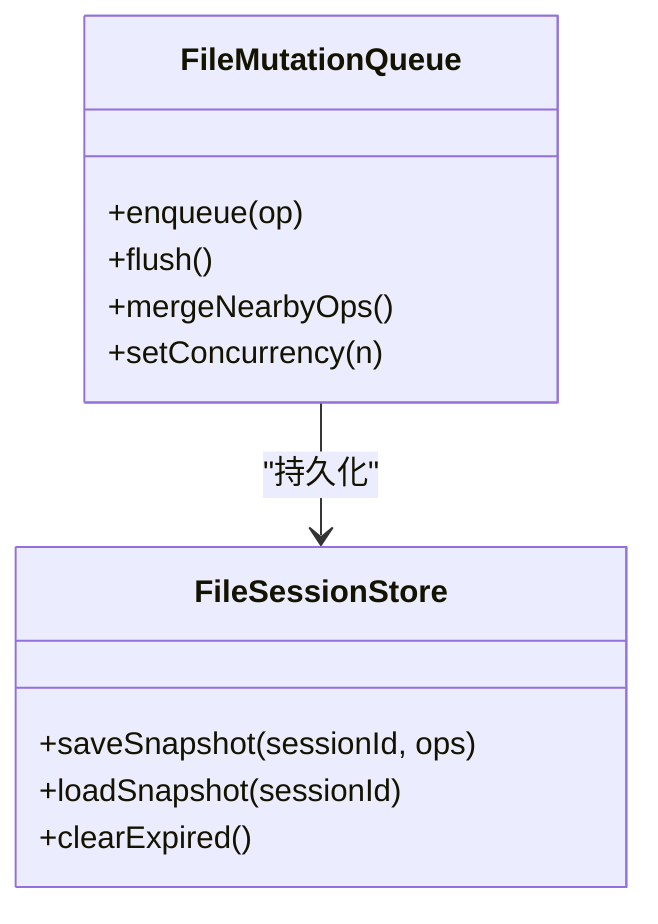

# 文件操作

<cite>
**本文引用的文件**   
- [app/renderer/src/components/FileTree/index.tsx](file://app/renderer/src/components/FileTree/index.tsx)
- [app/renderer/src/stores/app-store.ts](file://app/renderer/src/stores/app-store.ts)
- [engine/packages/infrastructure/file-mutation-queue.test.ts](file://engine/packages/infrastructure/file-mutation-queue.test.ts)
- [engine/packages/infrastructure/file-session-store.test.ts](file://engine/packages/infrastructure/file-session-store.test.ts)
- [engine/tests/file-mutation-queue.test.ts](file://engine/tests/file-mutation-queue.test.ts)
- [engine/tests/file-session-store-integration.test.ts](file://engine/tests/file-session-store-integration.test.ts)
</cite>

## 目录
1. [简介](#简介)
2. [项目结构](#项目结构)
3. [核心组件](#核心组件)
4. [架构总览](#架构总览)
5. [详细组件分析](#详细组件分析)
6. [依赖分析](#依赖分析)
7. [性能考虑](#性能考虑)
8. [故障排查指南](#故障排查指南)
9. [结论](#结论)
10. [附录](#附录)

## 简介
本指南聚焦于KCoder的文件操作能力，覆盖以下主题：
- 文件树浏览与操作：文件夹展开、文件搜索、筛选
- 文件编辑与保存：编辑、保存、撤销/重做
- 代码块能力：语法高亮、格式化、复制粘贴
- 变更监听与自动保存：变更检测、持久化策略
- 大文件与批量操作：分块加载、队列与并发控制
- 最佳实践与性能优化建议

## 项目结构
与“文件操作”相关的前端与引擎侧关键位置如下：
- 前端渲染层（Electron Renderer）
  - 文件树组件：用于展示目录结构、支持展开/折叠、选择与交互
  - 应用状态管理：集中管理当前工作区、打开文件、选中项等
- 引擎层（Engine）
  - 文件变更队列与会话存储测试用例：体现变更合并、持久化、会话恢复等机制的设计意图

图表来源
- [app/renderer/src/components/FileTree/index.tsx](file://app/renderer/src/components/FileTree/index.tsx)
- [app/renderer/src/stores/app-store.ts](file://app/renderer/src/stores/app-store.ts)
- [engine/packages/infrastructure/file-mutation-queue.test.ts](file://engine/packages/infrastructure/file-mutation-queue.test.ts)
- [engine/packages/infrastructure/file-session-store.test.ts](file://engine/packages/infrastructure/file-session-store.test.ts)

章节来源
- [app/renderer/src/components/FileTree/index.tsx](file://app/renderer/src/components/FileTree/index.tsx)
- [app/renderer/src/stores/app-store.ts](file://app/renderer/src/stores/app-store.ts)
- [engine/packages/infrastructure/file-mutation-queue.test.ts](file://engine/packages/infrastructure/file-mutation-queue.test.ts)
- [engine/packages/infrastructure/file-session-store.test.ts](file://engine/packages/infrastructure/file-session-store.test.ts)

## 核心组件
- 文件树组件
  - 职责：渲染目录树、处理节点展开/折叠、选中、右键菜单、拖拽等
  - 交互：点击展开/折叠、双击打开文件、过滤输入触发筛选
- 应用状态（AppStore）
  - 职责：维护工作区路径、已打开文件列表、当前选中文件、搜索/筛选条件
  - 作用：为文件树、编辑器、工具栏提供统一数据源
- 引擎侧文件变更队列与会话存储
  - 职责：对文件写入进行排队、去重、批处理；将变更持久化为会话快照，支持恢复

章节来源
- [app/renderer/src/components/FileTree/index.tsx](file://app/renderer/src/components/FileTree/index.tsx)
- [app/renderer/src/stores/app-store.ts](file://app/renderer/src/stores/app-store.ts)
- [engine/packages/infrastructure/file-mutation-queue.test.ts](file://engine/packages/infrastructure/file-mutation-queue.test.ts)
- [engine/packages/infrastructure/file-session-store.test.ts](file://engine/packages/infrastructure/file-session-store.test.ts)

## 架构总览
从用户操作到持久化的端到端流程如下：

图表来源
- [app/renderer/src/components/FileTree/index.tsx](file://app/renderer/src/components/FileTree/index.tsx)
- [app/renderer/src/stores/app-store.ts](file://app/renderer/src/stores/app-store.ts)
- [engine/packages/infrastructure/file-mutation-queue.test.ts](file://engine/packages/infrastructure/file-mutation-queue.test.ts)
- [engine/packages/infrastructure/file-session-store.test.ts](file://engine/packages/infrastructure/file-session-store.test.ts)

## 详细组件分析

### 文件树浏览与操作
- 文件夹展开/折叠
  - 通过递归渲染子节点，结合状态标记控制展开态
  - 首次展开时按需加载子目录，避免一次性读取大量目录
- 文件搜索与筛选
  - 基于输入关键词在内存中对文件名/路径进行匹配
  - 支持大小写不敏感、模糊匹配、按扩展名过滤
- 交互行为
  - 单击选中、双击打开、右键菜单（新建/删除/重命名/复制路径等）
  - 拖拽移动文件/文件夹（需配合后端文件系统API）

图表来源
- [app/renderer/src/components/FileTree/index.tsx](file://app/renderer/src/components/FileTree/index.tsx)

章节来源
- [app/renderer/src/components/FileTree/index.tsx](file://app/renderer/src/components/FileTree/index.tsx)

### 文件编辑、保存、撤销/重做
- 编辑
  - 编辑器组件负责文本输入、光标定位、选区操作
  - 与状态层联动，记录打开文件集合与当前活动文件
- 保存
  - 主动保存：用户触发或快捷键
  - 自动保存：基于防抖的增量保存，减少频繁IO
- 撤销/重做
  - 基于编辑器内部历史栈实现
  - 与保存时机解耦，确保撤销不影响磁盘一致性

图表来源
- [app/renderer/src/stores/app-store.ts](file://app/renderer/src/stores/app-store.ts)
- [engine/packages/infrastructure/file-mutation-queue.test.ts](file://engine/packages/infrastructure/file-mutation-queue.test.ts)

章节来源
- [app/renderer/src/stores/app-store.ts](file://app/renderer/src/stores/app-store.ts)
- [engine/packages/infrastructure/file-mutation-queue.test.ts](file://engine/packages/infrastructure/file-mutation-queue.test.ts)

### 代码块能力：语法高亮、格式化、复制粘贴
- 语法高亮
  - 根据文件扩展名选择语言模式，渲染着色
- 格式化
  - 调用内置或外部格式化工具，支持按语言配置
- 复制粘贴
  - 支持纯文本与富文本，必要时剥离无关样式

[本节为通用说明，未直接分析具体源码文件]

### 变更监听与自动保存
- 变更监听
  - 编辑器内部变更事件驱动，结合防抖/节流降低频率
- 自动保存
  - 基于时间窗口或变更次数阈值触发
  - 使用变更队列合并相邻变更，减少重复写入
- 会话恢复
  - 启动时从会话存储恢复最近编辑内容与打开状态

图表来源
- [engine/packages/infrastructure/file-mutation-queue.test.ts](file://engine/packages/infrastructure/file-mutation-queue.test.ts)
- [engine/packages/infrastructure/file-session-store.test.ts](file://engine/packages/infrastructure/file-session-store.test.ts)

章节来源
- [engine/packages/infrastructure/file-mutation-queue.test.ts](file://engine/packages/infrastructure/file-mutation-queue.test.ts)
- [engine/packages/infrastructure/file-session-store.test.ts](file://engine/packages/infrastructure/file-session-store.test.ts)

### 大文件与批量操作
- 大文件
  - 分块读取/虚拟滚动，避免一次性载入完整内容
  - 延迟加载与懒解析，仅渲染可视区域
- 批量操作
  - 使用变更队列聚合多文件写入，提升吞吐
  - 限制并发度，防止I/O风暴
  - 失败重试与幂等设计，保证最终一致性

图表来源
- [engine/packages/infrastructure/file-mutation-queue.test.ts](file://engine/packages/infrastructure/file-mutation-queue.test.ts)
- [engine/packages/infrastructure/file-session-store.test.ts](file://engine/packages/infrastructure/file-session-store.test.ts)

章节来源
- [engine/packages/infrastructure/file-mutation-queue.test.ts](file://engine/packages/infrastructure/file-mutation-queue.test.ts)
- [engine/packages/infrastructure/file-session-store.test.ts](file://engine/packages/infrastructure/file-session-store.test.ts)

## 依赖分析
- 组件耦合
  - 文件树组件依赖应用状态，状态层再与引擎变更队列交互
- 外部依赖
  - 文件系统访问由引擎层封装，渲染层不直接操作磁盘
- 潜在循环依赖
  - 通过单向数据流（组件→状态→队列→存储）避免环

图表来源
- [app/renderer/src/components/FileTree/index.tsx](file://app/renderer/src/components/FileTree/index.tsx)
- [app/renderer/src/stores/app-store.ts](file://app/renderer/src/stores/app-store.ts)
- [engine/packages/infrastructure/file-mutation-queue.test.ts](file://engine/packages/infrastructure/file-mutation-queue.test.ts)
- [engine/packages/infrastructure/file-session-store.test.ts](file://engine/packages/infrastructure/file-session-store.test.ts)

章节来源
- [app/renderer/src/components/FileTree/index.tsx](file://app/renderer/src/components/FileTree/index.tsx)
- [app/renderer/src/stores/app-store.ts](file://app/renderer/src/stores/app-store.ts)
- [engine/packages/infrastructure/file-mutation-queue.test.ts](file://engine/packages/infrastructure/file-mutation-queue.test.ts)
- [engine/packages/infrastructure/file-session-store.test.ts](file://engine/packages/infrastructure/file-session-store.test.ts)

## 性能考虑
- 文件树
  - 按需加载目录、虚拟化渲染、缓存已展开节点
- 搜索与筛选
  - 本地索引与增量匹配，避免全量扫描
- 编辑器
  - 大文件分片渲染、行级增量更新、关闭不必要的实时校验
- 保存与持久化
  - 变更合并、批量写入、限流与退避、会话快照压缩
- 资源回收
  - 关闭未使用文件的监听器、释放大对象引用

[本节为通用指导，未直接分析具体源码文件]

## 故障排查指南
- 常见问题
  - 文件树卡顿：检查是否一次性加载过多目录，启用按需加载
  - 自动保存失效：确认防抖/阈值配置与队列是否被阻塞
  - 撤销异常：核对编辑器历史栈与保存时机是否冲突
- 诊断步骤
  - 观察变更队列日志，确认入队/合并/落盘顺序
  - 验证会话快照是否可恢复，检查过期清理策略
- 参考测试用例
  - 变更队列行为与会话持久化逻辑可通过对应测试用例复现与回归

章节来源
- [engine/tests/file-mutation-queue.test.ts](file://engine/tests/file-mutation-queue.test.ts)
- [engine/tests/file-session-store-integration.test.ts](file://engine/tests/file-session-store-integration.test.ts)

## 结论
KCoder的文件操作以“渲染层组件 + 应用状态 + 引擎变更队列/会话存储”的分层架构为核心，兼顾交互流畅性与数据一致性。通过按需加载、变更合并、批量持久化与会话恢复，既满足日常开发体验，也具备处理大文件与批量操作的工程能力。遵循本文的最佳实践与性能建议，可获得更稳定高效的文件操作体验。

## 附录
- 术语
  - 变更队列：对多次文件写入进行合并与排序，降低IO压力
  - 会话快照：周期性保存的编辑状态，用于崩溃恢复与重启续编
- 相关入口
  - 文件树组件：位于渲染层组件目录
  - 应用状态：位于渲染层状态管理目录
  - 变更队列与会话存储：位于引擎基础设施层

[本节为补充信息，未直接分析具体源码文件]