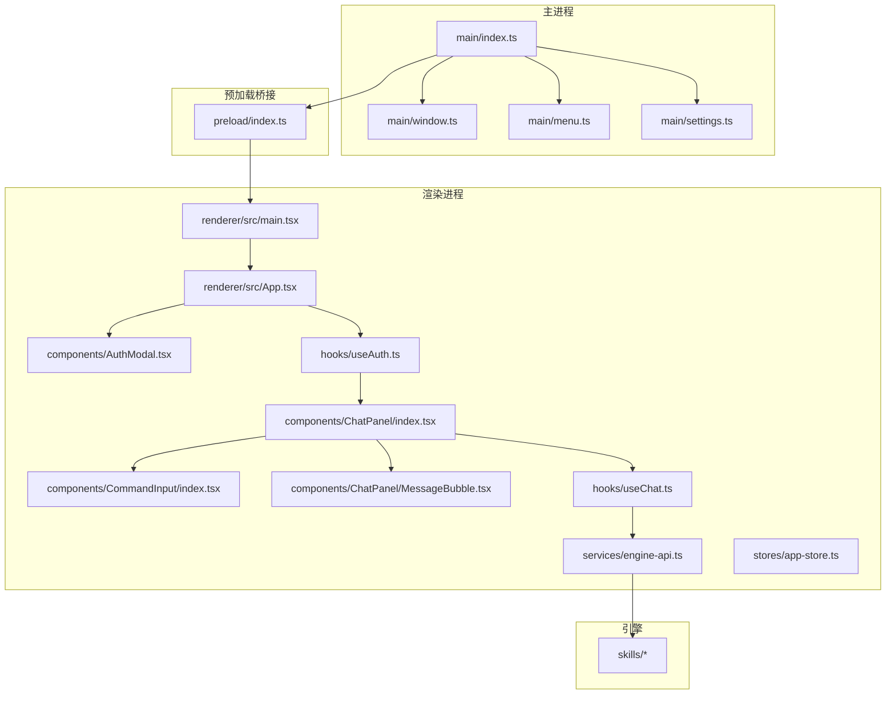
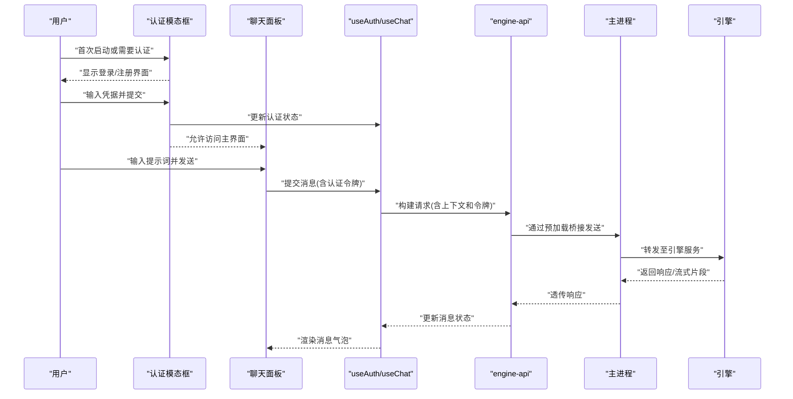
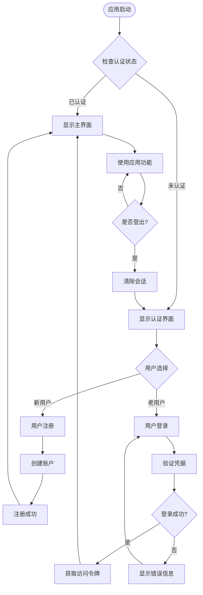
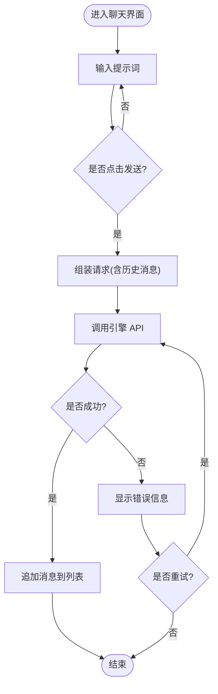
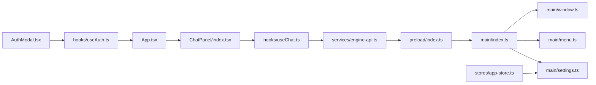

# 用户指南

<cite>
**本文引用的文件**   
- [app/main/index.ts](file://app/main/index.ts)
- [app/main/window.ts](file://app/main/window.ts)
- [app/main/menu.ts](file://app/main/menu.ts)
- [app/main/settings.ts](file://app/main/settings.ts)
- [app/preload/index.ts](file://app/preload/index.ts)
- [app/renderer/src/App.tsx](file://app/renderer/src/App.tsx)
- [app/renderer/src/main.tsx](file://app/renderer/src/main.tsx)
- [app/renderer/src/components/ChatPanel/index.tsx](file://app/renderer/src/components/ChatPanel/index.tsx)
- [app/renderer/src/components/ChatPanel/MessageBubble.tsx](file://app/renderer/src/components/ChatPanel/MessageBubble.tsx)
- [app/renderer/src/components/CommandInput/index.tsx](file://app/renderer/src/components/CommandInput/index.tsx)
- [app/renderer/src/components/AuthModal.tsx](file://app/renderer/src/components/AuthModal.tsx)
- [app/renderer/src/hooks/useAuth.ts](file://app/renderer/src/hooks/useAuth.ts)
- [app/renderer/src/hooks/useChat.ts](file://app/renderer/src/hooks/useChat.ts)
- [app/renderer/src/services/engine-api.ts](file://app/renderer/src/services/engine-api.ts)
- [app/renderer/src/stores/app-store.ts](file://app/renderer/src/stores/app-store.ts)
- [engine/skills/code-review/SKILL.md](file://engine/skills/code-review/SKILL.md)
- [engine/skills/debugging/SKILL.md](file://engine/skills/debugging/SKILL.md)
- [engine/skills/tdd/SKILL.md](file://engine/skills/tdd/SKILL.md)
- [engine/skills/planning/SKILL.md](file://engine/skills/planning/SKILL.md)
- [engine/skills/refactoring/SKILL.md](file://engine/skills/refactoring/SKILL.md)
- [engine/skills/review/SKILL.md](file://engine/skills/review/SKILL.md)
- [engine/skills/security-review/SKILL.md](file://engine/skills/security-review/SKILL.md)
- [engine/skills/web/SKILL.md](file://engine/skills/web/SKILL.md)
- [engine/skills/todo/SKILL.md](file://engine/skills/todo/SKILL.md)
- [engine/skills/git-worktrees/SKILL.md](file://engine/skills/git-worktrees/SKILL.md)
- [engine/skills/goal/SKILL.md](file://engine/skills/goal/SKILL.md)
</cite>

## 更新摘要
**所做更改**
- 新增用户认证功能章节，包括注册、登录、登出操作指南
- 添加认证状态管理说明和安全注意事项
- 更新应用启动流程以包含认证检查
- 增强安全最佳实践指导

## 目录
1. [简介](#简介)
2. [项目结构](#项目结构)
3. [核心组件](#核心组件)
4. [架构总览](#架构总览)
5. [详细组件分析](#详细组件分析)
6. [依赖关系分析](#依赖关系分析)
7. [性能与体验建议](#性能与体验建议)
8. [故障排除指南](#故障排除指南)
9. [结论](#结论)
10. [附录：快捷键与工作流](#附录快捷键与工作流)

## 简介
本指南面向使用 KCoder 的开发者，帮助你快速上手并高效完成日常开发任务。内容涵盖：
- 用户认证：新用户注册、登录、登出操作及认证状态管理
- 聊天界面：如何发起 AI 对话、输入提示词、查看响应结果
- 文件操作：浏览、编辑、保存等常用操作
- 技能系统：如何使用内置的代码审查、调试、TDD 等能力
- 设置面板：模型选择、API 密钥配置、界面定制等
- 常用工作流：智能代码生成、代码审查、调试辅助等场景步骤
- 快捷键与效率技巧
- 常见问题与排障

## 项目结构
KCoder 采用 Electron + React 的前后端分离架构：
- 主进程（Electron）负责窗口管理、菜单、设置持久化以及与引擎通信
- 渲染进程（React）提供聊天、文件树、设置面板等 UI
- 引擎（Engine）提供 AI 推理、工具执行、技能编排等能力
- 认证模块：处理用户身份验证、会话管理和安全令牌

图表来源
- [app/main/index.ts](file://app/main/index.ts)
- [app/main/window.ts](file://app/main/window.ts)
- [app/main/menu.ts](file://app/main/menu.ts)
- [app/main/settings.ts](file://app/main/settings.ts)
- [app/preload/index.ts](file://app/preload/index.ts)
- [app/renderer/src/main.tsx](file://app/renderer/src/main.tsx)
- [app/renderer/src/App.tsx](file://app/renderer/src/App.tsx)
- [app/renderer/src/components/AuthModal.tsx](file://app/renderer/src/components/AuthModal.tsx)
- [app/renderer/src/hooks/useAuth.ts](file://app/renderer/src/hooks/useAuth.ts)
- [app/renderer/src/components/ChatPanel/index.tsx](file://app/renderer/src/components/ChatPanel/index.tsx)
- [app/renderer/src/components/CommandInput/index.tsx](file://app/renderer/src/components/CommandInput/index.tsx)
- [app/renderer/src/components/ChatPanel/MessageBubble.tsx](file://app/renderer/src/components/ChatPanel/MessageBubble.tsx)
- [app/renderer/src/hooks/useChat.ts](file://app/renderer/src/hooks/useChat.ts)
- [app/renderer/src/services/engine-api.ts](file://app/renderer/src/services/engine-api.ts)
- [engine/skills/*](file://engine/skills/)

章节来源
- [app/main/index.ts](file://app/main/index.ts)
- [app/main/window.ts](file://app/main/window.ts)
- [app/main/menu.ts](file://app/main/menu.ts)
- [app/main/settings.ts](file://app/main/settings.ts)
- [app/preload/index.ts](file://app/preload/index.ts)
- [app/renderer/src/main.tsx](file://app/renderer/src/main.tsx)
- [app/renderer/src/App.tsx](file://app/renderer/src/App.tsx)
- [app/renderer/src/components/AuthModal.tsx](file://app/renderer/src/components/AuthModal.tsx)
- [app/renderer/src/hooks/useAuth.ts](file://app/renderer/src/hooks/useAuth.ts)
- [app/renderer/src/components/ChatPanel/index.tsx](file://app/renderer/src/components/ChatPanel/index.tsx)
- [app/renderer/src/components/CommandInput/index.tsx](file://app/renderer/src/components/CommandInput/index.tsx)
- [app/renderer/src/components/ChatPanel/MessageBubble.tsx](file://app/renderer/src/components/ChatPanel/MessageBubble.tsx)
- [app/renderer/src/hooks/useChat.ts](file://app/renderer/src/hooks/useChat.ts)
- [app/renderer/src/services/engine-api.ts](file://app/renderer/src/services/engine-api.ts)
- [engine/skills/*](file://engine/skills/)

## 核心组件
- 认证模态框：处理用户注册、登录、登出操作的弹窗界面
- 认证 Hook：封装认证状态管理、令牌处理和会话生命周期
- 聊天面板：承载消息列表、输入框与发送逻辑，支持多轮对话与上下文延续
- 命令输入：支持文本输入、快捷指令与附件（如选中代码片段）
- 消息气泡：展示用户与 AI 的消息，支持代码块高亮与复制
- 聊天 Hook：封装会话状态、消息追加、错误处理与重试策略
- 引擎 API：统一封装与引擎的通信协议（请求/响应、流式输出、错误码）
- 应用存储：持久化设置项（模型、密钥、主题、语言等）
- 设置面板：集中管理模型、密钥、UI 偏好与功能开关
- 主进程模块：窗口创建、菜单注册、设置读写、IPC 桥接

章节来源
- [app/renderer/src/components/AuthModal.tsx](file://app/renderer/src/components/AuthModal.tsx)
- [app/renderer/src/hooks/useAuth.ts](file://app/renderer/src/hooks/useAuth.ts)
- [app/renderer/src/components/ChatPanel/index.tsx](file://app/renderer/src/components/ChatPanel/index.tsx)
- [app/renderer/src/components/CommandInput/index.tsx](file://app/renderer/src/components/CommandInput/index.tsx)
- [app/renderer/src/components/ChatPanel/MessageBubble.tsx](file://app/renderer/src/components/ChatPanel/MessageBubble.tsx)
- [app/renderer/src/hooks/useChat.ts](file://app/renderer/src/hooks/useChat.ts)
- [app/renderer/src/services/engine-api.ts](file://app/renderer/src/services/engine-api.ts)
- [app/renderer/src/stores/app-store.ts](file://app/renderer/src/stores/app-store.ts)
- [app/main/settings.ts](file://app/main/settings.ts)
- [app/main/menu.ts](file://app/main/menu.ts)
- [app/main/window.ts](file://app/main/window.ts)

## 架构总览
下图展示了从用户交互到引擎返回结果的完整链路，包括认证检查、IPC 桥接、渲染层状态管理与引擎调用。

图表来源
- [app/renderer/src/components/AuthModal.tsx](file://app/renderer/src/components/AuthModal.tsx)
- [app/renderer/src/hooks/useAuth.ts](file://app/renderer/src/hooks/useAuth.ts)
- [app/renderer/src/components/ChatPanel/index.tsx](file://app/renderer/src/components/ChatPanel/index.tsx)
- [app/renderer/src/hooks/useChat.ts](file://app/renderer/src/hooks/useChat.ts)
- [app/renderer/src/services/engine-api.ts](file://app/renderer/src/services/engine-api.ts)
- [app/preload/index.ts](file://app/preload/index.ts)
- [app/main/index.ts](file://app/main/index.ts)

## 详细组件分析

### 用户认证（注册、登录、登出）
KCoder 现在集成了完整的用户认证系统，确保只有授权用户才能使用高级功能。

#### 新用户注册
- 首次启动应用时，如果检测到未注册用户，会自动弹出注册界面
- 填写必要的用户信息（用户名、邮箱、密码）
- 点击"注册"按钮完成账户创建
- 注册成功后自动跳转到登录界面或直接进入应用

#### 用户登录
- 对于已注册用户，启动时会显示登录界面
- 输入用户名和密码进行身份验证
- 支持记住登录状态，下次启动无需重复登录
- 登录成功后获得访问令牌，用于后续 API 调用

#### 用户登出
- 在设置面板或用户菜单中可以选择登出
- 登出会清除本地存储的认证信息和访问令牌
- 重新打开应用时需要重新登录

#### 认证状态管理
- 应用启动时自动检查认证状态
- 未认证状态下限制部分功能的使用
- 认证过期时自动提示重新登录
- 支持多设备同步认证状态

**章节来源**
- [app/renderer/src/components/AuthModal.tsx](file://app/renderer/src/components/AuthModal.tsx)
- [app/renderer/src/hooks/useAuth.ts](file://app/renderer/src/hooks/useAuth.ts)
- [app/renderer/src/App.tsx](file://app/renderer/src/App.tsx)

### 安全注意事项
为确保用户数据和访问令牌的安全，请遵循以下安全最佳实践：

#### 访问令牌管理
- 访问令牌仅在内存中存储，重启后需要重新登录
- 不要在日志或控制台输出敏感信息
- 定期更换强密码，避免使用弱口令

#### 网络安全
- 确保使用 HTTPS 连接进行认证
- 不要在不安全的网络环境中登录
- 启用双因素认证（如果支持）

#### 会话安全
- 长时间不活动会自动登出
- 不要在共享设备上保持登录状态
- 离开电脑时手动登出

#### 隐私保护
- 不要在聊天中输入敏感个人信息
- 谨慎分享项目代码中包含的机密信息
- 了解应用的权限和数据收集政策

### 聊天界面与对话流程
- 发起对话：在聊天输入框中输入提示词，点击发送或按回车键提交
- 查看响应：AI 回复以消息气泡形式呈现，支持代码块高亮与一键复制
- 多轮对话：自动维护上下文，可在后续消息中引用前文内容
- 错误处理：网络异常或引擎不可用时，会显示错误提示并提供重试入口

**章节来源**
- [app/renderer/src/components/ChatPanel/index.tsx](file://app/renderer/src/components/ChatPanel/index.tsx)
- [app/renderer/src/components/CommandInput/index.tsx](file://app/renderer/src/components/CommandInput/index.tsx)
- [app/renderer/src/components/ChatPanel/MessageBubble.tsx](file://app/renderer/src/components/ChatPanel/MessageBubble.tsx)
- [app/renderer/src/hooks/useChat.ts](file://app/renderer/src/hooks/useChat.ts)
- [app/renderer/src/services/engine-api.ts](file://app/renderer/src/services/engine-api.ts)

### 文件操作（浏览、编辑、保存）
- 文件浏览：通过侧边文件树导航项目结构，支持展开/折叠与搜索过滤
- 文件编辑：双击打开文件进行编辑，支持语法高亮与自动补全
- 保存与撤销：支持手动保存、自动保存与撤销/重做
- 批量操作：支持多选、移动、删除与同步到磁盘

说明：文件操作的具体实现位于渲染层的文件树与编辑器组件中，并通过主进程与文件系统交互。

**章节来源**
- [app/renderer/src/App.tsx](file://app/renderer/src/App.tsx)
- [app/main/window.ts](file://app/main/window.ts)
- [app/main/menu.ts](file://app/main/menu.ts)

### 技能系统（内置能力）
KCoder 内置多种可插拔技能，用于增强 AI 的能力边界。常见技能包括：
- 代码审查：对代码质量、可读性、潜在缺陷进行分析与建议
- 调试：结合日志、堆栈与上下文定位问题，给出修复思路
- TDD：围绕测试驱动开发，生成测试用例与引导迭代
- 规划与重构：帮助制定实施计划与重构方案
- 安全审查：识别常见安全风险与加固建议
- Web 相关：前端/后端 Web 开发辅助
- Todo 与目标：任务拆解与目标跟踪
- Git 工作树：分支与变更管理辅助

使用方法：
- 在聊天输入框中使用技能命令或选择对应技能卡片
- 根据提示补充必要上下文（如文件路径、错误日志、需求描述）
- 等待引擎执行并查看结果，必要时进行二次追问

**章节来源**
- [engine/skills/code-review/SKILL.md](file://engine/skills/code-review/SKILL.md)
- [engine/skills/debugging/SKILL.md](file://engine/skills/debugging/SKILL.md)
- [engine/skills/tdd/SKILL.md](file://engine/skills/tdd/SKILL.md)
- [engine/skills/planning/SKILL.md](file://engine/skills/planning/SKILL.md)
- [engine/skills/refactoring/SKILL.md](file://engine/skills/refactoring/SKILL.md)
- [engine/skills/review/SKILL.md](file://engine/skills/review/SKILL.md)
- [engine/skills/security-review/SKILL.md](file://engine/skills/security-review/SKILL.md)
- [engine/skills/web/SKILL.md](file://engine/skills/web/SKILL.md)
- [engine/skills/todo/SKILL.md](file://engine/skills/todo/SKILL.md)
- [engine/skills/git-worktrees/SKILL.md](file://engine/skills/git-worktrees/SKILL.md)
- [engine/skills/goal/SKILL.md](file://engine/skills/goal/SKILL.md)

### 设置面板（模型、密钥、界面）
- 模型选择：切换不同大模型提供商与具体模型
- API 密钥配置：为所选模型配置访问令牌或代理地址
- 界面定制：主题、字体大小、语言、消息布局等
- 高级选项：超时、重试次数、并发限制等

操作步骤：
- 打开设置面板（可通过菜单或快捷键）
- 在"模型与密钥"页签中选择模型并填写密钥
- 在"界面"页签调整外观与行为
- 保存后重启或刷新以生效

**章节来源**
- [app/renderer/src/stores/app-store.ts](file://app/renderer/src/stores/app-store.ts)
- [app/main/settings.ts](file://app/main/settings.ts)
- [app/main/menu.ts](file://app/main/menu.ts)

## 依赖关系分析
渲染层与主进程通过预加载脚本建立安全的 IPC 通道；渲染层内部由 Hook 与 Service 解耦业务逻辑与数据访问；引擎通过 HTTP 或本地服务暴露能力。认证模块独立管理用户会话和访问控制。

图表来源
- [app/renderer/src/components/AuthModal.tsx](file://app/renderer/src/components/AuthModal.tsx)
- [app/renderer/src/hooks/useAuth.ts](file://app/renderer/src/hooks/useAuth.ts)
- [app/renderer/src/App.tsx](file://app/renderer/src/App.tsx)
- [app/renderer/src/components/ChatPanel/index.tsx](file://app/renderer/src/components/ChatPanel/index.tsx)
- [app/renderer/src/hooks/useChat.ts](file://app/renderer/src/hooks/useChat.ts)
- [app/renderer/src/services/engine-api.ts](file://app/renderer/src/services/engine-api.ts)
- [app/preload/index.ts](file://app/preload/index.ts)
- [app/main/index.ts](file://app/main/index.ts)
- [app/main/window.ts](file://app/main/window.ts)
- [app/main/menu.ts](file://app/main/menu.ts)
- [app/main/settings.ts](file://app/main/settings.ts)
- [app/renderer/src/stores/app-store.ts](file://app/renderer/src/stores/app-store.ts)

章节来源
- [app/renderer/src/components/AuthModal.tsx](file://app/renderer/src/components/AuthModal.tsx)
- [app/renderer/src/hooks/useAuth.ts](file://app/renderer/src/hooks/useAuth.ts)
- [app/renderer/src/App.tsx](file://app/renderer/src/App.tsx)
- [app/renderer/src/components/ChatPanel/index.tsx](file://app/renderer/src/components/ChatPanel/index.tsx)
- [app/renderer/src/hooks/useChat.ts](file://app/renderer/src/hooks/useChat.ts)
- [app/renderer/src/services/engine-api.ts](file://app/renderer/src/services/engine-api.ts)
- [app/preload/index.ts](file://app/preload/index.ts)
- [app/main/index.ts](file://app/main/index.ts)
- [app/main/window.ts](file://app/main/window.ts)
- [app/main/menu.ts](file://app/main/menu.ts)
- [app/main/settings.ts](file://app/main/settings.ts)
- [app/renderer/src/stores/app-store.ts](file://app/renderer/src/stores/app-store.ts)

## 性能与体验建议
- 合理控制上下文长度：避免一次性注入过多历史消息，影响响应速度与成本
- 分步提问：将复杂问题拆分为多个小问题，提高准确率与可追踪性
- 利用技能：针对特定任务启用相应技能，减少无效对话轮次
- 缓存与复用：对常用提示词与模板进行收藏或复用
- 网络优化：选择合适的模型与地区节点，降低延迟
- 认证优化：合理使用记住登录功能，避免频繁认证带来的性能开销

## 故障排除指南
- 无法连接引擎
  - 检查网络与代理设置
  - 确认引擎服务已启动且端口可达
  - 查看主进程日志与渲染层错误提示
- 模型返回错误或鉴权失败
  - 核对 API 密钥是否正确
  - 检查模型配额与可用区域
  - 尝试切换备用模型
- 聊天无响应或卡顿
  - 清理过长上下文或开启压缩
  - 降低并发与重试次数
  - 重启应用或重置会话
- 文件保存失败
  - 检查权限与磁盘空间
  - 确认文件未被其他进程占用
  - 查看主进程文件操作日志
- 认证相关问题
  - 网络连接问题导致登录失败：检查网络连接和防火墙设置
  - 访问令牌过期：重新登录获取新的访问令牌
  - 会话冲突：退出所有设备后重新登录
  - 权限不足：联系管理员确认账户权限

**章节来源**
- [app/renderer/src/hooks/useChat.ts](file://app/renderer/src/hooks/useChat.ts)
- [app/renderer/src/services/engine-api.ts](file://app/renderer/src/services/engine-api.ts)
- [app/renderer/src/hooks/useAuth.ts](file://app/renderer/src/hooks/useAuth.ts)
- [app/main/settings.ts](file://app/main/settings.ts)

## 结论
通过聊天界面、文件操作与技能系统的协同，KCoder 能够显著提升日常开发与协作效率。新增的用户认证功能确保了应用的安全性和访问控制。建议在熟悉基础操作后，逐步引入技能与工作流，形成个人最佳实践，同时注意遵循安全最佳实践保护账户和项目安全。

## 附录：快捷键与工作流

### 常用快捷键（示例）
- 新建聊天：Ctrl/Cmd + N
- 发送消息：Enter
- 插入当前文件路径：Ctrl/Cmd + Shift + P
- 打开设置面板：Ctrl/Cmd + ,
- 切换主题：Ctrl/Cmd + Shift + T
- 复制代码块：Ctrl/Cmd + C（在代码块内）
- 撤销/重做：Ctrl/Cmd + Z / Ctrl/Cmd + Y
- 登出账户：Ctrl/Cmd + Shift + L

说明：以上为常见快捷键约定，实际组合键以应用内菜单为准。

**章节来源**
- [app/main/menu.ts](file://app/main/menu.ts)

### 常用工作流步骤

#### 智能代码生成
- 在聊天输入框中描述需求与约束（语言、框架、接口约定）
- 附加相关文件路径或关键片段作为上下文
- 指定使用"规划"或"目标"技能以细化步骤
- 审阅生成的代码，提出修改意见直至满意
- 将代码保存到目标文件并运行验证

**章节来源**
- [engine/skills/planning/SKILL.md](file://engine/skills/planning/SKILL.md)
- [engine/skills/goal/SKILL.md](file://engine/skills/goal/SKILL.md)
- [app/renderer/src/components/ChatPanel/index.tsx](file://app/renderer/src/components/ChatPanel/index.tsx)

#### 代码审查
- 选择需要审查的文件或目录
- 在聊天中触发"代码审查"技能，并附上差异或变更说明
- 根据建议逐项修复，必要时再次触发审查
- 记录审查要点与改进清单

**章节来源**
- [engine/skills/code-review/SKILL.md](file://engine/skills/code-review/SKILL.md)
- [engine/skills/review/SKILL.md](file://engine/skills/review/SKILL.md)

#### 调试辅助
- 粘贴错误日志、堆栈信息与相关代码片段
- 触发"调试"技能，获取根因分析与修复建议
- 逐步验证修复方案，必要时缩小范围继续排查

**章节来源**
- [engine/skills/debugging/SKILL.md](file://engine/skills/debugging/SKILL.md)

#### TDD 工作流
- 明确需求与验收标准
- 触发"TDD"技能，先生成测试用例
- 编写最小实现使测试通过
- 持续迭代，逐步完善实现与覆盖度

**章节来源**
- [engine/skills/tdd/SKILL.md](file://engine/skills/tdd/SKILL.md)