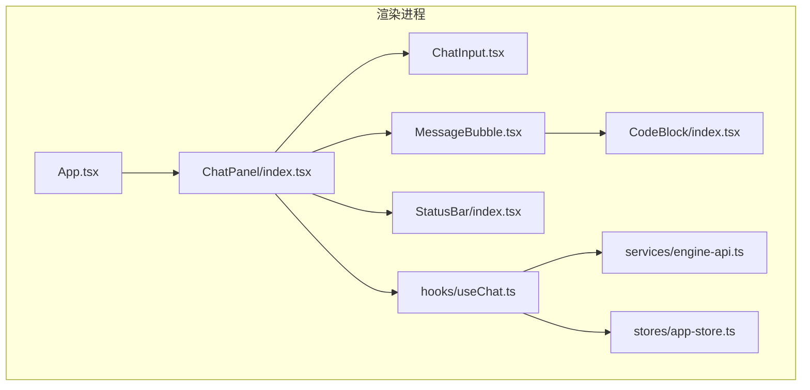
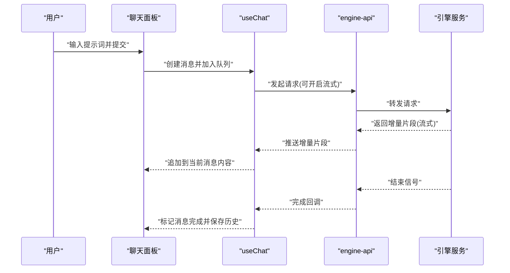
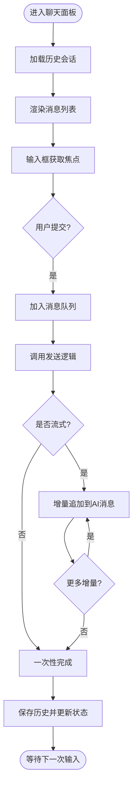
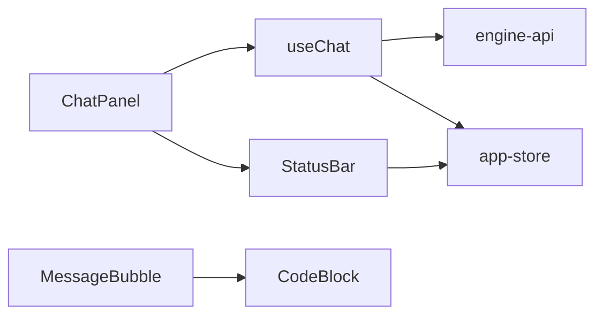

# 聊天界面使用

<cite>
**本文引用的文件**   
- [ChatPanel/index.tsx](file://app/renderer/src/components/ChatPanel/index.tsx)
- [ChatInput.tsx](file://app/renderer/src/components/ChatPanel/ChatInput.tsx)
- [MessageBubble.tsx](file://app/renderer/src/components/ChatPanel/MessageBubble.tsx)
- [CodeBlock/index.tsx](file://app/renderer/src/components/CodeBlock/index.tsx)
- [StatusBar/index.tsx](file://app/renderer/src/components/StatusBar/index.tsx)
- [useChat.ts](file://app/renderer/src/hooks/useChat.ts)
- [engine-api.ts](file://app/renderer/src/services/engine-api.ts)
- [app-store.ts](file://app/renderer/src/stores/app-store.ts)
- [App.tsx](file://app/renderer/src/App.tsx)
</cite>

## 目录
1. [简介](#简介)
2. [项目结构](#项目结构)
3. [核心组件](#核心组件)
4. [架构总览](#架构总览)
5. [详细组件分析](#详细组件分析)
6. [依赖关系分析](#依赖关系分析)
7. [性能与体验优化](#性能与体验优化)
8. [故障排查指南](#故障排查指南)
9. [结论](#结论)
10. [附录：快捷键与效率技巧](#附录快捷键与效率技巧)

## 简介
本使用文档面向KCoder的聊天界面，帮助快速上手并高效完成日常对话与代码协作。你将了解：
- 聊天界面的基本布局与功能区域（消息输入框、历史记录面板、状态栏等）
- 如何发起新对话、输入提示词的技巧、查看AI响应结果的方法
- 消息类型（文本、代码块、文件引用等）的显示与处理方式
- 流式响应的实时显示效果
- 常用对话模式与提示词工程最佳实践
- 快捷键操作与效率技巧

## 项目结构
聊天界面位于渲染进程的前端模块中，采用组件化与状态管理分离的设计。关键路径如下：
- 组件层：聊天面板、消息气泡、代码块、状态栏
- 逻辑层：聊天Hook、引擎API服务、应用状态存储
- 入口层：应用根组件装配各模块

图表来源
- [App.tsx](file://app/renderer/src/App.tsx)
- [ChatPanel/index.tsx](file://app/renderer/src/components/ChatPanel/index.tsx)
- [ChatInput.tsx](file://app/renderer/src/components/ChatPanel/ChatInput.tsx)
- [MessageBubble.tsx](file://app/renderer/src/components/ChatPanel/MessageBubble.tsx)
- [CodeBlock/index.tsx](file://app/renderer/src/components/CodeBlock/index.tsx)
- [StatusBar/index.tsx](file://app/renderer/src/components/StatusBar/index.tsx)
- [useChat.ts](file://app/renderer/src/hooks/useChat.ts)
- [engine-api.ts](file://app/renderer/src/services/engine-api.ts)
- [app-store.ts](file://app/renderer/src/stores/app-store.ts)

章节来源
- [App.tsx](file://app/renderer/src/App.tsx)
- [ChatPanel/index.tsx](file://app/renderer/src/components/ChatPanel/index.tsx)
- [ChatInput.tsx](file://app/renderer/src/components/ChatPanel/ChatInput.tsx)
- [MessageBubble.tsx](file://app/renderer/src/components/ChatPanel/MessageBubble.tsx)
- [CodeBlock/index.tsx](file://app/renderer/src/components/CodeBlock/index.tsx)
- [StatusBar/index.tsx](file://app/renderer/src/components/StatusBar/index.tsx)
- [useChat.ts](file://app/renderer/src/hooks/useChat.ts)
- [engine-api.ts](file://app/renderer/src/services/engine-api.ts)
- [app-store.ts](file://app/renderer/src/stores/app-store.ts)

## 核心组件
- 聊天面板（ChatPanel）
  - 负责整体布局：消息列表、输入区、状态栏
  - 协调消息发送、接收与渲染
- 消息输入框（ChatInput）
  - 支持多行输入、粘贴图片/文件、快捷提交
  - 提供输入校验与占位提示
- 消息气泡（MessageBubble）
  - 区分用户与AI消息样式
  - 解析并渲染不同消息类型（文本、代码块、文件引用等）
- 代码块（CodeBlock）
  - 语法高亮、复制、语言切换、折叠/展开
- 状态栏（StatusBar）
  - 展示连接状态、模型信息、错误提示、统计信息
- Hook（useChat）
  - 封装会话生命周期、消息队列、流式增量更新
- 引擎API（engine-api）
  - 统一调用后端引擎接口，处理请求/响应、错误重试
- 应用状态（app-store）
  - 全局配置、主题、会话元数据持久化

章节来源
- [ChatPanel/index.tsx](file://app/renderer/src/components/ChatPanel/index.tsx)
- [ChatInput.tsx](file://app/renderer/src/components/ChatPanel/ChatInput.tsx)
- [MessageBubble.tsx](file://app/renderer/src/components/ChatPanel/MessageBubble.tsx)
- [CodeBlock/index.tsx](file://app/renderer/src/components/CodeBlock/index.tsx)
- [StatusBar/index.tsx](file://app/renderer/src/components/StatusBar/index.tsx)
- [useChat.ts](file://app/renderer/src/hooks/useChat.ts)
- [engine-api.ts](file://app/renderer/src/services/engine-api.ts)
- [app-store.ts](file://app/renderer/src/stores/app-store.ts)

## 架构总览
聊天界面通过Hook与服务层解耦UI与业务逻辑，采用“事件驱动+流式传输”的模式实现实时交互。

图表来源
- [ChatPanel/index.tsx](file://app/renderer/src/components/ChatPanel/index.tsx)
- [useChat.ts](file://app/renderer/src/hooks/useChat.ts)
- [engine-api.ts](file://app/renderer/src/services/engine-api.ts)

## 详细组件分析

### 聊天面板（ChatPanel）
- 职责
  - 组织消息列表与输入区布局
  - 控制滚动定位、自动聚焦、空态引导
  - 集成状态栏与设置入口
- 交互流程
  - 用户提交后，将消息入队并触发发送
  - 监听流式增量，实时更新最后一条AI消息
  - 完成后写入历史并更新状态栏

图表来源
- [ChatPanel/index.tsx](file://app/renderer/src/components/ChatPanel/index.tsx)
- [useChat.ts](file://app/renderer/src/hooks/useChat.ts)

章节来源
- [ChatPanel/index.tsx](file://app/renderer/src/components/ChatPanel/index.tsx)
- [useChat.ts](file://app/renderer/src/hooks/useChat.ts)

### 消息输入框（ChatInput）
- 能力
  - 多行编辑、Tab缩进、回车提交（可选Shift+回车换行）
  - 粘贴图片/文件自动转为附件或文件引用
  - 输入长度限制与基础校验
- 行为
  - 提交前清空占位提示
  - 发送后保持焦点以便连续追问
  - 失败时保留输入内容并提示重试

章节来源
- [ChatInput.tsx](file://app/renderer/src/components/ChatPanel/ChatInput.tsx)

### 消息气泡（MessageBubble）
- 消息类型识别
  - 文本：普通段落渲染
  - 代码块：交由CodeBlock渲染，支持复制与语言标识
  - 文件引用：显示文件名、大小、打开方式
  - 工具调用/系统消息：以特殊样式呈现
- 交互
  - 长按/右键菜单（复制、插入编辑器、打开文件）
  - 错误消息高亮并提供重试按钮

章节来源
- [MessageBubble.tsx](file://app/renderer/src/components/ChatPanel/MessageBubble.tsx)
- [CodeBlock/index.tsx](file://app/renderer/src/components/CodeBlock/index.tsx)

### 代码块（CodeBlock）
- 特性
  - 语法高亮、行号、语言标签
  - 一键复制、复制到剪贴板成功反馈
  - 折叠/展开长代码
- 扩展
  - 支持在编辑器中打开对应片段
  - 根据主题切换高亮配色

章节来源
- [CodeBlock/index.tsx](file://app/renderer/src/components/CodeBlock/index.tsx)

### 状态栏（StatusBar）
- 信息展示
  - 连接状态（在线/离线/重连中）
  - 当前模型与配额信息
  - 错误提示与操作入口
- 交互
  - 点击跳转设置页
  - 错误详情弹窗与日志导出

章节来源
- [StatusBar/index.tsx](file://app/renderer/src/components/StatusBar/index.tsx)

### 聊天Hook（useChat）
- 职责
  - 维护会话上下文、消息队列、流式增量合并
  - 暴露发送、停止、重试、清空等方法
  - 与引擎API对接，处理网络异常与重试策略
- 关键点
  - 增量更新避免整段重渲染
  - 失败自动重试与退避策略
  - 历史持久化与恢复

章节来源
- [useChat.ts](file://app/renderer/src/hooks/useChat.ts)
- [engine-api.ts](file://app/renderer/src/services/engine-api.ts)
- [app-store.ts](file://app/renderer/src/stores/app-store.ts)

### 引擎API（engine-api）
- 职责
  - 统一封装请求方法、鉴权、超时与重试
  - 支持流式传输（如SSE/ReadableStream）
  - 错误分类与友好提示
- 扩展点
  - 可插拔适配器（不同后端/协议）
  - 中间件（日志、埋点、限流）

章节来源
- [engine-api.ts](file://app/renderer/src/services/engine-api.ts)

### 应用状态（app-store）
- 职责
  - 全局配置（主题、语言、默认模型）
  - 会话元数据（标题、标签、时间戳）
  - 本地缓存与同步
- 特点
  - 响应式更新，组件自动订阅变化
  - 安全持久化，敏感字段加密存储

章节来源
- [app-store.ts](file://app/renderer/src/stores/app-store.ts)

## 依赖关系分析
- 组件耦合
  - ChatPanel依赖useChat进行业务编排
  - MessageBubble依赖CodeBlock进行代码渲染
  - StatusBar读取app-store中的全局状态
- 外部依赖
  - engine-api作为唯一出站通道，屏蔽底层差异
  - 浏览器/平台能力（剪贴板、文件系统）由上层适配

图表来源
- [ChatPanel/index.tsx](file://app/renderer/src/components/ChatPanel/index.tsx)
- [MessageBubble.tsx](file://app/renderer/src/components/ChatPanel/MessageBubble.tsx)
- [CodeBlock/index.tsx](file://app/renderer/src/components/CodeBlock/index.tsx)
- [StatusBar/index.tsx](file://app/renderer/src/components/StatusBar/index.tsx)
- [useChat.ts](file://app/renderer/src/hooks/useChat.ts)
- [engine-api.ts](file://app/renderer/src/services/engine-api.ts)
- [app-store.ts](file://app/renderer/src/stores/app-store.ts)

章节来源
- [ChatPanel/index.tsx](file://app/renderer/src/components/ChatPanel/index.tsx)
- [MessageBubble.tsx](file://app/renderer/src/components/ChatPanel/MessageBubble.tsx)
- [CodeBlock/index.tsx](file://app/renderer/src/components/CodeBlock/index.tsx)
- [StatusBar/index.tsx](file://app/renderer/src/components/StatusBar/index.tsx)
- [useChat.ts](file://app/renderer/src/hooks/useChat.ts)
- [engine-api.ts](file://app/renderer/src/services/engine-api.ts)
- [app-store.ts](file://app/renderer/src/stores/app-store.ts)

## 性能与体验优化
- 流式渲染
  - 增量追加避免全量重绘，提升首字延迟体验
  - 对超长代码块启用虚拟滚动与懒加载
- 内存与渲染
  - 大消息分页加载，按需展开
  - 图片/文件预览使用缩略图与懒加载
- 网络与稳定性
  - 指数退避重试、断线重连
  - 请求去抖与节流，防止重复提交
- 可访问性
  - 键盘导航、屏幕阅读器友好
  - 对比度与字体缩放适配

[本节为通用建议，不直接分析具体文件]

## 故障排查指南
- 无法发送消息
  - 检查网络连接与引擎服务状态
  - 查看状态栏错误提示与日志
  - 尝试重启会话或切换模型
- 流式中断
  - 观察是否出现大量错误日志
  - 降低并发请求数，确认服务端限流
- 代码块无法复制
  - 检查剪贴板权限与浏览器安全策略
  - 尝试在其他页面测试复制功能
- 历史丢失
  - 确认本地存储可用性与容量
  - 导出日志并反馈问题

章节来源
- [StatusBar/index.tsx](file://app/renderer/src/components/StatusBar/index.tsx)
- [useChat.ts](file://app/renderer/src/hooks/useChat.ts)
- [engine-api.ts](file://app/renderer/src/services/engine-api.ts)

## 结论
KCoder聊天界面以清晰的组件分层与流式交互为核心，兼顾易用性与高性能。通过合理的提示词工程与快捷键技巧，可显著提升日常开发与协作效率。

[本节为总结性内容，不直接分析具体文件]

## 附录：快捷键与效率技巧

- 常用快捷键
  - 新建对话：Ctrl/Cmd + N
  - 发送消息：Enter；换行：Shift + Enter
  - 停止生成：Esc
  - 复制代码块：选中后 Ctrl/Cmd + C
  - 打开设置：Ctrl/Cmd + ,
  - 搜索历史：Ctrl/Cmd + F
- 提示词工程最佳实践
  - 明确目标与约束：角色、任务、输出格式、边界条件
  - 分步拆解复杂问题：先规划再执行，逐步细化
  - 提供上下文：相关代码片段、错误日志、期望行为
  - 指定输出格式：JSON、表格、Markdown代码块
  - 迭代优化：基于结果微调提示词，减少歧义
- 消息类型使用建议
  - 文本：用于说明、背景与指令
  - 代码块：粘贴示例或要求生成代码
  - 文件引用：附带相关文件路径或名称，便于精准定位
- 效率技巧
  - 使用模板：将常用提示词保存为模板，一键插入
  - 批量操作：一次发送多个相关片段，减少往返
  - 善用历史：按标签/关键词检索过往对话，复用思路

[本节为通用指导，不直接分析具体文件]