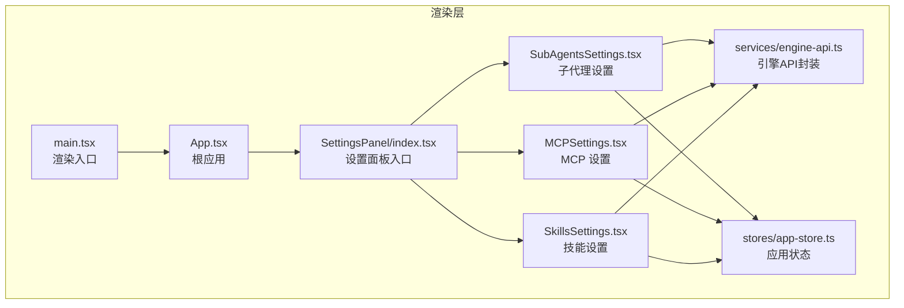
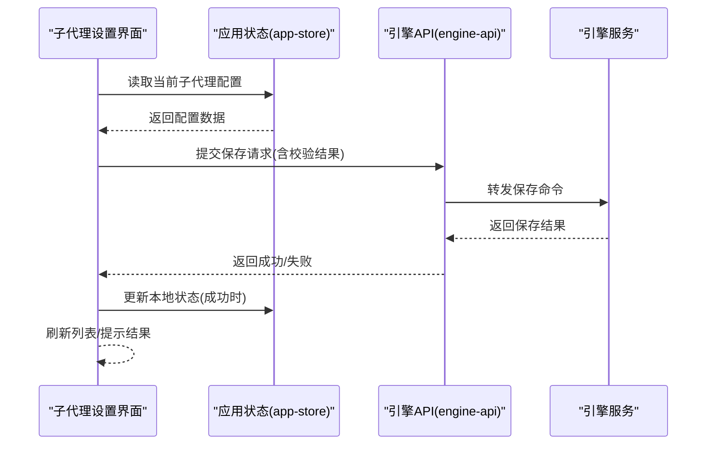
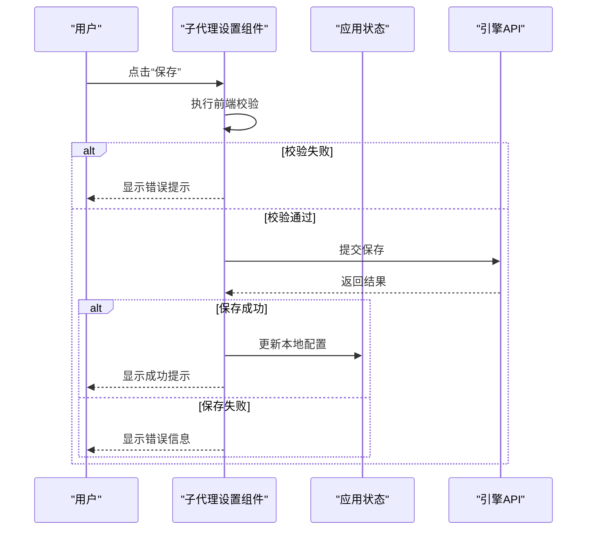
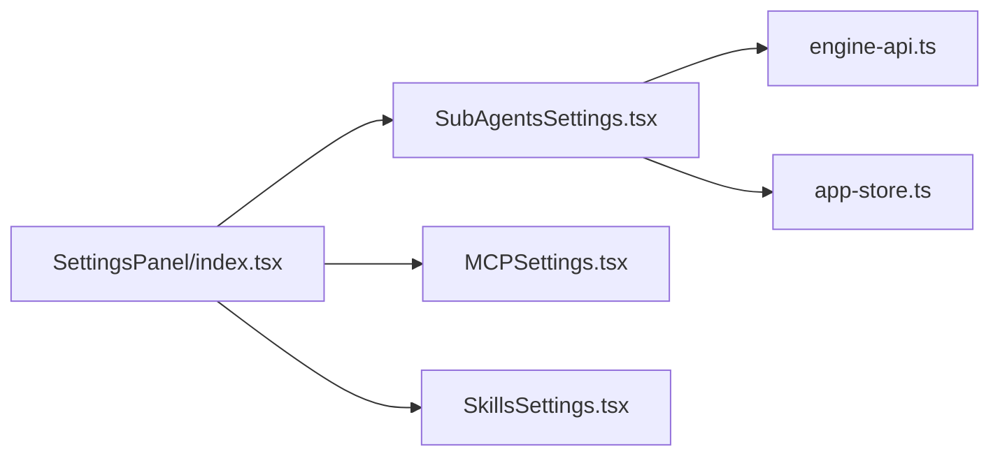

# 子代理设置界面

<cite>
**本文引用的文件**   
- [SubAgentsSettings.tsx](file://app/renderer/src/components/SettingsPanel/SubAgentsSettings.tsx)
- [index.tsx](file://app/renderer/src/components/SettingsPanel/index.tsx)
- [MCPSettings.tsx](file://app/renderer/src/components/SettingsPanel/MCPSettings.tsx)
- [SkillsSettings.tsx](file://app/renderer/src/components/SettingsPanel/SkillsSettings.tsx)
- [App.tsx](file://app/renderer/src/App.tsx)
- [main.tsx](file://app/renderer/src/main.tsx)
- [engine-api.ts](file://app/renderer/src/services/engine-api.ts)
- [app-store.ts](file://app/renderer/src/stores/app-store.ts)
</cite>

## 目录
1. [简介](#简介)
2. [项目结构](#项目结构)
3. [核心组件](#核心组件)
4. [架构总览](#架构总览)
5. [详细组件分析](#详细组件分析)
6. [依赖分析](#依赖分析)
7. [性能考虑](#性能考虑)
8. [故障排查指南](#故障排查指南)
9. [结论](#结论)
10. [附录](#附录)

## 简介
本文件聚焦于“子代理设置界面”的实现与使用，覆盖其在前端渲染层中的位置、交互流程、数据模型以及与后端引擎的集成点。文档旨在帮助开发者快速理解该界面的职责边界、关键数据结构、错误处理策略以及可优化方向，同时为后续扩展与维护提供清晰的参考路径。

## 项目结构
子代理设置界面位于渲染层的设置面板模块中，采用按功能域组织的目录结构：
- 渲染入口与根应用负责挂载页面与全局状态
- 设置面板聚合多个配置页签（包括子代理、MCP、技能等）
- 服务层封装与引擎的通信
- 状态管理集中维护用户配置与运行时状态

图表来源
- [main.tsx](file://app/renderer/src/main.tsx)
- [App.tsx](file://app/renderer/src/App.tsx)
- [index.tsx](file://app/renderer/src/components/SettingsPanel/index.tsx)
- [SubAgentsSettings.tsx](file://app/renderer/src/components/SettingsPanel/SubAgentsSettings.tsx)
- [MCPSettings.tsx](file://app/renderer/src/components/SettingsPanel/MCPSettings.tsx)
- [SkillsSettings.tsx](file://app/renderer/src/components/SettingsPanel/SkillsSettings.tsx)
- [app-store.ts](file://app/renderer/src/stores/app-store.ts)
- [engine-api.ts](file://app/renderer/src/services/engine-api.ts)

章节来源
- [main.tsx](file://app/renderer/src/main.tsx)
- [App.tsx](file://app/renderer/src/App.tsx)
- [index.tsx](file://app/renderer/src/components/SettingsPanel/index.tsx)

## 核心组件
- 子代理设置组件：负责展示与编辑子代理相关配置项，提供新增、删除、启用/禁用、排序等常见操作；在保存时调用引擎API并更新本地状态。
- 设置面板入口：作为多页签容器，路由到具体设置页（子代理、MCP、技能）。
- 引擎API封装：统一封装与引擎的通信方法，如获取/保存子代理配置、校验参数、错误映射等。
- 应用状态存储：集中管理设置数据的持久化与同步，确保UI与后端一致。

章节来源
- [SubAgentsSettings.tsx](file://app/renderer/src/components/SettingsPanel/SubAgentsSettings.tsx)
- [index.tsx](file://app/renderer/src/components/SettingsPanel/index.tsx)
- [engine-api.ts](file://app/renderer/src/services/engine-api.ts)
- [app-store.ts](file://app/renderer/src/stores/app-store.ts)

## 架构总览
子代理设置界面遵循“视图-服务-状态”的分层模式：
- 视图层：React组件负责表单渲染与交互事件
- 服务层：engine-api.ts封装HTTP或IPC调用，屏蔽底层通信细节
- 状态层：app-store.ts维护配置数据，提供读写接口与副作用处理

图表来源
- [SubAgentsSettings.tsx](file://app/renderer/src/components/SettingsPanel/SubAgentsSettings.tsx)
- [engine-api.ts](file://app/renderer/src/services/engine-api.ts)
- [app-store.ts](file://app/renderer/src/stores/app-store.ts)

## 详细组件分析

### 子代理设置组件（SubAgentsSettings）
职责与行为
- 展示子代理列表与详情表单
- 支持新增、编辑、删除、启用/禁用、排序等操作
- 对输入进行基础校验（必填、格式、唯一性等）
- 保存时调用引擎API，并在成功后同步本地状态
- 提供加载态、错误提示与操作反馈

关键数据结构（概念说明）
- 子代理条目：包含标识、名称、类型、能力开关、优先级、超时、重试策略等字段
- 批量操作：用于一次性启用/禁用或调整顺序
- 校验规则：针对关键字段的最小长度、正则匹配、枚举值约束

交互流程（序列图）

图表来源
- [SubAgentsSettings.tsx](file://app/renderer/src/components/SettingsPanel/SubAgentsSettings.tsx)
- [engine-api.ts](file://app/renderer/src/services/engine-api.ts)
- [app-store.ts](file://app/renderer/src/stores/app-store.ts)

章节来源
- [SubAgentsSettings.tsx](file://app/renderer/src/components/SettingsPanel/SubAgentsSettings.tsx)

### 设置面板入口（SettingsPanel/index.tsx）
职责与行为
- 作为多页签容器，根据当前选中页签渲染对应设置组件
- 维护页签切换状态与导航逻辑
- 向各子组件传递统一的上下文（如主题、语言、权限等）

章节来源
- [index.tsx](file://app/renderer/src/components/SettingsPanel/index.tsx)

### 引擎API封装（engine-api.ts）
职责与行为
- 封装与引擎的通信方法（如获取/保存子代理配置）
- 统一错误处理与重试策略
- 提供类型安全的请求/响应契约

章节来源
- [engine-api.ts](file://app/renderer/src/services/engine-api.ts)

### 应用状态存储（app-store.ts）
职责与行为
- 集中管理设置数据，提供读写接口
- 处理持久化与同步逻辑
- 暴露订阅机制供组件监听变化

章节来源
- [app-store.ts](file://app/renderer/src/stores/app-store.ts)

## 依赖分析
组件间依赖关系如下：
- 子代理设置组件依赖引擎API与应用状态
- 设置面板入口聚合多个设置组件
- 引擎API与服务层解耦，便于替换实现
- 应用状态被多个设置组件共享，避免重复请求

图表来源
- [SubAgentsSettings.tsx](file://app/renderer/src/components/SettingsPanel/SubAgentsSettings.tsx)
- [index.tsx](file://app/renderer/src/components/SettingsPanel/index.tsx)
- [engine-api.ts](file://app/renderer/src/services/engine-api.ts)
- [app-store.ts](file://app/renderer/src/stores/app-store.ts)

章节来源
- [SubAgentsSettings.tsx](file://app/renderer/src/components/SettingsPanel/SubAgentsSettings.tsx)
- [index.tsx](file://app/renderer/src/components/SettingsPanel/index.tsx)
- [engine-api.ts](file://app/renderer/src/services/engine-api.ts)
- [app-store.ts](file://app/renderer/src/stores/app-store.ts)

## 性能考虑
- 列表虚拟化：当子代理数量较大时，建议使用虚拟滚动减少DOM节点数量
- 增量更新：仅更新变更的子代理条目，避免全量重渲染
- 防抖保存：对频繁修改的字段采用防抖策略，降低API调用频率
- 缓存策略：对只读配置进行短期缓存，减少重复请求
- 错误重试：对网络异常实施指数退避重试，提升鲁棒性

[本节为通用指导，不直接分析具体文件]

## 故障排查指南
常见问题与定位建议
- 保存失败：检查引擎API返回的错误码与消息，确认后端服务可用性与权限
- 数据不同步：验证应用状态是否正确更新，确认订阅机制是否触发
- 表单校验不生效：检查校验规则定义与触发时机
- 列表渲染卡顿：评估是否需要虚拟化与增量更新

章节来源
- [engine-api.ts](file://app/renderer/src/services/engine-api.ts)
- [app-store.ts](file://app/renderer/src/stores/app-store.ts)
- [SubAgentsSettings.tsx](file://app/renderer/src/components/SettingsPanel/SubAgentsSettings.tsx)

## 结论
子代理设置界面以清晰的分层架构实现了配置管理与交互体验，结合引擎API与应用状态存储，保证了数据一致性与可扩展性。通过引入虚拟化、增量更新与防抖保存等优化手段，可进一步提升性能与用户体验。建议在后续迭代中完善错误分类与监控埋点，以便快速定位问题与持续改进。

[本节为总结性内容，不直接分析具体文件]

## 附录
- 相关组件路径
  - 子代理设置：[SubAgentsSettings.tsx](file://app/renderer/src/components/SettingsPanel/SubAgentsSettings.tsx)
  - 设置面板入口：[index.tsx](file://app/renderer/src/components/SettingsPanel/index.tsx)
  - 引擎API封装：[engine-api.ts](file://app/renderer/src/services/engine-api.ts)
  - 应用状态存储：[app-store.ts](file://app/renderer/src/stores/app-store.ts)