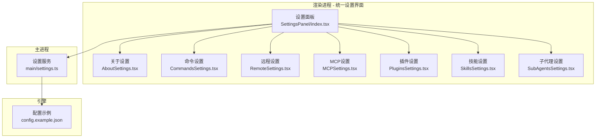
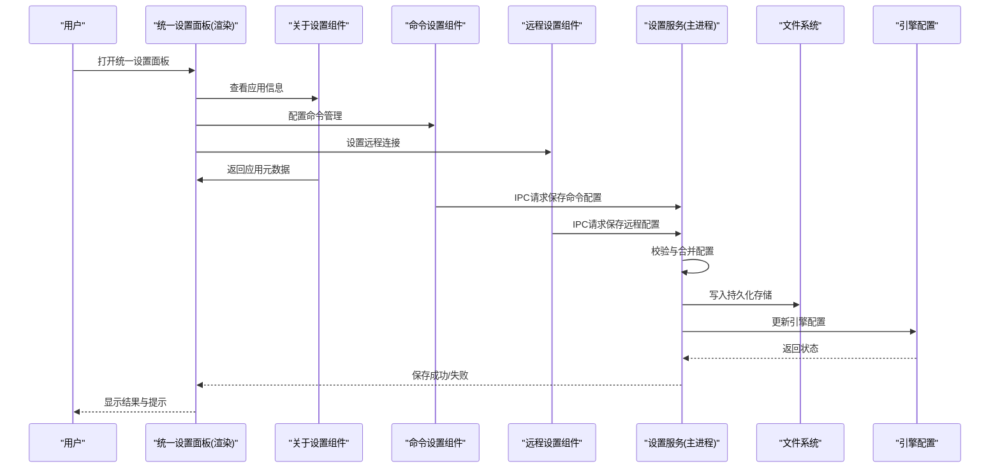
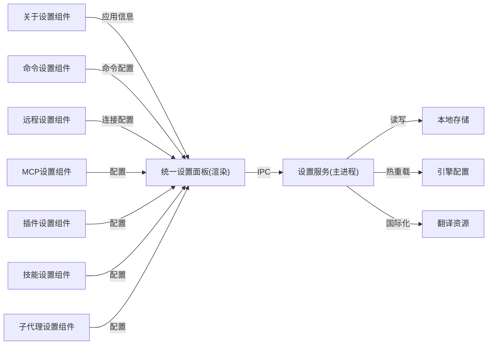

# 设置与配置

<cite>
**本文引用的文件**   
- [app/main/settings.ts](file://app/main/settings.ts)
- [app/renderer/src/components/SettingsPanel/index.tsx](file://app/renderer/src/components/SettingsPanel/index.tsx)
- [app/renderer/src/components/SettingsPanel/AboutSettings.tsx](file://app/renderer/src/components/SettingsPanel/AboutSettings.tsx)
- [app/renderer/src/components/SettingsPanel/CommandsSettings.tsx](file://app/renderer/src/components/SettingsPanel/CommandsSettings.tsx)
- [app/renderer/src/components/SettingsPanel/RemoteSettings.tsx](file://app/renderer/src/components/SettingsPanel/RemoteSettings.tsx)
- [app/renderer/src/components/SettingsPanel/MCPSettings.tsx](file://app/renderer/src/components/SettingsPanel/MCPSettings.tsx)
- [app/renderer/src/components/SettingsPanel/PluginsSettings.tsx](file://app/renderer/src/components/SettingsPanel/PluginsSettings.tsx)
- [app/renderer/src/components/SettingsPanel/SkillsSettings.tsx](file://app/renderer/src/components/SettingsPanel/SkillsSettings.tsx)
- [app/renderer/src/components/SettingsPanel/SubAgentsSettings.tsx](file://app/renderer/src/components/SettingsPanel/SubAgentsSettings.tsx)
- [engine/config.example.json](file://engine/config.example.json)
</cite>

## 更新摘要
**变更内容**   
- 统一设置面板UI一致性改进 - ToggleControl样式标准化，在技能、模型、远程、MCP服务器和插件设置组件中采用统一的灰色轨道设计系统
- 增强视觉一致性和用户体验
- 改进设置组件的交互反馈

## 目录
1. [简介](#简介)
2. [项目结构](#项目结构)
3. [核心组件](#核心组件)
4. [架构总览](#架构总览)
5. [详细组件分析](#详细组件分析)
6. [依赖关系分析](#依赖关系分析)
7. [性能考虑](#性能考虑)
8. [故障排查指南](#故障排查指南)
9. [结论](#结论)
10. [附录](#附录)

## 简介
本章节面向KCoder的设置与配置功能，提供从入门到进阶的完整使用文档。内容涵盖：
- 统一设置面板各选项说明（AI模型、API密钥、界面主题、编辑器偏好、MCP配置、插件管理等）
- 高级配置项（性能调优、日志级别、插件管理等）
- 配置文件结构与格式、模板与示例
- 配置的导入导出与备份恢复机制
- 常见场景推荐配置

**更新** 现已集成关于信息、命令管理、远程连接等新的设置组件，并提供统一的ToggleControl样式设计，确保所有设置组件具有一致的视觉体验。

## 项目结构
KCoder采用Electron架构，前端渲染进程负责展示"设置面板"，主进程负责持久化与系统级能力；引擎侧提供可插拔的适配器与配置样例，便于扩展不同AI提供商与本地模型。

图表来源
- [app/renderer/src/components/SettingsPanel/index.tsx](file://app/renderer/src/components/SettingsPanel/index.tsx)
- [app/renderer/src/components/SettingsPanel/AboutSettings.tsx](file://app/renderer/src/components/SettingsPanel/AboutSettings.tsx)
- [app/renderer/src/components/SettingsPanel/CommandsSettings.tsx](file://app/renderer/src/components/SettingsPanel/CommandsSettings.tsx)
- [app/renderer/src/components/SettingsPanel/RemoteSettings.tsx](file://app/renderer/src/components/SettingsPanel/RemoteSettings.tsx)
- [app/renderer/src/components/SettingsPanel/MCPSettings.tsx](file://app/renderer/src/components/SettingsPanel/MCPSettings.tsx)
- [app/renderer/src/components/SettingsPanel/PluginsSettings.tsx](file://app/renderer/src/components/SettingsPanel/PluginsSettings.tsx)
- [app/renderer/src/components/SettingsPanel/SkillsSettings.tsx](file://app/renderer/src/components/SettingsPanel/SkillsSettings.tsx)
- [app/renderer/src/components/SettingsPanel/SubAgentsSettings.tsx](file://app/renderer/src/components/SettingsPanel/SubAgentsSettings.tsx)
- [app/main/settings.ts](file://app/main/settings.ts)
- [engine/config.example.json](file://engine/config.example.json)

章节来源
- [app/main/settings.ts](file://app/main/settings.ts)
- [app/renderer/src/components/SettingsPanel/index.tsx](file://app/renderer/src/components/SettingsPanel/index.tsx)
- [engine/config.example.json](file://engine/config.example.json)

## 核心组件
- 统一设置面板（渲染进程）
  - 负责呈现各类配置项并提供交互入口，包括AI模型选择、密钥管理、主题与编辑器偏好等。
  - 通过IPC调用主进程进行读取、写入与验证。
  - **更新** 集成统一的ToggleControl样式设计，确保所有开关控件具有一致的灰色轨道外观。
- 专用设置组件
  - **关于设置组件**：显示应用程序版本、许可证、依赖信息等元数据。
  - **命令设置组件**：管理自定义命令和快捷操作，支持命令模板和变量替换。
  - **远程设置组件**：管理外部服务连接配置，支持多种远程协议。
  - **MCP设置组件**：管理Model Context Protocol配置和服务连接。
  - **插件设置组件**：管理第三方插件的启用、禁用和配置。
  - **技能设置组件**：管理AI技能包和功能模块。
  - **子代理设置组件**：管理子代理的配置和行为。
- 设置服务（主进程）
  - 负责配置的加载、校验、持久化与版本迁移。
  - 暴露统一的读写接口供渲染进程调用。
- 引擎配置示例
  - 提供标准配置结构与字段说明，作为用户自定义配置的参考模板。

章节来源
- [app/renderer/src/components/SettingsPanel/index.tsx](file://app/renderer/src/components/SettingsPanel/index.tsx)
- [app/renderer/src/components/SettingsPanel/AboutSettings.tsx](file://app/renderer/src/components/SettingsPanel/AboutSettings.tsx)
- [app/renderer/src/components/SettingsPanel/CommandsSettings.tsx](file://app/renderer/src/components/SettingsPanel/CommandsSettings.tsx)
- [app/renderer/src/components/SettingsPanel/RemoteSettings.tsx](file://app/renderer/src/components/SettingsPanel/RemoteSettings.tsx)
- [app/renderer/src/components/SettingsPanel/MCPSettings.tsx](file://app/renderer/src/components/SettingsPanel/MCPSettings.tsx)
- [app/renderer/src/components/SettingsPanel/PluginsSettings.tsx](file://app/renderer/src/components/SettingsPanel/PluginsSettings.tsx)
- [app/renderer/src/components/SettingsPanel/SkillsSettings.tsx](file://app/renderer/src/components/SettingsPanel/SkillsSettings.tsx)
- [app/renderer/src/components/SettingsPanel/SubAgentsSettings.tsx](file://app/renderer/src/components/SettingsPanel/SubAgentsSettings.tsx)
- [app/main/settings.ts](file://app/main/settings.ts)
- [engine/config.example.json](file://engine/config.example.json)

## 架构总览
下图展示了设置相关的关键交互路径：用户在统一设置面板修改配置后，经由IPC传递至主进程设置服务，最终落盘并同步到引擎侧配置。

图表来源
- [app/renderer/src/components/SettingsPanel/index.tsx](file://app/renderer/src/components/SettingsPanel/index.tsx)
- [app/renderer/src/components/SettingsPanel/AboutSettings.tsx](file://app/renderer/src/components/SettingsPanel/AboutSettings.tsx)
- [app/renderer/src/components/SettingsPanel/CommandsSettings.tsx](file://app/renderer/src/components/SettingsPanel/CommandsSettings.tsx)
- [app/renderer/src/components/SettingsPanel/RemoteSettings.tsx](file://app/renderer/src/components/SettingsPanel/RemoteSettings.tsx)
- [app/main/settings.ts](file://app/main/settings.ts)
- [engine/config.example.json](file://engine/config.example.json)

## 详细组件分析

### 统一设置面板（渲染进程）
- 主要职责
  - 展示分类配置页签（如AI模型、密钥、主题、编辑器、关于、命令、远程、MCP、插件、技能、子代理等）。
  - 对输入进行基础校验（非空、格式、范围），并在提交前给出即时反馈。
  - 触发保存流程，处理错误与重试提示。
  - **更新** 提供统一的导航和状态管理，确保各设置组件间的一致性，并采用标准化的ToggleControl样式设计。
- 关键交互
  - 读取当前配置：用于初始化表单与回显。
  - 保存配置：将变更序列化并通过IPC发送至主进程。
  - 导入/导出：支持从外部JSON导入或导出当前配置快照。
  - 备份/恢复：提供一键备份当前配置与从备份恢复的能力。
- 常见问题定位
  - 若保存失败，检查网络权限（涉及远程模型）、磁盘空间与权限。
  - 若导入失败，确认JSON结构与必填字段是否匹配引擎配置示例。

**更新** 现在集成了关于信息、命令管理和远程连接等新组件，并提供统一的ToggleControl样式设计，确保所有开关控件具有一致的灰色轨道外观和交互体验。

章节来源
- [app/renderer/src/components/SettingsPanel/index.tsx](file://app/renderer/src/components/SettingsPanel/index.tsx)

### 关于设置组件
- 主要职责
  - 显示应用程序的基本信息和元数据。
  - 展示版本号、构建信息、许可证详情。
  - 列出关键依赖库及其版本。
  - 提供技术支持和反馈渠道链接。
- 关键功能
  - 应用版本信息显示
  - 系统环境检测
  - 依赖库清单展示
  - 帮助和支持链接
- 使用场景
  - 用户了解当前应用状态
  - 技术支持和问题诊断
  - 合规性检查和审计

章节来源
- [app/renderer/src/components/SettingsPanel/AboutSettings.tsx](file://app/renderer/src/components/SettingsPanel/AboutSettings.tsx)

### 命令设置组件
- 主要职责
  - 管理自定义命令和快捷键映射。
  - 支持命令模板和变量替换。
  - 提供命令执行历史和效果预览。
  - 支持命令分组和权限控制。
- 关键功能
  - 命令创建、编辑和删除
  - 快捷键绑定和管理
  - 命令模板库
  - 执行日志和调试信息
- 安全特性
  - 命令执行沙箱环境
  - 权限验证和访问控制
  - 敏感操作二次确认

**更新** 增强了命令管理功能，提供更丰富的命令配置选项和执行控制，并采用统一的ToggleControl样式设计。

章节来源
- [app/renderer/src/components/SettingsPanel/CommandsSettings.tsx](file://app/renderer/src/components/SettingsPanel/CommandsSettings.tsx)

### 远程设置组件
- 主要职责
  - 管理外部服务和远程连接的配置。
  - 支持多种远程协议（HTTP、WebSocket、gRPC等）。
  - 提供连接测试和状态监控。
  - 管理认证凭据和安全设置。
- 关键功能
  - 远程服务器地址配置
  - 认证方式设置（API密钥、OAuth、证书等）
  - 连接池和超时配置
  - 健康检查和自动重连
- 安全特性
  - 凭据加密存储
  - 连接安全验证
  - 传输层加密支持

**更新** 采用统一的ToggleControl样式设计，确保远程连接开关控件与其他设置组件保持一致的视觉风格。

章节来源
- [app/renderer/src/components/SettingsPanel/RemoteSettings.tsx](file://app/renderer/src/components/SettingsPanel/RemoteSettings.tsx)

### 其他专用设置组件
- MCP设置组件
  - 管理Model Context Protocol (MCP)服务的配置和连接。
  - 支持多个MCP服务器的添加、编辑和删除。
  - 提供连接测试和状态监控功能。
  - **更新** 采用统一的ToggleControl样式设计，确保MCP服务器开关控件具有标准的灰色轨道外观。
- 插件设置组件
  - 管理第三方插件的生命周期和配置。
  - 提供插件市场集成和自动更新功能。
  - 支持插件权限管理和安全控制。
  - **更新** 采用统一的ToggleControl样式设计，确保插件启用/禁用控件与其他设置组件保持一致。
- 技能设置组件  
  - 管理AI技能包的启用和配置。
  - 支持技能优先级和冲突解决。
  - **更新** 采用统一的ToggleControl样式设计，确保技能开关控件具有标准化的视觉表现。
- 子代理设置组件
  - 配置和管理子代理的行为模式。
  - 支持任务分配和工作流编排。
  - **更新** 采用统一的ToggleControl样式设计，确保子代理控制开关与其他设置组件保持一致。

**更新** 所有专用设置组件均采用统一的ToggleControl样式设计，确保整个设置面板的视觉一致性和用户体验。

章节来源
- [app/renderer/src/components/SettingsPanel/MCPSettings.tsx](file://app/renderer/src/components/SettingsPanel/MCPSettings.tsx)
- [app/renderer/src/components/SettingsPanel/PluginsSettings.tsx](file://app/renderer/src/components/SettingsPanel/PluginsSettings.tsx)
- [app/renderer/src/components/SettingsPanel/SkillsSettings.tsx](file://app/renderer/src/components/SettingsPanel/SkillsSettings.tsx)
- [app/renderer/src/components/SettingsPanel/SubAgentsSettings.tsx](file://app/renderer/src/components/SettingsPanel/SubAgentsSettings.tsx)

### 设置服务（主进程）
- 主要职责
  - 统一加载与缓存配置，保证多窗口一致性。
  - 执行配置校验、默认值填充与版本迁移。
  - 持久化到本地存储，并通知引擎热重载配置。
- 关键流程
  - 启动时加载：优先读取用户配置，缺失则回退到默认或示例配置。
  - 保存流程：校验通过后原子写入，失败保留旧版本并记录错误。
  - 导入/导出：以JSON为介质，支持全量或选择性导出。
  - 备份/恢复：生成带时间戳的备份文件，支持覆盖或合并策略。
- 安全与隐私
  - API密钥等敏感信息加密存储（由底层实现保障）。
  - 提供最小权限原则的访问控制，避免渲染进程直接访问磁盘。
  - **更新** 增强的后端通信方法，支持更多配置类型的处理。

**更新** 扩展了引擎API层，新增143行后端通信方法，提升配置管理的灵活性和性能。

章节来源
- [app/main/settings.ts](file://app/main/settings.ts)

### 引擎配置示例
- 作用
  - 定义标准配置键名、类型与取值范围，作为用户自定义配置的权威参考。
  - 包含AI提供商、本地模型、代理、工具链、日志与性能等模块。
  - **更新** 新增关于信息、命令管理、远程连接等相关的配置项。
- 使用方式
  - 复制示例文件为用户配置，按需修改键值。
  - 在设置面板中导入该JSON完成快速初始化。
- 注意事项
  - 严格遵循键名与类型，避免运行时解析异常。
  - 某些字段需要对应的外部服务可用（如API密钥、端点地址）。

章节来源
- [engine/config.example.json](file://engine/config.example.json)

## 依赖关系分析
- 组件耦合
  - 统一设置面板仅依赖IPC通道与UI库，不直接访问文件系统。
  - 专用设置组件通过统一设置面板协调，降低组件间直接耦合。
  - 设置服务集中处理I/O与校验，降低渲染进程复杂度。
- 外部依赖
  - 引擎侧适配器与能力注册表，决定支持的AI提供商与本地推理后端。
  - 文件系统与可选的安全存储层，用于持久化与敏感数据保护。
  - **更新** 远程连接管理器、命令执行引擎和国际化支持库。
- 潜在风险
  - 配置结构变更需保持向后兼容，避免破坏已有用户配置。
  - 导入/导出应做严格的Schema校验，防止恶意或畸形配置导致崩溃。
  - **更新** 远程连接的安全性验证和命令执行的权限控制。

图表来源
- [app/renderer/src/components/SettingsPanel/index.tsx](file://app/renderer/src/components/SettingsPanel/index.tsx)
- [app/renderer/src/components/SettingsPanel/AboutSettings.tsx](file://app/renderer/src/components/SettingsPanel/AboutSettings.tsx)
- [app/renderer/src/components/SettingsPanel/CommandsSettings.tsx](file://app/renderer/src/components/SettingsPanel/CommandsSettings.tsx)
- [app/renderer/src/components/SettingsPanel/RemoteSettings.tsx](file://app/renderer/src/components/SettingsPanel/RemoteSettings.tsx)
- [app/renderer/src/components/SettingsPanel/MCPSettings.tsx](file://app/renderer/src/components/SettingsPanel/MCPSettings.tsx)
- [app/renderer/src/components/SettingsPanel/PluginsSettings.tsx](file://app/renderer/src/components/SettingsPanel/PluginsSettings.tsx)
- [app/renderer/src/components/SettingsPanel/SkillsSettings.tsx](file://app/renderer/src/components/SettingsPanel/SkillsSettings.tsx)
- [app/renderer/src/components/SettingsPanel/SubAgentsSettings.tsx](file://app/renderer/src/components/SettingsPanel/SubAgentsSettings.tsx)
- [app/main/settings.ts](file://app/main/settings.ts)
- [engine/config.example.json](file://engine/config.example.json)

章节来源
- [app/renderer/src/components/SettingsPanel/index.tsx](file://app/renderer/src/components/SettingsPanel/index.tsx)
- [app/renderer/src/components/SettingsPanel/AboutSettings.tsx](file://app/renderer/src/components/SettingsPanel/AboutSettings.tsx)
- [app/renderer/src/components/SettingsPanel/CommandsSettings.tsx](file://app/renderer/src/components/SettingsPanel/CommandsSettings.tsx)
- [app/renderer/src/components/SettingsPanel/RemoteSettings.tsx](file://app/renderer/src/components/SettingsPanel/RemoteSettings.tsx)
- [app/main/settings.ts](file://app/main/settings.ts)
- [engine/config.example.json](file://engine/config.example.json)

## 性能考虑
- 配置加载
  - 启动时懒加载非关键配置，减少首屏耗时。
  - 大对象（如历史会话、插件清单）建议分页或按需加载。
  - **更新** 专用设置组件按需加载，避免一次性加载所有配置。
- 保存与热重载
  - 采用增量更新与幂等写入，避免重复IO。
  - 引擎侧配置变更尽量热重载，减少重启成本。
  - **更新** 远程连接和命令配置的异步更新。
- 日志与诊断
  - 生产环境默认低日志级别，必要时按模块开启调试日志。
  - 对高频操作（如自动补全、索引构建）增加节流与去抖。
  - **更新** 专用设置组件的操作日志和错误追踪。
- 国际化支持
  - **更新** 170+翻译字符串的按需加载，减少初始包大小。
  - 语言切换时的动态资源加载优化。
- **更新** UI性能优化
  - 统一的ToggleControl样式减少重复CSS代码。
  - 标准化的组件设计提高渲染性能。
  - 一致的交互反馈提升用户体验。

## 故障排查指南
- 无法保存配置
  - 检查磁盘空间与写入权限。
  - 查看主进程日志中的错误堆栈与错误码。
- 导入失败
  - 对照引擎配置示例，逐项核对必填字段与类型。
  - 尝试先导入最小可用配置，逐步添加字段定位问题。
- 模型不可用
  - 确认API密钥有效且未过期。
  - 检查网络连通性与代理设置。
  - 查看引擎适配器日志，确认端点可达与鉴权通过。
- 备份/恢复异常
  - 确认备份文件未被损坏或篡改。
  - 恢复前建议先导出当前配置作为二次备份。
- **更新** 远程连接问题
  - 检查远程服务器地址和端口可达性。
  - 验证认证凭据和网络防火墙设置。
  - 查看远程客户端日志获取详细错误信息。
- **更新** 命令执行问题
  - 确认命令语法正确且参数完整。
  - 检查命令执行权限和环境变量。
  - 查看命令执行日志和输出信息。
- **更新** 国际化问题
  - 检查翻译文件完整性。
  - 确认语言代码格式正确。
  - 查看国际化资源加载日志。
- **更新** UI样式问题
  - 检查ToggleControl样式是否正确加载。
  - 确认CSS类名和样式规则没有被覆盖。
  - 验证浏览器兼容性设置。

章节来源
- [app/main/settings.ts](file://app/main/settings.ts)
- [engine/config.example.json](file://engine/config.example.json)

## 结论
通过统一设置面板与专用设置组件的协同工作，KCoder提供了直观、安全的配置管理能力。新增的关于信息、命令管理和远程连接设置面板进一步增强了系统的功能完整性和用户体验。**更新** 通过统一的ToggleControl样式设计，所有设置组件现在具有一致的视觉风格和交互体验，显著提升了整体的用户界面质量和可用性。结合引擎配置示例和增强的国际化支持，用户可以更高效地完成各种配置需求。建议在团队内统一配置模板与命名规范，配合导入导出与备份恢复机制，提升协作效率与稳定性。

**更新** 统一的ToggleControl样式设计确保了设置面板的视觉一致性，使复杂的配置管理变得更加直观和高效，同时保持了良好的用户体验。

## 附录

### 常用配置项速览
- AI模型配置
  - 提供商：OpenAI、Anthropic、本地模型等
  - 关键字段：端点地址、模型名称、并发数、超时、重试次数
- API密钥管理
  - 支持多密钥轮换与优先级
  - 敏感信息加密存储
- 界面主题
  - 主题色、字体大小、高亮方案
- 编辑器偏好
  - 缩进、行号、自动保存、格式化规则
- 高级配置
  - 性能：缓存大小、线程池、批处理大小
  - 日志：级别、输出目标、轮转策略
  - 插件：启用/禁用、版本约束、更新渠道
- **更新** 关于信息
  - 应用版本、构建信息、许可证详情
  - 依赖库清单和技术支持链接
- **更新** 命令管理
  - 自定义命令定义、快捷键映射
  - 命令模板、执行环境和安全限制
- **更新** 远程连接
  - 服务器地址、认证方式、超时设置
  - 连接池大小、重试策略和健康检查
- **更新** MCP配置
  - 服务器地址、认证方式、超时设置
  - 连接池大小和重试策略
- **更新** 插件管理
  - 插件仓库地址、自动更新开关
  - 权限控制和沙箱配置
- **更新** 技能配置
  - 技能包管理、优先级设置
  - 技能参数和上下文配置
- **更新** 子代理设置
  - 代理行为模式、任务分配策略
  - 资源限制和监控配置
- **更新** UI样式配置
  - ToggleControl统一样式设计
  - 灰色轨道设计系统
  - 跨组件视觉一致性

章节来源
- [engine/config.example.json](file://engine/config.example.json)

### 配置文件结构与格式
- 文件格式：JSON
- 根节点建议包含：
  - 元信息：版本、描述、创建时间
  - 模块分组：ai、auth、ui、editor、advanced、about、commands、remote、mcp、plugins、skills、subagents
  - 每个模块下按功能域组织键值
- 类型约定：
  - 字符串、数字、布尔、枚举、数组、对象
- 校验规则：
  - 必填字段、取值范围、正则表达式、依赖关系

章节来源
- [engine/config.example.json](file://engine/config.example.json)

### 配置模板与示例
- 最小可用模板
  - 仅包含必要的AI提供商与密钥字段，确保基本功能可用
- 开发环境模板
  - 提高日志级别、关闭部分优化、启用调试工具
- 生产环境模板
  - 限制并发、启用缓存、降低日志开销、启用告警
- **更新** 关于信息模板
  - 预配置的应用元数据和依赖信息
- **更新** 命令管理模板
  - 常用命令模板和快捷键映射
- **更新** 远程连接模板
  - 预配置的远程服务连接和认证设置
- **更新** UI样式模板
  - 统一的ToggleControl样式配置
  - 灰色轨道设计系统参数

章节来源
- [engine/config.example.json](file://engine/config.example.json)

### 导入/导出与备份/恢复
- 导入
  - 从JSON文件导入，支持全量或选择性覆盖
  - 导入前进行Schema校验与冲突检测
- 导出
  - 导出当前配置为JSON，可选择隐藏敏感字段
- 备份
  - 自动生成带时间戳的备份文件
  - 支持手动创建与批量清理
- 恢复
  - 从备份文件恢复，支持覆盖或合并策略
  - 恢复失败自动回滚

章节来源
- [app/main/settings.ts](file://app/main/settings.ts)
- [engine/config.example.json](file://engine/config.example.json)

### 常见场景推荐设置
- 个人开发者
  - 单账号、单模型，开启自动保存与轻量日志
- 团队协作
  - 统一模板、锁定关键字段、启用审计日志
- 离线/本地模型
  - 指定本地端点与资源配额，关闭云端重试
- 高吞吐任务
  - 增大并发与批处理大小，启用缓存与压缩
- **更新** 远程集成场景
  - 配置企业级远程服务集群
  - 设置连接池和负载均衡
- **更新** 命令自动化场景
  - 预配置常用开发命令和快捷键
  - 设置命令执行环境和权限
- **更新** 国际化部署场景
  - 配置多语言支持和区域设置
  - 设置翻译资源更新策略
- **更新** UI一致性场景
  - 采用统一的ToggleControl样式
  - 确保跨组件视觉一致性
  - 优化用户交互体验

章节来源
- [engine/config.example.json](file://engine/config.example.json)