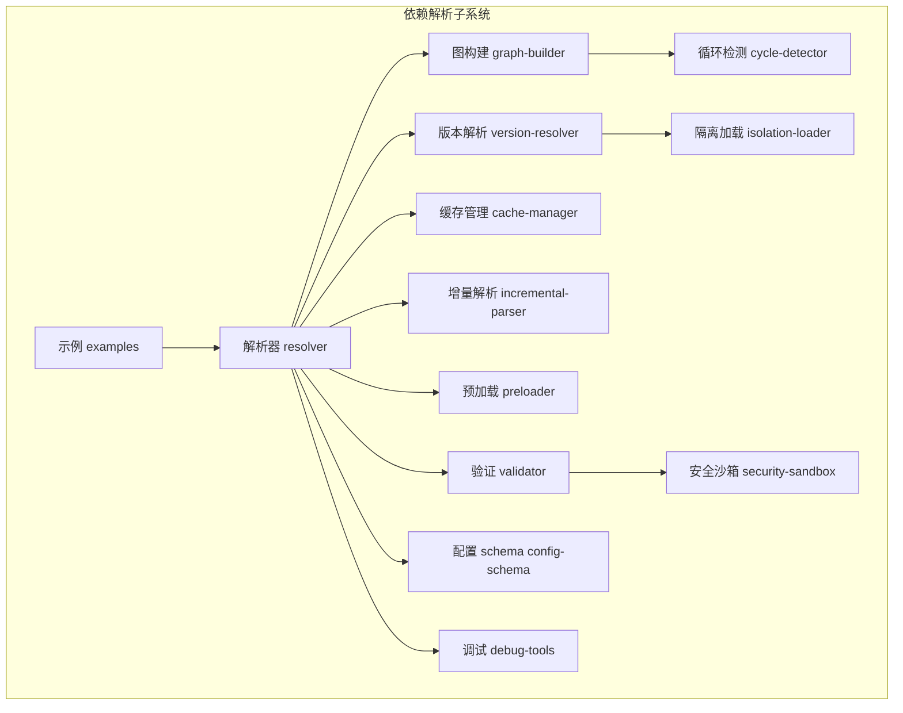
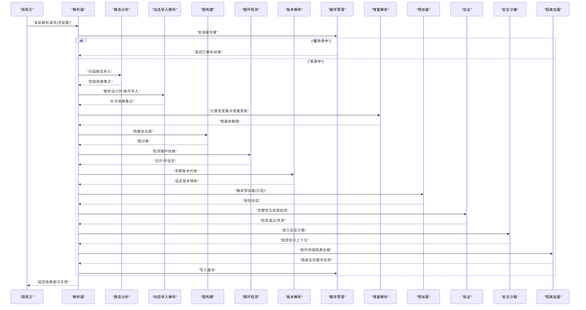
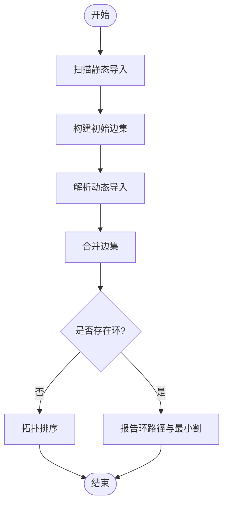
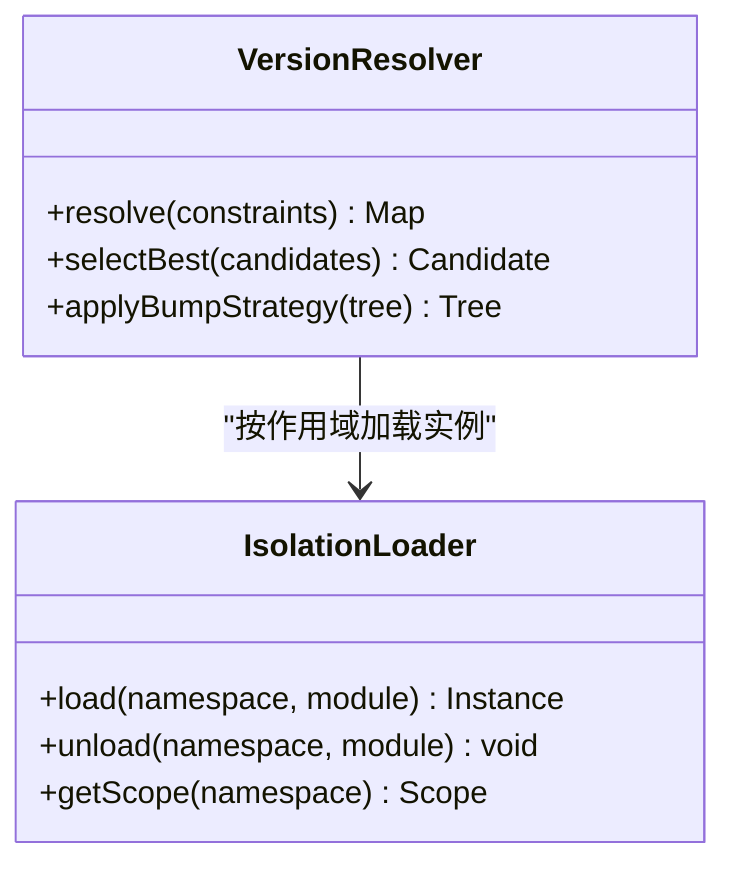
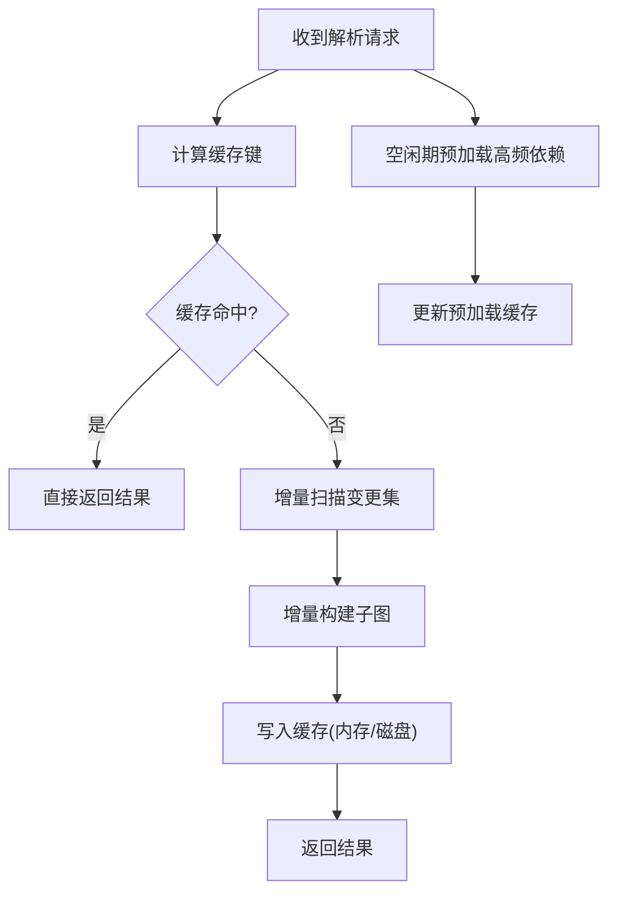
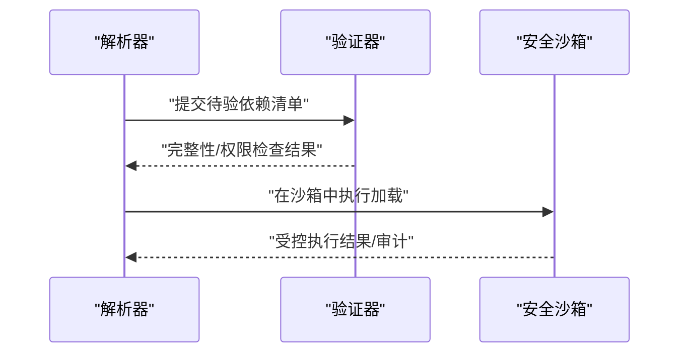
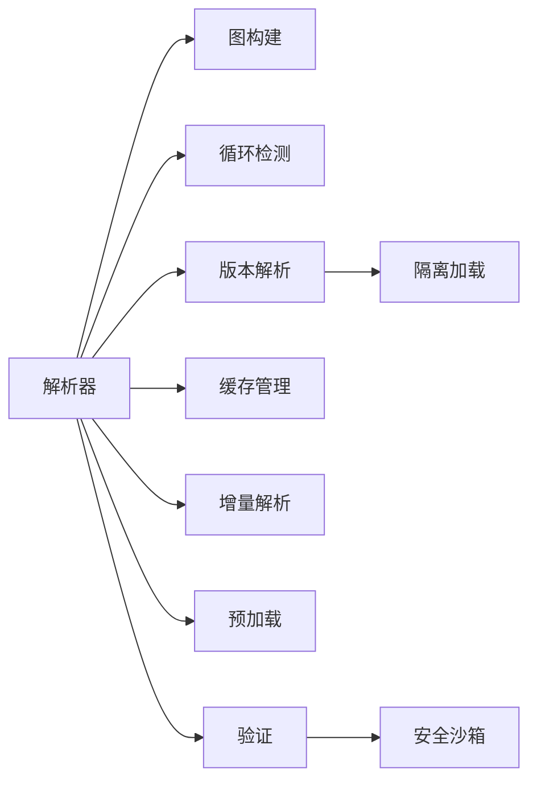

# 依赖解析系统

<cite>
**本文引用的文件**   
- [engine/packages/domain-layer/src/dependency/resolver.ts](file://engine/packages/domain-layer/src/dependency/resolver.ts)
- [engine/packages/domain-layer/src/dependency/graph-builder.ts](file://engine/packages/domain-layer/src/dependency/graph-builder.ts)
- [engine/packages/domain-layer/src/dependency/cycle-detector.ts](file://engine/packages/domain-layer/src/dependency/cycle-detector.ts)
- [engine/packages/domain-layer/src/dependency/version-resolver.ts](file://engine/packages/domain-layer/src/dependency/version-resolver.ts)
- [engine/packages/domain-layer/src/dependency/isolation-loader.ts](file://engine/packages/domain-layer/src/dependency/isolation-loader.ts)
- [engine/packages/domain-layer/src/dependency/cache-manager.ts](file://engine/packages/domain-layer/src/dependency/cache-manager.ts)
- [engine/packages/domain-layer/src/dependency/incremental-parser.ts](file://engine/packages/domain-layer/src/dependency/incremental-parser.ts)
- [engine/packages/domain-layer/src/dependency/preloader.ts](file://engine/packages/domain-layer/src/dependency/preloader.ts)
- [engine/packages/domain-layer/src/dependency/validator.ts](file://engine/packages/domain-layer/src/dependency/validator.ts)
- [engine/packages/domain-layer/src/dependency/security-sandbox.ts](file://engine/packages/domain-layer/src/dependency/security-sandbox.ts)
- [engine/packages/domain-layer/src/dependency/config-schema.ts](file://engine/packages/domain-layer/src/dependency/config-schema.ts)
- [engine/packages/domain-layer/src/dependency/examples.ts](file://engine/packages/domain-layer/src/dependency/examples.ts)
- [engine/packages/domain-layer/src/dependency/debug-tools.ts](file://engine/packages/domain-layer/src/dependency/debug-tools.ts)
</cite>

## 目录
1. [简介](#简介)
2. [项目结构](#项目结构)
3. [核心组件](#核心组件)
4. [架构总览](#架构总览)
5. [详细组件分析](#详细组件分析)
6. [依赖关系分析](#依赖关系分析)
7. [性能考量](#性能考量)
8. [故障排查指南](#故障排查指南)
9. [结论](#结论)
10. [附录](#附录)

## 简介
本文件面向KCoder的依赖解析系统，系统性阐述依赖图构建、版本冲突解决、缓存与优化、验证与安全、配置语法与最佳实践，以及开发示例与调试工具使用。文档以“渐进式复杂度”组织，既适合初次接触者快速上手，也便于高级用户深入定位问题与优化性能。

## 项目结构
依赖解析子系统位于 engine/packages/domain-layer 下的 dependency 目录中，采用分层与职责单一的设计：
- 解析与图构建：resolver、graph-builder、cycle-detector
- 版本与隔离：version-resolver、isolation-loader
- 缓存与增量：cache-manager、incremental-parser、preloader
- 验证与安全：validator、security-sandbox
- 配置与示例：config-schema、examples、debug-tools

图表来源
- [engine/packages/domain-layer/src/dependency/resolver.ts](file://engine/packages/domain-layer/src/dependency/resolver.ts)
- [engine/packages/domain-layer/src/dependency/graph-builder.ts](file://engine/packages/domain-layer/src/dependency/graph-builder.ts)
- [engine/packages/domain-layer/src/dependency/cycle-detector.ts](file://engine/packages/domain-layer/src/dependency/cycle-detector.ts)
- [engine/packages/domain-layer/src/dependency/version-resolver.ts](file://engine/packages/domain-layer/src/dependency/version-resolver.ts)
- [engine/packages/domain-layer/src/dependency/isolation-loader.ts](file://engine/packages/domain-layer/src/dependency/isolation-loader.ts)
- [engine/packages/domain-layer/src/dependency/cache-manager.ts](file://engine/packages/domain-layer/src/dependency/cache-manager.ts)
- [engine/packages/domain-layer/src/dependency/incremental-parser.ts](file://engine/packages/domain-layer/src/dependency/incremental-parser.ts)
- [engine/packages/domain-layer/src/dependency/preloader.ts](file://engine/packages/domain-layer/src/dependency/preloader.ts)
- [engine/packages/domain-layer/src/dependency/validator.ts](file://engine/packages/domain-layer/src/dependency/validator.ts)
- [engine/packages/domain-layer/src/dependency/security-sandbox.ts](file://engine/packages/domain-layer/src/dependency/security-sandbox.ts)
- [engine/packages/domain-layer/src/dependency/config-schema.ts](file://engine/packages/domain-layer/src/dependency/config-schema.ts)
- [engine/packages/domain-layer/src/dependency/examples.ts](file://engine/packages/domain-layer/src/dependency/examples.ts)
- [engine/packages/domain-layer/src/dependency/debug-tools.ts](file://engine/packages/domain-layer/src/dependency/debug-tools.ts)

章节来源
- [engine/packages/domain-layer/src/dependency/resolver.ts](file://engine/packages/domain-layer/src/dependency/resolver.ts)
- [engine/packages/domain-layer/src/dependency/graph-builder.ts](file://engine/packages/domain-layer/src/dependency/graph-builder.ts)
- [engine/packages/domain-layer/src/dependency/cycle-detector.ts](file://engine/packages/domain-layer/src/dependency/cycle-detector.ts)
- [engine/packages/domain-layer/src/dependency/version-resolver.ts](file://engine/packages/domain-layer/src/dependency/version-resolver.ts)
- [engine/packages/domain-layer/src/dependency/isolation-loader.ts](file://engine/packages/domain-layer/src/dependency/isolation-loader.ts)
- [engine/packages/domain-layer/src/dependency/cache-manager.ts](file://engine/packages/domain-layer/src/dependency/cache-manager.ts)
- [engine/packages/domain-layer/src/dependency/incremental-parser.ts](file://engine/packages/domain-layer/src/dependency/incremental-parser.ts)
- [engine/packages/domain-layer/src/dependency/preloader.ts](file://engine/packages/domain-layer/src/dependency/preloader.ts)
- [engine/packages/domain-layer/src/dependency/validator.ts](file://engine/packages/domain-layer/src/dependency/validator.ts)
- [engine/packages/domain-layer/src/dependency/security-sandbox.ts](file://engine/packages/domain-layer/src/dependency/security-sandbox.ts)
- [engine/packages/domain-layer/src/dependency/config-schema.ts](file://engine/packages/domain-layer/src/dependency/config-schema.ts)
- [engine/packages/domain-layer/src/dependency/examples.ts](file://engine/packages/domain-layer/src/dependency/examples.ts)
- [engine/packages/domain-layer/src/dependency/debug-tools.ts](file://engine/packages/domain-layer/src/dependency/debug-tools.ts)

## 核心组件
- 解析器（resolver）：协调静态分析与动态导入，驱动图构建、版本选择、缓存命中、增量更新、预加载与校验。
- 图构建（graph-builder）：将模块与依赖边抽象为有向图节点与边，支持拓扑排序与可视化导出。
- 循环检测（cycle-detector）：基于深度优先搜索的环发现算法，输出最小割集或关键路径以便修复。
- 版本解析（version-resolver）：实现语义化版本约束求解、提升策略与冲突降级回退。
- 隔离加载（isolation-loader）：按作用域/命名空间隔离模块实例，避免全局污染与版本冲突。
- 缓存管理（cache-manager）：提供多级缓存（内存/磁盘）、键生成、失效策略与一致性保证。
- 增量解析（incremental-parser）：基于变更集与时间戳的增量扫描，减少重复工作。
- 预加载（preloader）：在空闲期或启动阶段并行拉取与解析高频依赖，降低首包延迟。
- 验证（validator）：完整性校验（哈希/签名）、权限白名单、元数据合规检查。
- 安全沙箱（security-sandbox）：限制文件系统、网络、进程等危险能力，执行受限环境。
- 配置（config-schema）：声明式配置项、默认值、校验规则与错误提示。
- 示例（examples）：端到端用例与常见场景模板。
- 调试（debug-tools）：诊断日志、快照导出、热点统计与交互式探查。

章节来源
- [engine/packages/domain-layer/src/dependency/resolver.ts](file://engine/packages/domain-layer/src/dependency/resolver.ts)
- [engine/packages/domain-layer/src/dependency/graph-builder.ts](file://engine/packages/domain-layer/src/dependency/graph-builder.ts)
- [engine/packages/domain-layer/src/dependency/cycle-detector.ts](file://engine/packages/domain-layer/src/dependency/cycle-detector.ts)
- [engine/packages/domain-layer/src/dependency/version-resolver.ts](file://engine/packages/domain-layer/src/dependency/version-resolver.ts)
- [engine/packages/domain-layer/src/dependency/isolation-loader.ts](file://engine/packages/domain-layer/src/dependency/isolation-loader.ts)
- [engine/packages/domain-layer/src/dependency/cache-manager.ts](file://engine/packages/domain-layer/src/dependency/cache-manager.ts)
- [engine/packages/domain-layer/src/dependency/incremental-parser.ts](file://engine/packages/domain-layer/src/dependency/incremental-parser.ts)
- [engine/packages/domain-layer/src/dependency/preloader.ts](file://engine/packages/domain-layer/src/dependency/preloader.ts)
- [engine/packages/domain-layer/src/dependency/validator.ts](file://engine/packages/domain-layer/src/dependency/validator.ts)
- [engine/packages/domain-layer/src/dependency/security-sandbox.ts](file://engine/packages/domain-layer/src/dependency/security-sandbox.ts)
- [engine/packages/domain-layer/src/dependency/config-schema.ts](file://engine/packages/domain-layer/src/dependency/config-schema.ts)
- [engine/packages/domain-layer/src/dependency/examples.ts](file://engine/packages/domain-layer/src/dependency/examples.ts)
- [engine/packages/domain-layer/src/dependency/debug-tools.ts](file://engine/packages/domain-layer/src/dependency/debug-tools.ts)

## 架构总览
下图展示一次典型解析流程：从入口请求到最终可执行依赖图的产出，贯穿静态分析、动态导入、循环检测、版本选择、隔离加载、缓存与校验。

图表来源
- [engine/packages/domain-layer/src/dependency/resolver.ts](file://engine/packages/domain-layer/src/dependency/resolver.ts)
- [engine/packages/domain-layer/src/dependency/graph-builder.ts](file://engine/packages/domain-layer/src/dependency/graph-builder.ts)
- [engine/packages/domain-layer/src/dependency/cycle-detector.ts](file://engine/packages/domain-layer/src/dependency/cycle-detector.ts)
- [engine/packages/domain-layer/src/dependency/version-resolver.ts](file://engine/packages/domain-layer/src/dependency/version-resolver.ts)
- [engine/packages/domain-layer/src/dependency/isolation-loader.ts](file://engine/packages/domain-layer/src/dependency/isolation-loader.ts)
- [engine/packages/domain-layer/src/dependency/cache-manager.ts](file://engine/packages/domain-layer/src/dependency/cache-manager.ts)
- [engine/packages/domain-layer/src/dependency/incremental-parser.ts](file://engine/packages/domain-layer/src/dependency/incremental-parser.ts)
- [engine/packages/domain-layer/src/dependency/preloader.ts](file://engine/packages/domain-layer/src/dependency/preloader.ts)
- [engine/packages/domain-layer/src/dependency/validator.ts](file://engine/packages/domain-layer/src/dependency/validator.ts)
- [engine/packages/domain-layer/src/dependency/security-sandbox.ts](file://engine/packages/domain-layer/src/dependency/security-sandbox.ts)

## 详细组件分析

### 依赖图构建算法（静态分析 + 动态导入 + 循环检测）
- 静态分析：对源码进行词法/语法扫描，提取 import/require/条件分支中的静态依赖，建立初始边集。
- 动态导入解析：识别运行时构造的路径、环境变量注入、插件机制引入的动态边，合并入图。
- 循环检测：DFS着色+回溯栈记录，输出环路径与最小割建议；支持忽略特定边或标记为“软依赖”。

图表来源
- [engine/packages/domain-layer/src/dependency/graph-builder.ts](file://engine/packages/domain-layer/src/dependency/graph-builder.ts)
- [engine/packages/domain-layer/src/dependency/cycle-detector.ts](file://engine/packages/domain-layer/src/dependency/cycle-detector.ts)

章节来源
- [engine/packages/domain-layer/src/dependency/graph-builder.ts](file://engine/packages/domain-layer/src/dependency/graph-builder.ts)
- [engine/packages/domain-layer/src/dependency/cycle-detector.ts](file://engine/packages/domain-layer/src/dependency/cycle-detector.ts)

### 版本冲突解决策略（选择算法 + 提升策略 + 隔离加载）
- 版本选择算法：基于语义化版本约束求解，优先满足最高兼容版本，必要时回退至最近可行版本。
- 依赖提升策略：在树形结构中向上提升共享依赖，减少重复实例；对不兼容子树采用扁平化或别名隔离。
- 隔离加载机制：按命名空间/作用域隔离模块实例，避免全局状态污染；支持按需卸载与热替换。

图表来源
- [engine/packages/domain-layer/src/dependency/version-resolver.ts](file://engine/packages/domain-layer/src/dependency/version-resolver.ts)
- [engine/packages/domain-layer/src/dependency/isolation-loader.ts](file://engine/packages/domain-layer/src/dependency/isolation-loader.ts)

章节来源
- [engine/packages/domain-layer/src/dependency/version-resolver.ts](file://engine/packages/domain-layer/src/dependency/version-resolver.ts)
- [engine/packages/domain-layer/src/dependency/isolation-loader.ts](file://engine/packages/domain-layer/src/dependency/isolation-loader.ts)

### 依赖缓存与优化（缓存策略 + 增量解析 + 预加载）
- 缓存策略：多级缓存（内存LRU + 磁盘持久化），键包含源指纹、配置摘要与平台差异；支持TTL与失效事件。
- 增量解析：基于文件mtime/内容哈希与变更集，仅重算受影响子树；结合拓扑顺序批量提交。
- 预加载：在空闲期或启动阶段并行拉取高频依赖，预热图与实例，降低冷启动时延。

图表来源
- [engine/packages/domain-layer/src/dependency/cache-manager.ts](file://engine/packages/domain-layer/src/dependency/cache-manager.ts)
- [engine/packages/domain-layer/src/dependency/incremental-parser.ts](file://engine/packages/domain-layer/src/dependency/incremental-parser.ts)
- [engine/packages/domain-layer/src/dependency/preloader.ts](file://engine/packages/domain-layer/src/dependency/preloader.ts)

章节来源
- [engine/packages/domain-layer/src/dependency/cache-manager.ts](file://engine/packages/domain-layer/src/dependency/cache-manager.ts)
- [engine/packages/domain-layer/src/dependency/incremental-parser.ts](file://engine/packages/domain-layer/src/dependency/incremental-parser.ts)
- [engine/packages/domain-layer/src/dependency/preloader.ts](file://engine/packages/domain-layer/src/dependency/preloader.ts)

### 依赖验证与安全（完整性校验 + 权限验证 + 安全沙箱）
- 完整性校验：对包/文件计算哈希或校验签名，拒绝篡改或不一致产物。
- 权限验证：基于白名单与最小权限原则，校验访问范围与操作类型。
- 安全沙箱：限制文件系统、网络、进程、反射等能力，提供只读视图与审计日志。

图表来源
- [engine/packages/domain-layer/src/dependency/validator.ts](file://engine/packages/domain-layer/src/dependency/validator.ts)
- [engine/packages/domain-layer/src/dependency/security-sandbox.ts](file://engine/packages/domain-layer/src/dependency/security-sandbox.ts)

章节来源
- [engine/packages/domain-layer/src/dependency/validator.ts](file://engine/packages/domain-layer/src/dependency/validator.ts)
- [engine/packages/domain-layer/src/dependency/security-sandbox.ts](file://engine/packages/domain-layer/src/dependency/security-sandbox.ts)

### 依赖配置语法规范与最佳实践
- 配置项分类：
  - 基础：根路径、目标平台、并发度、超时、重试次数
  - 解析：是否启用动态导入、条件导入规则、别名映射
  - 版本：约束策略、提升阈值、冲突回退策略
  - 缓存：TTL、最大条目、存储后端
  - 安全：白名单、沙箱模式、审计级别
- 最佳实践：
  - 明确约束范围，避免过宽通配符
  - 合理设置并发与队列长度，避免I/O风暴
  - 开启增量与预加载，缩短冷启动
  - 严格白名单与最小权限，定期审计

章节来源
- [engine/packages/domain-layer/src/dependency/config-schema.ts](file://engine/packages/domain-layer/src/dependency/config-schema.ts)

### 开发示例与调试工具
- 示例：
  - 基本解析：单工程、多包、条件导入
  - 冲突处理：同包不同版本、提升与隔离
  - 增量与预加载：修改部分文件后快速重建
  - 安全沙箱：受限环境加载第三方模块
- 调试工具：
  - 依赖图导出：SVG/PNG/JSON
  - 热点统计：最慢节点、最长路径、重复加载
  - 交互探查：过滤、高亮环、查看版本决策

章节来源
- [engine/packages/domain-layer/src/dependency/examples.ts](file://engine/packages/domain-layer/src/dependency/examples.ts)
- [engine/packages/domain-layer/src/dependency/debug-tools.ts](file://engine/packages/domain-layer/src/dependency/debug-tools.ts)

## 依赖关系分析
下图展示各组件之间的耦合关系与主要依赖方向，帮助识别潜在循环与重构点。

图表来源
- [engine/packages/domain-layer/src/dependency/resolver.ts](file://engine/packages/domain-layer/src/dependency/resolver.ts)
- [engine/packages/domain-layer/src/dependency/graph-builder.ts](file://engine/packages/domain-layer/src/dependency/graph-builder.ts)
- [engine/packages/domain-layer/src/dependency/cycle-detector.ts](file://engine/packages/domain-layer/src/dependency/cycle-detector.ts)
- [engine/packages/domain-layer/src/dependency/version-resolver.ts](file://engine/packages/domain-layer/src/dependency/version-resolver.ts)
- [engine/packages/domain-layer/src/dependency/isolation-loader.ts](file://engine/packages/domain-layer/src/dependency/isolation-loader.ts)
- [engine/packages/domain-layer/src/dependency/cache-manager.ts](file://engine/packages/domain-layer/src/dependency/cache-manager.ts)
- [engine/packages/domain-layer/src/dependency/incremental-parser.ts](file://engine/packages/domain-layer/src/dependency/incremental-parser.ts)
- [engine/packages/domain-layer/src/dependency/preloader.ts](file://engine/packages/domain-layer/src/dependency/preloader.ts)
- [engine/packages/domain-layer/src/dependency/validator.ts](file://engine/packages/domain-layer/src/dependency/validator.ts)
- [engine/packages/domain-layer/src/dependency/security-sandbox.ts](file://engine/packages/domain-layer/src/dependency/security-sandbox.ts)

章节来源
- [engine/packages/domain-layer/src/dependency/resolver.ts](file://engine/packages/domain-layer/src/dependency/resolver.ts)
- [engine/packages/domain-layer/src/dependency/graph-builder.ts](file://engine/packages/domain-layer/src/dependency/graph-builder.ts)
- [engine/packages/domain-layer/src/dependency/cycle-detector.ts](file://engine/packages/domain-layer/src/dependency/cycle-detector.ts)
- [engine/packages/domain-layer/src/dependency/version-resolver.ts](file://engine/packages/domain-layer/src/dependency/version-resolver.ts)
- [engine/packages/domain-layer/src/dependency/isolation-loader.ts](file://engine/packages/domain-layer/src/dependency/isolation-loader.ts)
- [engine/packages/domain-layer/src/dependency/cache-manager.ts](file://engine/packages/domain-layer/src/dependency/cache-manager.ts)
- [engine/packages/domain-layer/src/dependency/incremental-parser.ts](file://engine/packages/domain-layer/src/dependency/incremental-parser.ts)
- [engine/packages/domain-layer/src/dependency/preloader.ts](file://engine/packages/domain-layer/src/dependency/preloader.ts)
- [engine/packages/domain-layer/src/dependency/validator.ts](file://engine/packages/domain-layer/src/dependency/validator.ts)
- [engine/packages/domain-layer/src/dependency/security-sandbox.ts](file://engine/packages/domain-layer/src/dependency/security-sandbox.ts)

## 性能考量
- 并发与背压：合理设置解析并发度与队列上限，避免I/O争用导致抖动。
- 缓存命中率：细化缓存键维度（源指纹、配置摘要、平台差异），提高命中概率。
- 增量范围控制：精准计算变更影响面，避免全量重算。
- 预加载时机：利用空闲期与启动前窗口，提前构建高频子图。
- 隔离粒度：仅在必要时使用强隔离，减少实例复制开销。

[本节为通用指导，无需具体文件引用]

## 故障排查指南
- 常见问题
  - 循环依赖：使用循环检测输出定位最小割集，拆分模块或引入接口层。
  - 版本冲突：查看版本决策日志，调整约束或启用提升/隔离策略。
  - 缓存不一致：清理过期缓存键，核对源指纹与配置摘要。
  - 安全拦截：检查白名单与沙箱策略，确认必要权限。
- 调试步骤
  - 启用详细日志与审计，导出依赖图与决策轨迹。
  - 使用增量模式复现问题，缩小影响范围。
  - 在沙箱中回放执行，捕获异常堆栈与资源访问。

章节来源
- [engine/packages/domain-layer/src/dependency/debug-tools.ts](file://engine/packages/domain-layer/src/dependency/debug-tools.ts)
- [engine/packages/domain-layer/src/dependency/validator.ts](file://engine/packages/domain-layer/src/dependency/validator.ts)
- [engine/packages/domain-layer/src/dependency/security-sandbox.ts](file://engine/packages/domain-layer/src/dependency/security-sandbox.ts)

## 结论
KCoder依赖解析系统通过静态与动态分析构建完整依赖图，结合严格的循环检测、稳健的版本冲突解决与隔离加载，辅以多级缓存、增量解析与预加载，显著提升了构建效率与稳定性。配合完善的验证与安全沙箱，确保依赖的可信与可控。遵循配置规范与最佳实践，可在复杂工程中保持高性能与高可靠性。

[本节为总结性内容，无需具体文件引用]

## 附录
- 术语表
  - 依赖图：由模块节点与依赖边构成的有向图
  - 最小割集：打破所有环所需移除的最小边集合
  - 提升策略：将共享依赖提升到更高层以减少重复
  - 隔离加载：按作用域隔离模块实例，避免冲突
- 参考路径
  - 示例与调试：参见示例与调试工具文件路径
  - 配置规范：参见配置schema文件路径

[本节为补充说明，无需具体文件引用]