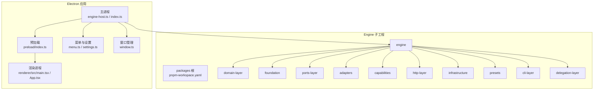
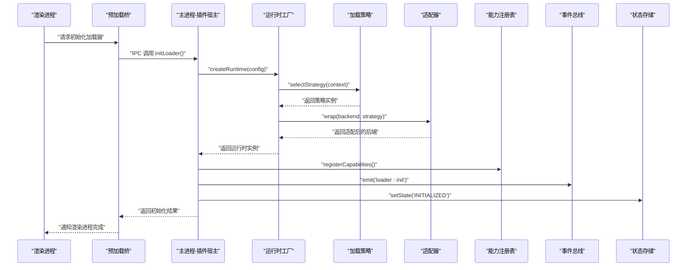
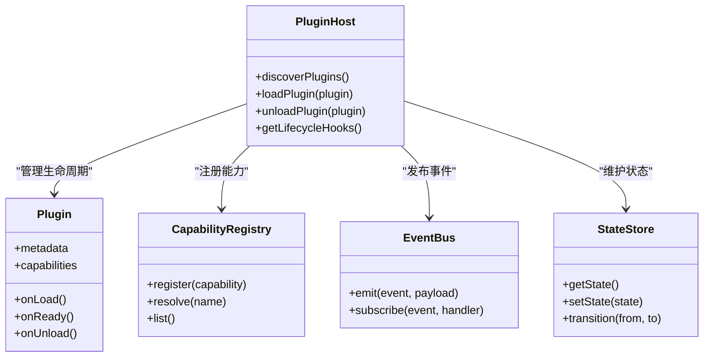
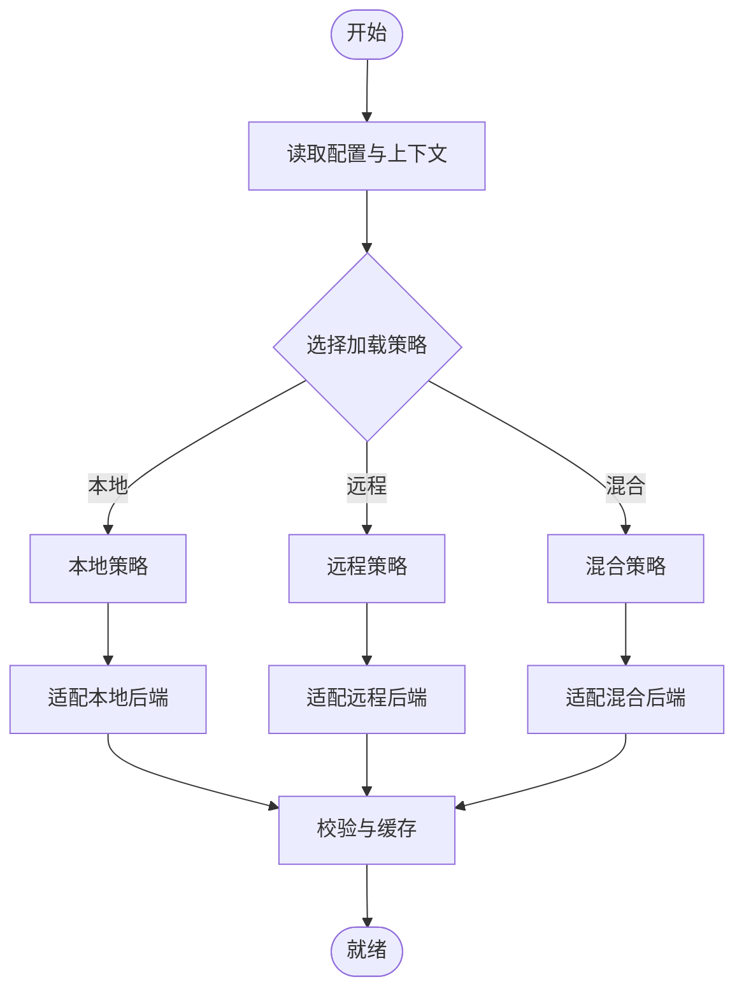
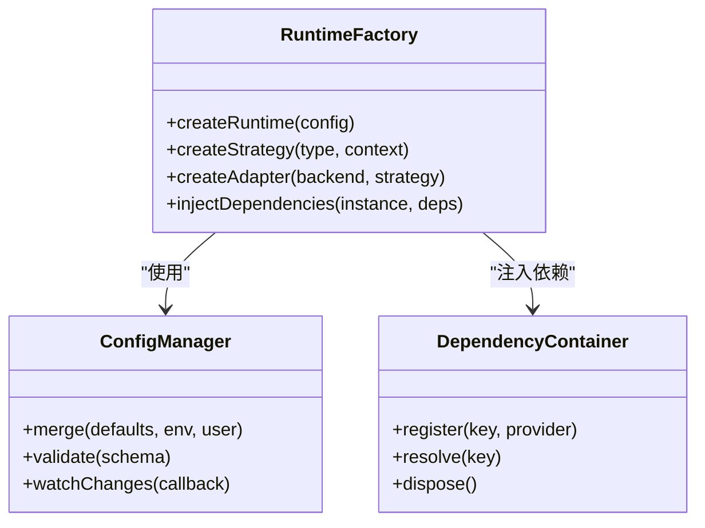
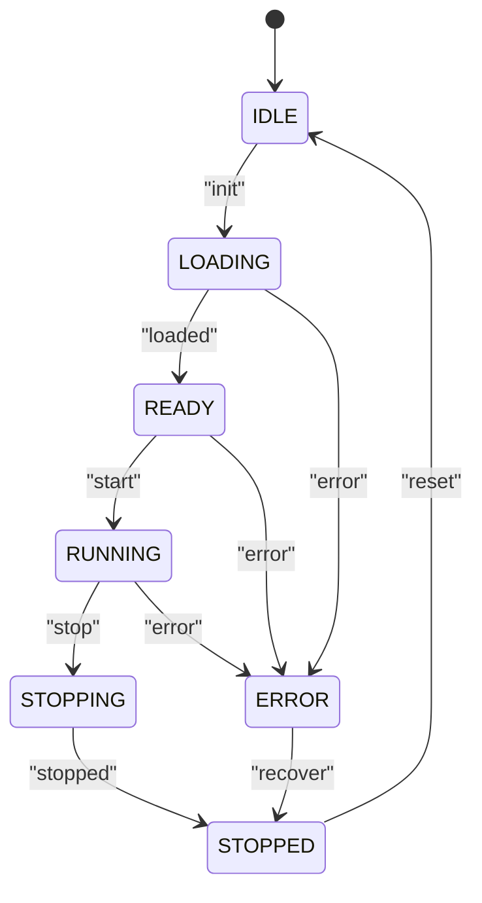
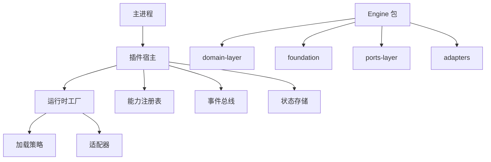

# 加载器架构设计

<cite>
**本文引用的文件**   
- [engine-host.ts](file://app/main/engine-host.ts)
- [index.ts](file://app/main/index.ts)
- [menu.ts](file://app/main/menu.ts)
- [settings.ts](file://app/main/settings.ts)
- [window.ts](file://app/main/window.ts)
- [index.ts](file://app/preload/index.ts)
- [App.tsx](file://app/renderer/src/App.tsx)
- [main.tsx](file://app/renderer/src/main.tsx)
- [package.json](file://app/package.json)
- [electron.vite.config.ts](file://app/electron.vite.config.ts)
- [README.md](file://engine/README.md)
- [package.json](file://engine/package.json)
- [pnpm-workspace.yaml](file://engine/pnpm-workspace.yaml)
- [tsconfig.json](file://engine/tsconfig.json)
- [build.mjs](file://engine/scripts/build.mjs)
- [migrate-packages.mjs](file://engine/scripts/migrate-packages.mjs)
- [scaffold-packages.mjs](file://engine/scripts/scaffold-packages.mjs)
- [verify-core-sync.mjs](file://engine/scripts/verify-core-sync.mjs)
- [verify-evented-a2a.mjs](file://engine/scripts/verify-evented-a2a.mjs)
- [verify-sqlite.mjs](file://engine/scripts/verify-sqlite.mjs)
- [plugin-host.test.ts](file://engine/tests/plugin-host.test.ts)
- [runtime-factory.test.ts](file://engine/tests/runtime-factory.test.ts)
- [kernel-v3-node-handlers.test.ts](file://engine/tests/kernel-v3-node-handlers.test.ts)
- [skill-runtime.test.ts](file://engine/tests/skill-runtime.test.ts)
- [tool-runtime-v3.test.ts](file://engine/tests/tool-runtime-v3.test.ts)
- [delegation-runtime.test.ts](file://engine/tests/delegation-runtime.test.ts)
- [http-server.test.ts](file://engine/tests/http-server.test.ts)
- [capability-registry.test.ts](file://engine/tests/capability-registry.test.ts)
- [turn-event-bus.test.ts](file://engine/tests/turn-event-bus.test.ts)
- [run-state-store.test.ts](file://engine/tests/run-state-store.test.ts)
- [task-state-store.test.ts](file://engine/tests/task-state-store.test.ts)
- [execution-graph.test.ts](file://engine/tests/execution-graph.test.ts)
</cite>

## 目录
1. [简介](#简介)
2. [项目结构](#项目结构)
3. [核心组件](#核心组件)
4. [架构总览](#架构总览)
5. [详细组件分析](#详细组件分析)
6. [依赖分析](#依赖分析)
7. [性能考虑](#性能考虑)
8. [故障排查指南](#故障排查指南)
9. [结论](#结论)
10. [附录](#附录)

## 简介
本技术文档围绕KCoder的“加载器架构”展开，聚焦于插件化、策略模式、适配器模式与工厂模式的综合应用，以及加载器的状态管理、事件驱动与异步加载机制。文档面向希望扩展或自定义加载器的开发者，提供从整体架构到具体实现细节的系统性说明，并给出架构图与交互流程图，帮助读者快速理解并上手二次开发。

## 项目结构
KCoder采用Electron多进程架构（主进程、预加载、渲染进程）与Engine子工程（monorepo）协同工作。加载器相关能力主要分布在：
- 主进程侧：负责引擎宿主、窗口与菜单初始化、设置管理与插件生命周期协调
- 预加载层：桥接主进程与渲染进程的安全API
- 渲染进程：UI与业务交互入口
- Engine子工程：以packages形式组织领域层、基础设施、HTTP层、端口层、适配器、能力注册表、运行时与工具链等

图表来源
- [engine-host.ts:1-200](file://app/main/engine-host.ts#L1-L200)
- [index.ts](file://app/main/index.ts)
- [menu.ts](file://app/main/menu.ts)
- [settings.ts](file://app/main/settings.ts)
- [window.ts](file://app/main/window.ts)
- [index.ts](file://app/preload/index.ts)
- [main.tsx](file://app/renderer/src/main.tsx)
- [App.tsx](file://app/renderer/src/App.tsx)
- [pnpm-workspace.yaml](file://engine/pnpm-workspace.yaml)

章节来源
- [engine-host.ts:1-200](file://app/main/engine-host.ts#L1-L200)
- [index.ts](file://app/main/index.ts)
- [menu.ts](file://app/main/menu.ts)
- [settings.ts](file://app/main/settings.ts)
- [window.ts](file://app/main/window.ts)
- [index.ts](file://app/preload/index.ts)
- [main.tsx](file://app/renderer/src/main.tsx)
- [App.tsx](file://app/renderer/src/App.tsx)
- [pnpm-workspace.yaml](file://engine/pnpm-workspace.yaml)

## 核心组件
- 插件宿主与生命周期管理：在主进程中启动并协调Engine运行期，暴露插件发现、加载、启停与销毁钩子
- 策略选择与适配器：通过配置与运行时上下文动态选择加载策略，并使用适配器屏蔽不同后端差异
- 工厂与依赖注入：集中创建运行时实例，统一装配依赖项与配置
- 状态机与事件总线：维护加载器状态转换，基于事件驱动处理异步任务与跨进程通信
- 可插拔能力注册表：在Engine内部注册能力、工具与技能，供上层按需启用

章节来源
- [engine-host.ts:1-200](file://app/main/engine-host.ts#L1-L200)
- [plugin-host.test.ts](file://engine/tests/plugin-host.test.ts)
- [runtime-factory.test.ts](file://engine/tests/runtime-factory.test.ts)
- [capability-registry.test.ts](file://engine/tests/capability-registry.test.ts)
- [turn-event-bus.test.ts](file://engine/tests/turn-event-bus.test.ts)

## 架构总览
下图展示加载器在Electron与Engine之间的职责边界与交互路径，包括插件发现、策略选择、适配器适配、工厂创建、状态管理与事件分发。

图表来源
- [engine-host.ts:1-200](file://app/main/engine-host.ts#L1-L200)
- [runtime-factory.test.ts](file://engine/tests/runtime-factory.test.ts)
- [capability-registry.test.ts](file://engine/tests/capability-registry.test.ts)
- [turn-event-bus.test.ts](file://engine/tests/turn-event-bus.test.ts)
- [run-state-store.test.ts](file://engine/tests/run-state-store.test.ts)

## 详细组件分析

### 插件接口与生命周期
- 插件接口定义：约定插件元数据、能力声明、生命周期钩子（如onLoad、onReady、onUnload）
- 生命周期管理：宿主按顺序执行发现、解析、校验、加载、就绪、运行、卸载阶段；支持错误恢复与重试
- 扩展点设计：通过能力注册表暴露扩展点，允许插件注册工具、命令、视图与中间件

图表来源
- [plugin-host.test.ts](file://engine/tests/plugin-host.test.ts)
- [capability-registry.test.ts](file://engine/tests/capability-registry.test.ts)
- [turn-event-bus.test.ts](file://engine/tests/turn-event-bus.test.ts)
- [run-state-store.test.ts](file://engine/tests/run-state-store.test.ts)

章节来源
- [plugin-host.test.ts](file://engine/tests/plugin-host.test.ts)
- [capability-registry.test.ts](file://engine/tests/capability-registry.test.ts)
- [turn-event-bus.test.ts](file://engine/tests/turn-event-bus.test.ts)
- [run-state-store.test.ts](file://engine/tests/run-state-store.test.ts)

### 策略模式与适配器模式
- 加载策略选择：根据配置与环境（本地/远程、协议类型、模型提供方）选择对应加载策略
- 适配器应用：将不同后端（文件系统、网络、数据库）抽象为统一接口，屏蔽差异
- 可插拔组件：通过策略与适配器组合，实现按需替换与热插拔

图表来源
- [runtime-factory.test.ts](file://engine/tests/runtime-factory.test.ts)
- [http-server.test.ts](file://engine/tests/http-server.test.ts)

章节来源
- [runtime-factory.test.ts](file://engine/tests/runtime-factory.test.ts)
- [http-server.test.ts](file://engine/tests/http-server.test.ts)

### 工厂模式与依赖注入
- 实例创建：工厂方法集中创建运行时、策略、适配器与中间件实例
- 依赖注入：通过容器或配置对象注入外部依赖（日志、存储、网络客户端）
- 配置管理：合并默认配置、环境变量与用户配置，形成最终运行时配置

图表来源
- [runtime-factory.test.ts](file://engine/tests/runtime-factory.test.ts)

章节来源
- [runtime-factory.test.ts](file://engine/tests/runtime-factory.test.ts)

### 状态管理与事件驱动
- 状态机设计：定义加载器状态集合与合法转换规则（如IDLE→LOADING→READY→RUNNING→STOPPED）
- 事件驱动：通过事件总线解耦模块间通信，支持订阅/发布与错误传播
- 异步加载：基于Promise与队列机制保证并发安全与顺序可控

图表来源
- [run-state-store.test.ts](file://engine/tests/run-state-store.test.ts)
- [turn-event-bus.test.ts](file://engine/tests/turn-event-bus.test.ts)

章节来源
- [run-state-store.test.ts](file://engine/tests/run-state-store.test.ts)
- [turn-event-bus.test.ts](file://engine/tests/turn-event-bus.test.ts)

### 关键流程时序图（初始化与加载）

图表来源
- [engine-host.ts:1-200](file://app/main/engine-host.ts#L1-L200)
- [runtime-factory.test.ts](file://engine/tests/runtime-factory.test.ts)
- [capability-registry.test.ts](file://engine/tests/capability-registry.test.ts)
- [turn-event-bus.test.ts](file://engine/tests/turn-event-bus.test.ts)
- [run-state-store.test.ts](file://engine/tests/run-state-store.test.ts)

## 依赖分析
- 直接依赖
  - 主进程对Engine运行时的依赖通过宿主封装，避免渲染进程直接访问底层
  - Engine内部通过packages划分职责，domain-layer与foundation提供基础能力，ports-layer定义对外接口，adapters实现具体后端
- 间接依赖
  - 构建脚本与测试用例反映模块间的契约与行为约束
- 潜在循环依赖
  - 通过ports-layer与adapters解耦，降低耦合度；必要时引入事件总线与工厂进行再装配

图表来源
- [pnpm-workspace.yaml](file://engine/pnpm-workspace.yaml)
- [engine-host.ts:1-200](file://app/main/engine-host.ts#L1-L200)
- [runtime-factory.test.ts](file://engine/tests/runtime-factory.test.ts)
- [capability-registry.test.ts](file://engine/tests/capability-registry.test.ts)
- [turn-event-bus.test.ts](file://engine/tests/turn-event-bus.test.ts)
- [run-state-store.test.ts](file://engine/tests/run-state-store.test.ts)

章节来源
- [pnpm-workspace.yaml](file://engine/pnpm-workspace.yaml)
- [engine-host.ts:1-200](file://app/main/engine-host.ts#L1-L200)
- [runtime-factory.test.ts](file://engine/tests/runtime-factory.test.ts)
- [capability-registry.test.ts](file://engine/tests/capability-registry.test.ts)
- [turn-event-bus.test.ts](file://engine/tests/turn-event-bus.test.ts)
- [run-state-store.test.ts](file://engine/tests/run-state-store.test.ts)

## 性能考虑
- 懒加载与按需启用：仅在需要时加载插件与能力，减少初始开销
- 并发控制与队列：对异步加载任务进行限流与去重，避免资源争用
- 缓存与增量更新：对已解析的元数据与产物进行缓存，支持变更监听与增量重建
- 内存与GC友好：及时释放不再使用的实例与引用，避免泄漏

[本节为通用指导，不直接分析具体文件]

## 故障排查指南
- 常见问题定位
  - 插件加载失败：检查插件元数据与能力声明是否完整，查看事件总线错误事件
  - 策略选择不正确：核对配置与环境变量，确认策略选择逻辑分支
  - 适配器异常：验证后端连接参数与认证信息，检查HTTP层与服务端响应
  - 状态不一致：对比状态存储当前状态与预期转换，定位非法转换来源
- 调试建议
  - 开启详细日志与追踪，结合测试用例复现问题
  - 使用最小化配置隔离问题范围
  - 针对关键路径编写回归测试

章节来源
- [plugin-host.test.ts](file://engine/tests/plugin-host.test.ts)
- [runtime-factory.test.ts](file://engine/tests/runtime-factory.test.ts)
- [http-server.test.ts](file://engine/tests/http-server.test.ts)
- [turn-event-bus.test.ts](file://engine/tests/turn-event-bus.test.ts)
- [run-state-store.test.ts](file://engine/tests/run-state-store.test.ts)

## 结论
KCoder的加载器架构通过插件化、策略与适配器模式、工厂与依赖注入、状态机与事件驱动的组合，实现了高内聚、低耦合与可扩展的系统。该设计既保证了核心能力的稳定交付，又为后续扩展与定制提供了清晰的接入点与最佳实践路径。

[本节为总结性内容，不直接分析具体文件]

## 附录

### 扩展开发指南
- 新增插件
  - 定义插件元数据与能力清单
  - 实现生命周期钩子并在宿主中注册
  - 通过能力注册表暴露扩展点
- 自定义加载策略
  - 实现策略接口并注册到工厂
  - 在配置中指定策略类型与上下文
- 自定义适配器
  - 实现适配器接口以适配新后端
  - 在工厂中注册适配器映射
- 集成测试
  - 参考现有测试用例，覆盖关键路径与异常场景

章节来源
- [plugin-host.test.ts](file://engine/tests/plugin-host.test.ts)
- [runtime-factory.test.ts](file://engine/tests/runtime-factory.test.ts)
- [capability-registry.test.ts](file://engine/tests/capability-registry.test.ts)
- [turn-event-bus.test.ts](file://engine/tests/turn-event-bus.test.ts)
- [run-state-store.test.ts](file://engine/tests/run-state-store.test.ts)

### 自定义加载器实现示例（步骤指引）
- 步骤一：在宿主中注册新的加载器类型
- 步骤二：在工厂中实现创建逻辑与依赖注入
- 步骤三：在适配器中实现后端适配与错误处理
- 步骤四：在状态存储中定义新状态与转换规则
- 步骤五：在事件总线中发布与订阅相关事件
- 步骤六：编写端到端测试验证加载流程

章节来源
- [engine-host.ts:1-200](file://app/main/engine-host.ts#L1-L200)
- [runtime-factory.test.ts](file://engine/tests/runtime-factory.test.ts)
- [capability-registry.test.ts](file://engine/tests/capability-registry.test.ts)
- [turn-event-bus.test.ts](file://engine/tests/turn-event-bus.test.ts)
- [run-state-store.test.ts](file://engine/tests/run-state-store.test.ts)

### 构建与工程化脚本
- 构建脚本：用于打包与迁移包结构
- 验证脚本：用于核心同步、事件驱动A2A与SQLite等特性验证
- 脚手架脚本：用于生成新包骨架

章节来源
- [build.mjs](file://engine/scripts/build.mjs)
- [migrate-packages.mjs](file://engine/scripts/migrate-packages.mjs)
- [scaffold-packages.mjs](file://engine/scripts/scaffold-packages.mjs)
- [verify-core-sync.mjs](file://engine/scripts/verify-core-sync.mjs)
- [verify-evented-a2a.mjs](file://engine/scripts/verify-evented-a2a.mjs)
- [verify-sqlite.mjs](file://engine/scripts/verify-sqlite.mjs)

### 测试套件概览
- 插件宿主与运行时工厂测试：覆盖生命周期、策略选择与依赖注入
- 内核节点处理器与技能/工具运行时测试：覆盖执行图与调度
- 委托运行时与HTTP服务器测试：覆盖跨进程与网络通信
- 能力注册表与事件总线测试：覆盖扩展点与消息分发
- 状态存储与任务状态测试：覆盖持久化与一致性

章节来源
- [plugin-host.test.ts](file://engine/tests/plugin-host.test.ts)
- [runtime-factory.test.ts](file://engine/tests/runtime-factory.test.ts)
- [kernel-v3-node-handlers.test.ts](file://engine/tests/kernel-v3-node-handlers.test.ts)
- [skill-runtime.test.ts](file://engine/tests/skill-runtime.test.ts)
- [tool-runtime-v3.test.ts](file://engine/tests/tool-runtime-v3.test.ts)
- [delegation-runtime.test.ts](file://engine/tests/delegation-runtime.test.ts)
- [http-server.test.ts](file://engine/tests/http-server.test.ts)
- [capability-registry.test.ts](file://engine/tests/capability-registry.test.ts)
- [turn-event-bus.test.ts](file://engine/tests/turn-event-bus.test.ts)
- [run-state-store.test.ts](file://engine/tests/run-state-store.test.ts)
- [task-state-store.test.ts](file://engine/tests/task-state-store.test.ts)
- [execution-graph.test.ts](file://engine/tests/execution-graph.test.ts)

### 工程配置与依赖
- Electron应用配置：包含Vite与Tailwind等前端构建与样式配置
- Engine工程配置：TypeScript与测试框架配置，确保类型安全与可测试性
- 包工作区：统一管理多包依赖与版本

章节来源
- [package.json](file://app/package.json)
- [electron.vite.config.ts](file://app/electron.vite.config.ts)
- [tsconfig.json](file://engine/tsconfig.json)
- [pnpm-workspace.yaml](file://engine/pnpm-workspace.yaml)
- [README.md](file://engine/README.md)
- [package.json](file://engine/package.json)