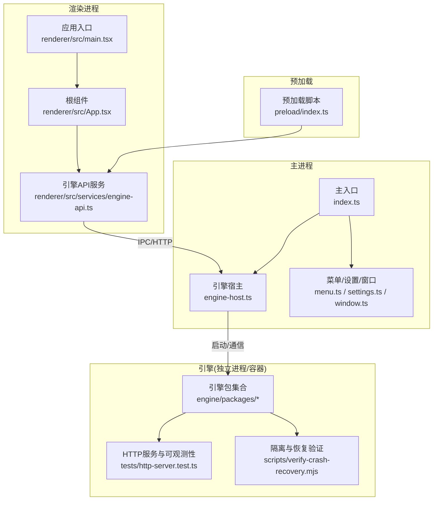
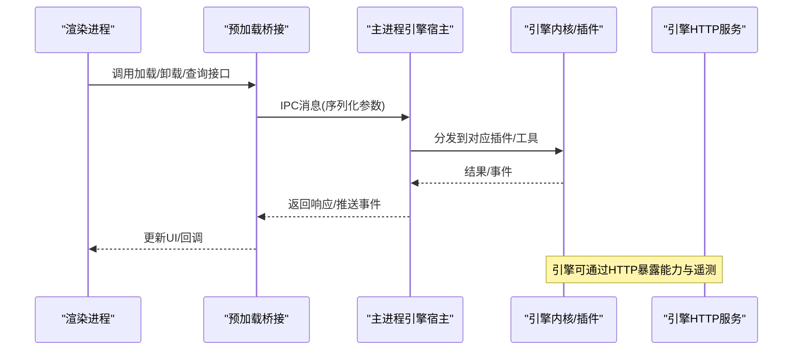
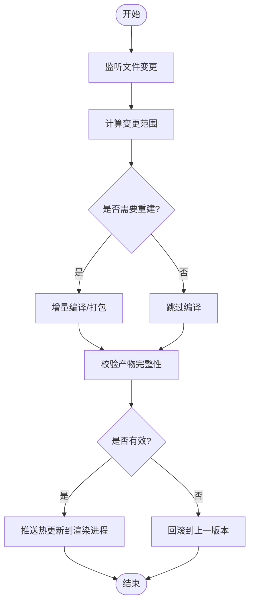
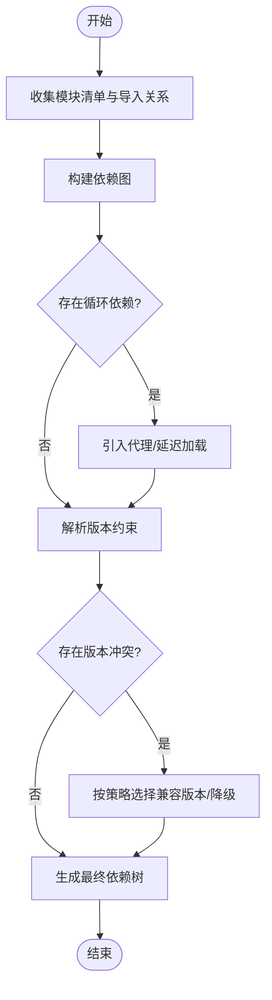
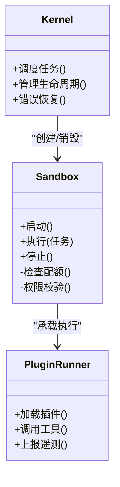
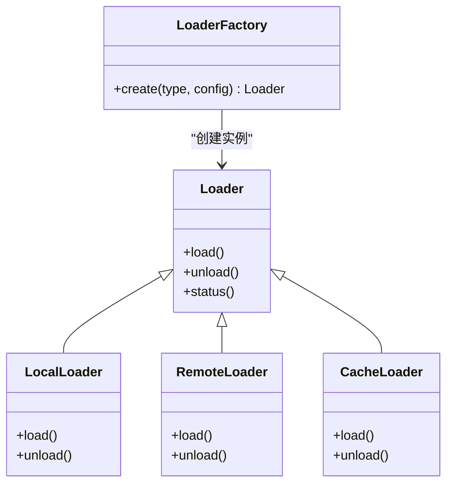
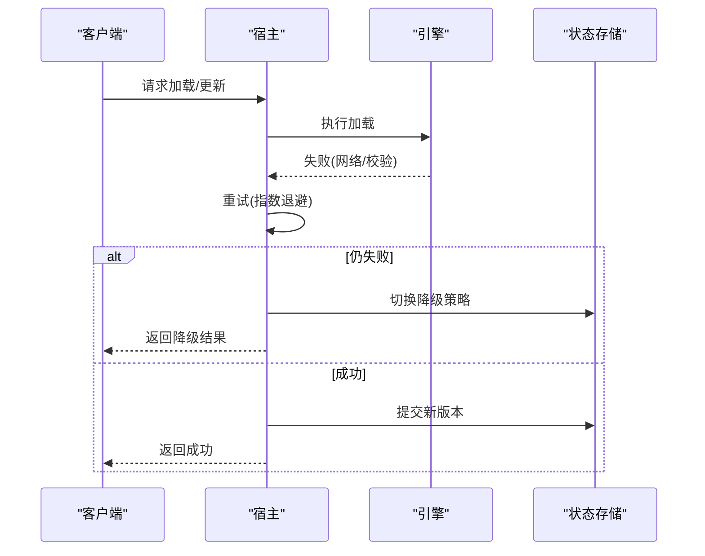
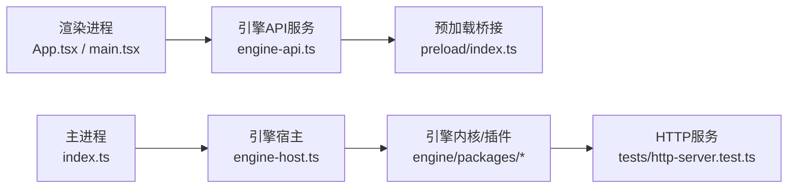

# 动态加载系统

<cite>
**本文引用的文件**   
- [engine-host.ts](file://app/main/engine-host.ts)
- [index.ts](file://app/main/index.ts)
- [menu.ts](file://app/main/menu.ts)
- [settings.ts](file://app/main/settings.ts)
- [window.ts](file://app/main/window.ts)
- [index.ts](file://app/preload/index.ts)
- [App.tsx](file://app/renderer/src/App.tsx)
- [main.tsx](file://app/renderer/src/main.tsx)
- [engine-api.ts](file://app/renderer/src/services/engine-api.ts)
- [package.json](file://app/package.json)
- [electron.vite.config.ts](file://app/electron.vite.config.ts)
- [README.md](file://engine/README.md)
- [package.json](file://engine/package.json)
- [tsconfig.json](file://engine/tsconfig.json)
- [pnpm-workspace.yaml](file://engine/pnpm-workspace.yaml)
- [Dockerfile](file://engine/Dockerfile)
- [docker-compose.yml](file://engine/docker-compose.yml)
- [verify-crash-recovery.mjs](file://engine/scripts/verify-crash-recovery.mjs)
- [runtime-kernel-isolation.test.ts](file://engine/tests/runtime-kernel-isolation.test.ts)
- [plugin-host.test.ts](file://engine/tests/plugin-host.test.ts)
- [tool-runtime-v3.test.ts](file://engine/tests/tool-runtime-v3.test.ts)
- [http-server.test.ts](file://engine/tests/http-server.test.ts)
</cite>

## 目录
1. [简介](#简介)
2. [项目结构](#项目结构)
3. [核心组件](#核心组件)
4. [架构总览](#架构总览)
5. [详细组件分析](#详细组件分析)
6. [依赖关系分析](#依赖关系分析)
7. [性能考虑](#性能考虑)
8. [故障排除指南](#故障排除指南)
9. [结论](#结论)
10. [附录](#附录)

## 简介
本技术文档围绕KCoder的动态加载系统，系统性阐述模块热重载、依赖解析、沙箱隔离、加载器设计模式、错误处理与恢复机制、API规范以及性能监控与调试方法。文档面向工程实践，既提供高层架构视图，也深入到关键实现路径与测试用例，帮助读者快速理解并扩展该动态加载能力。

## 项目结构
KCoder采用Electron多进程架构：主进程负责引擎宿主与窗口管理，渲染进程通过预加载脚本暴露安全API与引擎交互；引擎侧以monorepo形式组织，包含领域层、基础设施、HTTP服务、插件与工具运行时等。

图表来源
- [index.ts](file://app/main/index.ts)
- [engine-host.ts](file://app/main/engine-host.ts)
- [menu.ts](file://app/main/menu.ts)
- [settings.ts](file://app/main/settings.ts)
- [window.ts](file://app/main/window.ts)
- [index.ts](file://app/preload/index.ts)
- [main.tsx](file://app/renderer/src/main.tsx)
- [App.tsx](file://app/renderer/src/App.tsx)
- [engine-api.ts](file://app/renderer/src/services/engine-api.ts)
- [http-server.test.ts](file://engine/tests/http-server.test.ts)
- [verify-crash-recovery.mjs](file://engine/scripts/verify-crash-recovery.mjs)

章节来源
- [index.ts](file://app/main/index.ts)
- [engine-host.ts](file://app/main/engine-host.ts)
- [menu.ts](file://app/main/menu.ts)
- [settings.ts](file://app/main/settings.ts)
- [window.ts](file://app/main/window.ts)
- [index.ts](file://app/preload/index.ts)
- [main.tsx](file://app/renderer/src/main.tsx)
- [App.tsx](file://app/renderer/src/App.tsx)
- [engine-api.ts](file://app/renderer/src/services/engine-api.ts)
- [README.md](file://engine/README.md)
- [package.json](file://engine/package.json)
- [tsconfig.json](file://engine/tsconfig.json)
- [pnpm-workspace.yaml](file://engine/pnpm-workspace.yaml)
- [Dockerfile](file://engine/Dockerfile)
- [docker-compose.yml](file://engine/docker-compose.yml)

## 核心组件
- 引擎宿主（主进程）：负责生命周期管理、与引擎子进程的通信、事件转发与资源协调。
- 预加载桥接：在渲染进程与主进程之间建立安全通道，屏蔽底层细节。
- 渲染端引擎API：封装加载、卸载、状态查询、日志与遥测调用。
- 引擎内核与插件体系：提供插件注册、能力发现、工具运行时、HTTP服务与可观测性。
- 隔离与恢复：基于进程级隔离与持久化状态，支持崩溃恢复与回滚。

章节来源
- [engine-host.ts](file://app/main/engine-host.ts)
- [index.ts](file://app/preload/index.ts)
- [engine-api.ts](file://app/renderer/src/services/engine-api.ts)
- [README.md](file://engine/README.md)
- [plugin-host.test.ts](file://engine/tests/plugin-host.test.ts)
- [runtime-kernel-isolation.test.ts](file://engine/tests/runtime-kernel-isolation.test.ts)

## 架构总览
整体采用“渲染进程—预加载—主进程—引擎”的分层架构。渲染进程通过安全的预加载API访问引擎能力；主进程作为宿主协调引擎进程的生命周期；引擎内部通过插件与工具运行时扩展能力，并通过HTTP接口对外暴露。

图表来源
- [engine-api.ts](file://app/renderer/src/services/engine-api.ts)
- [index.ts](file://app/preload/index.ts)
- [engine-host.ts](file://app/main/engine-host.ts)
- [http-server.test.ts](file://engine/tests/http-server.test.ts)

## 详细组件分析

### 模块热重载（文件监听、变更检测、热更新）
- 文件监听：由构建期或运行期监听器捕获源文件变更事件，触发增量编译与产物更新。
- 变更检测：对变更范围进行差异计算，仅重新加载受影响模块，避免全量刷新。
- 热更新机制：通过主进程向渲染进程推送更新指令，渲染端按需替换模块实例，保持会话与状态。

图表来源
- [engine-api.ts](file://app/renderer/src/services/engine-api.ts)
- [engine-host.ts](file://app/main/engine-host.ts)

章节来源
- [engine-api.ts](file://app/renderer/src/services/engine-api.ts)
- [engine-host.ts](file://app/main/engine-host.ts)

### 依赖解析算法（依赖图、循环依赖检测、版本冲突解决）
- 依赖图构建：从模块清单与导入关系生成有向图，记录模块元数据与版本约束。
- 循环依赖检测：使用拓扑排序或深度优先搜索识别环，必要时引入虚拟代理或延迟加载打破环。
- 版本冲突解决：依据语义化版本策略选择兼容版本，必要时进行降级或提示用户。

图表来源
- [README.md](file://engine/README.md)
- [plugin-host.test.ts](file://engine/tests/plugin-host.test.ts)

章节来源
- [README.md](file://engine/README.md)
- [plugin-host.test.ts](file://engine/tests/plugin-host.test.ts)

### 沙箱隔离机制（进程隔离、内存限制、权限控制）
- 进程隔离：将插件与工具执行置于独立进程或容器，避免共享状态污染。
- 内存限制：为每个沙箱分配最大内存配额，超限则触发回收或终止。
- 权限控制：基于最小权限原则，限制文件系统、网络与系统调用访问。

图表来源
- [runtime-kernel-isolation.test.ts](file://engine/tests/runtime-kernel-isolation.test.ts)
- [verify-crash-recovery.mjs](file://engine/scripts/verify-crash-recovery.mjs)

章节来源
- [runtime-kernel-isolation.test.ts](file://engine/tests/runtime-kernel-isolation.test.ts)
- [verify-crash-recovery.mjs](file://engine/scripts/verify-crash-recovery.mjs)

### 加载器设计模式（插件架构、策略模式、工厂模式）
- 插件架构：定义统一插件契约，支持能力注册、生命周期钩子与配置注入。
- 策略模式：针对不同加载场景（本地、远程、缓存）选择相应策略。
- 工厂模式：根据模块类型或协议创建对应的加载器实例。

图表来源
- [plugin-host.test.ts](file://engine/tests/plugin-host.test.ts)
- [tool-runtime-v3.test.ts](file://engine/tests/tool-runtime-v3.test.ts)

章节来源
- [plugin-host.test.ts](file://engine/tests/plugin-host.test.ts)
- [tool-runtime-v3.test.ts](file://engine/tests/tool-runtime-v3.test.ts)

### 错误处理与恢复（重试、降级、回滚）
- 加载失败重试：对瞬时错误实施指数退避重试，超过阈值后进入降级。
- 降级策略：切换到备用加载源或只读模式，保证核心功能可用。
- 状态回滚：在热更新失败时回滚到上一个稳定版本，确保一致性。

图表来源
- [verify-crash-recovery.mjs](file://engine/scripts/verify-crash-recovery.mjs)
- [http-server.test.ts](file://engine/tests/http-server.test.ts)

章节来源
- [verify-crash-recovery.mjs](file://engine/scripts/verify-crash-recovery.mjs)
- [http-server.test.ts](file://engine/tests/http-server.test.ts)

### 动态加载API文档
- 加载接口
  - 功能：加载指定模块或插件，支持本地与远程源。
  - 输入：模块标识、版本约束、加载策略。
  - 输出：加载结果、实例句柄、元数据。
  - 异常：网络错误、校验失败、版本冲突。
- 卸载接口
  - 功能：释放模块资源，清理引用与事件订阅。
  - 输入：模块句柄或标识。
  - 输出：卸载确认。
  - 异常：资源未就绪、并发冲突。
- 状态查询接口
  - 功能：查询模块加载状态、健康度与遥测指标。
  - 输入：模块标识或过滤条件。
  - 输出：状态对象、指标列表。
- 事件与回调
  - 事件：加载完成、失败、热更新推送、状态变更。
  - 回调：异步操作结果通知。

章节来源
- [engine-api.ts](file://app/renderer/src/services/engine-api.ts)
- [index.ts](file://app/preload/index.ts)
- [engine-host.ts](file://app/main/engine-host.ts)

### 性能监控与调试工具
- 指标采集：CPU、内存、I/O、网络请求耗时与成功率。
- 链路追踪：跨进程与HTTP调用的traceID关联。
- 日志聚合：结构化日志与分级输出，便于定位问题。
- 调试面板：可视化模块状态、依赖图与热更新历史。

章节来源
- [http-server.test.ts](file://engine/tests/http-server.test.ts)
- [README.md](file://engine/README.md)

### 开发示例
- 示例一：加载本地插件
  - 步骤：准备插件清单与入口文件，调用加载接口，验证状态。
  - 参考路径：[plugin-host.test.ts](file://engine/tests/plugin-host.test.ts)
- 示例二：远程模块热更新
  - 步骤：监听变更，增量编译，推送热更新，渲染端替换模块。
  - 参考路径：[engine-api.ts](file://app/renderer/src/services/engine-api.ts), [engine-host.ts](file://app/main/engine-host.ts)
- 示例三：崩溃恢复与回滚
  - 步骤：模拟失败，触发重试与降级，回滚到稳定版本。
  - 参考路径：[verify-crash-recovery.mjs](file://engine/scripts/verify-crash-recovery.mjs)

章节来源
- [plugin-host.test.ts](file://engine/tests/plugin-host.test.ts)
- [engine-api.ts](file://app/renderer/src/services/engine-api.ts)
- [engine-host.ts](file://app/main/engine-host.ts)
- [verify-crash-recovery.mjs](file://engine/scripts/verify-crash-recovery.mjs)

## 依赖关系分析
- 主进程与渲染进程通过预加载桥接通信，降低安全风险。
- 引擎内部通过插件与工具运行时解耦能力扩展点。
- HTTP服务用于外部集成与可观测性。

图表来源
- [index.ts](file://app/main/index.ts)
- [engine-host.ts](file://app/main/engine-host.ts)
- [App.tsx](file://app/renderer/src/App.tsx)
- [main.tsx](file://app/renderer/src/main.tsx)
- [engine-api.ts](file://app/renderer/src/services/engine-api.ts)
- [index.ts](file://app/preload/index.ts)
- [http-server.test.ts](file://engine/tests/http-server.test.ts)

章节来源
- [index.ts](file://app/main/index.ts)
- [engine-host.ts](file://app/main/engine-host.ts)
- [App.tsx](file://app/renderer/src/App.tsx)
- [main.tsx](file://app/renderer/src/main.tsx)
- [engine-api.ts](file://app/renderer/src/services/engine-api.ts)
- [index.ts](file://app/preload/index.ts)
- [http-server.test.ts](file://engine/tests/http-server.test.ts)

## 性能考虑
- 增量编译与按需加载，减少冷启动时间。
- 依赖图缓存与懒加载，降低解析开销。
- 沙箱内存配额与GC策略优化，避免抖动。
- 事件驱动与批处理，减少频繁IPC调用。

## 故障排除指南
- 常见问题
  - 加载失败：检查模块清单、版本约束与网络连通性。
  - 热更新无效：确认增量产物签名与渲染端替换逻辑。
  - 崩溃恢复：查看回滚日志与状态一致性。
- 诊断步骤
  - 启用详细日志与链路追踪。
  - 使用状态查询接口获取模块健康度。
  - 复现问题并抓取快照，对比稳定版本差异。

章节来源
- [verify-crash-recovery.mjs](file://engine/scripts/verify-crash-recovery.mjs)
- [http-server.test.ts](file://engine/tests/http-server.test.ts)
- [engine-api.ts](file://app/renderer/src/services/engine-api.ts)

## 结论
KCoder的动态加载系统通过清晰的进程分层、插件化架构与完善的错误恢复机制，实现了高可用与可扩展的模块管理能力。结合热重载与依赖解析优化，可在保证稳定性的同时提升开发效率与用户体验。

## 附录
- 构建与部署
  - 使用pnpm工作区管理多包依赖。
  - 通过Docker与docker-compose编排引擎服务。
- 配置文件
  - 引擎配置示例与TS配置说明。

章节来源
- [package.json](file://app/package.json)
- [electron.vite.config.ts](file://app/electron.vite.config.ts)
- [package.json](file://engine/package.json)
- [tsconfig.json](file://engine/tsconfig.json)
- [pnpm-workspace.yaml](file://engine/pnpm-workspace.yaml)
- [Dockerfile](file://engine/Dockerfile)
- [docker-compose.yml](file://engine/docker-compose.yml)