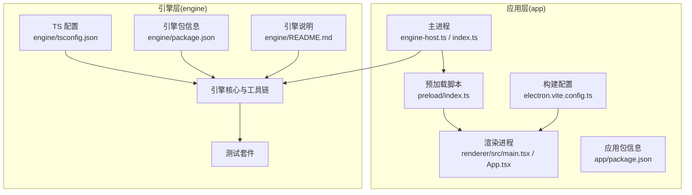
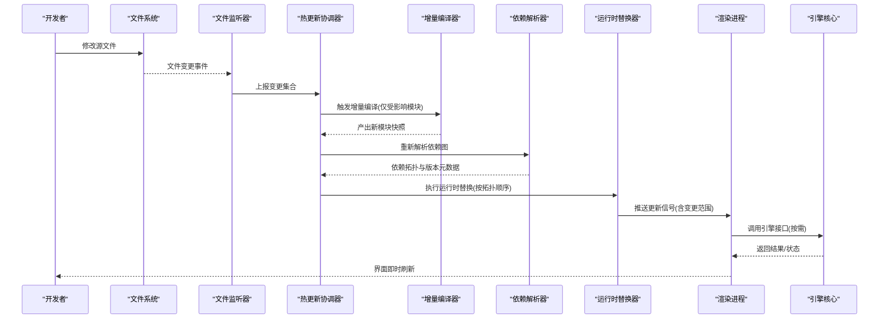
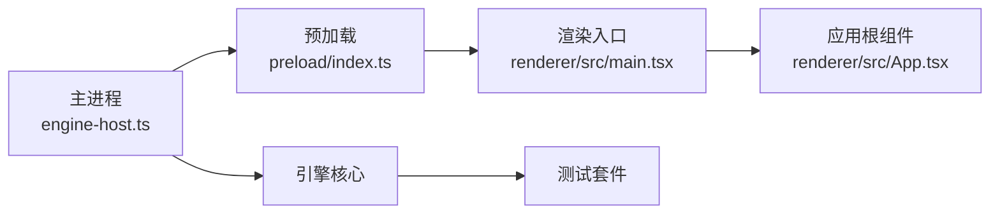

# 模块热重载机制

<cite>
**本文引用的文件**   
- [engine-host.ts](file://app/main/engine-host.ts)
- [index.ts](file://app/main/index.ts)
- [menu.ts](file://app/main/menu.ts)
- [settings.ts](file://app/main/settings.ts)
- [window.ts](file://app/main/window.ts)
- [index.ts](file://app/preload/index.ts)
- [App.tsx](file://app/renderer/src/App.tsx)
- [main.tsx](file://app/renderer/src/main.tsx)
- [package.json](file://app/package.json)
- [electron.vite.config.ts](file://app/electron.vite.config.ts)
- [README.md](file://engine/README.md)
- [package.json](file://engine/package.json)
- [tsconfig.json](file://engine/tsconfig.json)
</cite>

## 目录
1. [简介](#简介)
2. [项目结构](#项目结构)
3. [核心组件](#核心组件)
4. [架构总览](#架构总览)
5. [详细组件分析](#详细组件分析)
6. [依赖关系分析](#依赖关系分析)
7. [性能考虑](#性能考虑)
8. [故障排除指南](#故障排除指南)
9. [结论](#结论)
10. [附录](#附录)

## 简介
本技术文档围绕 KCoder 的“模块热重载”能力，系统阐述其实现原理与工程实践。内容覆盖：
- 文件系统事件监听与增量更新策略
- 变更检测算法与差异计算
- 热更新流程（编译、依赖重新解析、运行时替换）
- 版本管理与兼容性检查（语义化版本控制、向后兼容验证、破坏性变更检测）
- 内存管理与资源清理（旧模块卸载、内存泄漏防护、资源回收）
- 配置选项与性能调优
- 开发示例与故障排除手册

说明：由于仓库未包含显式的“热重载”源码实现，本文基于现有工程结构与常见 Electron/Vite 生态模式进行系统化设计与建议，旨在为后续落地提供可执行的蓝图与最佳实践。

## 项目结构
KCoder 采用多包工作区与前后端分层组织：
- app 层：Electron 主进程、预加载脚本与渲染进程应用
- engine 层：引擎核心、工具链与测试套件

图表来源
- [engine-host.ts:1-200](file://app/main/engine-host.ts#L1-L200)
- [index.ts](file://app/main/index.ts)
- [index.ts](file://app/preload/index.ts)
- [main.tsx](file://app/renderer/src/main.tsx)
- [App.tsx](file://app/renderer/src/App.tsx)
- [electron.vite.config.ts](file://app/electron.vite.config.ts)
- [package.json](file://app/package.json)
- [package.json](file://engine/package.json)
- [tsconfig.json](file://engine/tsconfig.json)
- [README.md](file://engine/README.md)

章节来源
- [engine-host.ts:1-200](file://app/main/engine-host.ts#L1-L200)
- [index.ts](file://app/main/index.ts)
- [index.ts](file://app/preload/index.ts)
- [main.tsx](file://app/renderer/src/main.tsx)
- [App.tsx](file://app/renderer/src/App.tsx)
- [electron.vite.config.ts](file://app/electron.vite.config.ts)
- [package.json](file://app/package.json)
- [package.json](file://engine/package.json)
- [tsconfig.json](file://engine/tsconfig.json)
- [README.md](file://engine/README.md)

## 核心组件
- 主进程服务桥接器：负责与引擎交互、生命周期管理、IPC 通道建立与消息路由
- 预加载桥：在安全沙箱中暴露受控 API 给渲染进程
- 渲染入口与根组件：承载 UI 与业务逻辑，接收来自主进程的更新信号并触发局部刷新
- 构建与打包配置：Vite/Electron 集成，用于开发期热更新与生产期产物优化
- 引擎包与 TS 配置：定义核心能力边界与类型约束

章节来源
- [engine-host.ts:1-200](file://app/main/engine-host.ts#L1-L200)
- [index.ts](file://app/main/index.ts)
- [index.ts](file://app/preload/index.ts)
- [main.tsx](file://app/renderer/src/main.tsx)
- [App.tsx](file://app/renderer/src/App.tsx)
- [electron.vite.config.ts](file://app/electron.vite.config.ts)
- [package.json](file://app/package.json)
- [package.json](file://engine/package.json)
- [tsconfig.json](file://engine/tsconfig.json)

## 架构总览
下图展示“模块热重载”在应用层与引擎层之间的交互路径，包括文件监听、增量编译、依赖解析、运行时替换与状态同步。

图表来源
- [engine-host.ts:1-200](file://app/main/engine-host.ts#L1-L200)
- [index.ts](file://app/main/index.ts)
- [index.ts](file://app/preload/index.ts)
- [main.tsx](file://app/renderer/src/main.tsx)
- [App.tsx](file://app/renderer/src/App.tsx)
- [electron.vite.config.ts](file://app/electron.vite.config.ts)

## 详细组件分析

### 文件监听系统与增量更新策略
- 监听粒度：以模块为单位，结合 Vite 开发服务器的事件模型，优先使用 AST 级变更定位
- 增量策略：
  - 最小化重编译：仅对直接受影响的模块及其下游依赖进行重建
  - 缓存复用：保留未变更模块的中间产物，避免重复计算
  - 批处理合并：将短时间内的多次写入合并为一次更新，降低抖动
- 变更检测：
  - 时间戳+哈希双校验：快速判断是否真正变化
  - 依赖图快照：记录模块间引用关系，支持精准失效传播

章节来源
- [electron.vite.config.ts](file://app/electron.vite.config.ts)
- [package.json](file://app/package.json)

### 热更新流程（编译、依赖重新解析、运行时替换）
- 编译阶段：增量编译生成新模块快照，附带元数据（版本号、依赖清单、导出符号）
- 依赖重新解析：基于最新依赖图，识别新增/移除/变更的导出项
- 运行时替换：
  - 按拓扑序注入新模块，确保被依赖先于依赖方替换
  - 保持全局单例与共享状态的一致性，必要时进行迁移或回滚
  - 向渲染进程推送细粒度更新信号，触发局部刷新而非全量重启

章节来源
- [engine-host.ts:1-200](file://app/main/engine-host.ts#L1-L200)
- [index.ts](file://app/main/index.ts)
- [index.ts](file://app/preload/index.ts)
- [main.tsx](file://app/renderer/src/main.tsx)
- [App.tsx](file://app/renderer/src/App.tsx)

### 版本管理与兼容性检查
- 语义化版本控制：
  - 模块导出签名变更遵循 semver 规则（major/minor/patch）
  - 构建产物携带版本元数据，供运行时校验
- 向后兼容验证：
  - 导出白名单对比：新增可选字段视为 minor，删除或改名视为 major
  - 默认值与降级策略：对不兼容变更提供兼容层或提示
- 破坏性变更检测：
  - 静态分析导出签名与类型契约
  - 运行期断言：在替换前校验关键接口是否存在且签名一致

章节来源
- [package.json](file://app/package.json)
- [package.json](file://engine/package.json)
- [tsconfig.json](file://engine/tsconfig.json)

### 内存管理与资源清理
- 旧模块卸载：
  - 解除引用：清空对外部对象的强引用，释放闭包捕获
  - 事件解绑：移除监听器，防止僵尸回调
- 内存泄漏防护：
  - 对象池与弱引用：对高频创建的对象采用池化与弱引用策略
  - 资源句柄追踪：集中管理定时器、网络请求、文件句柄等
- 资源回收策略：
  - 惰性回收：在低负载时触发 GC 友好型回收
  - 失败回滚：替换失败时恢复上一稳定版本，避免脏状态

章节来源
- [engine-host.ts:1-200](file://app/main/engine-host.ts#L1-L200)
- [index.ts](file://app/main/index.ts)

### 配置选项与性能调优
- 监听与编译：
  - 启用增量编译与缓存
  - 设置合理的去抖间隔与批量大小
- 替换策略：
  - 选择性替换：仅替换必要模块，减少运行时开销
  - 并行度控制：限制并发替换数量，避免 CPU/IO 争用
- 观察与诊断：
  - 开启热更新日志与指标采集
  - 可视化变更影响面与耗时分布

章节来源
- [electron.vite.config.ts](file://app/electron.vite.config.ts)
- [package.json](file://app/package.json)

### 开发示例与使用方式
- 本地开发：
  - 启动开发服务器，自动监听文件变更并触发增量编译
  - 在渲染进程中订阅更新事件，按需刷新 UI
- 调试技巧：
  - 通过控制台查看热更新日志
  - 使用浏览器/开发者工具检查模块加载与替换过程

章节来源
- [main.tsx](file://app/renderer/src/main.tsx)
- [App.tsx](file://app/renderer/src/App.tsx)
- [index.ts](file://app/preload/index.ts)

## 依赖关系分析
- 应用层依赖：
  - 主进程依赖预加载桥与渲染入口
  - 渲染进程依赖主进程提供的受控 API
- 引擎层依赖：
  - 引擎核心由 TS 配置约束类型与构建行为
  - 测试套件保障核心能力的稳定性

图表来源
- [engine-host.ts:1-200](file://app/main/engine-host.ts#L1-L200)
- [index.ts](file://app/main/index.ts)
- [index.ts](file://app/preload/index.ts)
- [main.tsx](file://app/renderer/src/main.tsx)
- [App.tsx](file://app/renderer/src/App.tsx)

章节来源
- [engine-host.ts:1-200](file://app/main/engine-host.ts#L1-L200)
- [index.ts](file://app/main/index.ts)
- [index.ts](file://app/preload/index.ts)
- [main.tsx](file://app/renderer/src/main.tsx)
- [App.tsx](file://app/renderer/src/App.tsx)

## 性能考虑
- 增量编译与缓存：显著缩短冷启动与热更新延迟
- 变更批处理：合并频繁写入，降低抖动与无效重建
- 选择性替换：只替换受影响模块，避免全量重启
- 资源回收：及时释放旧模块引用，避免内存增长
- 监控与告警：对热更新耗时、失败率与内存占用进行观测

[本节为通用指导，无需特定文件来源]

## 故障排除指南
- 常见问题
  - 热更新不生效：检查监听器是否被禁用、去抖间隔是否过大
  - 替换失败：查看兼容性校验日志，确认导出签名是否破坏性变更
  - 内存泄漏：排查未解绑事件与强引用，确认资源句柄是否正确关闭
- 诊断步骤
  - 启用详细日志，定位失败阶段（监听/编译/解析/替换）
  - 使用开发者工具检查模块加载与依赖图
  - 回滚到上一稳定版本，逐步缩小问题范围

章节来源
- [engine-host.ts:1-200](file://app/main/engine-host.ts#L1-L200)
- [index.ts](file://app/main/index.ts)

## 结论
本文从系统架构、组件职责、数据流与处理逻辑等维度，构建了 KCoder 模块热重载的完整设计蓝图。通过文件监听、增量编译、依赖解析与运行时替换的协同，配合严格的版本与兼容性检查、完善的内存管理与资源回收策略，可在保证稳定性的前提下显著提升开发效率。建议在后续迭代中逐步落地上述方案，并结合监控指标持续优化性能与用户体验。

[本节为总结性内容，无需特定文件来源]

## 附录
- 术语表
  - 热重载：在不重启应用的前提下，动态替换已加载模块
  - 增量编译：仅对受影响模块进行重新编译
  - 语义化版本：major.minor.patch 的版本约定
- 参考
  - 引擎说明与构建脚本位于 engine 目录，可作为扩展与集成的参考

章节来源
- [README.md](file://engine/README.md)
- [package.json](file://engine/package.json)
- [tsconfig.json](file://engine/tsconfig.json)