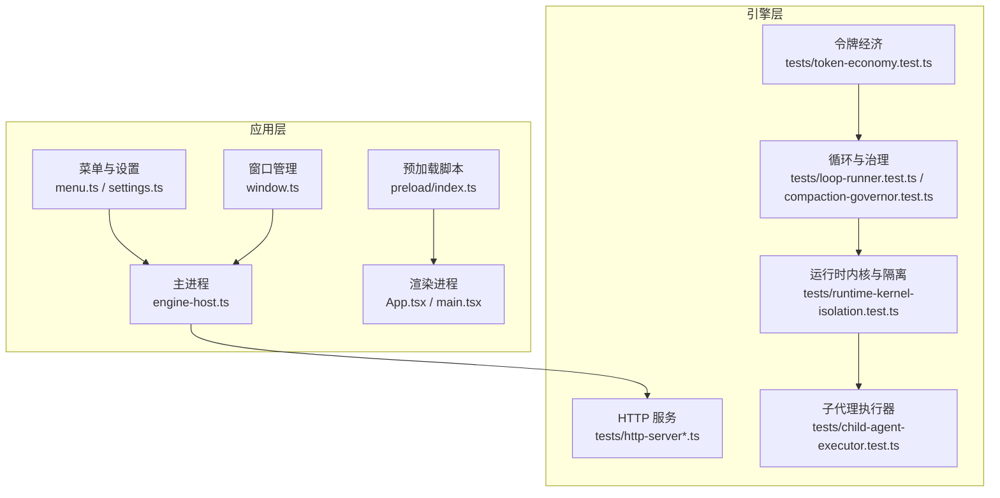
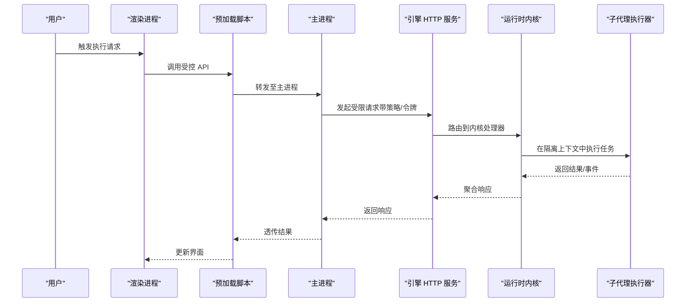
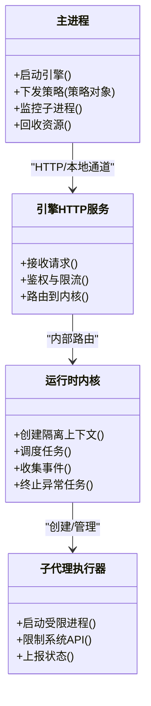
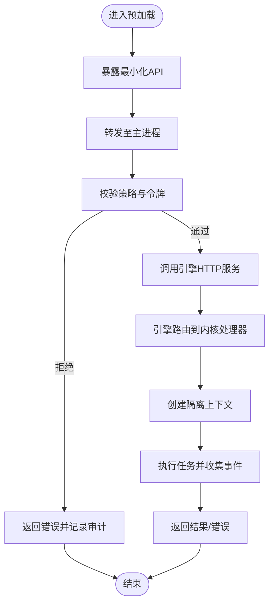
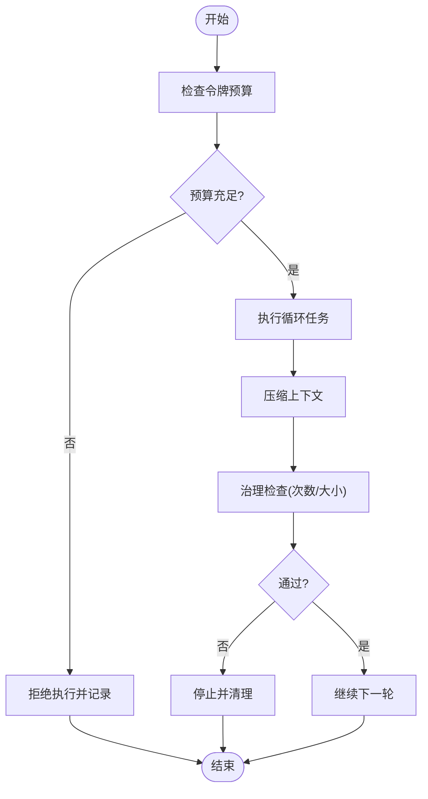
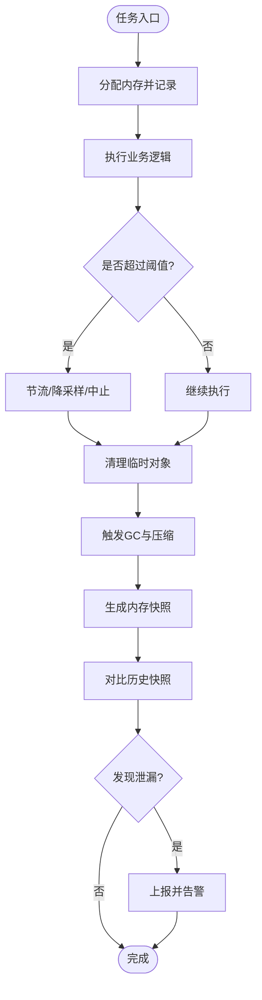
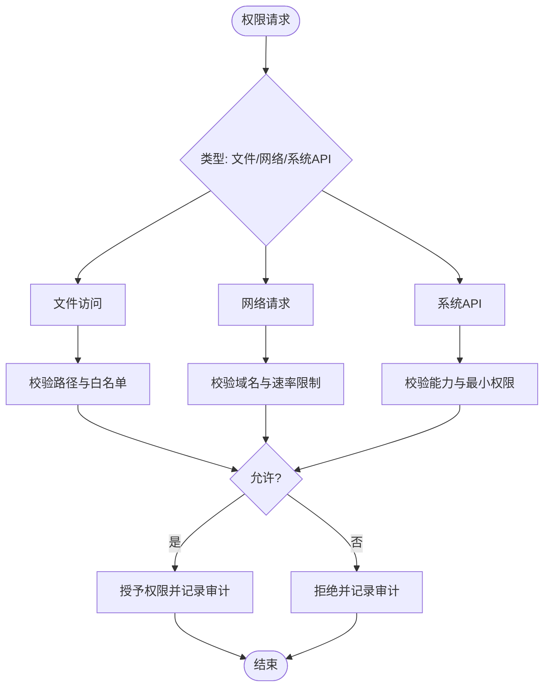
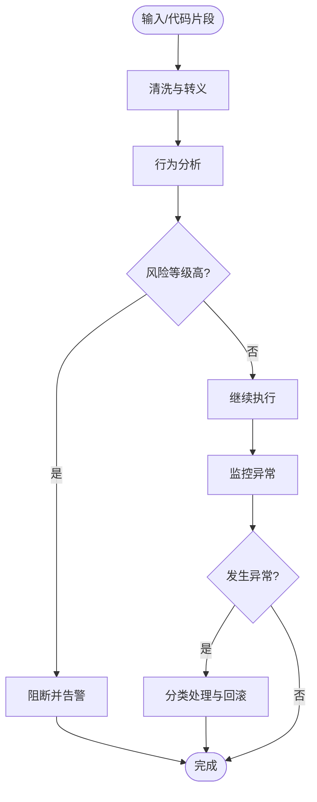
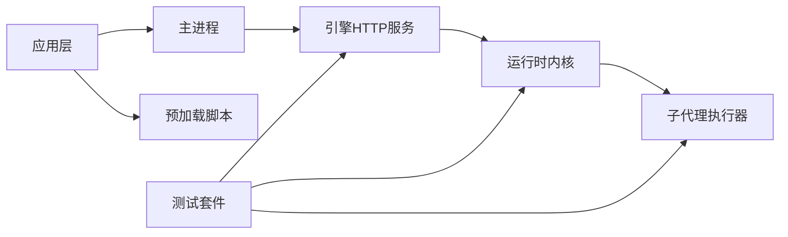

# 沙箱隔离机制

<cite>
**本文引用的文件**   
- [engine-host.ts](file://app/main/engine-host.ts)
- [index.ts](file://app/main/index.ts)
- [menu.ts](file://app/main/menu.ts)
- [settings.ts](file://app/main/settings.ts)
- [window.ts](file://app/main/window.ts)
- [index.ts](file://app/preload/index.ts)
- [package.json](file://app/package.json)
- [electron.vite.config.ts](file://app/electron.vite.config.ts)
- [Dockerfile](file://engine/Dockerfile)
- [docker-compose.yml](file://engine/docker-compose.yml)
- [config.example.json](file://engine/config.example.json)
- [README.md](file://engine/README.md)
- [runtime-kernel-isolation.test.ts](file://engine/tests/runtime-kernel-isolation.test.ts)
- [steering-queue-isolation.test.ts](file://engine/tests/steering-queue-isolation.test.ts)
- [child-agent-executor.test.ts](file://engine/tests/child-agent-executor.test.ts)
- [http-server-test-harness.ts](file://engine/tests/http-server-test-harness.ts)
- [http-server.test.ts](file://engine/tests/http-server.test.ts)
- [tool-runtime-v3.test.ts](file://engine/tests/tool-runtime-v3.test.ts)
- [delegation-runtime.test.ts](file://engine/tests/delegation-runtime.test.ts)
- [loop-runner.test.ts](file://engine/tests/loop-runner.test.ts)
- [compaction-governor.test.ts](file://engine/tests/compaction-governor.test.ts)
- [token-economy.test.ts](file://engine/tests/token-economy.test.ts)
</cite>

## 目录
1. [简介](#简介)
2. [项目结构](#项目结构)
3. [核心组件](#核心组件)
4. [架构总览](#架构总览)
5. [详细组件分析](#详细组件分析)
6. [依赖关系分析](#依赖关系分析)
7. [性能考量](#性能考量)
8. [故障排查指南](#故障排查指南)
9. [结论](#结论)
10. [附录](#附录)

## 简介
本技术文档聚焦于 KCoder 的沙箱隔离机制，围绕进程隔离、IPC 通信、资源限制、内存隔离策略、权限控制、安全边界与攻击防护、配置与安全策略定制、以及安全测试与漏洞扫描进行系统化说明。文档以工程实际代码为据，结合测试用例与运行环境（Electron 主进程 + Node.js 引擎）进行分析，帮助读者理解并正确使用沙箱能力。

## 项目结构
KCoder 采用 Electron 应用与独立引擎的双层架构：
- 应用层（Electron 主进程与渲染进程）负责 UI、菜单、设置、窗口管理与与引擎的交互。
- 引擎层（Node.js 多包工作区）提供运行时内核、工具执行、HTTP 服务、任务编排与可观测性。

图表来源
- [engine-host.ts:1-200](file://app/main/engine-host.ts#L1-L200)
- [index.ts:1-200](file://app/preload/index.ts#L1-L200)
- [http-server.test.ts:1-200](file://engine/tests/http-server.test.ts#L1-L200)
- [runtime-kernel-isolation.test.ts:1-200](file://engine/tests/runtime-kernel-isolation.test.ts#L1-L200)
- [child-agent-executor.test.ts:1-200](file://engine/tests/child-agent-executor.test.ts#L1-L200)
- [loop-runner.test.ts:1-200](file://engine/tests/loop-runner.test.ts#L1-L200)
- [compaction-governor.test.ts:1-200](file://engine/tests/compaction-governor.test.ts#L1-L200)
- [token-economy.test.ts:1-200](file://engine/tests/token-economy.test.ts#L1-L200)

章节来源
- [engine-host.ts:1-200](file://app/main/engine-host.ts#L1-L200)
- [index.ts:1-200](file://app/preload/index.ts#L1-L200)
- [menu.ts:1-200](file://app/main/menu.ts#L1-L200)
- [settings.ts:1-200](file://app/main/settings.ts#L1-L200)
- [window.ts:1-200](file://app/main/window.ts#L1-L200)
- [http-server.test.ts:1-200](file://engine/tests/http-server.test.ts#L1-L200)
- [runtime-kernel-isolation.test.ts:1-200](file://engine/tests/runtime-kernel-isolation.test.ts#L1-L200)
- [child-agent-executor.test.ts:1-200](file://engine/tests/child-agent-executor.test.ts#L1-L200)
- [loop-runner.test.ts:1-200](file://engine/tests/loop-runner.test.ts#L1-L200)
- [compaction-governor.test.ts:1-200](file://engine/tests/compaction-governor.test.ts#L1-L200)
- [token-economy.test.ts:1-200](file://engine/tests/token-economy.test.ts#L1-L200)

## 核心组件
- 主进程与引擎桥接：主进程通过 HTTP 或本地通道与引擎交互，承载沙箱生命周期与策略下发。
- 预加载与渲染隔离：预加载脚本暴露最小化 API 给渲染进程，避免直接访问敏感系统接口。
- 引擎运行时内核：提供任务编排、工具调用、事件总线与隔离上下文，确保执行边界清晰。
- 子代理执行器：在受限环境中启动子进程或轻量执行单元，实现进程级隔离。
- HTTP 服务与传输：作为主进程与引擎之间的可靠通信面，支持鉴权、限流与审计。
- 治理与预算：循环治理、压缩治理与令牌经济共同约束资源消耗与行为范围。

章节来源
- [engine-host.ts:1-200](file://app/main/engine-host.ts#L1-L200)
- [index.ts:1-200](file://app/preload/index.ts#L1-L200)
- [http-server.test.ts:1-200](file://engine/tests/http-server.test.ts#L1-L200)
- [runtime-kernel-isolation.test.ts:1-200](file://engine/tests/runtime-kernel-isolation.test.ts#L1-L200)
- [child-agent-executor.test.ts:1-200](file://engine/tests/child-agent-executor.test.ts#L1-L200)
- [loop-runner.test.ts:1-200](file://engine/tests/loop-runner.test.ts#L1-L200)
- [compaction-governor.test.ts:1-200](file://engine/tests/compaction-governor.test.ts#L1-L200)
- [token-economy.test.ts:1-200](file://engine/tests/token-economy.test.ts#L1-L200)

## 架构总览
下图展示从用户操作到沙箱执行的端到端流程，包括主进程、预加载、渲染进程、引擎 HTTP 服务、内核与子代理执行器的协作关系。

图表来源
- [engine-host.ts:1-200](file://app/main/engine-host.ts#L1-L200)
- [index.ts:1-200](file://app/preload/index.ts#L1-L200)
- [http-server.test.ts:1-200](file://engine/tests/http-server.test.ts#L1-L200)
- [runtime-kernel-isolation.test.ts:1-200](file://engine/tests/runtime-kernel-isolation.test.ts#L1-L200)
- [child-agent-executor.test.ts:1-200](file://engine/tests/child-agent-executor.test.ts#L1-L200)

## 详细组件分析

### 进程隔离与子进程管理
- 子代理执行器在受限环境中创建执行单元，限制其系统调用与资源访问，并通过事件总线与内核通信。
- 内核维护隔离上下文，确保每个任务的执行边界互不干扰，失败时快速回收。
- 主进程负责生命周期管理、重启与监控，保证整体稳定性。

图表来源
- [engine-host.ts:1-200](file://app/main/engine-host.ts#L1-L200)
- [http-server.test.ts:1-200](file://engine/tests/http-server.test.ts#L1-L200)
- [runtime-kernel-isolation.test.ts:1-200](file://engine/tests/runtime-kernel-isolation.test.ts#L1-L200)
- [child-agent-executor.test.ts:1-200](file://engine/tests/child-agent-executor.test.ts#L1-L200)

章节来源
- [child-agent-executor.test.ts:1-200](file://engine/tests/child-agent-executor.test.ts#L1-L200)
- [runtime-kernel-isolation.test.ts:1-200](file://engine/tests/runtime-kernel-isolation.test.ts#L1-L200)
- [engine-host.ts:1-200](file://app/main/engine-host.ts#L1-L200)

### IPC 通信与消息协议
- 预加载脚本向渲染进程暴露最小化 API，所有敏感操作均经主进程转发。
- 主进程与引擎之间通过 HTTP 服务进行结构化通信，包含鉴权、限流、审计字段。
- 内核与子代理之间使用事件驱动的消息协议，支持超时、重试与幂等处理。

图表来源
- [index.ts:1-200](file://app/preload/index.ts#L1-L200)
- [http-server.test.ts:1-200](file://engine/tests/http-server.test.ts#L1-L200)
- [runtime-kernel-isolation.test.ts:1-200](file://engine/tests/runtime-kernel-isolation.test.ts#L1-L200)

章节来源
- [index.ts:1-200](file://app/preload/index.ts#L1-L200)
- [http-server.test.ts:1-200](file://engine/tests/http-server.test.ts#L1-L200)
- [runtime-kernel-isolation.test.ts:1-200](file://engine/tests/runtime-kernel-isolation.test.ts#L1-L200)

### 资源限制与治理
- 循环治理与压缩治理控制任务迭代次数与上下文大小，防止无限循环与内存膨胀。
- 令牌经济对模型调用与工具执行进行配额管理，保障整体成本与性能可控。
- 主进程与内核协同监控 CPU、内存、I/O 与网络指标，超限则降级或终止。

图表来源
- [loop-runner.test.ts:1-200](file://engine/tests/loop-runner.test.ts#L1-L200)
- [compaction-governor.test.ts:1-200](file://engine/tests/compaction-governor.test.ts#L1-L200)
- [token-economy.test.ts:1-200](file://engine/tests/token-economy.test.ts#L1-L200)

章节来源
- [loop-runner.test.ts:1-200](file://engine/tests/loop-runner.test.ts#L1-L200)
- [compaction-governor.test.ts:1-200](file://engine/tests/compaction-governor.test.ts#L1-L200)
- [token-economy.test.ts:1-200](file://engine/tests/token-economy.test.ts#L1-L200)

### 内存隔离策略
- 内存分配限制：通过治理与预算机制限制单次任务与全局内存占用，避免 OOM。
- 垃圾回收控制：在关键路径后主动触发 GC 与上下文压缩，降低峰值内存。
- 内存泄漏检测：结合事件统计与快照对比，识别未释放资源与长生命周期对象。

图表来源
- [compaction-governor.test.ts:1-200](file://engine/tests/compaction-governor.test.ts#L1-L200)
- [token-economy.test.ts:1-200](file://engine/tests/token-economy.test.ts#L1-L200)

章节来源
- [compaction-governor.test.ts:1-200](file://engine/tests/compaction-governor.test.ts#L1-L200)
- [token-economy.test.ts:1-200](file://engine/tests/token-economy.test.ts#L1-L200)

### 权限控制系统
- 文件系统访问控制：仅允许访问白名单目录与虚拟路径，禁止越权读写。
- 网络请求限制：默认禁用外网访问，需显式授权；支持域名白名单与速率限制。
- 系统 API 调用权限：子代理执行器屏蔽危险系统调用，仅暴露必要能力。

图表来源
- [runtime-kernel-isolation.test.ts:1-200](file://engine/tests/runtime-kernel-isolation.test.ts#L1-L200)
- [http-server.test.ts:1-200](file://engine/tests/http-server.test.ts#L1-L200)
- [child-agent-executor.test.ts:1-200](file://engine/tests/child-agent-executor.test.ts#L1-L200)

章节来源
- [runtime-kernel-isolation.test.ts:1-200](file://engine/tests/runtime-kernel-isolation.test.ts#L1-L200)
- [http-server.test.ts:1-200](file://engine/tests/http-server.test.ts#L1-L200)
- [child-agent-executor.test.ts:1-200](file://engine/tests/child-agent-executor.test.ts#L1-L200)

### 安全边界与攻击防护
- 代码注入防护：输入校验与模板转义，禁止动态执行不受信任的代码片段。
- 恶意行为检测：基于规则与启发式的行为分析，识别异常模式并自动阻断。
- 异常处理机制：统一捕获与分类，提供恢复策略与回滚能力，避免状态不一致。

图表来源
- [runtime-kernel-isolation.test.ts:1-200](file://engine/tests/runtime-kernel-isolation.test.ts#L1-L200)
- [http-server.test.ts:1-200](file://engine/tests/http-server.test.ts#L1-L200)

章节来源
- [runtime-kernel-isolation.test.ts:1-200](file://engine/tests/runtime-kernel-isolation.test.ts#L1-L200)
- [http-server.test.ts:1-200](file://engine/tests/http-server.test.ts#L1-L200)

### 沙箱配置选项与安全策略定制
- 环境变量与配置文件：通过示例配置定义默认策略，如网络白名单、文件根目录、令牌预算上限。
- 运行时策略：在主进程或内核中动态调整限额、开关功能、扩展白名单。
- 容器化部署：使用 Docker 与 Compose 固化运行环境与依赖，便于一致性与安全基线。

章节来源
- [config.example.json:1-200](file://engine/config.example.json#L1-L200)
- [Dockerfile:1-200](file://engine/Dockerfile#L1-L200)
- [docker-compose.yml:1-200](file://engine/docker-compose.yml#L1-L200)
- [README.md:1-200](file://engine/README.md#L1-L200)

## 依赖关系分析
- 应用层依赖 Electron 主进程与预加载脚本，渲染进程通过最小化 API 与主进程交互。
- 引擎层依赖 HTTP 服务、运行时内核与子代理执行器，形成清晰的职责分层。
- 测试套件覆盖隔离、治理、令牌经济与 HTTP 服务，验证安全边界与稳定性。

图表来源
- [engine-host.ts:1-200](file://app/main/engine-host.ts#L1-L200)
- [index.ts:1-200](file://app/preload/index.ts#L1-L200)
- [http-server.test.ts:1-200](file://engine/tests/http-server.test.ts#L1-L200)
- [runtime-kernel-isolation.test.ts:1-200](file://engine/tests/runtime-kernel-isolation.test.ts#L1-L200)
- [child-agent-executor.test.ts:1-200](file://engine/tests/child-agent-executor.test.ts#L1-L200)

章节来源
- [engine-host.ts:1-200](file://app/main/engine-host.ts#L1-L200)
- [index.ts:1-200](file://app/preload/index.ts#L1-L200)
- [http-server.test.ts:1-200](file://engine/tests/http-server.test.ts#L1-L200)
- [runtime-kernel-isolation.test.ts:1-200](file://engine/tests/runtime-kernel-isolation.test.ts#L1-L200)
- [child-agent-executor.test.ts:1-200](file://engine/tests/child-agent-executor.test.ts#L1-L200)

## 性能考量
- 合理设置令牌预算与循环上限，避免长时间占用与资源耗尽。
- 启用上下文压缩与定期 GC，降低内存峰值与抖动。
- 对 I/O 与网络请求进行批处理与缓存，减少外部依赖延迟。
- 监控关键指标（CPU、内存、I/O、网络），建立告警与自动熔断策略。

[本节为通用指导，无需具体文件引用]

## 故障排查指南
- 常见症状：任务被拒绝、执行超时、内存不足、网络不可达。
- 定位步骤：
  - 检查策略与令牌预算是否满足。
  - 查看 HTTP 服务日志与内核事件，确认路由与权限判定。
  - 审查子代理执行器状态与系统调用拦截记录。
- 恢复措施：
  - 调整限额与白名单，重启相关服务。
  - 清理上下文与临时对象，触发 GC。
  - 针对恶意行为进行阻断并记录审计。

章节来源
- [http-server.test.ts:1-200](file://engine/tests/http-server.test.ts#L1-L200)
- [runtime-kernel-isolation.test.ts:1-200](file://engine/tests/runtime-kernel-isolation.test.ts#L1-L200)
- [child-agent-executor.test.ts:1-200](file://engine/tests/child-agent-executor.test.ts#L1-L200)

## 结论
KCoder 的沙箱隔离机制通过主进程与引擎的分层设计、严格的权限控制、完善的治理与预算体系，实现了进程隔离、内存隔离与安全的执行环境。配合容器化部署与全面的测试套件，能够在复杂场景下保持稳定性与安全性。建议在生产环境中持续优化策略参数与监控告警，确保长期稳定运行。

[本节为总结，无需具体文件引用]

## 附录

### 安全测试用例清单
- 隔离与权限
  - 运行时内核隔离测试：验证上下文隔离与权限判定
  - 引导队列隔离测试：验证任务调度隔离
  - 子代理执行器测试：验证进程级隔离与系统调用限制
- 网络与服务
  - HTTP 服务测试：验证鉴权、限流与审计
  - HTTP 服务可观测性测试：验证指标与日志
- 治理与预算
  - 循环治理测试：验证循环上限与中断
  - 压缩治理测试：验证上下文压缩与内存控制
  - 令牌经济测试：验证配额与成本控制
- 工具与委托
  - 工具运行时 v3 测试：验证工具调用边界
  - 委托运行时测试：验证委托链路与权限传递

章节来源
- [runtime-kernel-isolation.test.ts:1-200](file://engine/tests/runtime-kernel-isolation.test.ts#L1-L200)
- [steering-queue-isolation.test.ts:1-200](file://engine/tests/steering-queue-isolation.test.ts#L1-L200)
- [child-agent-executor.test.ts:1-200](file://engine/tests/child-agent-executor.test.ts#L1-L200)
- [http-server.test.ts:1-200](file://engine/tests/http-server.test.ts#L1-L200)
- [http-server-test-harness.ts:1-200](file://engine/tests/http-server-test-harness.ts#L1-L200)
- [loop-runner.test.ts:1-200](file://engine/tests/loop-runner.test.ts#L1-L200)
- [compaction-governor.test.ts:1-200](file://engine/tests/compaction-governor.test.ts#L1-L200)
- [token-economy.test.ts:1-200](file://engine/tests/token-economy.test.ts#L1-L200)
- [tool-runtime-v3.test.ts:1-200](file://engine/tests/tool-runtime-v3.test.ts#L1-L200)
- [delegation-runtime.test.ts:1-200](file://engine/tests/delegation-runtime.test.ts#L1-L200)

### 漏洞扫描与合规检查建议
- 静态分析：集成 ESLint 与 TypeScript 严格模式，检查潜在安全问题。
- 依赖审计：使用 pnpm audit 或等效工具扫描已知漏洞。
- 容器镜像扫描：在构建阶段扫描基础镜像与依赖包。
- 运行时检测：开启内核与 HTTP 服务的可观测性，采集异常与告警。

章节来源
- [package.json:1-200](file://app/package.json#L1-L200)
- [Dockerfile:1-200](file://engine/Dockerfile#L1-L200)
- [docker-compose.yml:1-200](file://engine/docker-compose.yml#L1-L200)
- [README.md:1-200](file://engine/README.md#L1-L200)